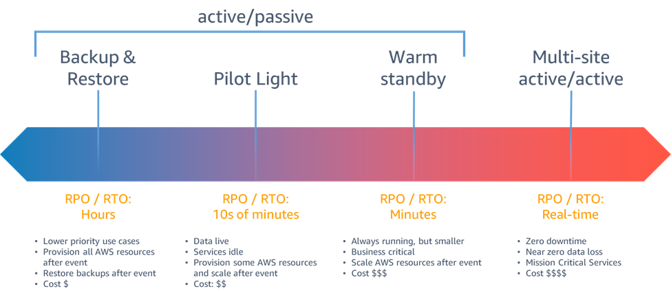
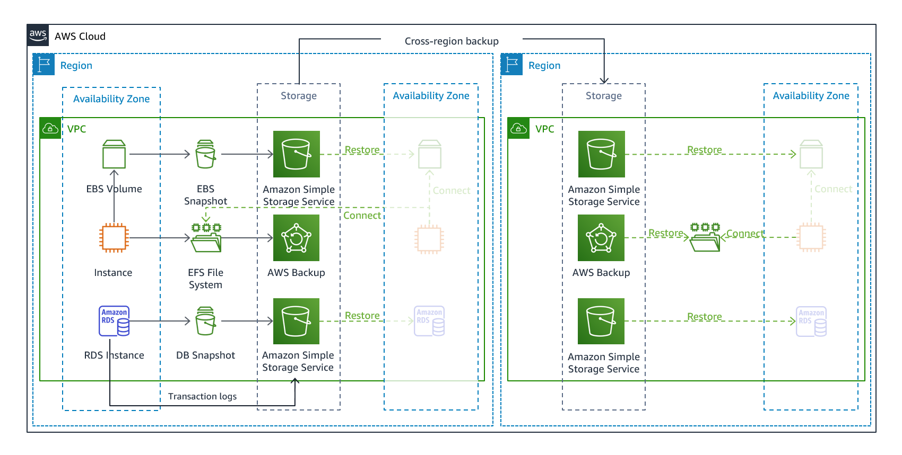
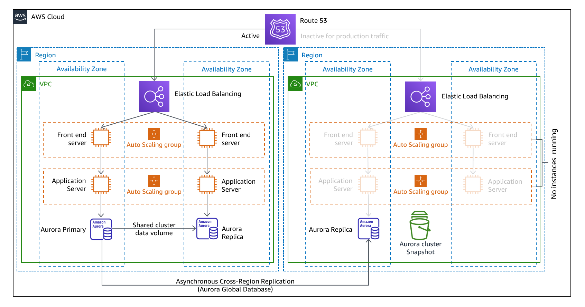
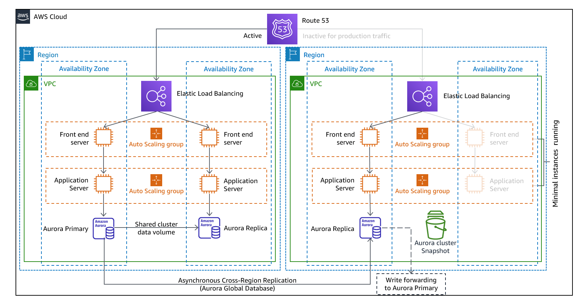

# AWS Certified Solutions Architect - Associate (SAA-C03)

# [Opciones de recuperación de desastres en la nube](https://docs.aws.amazon.com/es_es/whitepapers/latest/disaster-recovery-workloads-on-aws/disaster-recovery-options-in-the-cloud.html)

La recuperación ante desastres (Disaster Recovery o **DR**) comprende el
conjunto de estrategias y procedimientos que permiten restaurar una
aplicación y sus datos cuando ocurre una interrupción grave, como la
pérdida de una región, una zona de disponibilidad, un centro de datos o
un error crítico de la infraestructura.

Al diseñar una estrategia de DR es importante definir dos métricas
fundamentales:

-   **RTO (Recovery Time Objective):** Tiempo máximo aceptable para
    restaurar el servicio después de un desastre.
-   **RPO (Recovery Point Objective):** Cantidad máxima de datos que la
    organización está dispuesta a perder, medida como el tiempo
    transcurrido desde la última copia o replicación válida.

En AWS existen cuatro estrategias principales de recuperación ante
desastres, cada una con diferentes costos, niveles de complejidad y
tiempos de recuperación.

# Copia de seguridad y restauración (Backup and Restore)

Esta es la estrategia más sencilla y económica de implementar.

Consiste en realizar copias de seguridad periódicas de los datos y
almacenarlas de forma segura, normalmente en otra Zona de Disponibilidad
o en otra Región de AWS. Si ocurre un desastre, la infraestructura se
vuelve a crear desde cero y posteriormente se restauran los datos desde
las copias de seguridad.

Además de respaldar los datos, es recomendable almacenar también:

-   Infraestructura como código (Terraform, CloudFormation, CDK, etc.).
-   Configuración de servidores y aplicaciones.
-   Código fuente.
-   Imágenes de contenedores.
-   Secretos y parámetros de configuración.

El uso de **Infraestructura como Código (IaC)** permite reconstruir el
entorno de manera rápida, consistente y reduciendo errores manuales.

## Características

### Ventajas

-   Es la estrategia de menor costo.
-   Implementación sencilla.
-   Adecuada para aplicaciones no críticas.
-   Fácil de mantener.

### Desventajas

-   Mayor tiempo de recuperación.
-   Es necesario reconstruir toda la infraestructura.
-   Puede existir pérdida de datos dependiendo de la frecuencia de los respaldos.

### Objetivos

-   **RTO:** Horas.
-   **RPO:** Horas (o minutos, dependiendo de la frecuencia de las copias).

### Servicios AWS más utilizados

-   AWS Backup
-   Amazon S3
-   Amazon EBS Snapshots
-   Amazon RDS Snapshots
-   Amazon DynamoDB Backup
-   AWS Elastic Disaster Recovery (AWS DRS)
-   AWS CloudFormation o Terraform

# Luz Piloto (Pilot Light)

La estrategia **Pilot Light** mantiene únicamente los componentes esenciales de la 
aplicación ejecutándose permanentemente en la región de recuperación.

Generalmente permanecen activos:

-   Bases de datos.
-   Almacenamiento de objetos.
-   Replicación de datos.
-   Configuración de red.
-   Componentes críticos de autenticación.

Los servidores de aplicaciones, balanceadores de carga y demás recursos
de cómputo permanecen apagados (o simplemente no desplegados) hasta que
ocurre un desastre.

Cuando se requiere una recuperación, estos recursos se crean rápidamente
utilizando IaC y posteriormente se escalan para soportar la carga de
producción.

En AWS resulta más eficiente **no mantener recursos detenidos**, sino
recrearlos automáticamente cuando son necesarios mediante Terraform,
CloudFormation o Auto Scaling.

## Características

### Ventajas

-   Menor costo que mantener una infraestructura completa.
-   Recuperación considerablemente más rápida que Backup & Restore.
-   La base de datos ya está sincronizada.

### Desventajas

-   El proceso de recuperación aún requiere desplegar servidores y
    servicios.
-   Es necesario automatizar completamente el aprovisionamiento.

### Objetivos

-   **RTO:** Decenas de minutos.
-   **RPO:** Minutos.

### Servicios AWS más utilizados

-   Amazon RDS Read Replica
-   Amazon Aurora Global Database
-   Amazon S3 Cross-Region Replication
-   DynamoDB Global Tables
-   Auto Scaling
-   AWS CloudFormation / Terraform

# Espera Semi-Activa (Warm Standby)

La estrategia **Warm Standby** consiste en mantener una copia reducida,
pero completamente funcional, del entorno de producción en una segunda
región.

A diferencia de Pilot Light, aquí toda la aplicación ya está desplegada
y operativa, aunque con una capacidad reducida para minimizar costos.

Durante una conmutación por error únicamente es necesario aumentar la
capacidad de la infraestructura mediante Auto Scaling, incrementando el
número de instancias o la capacidad de los servicios administrados.

Esto permite reducir considerablemente el tiempo de recuperación y
facilita la realización de pruebas periódicas del plan de recuperación.

## Características

### Ventajas

-   Recuperación muy rápida.
-   Permite validar continuamente el entorno secundario.
-   Menor riesgo operativo.

### Desventajas

-   Costos mayores que Pilot Light.
-   Requiere mantener infraestructura activa permanentemente.

### Objetivos

-   **RTO:** Minutos.
-   **RPO:** Segundos o minutos.

### Servicios AWS más utilizados

-   Auto Scaling
-   Amazon RDS Multi-Region
-   Aurora Global Database
-   DynamoDB Global Tables
-   Elastic Load Balancing
-   Route 53 Failover Routing

# Activa-Activa Multisitio (Multi-Site Active/Active)

Esta es la estrategia de mayor disponibilidad y la más costosa de
implementar.

 

La aplicación se encuentra completamente desplegada y operativa en dos o
más regiones de AWS, atendiendo tráfico de usuarios de forma simultánea.

Cada región puede atender solicitudes de manera independiente y, si una
región deja de estar disponible, las demás continúan ofreciendo el
servicio sin necesidad de realizar una recuperación manual.

Esta estrategia requiere que los datos permanezcan sincronizados entre
todas las regiones mediante mecanismos de replicación de baja latencia.

## Características

### Ventajas

-   Máxima disponibilidad.
-   Recuperación prácticamente inmediata.
-   Excelente experiencia para usuarios distribuidos geográficamente.
-   Permite distribuir la carga entre múltiples regiones.

### Desventajas

-   Es la estrategia más costosa.
-   Mayor complejidad de diseño y operación.
-   La sincronización de datos requiere un diseño cuidadoso.

### Objetivos

-   **RTO:** Casi cero.
-   **RPO:** Casi cero (dependiendo del mecanismo de replicación).

### Servicios AWS más utilizados

-   Amazon Route 53 (Latency, Geolocation o Weighted Routing)
-   AWS Global Accelerator
-   Amazon Aurora Global Database
-   DynamoDB Global Tables
-   Amazon S3 Multi-Region Access Points (MRAP)
-   Amazon ElastiCache Global Datastore
-   Amazon CloudFront

## ¿Cuál elegir?

-   **Backup & Restore:** aplicaciones internas o de baja criticidad.
-   **Pilot Light:** aplicaciones importantes que requieren recuperación
    rápida sin mantener toda la infraestructura activa.
-   **Warm Standby:** aplicaciones críticas con RTO de minutos.
-   **Active-Active:** aplicaciones de misión crítica con disponibilidad
    prácticamente continua.

En la práctica, muchas organizaciones combinan varias estrategias según
la criticidad de cada aplicación para equilibrar costos, complejidad y
objetivos de continuidad del negocio.
