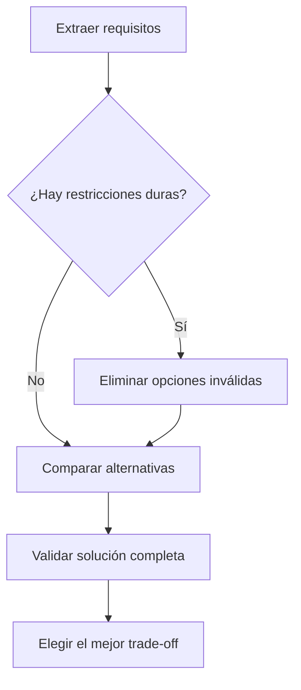

# Toma de decisiones arquitectónicas en AWS para el examen SAA-C03

## 1. Alcance necesario para el examen

El SAA-C03 no evalúa únicamente si se conocen las características de un servicio. Valida principalmente la capacidad de:

- Diseñar soluciones que satisfagan requisitos actuales y necesidades futuras.
- Seleccionar servicios y configuraciones según restricciones concretas.
- Diseñar arquitecturas seguras, resilientes, de alto rendimiento y optimizadas en costos.
- Revisar una solución existente e identificar mejoras.
- Reconocer compensaciones -*trade-offs*- entre disponibilidad, rendimiento, costo, seguridad y complejidad.
- Elegir una solución administrada cuando reduce operación sin incumplir requisitos.
- Evitar puntos únicos de fallo.
- Justificar por qué una opción es mejor que alternativas técnicamente posibles.

### Dominios oficiales y ponderación

| Dominio | Ponderación | Pregunta arquitectónica principal |
|---|---:|---|
| Diseñar arquitecturas seguras | 30 % | ¿Cómo proteger identidades, red, aplicaciones y datos? |
| Diseñar arquitecturas resilientes | 26 % | ¿Cómo escalar, desacoplar y sobrevivir a fallos? |
| Diseñar arquitecturas de alto rendimiento | 24 % | ¿Qué tecnología y configuración satisfacen la demanda? |
| Diseñar arquitecturas optimizadas en costos | 20 % | ¿Cuál es la solución válida con el menor costo total? |

> **Regla de examen:** la respuesta correcta debe cumplir **todos** los requisitos explícitos. Una opción más económica, rápida o sencilla deja de ser válida si incumple seguridad, RPO, RTO, disponibilidad, compatibilidad o rendimiento.

---

## 2. Modelo fundamental de decisión

Una decisión arquitectónica comienza con los requisitos, no con un servicio favorito.

| Elemento | Pregunta | Ejemplo |
|---|---|---|
| Resultado de negocio | ¿Qué debe conseguir la organización? | Vender sin interrupciones durante una campaña |
| Requisito funcional | ¿Qué debe hacer el sistema? | Recibir pedidos y procesar pagos |
| Requisito no funcional | ¿Con qué calidad debe hacerlo? | Responder en menos de 200 ms |
| Restricción | ¿Qué condición no se puede incumplir? | Los datos deben permanecer en una región |
| Patrón de carga | ¿Cómo cambia la demanda? | Picos impredecibles de hasta 20 veces |
| Dependencia | ¿De qué componentes externos depende? | Proveedor de pagos y base relacional |
| Riesgo | ¿Qué puede fallar y cuál es su impacto? | Caída de una AZ o duplicación de pedidos |
| Criterio de éxito | ¿Cómo se comprobará el resultado? | Latencia p95, tasa de error y RTO medidos |

### Requisitos duros frente a preferencias

| Tipo | Tratamiento |
|---|---|
| Requisito duro | Elimina cualquier opción que no lo cumpla |
| Preferencia | Sirve para desempatar entre opciones válidas |
| Suposición | Debe identificarse; no se debe tratar como un hecho |
| Requisito futuro | Debe considerarse sin sobredimensionar innecesariamente |

Ejemplos de requisitos duros:

- “Debe utilizar NFS.”
- “No se permite internet público.”
- “RPO menor de 1 minuto.”
- “Se requiere compatibilidad con Oracle.”
- “La aplicación no puede modificarse.”
- “Debe resistir la pérdida de una región.”

Ejemplos de preferencias:

- “Con el menor esfuerzo operativo.”
- “Con el menor costo.”
- “Con cambios mínimos.”
- “Utilizando servicios administrados.”

### Regla mental inicial

### La solución correcta no siempre es la más potente

- Una arquitectura Multi-Region puede ser innecesaria si el requisito solo exige tolerar la pérdida de una AZ.
- Una base con IOPS provisionadas puede desperdiciar dinero si la carga es pequeña e impredecible.
- Kubernetes puede agregar complejidad sin aportar valor cuando una función o un servicio de ECS satisface el requisito.
- Un enlace Direct Connect puede ser excesivo si solo se necesita cifrado rápido de implementar sobre internet.
- Una caché agrega componentes, consistencia y operación; se justifica cuando resuelve una necesidad medible.

> **Regla de arquitectura:** elegir la alternativa más sencilla que satisfaga los requisitos actuales y previstos, manteniendo margen razonable para evolucionar.

---

## 3. AWS Well-Architected Framework como marco de evaluación

AWS Well-Architected permite evaluar los beneficios y riesgos de las decisiones mediante seis pilares.

| Pilar | Objetivo | Preguntas para decidir |
|---|---|---|
| Excelencia operativa | Ejecutar, observar y mejorar la carga | ¿Se puede desplegar, monitorear, operar y recuperar de forma repetible? |
| Seguridad | Proteger datos, sistemas y activos | ¿Quién accede, desde dónde, a qué y bajo qué controles? |
| Confiabilidad | Funcionar correctamente y recuperarse de fallos | ¿Qué sucede si falla una instancia, AZ, región o dependencia? |
| Eficiencia del rendimiento | Utilizar recursos eficientemente según la demanda | ¿Cumple latencia, throughput y escala sin cuellos de botella? |
| Optimización de costos | Entregar valor al menor costo total | ¿Se paga por capacidad o características que no se necesitan? |
| Sostenibilidad | Minimizar el impacto ambiental | ¿Se evita capacidad o procesamiento innecesario? |

### Relación con el SAA-C03

- **Seguridad, confiabilidad, rendimiento y costos** aparecen directamente en los cuatro dominios del examen.
- **Excelencia operativa** influye en automatización, observabilidad, recuperación, cuotas y esfuerzo administrativo.
- **Sostenibilidad** no es un dominio independiente del SAA-C03, pero favorece diseños eficientes y sin sobreaprovisionamiento.

### Los pilares no son independientes

Una misma decisión puede mejorar un pilar y afectar otro:

| Decisión | Beneficio | Costo o riesgo |
|---|---|---|
| Desplegar en varias AZ | Mayor disponibilidad | Más transferencia y recursos |
| Replicar en otra región | Mejor DR y proximidad | Mayor costo y consistencia más compleja |
| Agregar caché | Menor latencia y carga | Invalidación y posible información obsoleta |
| Usar capacidad Spot | Menor costo | Interrupciones posibles |
| Cifrar con una clave KMS administrada por el cliente | Más control y auditoría | Permisos, cuotas y costo de solicitudes |
| Desacoplar con una cola | Absorbe picos y fallos temporales | Procesamiento asíncrono y eventual |
| Elegir un servicio administrado | Menor operación | Menor control de la infraestructura |

> **Trampa de examen:** “más altamente disponible” no significa automáticamente “mejor”. Se debe comparar con el nivel solicitado, el costo y la complejidad.

### Decisiones reversibles e irreversibles

AWS diferencia entre:

- **Two-way door:** decisión reversible; se puede probar, medir y cambiar con un proceso ligero.
- **One-way door:** decisión difícil o costosa de revertir; exige más análisis, evidencia y participación antes de adoptarla.

Ejemplos orientativos:

| Más reversible | Menos reversible |
|---|---|
| Ajustar el tamaño de una instancia | Adoptar una API propietaria en toda la organización |
| Cambiar una política de Auto Scaling | Elegir un modelo de datos difícil de migrar |
| Modificar un TTL de caché | Definir una estrategia irreversible de retención o eliminación |
| Probar una clase de cómputo | Firmar un compromiso de consumo sin una línea base |

La reversibilidad depende del contexto. Una tecnología no es intrínsecamente una *one-way door*; los datos, contratos, dependencias y habilidades pueden hacer que cambiarla sea costoso.

---

## 4. Método paso a paso para resolver una decisión

### Paso 1: identificar el verbo principal

El verbo revela la intención:

- **Diseñar:** seleccionar componentes y relaciones.
- **Migrar:** considerar compatibilidad, tiempo de inactividad y volumen.
- **Mejorar:** localizar la deficiencia de una arquitectura existente.
- **Reducir:** identificar qué métrica debe bajar: costo, latencia u operación.
- **Proteger:** identificar amenaza, activo y control.
- **Escalar:** identificar el componente y la métrica que provocan el escalado.
- **Recuperar:** identificar RPO, RTO y alcance del desastre.

### Paso 2: extraer restricciones antes de leer las opciones

Subrayar mentalmente:

- Protocolo obligatorio.
- Motor o formato existente.
- Región, AZ o residencia de datos.
- RTO y RPO.
- Latencia, throughput, IOPS o volumen.
- Frecuencia de acceso.
- Tolerancia a interrupciones.
- Cambios permitidos en la aplicación.
- Conectividad pública, privada o híbrida.
- Prioridad: costo, operación, rendimiento o disponibilidad.

### Paso 3: clasificar la carga

| Dimensión | Alternativas |
|---|---|
| Duración | Breve, persistente o por lotes |
| Estado | Stateless o stateful |
| Interacción | Síncrona o asíncrona |
| Demanda | Estable, programada, creciente o impredecible |
| Acceso a datos | Lectura, escritura, mixto, secuencial o aleatorio |
| Procesamiento | Transaccional, analítico, streaming o batch |
| Alcance | Una AZ, Multi-AZ, Multi-Region, edge o híbrido |
| Tolerancia | Interrumpible o no interrumpible |

### Paso 4: elegir primero el patrón y después el servicio

Ejemplos:

- “Absorber picos sin perder solicitudes” → **cola** → Amazon SQS.
- “Entregar un evento a varios consumidores” → **pub/sub** → Amazon SNS o Amazon EventBridge.
- “Contenido estático global” → **object storage + CDN** → Amazon S3 y CloudFront.
- “Aplicación web stateless” → **balanceo + escalado horizontal** → ELB y Auto Scaling, contenedores o serverless.
- “Lecturas repetidas con latencia muy baja” → **caché** → CloudFront, ElastiCache o caché de API según la capa.

### Paso 5: eliminar las opciones imposibles

Una sola contradicción explícita puede invalidar una respuesta:

- Single-AZ cuando se exige alta disponibilidad.
- S3 cuando la aplicación requiere un disco de bloques.
- Read Replica cuando el problema es failover automático de una instancia RDS.
- Spot como única capacidad para una carga no interrumpible.
- NAT Gateway cuando el requisito es aceptar conexiones entrantes desde internet.
- Security group para denegar explícitamente una IP.
- CloudFront cuando se requiere aceleración de tráfico TCP o UDP no basado en HTTP.

### Paso 6: comparar únicamente las opciones válidas

Orden recomendado:

1. Seguridad y cumplimiento.
2. Requisitos funcionales y compatibilidad.
3. Disponibilidad, durabilidad, RPO y RTO.
4. Rendimiento y escalabilidad.
5. Esfuerzo operativo.
6. Costo total.

Este orden no representa la ponderación exacta de todas las preguntas. Evita optimizar una solución que ya es inválida.

### Paso 7: validar la arquitectura completa

La disponibilidad de una capa no compensa un punto único de fallo en otra.

| Capa | Validación |
|---|---|
| Entrada | DNS, endpoint, aceleración, protección DDoS y failover |
| Red | Subredes, rutas, salida, firewall y conectividad híbrida |
| Cómputo | Distribución, escalado, estado y reemplazo |
| Integración | Buffer, reintentos, DLQ, orden y duplicados |
| Datos | Modelo, replicación, backup, cifrado y restauración |
| Identidad | Autenticación, autorización y menor privilegio |
| Operación | Métricas, logs, trazas, alarmas, cuotas y automatización |

### Paso 8: comprobar dependencias y límites

- ¿La base puede aceptar las conexiones que generará el cómputo?
- ¿El consumidor procesa la cola más rápido de lo que crece?
- ¿Las cuotas soportan un failover o un pico?
- ¿La clave KMS permite el acceso entre cuentas?
- ¿La región de recuperación tiene capacidad y configuración?
- ¿El DNS y sus TTL permiten cumplir el RTO?
- ¿La replicación cumple el RPO?

### Paso 9: elegir el mejor *trade-off*

Entre soluciones que cumplen todos los requisitos, favorecer la que:

- Requiere menos componentes innecesarios.
- Automatiza operación y recuperación.
- Escala de acuerdo con la demanda.
- Reduce capacidad ociosa.
- Limita el dominio de impacto.
- Puede observarse y probarse.
- Mantiene una ruta de evolución.

### Paso 10: revisar las palabras absolutas

Expresiones como las siguientes cambian la respuesta:

- “Menor costo.”
- “Menor latencia.”
- “Menor esfuerzo operativo.”
- “Sin modificar la aplicación.”
- “Inmediatamente.”
- “En tiempo real.”
- “Privado.”
- “Automático.”
- “No puede perder datos.”
- “Debe sobrevivir a la pérdida de una región.”

> **Trampa de examen:** dos opciones pueden funcionar, pero solo una optimiza exactamente la prioridad solicitada.

---

## 5. Plantilla para documentar una decisión

En un proyecto real, una decisión puede registrarse como un ADR -*Architecture Decision Record*-. Para el examen basta aplicar mentalmente una versión compacta.

| Campo | Contenido |
|---|---|
| Contexto | Problema, carga y situación actual |
| Requisitos | Funcionales, no funcionales y futuros |
| Restricciones | Condiciones que no se pueden incumplir |
| Opciones | Alternativas técnicamente válidas |
| Decisión | Patrón, servicios y configuración seleccionados |
| Justificación | Por qué satisface mejor las prioridades |
| Consecuencias | Beneficios, riesgos, costos y operación |
| Validación | Métricas, pruebas y criterios de aceptación |

### Ejemplo compacto

**Contexto:** una API recibe picos impredecibles y escribe trabajos que tardan varios minutos.

**Requisitos:**

- Responder rápidamente al cliente.
- No perder trabajos.
- Escalar trabajadores independientemente.
- Tolerar duplicados.

**Decisión:** desacoplar la API de los trabajadores con Amazon SQS; escalar consumidores según la profundidad y antigüedad de la cola.

**Consecuencias:**

- Se absorben picos y fallos temporales.
- El procesamiento es asíncrono.
- Los consumidores deben ser idempotentes.
- Se necesita una DLQ, alarmas y un visibility timeout adecuado.

---

## 6. Traducción de palabras clave a requisitos

| Palabra o frase | Interpretación arquitectónica |
|---|---|
| “Misión crítica” | Alta disponibilidad, recuperación probada y observabilidad |
| “Sin pérdida de datos” | RPO cercano a cero; verificar replicación y consistencia |
| “Milisegundos” | Servicio y capa de datos de baja latencia; posible caché o edge |
| “Picos impredecibles” | Elasticidad, buffering y capacidad bajo demanda |
| “Tráfico estable” | Capacidad provisionada y compromisos pueden ahorrar |
| “Uso esporádico” | Pago por uso, serverless o encendido programado |
| “Lecturas intensivas” | Réplicas, caché, CDN o modelo optimizado para lectura |
| “Escrituras intensivas” | Particionamiento, batching y eliminación de cuellos de botella |
| “Múltiples consumidores” | Pub/sub o event bus |
| “Procesar en orden” | FIFO, partición o secuenciación explícita |
| “Puede repetirse” | Idempotencia y deduplicación |
| “Aplicación heredada” | Compatibilidad y cambios mínimos antes que modernización total |
| “Sin administrar servidores” | Servicio administrado, Fargate o serverless |
| “Conservar IP de origen” | Revisar NLB y configuración de proxy |
| “Usuarios globales” | Edge, CDN, aceleración o arquitectura Multi-Region |
| “Tráfico privado” | Endpoint privado, VPC endpoint, PrivateLink, VPN o Direct Connect |
| “Datos recreables” | Puede aceptarse menor redundancia o almacenamiento más económico |
| “Datos regulados” | Clasificación, cifrado, auditoría, residencia y retención |
| “Cambios mínimos” | Mantener protocolo, motor, API o sistema de archivos compatible |

### Convertir términos vagos en métricas

| Término vago | Métrica útil |
|---|---|
| Rápido | Latencia p50, p95 y p99 |
| Disponible | Porcentaje de disponibilidad y alcance del fallo |
| Escalable | Solicitudes, mensajes, conexiones o datos por segundo |
| Durable | Probabilidad de pérdida y número de copias |
| Recuperable | RTO y RPO |
| Económico | Costo total mensual y por transacción |
| Seguro | Controles verificables, eventos auditados y superficie expuesta |
| Fácil de operar | Tiempo de despliegue, número de tareas manuales y MTTR |

---

## 7. Decisiones según el patrón de aplicación

### Aplicación web de varias capas

Patrón habitual:

- Entrada mediante DNS y balanceador.
- Frontend o servidores web distribuidos.
- Capa de aplicación stateless.
- Datos en un servicio persistente.
- Auto Scaling independiente por capa.
- Caché y CDN cuando el patrón de acceso lo justifica.

> **Regla de examen:** no guardar sesiones únicamente en una instancia si el tráfico se distribuye entre varias. Externalizar el estado permite reemplazo y escalado horizontal.

### Arquitectura orientada a eventos

Elegirla cuando:

- Los productores no necesitan una respuesta inmediata del consumidor.
- Los componentes deben escalar de forma independiente.
- Se deben absorber picos.
- Varios consumidores reaccionan a eventos.
- Se acepta consistencia eventual.

Considerar:

- Entrega al menos una vez.
- Idempotencia.
- Reintentos y *backoff*.
- DLQ.
- Orden y deduplicación.
- Edad de los mensajes.
- Observabilidad de extremo a extremo.

### Procesamiento por lotes

Elegirlo cuando:

- El trabajo puede acumularse.
- Importa el throughput más que la latencia individual.
- Los trabajos pueden dividirse.
- Se puede aprovechar capacidad interrumpible.

Decisiones:

- Programación y dependencias de trabajos.
- Tamaño de lote.
- Capacidad Spot frente a On-Demand.
- Checkpoints.
- Almacenamiento temporal y salida persistente.

### Procesamiento de streaming

Elegirlo cuando:

- Los datos llegan continuamente.
- Se requiere procesar eventos en segundos o menos.
- El orden por clave o partición es relevante.
- Existen varios consumidores.

Decisiones:

- Número y distribución de particiones.
- Retención.
- Reprocesamiento.
- Throughput de productores y consumidores.
- Ventanas y estado.
- Destino analítico u operacional.

### Contenido estático global

Patrón habitual:

- Objetos en Amazon S3.
- Amazon CloudFront para caché en edge.
- Acceso privado al origen.
- TLS y dominio personalizado.
- Versionado o nombres inmutables para invalidaciones eficientes.

### Carga híbrida

Evaluar:

- Ancho de banda y latencia.
- Rapidez de implementación.
- Cifrado.
- Consistencia de la conectividad.
- Redundancia.
- Volumen de transferencia.
- Necesidad de acceso a servicios privados.

| Requisito principal | Alternativa habitual |
|---|---|
| Implementación rápida y cifrada por internet | Site-to-Site VPN |
| Conectividad dedicada y más consistente | Direct Connect |
| Redundancia de Direct Connect | Segundo enlace en otra ubicación |
| Cifrado IPsec sobre conectividad dedicada | VPN sobre Direct Connect |
| Acceso privado a un servicio específico | AWS PrivateLink |

---

## 8. Decisiones por capa tecnológica

### Cómputo

| Requisito | Decisión habitual | Evitar cuando |
|---|---|---|
| Control completo de SO y runtime | Amazon EC2 | Se prioriza mínima operación |
| Escalado de instancias | EC2 Auto Scaling | La carga no puede replicarse o no es stateless |
| Código breve por evento | AWS Lambda | Proceso tradicional de larga duración o control profundo del host |
| Contenedor sin administrar hosts | AWS Fargate | Se necesita capacidad especializada o control de nodos no compatible |
| Orquestación sencilla de contenedores AWS | Amazon ECS | Se requiere expresamente el ecosistema Kubernetes |
| API y portabilidad Kubernetes | Amazon EKS | La complejidad operativa no se justifica |
| Trabajos batch con colas y dependencias | AWS Batch | Se necesita respuesta síncrona inmediata |

Preguntas clave:

- ¿La carga es stateless?
- ¿Cuánto dura cada ejecución?
- ¿Se necesita un runtime o hardware específico?
- ¿La demanda es estable o variable?
- ¿Puede interrumpirse?
- ¿Cuál es la métrica correcta de escalado?

### Almacenamiento

| Requisito | Servicio o modelo |
|---|---|
| Objetos accesibles mediante API | Amazon S3 |
| Disco persistente para EC2 | Amazon EBS |
| Archivos NFS compartidos y elásticos | Amazon EFS |
| Sistema de archivos especializado o SMB | Amazon FSx |
| Datos temporales de muy alto rendimiento local | EC2 Instance Store |
| Integración de almacenamiento local con AWS | AWS Storage Gateway |

Preguntas clave:

- ¿Objeto, bloque o archivo?
- ¿Compartido o exclusivo?
- ¿Persistente o temporal?
- ¿Una AZ o regional?
- ¿IOPS, throughput o capacidad?
- ¿Frecuencia de acceso y tiempo de recuperación?
- ¿Duración mínima, solicitudes y costo de recuperación?

### Bases de datos

| Requisito | Alternativa habitual |
|---|---|
| SQL, relaciones y transacciones | Amazon RDS o Amazon Aurora |
| Clave-valor a escala masiva | Amazon DynamoDB |
| Compatibilidad documental con MongoDB | Amazon DocumentDB |
| Relaciones de grafo | Amazon Neptune |
| Cassandra administrado | Amazon Keyspaces |
| Caché y datos en memoria | Amazon ElastiCache |
| Analítica OLAP | Amazon Redshift |

Preguntas clave:

- ¿Cuál es el patrón de acceso?
- ¿OLTP u OLAP?
- ¿Se necesita un motor específico?
- ¿Consistencia fuerte o eventual?
- ¿Cuál es la clave de partición?
- ¿Se escalan lecturas, escrituras o ambas?
- ¿Se necesita Multi-AZ, Multi-Region o solo backup?
- ¿Cuántas conexiones generará la aplicación?

> **Regla de examen:** elegir una base *purpose-built* por modelo y patrón de acceso. No elegir una base únicamente porque utiliza SQL o porque “escala”.

### Integración

| Necesidad | Servicio o patrón |
|---|---|
| Buffer y desacoplamiento uno a uno | Amazon SQS |
| Fan-out simple a varios suscriptores | Amazon SNS |
| Enrutamiento por contenido entre aplicaciones y servicios | Amazon EventBridge |
| Broker compatible con protocolos existentes | Amazon MQ |
| Orquestar pasos, estados y errores | AWS Step Functions |
| Flujo de registros ordenados por partición | Amazon Kinesis |

Preguntas clave:

- ¿Uno o varios consumidores?
- ¿Se necesita orden?
- ¿Se requiere replay?
- ¿El productor espera una respuesta?
- ¿Los consumidores deben conocer al productor?
- ¿Qué ocurre con mensajes fallidos o duplicados?

### Red y entrega

| Requisito | Alternativa habitual |
|---|---|
| HTTP/HTTPS de capa 7 y rutas por host/path | Application Load Balancer |
| TCP/UDP, alto rendimiento o IP estática | Network Load Balancer |
| Insertar appliances virtuales | Gateway Load Balancer |
| Caché y distribución HTTP global | Amazon CloudFront |
| Aceleración global de tráfico TCP/UDP | AWS Global Accelerator |
| DNS, health checks y routing policies | Amazon Route 53 |
| Conexión entre muchas VPC y redes | AWS Transit Gateway |
| Exponer privadamente un servicio | AWS PrivateLink |

Preguntas clave:

- ¿Cuál es el protocolo y la capa?
- ¿Se requiere IP estática?
- ¿Se necesita caché?
- ¿Quién inicia la conexión?
- ¿La comunicación debe permanecer privada?
- ¿Cuál es el costo de transferencia entre AZ, regiones y NAT?

### Seguridad

| Pregunta | Decisión |
|---|---|
| ¿Quién es la identidad? | Usuario, rol, servicio, workload o identidad federada |
| ¿Qué puede hacer? | Política de identidad, recurso, sesión o permisos |
| ¿Desde dónde? | Condiciones, red, endpoint y perímetro |
| ¿Qué datos protege? | Clasificación, cifrado, tokenización y retención |
| ¿Quién administra la clave? | Clave de servicio o clave KMS administrada por el cliente |
| ¿Cómo se detecta abuso? | Logs, findings, métricas, alertas e investigación |

### Operación y gobernanza

Validar:

- Infraestructura como código.
- Despliegues repetibles y reversibles.
- Métricas técnicas y de negocio.
- Logs centralizados y protegidos.
- Trazas para solicitudes distribuidas.
- Alarmas accionables.
- Cuotas verificadas antes de picos y DR.
- Parches, inventario y configuración.
- Backups restaurados periódicamente.
- Etiquetas, presupuestos y atribución de costos.

---

## 9. Resiliencia y dominios de fallo

### Disponibilidad, durabilidad y recuperación

| Concepto | Pregunta |
|---|---|
| Disponibilidad | ¿Puede utilizarse el servicio ahora? |
| Durabilidad | ¿Es probable que los datos continúen existiendo? |
| Tolerancia a fallos | ¿Continúa funcionando durante un fallo? |
| Recuperación | ¿Cuánto tarda en volver y cuántos datos puede perder? |
| Escalabilidad | ¿Puede manejar más demanda? |

> **Trampa de examen:** una copia de seguridad mejora recuperación y durabilidad, pero no proporciona por sí sola disponibilidad inmediata.

### Alcance de los fallos

| Fallo | Mitigación arquitectónica |
|---|---|
| Proceso o contenedor | Reinicio, health check y múltiples réplicas |
| Instancia o host | Auto Scaling, reemplazo y estado externo |
| Zona de disponibilidad | Recursos distribuidos entre AZ |
| Región | DR Multi-Region y replicación geográfica |
| Dependencia | Timeouts, reintentos controlados, circuit breaker y fallback |
| Cambio defectuoso | Despliegue gradual, rollback e infraestructura inmutable |
| Error humano | Menor privilegio, versionado, backups y controles preventivos |

### Alta disponibilidad frente a tolerancia a fallos

- **Alta disponibilidad:** reduce el tiempo de interrupción mediante redundancia y failover.
- **Tolerancia a fallos:** continúa operando con poca o ninguna interrupción durante el fallo.
- Un diseño tolerante a fallos suele requerir más redundancia y costo.
- El examen puede utilizar ambos términos de forma cercana; se debe buscar el requisito de continuidad durante el incidente.

### Multi-AZ frente a Multi-Region

| Multi-AZ | Multi-Region |
|---|---|
| Protege principalmente contra fallos de una AZ | Protege contra desastres regionales |
| Menor latencia entre componentes | Mayor latencia y complejidad de datos |
| Patrón habitual de alta disponibilidad | Patrón de DR o servicio global |
| Menor complejidad operativa | Requiere replicar datos, configuración, identidades y tráfico |

### RTO y RPO

- **RTO:** tiempo máximo aceptable entre la interrupción y la restauración.
- **RPO:** cantidad máxima de datos medida en tiempo que se acepta perder.
- Objetivos más exigentes suelen aumentar costo y complejidad.
- Los objetivos deben aplicar también a dependencias.
- Un diseño no cumple DR hasta que su recuperación se prueba.

| Requisito | Implicación |
|---|---|
| RPO de horas | Backups periódicos pueden ser suficientes |
| RPO de minutos | Replicación continua o backups frecuentes |
| RPO cercano a cero | Replicación diseñada para mínima pérdida |
| RTO de horas | Restaurar y volver a desplegar puede ser válido |
| RTO de minutos | Entorno preparado o siempre activo a menor escala |
| RTO cercano a cero | Capacidad activa y failover automatizado |

---

## 10. Rendimiento, escalabilidad y elasticidad

### Escalado vertical frente a horizontal

| Vertical | Horizontal |
|---|---|
| Aumentar CPU, memoria o tamaño | Agregar instancias, tasks, particiones o réplicas |
| Sencillo para cargas stateful | Adecuado para cargas distribuidas |
| Tiene un límite superior | Puede alcanzar mayor escala |
| Puede requerir reinicio | Puede realizarse gradualmente |
| Posible punto único | Favorece redundancia |

### Escalabilidad frente a elasticidad

- **Escalabilidad:** capacidad de soportar crecimiento.
- **Elasticidad:** capacidad de aumentar y reducir recursos según la demanda.
- Una flota sobredimensionada puede ser escalable, pero no elástica ni rentable.

### Elegir una métrica de escalado

| Carga | Métrica útil |
|---|---|
| Servidor web | Solicitudes por target, CPU o latencia |
| Consumidor SQS | Profundidad y antigüedad de la cola |
| Streaming | Iterator age, lag o throughput |
| Base | CPU, conexiones, IOPS, latencia y capacidad |
| Lambda | Concurrencia, duración, errores y throttles |
| Caché | Hit ratio, memoria, evictions y conexiones |

> **Trampa de examen:** CPU no es siempre la mejor métrica. Un consumidor puede tener CPU baja mientras la cola crece.

### Proceso de optimización

1. Medir la experiencia del usuario.
2. Identificar el cuello de botella.
3. Optimizar la capa limitante.
4. Probar con una carga representativa.
5. Observar el efecto sobre dependencias.
6. Repetir cuando cambie el patrón.

### Técnicas habituales

- Caché en la capa adecuada.
- Escalado horizontal.
- Particionamiento.
- Read replicas.
- Batching.
- Compresión y formatos eficientes.
- CDN y edge.
- Conexiones persistentes o pooling.
- Procesamiento asíncrono.
- Selección correcta de familia y tamaño.

### Backpressure

El cómputo puede escalar más rápido que sus dependencias. Para evitar sobrecargarlas:

- Agregar una cola.
- Limitar concurrencia.
- Aplicar throttling.
- Procesar en lotes.
- Escalar consumidores por backlog.
- Utilizar pools o proxies de conexiones.
- Establecer timeouts y reintentos con *backoff* y *jitter*.

---

## 11. Seguridad como restricción arquitectónica

La seguridad debe integrarse desde el diseño y no agregarse al final.

### Secuencia mental

1. Identificar el activo.
2. Identificar la identidad.
3. Definir acciones necesarias.
4. Limitar recursos y condiciones.
5. Reducir exposición de red.
6. Cifrar en tránsito y en reposo.
7. Proteger secretos y claves.
8. Registrar y detectar actividad.
9. Preparar respuesta y recuperación.

### Modelo de responsabilidad compartida

- AWS protege la infraestructura **de** la nube.
- El cliente protege su configuración, identidades, datos y cargas **en** la nube.
- La responsabilidad del cliente disminuye con servicios más administrados, pero nunca desaparece.

### Decisiones frecuentes

| Requisito | Decisión |
|---|---|
| Acceso temporal desde una aplicación | Rol de IAM o credenciales temporales |
| Acceso humano centralizado | IAM Identity Center y federación |
| Acceso entre cuentas | Rol con trust policy y permisos mínimos |
| Bloquear capacidades en cuentas miembro | SCP como límite máximo |
| Secreto que debe rotarse | AWS Secrets Manager |
| Cifrado con control y auditoría de claves | AWS KMS |
| TLS público administrado | AWS Certificate Manager |
| Protección frente a inyección y bots HTTP | AWS WAF |
| Protección DDoS | AWS Shield y arquitectura distribuida |
| Detección de amenazas | Amazon GuardDuty |

> **Regla de examen:** una SCP no concede permisos; define el máximo permitido. Un rol necesita una relación de confianza para poder asumirse y políticas que autoricen sus acciones.

### Red privada no significa acceso autorizado

La seguridad debe combinar:

- Autenticación.
- Autorización.
- Segmentación de red.
- Cifrado.
- Auditoría.

Un recurso en una subnet privada todavía puede estar expuesto por permisos excesivos, rutas incorrectas, secretos filtrados o una aplicación vulnerable.

---

## 12. Optimización de costos como decisión de arquitectura

### Costo total, no solo precio unitario

Evaluar:

- Cómputo activo y ocioso.
- Almacenamiento y duración mínima.
- Solicitudes y operaciones.
- Recuperación de datos.
- Transferencia entre AZ y regiones.
- Procesamiento de NAT Gateway, Transit Gateway y balanceadores.
- Claves, logs, métricas y retención.
- Licencias.
- Operación humana.
- Impacto financiero del downtime.

### Modelo de consumo

| Patrón | Opción económica habitual |
|---|---|
| Estable y predecible | Savings Plans o Reserved Instances compatibles |
| Impredecible | On-Demand, Auto Scaling o serverless |
| Interrumpible | Spot |
| Esporádico | Pago por solicitud o ejecución |
| Desarrollo con horarios | Apagado programado |
| Datos con acceso cambiante | Tiering o lifecycle |

### Reglas de costo

- Ajustar tamaño mediante métricas, no intuición.
- Escalar hacia abajo cuando disminuye la demanda.
- Eliminar recursos sin uso.
- Usar clases de almacenamiento según acceso y recuperación.
- Evitar transferencias innecesarias entre AZ o regiones.
- Utilizar VPC endpoints cuando reducen exposición y costo de NAT para el patrón.
- Filtrar datos antes de almacenarlos o procesarlos cuando sea válido.
- Comprimir y utilizar formatos columnares para analítica.
- Considerar el costo de complejidad operativa.

> **Trampa de examen:** centralizar un único NAT Gateway reduce su costo por hora, pero puede aumentar transferencia entre AZ y crear dependencia de una AZ. La decisión depende de costo, disponibilidad y patrón de tráfico.

---

## 13. Matriz general de decisiones

| Escenario | Requisito dominante | Patrón recomendado | Riesgo que se debe revisar |
|---|---|---|---|
| Web global con archivos estáticos | Latencia y escala | S3 + CloudFront | Exposición del origen e invalidación |
| API con demanda impredecible | Elasticidad y poca operación | API administrada + Lambda o contenedor serverless | Concurrencia sobre dependencias |
| Aplicación tradicional compatible con SO específico | Control y compatibilidad | EC2 + Auto Scaling + ELB | Estado local y parches |
| Pedidos que no se pueden perder durante picos | Durabilidad y desacoplamiento | SQS + consumidores idempotentes | DLQ, duplicados y visibility timeout |
| Un evento activa varios sistemas | Fan-out | SNS o EventBridge | Entrega, filtros y errores por consumidor |
| Base relacional crítica | Transacciones y HA | RDS/Aurora Multi-AZ | Conexiones, backups y failover |
| Lecturas globales de clave-valor | Latencia geográfica | DynamoDB Global Tables | Conflictos y costo de replicación |
| Analítica sobre objetos ocasional | Costo y serverless | S3 + Athena | Formato, particiones y datos escaneados |
| Migración híbrida rápida y cifrada | Tiempo de implementación | Site-to-Site VPN | Rendimiento variable de internet |
| Conectividad híbrida consistente | Throughput | Direct Connect con redundancia | Cifrado y tiempo de provisión |
| DR con RTO de horas | Bajo costo | Backup and restore | Tiempo real de restauración |
| DR con RTO de minutos | Recuperación rápida | Warm standby | Capacidad y automatización de failover |

---

## 14. Casos razonados de examen

### Caso 1: aplicación web stateful

**Situación:** dos instancias EC2 detrás de un ALB guardan sesiones en memoria. Los usuarios pierden su sesión cuando cambia el target.

**Decisión:** externalizar sesiones en un almacén compartido adecuado y mantener la capa web stateless.

**Por qué:** el balanceador puede enviar solicitudes a instancias diferentes y Auto Scaling puede reemplazarlas.

**Distractor:** habilitar únicamente sticky sessions. Puede reducir el síntoma, pero mantiene acoplamiento y no protege frente al reemplazo del target.

### Caso 2: base con muchas lecturas

**Situación:** una base RDS tiene CPU alta por consultas de lectura; la disponibilidad ya es adecuada.

**Decisión:** agregar Read Replicas y dirigir lecturas compatibles.

**Por qué:** el problema es capacidad de lectura, no failover.

**Distractor:** agregar únicamente Multi-AZ DB instance. Su standby tradicional no atiende lecturas.

### Caso 3: picos de trabajos

**Situación:** una API llama directamente a un procesador lento. Durante picos se producen timeouts.

**Decisión:** colocar SQS entre la API y los workers; escalar consumidores por backlog.

**Por qué:** desacopla ritmos, absorbe picos y permite reintentos.

**Riesgo:** el procesamiento debe aceptar duplicados y administrar fallos.

### Caso 4: contenido global

**Situación:** usuarios internacionales descargan objetos de un bucket S3 y experimentan latencia.

**Decisión:** utilizar CloudFront con S3 como origen y restringir el acceso directo al origen.

**Por qué:** el contenido se almacena en caché cerca del usuario.

**Distractor:** S3 Transfer Acceleration como mecanismo de entrega repetida. Está orientado a acelerar transferencias hacia o desde S3, no reemplaza una CDN.

### Caso 5: requisito Multi-AZ

**Situación:** una aplicación debe seguir disponible si falla una AZ.

**Decisión:** distribuir balanceador, cómputo y datos entre al menos dos AZ compatibles.

**Por qué:** duplicar únicamente instancias dentro de una AZ no elimina el dominio de fallo.

**Distractor:** desplegar inmediatamente en dos regiones. Puede funcionar, pero excede el requisito y aumenta costo y complejidad.

### Caso 6: menor costo con trabajos tolerantes a interrupción

**Situación:** una simulación paralela guarda checkpoints y puede reintentar trabajos.

**Decisión:** utilizar capacidad Spot con diversificación y reintentos.

**Por qué:** la carga tolera interrupciones.

**Distractor:** Spot como única opción para una base stateful crítica.

### Caso 7: acceso privado a S3

**Situación:** instancias privadas acceden intensivamente a S3 mediante un NAT Gateway. Se desea reducir costo y evitar internet.

**Decisión:** utilizar un gateway VPC endpoint para S3 y ajustar rutas y políticas.

**Por qué:** el tráfico puede permanecer en la red de AWS y evitar procesamiento del NAT para ese acceso.

**Riesgo:** validar endpoint policy, bucket policy, DNS y rutas.

### Caso 8: credenciales en código

**Situación:** una aplicación EC2 contiene access keys para leer un bucket.

**Decisión:** adjuntar un IAM role con permisos mínimos a la instancia y eliminar credenciales de larga duración.

**Por qué:** entrega credenciales temporales y reduce el riesgo de exposición.

### Caso 9: recuperación regional

**Situación:** el negocio exige RTO de minutos y RPO de segundos ante pérdida regional.

**Decisión:** una estrategia warm standby o activa, con replicación continua de datos, enrutamiento de failover y capacidad probada.

**Distractor:** almacenar únicamente backups diarios en otra región. No cumple los objetivos.

### Caso 10: menor esfuerzo operativo

**Situación:** se requiere ejecutar código breve por cada objeto nuevo en S3, con demanda irregular.

**Decisión:** invocación orientada a eventos mediante Lambda.

**Por qué:** evita administrar hosts y escala por evento.

**Distractor:** una flota EC2 fija que sondea continuamente el bucket.

---

## 15. Revisión de arquitecturas existentes

Cuando la pregunta presenta una arquitectura ya construida, buscar primero el síntoma y después su causa.

| Síntoma | Posible causa | Mejora habitual |
|---|---|---|
| Timeouts durante picos | Acoplamiento síncrono o capacidad fija | Cola, Auto Scaling o serverless |
| Sesiones perdidas | Estado local | Externalizar estado |
| Base sin conexiones disponibles | Demasiados clientes o escalado rápido | Pooling, proxy o límite de concurrencia |
| Latencia global | Distancia al origen | CloudFront, Global Accelerator o Multi-Region |
| Costos NAT elevados | Tráfico hacia servicios AWS por NAT | VPC endpoints compatibles |
| Costos S3 elevados | Clase o ciclo de vida incorrectos | Lifecycle o Intelligent-Tiering |
| Mensajes procesados varias veces | Falta de idempotencia | Clave idempotente y deduplicación |
| Cola crece continuamente | Consumidores insuficientes | Escalar por backlog y revisar errores |
| Fallo de una AZ derriba la aplicación | Recursos concentrados | Distribución Multi-AZ |
| Backup existe pero no restaura a tiempo | Recuperación no probada | Pruebas y automatización |
| Exposición accidental | Política, ruta o endpoint público | Menor privilegio y controles preventivos |
| Despliegue causa interrupción | Cambio en sitio | Blue/green, rolling o canary |

### Preguntas de revisión

- ¿Existe un punto único de fallo?
- ¿El estado está en la capa correcta?
- ¿Cada componente puede escalar independientemente?
- ¿Se conoce el cuello de botella?
- ¿Los fallos se contienen o se propagan?
- ¿Los reintentos pueden crear una tormenta?
- ¿Las operaciones son idempotentes?
- ¿La solución cumple RTO y RPO?
- ¿La recuperación se ha probado?
- ¿Existe capacidad ociosa?
- ¿El tráfico toma una ruta costosa?
- ¿Los permisos son más amplios de lo necesario?
- ¿Se pueden desplegar y revertir cambios automáticamente?
- ¿Las métricas permiten detectar el problema antes que el usuario?

---

## 16. Diferencias y trampas de examen

### Conceptos que no se deben confundir

| Concepto A | Concepto B | Diferencia |
|---|---|---|
| Alta disponibilidad | Escalabilidad | Sobrevivir fallos frente a soportar demanda |
| Durabilidad | Disponibilidad | Conservar datos frente a poder acceder ahora |
| Multi-AZ | Multi-Region | Fallo zonal frente a desastre regional |
| Backup | Replicación | Copia recuperable frente a copia continuamente actualizada |
| Read Replica | Multi-AZ | Escalado de lectura frente a failover |
| Escalabilidad | Elasticidad | Capacidad de crecer frente a ajustar recursos dinámicamente |
| Síncrono | Asíncrono | Esperar respuesta frente a procesar después |
| Cola | Pub/sub | Buffer para consumidor frente a distribución a suscriptores |
| Stateless | Sin datos | Estado externo frente a ausencia de datos |
| Cifrado | Autorización | Proteger contenido frente a decidir quién accede |
| Security group | NACL | Stateful a nivel de recurso frente a stateless a nivel de subnet |
| CDN | Acelerador global | Caché HTTP en edge frente a optimización de ruta de red |
| Vertical | Horizontal | Recurso más grande frente a más recursos |
| Provisionar para pico | Auto Scaling | Capacidad fija sobredimensionada frente a elasticidad |

### Trampas habituales

- Elegir la solución técnicamente más sofisticada.
- Ignorar “con cambios mínimos”.
- Optimizar costo antes de validar requisitos.
- Resolver un problema de lectura con una solución de alta disponibilidad.
- Resolver durabilidad únicamente con más instancias.
- Suponer que “serverless” elimina toda responsabilidad operativa.
- Suponer que Multi-AZ protege contra pérdida regional.
- Confundir un endpoint privado con autorización.
- Agregar reintentos sin *backoff*, límite ni idempotencia.
- Elegir CPU para escalar cualquier tipo de carga.
- Usar Spot donde la interrupción no es aceptable.
- Crear una segunda copia sin automatizar el failover.
- Conservar estado importante en almacenamiento efímero.
- Considerar que un backup no probado garantiza recuperación.

---

## 17. Estrategia para resolver preguntas SAA-C03

1. Leer primero la última frase para identificar qué se solicita optimizar.
2. Extraer todos los requisitos y restricciones.
3. Identificar el patrón de carga.
4. Determinar el dominio de fallo que se debe tolerar.
5. Elegir el modelo de cómputo, datos, integración y red.
6. Eliminar respuestas que contradicen una condición explícita.
7. Revisar seguridad y permisos.
8. Revisar escalado y dependencias.
9. Revisar recuperación, observabilidad y automatización.
10. Entre las opciones válidas, elegir la que mejor satisface la prioridad con menor complejidad y costo total.

### Preguntas rápidas

- ¿Qué requisito elimina más opciones?
- ¿Se necesita respuesta inmediata?
- ¿Dónde vive el estado?
- ¿Qué sucede si se procesa dos veces?
- ¿Qué componente se convierte primero en cuello de botella?
- ¿Qué ocurre si falla una instancia, AZ o región?
- ¿La opción requiere cambios que el escenario prohíbe?
- ¿El servicio es compatible con el protocolo o motor requerido?
- ¿La solución agrega operación innecesaria?
- ¿Cumple el costo sin sacrificar requisitos duros?

### Palabras clave

- **Menor esfuerzo operativo:** servicio administrado o serverless compatible.
- **Picos impredecibles:** elasticidad y desacoplamiento.
- **Absorber picos:** cola.
- **Varios consumidores:** pub/sub o event bus.
- **Entrega duplicada:** idempotencia.
- **Orden estricto:** FIFO o partición ordenada.
- **Aplicación stateless:** escalado horizontal.
- **Fallo de AZ:** Multi-AZ.
- **Fallo regional:** Multi-Region.
- **Escalado de lectura:** caché o Read Replica.
- **Failover de base:** despliegue Multi-AZ.
- **Contenido global HTTP:** CloudFront.
- **TCP/UDP global:** Global Accelerator.
- **Acceso privado a servicios AWS:** VPC endpoint compatible.
- **Compatibilidad heredada:** mantener protocolo, motor o API.
- **Carga interrumpible:** Spot.
- **Carga estable:** compromiso de consumo compatible.
- **RPO:** pérdida máxima de datos.
- **RTO:** tiempo máximo de recuperación.
- **Datos temporales:** almacenamiento efímero.
- **Datos importantes:** almacenamiento persistente, replicación y backup.

---

## 18. Lista de comprobación final

- Diferenciar requisitos funcionales, no funcionales, restricciones y preferencias.
- Comenzar por el problema y no por un servicio.
- Conocer los cuatro dominios y sus ponderaciones.
- Evaluar una arquitectura con los seis pilares de Well-Architected.
- Reconocer que cada decisión implica trade-offs.
- Eliminar primero las respuestas que incumplen requisitos duros.
- Elegir el patrón antes que el servicio.
- Clasificar cargas como stateless o stateful.
- Diferenciar interacción síncrona y asíncrona.
- Diferenciar demanda estable, variable e impredecible.
- Identificar el dominio de fallo: host, AZ o región.
- Diferenciar disponibilidad, durabilidad, tolerancia a fallos y recuperación.
- Diferenciar Multi-AZ y Multi-Region.
- Comprender RTO y RPO.
- Recordar que backups deben restaurarse y probarse.
- Diferenciar escalado vertical y horizontal.
- Diferenciar escalabilidad y elasticidad.
- Elegir métricas de escalado relacionadas con la carga.
- Reconocer backpressure y proteger dependencias.
- Comprender idempotencia, reintentos, DLQ y deduplicación.
- Elegir entre cola, pub/sub, event bus y orquestación.
- Seleccionar cómputo según duración, control, estado y tolerancia a interrupciones.
- Seleccionar almacenamiento según objeto, bloque o archivo.
- Seleccionar base de datos según modelo y patrón de acceso.
- Seleccionar balanceador según protocolo y capa.
- Diferenciar CDN y aceleración global.
- Integrar identidad, red, cifrado y auditoría.
- Aplicar el modelo de responsabilidad compartida.
- Evaluar costo total, no solo precio por unidad.
- Considerar transferencia, NAT, logs, licencias y operación.
- Revisar cuotas antes de picos y failover.
- Automatizar despliegue, recuperación y cambios repetibles.
- Utilizar observabilidad para validar decisiones.
- Revisar arquitecturas existentes a partir del síntoma y la causa.
- Elegir la opción válida que satisfaga exactamente la prioridad solicitada.

---

## Referencias oficiales

- [Guía oficial del examen AWS Certified Solutions Architect – Associate SAA-C03](https://docs.aws.amazon.com/aws-certification/latest/solutions-architect-associate-03/solutions-architect-associate-03.html)
- [Dominio 1: diseñar arquitecturas seguras](https://docs.aws.amazon.com/aws-certification/latest/solutions-architect-associate-03/solutions-architect-associate-03-domain1.html)
- [Dominio 2: diseñar arquitecturas resilientes](https://docs.aws.amazon.com/aws-certification/latest/solutions-architect-associate-03/solutions-architect-associate-03-domain2.html)
- [Dominio 3: diseñar arquitecturas de alto rendimiento](https://docs.aws.amazon.com/aws-certification/latest/solutions-architect-associate-03/solutions-architect-associate-03-domain3.html)
- [Dominio 4: diseñar arquitecturas optimizadas en costos](https://docs.aws.amazon.com/aws-certification/latest/solutions-architect-associate-03/solutions-architect-associate-03-domain4.html)
- [AWS Well-Architected Framework](https://docs.aws.amazon.com/wellarchitected/latest/framework/welcome.html)
- [Pilares de AWS Well-Architected Framework](https://docs.aws.amazon.com/wellarchitected/latest/framework/the-pillars-of-the-framework.html)
- [Proceso de revisión de AWS Well-Architected](https://docs.aws.amazon.com/wellarchitected/latest/framework/the-review-process.html)
- [Evaluar trade-offs, beneficios y riesgos](https://docs.aws.amazon.com/wellarchitected/latest/framework/ops_priorities_eval_tradeoffs.html)
- [Definir objetivos RTO y RPO](https://docs.aws.amazon.com/wellarchitected/latest/reliability-pillar/rel_planning_for_recovery_objective_defined_recovery.html)
- [Planificar recuperación ante desastres](https://docs.aws.amazon.com/wellarchitected/latest/reliability-pillar/plan-for-disaster-recovery-dr.html)
- [Patrones de diseño en la nube](https://docs.aws.amazon.com/prescriptive-guidance/latest/cloud-design-patterns/introduction.html)
