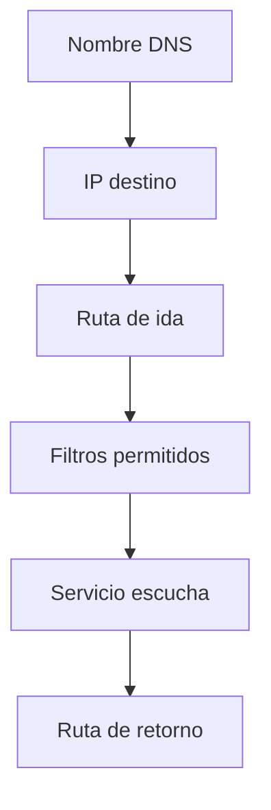
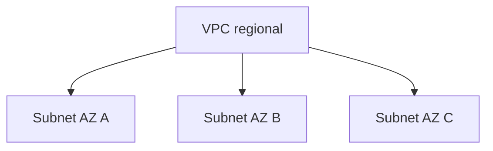
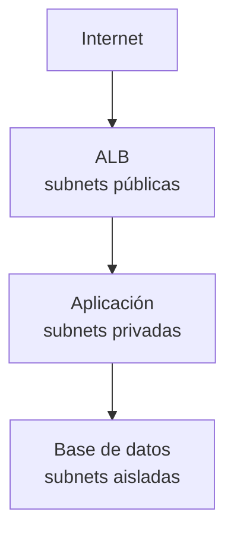
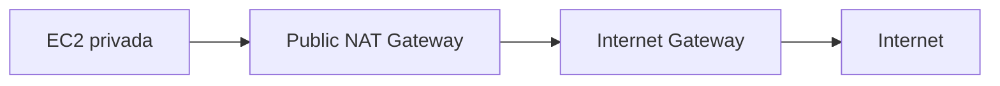
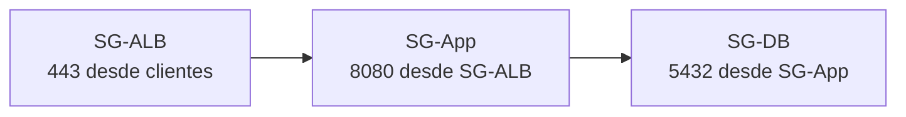
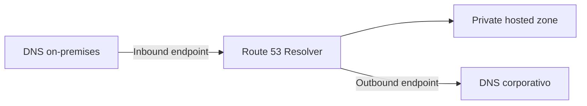
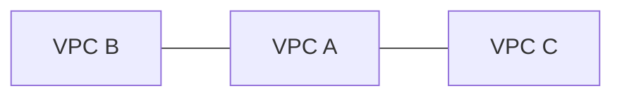
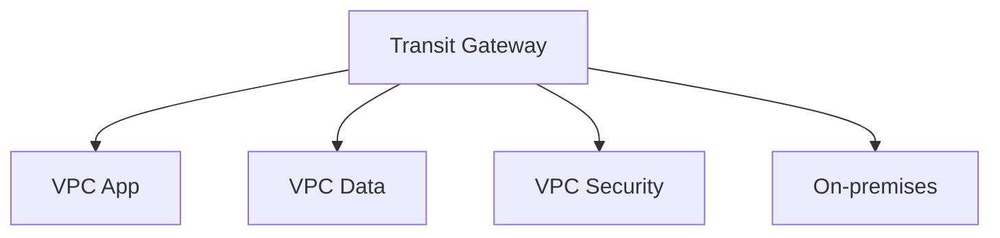
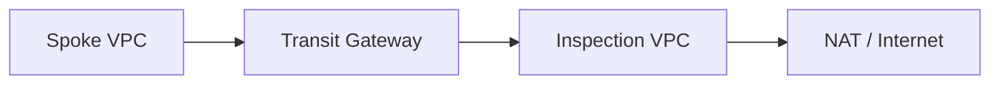

# Fundamentos de red en AWS para el examen SAA-C03

## 1. Alcance necesario para el examen

Los dominios del SAA-C03 evalúan la capacidad de diseñar redes seguras, resilientes y optimizadas en costo. Para responder correctamente se debe poder:

- Interpretar IPv4, IPv6 y notación CIDR.
- Dimensionar VPC y subredes evitando CIDR superpuestos.
- Diferenciar VPC, Availability Zone y subnet.
- Diferenciar subnet pública, privada y aislada.
- Interpretar route tables y longest prefix match.
- Diseñar acceso IPv4 mediante Internet Gateway y NAT.
- Diseñar egress IPv6 mediante egress-only Internet Gateway.
- Diferenciar public IP, private IP y Elastic IP.
- Comparar security groups y network ACLs.
- Comprender puertos de origen, destino y puertos efímeros.
- Seleccionar ALB, NLB o GWLB.
- Diseñar resolución DNS pública, privada e híbrida.
- Comparar gateway endpoints e interface endpoints.
- Comparar VPC peering, Transit Gateway y AWS PrivateLink.
- Comparar Site-to-Site VPN, Client VPN y Direct Connect.
- Diseñar alta disponibilidad de NAT, VPN, Direct Connect y endpoints.
- Segmentar redes entre cuentas y entornos.
- Reconocer costos de transferencia entre AZ, NAT, endpoints y conectividad.
- Diagnosticar rutas, filtros, DNS y aplicaciones por capas.

> **Alcance:** este capítulo desarrolla los fundamentos y la toma de decisiones de red. El resumen individual de servicios permanece en `13-Networking-and-Content-Delivery.md`.

---

## 2. Modelo mental de conectividad

Para que una comunicación funcione deben coincidir varias capas.



### Cinco preguntas

1. **DNS:** ¿el nombre resuelve a la dirección esperada?
2. **Routing:** ¿existe ruta de ida y de retorno?
3. **Filtrado:** ¿security groups, NACLs y firewalls permiten?
4. **Transporte:** ¿protocolo y puerto son correctos?
5. **Aplicación:** ¿el proceso escucha y responde correctamente?

### Flujo completo

Una solicitud puede atravesar:

- Resolver DNS.
- Route table de la subnet origen.
- NAT, Internet Gateway, Transit Gateway o endpoint.
- Security groups.
- Network ACLs.
- Load balancer.
- Firewall o appliance.
- Route table de destino.
- Aplicación.

> **Regla de examen:** una route table dirige tráfico; no concede acceso. Un security group permite tráfico; no crea una ruta.

---

## 3. Capas y protocolos esenciales

No es necesario memorizar todo el modelo OSI, pero sí relacionar el requisito con la capa correcta.

| Capa práctica | Datos | Ejemplos AWS |
|---|---|---|
| Aplicación | HTTP, HTTPS, DNS | ALB, Route 53, CloudFront, WAF |
| Transporte | TCP, UDP, puertos | NLB, security groups, NACLs |
| Red | IPv4, IPv6, rutas | VPC, Transit Gateway, GWLB |
| Enlace | Interfaces y tramas | ENI, Direct Connect |

### Protocolos

| Protocolo | Característica | Uso |
|---|---|---|
| TCP | Orientado a conexión y entrega confiable | HTTPS, SSH, bases de datos |
| UDP | Sin conexión y menor overhead | DNS, streaming, telemetría |
| ICMP | Diagnóstico y control de red | Ping, Path MTU Discovery |
| IPsec | Cifrado a nivel de red | Site-to-Site VPN |
| BGP | Intercambio dinámico de rutas | Direct Connect, VPN dinámica |

### Puertos comunes

| Servicio | Puerto habitual |
|---|---:|
| SSH | TCP 22 |
| DNS | UDP/TCP 53 |
| HTTP | TCP 80 |
| HTTPS | TCP 443 |
| PostgreSQL | TCP 5432 |
| MySQL/Aurora MySQL | TCP 3306 |
| Microsoft SQL Server | TCP 1433 |
| RDP | TCP/UDP 3389 |
| NFS | TCP 2049 |

El puerto real depende de la configuración. Una pregunta puede utilizar cualquier puerto personalizado.

### Origen y destino

En una conexión HTTPS iniciada por un cliente:

- Destination port: `443`.
- Source port: un puerto efímero elegido por el sistema operativo.
- La respuesta vuelve desde `443` hacia ese puerto efímero.

Este comportamiento es importante para NACLs, que son stateless.

### MTU y Path MTU Discovery

MTU es el tamaño máximo de paquete admitido por un enlace. Path MTU Discovery utiliza mensajes ICMP para determinar el menor MTU del trayecto.

Si se bloquean los mensajes ICMP necesarios:

- Paquetes pequeños pueden funcionar.
- Transferencias grandes pueden fallar o quedar en timeout.
- Una VPN, NAT o appliance puede exponer el problema.

No se debe interpretar ICMP únicamente como `ping`; también soporta funciones de control de red.

---

## 4. IPv4, CIDR y subnetting

IPv4 utiliza 32 bits.

La notación:

```text
10.0.0.0/16
```

indica:

- Los primeros 16 bits identifican la red.
- Los 16 restantes identifican hosts.

### Fórmula

El número total de direcciones IPv4 de un CIDR es:

$$
2^{(32-\text{prefijo})}
$$

En una subnet AWS:

$$
\text{Direcciones utilizables} =
2^{(32-\text{prefijo})} - 5
$$

AWS reserva las primeras cuatro direcciones y la última de cada subnet.

### Tabla rápida

| CIDR | Direcciones totales | Utilizables en subnet AWS |
|---|---:|---:|
| `/16` | 65 536 | 65 531 |
| `/20` | 4 096 | 4 091 |
| `/22` | 1 024 | 1 019 |
| `/24` | 256 | 251 |
| `/25` | 128 | 123 |
| `/26` | 64 | 59 |
| `/27` | 32 | 27 |
| `/28` | 16 | 11 |

Una subnet IPv4 de AWS puede tener un prefijo entre `/16` y `/28`.

### Direcciones reservadas

Para `10.0.1.0/24`:

| Dirección | Uso |
|---|---|
| `10.0.1.0` | Network address |
| `10.0.1.1` | VPC router |
| `10.0.1.2` | DNS |
| `10.0.1.3` | Reservada para uso futuro |
| `10.0.1.255` | Network broadcast address |

AWS no soporta broadcast en una VPC, aunque reserva la última dirección.

### Rangos privados RFC 1918

| Rango | CIDR |
|---|---|
| `10.0.0.0` a `10.255.255.255` | `10.0.0.0/8` |
| `172.16.0.0` a `172.31.255.255` | `172.16.0.0/12` |
| `192.168.0.0` a `192.168.255.255` | `192.168.0.0/16` |

> **Regla:** planificar rangos no superpuestos desde el inicio para permitir peering, Transit Gateway, VPN y Direct Connect.

---

## 5. Planificación de direccionamiento

Una arquitectura debe reservar espacio para:

- Nuevas Availability Zones.
- Capas web, aplicación y datos.
- Endpoints.
- Load balancers.
- Containers y pods.
- Transit Gateway attachments.
- Crecimiento y adquisiciones.
- Regiones secundarias.
- Redes on-premises.

### Ejemplo

VPC `10.20.0.0/16`:

| Capa | AZ A | AZ B | AZ C |
|---|---|---|---|
| Pública | `10.20.0.0/24` | `10.20.1.0/24` | `10.20.2.0/24` |
| Aplicación | `10.20.10.0/22` | `10.20.14.0/22` | `10.20.18.0/22` |
| Datos | `10.20.30.0/24` | `10.20.31.0/24` | `10.20.32.0/24` |
| Endpoints | `10.20.40.0/26` | `10.20.40.64/26` | `10.20.40.128/26` |

El ejemplo deja rangos libres para expansión.

### Errores

- Crear VPC pequeñas sin margen.
- Asignar CIDR superpuestos entre cuentas.
- Usar una única subnet para todas las capas.
- Olvidar el consumo de IP de EKS, ECS, Lambda en VPC y endpoints.
- No reservar bloques para disaster recovery.
- Diseñar cada VPC sin un registro central.

### AWS VPC IP Address Manager

Amazon VPC IPAM ayuda a:

- Organizar pools.
- Asignar CIDR.
- Detectar overlaps.
- Auditar utilización.
- Planificar redes multi-account y multi-Region.

> **Examen:** cuando la organización necesita gobierno central de direcciones a escala, elegir VPC IPAM en lugar de hojas de cálculo manuales.

---

## 6. Amazon VPC y subnets

### VPC

Una VPC:

- Es regional.
- Está aislada lógicamente.
- Tiene un IPv4 CIDR principal obligatorio.
- Puede tener CIDR IPv4 secundarios.
- Puede asociar uno o más bloques IPv6.
- Incluye routing local entre sus subnets.

### Subnet

Una subnet:

- Pertenece a una sola VPC.
- Existe en una sola Availability Zone.
- Utiliza un subconjunto no superpuesto del CIDR de la VPC.
- Se asocia con una route table.
- Se asocia con una network ACL.



### Regional frente a zonal

| Componente | Alcance |
|---|---|
| VPC | Regional |
| Route table | Regional, asociada a subnets |
| Internet Gateway | VPC |
| Subnet | Una AZ |
| ENI | Una AZ |
| Zonal NAT Gateway | Una AZ |
| Transit Gateway | Regional |

Los nombres de AZ, como `us-east-1a`, pueden representar ubicaciones físicas distintas entre cuentas. El AZ ID, como `use1-az1`, es consistente y debe utilizarse para coordinar arquitectura entre cuentas.

### Default VPC

Una default VPC ofrece:

- Subnet pública por AZ.
- Internet Gateway.
- Route table con salida a internet.
- Default security group.
- Default network ACL.

Es útil para aprendizaje, pero una arquitectura empresarial suele utilizar VPC diseñadas explícitamente.

---

## 7. Interfaces y direcciones

### Elastic Network Interface

Una ENI es una interfaz virtual de red.

Puede incluir:

- Primary private IPv4.
- Secondary private IPv4.
- IPv6.
- Elastic IP asociada.
- MAC address.
- Security groups.

La ENI pertenece a una subnet y, por tanto, a una AZ.

### Tipos de dirección

| Dirección | Característica |
|---|---|
| Private IPv4 | Comunicación interna; permanece con la ENI |
| Public IPv4 autoasignada | Se asocia de forma dinámica; puede cambiar al detener/iniciar EC2 |
| Elastic IP | IPv4 pública estática controlada por el cliente |
| IPv6 | Globalmente única; no requiere NAT tradicional |

### Traducción mediante Internet Gateway

Una instancia con public IPv4:

- Conserva una private IPv4 en su ENI.
- El Internet Gateway realiza el mapeo entre public y private IPv4.
- La instancia no ve la public IPv4 como dirección local de la interfaz.

### Elastic IP

Utilizar cuando se necesita:

- IP pública estable.
- Allow-list externa.
- Reasignación rápida a otra ENI o instancia.

No utilizar como sustituto de:

- Load balancer.
- Auto Scaling.
- DNS failover.
- Arquitectura Multi-AZ.

### Source/destination check

EC2 comprueba normalmente que el tráfico tenga a la instancia como origen o destino.

Debe deshabilitarse para una instancia que enruta tráfico, por ejemplo:

- NAT instance.
- Firewall appliance.
- Router virtual.

---

## 8. Route tables y selección de rutas

Cada subnet debe estar asociada con una route table.

- Una subnet tiene una sola asociación activa.
- Una route table puede asociarse con varias subnets.
- Si no existe asociación explícita, utiliza la main route table.

### Estructura

| Destination | Target |
|---|---|
| `10.20.0.0/16` | `local` |
| `10.30.0.0/16` | `tgw-...` |
| `0.0.0.0/0` | `nat-...` |

### Longest prefix match

AWS elige la ruta más específica que coincide con la dirección destino.

Ejemplo:

| Ruta | Target |
|---|---|
| `10.0.0.0/8` | Transit Gateway |
| `10.20.0.0/16` | Peering |
| `10.20.1.0/24` | Network appliance |

Para `10.20.1.25` gana `/24`.

### Prioridad

1. Se evalúa primero el prefijo más específico.
2. Si el destino es idéntico, las rutas estáticas suelen tener prioridad sobre rutas propagadas.
3. Las reglas exactas dependen del tipo de target y propagación.

### Ruta local

La route table incluye una ruta `local` para el CIDR de la VPC. Permite comunicación interna, sujeta a:

- Security groups.
- NACLs.
- Firewalling o rutas más específicas cuando se utilizan mecanismos compatibles.

### Blackhole

Una ruta puede aparecer como `blackhole` cuando su target ya no está disponible, por ejemplo un peering eliminado.

### Ruta de retorno

El destino también debe saber volver al origen.

> **Trampa:** configurar la ruta de A hacia B sin configurar la ruta de B hacia A produce conectividad incompleta.

---

## 9. Subnets públicas, privadas y aisladas

La clasificación depende de la route table, no del nombre.

| Tipo | Ruta por defecto | Uso |
|---|---|---|
| Pública | `0.0.0.0/0 → IGW` | ALB público, NAT Gateway, bastion controlado |
| Privada con egress | `0.0.0.0/0 → NAT` | Aplicaciones que necesitan salida |
| Aislada | Sin ruta a internet/NAT | Bases de datos y recursos internos |

### Subnet pública

Para que una EC2 tenga acceso IPv4 a internet necesita:

1. Public IPv4 o Elastic IP.
2. Ruta al Internet Gateway.
3. Security group y NACL adecuados.

Una ruta al IGW no convierte automáticamente todas las instancias en públicamente accesibles.

### Subnet privada

Una EC2 privada:

- No tiene public IPv4.
- Puede salir mediante NAT Gateway.
- No recibe conexiones iniciadas desde internet a través del NAT.

### Arquitectura de tres capas



> **Regla:** la base de datos no necesita ser pública para que una aplicación privada se conecte a ella.

---

## 10. Internet Gateway

Un Internet Gateway:

- Se adjunta a una VPC.
- Es horizontalmente escalable y administrado.
- Permite comunicación entre recursos con direcciones públicas e internet.
- Es target de route tables.
- Realiza traducción one-to-one para public IPv4 de instancias.

### Acceso entrante

Requiere:

- Ruta adecuada.
- Dirección pública.
- Security group.
- NACL.
- Servicio escuchando.

### Acceso saliente

Para una EC2 pública:

- Ruta `0.0.0.0/0 → IGW`.
- Public IPv4 o EIP.
- Outbound permitido.

### No confundir

| Componente | Función |
|---|---|
| Internet Gateway | Conectividad pública bidireccional si los controles permiten |
| NAT Gateway | Inicio de conexiones salientes para direcciones privadas |
| Egress-only IGW | Inicio saliente IPv6 sin permitir inicio desde internet |

---

## 11. NAT para IPv4

NAT permite que recursos privados inicien conexiones hacia destinos externos sin exponer una public IPv4 por recurso.

### Public NAT Gateway

Se despliega tradicionalmente en una subnet pública y necesita:

- Elastic IP.
- Ruta desde la subnet privada hacia el NAT.
- Ruta desde la subnet pública hacia el IGW.



### Private NAT Gateway

Se utiliza para traducir direcciones hacia:

- Otras VPC.
- Transit Gateway.
- Redes on-premises.

No proporciona salida a internet mediante IGW.

### Alta disponibilidad zonal

El patrón tradicional para zonal NAT Gateways es:

- Un NAT Gateway por AZ.
- Cada subnet privada apunta al NAT de su AZ.

Beneficios:

- Evita dependencia de otra AZ.
- Reduce transferencia inter-AZ.
- Mantiene egress si falla una AZ.

Una única NAT compartida:

- Reduce costo fijo.
- Crea dependencia zonal.
- Puede generar transferencia inter-AZ.

### Regional NAT Gateway

AWS también ofrece Regional NAT Gateway:

- Utiliza un solo NAT Gateway ID para varias AZ.
- Amplía automáticamente su presencia según la ubicación de los workloads.
- Mantiene afinidad zonal y alta disponibilidad administrada.
- No necesita una public subnet para alojarse.
- Posee su propia route table con salida preconfigurada hacia el IGW.
- Proporciona conectividad pública; no soporta el caso de private NAT.

Para el examen se debe reconocer la diferencia con el NAT Gateway zonal y leer con atención si la pregunta solicita el patrón tradicional por AZ, private NAT o el servicio regional administrado.

### NAT Gateway frente a NAT instance

| Aspecto | NAT Gateway | NAT instance |
|---|---|---|
| Administración | AWS | Cliente |
| Escalado | Automático | Manual |
| Disponibilidad | Administrada según tipo | Diseñada por el cliente |
| Security groups | No | Sí |
| Bastion | No | Posible, no recomendado combinar funciones |
| Port forwarding | No | Posible |
| Source/destination check | No aplica al cliente | Debe deshabilitarse |

AWS recomienda NAT Gateway para la mayoría de casos.

### Optimización

- Usar gateway endpoints para S3 y DynamoDB.
- Usar interface endpoints para servicios privados cuando el costo y seguridad lo justifican.
- Mantener el tráfico en la misma AZ cuando sea posible.
- Evitar descargar grandes volúmenes por NAT si existe una ruta privada.

---

## 12. IPv6 y dual stack

IPv6 utiliza 128 bits.

### Características

- Direcciones globalmente únicas.
- No depende de NAT para conectividad.
- IPv4 e IPv6 se enrutan de forma independiente.
- Dual stack permite utilizar ambos protocolos.
- Las policies, security groups y NACLs deben incluir reglas IPv6.

### Rutas

| Necesidad | Ruta |
|---|---|
| Internet bidireccional sujeto a filtros | `::/0 → IGW` |
| Solo egress iniciado desde la VPC | `::/0 → Egress-only IGW` |

### Egress-only Internet Gateway

Permite:

- Que recursos IPv6 inicien conexiones hacia internet.
- Recibir el tráfico de respuesta.
- Bloquear conexiones nuevas iniciadas desde internet.

No se utiliza para IPv4.

### NAT64 y DNS64

Permiten que un workload IPv6 se comunique con un destino IPv4:

- DNS64 sintetiza una respuesta IPv6.
- NAT64 en NAT Gateway traduce entre IPv6 e IPv4.

### Trampas

- Una regla `0.0.0.0/0` no cubre IPv6.
- Una regla `::/0` no cubre IPv4.
- Egress-only IGW no reemplaza un NAT Gateway IPv4.
- Añadir IPv6 puede crear una nueva ruta de exposición si no se actualizan filtros.

---

## 13. Security groups

Un security group es un firewall virtual stateful asociado con ENIs o recursos compatibles.

### Características

- Opera a nivel de recurso o interfaz.
- Solo contiene reglas `Allow`.
- Evalúa todas las reglas como un conjunto.
- Es stateful.
- Puede referenciar CIDR, prefix lists u otros security groups.
- No dirige tráfico.

Al crear un security group:

- No tiene reglas inbound.
- Tiene inicialmente una regla outbound que permite todo.
- Las reglas pueden modificarse para aplicar mínimo privilegio.

El default security group de una VPC tiene reglas propias que permiten comunicación entre recursos asociados con ese mismo default SG.

### Stateful

Si una regla permite iniciar una conexión:

- El tráfico de respuesta queda permitido automáticamente.
- No se necesita una regla inversa para el flujo de retorno.

Esto no significa que una conexión nueva en sentido contrario esté permitida.

### Referencia entre security groups

Patrón:

- SG del ALB permite `443` desde internet.
- SG de aplicación permite `8080` desde el SG del ALB.
- SG de base de datos permite `5432` desde el SG de aplicación.



Una referencia de SG:

- Autoriza private IPs asociadas con el SG según las reglas de conectividad.
- No copia reglas desde el SG referenciado.
- No crea rutas entre VPC.

### Mínimo privilegio

Preferir:

- SG como origen para capas internas.
- CIDR corporativo específico para administración.
- Session Manager en lugar de abrir SSH/RDP.
- Puertos de aplicación exactos.

Evitar:

- `0.0.0.0/0` en SSH, RDP o bases de datos.
- Usar el default security group para todas las capas.
- Permitir todo entre todos los workloads.

---

## 14. Network ACLs

Una network ACL controla tráfico en el límite de una subnet.

### Características

- Opera a nivel de subnet.
- Contiene reglas `Allow` y `Deny`.
- Es stateless.
- Evalúa reglas por número, de menor a mayor.
- La primera regla que coincide gana.
- La regla `*` final deniega lo que no coincidió.
- Cada subnet se asocia con una NACL.
- Una NACL puede asociarse con varias subnets.

### Default NACL

La default NACL permite inicialmente todo el tráfico entrante y saliente.

### Custom NACL

Una custom NACL comienza normalmente denegando todo hasta que se agregan reglas.

### Stateless y puertos efímeros

Para permitir clientes externos hacia un servidor HTTPS:

- Inbound: permitir TCP `443` desde clientes.
- Outbound: permitir el rango efímero de los clientes.

Para que un servidor sea cliente de un servicio externo:

- Outbound: permitir puerto destino, por ejemplo `443`.
- Inbound: permitir puertos efímeros de retorno.

El rango efímero depende del sistema operativo o cliente; una NACL debe cubrir el rango relevante.

### Numeración

Utilizar incrementos:

- 100.
- 110.
- 120.

Así se pueden insertar reglas futuras.

> **Trampa:** una regla `Allow` 200 no corrige un `Deny` 100 que ya coincide.

---

## 15. Security group frente a NACL

| Aspecto | Security group | Network ACL |
|---|---|---|
| Alcance | ENI o recurso | Subnet |
| Estado | Stateful | Stateless |
| Reglas | Allow | Allow y Deny |
| Evaluación | Todas las reglas | Menor número primero |
| Retorno | Permitido automáticamente | Debe permitirse explícitamente |
| Referencia a SG | Sí | No |
| Uso principal | Control granular por workload | Guardrail de subnet y bloqueo por CIDR |

### Cuándo utilizar

| Necesidad | Control |
|---|---|
| App accede a DB | Security groups |
| Bloquear un CIDR conocido en toda una subnet | NACL |
| Permitir únicamente ALB hacia app | Referencia de SG |
| Defensa adicional a nivel de subnet | NACL |

### Orden mental de filtros

La comunicación debe ser aceptada por todos los controles aplicables.

```text
Route table + NACL + Security group + Firewall + Aplicación
```

> **Regla de examen:** security groups son el control principal y granular; NACLs añaden una capa stateless a nivel de subnet.

---

## 16. DNS en AWS

DNS traduce nombres a registros y direcciones.

### Route 53

Amazon Route 53 ofrece:

- Registro de dominios.
- Hosted zones.
- DNS autoritativo.
- Health checks.
- Políticas de routing.
- Route 53 Resolver.

### Registros

| Registro | Uso |
|---|---|
| `A` | Nombre hacia IPv4 |
| `AAAA` | Nombre hacia IPv6 |
| `CNAME` | Nombre hacia otro nombre |
| Alias | Extensión Route 53 hacia recursos AWS compatibles |
| `MX` | Correo |
| `TXT` | Verificación y texto |
| `NS` | Name servers autoritativos |

### Alias frente a CNAME

| Aspecto | Alias | CNAME |
|---|---|---|
| Zone apex | Sí | No |
| Target AWS compatible | Sí | Puede apuntar a nombre DNS |
| Costo de consulta Route 53 al target AWS | Generalmente sin cargo | Consulta normal |
| Tipo visible | Puede ser A/AAAA | CNAME |

Ejemplo de zone apex:

```text
example.com → Alias → ALB
```

### Hosted zones

| Tipo | Resolución |
|---|---|
| Public hosted zone | Internet |
| Private hosted zone | VPC asociadas |

Una private hosted zone no hace público un nombre y puede asociarse con varias VPC.

### Políticas de routing

| Policy | Selección |
|---|---|
| Simple | Una respuesta sin lógica especial |
| Weighted | Por porcentaje relativo |
| Latency | Región con menor latencia estimada |
| Failover | Primary/secondary según health |
| Geolocation | Ubicación del usuario |
| Geoproximity | Ubicación y bias |
| Multivalue answer | Varias respuestas saludables |
| IP-based | CIDR de origen |

### TTL

- TTL alto: más cache y menos consultas, cambios más lentos.
- TTL bajo: failover o cambios más rápidos, más consultas.

DNS failover no termina conexiones existentes; afecta resoluciones nuevas cuando expira el cache.

---

## 17. Route 53 Resolver y DNS híbrido

El VPC Resolver resuelve:

- Nombres públicos.
- Nombres privados de EC2.
- Private hosted zones asociadas.
- Reglas de forwarding.

### Atributos VPC

Para determinadas funciones DNS se requieren:

- `enableDnsSupport`.
- `enableDnsHostnames`.

Private DNS de interface endpoints depende de estos atributos.

### Resolver endpoints

| Endpoint | Dirección |
|---|---|
| Inbound | On-premises consulta nombres resolubles en AWS |
| Outbound | AWS reenvía dominios hacia resolvers on-premises |



### Reglas condicionales

Ejemplos:

- `corp.example.com` se reenvía al DNS corporativo.
- `aws.corp.example.com` se resuelve en private hosted zone.

Las Resolver rules se pueden compartir mediante AWS RAM.

### Filtrado de dominios

Security groups y NACLs no filtran el tráfico hacia el Amazon-provided DNS server de la VPC. Para controlar nombres consultados se utiliza Route 53 Resolver DNS Firewall y una arquitectura DNS apropiada.

### Split-horizon DNS

El mismo nombre puede responder:

- Dirección pública desde internet.
- Dirección privada dentro de VPC asociadas.

### Diagnóstico

Comprobar:

- Hosted zone correcta.
- Asociación de VPC.
- Resolver rule más específica.
- DHCP options.
- Atributos DNS de la VPC.
- Security groups de Resolver endpoints.
- UDP y TCP 53.

---

## 18. Elastic Load Balancing

Un load balancer distribuye tráfico entre targets saludables en varias AZ.

### Selección

| Tipo | Capa | Uso principal |
|---|---|---|
| ALB | 7 | HTTP/HTTPS, host/path/header, redirects, microservicios |
| NLB | 4 | TCP/UDP/TLS, alta capacidad, baja latencia, IP estática |
| GWLB | 3 | Appliances virtuales, inspección transparente |
| CLB | 4/7 legado | Workloads existentes; no primera opción nueva |

### Application Load Balancer

Permite:

- Host-based routing.
- Path-based routing.
- Headers y query strings.
- WebSockets.
- HTTP/2.
- Integración con WAF.
- Targets EC2, IP y Lambda según configuración.

### Network Load Balancer

Elegir cuando se necesita:

- TCP, UDP o TLS.
- Direcciones IP estáticas por AZ.
- Elastic IP por AZ para un NLB internet-facing.
- Preservación de source IP según protocolo y configuración.
- Rendimiento de capa 4.

### Gateway Load Balancer

Utiliza GENEVE y permite:

- Escalar firewalls o appliances.
- Insertar inspección transparente.
- Mantener afinidad de flujo.
- Ofrecer appliances mediante GWLB endpoints.

### Componentes

- Listener.
- Listener rules.
- Target group.
- Health check.
- Targets.

### Health checks

Un target no saludable deja de recibir tráfico nuevo. El health check debe verificar una señal útil sin depender innecesariamente de componentes externos.

### Multi-AZ y cross-zone

- Habilitar varias AZ.
- Distribuir targets saludables por AZ.
- Comprender si cross-zone está habilitado por defecto o es configurable para el tipo de load balancer y target group.
- Evaluar costo de transferencia inter-AZ.

> **Trampa:** Route 53 distribuye resoluciones DNS; ELB distribuye solicitudes/conexiones y realiza health checks sobre targets.

---

## 19. VPC endpoints

Los VPC endpoints permiten acceso privado sin utilizar IGW, public IP, VPN o NAT para el trayecto soportado.

### Tipos

| Tipo | Implementación | Uso |
|---|---|---|
| Gateway endpoint | Rutas con prefix list | S3 y DynamoDB |
| Interface endpoint | ENIs privadas mediante AWS PrivateLink | Servicios AWS y endpoint services |
| Gateway Load Balancer endpoint | Entrada privada a GWLB | Appliances e inspección |

### Gateway endpoint

Características:

- S3 y DynamoDB.
- Se asocia con route tables.
- No utiliza security groups.
- Soporta endpoint policy.
- No tiene costo por hora.
- La ruta del prefix list es más específica que `0.0.0.0/0`.

Limitaciones de arquitectura:

- No se extiende de forma transitiva por peering o Transit Gateway.
- No ofrece acceso directo desde on-premises.
- Para esos escenarios puede utilizarse un interface endpoint cuando el servicio lo soporte.

### Interface endpoint

Características:

- Crea ENIs en subnets seleccionadas.
- Tiene private IPs.
- Utiliza security groups.
- Cobra por hora por AZ y procesamiento.
- Puede habilitar private DNS.
- Puede usar endpoint policy si el servicio la soporta.

### Private DNS

Con private DNS habilitado, el hostname público habitual del servicio resuelve a las private IPs del endpoint dentro de la VPC.

Esto permite que SDKs sigan utilizando:

```text
service.region.amazonaws.com
```

sin cambiar el código.

### Endpoint policy

Controla qué principals y recursos pueden utilizarse a través del endpoint.

No reemplaza:

- IAM policy.
- Resource policy.
- KMS key policy.

### Alta disponibilidad

Para interface endpoints:

- Seleccionar subnets en varias AZ.
- Permitir tráfico en el SG del endpoint.
- Asegurar resolución DNS desde workloads e híbrido.

---

## 20. VPC peering

VPC peering conecta dos VPC mediante private IPs.

### Características

- Same-account o cross-account.
- Same-Region o inter-Region.
- No utiliza un gateway central.
- No soporta routing transitivo.
- Requiere rutas en ambos lados.
- Requiere CIDR no superpuestos.

### No transitivo



Aunque B y C estén conectadas con A:

- B no puede llegar a C a través de A.
- Se necesita peering B–C o una arquitectura transitiva.

### Escalabilidad

Para pocas VPC:

- Simple.
- Directo.
- Sin costo por hora de gateway central.

Para muchas VPC:

- Full mesh aumenta conexiones y rutas.
- Transit Gateway simplifica la topología.

### DNS

Se puede habilitar resolución de nombres DNS privados a través del peering en los escenarios compatibles, pero la conectividad y las asociaciones DNS deben configurarse correctamente.

> **Trampa:** un peering activo sin rutas de ida y retorno no proporciona conectividad.

---

## 21. AWS Transit Gateway

Transit Gateway actúa como router regional administrado para:

- VPC.
- VPN.
- Direct Connect gateway.
- Transit Gateway peering.
- SD-WAN mediante Transit Gateway Connect.

### Hub-and-spoke



### Route tables de TGW

Conceptos:

- **Attachment:** conexión de una VPC, VPN u otro recurso.
- **Association:** decide qué TGW route table se consulta para tráfico que entra por el attachment.
- **Propagation:** anuncia rutas de un attachment dentro de una o varias TGW route tables.

Una estrategia de segmentación puede usar:

- Route table de producción.
- Route table de no producción.
- Route table compartida.
- VPC de inspección.

### Diferencia con route table de VPC

Para una VPC conectada a TGW se necesitan:

1. Ruta en la subnet de workload hacia TGW.
2. TGW route table que seleccione attachment destino.
3. Ruta de retorno en la VPC destino.
4. Filtros de seguridad.

### Inter-Region

Transit Gateway peering:

- Conecta TGW de diferentes regiones.
- Requiere rutas estáticas hacia el peering attachment.
- Mantiene una topología regional por TGW.

### Appliance mode

Se utiliza para mantener simetría de flujos a través de appliances stateful en una VPC de inspección.

Sin simetría, la ida y el retorno podrían pasar por appliances o AZ diferentes y romper el estado de la conexión.

### Cuándo elegir

- Muchas VPC.
- Conectividad transitiva.
- Red híbrida central.
- Segmentación con varias route tables.
- Egress o inspección centralizados.

---

## 22. AWS PrivateLink

AWS PrivateLink expone un servicio de forma privada y unidireccional mediante interface endpoints.

### Patrón

| Lado proveedor | Lado consumidor |
|---|---|
| Servicio detrás de NLB | Interface endpoint |
| Endpoint service | ENIs privadas |
| Allow-list de principals | Security group del endpoint |

### Ventajas

- No requiere peering.
- No expone toda la red del proveedor.
- Funciona con CIDR superpuestos.
- Permite SaaS privado y servicios compartidos.
- El consumidor inicia conexiones hacia el servicio.

### Limitaciones conceptuales

- No proporciona conectividad general entre VPC.
- Es orientado a servicios concretos.
- No es transitivo.
- El proveedor no inicia conexiones hacia el consumidor a través del mismo endpoint.

### Selección

| Requisito | Opción |
|---|---|
| Conectar redes completas | Peering o TGW |
| Exponer una API privada a muchas VPC | PrivateLink |
| CIDR superpuestos | PrivateLink |
| Acceso privado a un servicio AWS | Interface endpoint |

---

## 23. Conectividad híbrida

### Site-to-Site VPN

Conecta una red on-premises con AWS mediante IPsec.

Componentes:

- Customer Gateway.
- Virtual Private Gateway o Transit Gateway.
- Dos túneles por conexión.
- Rutas estáticas o BGP.

Ventajas:

- Implementación rápida.
- Cifrado sobre internet.
- Útil como conectividad primaria de menor costo o backup.

Consideraciones:

- Rendimiento y latencia dependen de internet.
- Se deben configurar ambos túneles.
- El equipo on-premises debe soportar la configuración.

### AWS Direct Connect

Proporciona conectividad privada dedicada desde una ubicación Direct Connect.

Ventajas:

- Rendimiento más consistente.
- Mayor ancho de banda según conexión.
- Puede reducir costos de transferencia para volúmenes altos.
- Evita que el tráfico de datos use internet público.

Consideraciones:

- Tiempo de provisión mayor.
- No cifra todo el tráfico por defecto.
- Requiere diseño redundante.
- Se integra mediante virtual interfaces y gateways.

### Virtual interfaces

| VIF | Acceso |
|---|---|
| Private VIF | Private IPs en VPC mediante VGW |
| Public VIF | Endpoints públicos de AWS mediante public IPs |
| Transit VIF | Transit Gateway mediante Direct Connect Gateway |

### VPN sobre Direct Connect

Combina:

- Transporte más consistente de Direct Connect.
- Cifrado IPsec end-to-end.

También puede utilizarse MACsec en escenarios compatibles, pero no reemplaza automáticamente todos los requisitos de cifrado extremo a extremo.

### Comparación

| Necesidad | Elección |
|---|---|
| Conectar rápido y cifrado | Site-to-Site VPN |
| Tráfico sostenido y experiencia consistente | Direct Connect |
| Direct Connect con backup | DX redundante y/o VPN |
| Varias VPC a escala | TGW + VPN/DX Gateway |
| Cifrado sobre DX | VPN sobre DX o MACsec según requisito |

---

## 24. Acceso de usuarios remotos

### AWS Client VPN

Es un servicio administrado basado en OpenVPN para conectar clientes individuales.

Puede autenticar mediante:

- Active Directory.
- Certificados mutuos.
- Federación.

Requiere:

- Client VPN endpoint.
- Target network associations.
- Authorization rules.
- Routes.
- Security groups.

### Site-to-Site VPN frente a Client VPN

| Aspecto | Site-to-Site VPN | Client VPN |
|---|---|---|
| Conecta | Redes | Usuarios/dispositivos |
| Terminación cliente | Router/firewall | Software cliente |
| Uso | Sucursal o data center | Trabajo remoto |

### Session Manager

Para administrar instancias EC2, Systems Manager Session Manager suele ser preferible a:

- Bastion público.
- SSH expuesto.
- VPN solo para administración.

No reemplaza Client VPN cuando el usuario necesita conectividad IP general hacia múltiples aplicaciones privadas.

---

## 25. Redes multi-account

### VPC por cuenta

Ventajas:

- Aislamiento fuerte.
- Ownership claro.
- Blast radius reducido.
- Controles y cuotas independientes.

La conectividad puede centralizarse con:

- Transit Gateway.
- Direct Connect Gateway.
- Route 53 Resolver.
- Network Firewall.
- Egress VPC.

### VPC sharing

El owner de una VPC comparte subnets con participant accounts mediante AWS RAM.

| Owner | Participant |
|---|---|
| Administra VPC, subnets, route tables y NACLs | Crea recursos compatibles en subnets compartidas |
| Controla gateways y routing | Administra sus ENIs y security groups según el recurso |
| Conserva gobierno de red | Conserva ownership de sus recursos |

### Selección

| Necesidad | Diseño |
|---|---|
| Aislamiento máximo por equipo | VPC por cuenta |
| Gobierno central y menos VPC | Shared VPC |
| Muchas VPC con tránsito | Transit Gateway |
| Servicio central compartido | PrivateLink, TGW o shared VPC según alcance |

### AWS RAM

Puede compartir recursos compatibles, como:

- Subnets.
- Transit Gateway.
- Route 53 Resolver rules.
- Prefix lists.

No todos los recursos de una VPC se comparten automáticamente.

### Prefix lists

Una managed prefix list agrupa CIDR reutilizables para:

- Route tables.
- Security group rules.

Reduce duplicación y facilita actualizaciones controladas.

---

## 26. Servicios globales y edge

### Amazon CloudFront

CDN para:

- Cachear contenido en edge.
- Reducir latencia.
- Disminuir carga del origin.
- Integrar WAF y Shield.
- Proteger S3 con Origin Access Control.

### AWS Global Accelerator

Proporciona:

- Anycast static IPs.
- Entrada por la red global de AWS.
- Health-based regional failover.
- Aceleración para TCP y UDP.
- Preservación de protocolos no cacheables.

### Route 53

Selecciona un endpoint mediante DNS. El cliente se conecta después a la dirección recibida.

### Comparación

| Requisito | Servicio |
|---|---|
| Cache HTTP/HTTPS en edge | CloudFront |
| IPs globales estáticas y TCP/UDP | Global Accelerator |
| Routing por DNS y políticas globales | Route 53 |
| Distribuir entre targets regionales | ELB |

### Trampa

- CloudFront puede cachear y aplicar comportamiento de aplicación.
- Global Accelerator no es una CDN.
- Route 53 no actúa como proxy del tráfico.
- ELB no reemplaza un mecanismo de routing multi-Region.

---

## 27. Capas de seguridad de red

### Controles

| Capa | Servicio o control |
|---|---|
| Edge y DDoS | Shield |
| HTTP/HTTPS | WAF |
| Perímetro VPC y tráfico interno | Network Firewall |
| Appliances de terceros | GWLB |
| Subnet | NACL |
| Workload/ENI | Security group |
| Acceso a servicio | Endpoint policy |
| Identidad | IAM/resource policies |

### AWS WAF

Protege aplicaciones web frente a patrones como:

- SQL injection.
- Cross-site scripting.
- Bots.
- IPs o países.
- Rate-based attacks.

No controla TCP/UDP genérico.

### AWS Network Firewall

Permite:

- Stateful y stateless inspection.
- Reglas de dominio y protocolo.
- Despliegue administrado por AZ.
- Centralización con Transit Gateway.

### AWS Shield

- Shield Standard se incluye para recursos compatibles.
- Shield Advanced añade protección, visibilidad y capacidades avanzadas.

### Defense in depth

Una arquitectura puede combinar:

- CloudFront + WAF.
- ALB público.
- App privada con SG.
- DB aislada con SG.
- Network Firewall para egress.
- VPC endpoints para servicios AWS.

> **Regla:** elegir el control que comprende la capa del ataque. NACL no analiza una URL; WAF no reemplaza un security group.

---

## 28. Inspección y egress centralizados

Una organización puede utilizar una VPC de red para:

- Inspección norte-sur.
- Inspección este-oeste.
- Egress centralizado.
- NAT compartido.
- DNS firewall y Resolver.

### Patrón conceptual



### Requisitos

- Rutas de workload hacia TGW.
- TGW route table hacia inspection attachment.
- Rutas dentro de la inspection VPC.
- Firewall endpoints por AZ.
- Retorno por el mismo camino.
- Appliance mode cuando corresponda.
- Rutas desde inspección hacia egress y spokes.

### Riesgos

- Routing asimétrico.
- Dependencia de una única AZ.
- Transferencia inter-AZ.
- SNAT inesperado.
- Inspección omitida por una ruta más específica.
- Blackholing por propagación incorrecta.

### Egress distribuido frente a centralizado

| Aspecto | Distribuido | Centralizado |
|---|---|---|
| NAT | Por VPC/AZ | En VPC de egress |
| Gobierno | Descentralizado | Central |
| Costo fijo | Más NATs | Menos NATs, más tránsito |
| Transferencia | Puede ser local por AZ | TGW e inter-AZ posibles |
| Blast radius | Menor | Mayor dependencia central |

La opción correcta depende de tráfico, seguridad, disponibilidad y costo.

---

## 29. Diseño para alta disponibilidad

### Principios

- Utilizar varias Availability Zones.
- Eliminar appliances únicos.
- Diseñar rutas de retorno.
- Evitar dependencias zonales cruzadas.
- Probar failover.
- Supervisar salud y capacidad.

### Por componente

| Componente | Diseño resiliente |
|---|---|
| ALB/NLB | Subnets y targets en varias AZ |
| Zonal NAT Gateway | Uno por AZ y rutas locales |
| Regional NAT Gateway | Expansión Multi-AZ administrada |
| Interface endpoint | ENIs en varias AZ |
| Site-to-Site VPN | Configurar ambos túneles; conexiones redundantes si el requisito es mayor |
| Direct Connect | Conexiones en ubicaciones y dispositivos diferentes |
| Resolver endpoint | IPs en varias AZ |
| Network Firewall | Endpoint por AZ y routing simétrico |
| Transit Gateway | Servicio regional administrado; attachments bien distribuidos |

### Direct Connect resiliente

Niveles conceptuales:

- Una conexión: sin resiliencia completa.
- Dos conexiones en una ubicación: protege parte de fallas de dispositivo.
- Conexiones en ubicaciones diferentes: mayor resiliencia.
- VPN como backup: diversidad de transporte.

### BGP

Permite:

- Propagar rutas.
- Preferir caminos mediante atributos soportados.
- Conmutar cuando una sesión cae.

Un túnel “UP” no garantiza que la aplicación sea saludable.

---

## 30. Optimización de costos de red

Los cargos dependen de región, dirección y servicio. En el examen interesa reconocer el patrón.

### Fuentes de costo

- Transferencia entre AZ.
- Transferencia entre regiones.
- NAT Gateway por hora y datos.
- Interface endpoints por AZ y datos.
- Transit Gateway attachments y procesamiento.
- VPN y Direct Connect.
- CloudFront, Global Accelerator y data transfer.
- Public IPv4.

### Decisiones

| Situación | Optimización posible |
|---|---|
| Gran tráfico S3/DynamoDB desde VPC | Gateway endpoint |
| Tráfico entre app y NAT de otra AZ | NAT por AZ o Regional NAT |
| Targets cruzan AZ innecesariamente | Revisar distribución y cross-zone |
| Muchos servicios usan NAT para AWS APIs | Evaluar interface endpoints |
| Alta salida repetitiva HTTP | CloudFront |
| Pocas VPC conectadas | Peering puede ser más simple |
| Muchas VPC y red híbrida | TGW reduce complejidad, no siempre costo bruto |

### Endpoint o NAT

No existe una respuesta universal.

Comparar:

- Número de AZ y endpoints.
- Horas.
- Volumen de datos.
- Costo NAT.
- Requisitos de seguridad.
- Acceso desde on-premises.

### Afinidad de AZ

Mantener el tráfico dentro de la misma AZ puede:

- Reducir costo.
- Reducir latencia.
- Evitar dependencia de otra AZ.

No debe sacrificarse resiliencia solo para evitar transferencia.

---

## 31. Observabilidad de red

### VPC Flow Logs

Registran metadatos de flujo para:

- VPC.
- Subnet.
- ENI.

Pueden enviarse a:

- CloudWatch Logs.
- S3.
- Data Firehose.

Campos útiles:

- Source y destination address.
- Source y destination port.
- Protocol.
- `ACCEPT` o `REJECT`.
- Bytes y packets.
- ENI.

No capturan el payload del paquete.

### Reachability Analyzer

Analiza estáticamente el camino entre origen y destino.

Ayuda a detectar:

- Ruta faltante.
- SG bloqueante.
- NACL bloqueante.
- Gateway o attachment incorrecto.

No envía paquetes ni valida que la aplicación responda.

### Network Access Analyzer

Permite identificar caminos de red que cumplen o violan requisitos de acceso definidos.

Ejemplo:

- Detectar recursos con camino desde Internet Gateway.
- Validar segmentación.

### Traffic Mirroring

Copia tráfico de ENIs hacia herramientas de:

- Inspección.
- Detección.
- Análisis.

### CloudWatch

Métricas relevantes pueden incluir:

- NAT Gateway errors, packets y port allocation.
- VPN tunnel state.
- ELB healthy hosts y errores.
- Transit Gateway.
- Direct Connect connection/BGP state.

---

## 32. Diagnóstico sistemático

### Paso 1: definir el flujo

Registrar:

- Source IP/ENI/subnet.
- Destination IP/nombre.
- Protocolo.
- Destination port.
- Región y AZ.
- Camino esperado.

### Paso 2: comprobar DNS

```bash
dig example.internal
nslookup example.internal
```

Confirmar:

- Respuesta correcta.
- A o AAAA esperado.
- Resolver utilizado.
- Private hosted zone y reglas.

### Paso 3: comprobar aplicación local

```bash
ss -lntup
curl -v https://example.internal/health
```

Confirmar que el servicio escucha en:

- Puerto correcto.
- Interfaz correcta.
- Protocolo correcto.

### Paso 4: revisar rutas

- Route table de subnet origen.
- Longest prefix match.
- Route table de TGW.
- Peering y attachments.
- Ruta de destino.
- Ruta de retorno.
- Estado `blackhole`.

### Paso 5: revisar filtros

- Outbound SG origen.
- Inbound SG destino.
- NACL outbound origen.
- NACL inbound destino.
- Puertos efímeros de retorno.
- Network Firewall.
- Endpoint policy e IAM si es un servicio AWS.

### Paso 6: revisar traducción

- Public IP/EIP.
- NAT route.
- NAT en AZ disponible.
- Egress-only IGW para IPv6.
- Source/destination check en appliances.

### Paso 7: validar por evidencia

- VPC Flow Logs.
- Reachability Analyzer.
- ELB access logs.
- Firewall logs.
- Resolver query logs.
- CloudWatch metrics.

### Síntomas frecuentes

| Síntoma | Causa probable |
|---|---|
| DNS no responde | Hosted zone, Resolver rule, TCP/UDP 53 |
| Timeout | Ruta, SG, NACL, firewall o servicio no escucha |
| Connection refused | Host alcanzable, pero puerto cerrado o proceso no escucha |
| Funciona por IP, no por nombre | DNS |
| Funciona desde una AZ, no otra | Ruta, NACL, endpoint o target zonal |
| SYN sale, no retorna | Ruta de retorno, NACL efímera o routing asimétrico |
| HTTP 404 | Conectividad funciona; revisar host/path/aplicación |
| HTTP 403 | Aplicación, WAF, IAM o resource policy |

---

## 33. Matriz para elegir conectividad

| Necesidad | Solución principal |
|---|---|
| EC2 pública recibe internet | Public subnet + IGW + public IP + filtros |
| EC2 privada sale a internet por IPv4 | Public NAT Gateway |
| Workload IPv6 inicia salida sin entrada | Egress-only IGW |
| Acceso privado a S3/DynamoDB desde VPC | Gateway endpoint |
| Acceso privado a una API de servicio AWS | Interface endpoint |
| Conectar dos VPC no superpuestas | VPC peering |
| Conectar muchas VPC de forma transitiva | Transit Gateway |
| Exponer un servicio privado, incluso con CIDR superpuestos | PrivateLink |
| Compartir subnets entre cuentas | VPC sharing mediante RAM |
| Administrar CIDR a escala | VPC IPAM |
| Conectar sucursal rápidamente | Site-to-Site VPN |
| Conectividad híbrida consistente y de alto volumen | Direct Connect |
| Conectar usuarios remotos | Client VPN |
| Administrar EC2 sin conectividad IP general | Session Manager |
| HTTP routing por host/path | ALB |
| TCP/UDP, IP estática o alta capacidad | NLB |
| Fleet de appliances transparentes | GWLB |
| Cache global HTTP/HTTPS | CloudFront |
| Aceleración global TCP/UDP con IPs anycast | Global Accelerator |
| Failover o distribución por DNS | Route 53 |
| Resolver nombres AWS desde on-premises | Resolver inbound endpoint |
| Resolver dominios corporativos desde AWS | Resolver outbound endpoint |

---

## 34. Casos razonados para el examen

### Caso 1: EC2 en “public-subnet” sin internet

**Situación:** la subnet se llama `public-subnet`, pero su route table no tiene ruta al IGW.

**Resultado:** no es pública desde el punto de vista de routing.

**Razón:** el nombre o tag no define el comportamiento; lo define la ruta.

---

### Caso 2: ruta al IGW pero EC2 sin public IP

**Situación:** una EC2 tiene private IPv4 y está en una subnet con `0.0.0.0/0 → IGW`.

**Resultado:** no puede comunicarse directamente con internet mediante IPv4.

**Razón:** también necesita public IPv4 o Elastic IP.

---

### Caso 3: salida de servidores privados

**Situación:** servidores de aplicación no deben aceptar conexiones desde internet, pero necesitan descargar actualizaciones.

**Solución:** subnets privadas con ruta a public NAT Gateway; NAT con salida por IGW.

**Razón:** los servidores inician conexiones y no requieren public IP.

---

### Caso 4: NAT único en otra AZ

**Situación:** workloads de tres AZ utilizan un zonal NAT Gateway en una sola AZ.

**Problema:** dependencia zonal y posible transferencia inter-AZ.

**Mejora:** NAT zonal por AZ con rutas locales, o evaluar Regional NAT Gateway según requisitos.

---

### Caso 5: tráfico S3 costoso por NAT

**Situación:** instancias privadas transfieren gran volumen a S3 mediante NAT.

**Solución:** gateway endpoint para S3 asociado con sus route tables.

**Razón:** mantiene acceso privado, evita NAT para ese tráfico y el gateway endpoint no cobra por hora.

---

### Caso 6: IPv6 privado con salida

**Situación:** instancias dual stack deben iniciar IPv6 hacia internet sin aceptar conexiones iniciadas externamente.

**Solución:** `::/0 → egress-only Internet Gateway`.

**Razón:** NAT Gateway IPv4 no cumple este objetivo.

---

### Caso 7: SG permite, pero continúa el timeout

**Situación:** inbound SG de la aplicación permite el puerto correcto.

**Revisión:** ruta, outbound SG del origen, NACLs, firewall, retorno y proceso.

**Razón:** un SG permitido es solo una capa del camino.

---

### Caso 8: NACL permite 443, pero HTTPS falla

**Situación:** inbound NACL permite TCP 443, pero outbound no permite puertos efímeros.

**Resultado:** el request llega y la respuesta queda bloqueada.

**Razón:** NACL es stateless.

---

### Caso 9: regla NACL posterior no funciona

**Situación:** `Deny` número 100 bloquea un CIDR y `Allow` número 200 intenta habilitar un subconjunto.

**Resultado:** gana el deny 100.

**Razón:** se utiliza la primera regla que coincide.

---

### Caso 10: base de datos solo desde app

**Situación:** RDS debe aceptar PostgreSQL únicamente desde servidores de aplicación dinámicos.

**Solución:** SG de DB permite TCP 5432 desde SG de aplicación.

**Razón:** la referencia de SG se adapta al escalado sin mantener una lista de IPs.

---

### Caso 11: tres VPC y peering transitivo

**Situación:** A tiene peering con B y C; se espera que B acceda a C mediante A.

**Resultado:** no funciona.

**Razón:** VPC peering no es transitivo. Crear B–C o utilizar TGW.

---

### Caso 12: CIDR superpuestos

**Situación:** dos VPC `10.0.0.0/16` necesitan consumir una API privada de una de ellas.

**Solución:** AWS PrivateLink.

**Razón:** peering no acepta CIDR superpuestos y expone conectividad de red más amplia.

---

### Caso 13: muchas VPC y on-premises

**Situación:** decenas de VPC deben comunicarse de forma segmentada con un data center.

**Solución:** Transit Gateway con route tables separadas y VPN o Direct Connect.

**Razón:** ofrece hub-and-spoke, tránsito y segmentación central.

---

### Caso 14: attachment TGW sin conectividad

**Situación:** la VPC está attached a TGW, pero no alcanza otra VPC.

**Revisión:** route table de subnet, association, propagation/static route de TGW y ruta de retorno.

**Razón:** crear el attachment no instala todos los caminos necesarios.

---

### Caso 15: servicio AWS privado

**Situación:** una Lambda conectada a VPC sin NAT debe llamar a Secrets Manager.

**Solución:** interface endpoint de Secrets Manager, SG y private DNS; agregar endpoints para otros servicios requeridos.

**Razón:** estar dentro de una VPC no proporciona automáticamente acceso a APIs públicas de AWS.

---

### Caso 16: gateway endpoint desde on-premises

**Situación:** la red on-premises quiere llegar a S3 usando el gateway endpoint de una VPC.

**Resultado:** el gateway endpoint no se extiende a on-premises.

**Solución:** evaluar interface endpoint para S3 y DNS/routing híbrido, o utilizar el endpoint público mediante la conectividad apropiada.

---

### Caso 17: API HTTP con múltiples microservicios

**Situación:** `/orders` y `/payments` deben ir a target groups diferentes.

**Solución:** ALB con path-based routing.

**Razón:** es routing de capa 7.

---

### Caso 18: protocolo UDP e IPs estáticas

**Situación:** una aplicación UDP exige allow-list de IPs públicas fijas.

**Solución:** NLB con Elastic IP por AZ.

**Razón:** ALB no procesa UDP y no ofrece ese patrón de IP estática.

---

### Caso 19: firewall de terceros escalable

**Situación:** todo el tráfico debe atravesar appliances virtuales y mantener afinidad de flujo.

**Solución:** GWLB y GWLB endpoints con routing simétrico.

**Razón:** GWLB está diseñado para insertar y escalar appliances transparentes.

---

### Caso 20: nombres privados desde on-premises

**Situación:** servidores corporativos deben resolver registros de una private hosted zone.

**Solución:** Route 53 Resolver inbound endpoints y forwarding/delegation desde DNS corporativo.

**Razón:** una private hosted zone no responde directamente en internet.

---

### Caso 21: AWS debe resolver un dominio corporativo

**Situación:** workloads en VPC consultan `internal.corp`.

**Solución:** Resolver outbound endpoints y una forwarding rule hacia DNS corporativo.

**Razón:** el flujo DNS sale desde AWS hacia los resolvers on-premises.

---

### Caso 22: migración DNS en el apex

**Situación:** `example.com` debe apuntar a un ALB.

**Solución:** Route 53 Alias A/AAAA.

**Razón:** un CNAME no se utiliza en el zone apex.

---

### Caso 23: failover DNS lento

**Situación:** el health check cambia, pero algunos clientes siguen usando el endpoint anterior.

**Razón:** respuestas DNS permanecen en cache hasta el TTL y algunas aplicaciones mantienen conexiones.

**Mejora:** ajustar TTL antes del cambio y diseñar failover a nivel de aplicación.

---

### Caso 24: sucursal necesita conectividad inmediata

**Situación:** Direct Connect tardará en aprovisionarse.

**Solución:** Site-to-Site VPN inicialmente; añadir DX y conservar VPN como backup.

**Razón:** VPN es más rápida de desplegar.

---

### Caso 25: Direct Connect debe cifrar

**Situación:** se exige cifrado IPsec end-to-end sobre una conexión privada.

**Solución:** VPN sobre Direct Connect.

**Razón:** Direct Connect por sí solo no implica cifrado IPsec.

---

### Caso 26: acceso remoto de empleados

**Situación:** usuarios individuales necesitan aplicaciones privadas.

**Solución:** AWS Client VPN.

**Razón:** Site-to-Site VPN conecta redes, no gestiona clientes individuales como caso principal.

---

### Caso 27: 404 desde aplicación

**Situación:** `curl` alcanza el ALB y recibe HTTP 404.

**Conclusión:** DNS, TCP y TLS probablemente funcionan.

**Revisión:** host header, path, listener rule, target y aplicación.

---

### Caso 28: Flow Log muestra `REJECT`

**Situación:** el flujo aparece rechazado en una ENI.

**Revisión:** SG y NACL según el punto capturado.

**Precaución:** Flow Logs muestran metadatos, no el payload ni la salud del proceso.

---

## 35. Diferencias que deben memorizarse

| Conceptos | Diferencia |
|---|---|
| VPC / Subnet | Regional / Una AZ |
| Public subnet / Private subnet | Ruta a IGW / Sin ruta directa a IGW |
| Public IP / Elastic IP | Dinámica / Estática y reasignable |
| IGW / NAT Gateway | Internet bidireccional para IP pública / Egress traducido para IP privada |
| NAT Gateway / Egress-only IGW | IPv4/NAT64 / Egress IPv6 |
| Public NAT / Private NAT | Internet mediante IGW / Redes privadas |
| Security group / NACL | Stateful por ENI / Stateless por subnet |
| SG reference / CIDR | Membresía lógica / Rango de direcciones |
| Route table / Security group | Selecciona camino / Filtra tráfico |
| ALB / NLB | Capa 7 HTTP / Capa 4 TCP-UDP-TLS |
| NLB / GWLB | Distribuye aplicación L4 / Distribuye appliances L3 |
| Route 53 / ELB | Selección DNS / Distribución de solicitudes |
| CloudFront / Global Accelerator | CDN y cache / Aceleración TCP-UDP sin cache |
| Gateway endpoint / Interface endpoint | Ruta S3-DynamoDB / ENIs PrivateLink |
| Peering / TGW | Punto a punto no transitivo / Hub transitivo |
| Peering / PrivateLink | Conecta redes / Expone un servicio |
| VPN / Direct Connect | IPsec sobre internet / Enlace privado dedicado |
| Site-to-Site VPN / Client VPN | Red a red / Usuario a red |
| Inbound Resolver / Outbound Resolver | On-prem consulta AWS / AWS consulta on-prem |
| Association TGW / Propagation TGW | Tabla consultada al entrar / Rutas anunciadas a una tabla |
| Flow Logs / Traffic Mirroring | Metadatos / Copia de paquetes |
| Reachability Analyzer / Ping | Análisis de configuración / Prueba de tráfico real |

---

## 36. Estrategia para preguntas del SAA-C03

### Secuencia rápida

1. Identificar origen y destino.
2. Determinar protocolo y puerto.
3. Identificar si el requisito es routing, filtrado, DNS o aplicación.
4. Elegir el mecanismo de conectividad.
5. Comprobar ruta de retorno.
6. Aplicar alta disponibilidad.
7. Revisar cifrado y segmentación.
8. Optimizar transferencia y operación.

### Preguntas guía

- ¿Los CIDR se superponen?
- ¿Se conecta una red completa o un solo servicio?
- ¿La conectividad debe ser transitiva?
- ¿Es same-Region, inter-Region o híbrida?
- ¿El tráfico es IPv4 o IPv6?
- ¿Se necesita entrada, salida o ambas?
- ¿El protocolo es HTTP, TCP, UDP o IP?
- ¿Se necesita IP estática?
- ¿Se requiere cache?
- ¿El endpoint debe ser público o privado?
- ¿La solución debe soportar varias AZ?
- ¿Existe una ruta de retorno?
- ¿El filtro es stateful o stateless?
- ¿El nombre se resuelve desde VPC, internet u on-premises?
- ¿Existe un costo evitable por NAT o transferencia inter-AZ?

### Eliminar respuestas incorrectas

Descartar opciones que:

- Confunden subnet pública con EC2 pública.
- Utilizan IGW para una instancia sin public IPv4.
- Utilizan NAT para recibir conexiones iniciadas desde internet.
- Tratan VPC peering como transitivo.
- Intentan peer VPC con CIDR superpuestos.
- Agregan una ruta pero ignoran el retorno.
- Corrigen un problema de ruta agregando un security group.
- Olvidan puertos efímeros en NACL.
- Utilizan ALB para UDP.
- Utilizan CNAME en zone apex.
- Suponen que Direct Connect cifra automáticamente.
- Utilizan gateway endpoint desde on-premises.
- Usan una única AZ cuando se exige alta disponibilidad.

---

## 37. Checklist final

Antes del examen se debe poder responder sin consultar documentación:

- ¿Cómo se calcula el número de direcciones de un CIDR?
- ¿Qué cinco IPv4 reserva AWS en cada subnet?
- ¿Por qué se deben evitar CIDR superpuestos?
- ¿Qué diferencia existe entre VPC y subnet?
- ¿Qué convierte una subnet en pública?
- ¿Qué necesita una EC2 para acceso IPv4 directo a internet?
- ¿Cómo se selecciona una ruta mediante longest prefix match?
- ¿Por qué se necesita una ruta de retorno?
- ¿Cuándo utilizar public NAT y private NAT?
- ¿Cuál es el patrón zonal de NAT altamente disponible?
- ¿Qué función tiene egress-only IGW?
- ¿Qué diferencia existe entre SG y NACL?
- ¿Por qué una NACL necesita reglas de puertos efímeros?
- ¿Qué diferencia existe entre Alias y CNAME?
- ¿Cuándo usar inbound y outbound Resolver endpoints?
- ¿Cuándo elegir ALB, NLB o GWLB?
- ¿Qué diferencias existen entre los tipos de VPC endpoint?
- ¿Por qué gateway endpoints no sirven como acceso transitivo?
- ¿Cuándo elegir peering, TGW o PrivateLink?
- ¿Qué significan association y propagation en TGW?
- ¿Cómo se mantiene routing simétrico durante inspección?
- ¿Cuándo elegir VPN, Direct Connect o ambos?
- ¿Cómo se diseña redundancia de conectividad híbrida?
- ¿Qué diferencia existe entre CloudFront, Global Accelerator y Route 53?
- ¿Cómo se diagnostica un timeout por capas?
- ¿Qué muestran Flow Logs y qué no muestran?
- ¿Cómo reducir costos de NAT y transferencia inter-AZ?

---

## Referencias oficiales

- [SAA-C03 Exam Guide](https://docs.aws.amazon.com/pdfs/aws-certification/latest/solutions-architect-associate-03/solutions-architect-associate-03.pdf)
- [SAA-C03 Domain 1: Design Secure Architectures](https://docs.aws.amazon.com/aws-certification/latest/solutions-architect-associate-03/solutions-architect-associate-03-domain1.html)
- [SAA-C03 Domain 4: Design Cost-Optimized Architectures](https://docs.aws.amazon.com/aws-certification/latest/solutions-architect-associate-03/solutions-architect-associate-03-domain4.html)
- [IP addressing for VPCs and subnets](https://docs.aws.amazon.com/vpc/latest/userguide/vpc-ip-addressing.html)
- [Subnet CIDR blocks](https://docs.aws.amazon.com/vpc/latest/userguide/subnet-sizing.html)
- [VPC CIDR blocks](https://docs.aws.amazon.com/vpc/latest/userguide/vpc-cidr-blocks.html)
- [Use consistent Availability Zones across accounts](https://docs.aws.amazon.com/vpc/latest/userguide/vpc-sharing-share-subnet-working-with.html)
- [Subnet route tables](https://docs.aws.amazon.com/vpc/latest/userguide/subnet-route-tables.html)
- [Route priority](https://docs.aws.amazon.com/vpc/latest/userguide/route-tables-priority.html)
- [Path MTU Discovery and network ACLs](https://docs.aws.amazon.com/vpc/latest/userguide/path_mtu_discovery.html)
- [Internet gateways](https://docs.aws.amazon.com/vpc/latest/userguide/VPC_Internet_Gateway.html)
- [NAT gateways](https://docs.aws.amazon.com/vpc/latest/userguide/vpc-nat-gateway.html)
- [Regional NAT gateways](https://docs.aws.amazon.com/vpc/latest/userguide/nat-gateways-regional.html)
- [Compare NAT gateways and NAT instances](https://docs.aws.amazon.com/vpc/latest/userguide/vpc-nat-comparison.html)
- [Egress-only Internet Gateway](https://docs.aws.amazon.com/vpc/latest/userguide/egress-only-internet-gateway.html)
- [Security groups](https://docs.aws.amazon.com/vpc/latest/userguide/vpc-security-groups.html)
- [Network ACLs](https://docs.aws.amazon.com/vpc/latest/userguide/vpc-network-acls.html)
- [Route 53 private hosted zones](https://docs.aws.amazon.com/Route53/latest/DeveloperGuide/hosted-zones-private.html)
- [Route 53 Resolver hybrid DNS](https://docs.aws.amazon.com/Route53/latest/DeveloperGuide/resolver-overview-DSN-queries-to-vpc.html)
- [Understanding Amazon DNS](https://docs.aws.amazon.com/vpc/latest/userguide/AmazonDNS-concepts.html)
- [Route 53 record types and Alias](https://docs.aws.amazon.com/Route53/latest/DeveloperGuide/ResourceRecordTypes.html)
- [Application Load Balancer](https://docs.aws.amazon.com/elasticloadbalancing/latest/application/introduction.html)
- [Network Load Balancer](https://docs.aws.amazon.com/elasticloadbalancing/latest/network/introduction.html)
- [Gateway Load Balancer](https://docs.aws.amazon.com/elasticloadbalancing/latest/gateway/introduction.html)
- [Gateway VPC endpoints](https://docs.aws.amazon.com/vpc/latest/privatelink/gateway-endpoints.html)
- [Interface VPC endpoints](https://docs.aws.amazon.com/vpc/latest/privatelink/interface-endpoints.html)
- [VPC endpoint policies](https://docs.aws.amazon.com/vpc/latest/privatelink/vpc-endpoints-access.html)
- [VPC peering basics](https://docs.aws.amazon.com/vpc/latest/peering/vpc-peering-basics.html)
- [AWS Transit Gateway](https://docs.aws.amazon.com/vpc/latest/tgw/what-is-transit-gateway.html)
- [Transit Gateway route tables](https://docs.aws.amazon.com/vpc/latest/tgw/tgw-route-tables.html)
- [AWS PrivateLink concepts](https://docs.aws.amazon.com/vpc/latest/privatelink/concepts.html)
- [AWS hybrid connectivity services](https://docs.aws.amazon.com/whitepapers/latest/hybrid-connectivity/aws-hybrid-connectivity-services.html)
- [AWS Direct Connect and Site-to-Site VPN](https://docs.aws.amazon.com/whitepapers/latest/aws-vpc-connectivity-options/aws-direct-connect-site-to-site-vpn.html)
- [AWS Network Firewall](https://docs.aws.amazon.com/vpc/latest/userguide/network-firewall.html)
- [VPC Flow Logs](https://docs.aws.amazon.com/vpc/latest/userguide/flow-logs.html)
- [VPC Reachability Analyzer](https://docs.aws.amazon.com/vpc/latest/reachability/what-is-reachability-analyzer.html)
