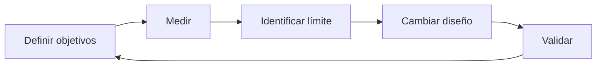
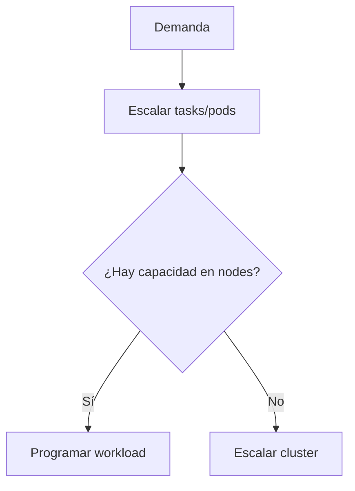
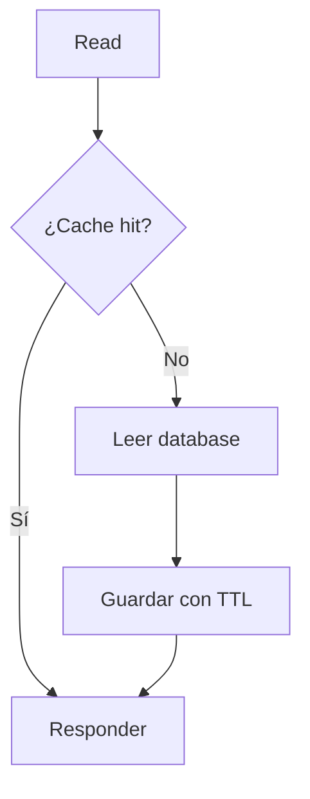
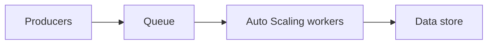

# Rendimiento y capacity planning en AWS para el examen SAA-C03

## 1. Alcance necesario para el examen

El dominio 3 del SAA-C03 evalúa el diseño de arquitecturas de alto rendimiento. Para responder correctamente se debe poder:

- Traducir requisitos de negocio en SLI, SLO y métricas técnicas.
- Diferenciar latencia, throughput, concurrencia, utilización y saturación.
- Caracterizar demanda base, picos, ráfagas, estacionalidad y crecimiento.
- Calcular capacidad mínima y headroom.
- Localizar el cuello de botella del sistema completo.
- Diferenciar escalado vertical, horizontal, reactivo, programado y predictivo.
- Elegir métricas de escalado proporcionales a la demanda.
- Configurar Auto Scaling evitando oscilaciones y escalado tardío.
- Seleccionar familias y tamaños de EC2.
- Comprender créditos de CPU, red, EBS y throughput.
- Planificar concurrencia de Lambda.
- Dimensionar containers mediante requests, limits, tasks y nodes.
- Seleccionar EBS, S3 y EFS según el patrón de I/O.
- Escalar lecturas, escrituras y conexiones de bases de datos.
- Diferenciar DynamoDB provisioned y on-demand.
- Diseñar partition keys que eviten hot partitions.
- Integrar caches y seleccionar una estrategia de invalidación.
- Escalar consumers usando backlog o lag.
- Dimensionar shards y partitions de streaming.
- Vigilar Service Quotas antes de un pico.
- Diseñar capacidad para pérdida de una AZ.
- Validar decisiones mediante benchmarks y load tests.
- Optimizar costo por unidad de trabajo sin incumplir el SLO.

> **Alcance:** este capítulo desarrolla el razonamiento de rendimiento y capacidad. Los resúmenes individuales de servicios permanecen en sus capítulos de categoría.

---

## 2. Performance Efficiency

El pilar Performance Efficiency del AWS Well-Architected Framework consiste en utilizar recursos eficientemente y mantener esa eficiencia cuando:

- Cambia la demanda.
- Evoluciona la tecnología.
- Aumenta el volumen de datos.
- Se agregan usuarios o regiones.

### Ciclo

### Principios

- Democratizar tecnologías avanzadas mediante servicios administrados.
- Implementar globalmente con rapidez cuando se necesite.
- Utilizar arquitecturas serverless cuando sean apropiadas.
- Experimentar con frecuencia.
- Considerar mechanical sympathy: seleccionar la tecnología que corresponde al patrón.

### Trade-offs

Una mejora puede afectar:

- Costo.
- Consistencia.
- Durabilidad.
- Disponibilidad.
- Complejidad.
- Seguridad.

Ejemplo:

- Una cache reduce latencia y carga de base de datos.
- Introduce invalidación y posible información stale.

> **Regla de examen:** la arquitectura de mayor rendimiento absoluto no siempre es la correcta; debe satisfacer el requisito con costo y operación razonables.

---

## 3. Requisitos y objetivos

No se puede planificar capacidad sin definir qué significa “suficientemente rápido”.

### Requisitos funcionales

- Tipo de transacción.
- Tamaño del objeto.
- Patrón de lectura y escritura.
- Consistencia.
- Orden.
- Durabilidad.

### Requisitos no funcionales

- Requests por segundo.
- Latencia p95 o p99.
- Usuarios concurrentes.
- Volumen diario.
- Tiempo máximo de procesamiento.
- Recovery objective.
- Presupuesto.

### SLI, SLO y SLA

| Concepto | Función |
|---|---|
| SLI | Indicador medido, por ejemplo latencia p99 |
| SLO | Objetivo interno, por ejemplo p99 menor a 300 ms |
| SLA | Compromiso contractual y posibles consecuencias |

### Ejemplo

Requisito impreciso:

> La API debe ser rápida.

Requisito utilizable:

> La API debe procesar 2 000 RPS con latencia p95 menor a 200 ms y error rate menor a 0,1 % durante el pico.

### Error budget

Si un SLO de disponibilidad es `99,9 %`, el error budget es el porcentaje restante. Permite decidir cuánto riesgo aceptar al:

- Desplegar.
- Experimentar.
- Reducir costo.
- Operar cerca del límite.

---

## 4. Vocabulario de rendimiento

| Concepto | Definición |
|---|---|
| Latencia | Tiempo de una operación |
| Throughput | Trabajo completado por unidad de tiempo |
| Concurrencia | Trabajo simultáneo en progreso |
| Utilización | Porcentaje de capacidad ocupada |
| Saturación | Trabajo esperando porque un recurso está al límite |
| Error rate | Fracción de operaciones fallidas |
| IOPS | Operaciones de I/O por segundo |
| Bandwidth | Bits o bytes transferibles por segundo |
| Queue depth | Operaciones pendientes |
| Backlog | Trabajo acumulado sin procesar |
| Lag | Retraso del consumer respecto al producer |

### Latencia promedio frente a percentiles

La media puede ocultar una cola lenta.

| Métrica | Lectura |
|---|---|
| p50 | Experiencia mediana |
| p90 | 90 % termina por debajo |
| p95 | Detecta degradación de cola |
| p99 | Experiencia de los casos más lentos |
| Maximum | Puede estar dominado por un outlier |

Si el requisito dice “99 % de requests”, medir p99, no solo Average.

### Throughput no implica baja latencia

Un sistema puede:

- Procesar muchas solicitudes por segundo.
- Acumular cola.
- Entregar cada solicitud demasiado tarde.

Por ello se deben observar throughput y latencia juntos.

---

## 5. Caracterización de la demanda

### Perfil

Registrar:

- Baseline.
- Peak.
- Duración del peak.
- Burst rate.
- Crecimiento mensual o anual.
- Estacionalidad diaria, semanal y anual.
- Distribución geográfica.
- Tamaño de requests.
- Proporción read/write.
- Dependencias externas.

### Clases de demanda

| Patrón | Ejemplo | Respuesta |
|---|---|---|
| Estable | Back office continuo | Capacity baseline |
| Cíclico | Horario laboral | Scheduled/predictive scaling |
| Impredecible | Campaña viral | Elasticidad y buffer |
| Ráfaga corta | Login masivo | Headroom, cache y queue |
| Crecimiento sostenido | Más clientes | Forecast y revisión periódica |
| Batch | Cierre nocturno | Capacidad temporal o Batch |

### Dataset representativo

El rendimiento cambia con:

- Número de filas u objetos.
- Cardinalidad.
- Distribución de claves.
- Tamaño de items.
- Cache caliente o fría.
- Fragmentación.

Una prueba con pocos datos puede producir una conclusión falsa.

---

## 6. Método de capacity planning

### Paso 1: definir la unidad de trabajo

Ejemplos:

- Request.
- Mensaje.
- Transaction.
- Query.
- GB transferido.
- Archivo procesado.

### Paso 2: medir capacidad por unidad

Determinar bajo carga:

- Tiempo de CPU.
- Memoria.
- I/O.
- Conexiones.
- Bytes.
- Dependencias.

### Paso 3: estimar demanda pico

Usar:

- Históricos.
- Forecast.
- Eventos del negocio.
- Crecimiento.
- Pruebas.

### Paso 4: calcular recursos

$$
\text{Instancias necesarias} =
\left\lceil
\frac{\text{Demanda pico}}{\text{Capacidad segura por instancia}}
\right\rceil
$$

### Paso 5: agregar headroom

$$
\text{Capacidad objetivo} =
\text{Capacidad calculada} \times (1 + \text{Headroom})
$$

El headroom cubre:

- Variabilidad.
- Tiempo de escalado.
- Pérdida de una AZ.
- Deployments.
- Errores de estimación.

### Paso 6: validar

- Load test.
- Failure test.
- Soak test.
- Peak event simulation.
- Revisión de cuotas.

### Paso 7: automatizar y revisar

Capacity planning en cloud no significa comprar capacidad para varios años. Significa:

- Definir límites iniciales.
- Escalar automáticamente.
- Vigilar tendencias.
- Ajustar periódicamente.

---

## 7. Fórmulas útiles

### Utilización

$$
\text{Utilización} =
\frac{\text{Uso observado}}{\text{Capacidad disponible}}
\times 100
$$

### Throughput requerido

$$
\text{Throughput} =
\frac{\text{Trabajo}}{\text{Tiempo}}
$$

### Concurrencia

Para una tasa promedio de llegadas y duración promedio:

$$
\text{Concurrencia} =
\text{Requests por segundo}
\times
\text{Duración en segundos}
$$

Ejemplo:

- 1 000 RPS.
- Duración promedio `0,2 s`.
- Concurrencia aproximada: `200`.

Esta fórmula es especialmente útil para Lambda y connection pools.

### Little's Law

En un sistema estable:

$$
L = \lambda W
$$

Donde:

- $L$: trabajo promedio dentro del sistema.
- $\lambda$: tasa de llegada.
- $W$: tiempo promedio en el sistema.

Si llegan 100 mensajes/s y cada uno permanece 5 s:

$$
L = 100 \times 5 = 500
$$

### Backlog por worker

$$
\text{Backlog por worker} =
\frac{\text{Mensajes visibles}}{\text{Workers activos}}
$$

### Backlog aceptable

$$
\text{Backlog aceptable por worker} =
\frac{\text{Latencia máxima aceptable}}{\text{Tiempo por mensaje}}
$$

> **Precaución:** estas fórmulas producen una estimación. La capacidad real debe medirse porque existen locks, I/O, retries, distribución desigual y overhead.

---

## 8. Cuellos de botella

El throughput del sistema queda limitado por el componente con menor capacidad efectiva.

Escalar el frontend no mejora un writer de base de datos saturado.

### Recursos limitantes

- CPU.
- Memoria.
- Garbage collection.
- Network bandwidth.
- Packets per second.
- EBS bandwidth.
- IOPS o throughput.
- Database connections.
- Locks.
- Hot keys o partitions.
- API quotas.
- Downstream latency.

### Bottleneck móvil

Después de corregir un límite:

1. Aumenta el throughput.
2. Otro componente se vuelve el límite.
3. Se debe medir nuevamente.

### Utilización alta

No toda utilización alta es un problema.

- CPU al 80 % con latencia estable puede ser eficiente.
- CPU al 40 % con lock contention puede tener mal rendimiento.
- Average CPU de un fleet puede ocultar una instancia o shard caliente.

> **Regla:** escalar según el recurso o resultado que limita el SLO, no según una métrica cómoda.

---

## 9. Métricas y CloudWatch

### Método RED

Para servicios request-driven:

- **Rate:** requests por segundo.
- **Errors:** errores por segundo o porcentaje.
- **Duration:** latencia y percentiles.

### Método USE

Para recursos:

- **Utilization.**
- **Saturation.**
- **Errors.**

### Métricas técnicas

| Capa | Métricas |
|---|---|
| ALB/API | Request count, target response time, 4xx, 5xx |
| EC2 | CPU, network, status checks |
| OS | Memory, disk usage, processes |
| EBS | IOPS, throughput, queue, latency, burst balance |
| RDS | CPU, connections, free memory, IOPS, queue, lag |
| DynamoDB | Consumed capacity, throttles, latency |
| Lambda | Duration, concurrency, throttles, errors |
| SQS | Visible messages, age of oldest, in-flight |
| Cache | Hit rate, evictions, memory, connections |
| Streaming | Incoming rate, iterator age, consumer lag |

### Métricas de EC2

EC2 publica métricas de infraestructura como CPU y red. Memoria y uso de filesystem dentro del sistema operativo requieren:

- CloudWatch Agent.
- Otro agente o plataforma de observabilidad.

### Estadística correcta

| Métrica | Estadística típica |
|---|---|
| Requests | `Sum` |
| Utilización promedio del fleet | `Average` |
| Concurrencia Lambda | `Maximum` |
| Latencia de usuario | p95/p99 |
| Error rate | Metric math |

### Dimensions

Una métrica puede tener dimensiones como:

- InstanceId.
- AutoScalingGroupName.
- LoadBalancer.
- TargetGroup.
- FunctionName.

Elegir mal la dimensión puede mezclar workloads y ocultar saturación.

### Alarmas

Definir:

- Threshold.
- Period.
- Evaluation periods.
- Datapoints to alarm.
- Tratamiento de missing data.

CloudWatch Anomaly Detection aprende patrones horarios, diarios y semanales y crea una banda esperada.

---

## 10. Benchmark, load test y experimentación

### Tipos de prueba

| Prueba | Objetivo |
|---|---|
| Benchmark | Comparar una unidad o configuración |
| Load test | Validar carga esperada |
| Stress test | Encontrar el límite |
| Spike test | Validar ráfagas |
| Soak test | Detectar degradación prolongada |
| Failover test | Validar rendimiento durante fallas |

### Buen diseño

- Utilizar datos representativos.
- Incluir cache fría y caliente.
- Aumentar carga gradualmente.
- Medir cliente y servidor.
- Observar todos los downstream.
- Definir criterios de aprobación.
- Repetir para comparar.
- Limpiar recursos después.

### Evitar

- Probar producción sin controles.
- Utilizar un generador de carga que se satura primero.
- Medir únicamente Average.
- Ignorar errores y contar solo requests exitosos.
- Cambiar varias variables a la vez.
- Extrapolar linealmente fuera del rango probado.

### Resultado mínimo

Documentar:

- Configuración.
- Versión.
- Dataset.
- RPS alcanzado.
- p50, p95 y p99.
- Error rate.
- Saturación.
- Costo por unidad de trabajo.

---

## 11. Service Quotas

La capacidad de un recurso puede estar disponible, pero una cuota puede bloquear el escalado.

### Ejemplos

- EC2 On-Demand vCPUs.
- Elastic IPs.
- Lambda concurrency.
- Auto Scaling groups.
- ENIs.
- API Gateway throttling.
- Kinesis shards.
- DynamoDB account/table limits.
- EBS IOPS.

### Tipos

| Tipo | Acción |
|---|---|
| Adjustable | Solicitar aumento con anticipación |
| Non-adjustable | Rediseñar, distribuir o reducir uso |
| Regional | Revisar cada región |
| Account-level | Revisar cada cuenta |
| Resource-level | Revisar cada recurso |

### Proceso previo a un evento

1. Inventariar servicios.
2. Estimar uso pico.
3. Consultar Service Quotas.
4. Solicitar aumentos.
5. Probar la capacidad aprobada.
6. Crear alarmas y notificaciones.

Service Quotas Automatic Management puede vigilar cuotas soportadas y notificar o solicitar ajustes según la configuración disponible.

> **Trampa:** aumentar `MaxSize` de un Auto Scaling group no garantiza que EC2 pueda lanzar si falta cuota, capacidad de subnet o instance capacity.

---

## 12. Formas de escalado

### Vertical

Cambiar a un recurso más grande:

- Más vCPU.
- Más memoria.
- Más IOPS.
- Más network bandwidth.

Ventajas:

- Simple.
- Útil para engines o aplicaciones difíciles de distribuir.

Limitaciones:

- Tamaño máximo.
- Posible downtime.
- Mayor blast radius.
- No elimina un single point of failure.

### Horizontal

Agregar unidades:

- EC2 instances.
- Containers.
- Lambda execution environments.
- Read replicas.
- Shards.
- Partitions.

Ventajas:

- Elasticidad.
- Availability.
- Menor blast radius.

Requiere:

- Aplicación stateless o estado externo.
- Load balancing.
- Distribución uniforme.
- Coordinación de datos.

### Diagonal

Combina:

1. Escalar verticalmente hasta un tamaño eficiente.
2. Escalar horizontalmente a partir de varias unidades.

### Reactivo, programado y predictivo

| Método | Uso |
|---|---|
| Reactive | Demanda impredecible medida en tiempo real |
| Scheduled | Evento conocido |
| Predictive | Patrón histórico diario o semanal |
| Manual | Excepción controlada, no estrategia principal |

---

## 13. Selección de Amazon EC2

Una instance family optimiza una combinación de CPU, memoria, almacenamiento y red.

### Familias conceptuales

| Categoría | Familias comunes | Workload |
|---|---|---|
| General purpose | M, T | Aplicaciones balanceadas |
| Compute optimized | C | CPU intensiva, web de alto rendimiento, batch |
| Memory optimized | R, X, U | In-memory, grandes bases, analytics |
| Storage optimized | I, D, H | I/O local, data warehouse, distributed storage |
| Accelerated computing | P, G, Inf, Trn | GPU, ML training/inference |

Las generaciones y tamaños cambian. En el examen importa seleccionar la categoría adecuada.

### Burstable instances

Las familias T:

- Tienen CPU baseline.
- Acumulan y consumen CPU credits.
- Pueden burst por encima del baseline.

Métricas:

- `CPUCreditBalance`.
- `CPUSurplusCreditBalance`.
- `CPUSurplusCreditsCharged`.

Usarlas para carga sostenida alta puede:

- Agotar créditos en Standard.
- Generar cargos adicionales en Unlimited.
- Producir rendimiento menos predecible.

### Límite de instance type

El rendimiento final puede quedar limitado por:

- vCPU y memoria.
- Baseline/burst network bandwidth.
- Packets per second.
- EBS bandwidth.
- Número de ENIs.
- Arquitectura del procesador.

Un volumen EBS capaz de entregar más IOPS no supera el límite EBS de la EC2.

### Placement groups

| Strategy | Objetivo |
|---|---|
| Cluster | Baja latencia y alto throughput entre instancias cercanas |
| Spread | Separar pocas instancias críticas en hardware distinto |
| Partition | Separar grupos de nodos de sistemas distribuidos |

Cluster placement group mejora red, pero concentra recursos y no es la opción para tolerar una falla amplia.

### Graviton

Procesadores AWS Graviton pueden mejorar relación precio-rendimiento para software compatible con Arm. Se debe validar:

- Runtime.
- Native dependencies.
- Container images multi-architecture.
- Benchmark real.

---

## 14. Amazon EC2 Auto Scaling

Un Auto Scaling group define:

- `MinSize`.
- `DesiredCapacity`.
- `MaxSize`.
- Launch template.
- Subnets/AZ.
- Health checks.
- Scaling policies.

### Policies

| Policy | Comportamiento |
|---|---|
| Target tracking | Mantener una métrica cerca de un target |
| Step scaling | Ajustar diferente según magnitud de alarma |
| Scheduled | Cambiar capacidad en fecha/hora |
| Predictive | Forecast basado en patrones históricos |

### Métrica de escalado

Una buena utilization metric:

- Aumenta cuando aumenta la demanda.
- Disminuye al agregar capacidad.
- Mantiene relación proporcional con el fleet.

Ejemplos:

- Average CPU si el workload es CPU-bound.
- `ALBRequestCountPerTarget`.
- Backlog por instance.
- Custom metric por worker.

Mala métrica:

- Total request count sin dividir por capacidad para target tracking.
- CPU cuando el límite real son conexiones.
- Average que oculta una partition caliente.

### Target tracking

Es similar a un termostato:

- Scale out para regresar al target.
- Scale in de forma más conservadora.
- Auto Scaling administra las alarmas relacionadas.

### Warmup

Default instance warmup evita contar métricas de una instancia antes de que esté lista para atender carga.

Configurar según:

- Boot.
- User data.
- Registro en service discovery.
- Cache warming.
- Health check.

Warmup demasiado largo retrasa decisiones; demasiado corto utiliza métricas de instancias aún inicializando.

### Cooldown y estabilidad

Evitar thrashing mediante:

- Target tracking.
- Warmup adecuado.
- Scale-in conservador.
- Métricas estables.
- Hysteresis o evaluation periods.

### Warm pools

Reducen la latencia de scale-out para aplicaciones con initialization time largo manteniendo instancias preinicializadas en estados de menor costo compatibles.

### Mixed instances

Varias instance types:

- Mejoran disponibilidad de capacidad.
- Permiten combinar On-Demand y Spot.
- Requieren pesos o equivalencia de capacidad bien calculados.

> **Regla:** Auto Scaling reemplaza capacidad y responde a demanda; no corrige una aplicación stateful que no puede distribuir sesiones.

---

## 15. Containers: ECS, EKS y Fargate

### Dimensiones

- CPU y memory request/reservation.
- CPU y memory limit.
- Tasks o pods.
- Nodes.
- ENIs e IPs.
- Storage.
- Conexiones.

### Dos niveles

En Fargate, AWS administra la capacidad subyacente, pero la aplicación aún debe:

- Escalar task/pod count.
- Definir CPU/memory correctos.
- Respetar cuotas.

### ECS

- Service Auto Scaling modifica desired task count.
- Capacity providers administran la relación entre tasks y capacidad EC2.
- Métricas pueden incluir CPU, memory, ALB requests o custom backlog.

### EKS

- Horizontal Pod Autoscaler escala replicas.
- Vertical Pod Autoscaler recomienda o ajusta requests según el modo.
- Cluster Autoscaler o una solución de aprovisionamiento compatible agrega/remueve nodes.

### Requests incorrectos

| Configuración | Consecuencia |
|---|---|
| Request muy alto | Baja utilización y pods Pending |
| Request muy bajo | Overcommit y throttling/eviction |
| Limit CPU muy bajo | CPU throttling |
| Sin memory control | Riesgo de OOM y contención |

### Restricciones ocultas

- IP exhaustion de subnets.
- ENI limits.
- Pod density.
- DaemonSets.
- AZ constraints.
- Taints y affinity.
- PodDisruptionBudgets.

CPU libre no garantiza que un pod sea schedulable.

---

## 16. AWS Lambda

### Concurrencia

$$
\text{Concurrency} =
\text{Requests/segundo}
\times
\text{Duración promedio en segundos}
$$

Ejemplo:

- 500 RPS.
- 400 ms.
- Concurrency aproximada: `200`.

### Reserved concurrency

- Reserva parte del pool regional para una función.
- Establece también un máximo para esa función.
- Protege downstreams.
- No elimina cold starts.
- No tiene cargo adicional por reservar.

### Provisioned concurrency

- Preinicializa execution environments.
- Reduce cold-start latency.
- Tiene costo adicional.
- Puede escalar mediante Application Auto Scaling.

### Memory

Lambda asigna CPU proporcionalmente a memory.

Aumentar memory puede:

- Reducir duration.
- Mejorar CPU y network.
- Reducir o aumentar costo total según la mejora.

Se debe benchmarkear cada función.

### Optimización

- Reutilizar SDK clients y conexiones fuera del handler.
- Reducir package y initialization.
- Evitar trabajo innecesario.
- Ajustar timeout.
- Utilizar provisioned concurrency o SnapStart cuando corresponda.
- Controlar event source batch size.
- Monitorizar `ConcurrentExecutions`, `Throttles`, `Duration` y `Errors`.

### Cuotas

Revisar:

- Regional concurrency.
- Function reserved concurrency.
- Scaling rate.
- RPS relacionado con concurrency.
- Event source limits.
- Downstream capacity.

> **Trampa:** Lambda puede escalar más rápido que RDS. Utilizar RDS Proxy, reserved concurrency, queue o control de backpressure.

---

## 17. Red, balanceo y edge

### Métricas de red

- Bandwidth.
- Packets per second.
- Connections per second.
- Active flows.
- Latency.
- Packet loss.
- Retransmissions.

### Load balancer

Un ELB:

- Distribuye carga entre targets saludables.
- Facilita horizontal scaling.
- No aumenta la capacidad de un target.

Seleccionar:

| Requisito | Servicio |
|---|---|
| HTTP routing por host/path | ALB |
| TCP/UDP, IP estática, alto desempeño L4 | NLB |
| Fleet de appliances | GWLB |

### Cross-zone

Puede mejorar distribución cuando hay números desiguales de targets por AZ, pero puede:

- Generar transferencia inter-AZ.
- Ocultar una mala distribución de capacidad.

### CloudFront

Reduce:

- Latencia para usuarios globales.
- Requests al origin.
- Transferencia repetitiva.

La cache key debe incluir solo los atributos necesarios. Incluir demasiados headers, cookies o query strings reduce hit ratio.

### Global Accelerator

Mejora el camino para:

- TCP/UDP.
- Aplicaciones no cacheables.
- Multi-Region failover.
- Clientes que necesitan static anycast IPs.

### Placement

Ubicar compute, database y storage:

- En la misma región.
- En AZ adecuadas.
- Cerca de usuarios mediante edge o regiones.

Evaluar latencia frente a resiliencia y transferencia.

---

## 18. Caching

Una cache intercambia consistencia y complejidad por menor latencia y menor carga.

### Niveles

- Browser/client.
- CloudFront.
- API/application.
- ElastiCache.
- DAX.
- Database buffer cache.

### Cache-aside

Ventajas:

- Solo cachea datos solicitados.
- La aplicación sobrevive a una cache vacía.

Desventajas:

- Miss penalty.
- Posible stale data.

### Write-through

La aplicación escribe cache junto con el data store.

- Datos frecuentes están frescos.
- Puede guardar datos que nunca se leen.
- Se debe manejar fallo parcial.

### TTL e invalidación

TTL corto:

- Más fresh.
- Más misses y carga.

TTL largo:

- Mejor hit ratio.
- Más riesgo de stale data.

### Problemas

- Cache stampede.
- Hot keys.
- Evictions.
- Memory fragmentation.
- Failover con cache fría.
- Client connection storms.

Mitigaciones:

- Request coalescing.
- TTL jitter.
- Prewarming selectivo.
- Read replicas/shards.
- Backoff.

### Métricas

- Cache hit ratio.
- Misses.
- Evictions.
- Memory utilization.
- CPU/engine CPU.
- Connections.
- Replication lag.

---

## 19. Rendimiento de Amazon EBS

EBS es block storage. El resultado depende de tres capas:

1. Aplicación y filesystem.
2. Volume.
3. Límite EBS de la EC2.

### Tipos

| Tipo | Optimizado para |
|---|---|
| `gp3` | SSD general; size, IOPS y throughput configurables |
| `gp2` | SSD general; rendimiento relacionado con tamaño y créditos |
| `io2` | IOPS sostenidas, baja latencia y cargas críticas |
| `st1` | HDD, throughput secuencial |
| `sc1` | HDD de menor costo y acceso infrecuente |

`st1` y `sc1` no son boot volumes.

### IOPS frente a throughput

$$
\text{Throughput} =
\text{IOPS} \times \text{Tamaño de I/O}
$$

El máximo queda limitado por:

- Provisioned IOPS.
- Volume throughput.
- Instance EBS bandwidth.
- Queue y paralelismo.

### Métricas

- Read/write operations.
- Read/write bytes.
- Latency.
- Queue length.
- Burst balance para tipos aplicables.
- `VolumeIOPSExceededCheck`.
- `VolumeThroughputExceededCheck`.

### Optimización

- Elegir volume type adecuado.
- Alinear I/O size.
- Utilizar paralelismo.
- Separar data/log/temp según workload.
- Aumentar IOPS o throughput con Elastic Volumes.
- Seleccionar EC2 con EBS bandwidth suficiente.
- Benchmarkear con dataset y filesystem reales.

> **Trampa:** aumentar tamaño de `gp3` no aumenta automáticamente IOPS como estrategia general; gp3 desacopla size, IOPS y throughput.

---

## 20. Rendimiento de Amazon S3 y EFS

### Amazon S3

S3 escala automáticamente a altas tasas de requests.

Como referencia oficial para general purpose buckets:

- Al menos 3 500 PUT/COPY/POST/DELETE por segundo por partitioned prefix.
- Al menos 5 500 GET/HEAD por segundo por partitioned prefix.
- Se pueden usar múltiples prefixes y paralelismo.

El escalado a una tasa nueva es gradual y puede producir temporalmente `503 Slow Down`.

### Patrones S3

- Requests concurrentes.
- Multipart upload.
- Byte-range GET.
- CloudFront para cache.
- Transfer Acceleration para distancia geográfica.
- S3 Express One Zone para baja latencia y workload request-intensive cuando el modelo zonal es aceptable.

Revisar además:

- KMS request quotas.
- Cliente network bandwidth.
- Número/tamaño de objetos.
- Retry con exponential backoff.

### Amazon EFS

EFS es shared file storage elástico.

Throughput modes:

| Mode | Uso |
|---|---|
| Elastic | Workload impredecible; escala automáticamente |
| Provisioned | Throughput independiente de datos almacenados |
| Bursting | Rendimiento relacionado con tamaño y burst credits |

Performance modes:

| Mode | Característica y decisión |
|---|---|
| General Purpose | Menor latencia por operación, modo predeterminado y recomendado para nuevos diseños |
| Max I/O | Generación anterior para workloads muy paralelos que toleran mayor latencia; no admite One Zone ni Elastic throughput |

AWS recomienda General Purpose para los sistemas de archivos actuales. Max I/O puede aparecer como distractor o en escenarios heredados.

Métricas:

- `PercentIOLimit`.
- `BurstCreditBalance`.
- Throughput.
- Client connections.

Si `BurstCreditBalance` permanece cerca de cero, evaluar Elastic o Provisioned throughput.

---

## 21. Rendimiento de RDS y Aurora

### Identificar el límite

- CPU.
- Freeable memory.
- Storage IOPS/throughput.
- Disk queue.
- Connections.
- Locks.
- Query plan.
- Replica lag.

### Scale up

Cambiar DB instance class mejora:

- CPU.
- Memory.
- Network.
- EBS bandwidth según clase.

No corrige:

- Query sin índice.
- Lock contention.
- N+1 queries.
- Connection leak.

### Scale reads

- RDS read replicas.
- Aurora Replicas.
- Aurora reader endpoint.
- Application read/write splitting.

Las replicas pueden tener lag; no usarlas para una lectura que exige ver inmediatamente la escritura si no se puede tolerar ese comportamiento.

### Multi-AZ

El objetivo principal de un deployment Multi-AZ DB instance tradicional es alta disponibilidad, no read scaling desde el standby.

No confundir con:

- Read replica.
- RDS Multi-AZ DB cluster con instancias legibles.
- Aurora cluster.

### Connections

Muchas conexiones consumen memoria y CPU.

RDS Proxy:

- Pooling.
- Multiplexing.
- Reutilización.
- Protección frente a connection storms.
- Mejor failover de aplicación.

### Storage autoscaling

RDS puede aumentar storage cuando se aproxima al límite configurado. No reduce storage automáticamente y no sustituye:

- Monitoreo.
- Capacity forecast.
- Optimización de I/O.

### Aurora

- Storage distribuido administrado.
- Reader endpoint balancea nuevas conexiones entre replicas.
- Auto Scaling puede agregar/remover Aurora Replicas.
- Aurora Serverless v2 ajusta compute dentro de un rango min/max de ACU.

Definir un máximo demasiado bajo produce saturación aunque el servicio sea “serverless”.

### Herramientas

- CloudWatch.
- Performance Insights/Database Insights.
- Enhanced Monitoring.
- Engine logs.
- Query plans.

---

## 22. Rendimiento de DynamoDB

### Capacity modes

| Mode | Uso |
|---|---|
| On-demand | Tráfico nuevo, impredecible o variable |
| Provisioned | Tráfico predecible y control explícito de RCU/WCU |

Provisioned puede utilizar Application Auto Scaling.

### Unidades

El consumo depende de:

- Tamaño de item.
- Operación read/write.
- Consistencia.
- Transactional operation.
- Índices actualizados.

No memorizar solo “requests”; calcular capacity units según el tipo de operación.

### Partition key

Una clave con alta cardinalidad distribuye tráfico.

Malas opciones:

- Un solo tenant muy activo.
- Fecha como clave monotónica sin sharding.
- Status con pocos valores.
- Un device ID que concentra la mayoría del tráfico.

### Hot partition

Puede existir throttling aunque la tabla tenga capacidad total disponible.

Cada partition tiene límites físicos. Adaptive capacity ayuda a tráfico desigual, pero no elimina un hot key ilimitado.

### Mitigación

- Mejor partition key.
- Write sharding.
- Distribute hot items.
- Cache con DAX/ElastiCache.
- On-demand o más provisioned capacity cuando el problema es table-level.
- Exponential backoff con jitter.

### Global Secondary Index

Un GSI:

- Tiene su propia capacidad/configuración.
- Puede ser el origen de write throttling.
- Añade write amplification.

### DAX

Cache in-memory compatible con DynamoDB para workloads read-heavy y microsecond latency.

No mejora:

- Escrituras sostenidas como objetivo principal.
- Queries mal distribuidas.
- Hot key de escritura.

### Métricas

- `ConsumedReadCapacityUnits`.
- `ConsumedWriteCapacityUnits`.
- `ReadThrottleEvents`.
- `WriteThrottleEvents`.
- `SuccessfulRequestLatency`.
- Métricas de key-range throttling.

---

## 23. Analytics y data warehouse

### Amazon Redshift

Factores:

- Distribución uniforme.
- Colocation de joins.
- Sort keys.
- Compression.
- Workload Management.
- Concurrency Scaling.
- Dataset y query pattern.

Un DISTKEY deficiente produce data skew y movimiento entre nodes.

Un sort key apropiado permite omitir blocks para range predicates.

Redshift Advisor y Automatic Table Optimization pueden recomendar o aplicar optimizaciones.

### Athena

Mejorar performance y costo mediante:

- Formatos columnar como Parquet u ORC.
- Compression.
- Partitioning.
- Archivos de tamaño razonable.
- Evitar millones de tiny files.
- Seleccionar solo columnas necesarias.

### EMR

Considerar:

- Número/tipo de nodes.
- Parallelism.
- Data locality.
- Shuffle.
- Memory.
- Spot para tasks tolerantes.
- EMR managed scaling cuando corresponda.

### AWS Glue

Dimensionar:

- Worker type.
- Número de workers.
- Partitions.
- Job bookmarks.
- Data format.

Más workers no corrigen un único input file no divisible o data skew.

---

## 24. SQS y workers

SQS desacopla producer y consumer y absorbe ráfagas.

### Métricas

- `ApproximateNumberOfMessagesVisible`.
- `ApproximateNumberOfMessagesNotVisible`.
- `ApproximateAgeOfOldestMessage`.
- Messages sent/deleted.
- DLQ depth.

### Backlog por worker

Para Auto Scaling:

$$
\text{Backlog por worker} =
\frac{\text{Mensajes visibles}}{\text{Workers InService}}
$$

Target:

$$
\text{Backlog aceptable} =
\frac{\text{Latencia aceptable}}{\text{Tiempo promedio por mensaje}}
$$

### Ejemplo

- Latencia aceptable: 20 s.
- Processing time: 0,2 s/mensaje.

$$
\text{Target} = \frac{20}{0,2} = 100
$$

Mantener cerca de 100 mensajes por worker.

### Visibility timeout

Debe superar el tiempo normal de procesamiento y extenderse cuando sea necesario.

Muy corto:

- Redelivery mientras el primer worker aún procesa.

Muy largo:

- Recuperación lenta cuando un worker falla.

### Throughput

Mejorar mediante:

- Long polling.
- Batch receive/delete/send.
- Más consumers.
- Idempotencia.
- DLQ.

### Métrica equivocada

CPU puede ser baja aunque el backlog crezca si los workers esperan I/O. Escalar por backlog/age refleja mejor el resultado esperado.

---

## 25. Streaming e ingestión

### Amazon Kinesis Data Streams

En provisioned mode, shard es la unidad base de capacidad.

Como referencia:

- Hasta 1 MB/s o 1 000 records/s de escritura por shard.
- Hasta 2 MB/s de lectura compartida por shard.

Se debe cumplir el primer límite alcanzado: records o bytes.

### Dimensionamiento de shards

$$
\text{Shards de escritura} =
\max
\left(
\left\lceil\frac{\text{Records/s}}{1000}\right\rceil,
\left\lceil\frac{\text{MB/s}}{1}\right\rceil
\right)
$$

Agregar headroom y validar partition key distribution.

### Partition key

Una partition key con skew envía demasiados records a un shard y produce hot shard aunque el stream tenga capacidad agregada.

### Consumers

- Shared throughput consumers comparten lectura por shard.
- Enhanced fan-out ofrece throughput dedicado por consumer-shard y menor propagación.
- `IteratorAgeMilliseconds` indica retraso del consumer.

### On-demand

Reduce la administración de shards, pero:

- No elimina límites de una partition key.
- Tiene comportamiento de escalado y cuotas.
- Debe monitorizarse.

### Amazon MSK

La capacidad depende de:

- Brokers.
- Partitions.
- Replication factor.
- Message size.
- Producer/consumer configuration.
- Storage.
- Network.

Consumer parallelism queda limitado por partitions: dentro de un consumer group, una partition es procesada por un consumer a la vez.

Monitorizar:

- Consumer lag.
- Under-replicated partitions.
- Broker CPU.
- Network.
- Disk usage.
- Partition distribution.

### Amazon Data Firehose

Servicio administrado para entregar streams a destinos.

Trade-off:

- Buffers más grandes mejoran eficiencia.
- Buffers/intervals mayores aumentan latencia de entrega.

No elegir Firehose cuando se necesita control de consumer por record y latencia mínima equivalente a Kinesis Data Streams.

---

## 26. Patrones arquitectónicos de rendimiento

### Stateless horizontal

- Estado en DynamoDB, RDS, ElastiCache o S3.
- ELB distribuye.
- Auto Scaling agrega compute.

### Queue-based load leveling

La queue:

- Absorbe bursts.
- Protege downstream.
- Permite scale independiente.
- Aumenta procesamiento asíncrono.

### Read scaling

- Cache.
- Read replicas.
- Materialized views.
- CDN.
- Precomputation.

### Partitioning

Divide por:

- Key.
- Tenant.
- Región.
- Tiempo.
- Hash.

Permite escalar, pero requiere distribución uniforme y operaciones cross-partition controladas.

### Parallelization

- Multipart.
- Map/reduce.
- Batch partitions.
- Concurrent requests.
- Fan-out.

El speedup queda limitado por la parte serial y por contention.

### Precomputation

Cuando la query es costosa y el resultado cambia poco:

- Materialized view.
- Aggregated table.
- Cache.
- Scheduled computation.

Intercambia freshness por latencia.

---

## 27. Backpressure y control de demanda

Escalar no siempre es suficiente. Un sistema debe reaccionar cuando la demanda supera la capacidad segura.

### Mecanismos

- Queue.
- Rate limit.
- Throttling.
- Concurrency limit.
- Load shedding.
- Circuit breaker.
- Retry con backoff y jitter.
- Admission control.

### Retry storm

Sin backoff:

1. Downstream se degrada.
2. Clients reintentan inmediatamente.
3. Aumenta la carga.
4. Downstream empeora.

### Exponential backoff

Espacia reintentos. Jitter evita que todos los clientes reintenten simultáneamente.

### Reserved concurrency como protección

Limitar una Lambda puede proteger:

- RDS connections.
- API externa.
- Downstream con quota fija.

Los eventos deben:

- Quedar en queue.
- Reintentarse según la integración.
- Ir a DLQ/on-failure destination cuando corresponda.

### Timeout budget

El timeout de upstream debe considerar:

- Su propio procesamiento.
- Retries.
- Downstream timeout.
- Network.

Un downstream timeout mayor que el upstream puede dejar trabajo inútil ejecutándose después de que el cliente abandonó.

---

## 28. Capacidad y resiliencia

Performance debe mantenerse durante:

- Pérdida de una instance.
- Deployment.
- Pérdida de una AZ.
- Scaling activity.
- Maintenance.

### Capacidad N+1

El fleet debe soportar la demanda si una unidad deja de estar disponible.

### Pérdida de AZ

Si se usan tres AZ con capacidad uniforme y se pierde una:

- Queda aproximadamente dos tercios de la capacidad.
- Las otras AZ deben absorber la demanda.
- Scale-out debe tener cuota, IPs y capacidad.

### Ejemplo

Demanda pico: 12 unidades.

Diseño normal:

- 4 unidades por AZ en 3 AZ.

Si se pierde una AZ:

- Quedan 8.
- Faltan 4 para sostener 12.

Opciones:

- Mantener 6 por AZ desde el inicio.
- Escalar rápidamente a 6 por AZ.
- Reducir funcionalidad no crítica.

### Deployment capacity

Rolling deployment necesita headroom para:

- Instancias nuevas en warmup.
- Instancias viejas drenando.
- Min healthy percentage.
- Surge.

### State

El compute puede escalar rápido, pero el stateful tier suele marcar el límite:

- Writer.
- Shared filesystem.
- Lock manager.
- External API.

> **Regla:** la capacidad de failover debe probarse; “Multi-AZ” no garantiza que los recursos sobrevivientes tengan performance suficiente.

---

## 29. Optimización costo-rendimiento

La métrica útil no es solo costo mensual.

### Unit economics

$$
\text{Costo por request} =
\frac{\text{Costo total del periodo}}{\text{Requests exitosos}}
$$

También:

- Costo por transaction.
- Costo por GB procesado.
- Costo por usuario activo.
- Costo por job completado.

### Rightsizing

Underprovisioning:

- Throttling.
- Latencia.
- Fallas.

Overprovisioning:

- Costo ocioso.
- Menor elasticidad.

### Palancas

- Auto Scaling.
- Serverless.
- Graviton.
- Spot para trabajo tolerante.
- Savings Plans para baseline.
- Cache.
- Storage tier adecuado.
- `gp3` en lugar de `gp2` cuando satisface.
- Formato columnar.
- Batch y compresión.

### Target utilization

Target alto:

- Mejor costo.
- Menor headroom.
- Mayor riesgo ante burst.

Target bajo:

- Más headroom.
- Mayor costo.
- Mejor respuesta al peak.

El target debe considerar scaling lag y SLO.

### Scale-in

Scale-in agresivo puede:

- Oscilar.
- Interrumpir work.
- Vaciar cache.
- Aumentar cold starts.

Ahorrar capacidad no debe degradar el SLO.

---

## 30. AWS Compute Optimizer

Compute Optimizer analiza configuración y métricas para generar recomendaciones.

### Recursos compatibles

Puede recomendar sobre tipos soportados como:

- EC2.
- Auto Scaling groups.
- EBS.
- Lambda.
- ECS services on Fargate.
- RDS/Aurora.

La lista exacta evoluciona.

### Resultados

- Rightsized.
- Over-provisioned.
- Under-provisioned.
- Idle.
- Opciones con performance risk y savings estimados.

### Preferencias

Se puede ajustar:

- Lookback.
- CPU headroom.
- Memory headroom.
- Familia o arquitectura.

Memory requiere métricas apropiadas cuando el recurso no la publica por defecto.

### Uso correcto

1. Revisar recomendación.
2. Confirmar periodo representativo.
3. Incluir peaks y eventos.
4. Probar el cambio.
5. Observar después.

No aplicar automáticamente si:

- El histórico no contiene peak.
- Hay DR capacity intencional.
- El workload es estacional.
- Una licencia o requisito restringe tipo.
- Se aproxima un evento.

---

## 31. Anti-patterns

### Escalar solo por CPU

Falla cuando el límite es:

- Memory.
- Connections.
- I/O.
- Queue.
- Downstream.

### Promedios de fleet

Average CPU 50 % puede significar:

- Mitad de instances al 100 %.
- Mitad sin tráfico.

Revisar distribución, target balance y percentiles.

### Auto Scaling sin warmup

Puede:

- Contar CPU alta de bootstrap.
- Lanzar más capacidad innecesaria.
- Oscilar.

### Cache sin invalidación

Produce datos stale o crecimiento de memoria.

### Hot partition

Agregar capacidad agregada puede no corregir:

- Una partition key dominante.
- Un single writer.
- Un único shard.

### Retry sin límites

Aumenta carga durante una falla.

### Prueba sintética pequeña

No representa:

- Índices grandes.
- Cache eviction.
- Lock contention.
- Network saturation.

### Sobreprovisionar permanentemente

Oculta:

- Memory leak.
- Query deficiente.
- Mala distribución.
- Falta de elasticidad.

---

## 32. Diagnóstico sistemático

### Paso 1: definir el síntoma

- Latencia.
- Throughput bajo.
- Error.
- Throttling.
- Backlog.
- Costo.

### Paso 2: definir alcance

- Un usuario o todos.
- Una AZ o todas.
- Una endpoint/version.
- Una partition/tenant.
- Desde un deployment.
- Solo durante peak.

### Paso 3: correlacionar

Superponer:

- Request rate.
- p95/p99.
- Errors.
- CPU/memory.
- I/O.
- Connections.
- Queue/lag.
- Deployments.
- Scaling events.

### Paso 4: localizar saturación

| Señal | Hipótesis |
|---|---|
| CPU alta y run queue | CPU-bound |
| Memory alta y swap/GC | Memory pressure |
| EBS queue/latency alta | Storage-bound |
| Connections al máximo | Pool/database limit |
| Throttles | Capacity/quota/hot partition |
| Queue age crece | Consumers insuficientes/lentos |
| p99 alta con average normal | Tail latency |
| Una AZ lenta | Distribución/capacidad zonal |

### Paso 5: confirmar

- Distributed trace.
- Query plan.
- Profiling.
- Flow/connection metrics.
- Per-partition metrics.
- Controlled load test.

### Paso 6: cambiar una variable

Ejemplos:

- Más instances.
- Instance family distinta.
- IOPS.
- Índice.
- Cache.
- Batch size.
- Concurrency.

### Paso 7: validar

Comparar:

- Antes/después.
- Mismo workload.
- SLO.
- Cost per unit.
- Nuevo bottleneck.

---

## 33. Matriz para elegir la solución

| Síntoma o requisito | Solución principal |
|---|---|
| CPU sostenida en web stateless | EC2 compute optimized + Auto Scaling |
| Tráfico diario predecible | Scheduled o predictive scaling |
| Arranque EC2 muy lento | Warm pool, AMI optimizada o pre-scaling |
| Tasks saturadas | ECS Service Auto Scaling |
| Pods sin capacidad | Escalar pods y nodes |
| Lambda con cold start crítico | Provisioned concurrency o SnapStart compatible |
| Lambda sobrecarga RDS | RDS Proxy + reserved concurrency/queue |
| Lecturas relacionales altas | Read replicas/Aurora reader endpoint |
| Connection storm | RDS Proxy/pooling |
| Tráfico relacional variable | Aurora Serverless v2 dentro de rango adecuado |
| DynamoDB impredecible | On-demand |
| DynamoDB predecible | Provisioned + Auto Scaling |
| Hot key DynamoDB | Rediseñar partition key/write sharding |
| Lecturas DynamoDB repetitivas | DAX |
| Contenido HTTP repetitivo global | CloudFront |
| Query repetitiva | ElastiCache/materialized view |
| EBS general con IOPS configurables | gp3 |
| DB con IOPS sostenidas críticas | io2 |
| Throughput secuencial grande | st1 |
| S3 alta tasa de requests | Paralelismo y múltiples prefixes |
| EFS variable | Elastic throughput |
| SQS backlog creciente | Escalar por backlog/worker o age |
| Kinesis write throughput insuficiente | Más shards/on-demand y buena partition key |
| Varios Kinesis consumers compiten | Enhanced fan-out |
| Kafka consumer lag | Escalar consumers hasta partitions y revisar brokers |
| Redshift queries esperan | WLM/concurrency scaling |
| Athena escanea demasiado | Parquet/ORC + partitioning |
| Cuota próxima al límite | Service Quotas + aumento anticipado |
| Rightsizing basado en históricos | Compute Optimizer + validación |

---

## 34. Casos razonados para el examen

### Caso 1: promedio oculta tail latency

**Situación:** la API tiene Average de 90 ms, pero usuarios reportan lentitud. p99 es 2 s.

**Decisión:** investigar p95/p99 por endpoint y dependency.

**Razón:** Average no representa la cola de distribución.

---

### Caso 2: CPU baja y backlog alto

**Situación:** consumers SQS esperan I/O, CPU está al 25 % y la edad del mensaje aumenta.

**Decisión:** escalar por backlog por worker o age, no por CPU.

**Razón:** la métrica debe representar la demanda pendiente.

---

### Caso 3: ASG escala tarde

**Situación:** una aplicación tarda 12 minutos en inicializar y target tracking escala después del peak.

**Decisión:** optimizar bootstrap, configurar warmup, usar warm pool y scheduled/predictive scaling si el peak es conocido.

**Razón:** reactive scaling no puede compensar instantáneamente un lead time largo.

---

### Caso 4: CPU alta solo durante bootstrap

**Situación:** nuevas EC2 ejecutan compilación y llenan cache. Sus métricas causan más scale-out.

**Decisión:** configurar default instance warmup.

**Razón:** no se deben incluir instancias aún no productivas en la métrica agregada.

---

### Caso 5: T instance pierde rendimiento

**Situación:** una T family ejecuta CPU al 90 % durante horas y luego se vuelve lenta.

**Revisión:** CPU credit metrics.

**Decisión:** familia M/C o dimensionamiento sostenido; evaluar Unlimited y costo solo si el patrón sigue siendo burstable.

---

### Caso 6: volumen EBS rápido, EC2 lenta

**Situación:** se provisionan más IOPS, pero throughput no aumenta.

**Revisión:** EBS bandwidth del instance type, I/O size y queue.

**Razón:** el límite efectivo es el mínimo entre aplicación, volume e instance.

---

### Caso 7: aumentar gp3 size

**Situación:** se aumenta tamaño esperando más IOPS.

**Resultado:** no es la palanca general de rendimiento para gp3.

**Decisión:** configurar IOPS y throughput explícitamente y revisar límite EC2.

---

### Caso 8: EFS agota créditos

**Situación:** `BurstCreditBalance` permanece en cero y throughput cae.

**Decisión:** Elastic throughput o Provisioned throughput según patrón.

**Razón:** Bursting depende del modelo de créditos y tamaño.

---

### Caso 9: S3 recibe 503 Slow Down

**Situación:** una carga pasa instantáneamente de baja tasa a decenas de miles de requests.

**Decisión:** ramp-up, retries con backoff/jitter, paralelismo y prefixes distribuidos.

**Razón:** S3 escala gradualmente a la nueva tasa.

---

### Caso 10: RDS CPU alta por query

**Situación:** RDS writer está al 95 %; una query hace full scan.

**Decisión:** optimizar query e índice antes de depender únicamente de scale up.

**Razón:** aumentar instance puede ocultar temporalmente un plan deficiente.

---

### Caso 11: read-heavy RDS

**Situación:** 90 % son lecturas que toleran replica lag.

**Decisión:** read replicas y read/write splitting.

**Razón:** descarga el writer horizontalmente.

---

### Caso 12: Multi-AZ standby para reportes

**Situación:** se propone consultar el standby de un Multi-AZ DB instance tradicional.

**Resultado:** no es el patrón de read scaling.

**Decisión:** read replica, Multi-AZ DB cluster compatible o Aurora Readers.

---

### Caso 13: Lambda abre miles de conexiones

**Situación:** una ráfaga de Lambda agota `max_connections` de RDS.

**Decisión:** RDS Proxy, reutilización, reserved concurrency y posible queue.

**Razón:** compute serverless puede escalar más rápido que una base stateful.

---

### Caso 14: Aurora Serverless no escala más

**Situación:** CPU/capacity está al máximo configurado y la latencia aumenta.

**Decisión:** aumentar maximum ACU o corregir el workload.

**Razón:** serverless sigue teniendo un capacity range.

---

### Caso 15: DynamoDB on-demand throttles

**Situación:** la tabla tiene baja utilización global, pero una partition key concentra tráfico.

**Decisión:** rediseñar key o write shard.

**Razón:** on-demand no elimina límites de hot partition/hot key.

---

### Caso 16: GSI bloquea writes

**Situación:** base table tiene capacidad, pero writes son throttled y el GSI está saturado.

**Decisión:** aumentar/cambiar capacidad del GSI o mejorar key distribution.

**Razón:** GSI backpressure puede afectar writes de la tabla.

---

### Caso 17: cache con baja hit ratio

**Situación:** ElastiCache está disponible, pero casi todas las requests van a RDS.

**Revisión:** cache key, TTL, working set, evictions e invalidación.

**Razón:** agregar memoria sin corregir una key demasiado específica no mejora hit ratio.

---

### Caso 18: cache stampede

**Situación:** expiran miles de keys simultáneamente y la base se satura.

**Decisión:** TTL jitter, request coalescing, refresh anticipado y rate control.

---

### Caso 19: Lambda lenta con poca memory

**Situación:** función CPU-bound usa 256 MB.

**Decisión:** probar memory mayor.

**Razón:** Lambda asigna CPU proporcional a memory y una ejecución más corta puede mejorar costo y latencia.

---

### Caso 20: reserved vs provisioned concurrency

**Situación:** se necesita eliminar la mayoría de cold starts.

**Decisión:** provisioned concurrency, no solo reserved concurrency.

**Razón:** reserved protege/capacidad máxima; provisioned preinicializa.

---

### Caso 21: Kinesis hot shard

**Situación:** stream tiene muchos shards, pero un customer ID produce casi todos los records.

**Decisión:** mejorar distribución de partition key.

**Razón:** capacidad total no corrige un único shard caliente.

---

### Caso 22: varios Kinesis consumers

**Situación:** cinco consumers independientes compiten por el throughput de lectura.

**Decisión:** enhanced fan-out si se requiere throughput dedicado y baja propagación.

---

### Caso 23: Kafka tiene más consumers que partitions

**Situación:** topic con 12 partitions y consumer group con 30 consumers.

**Resultado:** algunos consumers permanecen sin una partition asignada.

**Decisión:** aumentar partitions con análisis de ordering/distribution o ajustar consumer count.

---

### Caso 24: Firehose entrega con retraso

**Situación:** se eligen buffers grandes para eficiencia, pero el requisito es latencia muy baja.

**Decisión:** reducir hints dentro de lo soportado o elegir Kinesis Data Streams/otra arquitectura.

**Razón:** buffering intercambia eficiencia por latencia.

---

### Caso 25: Redshift query skew

**Situación:** un node realiza mucho más trabajo durante joins.

**Decisión:** revisar distribution key/style y recomendaciones de Advisor.

**Razón:** distribución desigual limita el parallel query.

---

### Caso 26: Athena lento y costoso

**Situación:** queries escanean CSV sin compresión de varios TB.

**Decisión:** convertir a Parquet/ORC, comprimir y partitionar.

**Razón:** reduce bytes leídos y mejora ejecución.

---

### Caso 27: ASG no puede lanzar

**Situación:** DesiredCapacity aumenta, pero no se crean instancias.

**Revisión:** EC2 quota, subnet IPs, instance availability, launch errors y IAM.

**Razón:** una scaling policy no garantiza capacidad subyacente.

---

### Caso 28: pérdida de AZ degrada performance

**Situación:** arquitectura Multi-AZ sobrevive, pero p99 incumple porque queda 66 % de capacidad.

**Decisión:** headroom N+1/AZ, scale-out rápido y prueba de failover.

**Razón:** availability sin capacidad suficiente no cumple el SLO.

---

### Caso 29: scheduled frente a predictive

**Situación:** una campaña comienza exactamente el viernes a las 08:00.

**Decisión:** scheduled scaling.

**Razón:** el evento conocido no necesita forecast; preescalar antes del inicio.

---

### Caso 30: tráfico semanal variable

**Situación:** el peak se repite semanalmente, pero su magnitud evoluciona.

**Decisión:** predictive scaling combinado con dynamic scaling.

**Razón:** predictive prepara baseline; dynamic responde a desviaciones.

---

### Caso 31: Compute Optimizer recomienda reducir

**Situación:** el lookback no incluye el cierre mensual.

**Decisión:** no aplicar todavía; ampliar observación, incluir peak y load test.

**Razón:** rightsizing solo es tan representativo como los datos analizados.

---

### Caso 32: retries agravan la caída

**Situación:** downstream devuelve throttling y todos los clientes reintentan de inmediato.

**Decisión:** exponential backoff con jitter, circuit breaker y queue/rate limit.

**Razón:** evita retry storm.

---

## 35. Diferencias que deben memorizarse

| Conceptos | Diferencia |
|---|---|
| Latency / Throughput | Tiempo por operación / Operaciones por tiempo |
| Concurrency / RPS | Trabajo simultáneo / Tasa de llegada |
| Utilization / Saturation | Capacidad ocupada / Trabajo esperando |
| Average / p99 | Media / Límite para 99 % de muestras |
| Scale up / Scale out | Recurso mayor / Más recursos |
| Target tracking / Step scaling | Mantener target / Ajustes por magnitud |
| Scheduled / Predictive | Evento conocido / Forecast histórico |
| Warmup / Cooldown | Instancia aún inicializando / Pausa entre determinadas acciones |
| Warm pool / Desired capacity | Preinicializadas fuera del servicio / Capacidad activa |
| CPU baseline / Burst | Rendimiento sostenido T / Uso temporal de créditos |
| SG/route issue / Capacity issue | Conectividad / Saturación |
| EBS IOPS / Throughput | Operaciones / Bytes por segundo |
| gp3 / gp2 | IOPS independientes / Rendimiento ligado a size y créditos |
| io2 / st1 | Random IOPS SSD / Sequential throughput HDD |
| Multi-AZ / Read replica | Availability / Read scaling |
| RDS Proxy / Read replica | Connection pooling / Capacidad de lectura |
| Aurora provisioned / Serverless v2 | Clase fija / ACU elástica |
| DynamoDB on-demand / Provisioned | Capacidad administrada / RCU-WCU configuradas |
| Adaptive capacity / Auto Scaling | Rebalance partition / Ajuste de table capacity |
| DAX / ElastiCache | Cache DynamoDB compatible / Cache general |
| Reserved / Provisioned concurrency | Reserva y límite / Entornos preinicializados |
| SQS backlog / CPU | Demanda pendiente / Recurso consumido |
| Kinesis shard / Partition key | Unidad de capacidad / Distribución hacia shard |
| Shared consumer / Enhanced fan-out | Throughput compartido / Dedicado |
| Cache hit / Cache miss | Respuesta desde cache / Acceso al origin |
| Benchmark / Load test | Compara componente / Valida sistema bajo demanda |
| Rightsizing / Auto Scaling | Tamaño adecuado / Cantidad dinámica |

---

## 36. Estrategia para preguntas del SAA-C03

### Secuencia rápida

1. Identificar el SLO.
2. Clasificar workload: CPU, memory, I/O, network, connection o data.
3. Identificar patrón de demanda.
4. Localizar bottleneck.
5. Elegir scale up, scale out, cache, partition o queue.
6. Incluir warmup y scaling lag.
7. Verificar cuotas y AZ capacity.
8. Elegir la solución con mejor costo-rendimiento.

### Preguntas guía

- ¿El requisito habla de p95/p99 o Average?
- ¿La carga es sostenida o burst?
- ¿El workload es stateless?
- ¿La métrica escala inversamente al agregar capacidad?
- ¿El cuello es compute, storage, connections o partition?
- ¿La lectura tolera replica lag o stale cache?
- ¿La key distribuye tráfico?
- ¿El producer puede superar al consumer?
- ¿Se necesita buffer o tiempo real?
- ¿Existe initialization time?
- ¿La capacidad soporta pérdida de AZ?
- ¿Falta una quota increase?
- ¿La solución mejora el cuello real?
- ¿Se debe probar con datos representativos?

### Eliminar respuestas incorrectas

Descartar opciones que:

- Escalan por CPU cuando el requisito es backlog.
- Usan Average para un SLO p99.
- Agregan read replica para escalar writes.
- Usan Multi-AZ standby tradicional para reportes.
- Agregan table capacity sin corregir hot key.
- Confunden reserved y provisioned concurrency.
- Aumentan EBS sin revisar el límite EC2.
- Usan burstable instance para CPU sostenida.
- Suponen que serverless no tiene límites.
- Proponen retries inmediatos.
- Ignoran warmup.
- Dependen de una sola AZ para el peak.
- Aplican rightsizing con históricos incompletos.

---

## 37. Checklist final

Antes del examen se debe poder responder sin consultar documentación:

- ¿Cuál es la diferencia entre latencia, throughput y concurrencia?
- ¿Por qué p95/p99 es diferente de Average?
- ¿Cómo se calcula concurrency a partir de RPS y duration?
- ¿Cómo se calcula backlog aceptable por worker?
- ¿Qué es headroom?
- ¿Cómo se identifica un bottleneck?
- ¿Cuándo scale up y cuándo scale out?
- ¿Qué métrica sirve para target tracking?
- ¿Cuándo utilizar scheduled o predictive scaling?
- ¿Qué problema resuelve instance warmup?
- ¿Qué función tiene un warm pool?
- ¿Cómo funcionan CPU credits?
- ¿Qué placement group corresponde a cada workload?
- ¿Qué dos niveles se escalan en EKS/ECS on EC2?
- ¿Cómo se calcula Lambda concurrency?
- ¿Qué diferencia existe entre reserved y provisioned concurrency?
- ¿Por qué memory cambia CPU en Lambda?
- ¿Qué limita el rendimiento EBS?
- ¿Qué diferencias existen entre gp3, io2, st1 y sc1?
- ¿Cómo escala S3 mediante prefixes y paralelismo?
- ¿Cuándo elegir EFS Elastic, Provisioned o Bursting?
- ¿Cómo escalar lecturas de RDS/Aurora?
- ¿Qué problema resuelve RDS Proxy?
- ¿Por qué Multi-AZ no siempre escala lecturas?
- ¿Cuándo DynamoDB on-demand o provisioned?
- ¿Cómo evitar una hot partition?
- ¿Qué capacidad adicional consume un GSI?
- ¿Qué estrategias de cache existen?
- ¿Cómo evitar cache stampede?
- ¿Cómo escalar workers SQS?
- ¿Cómo se dimensionan shards de Kinesis?
- ¿Qué relación existe entre Kafka partitions y consumers?
- ¿Cómo diseñar backpressure?
- ¿Cómo validar capacidad durante pérdida de AZ?
- ¿Cómo vigilar Service Quotas?
- ¿Cómo usar Compute Optimizer de forma segura?

---

## Referencias oficiales

- [SAA-C03 Domain 3: Design High-Performing Architectures](https://docs.aws.amazon.com/aws-certification/latest/solutions-architect-associate-03/solutions-architect-associate-03-domain3.html)
- [AWS Well-Architected Performance Efficiency Pillar](https://docs.aws.amazon.com/wellarchitected/latest/performance-efficiency-pillar/welcome.html)
- [CloudWatch metrics concepts](https://docs.aws.amazon.com/AmazonCloudWatch/latest/monitoring/cloudwatch_concepts.html)
- [CloudWatch anomaly detection](https://docs.aws.amazon.com/AmazonCloudWatch/latest/monitoring/CloudWatch_Anomaly_Detection.html)
- [EC2 instance types](https://docs.aws.amazon.com/AWSEC2/latest/UserGuide/instance-types.html)
- [Burstable performance instances](https://docs.aws.amazon.com/AWSEC2/latest/UserGuide/burstable-performance-instances.html)
- [EC2 placement groups](https://docs.aws.amazon.com/AWSEC2/latest/UserGuide/placement-groups.html)
- [Target tracking scaling policies](https://docs.aws.amazon.com/autoscaling/ec2/userguide/as-scaling-target-tracking.html)
- [Predictive scaling](https://docs.aws.amazon.com/autoscaling/ec2/userguide/ec2-auto-scaling-predictive-scaling.html)
- [Default instance warmup](https://docs.aws.amazon.com/autoscaling/ec2/userguide/ec2-auto-scaling-default-instance-warmup.html)
- [EC2 Auto Scaling warm pools](https://docs.aws.amazon.com/autoscaling/ec2/userguide/ec2-auto-scaling-warm-pools.html)
- [Lambda concurrency](https://docs.aws.amazon.com/lambda/latest/dg/lambda-concurrency.html)
- [Lambda quotas](https://docs.aws.amazon.com/lambda/latest/dg/gettingstarted-limits.html)
- [Amazon EBS volume types](https://docs.aws.amazon.com/ebs/latest/userguide/ebs-volume-types.html)
- [Amazon EBS performance](https://docs.aws.amazon.com/ebs/latest/userguide/ebs-performance.html)
- [Optimizing Amazon S3 performance](https://docs.aws.amazon.com/AmazonS3/latest/userguide/optimizing-performance.html)
- [Amazon EFS performance](https://docs.aws.amazon.com/efs/latest/ug/performance.html)
- [RDS read replicas](https://docs.aws.amazon.com/AmazonRDS/latest/UserGuide/USER_ReadRepl.html)
- [Amazon RDS Proxy](https://docs.aws.amazon.com/AmazonRDS/latest/UserGuide/rds-proxy.html)
- [Aurora performance and scaling](https://docs.aws.amazon.com/AmazonRDS/latest/AuroraUserGuide/Aurora.Managing.Performance.html)
- [Aurora Serverless v2](https://docs.aws.amazon.com/AmazonRDS/latest/AuroraUserGuide/aurora-serverless-v2.html)
- [DynamoDB capacity modes](https://docs.aws.amazon.com/amazondynamodb/latest/developerguide/capacity-mode.html)
- [DynamoDB partition key best practices](https://docs.aws.amazon.com/amazondynamodb/latest/developerguide/bp-partition-key-design.html)
- [DynamoDB adaptive capacity](https://docs.aws.amazon.com/amazondynamodb/latest/developerguide/burst-adaptive-capacity.html)
- [ElastiCache caching strategies](https://docs.aws.amazon.com/AmazonElastiCache/latest/dg/Strategies.html)
- [Scaling policy based on Amazon SQS](https://docs.aws.amazon.com/autoscaling/ec2/userguide/as-using-sqs-queue.html)
- [Kinesis Data Streams concepts](https://docs.aws.amazon.com/streams/latest/dev/key-concepts.html)
- [Kinesis Enhanced Fan-Out](https://docs.aws.amazon.com/streams/latest/dev/enhanced-consumers.html)
- [Amazon MSK consumer lag](https://docs.aws.amazon.com/msk/latest/developerguide/consumer-lag.html)
- [Amazon Data Firehose delivery](https://docs.aws.amazon.com/firehose/latest/dev/basic-deliver.html)
- [Amazon Redshift Concurrency Scaling](https://docs.aws.amazon.com/redshift/latest/dg/concurrency-scaling.html)
- [AWS Compute Optimizer](https://docs.aws.amazon.com/compute-optimizer/latest/ug/what-is-compute-optimizer.html)
- [Service Quotas Automatic Management](https://docs.aws.amazon.com/servicequotas/latest/userguide/automatic-management.html)
