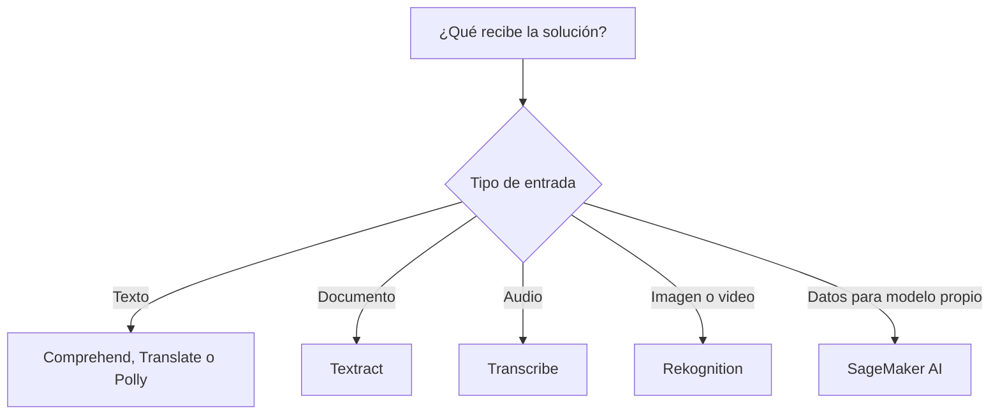
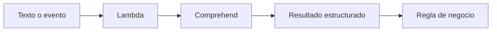
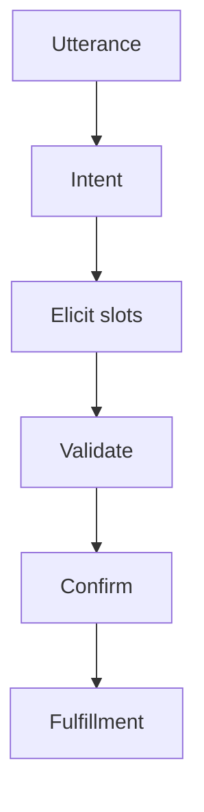
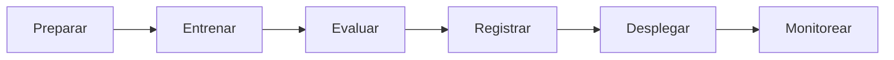
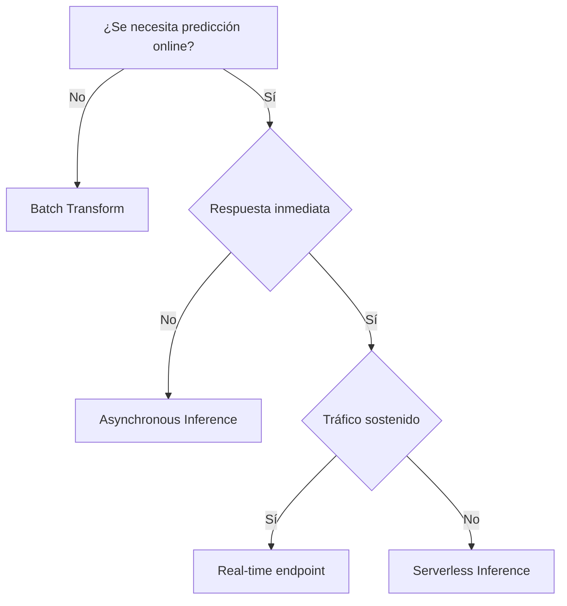
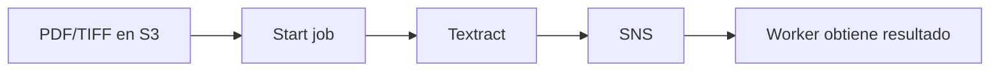
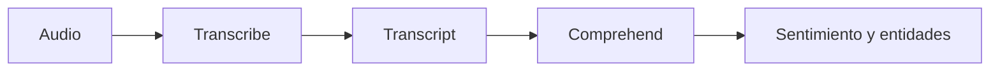
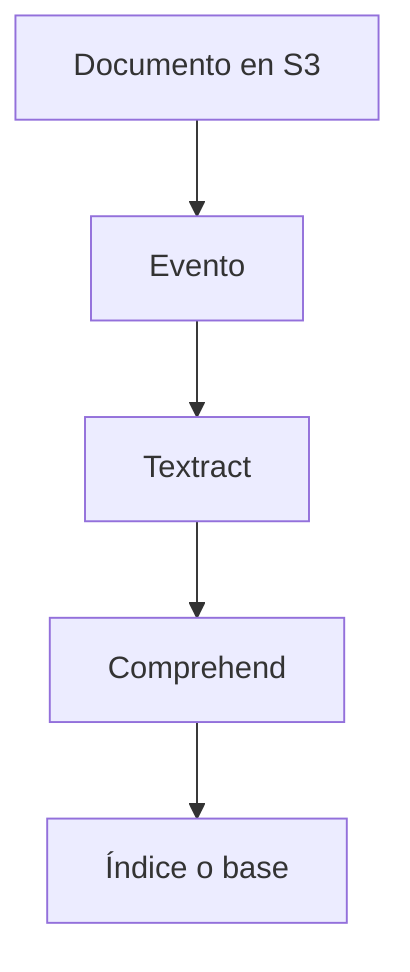
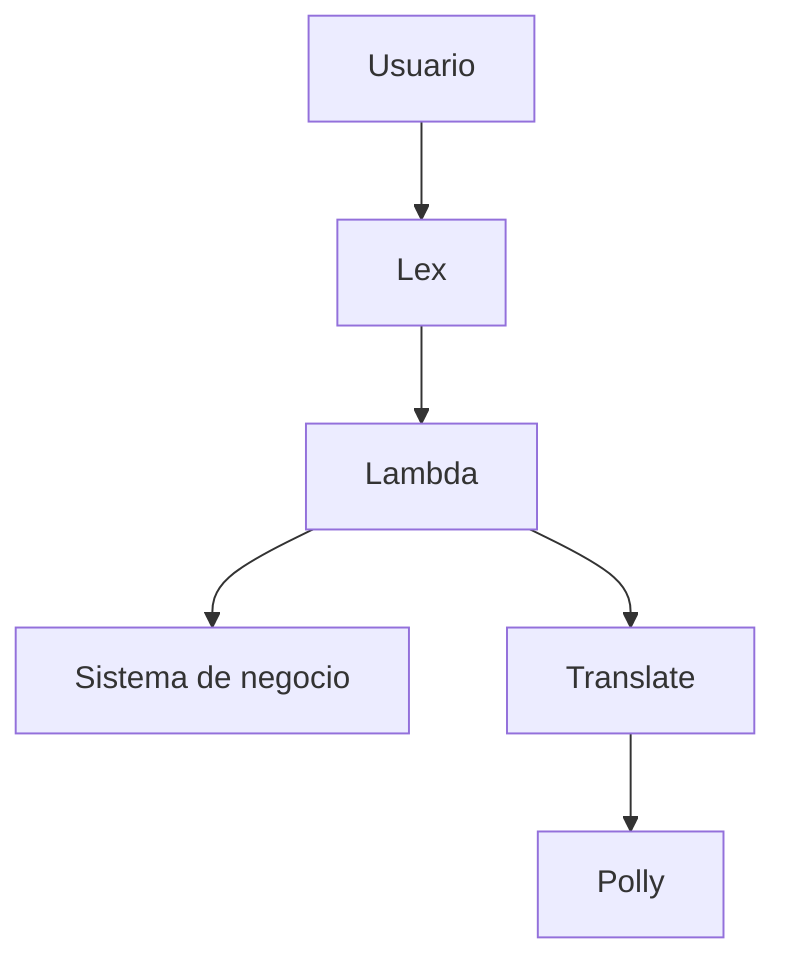

# Machine Learning en AWS para el examen SAA-C03

## 1. Alcance necesario para el examen

Esta guía desarrolla únicamente los siguientes servicios de **Machine Learning**:

- Amazon Comprehend
- Amazon Kendra
- Amazon Lex
- Amazon Polly
- Amazon Rekognition
- Amazon SageMaker AI
- Amazon Textract
- Amazon Transcribe
- Amazon Translate

El examen evalúa principalmente la capacidad de:

- Identificar el servicio de IA preentrenada adecuado para texto, documentos, imágenes, audio o traducción.
- Diferenciar extracción de texto, comprensión del texto y búsqueda de información.
- Elegir procesamiento síncrono, streaming, por lotes o asíncrono.
- Diseñar aplicaciones conversacionales mediante intents, utterances y slots.
- Diferenciar speech-to-text y text-to-speech.
- Elegir entre una API de IA administrada y un modelo personalizado en SageMaker AI.
- Seleccionar el tipo de inferencia de SageMaker AI según latencia, tráfico y tamaño del payload.
- Diseñar pipelines desacoplados para analizar contenido almacenado en Amazon S3.
- Proteger información personal, documentos, audio, imágenes y artefactos de modelos.
- Incorporar confidence scores, revisión humana y monitoreo cuando una predicción afecta una decisión importante.
- Reconocer los principales factores de costo: volumen procesado, duración del audio, caracteres, endpoints y capacidad aprovisionada.

> **Alcance:** otros servicios pueden aparecer como almacenamiento, integración o destino -por ejemplo, Amazon S3, AWS Lambda, Amazon EventBridge, Amazon SNS, Amazon SQS, Amazon Connect, Amazon API Gateway o AWS KMS-, pero no se desarrollan como servicios principales en este capítulo.

---

## 2. Modelos fundamentales

### Servicio según el tipo de entrada y resultado

| Entrada | Necesidad | Servicio principal | Resultado |
|---|---|---|---|
| Texto | Entidades, sentimiento, idioma, frases clave o PII | Amazon Comprehend | Insights estructurados |
| Repositorios empresariales | Encontrar información relevante | Amazon Kendra | Documentos, pasajes y respuestas relevantes |
| Texto o voz del usuario | Conversación mediante intents y slots | Amazon Lex | Intent reconocido y valores capturados |
| Texto | Generar voz | Amazon Polly | Audio sintetizado |
| Imagen o video | Detectar objetos, escenas, rostros, texto o contenido inseguro | Amazon Rekognition | Labels, faces, texto y confidence scores |
| Datos propios | Crear, entrenar, desplegar y monitorear modelos | Amazon SageMaker AI | Modelo o endpoint de inferencia |
| Documento escaneado | Extraer texto, tablas, formularios o campos | Amazon Textract | Estructura del documento |
| Audio o voz | Convertir voz a texto | Amazon Transcribe | Transcripción |
| Texto o documento | Traducir entre idiomas | Amazon Translate | Texto traducido |

### Regla mental inicial

Para decidir dentro de la rama de texto:

| Verbo del escenario | Servicio |
|---|---|
| Analizar, clasificar, detectar sentimiento o PII | Comprehend |
| Buscar conocimiento corporativo | Kendra |
| Entender una conversación y completar una acción | Lex |
| Leer el texto en voz alta | Polly |
| Traducir a otro idioma | Translate |

### Servicios de IA preentrenada frente a SageMaker AI

| APIs de IA administrada | Amazon SageMaker AI |
|---|---|
| Resuelven capacidades concretas | Cubre el ciclo de vida de ML |
| Requieren poca experiencia en ML | Requiere decisiones sobre datos, modelo y despliegue |
| Se consumen mediante API o job | Entrena, hospeda y monitorea modelos |
| Menor tiempo de implementación | Mayor control y personalización |
| El proveedor mantiene el modelo base | El equipo administra el modelo y su desempeño |
| Cobro principalmente por uso | Puede incluir compute de notebooks, training y endpoints |

> **Regla de examen:** si la necesidad está cubierta por una capacidad preentrenada -OCR, traducción, transcripción, voz o análisis de texto-, normalmente se elige el servicio administrado. Si se necesita entrenar un algoritmo con datos propios, controlar el ciclo de vida o desplegar un modelo personalizado, se elige SageMaker AI.

### Síncrono, streaming, asíncrono y batch

| Modalidad | Cuándo usarla | Ejemplos |
|---|---|---|
| Síncrona | Entrada pequeña y respuesta inmediata | Comprehend en tiempo real, Translate en tiempo real, Textract de una página |
| Streaming | Datos continuos y resultado mientras llegan | Transcribe streaming, Lex por voz |
| Asíncrona | El trabajo puede tardar y se consulta o notifica su finalización | Textract multipágina, análisis de video de Rekognition |
| Batch | Colección grande sin respuesta interactiva | Comprehend jobs, Translate batch, SageMaker Batch Transform |

La palabra **real-time** no significa que todos los servicios mantengan un endpoint propio. Algunas APIs preentrenadas reciben una solicitud síncrona, mientras que los modelos personalizados pueden requerir capacidad aprovisionada.

---

## 3. Conceptos de IA y machine learning que se deben dominar

### Inferencia

La **inferencia** es el uso de un modelo entrenado para producir una predicción.

- Entrada: texto, imagen, audio, documento o conjunto de features.
- Modelo: preentrenado por AWS o entrenado por el cliente.
- Salida: clase, texto, score, entidad, label u otra predicción.
- La salida no es necesariamente verdadera; expresa la predicción del modelo.

### Confidence score y threshold

| Concepto | Significado |
|---|---|
| Confidence score | Nivel de confianza que el servicio asigna al resultado |
| Threshold | Valor mínimo que la aplicación acepta automáticamente |
| False positive | El sistema detecta algo que no existe |
| False negative | El sistema no detecta algo que sí existe |

Subir el threshold normalmente reduce falsos positivos, pero puede aumentar falsos negativos. Para decisiones financieras, legales, médicas, de seguridad o identidad se debe considerar:

- Threshold acorde al riesgo.
- Validación con datos representativos.
- Revisión humana para casos ambiguos.
- Registro de la versión, entrada y decisión.
- Mecanismo de apelación o corrección.

### Entrenamiento, validación y prueba

| Conjunto | Uso |
|---|---|
| Training | Ajustar parámetros del modelo |
| Validation | Comparar configuraciones e hiperparámetros |
| Test | Estimar desempeño final con datos no vistos |

Usar los mismos datos para entrenar y evaluar produce una medición engañosa. También se debe evitar **data leakage**, cuando el entrenamiento contiene información que no estará disponible al predecir.

### Underfitting y overfitting

| Problema | Síntoma | Acción habitual |
|---|---|---|
| Underfitting | Bajo desempeño incluso en training | Modelo o features más expresivos |
| Overfitting | Muy buen training y mala generalización | Regularización, más datos o menor complejidad |

### Clasificación, regresión y clustering

| Tipo | Resultado | Ejemplo |
|---|---|---|
| Clasificación | Categoría discreta | Fraude/no fraude |
| Regresión | Valor numérico | Demanda estimada |
| Clustering | Grupos sin etiqueta previa | Segmentos de clientes |

Comprehend custom classification resuelve clasificación de texto. Para problemas generales con features propios, SageMaker AI ofrece mayor flexibilidad.

### Model drift y data drift

- **Data drift:** cambia la distribución de los datos de entrada.
- **Model quality drift:** disminuye la calidad de las predicciones.
- **Bias drift:** cambian patrones relacionados con sesgo.
- Detectar drift no corrige automáticamente el modelo.
- Se necesita investigar, obtener ground truth, reentrenar, aprobar y desplegar una nueva versión.

### Procesamiento multimodal por etapas

Un servicio puede extraer contenido y otro interpretarlo:

> **Trampa de examen:** Comprehend no realiza OCR. Textract obtiene el texto y su estructura; Comprehend analiza el significado del texto resultante.

---

## 4. Amazon Comprehend

Amazon Comprehend es un servicio administrado de natural language processing -NLP- que analiza texto mediante modelos preentrenados o personalizados.

### Capacidades principales

| Capacidad | Resultado |
|---|---|
| Dominant language | Idioma predominante |
| Entity recognition | Personas, organizaciones, ubicaciones, fechas y otras entidades |
| Key phrases | Frases importantes |
| Sentiment | Positivo, negativo, neutral o mixto |
| Targeted sentiment | Sentimiento asociado a entidades específicas |
| Syntax | Tokens y partes del discurso |
| PII detection | Datos personales identificables |
| Topic modeling | Temas presentes en un conjunto de documentos |
| Custom classification | Categorías definidas por el cliente |
| Custom entity recognition | Entidades del dominio del cliente |

### Tiempo real frente a análisis asíncrono

| Modalidad | Uso | Consideración |
|---|---|---|
| Real-time preentrenado | Una entrada pequeña con respuesta inmediata | Solicitud síncrona |
| Asynchronous job | Muchos documentos o conjuntos grandes | Lee entrada y escribe resultados mediante S3 |
| Custom endpoint | Inferencia en tiempo real con modelo propio | Capacidad administrada que genera costo mientras existe |
| Custom asynchronous job | Clasificación o entidades personalizadas en volumen | No requiere endpoint permanente |

### Modelos personalizados

#### Custom classification

- **Multi-class:** cada documento pertenece a una sola clase.
- **Multi-label:** un documento puede pertenecer a varias clases.
- Ejemplos: enrutar tickets, clasificar contratos o categorizar comentarios.
- Se entrena con ejemplos etiquetados.
- Para tiempo real se crea un endpoint asociado a una versión del modelo.

#### Custom entity recognition

- Detecta entidades particulares del negocio.
- Ejemplos: códigos de producto, números de póliza o nombres de piezas.
- No se limita a las entidades generales de los modelos preentrenados.
- Requiere datos de entrenamiento y evaluación.

### Detección de PII

- Puede localizar tipos de información personal y devolver posición y score.
- El modo de redacción puede producir texto con PII ocultada.
- La detección no sustituye una política de clasificación y protección de datos.
- Se deben validar idiomas, tipos de entidad y modalidades compatibles.
- Para datos muy sensibles se limita qué contenido se registra en logs.

### Arquitectura habitual

Para grandes volúmenes:

1. Se almacenan documentos en S3.
2. Se inicia un analysis job con un IAM service role.
3. Comprehend lee la ubicación de entrada.
4. Escribe resultados en la ubicación de salida.
5. Otra etapa transforma, indexa o visualiza los resultados.

### Seguridad y costos

- Aplicar least privilege a las APIs y buckets.
- Cifrar entrada y salida en S3.
- Usar AWS KMS cuando el escenario requiera control de claves.
- Proteger datos temporales y resultados, que también pueden contener PII.
- Las APIs preentrenadas se cobran por volumen analizado.
- El training, la administración del modelo y el endpoint personalizado pueden tener cargos separados.
- Eliminar endpoints personalizados cuando no se requieren respuestas en tiempo real.

### Cuándo elegirlo

- Analizar sentimiento de comentarios.
- Detectar entidades o frases clave.
- Clasificar texto con categorías propias.
- Detectar o redactar PII en texto.

### Cuándo no elegirlo

- OCR de documentos escaneados: Textract.
- Speech-to-text: Transcribe.
- Traducción entre idiomas: Translate.
- Búsqueda empresarial: Kendra.

---

## 5. Amazon Kendra

Amazon Kendra es un servicio administrado de búsqueda empresarial inteligente. Utiliza procesamiento de lenguaje para encontrar información relevante según el significado y el contexto de la consulta.

### Conceptos principales

| Componente | Función |
|---|---|
| Index | Contiene y organiza el contenido consultable |
| Document | Unidad de contenido incluida en el índice |
| Data source | Origen sincronizado mediante un connector |
| Connector | Integra repositorios compatibles |
| FAQ | Pares de pregunta y respuesta |
| Metadata | Campos utilizados para filtrar, facetar o ajustar relevancia |
| Query | Solicitud del usuario |
| Relevance tuning | Ajuste de importancia de campos y resultados |

### Fuentes de datos

Kendra puede indexar documentos de forma directa o sincronizar repositorios mediante connectors. Según la fuente compatible, puede trabajar con:

- Amazon S3.
- Sitios web.
- Bases de datos.
- Plataformas de documentos y colaboración.
- Repositorios empresariales.

La sincronización:

- Descubre documentos nuevos o modificados.
- Actualiza el índice.
- Puede ejecutarse bajo demanda o con una programación.
- Requiere permisos para leer el origen.
- Puede conservar metadata y controles de acceso cuando la integración lo admite.

### Búsqueda semántica

Kendra no se limita a coincidir palabras exactas:

- Interpreta preguntas en lenguaje natural.
- Puede devolver documentos relevantes, pasajes o extractos.
- Admite filtros por metadata.
- Permite faceting para explorar resultados.
- Puede ajustar relevancia según campos y freshness.

> **Trampa de examen:** Kendra busca información dentro de contenido empresarial. Comprehend analiza el texto; Lex administra una conversación; ninguno sustituye directamente un índice de búsqueda empresarial.

### Control de acceso

Los resultados deben respetar quién puede ver cada documento:

- Se puede incluir información de usuarios, grupos y ACL en el índice.
- El user context filter limita resultados según el contexto del solicitante.
- El origen continúa necesitando permisos correctos.
- La aplicación debe autenticar al usuario y transmitir su contexto confiablemente.
- No se debe confiar únicamente en ocultar enlaces en la interfaz.

### Custom document enrichment

Permite modificar o enriquecer documentos y metadata durante la ingestión. Puede utilizarse para:

- Normalizar campos.
- Añadir categorías.
- Extraer atributos.
- Excluir contenido.
- Invocar lógica propia en un pipeline compatible.

### Alta disponibilidad, seguridad y costos

- La infraestructura del índice es administrada por AWS.
- Se deben revisar edición, capacidad, región, idiomas y features compatibles.
- Aplicar IAM a indexes, data sources y APIs.
- Cifrar documentos de origen y el índice cuando corresponda.
- Usar conectividad privada y claves administradas por el cliente cuando el requisito lo justifique.
- Los principales costos se relacionan con la edición/capacidad del índice y el uso.
- Un índice sobredimensionado o inactivo puede mantener costos.

### Cuándo elegirlo

- Portal interno que busca respuestas en políticas, manuales y documentos.
- Help desk que necesita encontrar pasajes relevantes.
- Búsqueda semántica sobre múltiples repositorios corporativos.
- Resultados filtrados por identidad y permisos del usuario.

### Cuándo no elegirlo

- Detectar sentimiento o entidades: Comprehend.
- Crear un chatbot transaccional: Lex.
- Extraer tablas de un PDF: Textract.

---

## 6. Amazon Lex

Amazon Lex V2 permite crear interfaces conversacionales de texto y voz. Utiliza automatic speech recognition -ASR- para voz y natural language understanding -NLU- para reconocer la intención del usuario.

### Elementos de un bot

| Elemento | Función | Ejemplo |
|---|---|---|
| Bot | Aplicación conversacional | Asistente de reservas |
| Locale | Idioma y variante regional | Español de España |
| Intent | Objetivo del usuario | ReservarHotel |
| Sample utterance | Frase de entrenamiento | “Quiero reservar una habitación” |
| Slot | Dato necesario | Ciudad |
| Slot type | Valores o tipo del slot | Ciudades admitidas |
| Prompt | Pregunta para obtener un slot | “¿En qué ciudad?” |
| Confirmation | Confirma antes de ejecutar | “¿Confirmas la reserva?” |
| Fulfillment | Completa la acción | Crear la reserva |
| Fallback intent | Gestiona entradas no reconocidas | Pedir reformulación |

### Flujo conversacional

### Integración con AWS Lambda

Una función Lambda puede utilizarse para:

- Validar valores.
- Aplicar reglas de negocio.
- Generar respuestas.
- Ejecutar fulfillment.
- Consultar una API o base de datos.

Lex reconoce el lenguaje, pero la autorización corresponde a la aplicación:

- Un slot con un número de cuenta no demuestra que el usuario sea su propietario.
- La identidad debe validarse mediante el canal o sistema de autenticación.
- La lógica de negocio debe verificar permisos antes de una operación.
- No se confía en texto proporcionado por el usuario para construir consultas inseguras.

### Sesiones y estado

- Una sesión conserva el estado del diálogo durante una interacción.
- Los session attributes permiten compartir contexto con la aplicación.
- Los slot values se actualizan durante la conversación.
- Debe existir un timeout y una estrategia para reiniciar conversaciones.
- Información sensible no debe conservarse más tiempo del necesario.

### Versiones y aliases

| Recurso | Característica |
|---|---|
| Draft | Versión editable para desarrollo |
| Version | Snapshot inmutable del bot |
| Alias | Nombre estable que apunta a una versión |

Los aliases permiten cambiar la versión utilizada por una aplicación sin modificar su integración. Se pueden separar dev, test y prod.

### Integraciones habituales

- Amazon Connect para contact centers.
- Lambda para lógica.
- Polly para respuestas de voz.
- APIs y sistemas de negocio para fulfillment.
- Logs y métricas para analizar fallos de reconocimiento.

### Diseño y costos

- Incluir suficientes utterances representativas.
- Evitar intents demasiado parecidos.
- Usar prompts claros y manejar reintentos.
- Definir fallback y escalamiento a una persona.
- Probar acentos, ruido, idiomas y frases reales.
- Los costos dependen del número y tipo de solicitudes de texto o voz y de servicios integrados.

### Cuándo elegirlo

- Chatbot que agenda citas.
- Voice bot para consultar pedidos.
- IVR conversacional en un contact center.
- Interfaz que captura datos y ejecuta una acción.

### Cuándo no elegirlo

- Buscar pasajes en miles de documentos: Kendra.
- Analizar sentimiento en un corpus: Comprehend.
- Convertir texto a un archivo de audio sin diálogo: Polly.

---

## 7. Amazon Polly

Amazon Polly convierte texto en voz natural. Es un servicio de **text-to-speech -TTS-**.

### Capacidades

- Voces e idiomas compatibles.
- Motores standard, neural, long-form y generative según voz y región.
- Audio en formatos compatibles como MP3, Ogg Vorbis o PCM.
- Speech Synthesis Markup Language -SSML-.
- Pronunciation lexicons.
- Speech marks para sincronización.
- Síntesis síncrona y tareas largas con salida en S3.

### Motores y voces

- No todas las voces soportan todos los motores.
- No todos los motores están disponibles en todas las regiones.
- Una aplicación debe especificar una combinación compatible de engine, voice y language.
- Se debe comparar calidad, latencia, disponibilidad y precio.

### SSML

SSML permite controlar aspectos de la pronunciación, según soporte del motor:

- Pausas.
- Velocidad.
- Volumen.
- Énfasis.
- Pronunciación.
- Lectura de fechas, números y abreviaturas.

Los pronunciation lexicons permiten definir cómo se pronuncian palabras particulares, siglas, marcas o nombres.

### Speech marks

Los speech marks son metadata, no audio:

- Palabras y oraciones.
- Tiempos dentro del audio.
- Visemes para sincronización labial.
- Marks SSML.

Se utilizan para resaltar texto mientras se reproduce, animar un avatar o sincronizar subtítulos.

### Síntesis síncrona frente a tarea larga

| Modalidad | Uso |
|---|---|
| `SynthesizeSpeech` | Respuesta interactiva y audio devuelto por streaming |
| `StartSpeechSynthesisTask` | Contenido largo con resultado almacenado en S3 |

Para contenido repetido:

1. Sintetizar una sola vez.
2. Guardar el audio en S3.
3. Distribuirlo mediante una capa de entrega.
4. Evitar pagar y esperar una síntesis idéntica en cada solicitud.

### Seguridad y costos

- El acceso a la API se controla con IAM.
- Proteger el texto si contiene información sensible.
- Cifrar los archivos de audio en S3.
- No incluir secretos en texto enviado a sintetizar.
- El precio depende principalmente de los caracteres procesados y el motor.
- El almacenamiento y distribución del audio generan cargos separados.

### Cuándo elegirlo

- Narrar artículos o contenido educativo.
- Generar mensajes de voz.
- Añadir accesibilidad auditiva.
- Responder con voz desde un bot.

### Cuándo no elegirlo

- Convertir voz en texto: Transcribe.
- Entender intents: Lex.
- Traducir antes de hablar: Translate y luego Polly.

---

## 8. Amazon Rekognition

Amazon Rekognition analiza imágenes y videos mediante modelos de computer vision preentrenados y, con Custom Labels, modelos adaptados a un dominio visual.

### Capacidades principales

| Capacidad | Ejemplo |
|---|---|
| Labels | Objetos, actividades, escenas y conceptos |
| Face detection | Atributos y ubicación de rostros |
| Face comparison | Similitud entre rostros |
| Face search | Buscar un rostro en una colección |
| Text detection | Texto visible en imágenes o video |
| Content moderation | Contenido potencialmente inapropiado |
| Celebrity recognition | Celebridades reconocibles |
| PPE detection | Equipos de protección personal |
| Custom Labels | Objetos y escenas propios del negocio |

### Imágenes frente a videos

| Entrada | Patrón |
|---|---|
| Imagen | APIs síncronas para respuesta inmediata |
| Video almacenado | Jobs asíncronos; el video suele estar en S3 |
| Video en streaming | Integraciones y APIs compatibles para analizar streams |

En un job asíncrono de video:

1. La aplicación inicia el job.
2. Rekognition procesa el video.
3. Puede publicar la finalización mediante SNS.
4. La aplicación obtiene los resultados paginados.

### Rostros y collections

- Face detection localiza rostros y atributos en una imagen.
- Face comparison compara un rostro de origen con rostros objetivo.
- Face search busca similitud con vectores indexados.
- Una **collection** almacena representaciones matemáticas o face vectors y metadata asociada, no el archivo de imagen original.
- La aplicación debe almacenar y proteger la relación entre face ID y la identidad de negocio.

### Consideraciones biométricas

- Una similitud no equivale a certeza de identidad.
- Ajustar el threshold según el riesgo.
- Evaluar falsos positivos y falsos negativos.
- Incorporar revisión humana en decisiones de alto impacto.
- Aplicar consentimiento, retención mínima y requisitos legales.
- Limitar acceso a imágenes, colecciones y resultados.

### Content moderation

- Devuelve categorías y confidence scores.
- Permite filtrar contenido generado por usuarios.
- No garantiza detectar todo contenido dañino.
- Se combina con thresholds, reglas, apelación y revisión humana.

### Custom Labels

Se utiliza cuando las labels generales no cubren el dominio:

- Defectos específicos de manufactura.
- Productos de un catálogo.
- Logotipos o piezas particulares.
- Escenas propias de una operación.

Custom Labels requiere imágenes etiquetadas, entrenamiento, evaluación y recursos de inferencia. Si el problema visual es más general o necesita un algoritmo propio, se evalúa SageMaker AI.

### Seguridad y costos

- Aplicar IAM y bucket policies de mínimo privilegio.
- Cifrar imágenes y videos en S3.
- Definir retención para datos biométricos.
- Auditar operaciones y accesos.
- Los costos dependen de imágenes, minutos de video, features y recursos de modelos personalizados.
- Evitar ejecutar repetidamente el mismo análisis si el resultado puede almacenarse de forma segura.

### Cuándo elegirlo

- Detectar objetos o escenas.
- Moderar imágenes o videos.
- Analizar rostros con controles apropiados.
- Extraer texto visible en una escena.

### Cuándo no elegirlo

- Extraer formularios y tablas de documentos: Textract.
- Analizar significado de texto: Comprehend.
- Entrenar un modelo completamente personalizado: SageMaker AI.

---

## 9. Amazon SageMaker AI

Amazon SageMaker AI es un servicio administrado para preparar datos, crear, entrenar, ajustar, desplegar y monitorear modelos de machine learning.

> **Nomenclatura vigente:** la documentación actual utiliza **Amazon SageMaker AI** para las capacidades de machine learning. En preguntas y material anterior puede aparecer como Amazon SageMaker.

### Ciclo de vida

### Capacidades que conviene reconocer

| Capacidad | Uso |
|---|---|
| SageMaker Studio | Entorno integrado para ML |
| Notebooks | Exploración y desarrollo |
| Training jobs | Entrenamiento administrado y efímero |
| Automatic Model Tuning | Búsqueda de hiperparámetros |
| Autopilot | Automatización de tareas de AutoML |
| JumpStart | Modelos, soluciones y ejemplos preconstruidos |
| Feature Store | Repositorio administrado de features |
| Pipelines | Orquestación reproducible del workflow de ML |
| Model Registry | Versionado, aprobación y gobierno de modelos |
| Model Monitor | Monitoreo de datos y calidad en producción |
| Clarify | Análisis de explicabilidad y sesgo |
| Ground Truth | Etiquetado de datos |

### Training jobs

- El training code se ejecuta en infraestructura administrada.
- Los datos suelen leerse desde S3.
- Los artefactos del modelo se escriben en S3.
- Las instancias de training finalizan cuando termina el job.
- Se separa el compute de entrenamiento del compute de inferencia.
- Managed Spot Training puede reducir costo para jobs tolerantes a interrupciones.
- Checkpoints permiten recuperar progreso cuando el framework y el job lo soportan.

### Opciones de inferencia

| Opción | Tráfico y latencia | Payload/proceso | Escalado y costo |
|---|---|---|---|
| Real-time endpoint | Sostenido y baja latencia | Solicitud interactiva | Instancias permanentes; Auto Scaling |
| Serverless Inference | Intermitente o impredecible | Solicitudes compatibles | Escala automáticamente, incluso a cero; puede tener cold start |
| Asynchronous Inference | No requiere respuesta inmediata | Payload grande o procesamiento largo | Encola solicitudes, resultado en S3; puede escalar a cero |
| Batch Transform | Dataset offline | Procesamiento masivo | Compute solo durante el job; sin endpoint persistente |

### Regla de decisión de inferencia

#### Real-time endpoints

- Apropiados para aplicaciones interactivas de baja latencia.
- La capacidad existe mientras el endpoint está activo.
- Application Auto Scaling puede ajustar el número de instancias.
- Multi-AZ se logra distribuyendo instancias cuando la configuración lo permite.
- Un endpoint con una sola instancia sigue siendo un punto de capacidad único.

#### Serverless Inference

- Evita elegir y administrar instancias de inferencia.
- Adecuado para tráfico intermitente.
- Puede introducir cold starts.
- Tiene límites de memoria, payload, tiempo y compatibilidad.
- No se elige cuando se necesita latencia consistente y tráfico sostenido sin cold start.

#### Asynchronous Inference

- Encola la solicitud.
- Acepta procesos más largos y payloads mayores que el patrón interactivo.
- Guarda la salida en S3.
- Puede notificar resultados mediante servicios de mensajería compatibles.
- Puede reducir capacidad a cero cuando no existen solicitudes.

#### Batch Transform

- Realiza inferencia sobre un dataset almacenado.
- No crea un endpoint permanente.
- Es adecuado para scoring nocturno o procesamiento histórico.
- No responde a solicitudes de usuario en tiempo real.

### Multi-model endpoints

- Un endpoint puede servir varios modelos compatibles.
- Reduce costo cuando existen muchos modelos con tráfico irregular.
- Los modelos se cargan cuando se solicitan.
- La primera invocación de un modelo descargado puede tener mayor latencia.
- No es ideal cuando cada modelo necesita aislamiento o latencia constante.

### Pipelines y Model Registry

Pipelines permite automatizar etapas como:

1. Procesamiento.
2. Entrenamiento.
3. Evaluación.
4. Condición de calidad.
5. Registro.
6. Aprobación.
7. Despliegue mediante el mecanismo elegido.

Model Registry mantiene versiones y estado de aprobación. Registrar un modelo no lo despliega automáticamente; el proceso de release debe seleccionar una versión aprobada.

### Model Monitor y Clarify

- Model Monitor captura y compara datos de inferencia con una baseline.
- Puede detectar data quality, model quality, bias drift y feature attribution drift según configuración.
- Requiere programación, almacenamiento y, para algunas métricas, ground truth.
- Clarify ayuda a evaluar sesgo y explicabilidad.
- Una alarma de drift inicia una respuesta operativa; no reentrena por sí sola.

### Seguridad

- IAM execution roles con mínimo privilegio.
- Cifrado de datos, volúmenes, notebooks, artefactos y endpoints.
- VPC para controlar acceso a fuentes privadas.
- Network isolation cuando el contenedor no debe realizar llamadas de red.
- Imágenes de contenedor y artefactos de confianza.
- No incluir credenciales dentro del training code.
- Separar cuentas o entornos de desarrollo y producción cuando sea necesario.

### Optimización de costos

- Apagar notebooks e instancias de desarrollo inactivos.
- Eliminar endpoints de prueba.
- Usar Batch Transform para scoring offline.
- Elegir Serverless para tráfico intermitente compatible.
- Aplicar Auto Scaling a endpoints real-time.
- Considerar Managed Spot Training.
- Ajustar tipos y cantidad de instancias con métricas.
- Aplicar lifecycle a datasets, checkpoints y artefactos.

### Cuándo elegirlo

- Entrenar un modelo con datos propios.
- Administrar un pipeline reproducible de ML.
- Desplegar inferencia custom en tiempo real o batch.
- Versionar, aprobar y monitorear modelos.

### Cuándo no elegirlo

- Una API preentrenada resuelve el requisito con menor complejidad.
- Solo se necesita OCR, traducción, síntesis de voz o transcripción estándar.

---

## 10. Amazon Textract

Amazon Textract utiliza machine learning para extraer texto y estructura de documentos. Va más allá de OCR básico al identificar forms, tables y otros elementos.

### Operaciones y capacidades

| Capacidad | Resultado |
|---|---|
| Text detection | Words y lines |
| Forms | Pares key-value |
| Tables | Celdas, filas, columnas y encabezados |
| Queries | Respuestas a preguntas definidas sobre el documento |
| Signatures | Ubicación de firmas detectadas |
| Layout | Elementos de estructura y lectura |
| Analyze Expense | Campos normalizados de facturas y recibos |
| Analyze ID | Campos de documentos de identidad compatibles |
| Lending analysis | Clasificación y extracción en paquetes de préstamos |

### DetectDocumentText frente a AnalyzeDocument

| Operación | Elegir cuando |
|---|---|
| `DetectDocumentText` | Solo se necesitan words y lines |
| `AnalyzeDocument` | Se necesitan forms, tables, queries, signatures o layout |

Pagar o ejecutar análisis estructural no aporta valor si el escenario solo necesita OCR simple.

### Síncrono frente a asíncrono

| Modalidad | Documento | Flujo |
|---|---|---|
| Síncrona | Página única y formato compatible | Devuelve el resultado en la respuesta |
| Asíncrona | Documento multipágina o trabajo largo | Inicia job, notifica finalización y obtiene resultados |

Para procesamiento multipágina:

- Los documentos multipágina se procesan de forma asíncrona.
- Se puede utilizar SNS para la notificación.
- SQS puede desacoplar consumidores.
- Los resultados pueden ser paginados.
- Se debe controlar idempotencia para no procesar dos veces la misma finalización.

### Modelo de salida

Textract devuelve objetos `Block` relacionados:

- PAGE.
- LINE.
- WORD.
- KEY_VALUE_SET.
- TABLE y CELL.
- QUERY y QUERY_RESULT.
- Otros tipos según la feature.

La aplicación reconstruye relaciones mediante identificadores. No se debe asumir que la respuesta es una tabla plana lista para insertar.

### Confidence y revisión

- Cada detección incluye scores según la operación.
- Documentos inclinados, borrosos o de baja resolución reducen calidad.
- Formularios variables requieren pruebas.
- Los campos críticos deben validarse.
- Los resultados por debajo del threshold pueden enviarse a revisión humana.

### Seguridad y costos

- Cifrar documentos de entrada y resultados.
- Limitar acceso a buckets y APIs.
- Evitar registrar PII extraída sin necesidad.
- Aplicar políticas de retención.
- El costo depende del número de páginas y la feature utilizada.
- Forms, tables, queries y APIs especializadas pueden tener precios distintos del text detection.

### Cuándo elegirlo

- Digitalizar formularios.
- Extraer tablas de reportes.
- Procesar facturas y recibos.
- Obtener campos de documentos estructurados o semiestructurados.

### Cuándo no elegirlo

- Detectar objetos en fotografías: Rekognition.
- Interpretar sentimiento del texto extraído: Comprehend.
- Buscar documentos por significado: Kendra.

---

## 11. Amazon Transcribe

Amazon Transcribe convierte voz en texto mediante automatic speech recognition -ASR-.

### Modalidades

| Modalidad | Uso |
|---|---|
| Batch transcription | Archivos de audio o video ya almacenados |
| Streaming transcription | Audio recibido en tiempo real |

En batch:

- La entrada suele estar en S3.
- Se inicia un transcription job.
- La salida puede almacenarse en un bucket definido.
- La aplicación consulta el estado o reacciona a la finalización.

En streaming:

- El cliente envía audio en chunks.
- Transcribe devuelve resultados parciales y finales.
- La aplicación debe manejar orden, reconexión y partial results.
- Es adecuado para subtítulos, reuniones o asistentes en vivo.

### Personalización y calidad

| Feature | Uso |
|---|---|
| Custom vocabulary | Ayudar con nombres, siglas y términos del dominio |
| Custom language model | Adaptar el reconocimiento a patrones del dominio compatibles |
| Vocabulary filter | Enmascarar, remover o marcar palabras definidas |
| Language identification | Identificar idioma entre opciones compatibles |

La calidad depende de:

- Ruido de fondo.
- Micrófono y codec.
- Superposición de voces.
- Acento y velocidad.
- Terminología del dominio.
- Frecuencia de muestreo y formato.

### Diarization frente a channel identification

| Feature | Entrada | Resultado |
|---|---|---|
| Speaker diarization | Varios hablantes mezclados en un canal | Etiqueta segmentos por speaker |
| Channel identification | Cada lado está en un canal separado | Transcribe cada canal por separado |

> **Trampa de examen:** diarization intenta distinguir quién habló dentro de un audio mezclado. Channel identification aprovecha canales separados, como agente y cliente en una llamada estéreo.

### PII y Call Analytics

- Puede identificar o redactar PII en modalidades e idiomas compatibles.
- La redacción automática debe validarse.
- Call Analytics añade insights orientados a conversaciones de contact center.
- Los transcripts y analytics siguen siendo datos sensibles.
- Se deben proteger audio original, texto, subtítulos y resultados.

### Arquitectura de análisis de llamadas

Si se necesita otro idioma:

1. Transcribe convierte voz en texto.
2. Translate traduce el transcript.
3. Polly puede sintetizar el texto traducido.

### Seguridad y costos

- Usar IAM y bucket policies con mínimo privilegio.
- Cifrar audio y transcripciones.
- Definir retención y eliminación.
- Evitar exponer transcripts en logs.
- Revisar región e idioma por requisitos de residencia.
- El costo se basa principalmente en la duración transcrita.
- Features especializadas pueden añadir cargos.

### Cuándo elegirlo

- Generar subtítulos.
- Transcribir reuniones o llamadas.
- Convertir una entrada de voz a texto.
- Preparar audio para análisis posterior.

### Cuándo no elegirlo

- Generar voz desde texto: Polly.
- Reconocer intents y manejar diálogo: Lex.
- Traducir el transcript: Translate.

---

## 12. Amazon Translate

Amazon Translate proporciona traducción automática neuronal entre idiomas compatibles.

### Procesamiento en tiempo real y batch

| Modalidad | Uso | Resultado |
|---|---|---|
| Real-time | Texto o documento pequeño con respuesta inmediata | Traducción síncrona |
| Asynchronous batch | Colecciones grandes sin requisito interactivo | Archivos traducidos mediante job |

En batch:

- La entrada y salida se almacenan en S3.
- Se utiliza un IAM service role.
- El job puede traducir colecciones de documentos.
- La aplicación consulta el estado o automatiza etapas posteriores.

### Detección automática de idioma

- Se puede especificar el idioma de origen.
- En modalidades compatibles, se puede solicitar detección automática.
- La detección automática utiliza capacidades integradas con Comprehend y puede generar costo adicional.
- Se deben revisar región, idioma y operación compatibles.
- Si la aplicación ya conoce el idioma, especificarlo reduce ambigüedad.

### Custom terminology

Custom terminology define traducciones preferidas para términos:

- Marcas.
- Nombres de productos.
- Vocabulario técnico.
- Palabras que no deben traducirse.

No entrena un modelo personalizado y no garantiza sustituir cada aparición sin considerar el contexto. Es una guía terminológica aplicada a solicitudes compatibles.

### Parallel data y Active Custom Translation

- Parallel data contiene ejemplos de texto de origen y traducciones deseadas.
- En batch, Active Custom Translation adapta estilo, tono y elección de palabras según esos ejemplos.
- Es útil en dominios como legal, finanzas o ciencias.
- Se deben validar idiomas y formatos compatibles.
- No equivale a administrar un modelo completo en SageMaker AI.

### Settings

Según el language pair y la modalidad, se pueden aplicar opciones como:

- Formality.
- Profanity masking.
- Brevity.

Estas opciones no están disponibles para todas las combinaciones de idioma.

### Seguridad, calidad y costos

- Cifrar entrada y salida.
- Aplicar least privilege al service role y buckets.
- No enviar información sensible innecesaria.
- Probar terminología y calidad con contenido real.
- Incorporar revisión humana en textos legales, médicos o de alto impacto.
- El costo depende principalmente de los caracteres procesados.
- Batch, custom terminology y personalización deben evaluarse junto con almacenamiento y orchestration.

### Cuándo elegirlo

- Localizar contenido.
- Traducir chat o mensajes.
- Procesar grandes colecciones de documentos.
- Traducir transcripts.

### Cuándo no elegirlo

- Detectar el sentimiento: Comprehend.
- Convertir audio directamente a texto: Transcribe.
- Generar la voz traducida: Translate seguido de Polly.

---

## 13. Seguridad, resiliencia y operación

### Responsabilidad compartida

AWS administra la infraestructura de los servicios, pero el cliente sigue siendo responsable de:

- Identidades y permisos.
- Clasificación de datos.
- Buckets, claves y políticas.
- Datos de entrenamiento y etiquetas.
- Consentimiento y base legal.
- Thresholds y decisiones de negocio.
- Retención y eliminación.
- Validación de calidad.
- Código que consume los resultados.

### IAM

- Separar roles de training, inference, batch jobs y administración.
- Conceder solo las acciones y recursos necesarios.
- Restringir buckets de entrada y salida.
- Utilizar roles de servicio en lugar de access keys embebidas.
- Controlar quién puede crear endpoints costosos.
- Proteger acciones de delete, model approval y deployment.

### Cifrado

| Estado | Control |
|---|---|
| En tránsito | HTTPS/TLS |
| En reposo | Cifrado del servicio y S3 |
| Claves propias | AWS KMS cuando se necesita mayor control |
| Datos temporales | Cifrado de volúmenes y jobs compatibles |

El cifrado de S3 no concede acceso al servicio. El role del job necesita permisos tanto para el objeto como para la KMS key cuando se utiliza SSE-KMS.

### Conectividad privada

- Evaluar VPC endpoints compatibles para evitar tránsito por internet público.
- Un endpoint privado no reemplaza IAM.
- SageMaker AI puede acceder a recursos dentro de VPC mediante configuración de red.
- Network isolation limita acceso de red del contenedor en escenarios compatibles.
- Los servicios siguen necesitando acceso autorizado a S3, KMS y dependencias.

### Datos sensibles

- Audio, imágenes, rostros, documentos y transcripts pueden contener PII.
- Los outputs también son sensibles aunque sean derivados.
- Minimizar datos enviados.
- Redactar o tokenizar cuando sea viable.
- Evitar logging de payloads completos.
- Establecer lifecycle y eliminación.
- Auditar accesos y cambios.

### Resiliencia

- Reintentar errores transitorios con exponential backoff y jitter.
- Respetar service quotas y throttling.
- Usar colas para desacoplar trabajos asíncronos.
- Implementar dead-letter queues donde corresponda.
- Hacer consumidores idempotentes.
- Guardar estado del job para evitar duplicados.
- Diseñar fallback cuando una API regional no está disponible.
- No asumir que una llamada exitosa garantiza una predicción correcta.

### Observabilidad

Se deben monitorear dos dimensiones:

| Dimensión | Ejemplos |
|---|---|
| Servicio | Latencia, errores, throttling, jobs fallidos, capacidad |
| Modelo/negocio | Accuracy, confidence, drift, tasa de fallback, revisión humana |

CloudTrail ayuda a auditar llamadas de administración y APIs compatibles. CloudWatch permite centralizar métricas, logs y alarmas. Los nombres y métricas exactos varían por servicio.

---

## 14. Arquitecturas y pipelines habituales

### Procesamiento de documentos

- Textract extrae texto y estructura.
- Comprehend detecta entidades, PII o categorías.
- Kendra puede indexar el contenido para búsqueda.
- Una cola desacopla etapas con distinta velocidad.

### Aplicación conversacional multilingüe

- Lex captura intent y slots.
- Lambda valida autorización y ejecuta la acción.
- Translate adapta el texto cuando se necesita.
- Polly genera respuesta de voz.

### Análisis de medios generado por usuarios

1. El cliente carga una imagen o video de forma segura.
2. Un evento inicia un worker.
3. Rekognition ejecuta moderation u otra feature.
4. La aplicación evalúa score y threshold.
5. Contenido ambiguo pasa a revisión.
6. Se registra la decisión sin exponer el contenido innecesariamente.

### Inferencia personalizada desacoplada

1. La aplicación almacena un payload grande en S3.
2. Envía una solicitud de Asynchronous Inference.
3. SageMaker AI encola y procesa.
4. El resultado se escribe en S3.
5. Una notificación inicia el siguiente paso.

Este patrón evita mantener abierta una conexión durante un proceso largo.

---

## 15. Matriz de decisión

| Requisito del escenario | Servicio más probable | Razón |
|---|---|---|
| Detectar sentimiento de reseñas | Comprehend | NLP preentrenado |
| Detectar PII en texto | Comprehend | PII entities y redacción |
| Clasificar tickets con clases propias | Comprehend custom classification | Modelo de texto personalizado administrado |
| Buscar políticas mediante lenguaje natural | Kendra | Búsqueda empresarial semántica |
| Filtrar resultados según ACL del usuario | Kendra | User context y access control |
| Bot que reserva una cita | Lex | Intents, slots y fulfillment |
| IVR conversacional | Lex | Voz, NLU e integración |
| Leer un artículo en voz alta | Polly | Text-to-speech |
| Sincronizar texto resaltado con audio | Polly speech marks | Metadata temporal |
| Detectar objetos en una fotografía | Rekognition | Image labels |
| Moderar videos cargados | Rekognition | Content moderation de video |
| Buscar rostros similares | Rekognition collections | Face vectors y search |
| Entrenar un modelo con datos propios | SageMaker AI | Ciclo de vida custom de ML |
| Inferencia sostenida de baja latencia | SageMaker real-time endpoint | Capacidad persistente |
| Inferencia online con tráfico intermitente | SageMaker Serverless Inference | Escalado automático y a cero |
| Payload grande y respuesta diferida | SageMaker Asynchronous Inference | Cola y output en S3 |
| Scoring nocturno de un dataset | SageMaker Batch Transform | Sin endpoint persistente |
| Extraer key-value pairs de formularios | Textract | Forms |
| Extraer tablas de PDF multipágina | Textract asíncrono | Document analysis multipágina |
| Convertir audio grabado a texto | Transcribe batch | Speech-to-text |
| Subtítulos mientras alguien habla | Transcribe streaming | Transcripción en tiempo real |
| Separar agente y cliente en dos canales | Transcribe channel identification | Transcripción por canal |
| Traducir texto de forma interactiva | Translate real-time | Traducción síncrona |
| Traducir un corpus en S3 | Translate batch | Procesamiento asíncrono |
| Mantener traducción de nombres de producto | Translate custom terminology | Terminología preferida |

---

## 16. Diferencias que suelen generar errores

### Comprehend frente a Textract

| Comprehend | Textract |
|---|---|
| Comprende texto | Extrae texto y estructura |
| Sentimiento, entidades, PII | Words, lines, forms y tables |
| Entrada textual o documentos compatibles según feature | Imágenes y documentos |
| NLP | OCR y document analysis |

### Textract frente a Rekognition

| Textract | Rekognition |
|---|---|
| Documentos | Imágenes y videos |
| Formularios y tablas | Objetos, escenas y rostros |
| Estructura documental | Computer vision general |
| Facturas y recibos | Content moderation |

Rekognition puede detectar texto visible, pero no reemplaza el análisis estructurado de forms y tables de Textract.

### Transcribe frente a Polly

| Transcribe | Polly |
|---|---|
| Speech-to-text | Text-to-speech |
| Audio entra | Texto entra |
| Transcript sale | Audio sale |
| ASR | TTS |

### Lex frente a Transcribe

| Lex | Transcribe |
|---|---|
| Entiende intents y slots | Produce un transcript |
| Mantiene diálogo | No administra conversación |
| Ejecuta fulfillment mediante integración | Convierte audio en texto |
| Bot de voz o texto | Batch o streaming ASR |

### Lex frente a Kendra

| Lex | Kendra |
|---|---|
| Conversación transaccional | Búsqueda empresarial |
| Intents predefinidos | Consulta un índice |
| Captura slots | Recupera pasajes y documentos |
| Fulfillment | Relevance ranking |

Se pueden integrar: Lex maneja la conversación y Kendra recupera información.

### Comprehend frente a Translate

| Comprehend | Translate |
|---|---|
| Analiza el significado | Cambia el idioma |
| Entidades y sentimiento | Texto traducido |
| Clasificación | Custom terminology |
| PII | Parallel data |

### IA preentrenada frente a SageMaker AI

- Los servicios preentrenados reducen operación y tiempo de desarrollo.
- SageMaker AI ofrece control del algoritmo, datos, entrenamiento e inferencia.
- “Machine learning” en el escenario no implica automáticamente SageMaker AI.
- “Modelo propio”, “training job”, “endpoint” o “drift” sí apuntan a SageMaker AI.

### Batch Transform frente a Asynchronous Inference

| Batch Transform | Asynchronous Inference |
|---|---|
| Dataset offline completo | Solicitudes individuales encoladas |
| Job de batch | Endpoint asíncrono |
| No hay endpoint persistente | Existe un endpoint |
| Ideal para scoring programado | Ideal para payloads grandes o procesos largos por solicitud |

### Threshold frente a accuracy

- Threshold es una decisión de aceptación de la aplicación.
- Accuracy mide desempeño en un conjunto evaluado.
- Un confidence score alto no demuestra por sí solo que el modelo sea justo o correcto.
- Cambiar el threshold altera el balance de errores, no reentrena el modelo.

---

## 17. Optimización de costos

### Servicios por solicitud

- Filtrar contenido vacío o duplicado antes de enviarlo.
- Usar la API exacta: text detection no necesita análisis de tables.
- Guardar resultados reutilizables cuando la política de datos lo permita.
- Agrupar procesamiento en batch si no se necesita respuesta inmediata.
- Comprimir o normalizar pipelines sin degradar la calidad.
- Aplicar lifecycle a entradas y resultados.

### Audio y video

- Recortar silencios o segmentos que no se deben procesar.
- Seleccionar solo las features necesarias.
- Evitar analizar repetidamente el mismo archivo.
- Considerar que duración de audio o video influye en el precio.
- Conservar derivados solo durante el período requerido.

### SageMaker AI

- Separar training, development e inference.
- Usar instancias temporales para jobs.
- Apagar recursos interactivos inactivos.
- Aplicar Managed Spot Training cuando el job tolera interrupción.
- Usar Serverless para tráfico intermitente compatible.
- Usar Batch Transform para inferencia offline.
- Configurar Auto Scaling en endpoints real-time.
- Eliminar endpoints, modelos de prueba y artefactos sin uso.

### Índices y endpoints aprovisionados

- Kendra puede mantener costo de capacidad mientras el índice existe.
- Comprehend custom endpoints generan costo mientras están activos.
- SageMaker endpoints real-time generan costo por capacidad.
- Modelos visuales personalizados pueden mantener recursos de inferencia.
- Antes de crear capacidad persistente, confirmar que batch o una API administrada no cubren el requisito.

---

## 18. Estrategia para responder preguntas SAA-C03

### Método de decisión

1. **Identificar la modalidad:** texto, documento, imagen, video, audio o datos tabulares.
2. **Identificar el verbo:** extraer, comprender, buscar, conversar, transcribir, hablar, traducir o entrenar.
3. **Definir latencia:** real-time, streaming, asynchronous o batch.
4. **Determinar personalización:** modelo preentrenado, custom feature o modelo propio.
5. **Evaluar tamaño y patrón de tráfico.**
6. **Definir almacenamiento de entrada y salida.**
7. **Aplicar IAM, cifrado, red y retención.**
8. **Definir threshold, revisión y fallback.**
9. **Diseñar observabilidad técnica y de calidad.**
10. **Eliminar capacidad persistente innecesaria.**

### Palabras clave

| Pista en la pregunta | Respuesta probable |
|---|---|
| Sentiment, entities, key phrases, PII | Comprehend |
| Enterprise search, semantic relevance, connectors | Kendra |
| Intent, utterance, slot, fulfillment | Lex |
| Text-to-speech, SSML, voice, speech marks | Polly |
| Labels, faces, moderation, image/video | Rekognition |
| Training job, endpoint, model registry, drift | SageMaker AI |
| OCR, forms, tables, invoice, receipt | Textract |
| Speech-to-text, transcript, diarization | Transcribe |
| Neural translation, terminology, parallel data | Translate |
| Large payload, long inference | SageMaker Asynchronous Inference |
| Offline scoring | SageMaker Batch Transform |
| Intermittent inference, scale to zero | SageMaker Serverless Inference |
| Low-latency sustained traffic | SageMaker real-time endpoint |

### Trampas de redacción

- **“Extraer texto”** no significa comprenderlo.
- **“Chatbot”** no significa búsqueda documental; se debe identificar si es transaccional o de conocimiento.
- **“Voz”** puede significar Transcribe, Polly o Lex según la dirección y la intención.
- **“Tiempo real”** no siempre significa un endpoint custom.
- **“Custom terminology”** no es entrenar un modelo de traducción completo.
- **“Collection” de Rekognition** no almacena las fotografías originales.
- **“Model Monitor”** detecta problemas; no reentrena automáticamente.
- **“Serverless”** puede tener cold starts y límites.
- **“Asíncrono”** no es igual a batch sobre todo un dataset.
- **“Confidence alto”** no elimina la necesidad de validación en decisiones críticas.

---

## 19. Checklist final

Antes del examen, se debe poder explicar sin consultar documentación:

- Diferencia entre IA preentrenada y modelo propio en SageMaker AI.
- Inferencia, confidence score y threshold.
- Síncrono, streaming, asíncrono y batch.
- Training, validation y test datasets.
- Underfitting y overfitting.
- Data drift y model quality drift.
- Capacidades preentrenadas de Comprehend.
- Custom classification multi-class frente a multi-label.
- Custom entity recognition.
- PII detection y redaction.
- Kendra index, data source, connector y metadata.
- Búsqueda semántica y relevance tuning.
- User context y ACL en Kendra.
- Lex intent, utterance, slot, prompt y fulfillment.
- Lambda validation y autorización de negocio.
- Sesiones, versiones y aliases de Lex.
- Polly como text-to-speech.
- SSML, lexicons y speech marks.
- Síntesis síncrona frente a long-form task.
- Rekognition para image/video analysis.
- Image API síncrona frente a video job asíncrono.
- Face detection, comparison, search y collections.
- Content moderation y revisión humana.
- Custom Labels.
- Ciclo de vida de SageMaker AI.
- Training job y artefactos en S3.
- Real-time endpoint.
- Serverless Inference.
- Asynchronous Inference.
- Batch Transform.
- Multi-model endpoints.
- Pipelines y Model Registry.
- Model Monitor y Clarify.
- Textract text detection frente a document analysis.
- Forms, tables, queries y specialized APIs.
- Documento de una página frente a multipágina.
- Modelo de Blocks de Textract.
- Transcribe batch frente a streaming.
- Custom vocabulary.
- Diarization frente a channel identification.
- Polly frente a Transcribe.
- Translate real-time frente a batch.
- Custom terminology frente a parallel data.
- Comprehend frente a Textract.
- Textract frente a Rekognition.
- Lex frente a Kendra.
- Batch Transform frente a Asynchronous Inference.
- IAM, KMS, S3 y VPC en pipelines de ML.
- Costos de endpoints y capacidad persistente.

---

## Referencias oficiales

### Amazon Comprehend

- [¿Qué es Amazon Comprehend?](https://docs.aws.amazon.com/comprehend/latest/dg/what-is.html)
- [Custom classification](https://docs.aws.amazon.com/comprehend/latest/dg/how-document-classification.html)
- [Custom entity recognition](https://docs.aws.amazon.com/comprehend/latest/dg/custom-entity-recognition.html)
- [Detecting PII entities](https://docs.aws.amazon.com/comprehend/latest/dg/how-pii.html)
- [Real-time analysis](https://docs.aws.amazon.com/comprehend/latest/dg/running-class-sync.html)

### Amazon Kendra

- [¿Qué es Amazon Kendra?](https://docs.aws.amazon.com/kendra/latest/dg/what-is-kendra.html)
- [Data sources](https://docs.aws.amazon.com/kendra/latest/dg/data-sources.html)
- [How a data source works](https://docs.aws.amazon.com/kendra/latest/dg/hiw-data-source.html)
- [User context filtering](https://docs.aws.amazon.com/kendra/latest/dg/user-context-filter.html)
- [Index types](https://docs.aws.amazon.com/kendra/latest/dg/hiw-index-types.html)

### Amazon Lex

- [Cómo funciona Amazon Lex V2](https://docs.aws.amazon.com/lexv2/latest/dg/how-it-works.html)
- [Intents](https://docs.aws.amazon.com/lexv2/latest/dg/add-intents.html)
- [Intent structure](https://docs.aws.amazon.com/lexv2/latest/dg/intent-structure.html)
- [Fulfillment](https://docs.aws.amazon.com/lexv2/latest/dg/intent-fulfillment.html)
- [Managing sessions](https://docs.aws.amazon.com/lexv2/latest/dg/managing-sessions.html)

### Amazon Polly

- [¿Qué es Amazon Polly?](https://docs.aws.amazon.com/polly/latest/dg/what-is.html)
- [SynthesizeSpeech](https://docs.aws.amazon.com/polly/latest/APIReference/API_SynthesizeSpeech.html)
- [Neural voices](https://docs.aws.amazon.com/polly/latest/dg/neural-voices.html)
- [SSML tags](https://docs.aws.amazon.com/polly/latest/dg/supportedtags.html)
- [Speech marks](https://docs.aws.amazon.com/polly/latest/dg/speechmarks.html)

### Amazon Rekognition

- [¿Qué es Amazon Rekognition?](https://docs.aws.amazon.com/rekognition/latest/dg/what-is.html)
- [Detecting labels](https://docs.aws.amazon.com/rekognition/latest/dg/labels.html)
- [Detecting and analyzing faces](https://docs.aws.amazon.com/rekognition/latest/dg/faces.html)
- [Searching faces in a collection](https://docs.aws.amazon.com/rekognition/latest/dg/collections.html)
- [Stored video analysis](https://docs.aws.amazon.com/rekognition/latest/dg/video.html)
- [Amazon Rekognition Custom Labels](https://docs.aws.amazon.com/rekognition/latest/customlabels-dg/what-is.html)

### Amazon SageMaker AI

- [¿Qué es Amazon SageMaker AI?](https://docs.aws.amazon.com/sagemaker/latest/dg/whatis.html)
- [Real-time inference](https://docs.aws.amazon.com/sagemaker/latest/dg/realtime-endpoints.html)
- [Serverless Inference](https://docs.aws.amazon.com/sagemaker/latest/dg/serverless-endpoints.html)
- [Asynchronous Inference](https://docs.aws.amazon.com/sagemaker/latest/dg/async-inference.html)
- [Batch Transform](https://docs.aws.amazon.com/sagemaker/latest/dg/batch-transform.html)
- [SageMaker Pipelines](https://docs.aws.amazon.com/sagemaker/latest/dg/pipelines.html)
- [Amazon SageMaker Model Monitor](https://docs.aws.amazon.com/sagemaker/latest/dg/model-monitor.html)

### Amazon Textract

- [¿Qué es Amazon Textract?](https://docs.aws.amazon.com/textract/latest/dg/what-is.html)
- [Detecting document text](https://docs.aws.amazon.com/textract/latest/dg/how-it-works-detecting.html)
- [Analyzing documents](https://docs.aws.amazon.com/textract/latest/dg/how-it-works-analyzing.html)
- [Synchronous processing](https://docs.aws.amazon.com/textract/latest/dg/sync.html)
- [Asynchronous processing](https://docs.aws.amazon.com/textract/latest/dg/async.html)
- [Analyzing invoices and receipts](https://docs.aws.amazon.com/textract/latest/dg/analyzing-document-expense.html)

### Amazon Transcribe

- [¿Qué es Amazon Transcribe?](https://docs.aws.amazon.com/transcribe/latest/dg/what-is.html)
- [Data input and output](https://docs.aws.amazon.com/transcribe/latest/dg/how-input.html)
- [Streaming transcription](https://docs.aws.amazon.com/transcribe/latest/dg/streaming.html)
- [Custom vocabularies](https://docs.aws.amazon.com/transcribe/latest/dg/custom-vocabulary.html)
- [Speaker diarization](https://docs.aws.amazon.com/transcribe/latest/dg/diarization.html)
- [Channel identification](https://docs.aws.amazon.com/transcribe/latest/dg/channel-id.html)
- [PII redaction](https://docs.aws.amazon.com/transcribe/latest/dg/pii-redaction.html)

### Amazon Translate

- [¿Qué es Amazon Translate?](https://docs.aws.amazon.com/translate/latest/dg/what-is.html)
- [Translation processing modes](https://docs.aws.amazon.com/translate/latest/dg/processing.html)
- [Real-time translation](https://docs.aws.amazon.com/translate/latest/dg/sync.html)
- [Asynchronous batch processing](https://docs.aws.amazon.com/translate/latest/dg/async.html)
- [Custom terminology](https://docs.aws.amazon.com/translate/latest/dg/how-custom-terminology.html)
- [Parallel data y Active Custom Translation](https://docs.aws.amazon.com/translate/latest/dg/customizing-translations-parallel-data.html)
