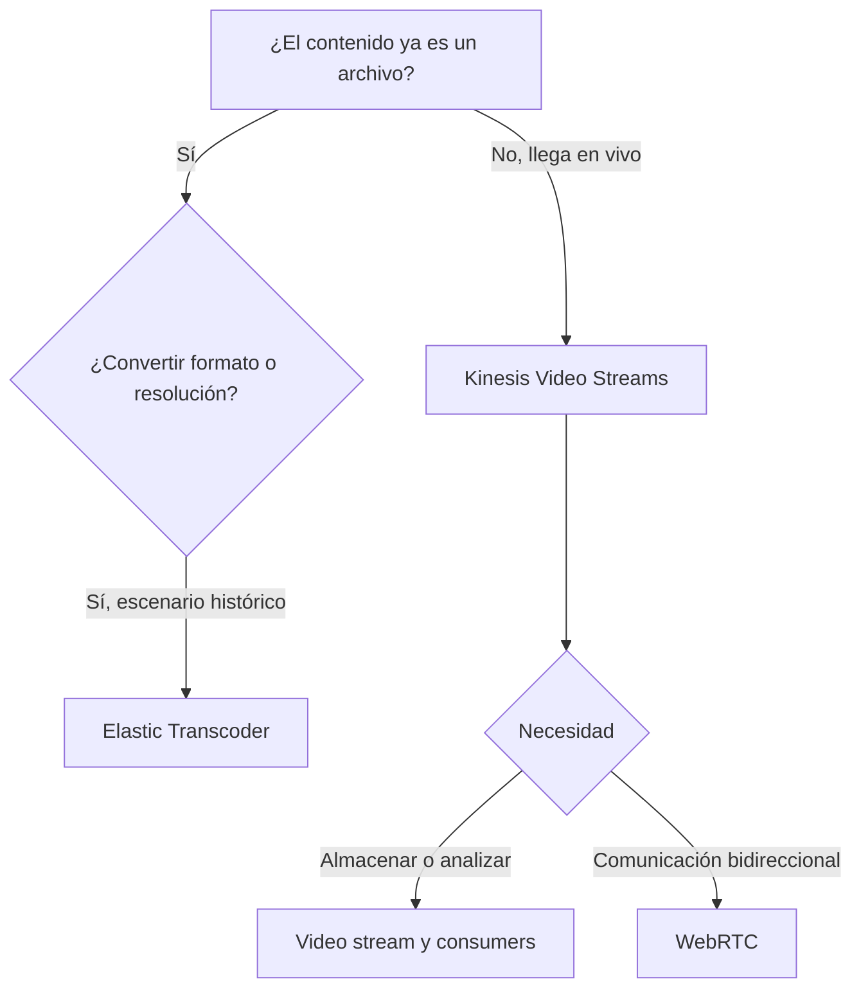
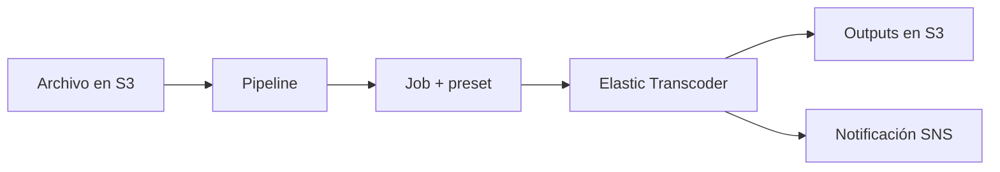
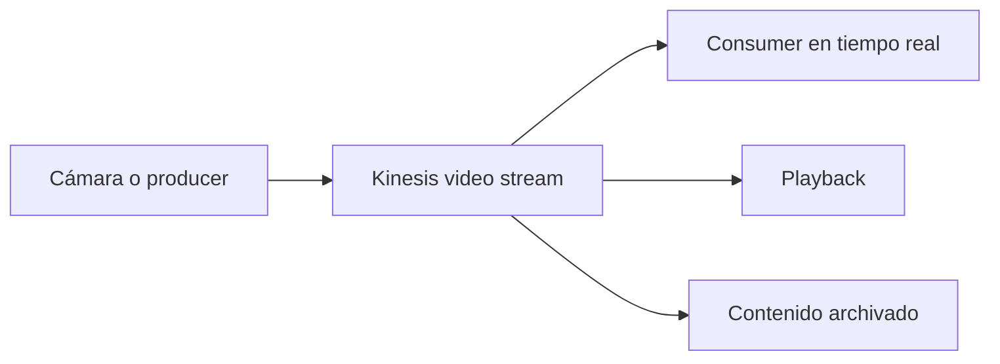
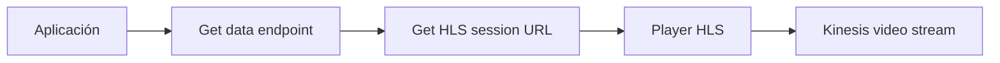
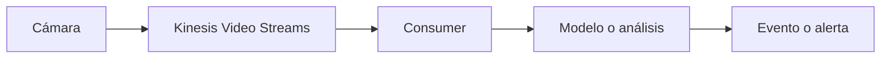
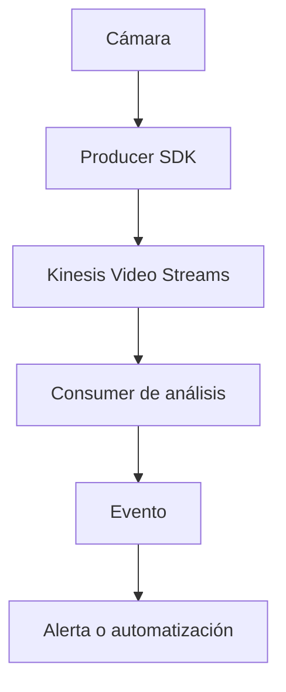
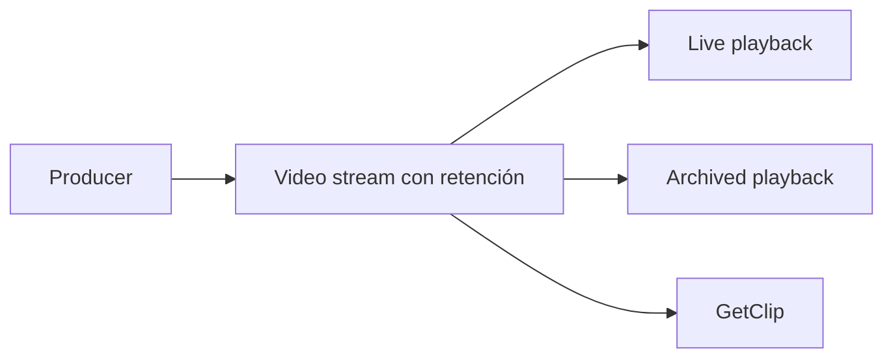
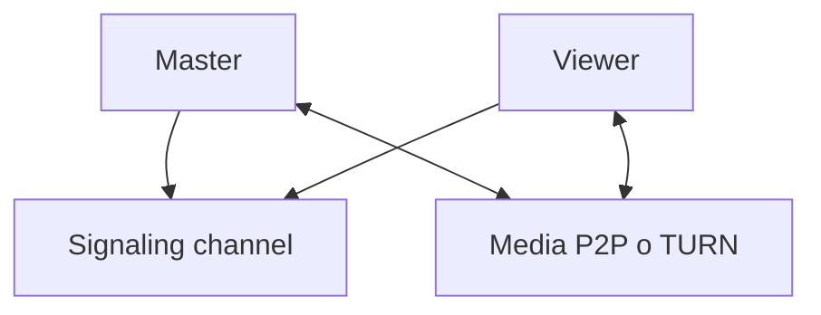
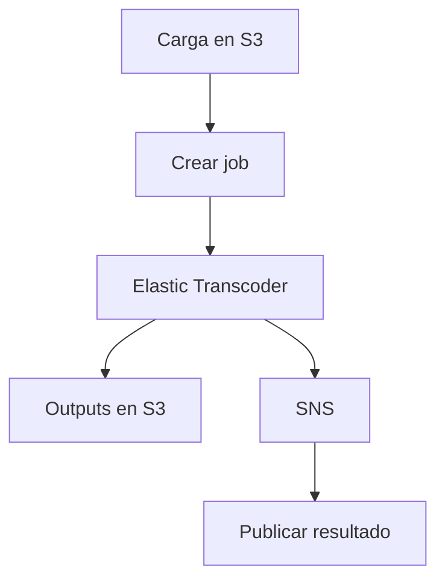

# Media Services en AWS para el examen SAA-C03

## 1. Alcance necesario para el examen

Esta guía desarrolla únicamente los siguientes servicios de **Media Services**:

- Amazon Elastic Transcoder
- Amazon Kinesis Video Streams

El examen evalúa principalmente la capacidad de:

- Diferenciar un archivo multimedia almacenado de un flujo de video en vivo.
- Distinguir transcodificación, ingestión, almacenamiento, reproducción y análisis.
- Seleccionar un servicio para convertir archivos de audio o video a otros formatos.
- Capturar video, audio y datos temporales desde cámaras y dispositivos.
- Diferenciar producers, streams, fragments y consumers.
- Elegir retención temporal o persistente según el caso de uso.
- Diseñar reproducción en vivo o de contenido archivado.
- Reconocer cuándo se necesita HLS, MPEG-DASH, WebRTC o una API de consumo.
- Diseñar pipelines asíncronos y desacoplados.
- Aplicar IAM, cifrado, retención y observabilidad.
- Considerar ancho de banda, latencia, codec, container y duración del contenido.
- Identificar el estado vigente de Amazon Elastic Transcoder.

> **Alcance:** otros servicios pueden aparecer como almacenamiento, procesamiento, distribución o alternativas -por ejemplo, Amazon S3, Amazon CloudFront, Amazon Rekognition, AWS Lambda, Amazon SNS, Amazon SQS, AWS Elemental MediaConvert o AWS IoT-, pero no se desarrollan como servicios principales en este capítulo.

> **Estado vigente:** AWS cerró completamente Amazon Elastic Transcoder el **13 de noviembre de 2025**. Desde esa fecha ya no se puede acceder a su consola ni a sus recursos. Se estudia porque forma parte de la lista solicitada para el SAA-C03 y porque sus conceptos pueden aparecer en material histórico; no debe seleccionarse para una implementación nueva.

---

## 2. Modelos fundamentales

### Servicio según la necesidad

| Necesidad | Servicio | Modelo |
|---|---|---|
| Convertir un archivo de audio o video almacenado | Amazon Elastic Transcoder -histórico- | File-based transcoding |
| Recibir video en vivo desde una cámara o dispositivo | Amazon Kinesis Video Streams | Streaming ingestion |
| Conservar y recuperar fragmentos de una transmisión | Amazon Kinesis Video Streams | Managed media storage |
| Procesar video mientras se recibe | Amazon Kinesis Video Streams + consumer | Real-time processing |
| Reproducir video en vivo o archivado mediante HLS/DASH | Amazon Kinesis Video Streams | Managed playback session |
| Comunicación bidireccional de muy baja latencia | Kinesis Video Streams with WebRTC | Real-time peer communication |

### Regla mental inicial

> **Regla de examen:** Elastic Transcoder transformaba archivos almacenados. Kinesis Video Streams recibe y conserva media continua procedente de producers. Ninguno de los dos conceptos sustituye automáticamente al otro.

### Archivo frente a stream

| Característica | Archivo | Stream |
|---|---|---|
| Estado | El objeto ya está completo | Los datos llegan continuamente |
| Ejemplo | Video MP4 en S3 | Cámara IP transmitiendo |
| Procesamiento | Job sobre un objeto | Consumer lee fragments |
| Inicio y fin | Definidos | Puede durar indefinidamente |
| Servicio de esta guía | Elastic Transcoder -histórico- | Kinesis Video Streams |

### Transcodificación frente a transmisión

| Transcodificación | Transmisión |
|---|---|
| Convierte codec, container, resolución o bitrate | Transporta media mientras se produce |
| Entrada y salida pueden ser archivos | Entrada continua desde un producer |
| Consume tiempo de procesamiento | Consume ancho de banda de ingestión y lectura |
| Puede generar varias versiones | Mantiene una secuencia de fragments |
| No implica entrega en vivo | No implica cambiar el formato |

> **Trampa de examen:** almacenar un video en un stream no significa que el servicio lo haya convertido a otra resolución o codec.

---

## 3. Conceptos multimedia que se deben dominar

### Codec frente a container

| Concepto | Función | Ejemplos |
|---|---|---|
| Codec | Comprime y descomprime audio o video | H.264, H.265, AAC |
| Container | Empaqueta tracks, timestamps y metadata | MP4, MPEG-TS, MKV |

- Cambiar de container no siempre requiere recodificar.
- Cambiar codec normalmente sí requiere transcoding.
- Un container puede incluir video, audio, subtítulos y metadata.
- La compatibilidad depende del producer, player, protocolo y dispositivo.

### Resolución, bitrate y frame rate

| Parámetro | Influencia |
|---|---|
| Resolución | Cantidad de píxeles, calidad visual y capacidad requerida |
| Bitrate | Datos transmitidos por unidad de tiempo |
| Frame rate | Cantidad de imágenes por segundo |
| Audio bitrate | Calidad y volumen de datos del track de audio |

Una mayor resolución no garantiza mejor experiencia si:

- El bitrate es insuficiente.
- La red tiene poca capacidad.
- El dispositivo no soporta el codec.
- El player no puede decodificar el contenido.
- La latencia requerida es incompatible con el protocolo.

### Estimación de volumen

La estimación básica de datos generados por un stream es:

$$
\text{Volumen} \approx \text{Bitrate} \times \text{Duración}
$$

Para convertir bits en bytes:

$$
\text{Bytes} = \frac{\text{Bits}}{8}
$$

En una estimación real se incluyen:

- Video y audio.
- Metadata.
- Overhead del protocolo y container.
- Reintentos.
- Múltiples cámaras.
- Lecturas realizadas por consumers.
- Copias o clips exportados.

### Frames y key frames

- Un **frame** es una imagen individual de la secuencia.
- Un **key frame** puede decodificarse sin depender de frames anteriores.
- Los frames intermedios pueden depender de otros frames.
- La fragmentación suele alinearse con key frames.
- Fragmentos más cortos pueden reducir latencia, pero aumentan overhead.
- La configuración del encoder afecta la capacidad de reproducción y análisis.

### HLS, MPEG-DASH y WebRTC

| Tecnología | Uso principal | Latencia relativa |
|---|---|---|
| HLS | Reproducción web/móvil en vivo o archivada | Segundos |
| MPEG-DASH | Adaptive streaming en vivo o archivado | Segundos |
| WebRTC | Comunicación interactiva y bidireccional | Muy baja |
| GetMedia | Consumo programático de baja latencia | Depende de la aplicación |

- HLS y MPEG-DASH entregan segmentos y manifests a un player.
- WebRTC intercambia media interactiva entre peers.
- GetMedia permite construir un consumer o player propio.
- La latencia final depende también del encoder, tamaño de fragmento, red, buffer y player.

### Live, playback y analytics

| Patrón | Objetivo |
|---|---|
| Live viewing | Ver lo que ocurre ahora |
| Archived playback | Volver a un rango temporal retenido |
| Clip extraction | Obtener un fragmento como archivo |
| Real-time analytics | Analizar frames mientras llegan |
| Batch analytics | Procesar contenido retenido posteriormente |

### Control plane frente a data plane

| Plano | Operaciones |
|---|---|
| Control plane | Crear, describir, etiquetar y configurar streams |
| Data plane | Publicar, recuperar y reproducir media |

Kinesis Video Streams utiliza un patrón de descubrimiento de endpoints para varias operaciones del data plane. La aplicación obtiene el endpoint correspondiente al stream y a la API antes de publicar o consumir media.

---

## 4. Amazon Elastic Transcoder

Amazon Elastic Transcoder fue un servicio administrado para convertir archivos multimedia almacenados en Amazon S3 a versiones compatibles con diferentes dispositivos y casos de reproducción.

> **Servicio retirado:** Amazon Elastic Transcoder se encuentra en **full shutdown** desde el 13 de noviembre de 2025. Los conceptos de esta sección describen su funcionamiento histórico y su posible presencia en material del examen.

### Qué resolvía

- Cambio de codec o container.
- Cambio de resolución.
- Ajuste de frame rate y bitrate.
- Conversión de audio.
- Generación de thumbnails.
- Creación de múltiples outputs.
- Generación de playlists para formatos compatibles.
- Incorporación o procesamiento de captions según la configuración admitida.

### Componentes principales

| Componente | Función |
|---|---|
| Input bucket | Bucket S3 con los archivos originales |
| Pipeline | Conecta buckets, IAM role y notificaciones |
| Preset | Define parámetros de transcodificación |
| Job | Solicitud asíncrona de conversión |
| Output bucket | Bucket S3 que recibe los resultados |
| Thumbnail pattern | Define nombres de thumbnails |
| Playlist | Agrupa outputs compatibles para reproducción adaptativa |
| SNS notification | Informa cambios de estado |

### Flujo histórico

### Pipeline

El pipeline definía la infraestructura lógica del procesamiento:

- Bucket de entrada.
- Bucket de salida.
- Bucket de thumbnails cuando correspondía.
- IAM role utilizado por el servicio.
- SNS topics para eventos.
- Estado activo o pausado.

El pipeline no describía por sí solo cómo convertir un archivo. Esa configuración pertenecía al preset y al job.

### Presets

Un preset agrupaba parámetros reutilizables:

| Parámetro | Ejemplo de decisión |
|---|---|
| Container | MP4 |
| Video codec | H.264 |
| Audio codec | AAC |
| Resolution | Versión HD o móvil |
| Bitrate | Calidad frente a tamaño |
| Frame rate | Compatibilidad y fluidez |
| Aspect ratio | Mantener o adaptar proporción |
| Watermark | Superponer una imagen |
| Thumbnails | Frecuencia y formato |

Existían:

- **System presets:** configuraciones proporcionadas por AWS.
- **Custom presets:** configuraciones creadas para requisitos específicos.

> **Regla de examen:** el preset define **cómo** se transcodifica; el job define **qué archivo** se procesa y qué outputs se deben crear.

### Jobs

Un job especificaba:

- Pipeline.
- Clave del objeto de entrada.
- Uno o varios outputs.
- Preset de cada output.
- Nombre o key de salida.
- Thumbnails.
- Playlist cuando correspondía.
- Captions y cifrado según las opciones utilizadas.

Un mismo input podía generar varias versiones:

| Output | Uso |
|---|---|
| Alta resolución | Pantalla grande |
| Resolución media | Web |
| Baja resolución | Red móvil |
| Solo audio | Podcast o accesibilidad |
| Thumbnails | Catálogo y vista previa |

### Procesamiento asíncrono

- La creación del job no devolvía inmediatamente el archivo convertido.
- El job avanzaba por estados.
- La aplicación podía consultar su estado.
- SNS evitaba polling constante.
- Un error podía corresponder al input, permisos, preset, codec o output.
- La aplicación debía manejar éxito, warning y error.

### Notificaciones

El pipeline podía publicar mediante Amazon SNS cuando un job:

- Comenzaba a procesarse.
- Emitía una advertencia.
- Finalizaba.
- Fallaba.

Patrón recomendado:

1. Crear el job.
2. Guardar su identificador y estado.
3. Recibir la notificación.
4. Validar que el evento corresponde al job esperado.
5. Actualizar el sistema de negocio.
6. Publicar o procesar el output.

### S3 e IAM

El role del pipeline necesitaba:

- Leer los objetos de entrada.
- Escribir outputs.
- Escribir thumbnails.
- Publicar en SNS.
- Utilizar claves de cifrado cuando correspondía.

Una bucket policy demasiado restrictiva podía impedir el job. Una policy demasiado amplia podía exponer todo el bucket.

### Seguridad histórica

- Buckets privados.
- Acceso mediante IAM role.
- Cifrado en tránsito.
- Cifrado de objetos de entrada y salida.
- Separación de prefixes de input y output.
- URLs temporales o distribución autenticada para consumidores.
- Retención y eliminación del archivo original.
- Auditoría de acciones administrativas.

### Alta disponibilidad y operación

- AWS administraba los workers.
- El cliente no aprovisionaba servidores de transcoding.
- El servicio era regional.
- Input, output y pipeline debían diseñarse en regiones compatibles.
- La aplicación seguía siendo responsable de reintentos e idempotencia.
- Crear dos jobs para el mismo evento podía generar outputs duplicados y costo adicional.

### Costos históricos

Los principales factores eran:

- Duración del contenido transcodificado.
- Resolución del output.
- Cantidad de outputs.
- Generación de audio y thumbnails.
- Almacenamiento S3.
- Requests S3.
- Transferencia y distribución posterior.

Un video de diez minutos convertido a tres resoluciones generaba procesamiento para tres outputs, no únicamente para un input.

### Estado actual y decisión arquitectónica

| Pregunta | Respuesta |
|---|---|
| ¿Se puede implementar actualmente? | No; está en full shutdown |
| ¿Por qué estudiarlo? | Puede aparecer en listas o material histórico del SAA-C03 |
| ¿Qué función se debe recordar? | Transcodificación administrada de archivos de S3 |
| ¿Qué hacer en una arquitectura nueva? | Elegir el servicio multimedia vigente que cubra la transcodificación |

AWS indicó AWS Elemental MediaConvert como ruta de migración. Se menciona únicamente como alternativa vigente; no se desarrolla como servicio principal porque no forma parte del alcance solicitado.

### Cuándo habría sido la respuesta

- Convertir archivos almacenados en S3.
- Crear versiones para diferentes dispositivos.
- Generar thumbnails y outputs múltiples.
- Ejecutar transcoding sin administrar servidores.

### Cuándo no era la respuesta

- Recibir una cámara en vivo: Kinesis Video Streams.
- Comunicación bidireccional interactiva: WebRTC.
- Almacenar objetos sin convertirlos: S3.
- Analizar personas u objetos: un servicio de computer vision.

---

## 5. Amazon Kinesis Video Streams

Amazon Kinesis Video Streams es un servicio administrado para capturar, procesar y almacenar de forma segura video, audio y otros datos codificados por tiempo procedentes de cámaras, dispositivos y aplicaciones.

### Casos de uso

- Cámaras de seguridad.
- Dashcams.
- Drones.
- Cámaras industriales.
- Dispositivos domésticos.
- Telemetría sincronizada con video.
- Live monitoring.
- Computer vision en tiempo real.
- Reproducción de contenido retenido.
- Comunicación interactiva mediante WebRTC.

### Arquitectura fundamental

### Componentes

| Componente | Función |
|---|---|
| Producer | Captura, codifica y envía media |
| Video stream | Recurso lógico que recibe fragments |
| Frame | Unidad individual de audio o video |
| Fragment | Secuencia autocontenida de frames |
| Consumer | Lee, reproduce o analiza media |
| Retention period | Tiempo que los fragments permanecen almacenados |
| Data endpoint | Endpoint específico para publicar o consumir |
| Signaling channel | Coordina una sesión WebRTC |

### Producers

Un producer puede ser:

- Cámara.
- Dispositivo IoT.
- Aplicación móvil.
- Navegador compatible mediante WebRTC.
- Servidor que reenvía un stream.
- Pipeline GStreamer.

AWS proporciona Producer SDKs y plugins compatibles para:

- Capturar frames.
- Empaquetarlos en MKV.
- Crear fragments.
- Administrar timestamps.
- Mantener un buffer local.
- Reintentar después de interrupciones.
- Recibir acknowledgements del servicio.

La aplicación debe configurar:

- Codec y content type.
- Frame rate.
- Bitrate estimado.
- Fragment duration.
- Timestamps.
- Retención.
- Credenciales.
- Buffer local.

### PutMedia

`PutMedia` es la API de publicación del data plane:

- Utiliza una conexión de streaming de larga duración.
- Envía múltiples fragments en la misma conexión.
- No se abre una conexión por frame.
- Kinesis Video Streams asigna un fragment number.
- Conserva producer timestamp y server timestamp.
- Devuelve acknowledgements según la configuración.

> **Trampa de examen:** Kinesis Video Streams no utiliza shards como Kinesis Data Streams. Su unidad principal es el **video stream** y su contenido se organiza en **fragments**.

### Frames y fragments

| Elemento | Descripción |
|---|---|
| Frame | Imagen o bloque de audio con timestamp |
| Key frame | Frame que puede iniciar decodificación |
| Fragment | Grupo autocontenido de frames |
| Fragment number | Identificador asignado por el servicio |
| Producer timestamp | Tiempo informado por el producer |
| Server timestamp | Tiempo registrado por AWS |

Un fragment debe poder interpretarse sin depender de frames de otro fragment. La fragmentación correcta facilita:

- Recuperación por tiempo.
- Reproducción.
- Paralelismo de consumers.
- Generación de clips.
- Recuperación después de una desconexión.

### Timestamps

Los timestamps permiten localizar media:

- Tiempo generado por el producer.
- Tiempo registrado por el servidor.
- Inicio relativo o absoluto.
- Selección de fragmentos por rango temporal.

Riesgos:

- Reloj del dispositivo incorrecto.
- Cámaras con zonas horarias diferentes.
- Saltos hacia atrás.
- Frames fuera de orden.
- Streams duplicados después de reconectar.

Para requerimientos forenses o de sincronización se debe administrar el reloj del dispositivo y conservar ambos tipos de timestamp cuando aporten valor.

### Retención

| Configuración | Comportamiento |
|---|---|
| Sin retención persistente | Media disponible para consumo en tiempo real, sin archivo duradero del stream |
| Retención mayor que cero | Fragments almacenados durante el período definido |

La retención permite:

- Playback histórico.
- Listar fragments.
- Recuperar un rango.
- Generar clips.
- Ejecutar análisis posterior.

La retención no es un backup indefinido. Si se requiere conservar evidencia más tiempo:

1. Recuperar o exportar el contenido necesario.
2. Guardarlo en almacenamiento duradero.
3. Aplicar lifecycle, cifrado y controles de acceso.
4. Validar integridad y retención legal.

### Consumo en tiempo real

`GetMedia`:

- Es una API de baja latencia.
- Mantiene una conexión de streaming.
- Entrega chunks con fragments y metadata.
- Permite construir un consumer o player propio.
- Requiere que la aplicación parsee el container.
- No es la API utilizada por HLS o MPEG-DASH.

Un consumer personalizado puede:

- Decodificar frames.
- Ejecutar computer vision.
- Detectar eventos.
- Generar alertas.
- Extraer imágenes.
- Correlacionar sensores.

### Contenido archivado

Para media retenida existen operaciones orientadas a:

- Listar fragments.
- Recuperar fragments específicos.
- Obtener clips.
- Generar sesiones HLS.
- Generar sesiones MPEG-DASH.
- Obtener imágenes según configuración compatible.

La aplicación normalmente:

1. Solicita el data endpoint apropiado.
2. Selecciona un rango de tiempo o fragments.
3. Invoca la API de archived media.
4. Procesa, reproduce o almacena el resultado.

### Playback con HLS

HLS permite:

- Live playback.
- Reproducción de media archivada.
- Integración con players web compatibles.
- Obtener una session URL temporal.

Flujo:

La session URL contiene autorización temporal. No debe registrarse ni compartirse de manera insegura.

### Playback con MPEG-DASH

MPEG-DASH también permite reproducción en vivo o archivada mediante:

- Session URL.
- Manifest.
- Segments.
- Player compatible.

HLS y DASH requieren contenido compatible. Kinesis Video Streams no convierte automáticamente cualquier codec a uno que el navegador pueda reproducir.

### GetClip

`GetClip` permite recuperar un rango de media archivada como un clip MP4 compatible:

- Requiere retención.
- Utiliza un rango temporal.
- Está sujeto a límites de tamaño, duración, fragments y codec.
- Es útil para exportar evidencia o un evento.
- No sustituye un sistema de archivado masivo.

### Metadata de fragments

El producer puede añadir metadata al fragment:

- Identificador de dispositivo.
- Lectura de sensor.
- Tipo de evento.
- Ubicación lógica.
- Estado de la cámara.

La metadata:

- Viaja asociada al fragment.
- Puede ser recuperada por consumers compatibles.
- Facilita correlación sin analizar todos los píxeles.
- No debe contener secretos.
- También queda sujeta a políticas de retención y privacidad.

### Kinesis Video Streams with WebRTC

WebRTC permite:

- Video y audio de muy baja latencia.
- Comunicación bidireccional.
- Navegadores, móviles y dispositivos compatibles.
- Conectividad peer-to-peer cuando es posible.
- Uso de infraestructura administrada de signaling, STUN y TURN.

### Signaling channel

El signaling channel intercambia:

- SDP offers.
- SDP answers.
- ICE candidates.
- Información necesaria para establecer la conexión.

Roles habituales:

| Rol | Función |
|---|---|
| Master | Dispositivo o aplicación que mantiene la sesión principal |
| Viewer | Cliente que se conecta al master |

> **Trampa de examen:** el signaling channel coordina la conexión; por sí solo no equivale a un video stream con retención. Para almacenar media WebRTC se debe configurar la capacidad de ingestión correspondiente.

### STUN y TURN

| Componente | Función |
|---|---|
| STUN | Ayuda a descubrir la dirección pública y establecer conexión directa |
| TURN | Relay de media cuando la conexión peer-to-peer no es posible |

TURN puede aumentar:

- Latencia.
- Transferencia.
- Costo.

La aplicación debe manejar expiración de credenciales ICE, reconexión y estados del peer.

### WebRTC ingestion

WebRTC ingestion permite enviar media de una sesión hacia la nube para:

- Almacenamiento.
- Playback.
- Análisis.
- Integración con consumers.

Se debe distinguir:

1. Signaling y comunicación en tiempo real.
2. Ingestión de media.
3. Retención en un video stream.
4. Procesamiento o reproducción posterior.

### Kinesis Video Streams frente a Kinesis Data Streams

| Kinesis Video Streams | Kinesis Data Streams |
|---|---|
| Video, audio y timed media | Eventos y registros |
| Frames y fragments | Records |
| MKV y codecs | Payload binario |
| PutMedia/GetMedia | PutRecord/GetRecords y APIs equivalentes |
| Retención y playback de media | Retención y procesamiento de records |
| No usa shards como modelo de diseño del stream | Usa shards o modos de capacidad |

### Integración con análisis

Kinesis Video Streams almacena y transporta media; el análisis lo realiza un consumer:

Opciones conceptuales:

- Consumer propio en compute administrado por el cliente.
- Computer vision mediante una integración compatible.
- Extracción de frames e inferencia con un modelo.
- Envío de eventos derivados a un bus, topic o queue.

No es necesario enviar el video completo a cada sistema. Se pueden publicar eventos derivados, como “persona detectada” o “temperatura anómala”.

### Patrón de una cámara por stream

En muchos diseños se utiliza un stream por cámara o fuente:

- Aísla permisos.
- Separa métricas.
- Reduce contención de cuotas por stream.
- Facilita retención por dispositivo.
- Permite eliminar o rotar una fuente.
- Simplifica búsqueda por nombre o tag.

No se debe abrir más de una conexión `PutMedia` concurrente para competir sobre el mismo stream sin revisar el comportamiento y las cuotas. Para fuentes independientes se crean streams independientes.

### Seguridad

#### IAM

- Restringir producers a su stream.
- Separar permisos de producer y consumer.
- Evitar credenciales de larga duración en dispositivos.
- Utilizar credenciales temporales y rotación.
- Restringir playback y archived media.
- Controlar quién puede modificar retención o eliminar streams.

#### Cifrado

- Media cifrada en tránsito mediante TLS.
- Cifrado server-side en reposo.
- Integración con AWS KMS para la key del stream.
- Permisos KMS coherentes con producers, consumers y servicio.
- Clips exportados requieren su propio cifrado en el destino.

#### Privacidad

- Video y audio pueden contener datos personales.
- La metadata puede revelar ubicación o identidad.
- Definir retención mínima.
- Aplicar consentimiento y requisitos legales.
- Limitar visualización.
- Registrar accesos.
- Proteger session URLs.
- Evitar incluir información sensible en nombres de streams y tags.

### Resiliencia

- El Producer SDK puede utilizar buffer local.
- Los fragment ACKs confirman recepción y persistencia según el tipo de acknowledgement.
- El producer debe reintentar errores transitorios.
- Exponential backoff evita agravar throttling.
- Se debe dimensionar el buffer para interrupciones esperadas.
- Un buffer lleno puede descartar media según la estrategia.
- El reloj del dispositivo debe sincronizarse.
- Consumers deben poder reiniciar desde un timestamp o fragment.

### Escalabilidad y cuotas

- Las cuotas se aplican por API, cuenta, región o stream según el caso.
- `PutMedia` y `GetMedia` son conexiones largas.
- Abrir conexiones repetidamente aumenta errores y overhead.
- Las APIs de archived media pueden limitarse por fragments.
- HLS/DASH tienen límites de sessions y llamadas.
- WebRTC tiene cuotas de signaling, peers y TURN.
- Se solicitan aumentos cuando la cuota es ajustable.
- Para muchas cámaras se distribuye la carga en múltiples streams.

### Observabilidad

CloudWatch permite observar métricas como:

- Bytes recibidos.
- Bytes enviados.
- Fragmentos recibidos o persistidos.
- Errores de PutMedia.
- Errores de GetMedia.
- Latencia o diferencia respecto al stream en vivo.
- Conexiones y throttling.

También se deben monitorear:

- Cámara sin frames.
- Bitrate fuera del rango esperado.
- Timestamp atrasado.
- Buffer local creciendo.
- Consumers desconectados.
- Falta de fragments persistidos.
- Aumento de TURN en WebRTC.

### Costos

Los principales factores son:

- Datos ingeridos.
- Datos consumidos.
- Datos almacenados y período de retención.
- Cantidad de consumers.
- Playback y recuperación de media.
- WebRTC signaling y uso de TURN.
- Transferencia hacia internet o entre regiones.
- Compute y análisis posteriores.
- Clips o imágenes almacenados en otros servicios.

La misma transmisión leída por varios consumers genera más consumo que una sola lectura. Publicar eventos derivados puede reducir el número de sistemas que necesitan leer el video completo.

### Cuándo elegirlo

- Capturar video desde cámaras.
- Procesar media en tiempo real.
- Retener fragments para reproducción.
- Recuperar clips por rango temporal.
- Crear comunicación bidireccional mediante WebRTC.
- Correlacionar video con metadata temporal.

### Cuándo no elegirlo

- Convertir un catálogo de archivos a varias resoluciones.
- Distribuir por sí solo una biblioteca global de video on demand.
- Analizar imágenes sin un consumer o servicio de visión.
- Sustituir Kinesis Data Streams para eventos pequeños sin media.

---

## 6. Seguridad, resiliencia y operación

### Responsabilidad compartida

AWS administra la infraestructura del servicio, pero el cliente administra:

- Producers y dispositivos.
- Identidades y credenciales.
- Buckets y outputs.
- Codecs y configuración del encoder.
- Retención.
- Consumers.
- Session URLs.
- Cifrado y keys.
- Privacidad.
- Reintentos e idempotencia.
- Validación del contenido generado.

### Matriz de controles

| Riesgo | Control |
|---|---|
| Dispositivo comprometido | Credenciales temporales y permisos por stream |
| Video expuesto | IAM, cifrado y playback autenticado |
| Session URL filtrada | TTL corto y no registrar el token |
| Duplicación de jobs/eventos | Idempotency key |
| Pérdida durante corte de red | Buffer local y reconexión |
| Storage sin límite | Retention y lifecycle de exports |
| Reloj incorrecto | Time synchronization y validación |
| Consumer atrasado | Métricas de lag y escalado |
| Throttling | Backoff, cuotas y distribución por streams |

### Desacoplamiento

Los procesos asíncronos deben notificar o publicar eventos:

- SNS para fan-out.
- SQS para buffering y retries.
- EventBridge para routing.
- Dead-letter queue para fallos persistentes.

Estos servicios pueden integrarse en la arquitectura, pero no sustituyen el stream de video ni el motor de transcoding.

### Idempotencia

Un evento duplicado no debe:

- Crear dos jobs para el mismo archivo.
- Procesar dos veces el mismo fragment.
- Generar dos alertas de negocio.
- Sobrescribir un output correcto con uno incompleto.

Se puede utilizar una clave compuesta por:

- Identificador del archivo o stream.
- Fragment number.
- Rango temporal.
- Tipo de procesamiento.
- Versión del modelo o preset.

### Alta disponibilidad regional

- Kinesis Video Streams es un servicio regional administrado.
- Un producer publica en un stream de una región.
- La retención no constituye replicación automática multirregional.
- Para continuidad regional se diseña un mecanismo explícito de failover o duplicación.
- El dispositivo debe conocer cómo obtener configuración y credenciales de la región alternativa.
- Se debe evitar duplicar o perder media durante el cambio.

> **Regla de examen:** “servicio administrado” no significa automáticamente “multirregional”.

---

## 7. Arquitecturas habituales

### Cámara con análisis en tiempo real

Decisiones:

- Un stream por cámara.
- Retención según investigación requerida.
- Consumer separado del producer.
- Threshold y revisión para eventos sensibles.
- Métricas de último fragmento recibido.

### Monitoreo con reproducción histórica

- Live playback muestra el contenido reciente.
- Archived playback requiere fragments retenidos.
- GetClip exporta un rango específico.
- Un archivo exportado necesita su propia política de almacenamiento.

### Comunicación WebRTC

- El signaling channel intercambia información de sesión.
- STUN intenta facilitar conexión directa.
- TURN actúa como relay si es necesario.
- La ingestión a almacenamiento es una decisión adicional.

### Transcodificación de archivo -patrón histórico-

Actualmente este diagrama solo representa el patrón histórico de Elastic Transcoder.

---

## 8. Matriz de decisión

| Requisito del escenario | Servicio o concepto | Razón |
|---|---|---|
| Convertir archivo MP4 a varias resoluciones | Elastic Transcoder -histórico- | File-based transcoding |
| Generar thumbnails de un archivo | Elastic Transcoder -histórico- | Output del job |
| Configuración reutilizable de codec y resolución | Preset -histórico- | Define parámetros |
| Notificar cuando termina la conversión | SNS notification -histórico- | Job asíncrono |
| Recibir video de una cámara | Kinesis Video Streams | Streaming ingestion |
| Procesar frames mientras llegan | GetMedia + consumer | Lectura de baja latencia |
| Conservar video durante varios días | Retention period | Archived media |
| Reproducir un stream en un player web | HLS o MPEG-DASH | Session URL y segments |
| Recuperar un evento como MP4 | GetClip | Rango archivado |
| Asociar lecturas de sensor al video | Fragment metadata | Datos sincronizados |
| Videochat bidireccional | Kinesis Video Streams with WebRTC | Interacción de baja latencia |
| Negociar una conexión WebRTC | Signaling channel | SDP e ICE |
| Conectar peers detrás de NAT | STUN/TURN | Descubrimiento o relay |
| Aislar miles de cámaras | Múltiples video streams | Cuotas, permisos y métricas |
| Convertir archivos en una arquitectura nueva | Alternativa vigente | Elastic Transcoder está retirado |

---

## 9. Diferencias que suelen generar errores

### Elastic Transcoder frente a Kinesis Video Streams

| Elastic Transcoder | Kinesis Video Streams |
|---|---|
| Archivos completos | Media continua |
| Input y output en S3 | Producer y consumer |
| Job asíncrono | Conexión de streaming |
| Preset | Stream definition |
| Convierte formato | Ingiere y almacena fragments |
| Servicio retirado | Servicio vigente |

### Transcoding frente a playback

- Transcoding crea otra representación.
- Playback entrega una representación al player.
- HLS/DASH no implican que Kinesis Video Streams convierta cualquier codec.
- Un stream incompatible puede requerir procesamiento antes de reproducirse.

### Kinesis Video Streams frente a Kinesis Data Streams

- Video Streams usa frames y fragments.
- Data Streams usa records y shards.
- El nombre “Kinesis” no significa que compartan exactamente el mismo modelo.
- Video, audio y timestamps apuntan a Kinesis Video Streams.
- Eventos JSON de alta velocidad apuntan a Kinesis Data Streams.

### HLS/DASH frente a WebRTC

| HLS/DASH | WebRTC |
|---|---|
| Playback | Interacción |
| Latencia en segundos | Muy baja latencia |
| Manifests y segments | Peer connection |
| Unidireccional habitual | Bidireccional |
| Escala para audiencia mediante arquitectura de entrega | Orientado a sesiones interactivas |

### Video stream frente a signaling channel

| Video stream | Signaling channel |
|---|---|
| Recibe fragments | Intercambia mensajes de conexión |
| Puede retener media | No almacena media por sí solo |
| PutMedia/GetMedia | SDP/ICE |
| Playback y analytics | Sesión WebRTC |

### Retención frente a exportación

- Retention conserva fragments dentro del stream.
- GetClip exporta un rango.
- Guardar un clip fuera del stream crea otro recurso con su propio ciclo de vida.
- Retención de cero no permite playback histórico.
- Aumentar retención incrementa almacenamiento.

### Producer timestamp frente a server timestamp

- Producer timestamp representa el reloj del dispositivo.
- Server timestamp representa recepción en AWS.
- Un reloj incorrecto puede desplazar búsquedas históricas.
- Se selecciona la fuente temporal según el caso de uso.

### Buffer local frente a retención

| Buffer local | Retención |
|---|---|
| Está en el producer | Está en AWS |
| Ayuda ante cortes de red | Permite archived media |
| Capacidad limitada del dispositivo | Costo de almacenamiento |
| Aún no confirma persistencia | Fragment ya recibido/persistido |

### Ingestión frente a análisis

- Kinesis Video Streams transporta y almacena.
- Un consumer analiza.
- No se obtiene detección de objetos solo por crear el stream.
- El evento derivado debe conservar referencia al fragment o timestamp.

### Servicio retirado frente a respuesta histórica

- Elastic Transcoder puede aparecer en material anterior.
- Su función histórica sigue siendo file-based transcoding.
- Desde noviembre de 2025 no es una opción implementable.
- Una pregunta sobre arquitectura vigente debe considerar el servicio recomendado actualmente.

---

## 10. Optimización de costos

### Archivos y outputs

- Evitar resoluciones que ningún cliente utiliza.
- Generar thumbnails solo cuando aportan valor.
- Eliminar archivos temporales.
- Aplicar S3 Lifecycle a originales y outputs.
- Evitar jobs duplicados.
- Reutilizar outputs existentes.
- Distribuir contenido sin retranscodificar en cada acceso.

### Ingestión

- Configurar bitrate según la calidad necesaria.
- No enviar audio si no se requiere.
- Ajustar frame rate.
- Comprimir en el producer.
- Usar un stream por fuente cuando facilita control.
- Detener producers que no deben transmitir.

### Retención

- Retener solo el período requerido.
- Exportar únicamente eventos importantes.
- Utilizar almacenamiento apropiado para archivo de largo plazo.
- Eliminar streams de prueba.
- Revisar crecimiento por cantidad de cámaras.

### Consumo

- Evitar que varios sistemas lean el video completo si pueden compartir eventos derivados.
- Ejecutar analytics solo cuando existe movimiento o una señal relevante.
- Seleccionar fragments o rangos concretos.
- Cerrar sessions y conexiones no utilizadas.
- Limitar reproducción pública no autorizada.

### WebRTC

- Medir cuántas conexiones necesitan TURN.
- Cerrar sessions inactivas.
- Aplicar timeout.
- Evitar reconexiones agresivas.
- Monitorear consumo por signaling y relay.

### Fórmula mental

El costo total de un sistema de video incluye:

$$
\text{Ingestión} + \text{Retención} + \text{Lecturas} + \text{Análisis} + \text{Transferencia}
$$

No se debe estimar únicamente el costo del stream.

---

## 11. Estrategia para responder preguntas SAA-C03

### Método de decisión

1. **Identificar si la entrada es archivo o flujo en vivo.**
2. **Distinguir conversión, transporte, almacenamiento, reproducción o análisis.**
3. **Definir latencia requerida.**
4. **Identificar codec, container y player.**
5. **Determinar si se necesita retención.**
6. **Definir cuántos producers y consumers existen.**
7. **Seleccionar API o protocolo de reproducción.**
8. **Aplicar IAM, KMS y credenciales temporales.**
9. **Diseñar buffer, reintentos y observabilidad.**
10. **Incluir ingestión, almacenamiento, consumo y transferencia en el costo.**

### Palabras clave

| Pista en la pregunta | Respuesta probable |
|---|---|
| Transcode file, preset, pipeline, job | Elastic Transcoder -histórico- |
| Input/output bucket, thumbnails | Elastic Transcoder -histórico- |
| Camera, device, live video | Kinesis Video Streams |
| Producer SDK, PutMedia | Ingestión de Kinesis Video Streams |
| Frame, fragment, MKV | Modelo de Kinesis Video Streams |
| Low-latency custom consumer | GetMedia |
| Archived media, time range | Retention + archived APIs |
| Browser playback | HLS o MPEG-DASH |
| MP4 clip from time range | GetClip |
| Bidirectional, peer-to-peer | WebRTC |
| SDP offer/answer, ICE candidate | Signaling channel |
| NAT traversal, relay | STUN/TURN |
| Sensor data synchronized with video | Fragment metadata |
| Shards and records | Kinesis Data Streams, no Video Streams |
| Nueva transcodificación en 2026 | No elegir Elastic Transcoder |

### Trampas de redacción

- **“Streaming”** no significa transcoding.
- **“Kinesis”** no implica shards en Video Streams.
- **“Playback”** no significa cambiar codec.
- **“Retención”** no es replicación multirregional.
- **“Signaling channel”** no almacena automáticamente el video.
- **“Buffer del dispositivo”** no confirma que AWS recibió el fragment.
- **“HLS”** no es la opción de menor latencia para interacción bidireccional.
- **“Consumer”** no es el producer.
- **“Servicio administrado”** no elimina permisos, cuotas ni costos de transferencia.
- **“Elastic Transcoder”** describe una respuesta histórica, no una implementación disponible en 2026.

---

## 12. Checklist final

Antes del examen, se debe poder explicar sin consultar documentación:

- Diferencia entre archivo y stream.
- Diferencia entre codec y container.
- Resolución, bitrate y frame rate.
- Transcoding frente a streaming.
- Frames, key frames y fragments.
- HLS, MPEG-DASH, WebRTC y GetMedia.
- Live playback frente a archived playback.
- Estado actual de Amazon Elastic Transcoder.
- Función histórica de Elastic Transcoder.
- Input bucket, pipeline, preset, job y output bucket.
- System preset frente a custom preset.
- Job asíncrono y notificaciones SNS.
- Multiple outputs y thumbnails.
- Costos históricos por duración y resolución.
- Por qué Elastic Transcoder no se elige en una arquitectura nueva.
- Función de Amazon Kinesis Video Streams.
- Producer, video stream y consumer.
- Producer SDK y PutMedia.
- Frame frente a fragment.
- Producer timestamp frente a server timestamp.
- Retention period.
- GetMedia para consumo de baja latencia.
- ListFragments y recuperación de archived media.
- HLS session URL.
- MPEG-DASH session URL.
- GetClip.
- Fragment metadata.
- Kinesis Video Streams frente a Kinesis Data Streams.
- Video stream frente a signaling channel.
- Master y viewer en WebRTC.
- SDP, ICE, STUN y TURN.
- WebRTC signaling frente a WebRTC ingestion.
- Buffer local y fragment ACKs.
- Una fuente por stream como patrón de aislamiento.
- IAM de producer frente a consumer.
- KMS y cifrado en tránsito.
- Retención y privacidad de audio/video.
- Throttling y conexiones de larga duración.
- Métricas de ingestión, consumo y lag.
- Costos de ingestión, almacenamiento, lectura y transferencia.

---

## Referencias oficiales

### Amazon Elastic Transcoder

- [Servicios de AWS en full shutdown](https://docs.aws.amazon.com/general/latest/gr/full_shutdown_services.html)
- [Fin del soporte de Amazon Elastic Transcoder](https://aws.amazon.com/blogs/media/support-for-amazon-elastic-transcoder-ending-soon/)
- [Migración de Elastic Transcoder a AWS Elemental MediaConvert](https://aws.amazon.com/blogs/media/migrating-workflows-from-amazon-elastic-transcoder-to-aws-elemental-mediaconvert/)
- [Pipeline settings](https://docs.aws.amazon.com/elastictranscoder/latest/developerguide/pipeline-settings.html)
- [Presets](https://docs.aws.amazon.com/elastictranscoder/latest/developerguide/working-with-presets.html)
- [Jobs](https://docs.aws.amazon.com/elastictranscoder/latest/developerguide/working-with-jobs.html)

### Amazon Kinesis Video Streams

- [¿Qué es Amazon Kinesis Video Streams?](https://docs.aws.amazon.com/kinesisvideostreams/latest/dg/what-is-kinesis-video.html)
- [Cómo funciona Kinesis Video Streams](https://docs.aws.amazon.com/kinesisvideostreams/latest/dg/how-it-works.html)
- [APIs y Producer SDKs](https://docs.aws.amazon.com/kinesisvideostreams/latest/dg/how-it-works-kinesis-video-api-producer-sdk.html)
- [Data model](https://docs.aws.amazon.com/kinesisvideostreams/latest/dg/how-data.html)
- [Playback](https://docs.aws.amazon.com/kinesisvideostreams/latest/dg/how-playback.html)
- [Playback mediante HLS](https://docs.aws.amazon.com/kinesisvideostreams/latest/dg/hls-playback.html)
- [Playback mediante MPEG-DASH](https://docs.aws.amazon.com/kinesisvideostreams/latest/dg/dash-playback.html)
- [Streaming metadata](https://docs.aws.amazon.com/kinesisvideostreams/latest/dg/how-meta.html)
- [Service quotas](https://docs.aws.amazon.com/kinesisvideostreams/latest/dg/limits.html)
- [CloudWatch metrics](https://docs.aws.amazon.com/kinesisvideostreams/latest/dg/monitoring-cloudwatch.html)

### Kinesis Video Streams with WebRTC

- [¿Qué es Kinesis Video Streams with WebRTC?](https://docs.aws.amazon.com/kinesisvideostreams-webrtc-dg/latest/devguide/what-is-kvswebrtc.html)
- [Cómo funciona WebRTC](https://docs.aws.amazon.com/kinesisvideostreams-webrtc-dg/latest/devguide/kvswebrtc-how-it-works.html)
- [Signaling channels](https://docs.aws.amazon.com/kinesisvideostreams-webrtc-dg/latest/devguide/ingestion-create-channel.html)
- [WebRTC ingestion](https://docs.aws.amazon.com/kinesisvideostreams-webrtc-dg/latest/devguide/webrtc-ingestion.html)
- [WebRTC service quotas](https://docs.aws.amazon.com/kinesisvideostreams-webrtc-dg/latest/devguide/kvswebrtc-limits.html)
