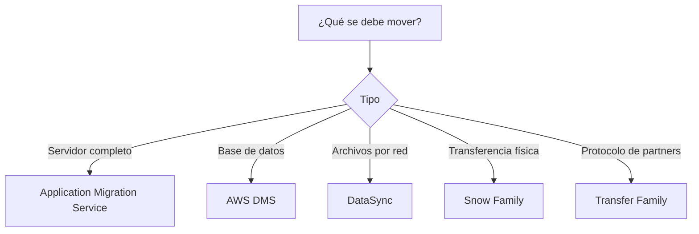
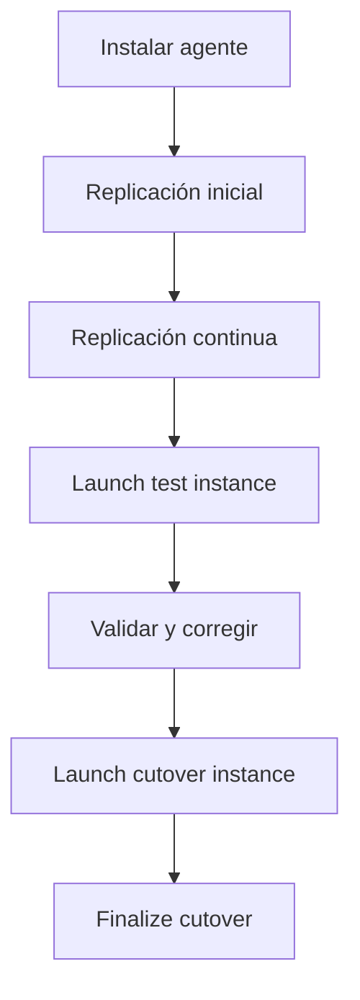
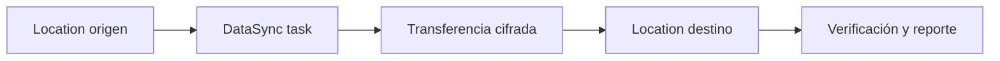
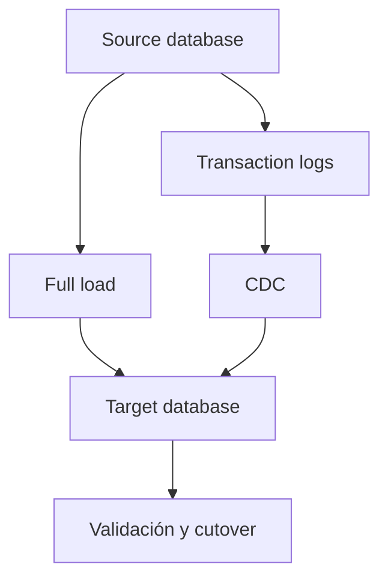
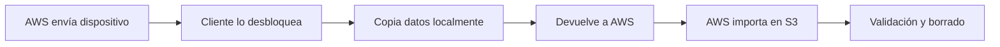

# Migración y transferencia en AWS para el examen SAA-C03

## 1. Alcance necesario para el examen

Esta guía desarrolla únicamente los siguientes servicios de **Migration and Transfer**:

- AWS Application Migration Service
- AWS DataSync
- AWS Database Migration Service - AWS DMS
- AWS Snow Family
- AWS Transfer Family

El examen evalúa principalmente la capacidad de:

- Elegir una migración de servidores, bases de datos o archivos.
- Diferenciar migración online y offline.
- Seleccionar transferencia única, periódica o continua.
- Diseñar una migración con mínimo downtime.
- Diferenciar full load, replicación incremental y change data capture -CDC.
- Migrar de forma homogénea o heterogénea.
- Diseñar pruebas, cutover, validación y rollback.
- Elegir entre Application Migration Service y DMS.
- Elegir entre DataSync, Snow Family y Transfer Family.
- Calcular la influencia del volumen, ancho de banda y ventana de migración.
- Proteger datos durante transferencia y almacenamiento temporal.
- Optimizar costos de agentes, replication instances, dispositivos y transferencia.

> **Alcance:** otros servicios pueden aparecer como destinos, componentes o alternativas -por ejemplo, Amazon S3, Amazon EFS, Amazon FSx, Amazon EC2, Amazon RDS, AWS Direct Connect o AWS Data Transfer Terminal-, pero no se desarrollan como servicios principales en este capítulo.

---

## 2. Modelos fundamentales de migración

### Servicios según lo que se migra

| Necesidad | Servicio principal | Unidad de migración |
|---|---|---|
| Rehost de servidores físicos, virtuales o cloud hacia EC2 | AWS Application Migration Service | Bloques de disco del servidor |
| Transferir archivos, objetos o directorios por red | AWS DataSync | Archivos y objetos |
| Migrar una base de datos con mínimo downtime | AWS DMS | Tablas, registros y cambios |
| Transportar grandes volúmenes sin depender de la red | AWS Snow Family | Datos cargados en dispositivo físico |
| Mantener SFTP, FTPS, FTP, AS2 o transferencia web | AWS Transfer Family | Archivos intercambiados por usuarios o partners |

### Regla mental inicial

### Online frente a offline

| Modalidad | Ventaja | Desventaja | Servicio |
|---|---|---|---|
| Online | Automatización, repetición y cambios incrementales | Depende de red, tiempo y ancho de banda | DataSync, DMS, MGN, Transfer Family |
| Offline | No consume el enlace WAN durante el traslado físico | Envío, logística y datos desactualizados durante el transporte | Snow Family |

### Única, periódica y continua

| Patrón | Descripción | Ejemplo |
|---|---|---|
| One-time | Se mueve el conjunto una sola vez | Archivo histórico hacia S3 |
| Scheduled | Se sincronizan cambios cada cierto tiempo | DataSync nocturno |
| Continuous | Se replican cambios con baja demora | MGN block replication o DMS CDC |
| On-demand | Usuarios o sistemas transfieren cuando lo requieren | SFTP mediante Transfer Family |

> **Trampa de examen:** DataSync programado no equivale a CDC de una base. DMS entiende cambios transaccionales compatibles; DataSync copia archivos u objetos modificados.

---

## 3. Conceptos de arquitectura que se deben dominar

### Las 7 R de migración

| Estrategia | Significado | Ejemplo |
|---|---|---|
| Rehost | Mover con cambios mínimos | Servidor VMware hacia EC2 con MGN |
| Replatform | Cambiar parte de la plataforma | Base autoadministrada hacia RDS |
| Refactor/Re-architect | Rediseñar la aplicación | Monolito hacia servicios administrados |
| Repurchase | Cambiar a un producto SaaS | CRM propio hacia SaaS |
| Relocate | Mover una plataforma completa sin rediseño | Entorno VMware compatible |
| Retain | Mantener temporalmente en origen | Sistema con dependencia no resuelta |
| Retire | Eliminar lo que ya no se necesita | Aplicación duplicada u obsoleta |

Los cinco servicios de esta guía cubren principalmente **rehost**, movimiento de datos y conectividad de intercambio. No deciden por sí solos qué aplicaciones deben retirarse o refactorizarse.

### Homogénea frente a heterogénea

| Migración | Motor de origen y destino | Conversión |
|---|---|---|
| Homogénea | Iguales o compatibles, como PostgreSQL → PostgreSQL | Menor conversión |
| Heterogénea | Diferentes, como Oracle → Aurora PostgreSQL | Requiere convertir schema y código |

- DMS mueve datos.
- DMS Schema Conversion ayuda a convertir schemas y objetos para motores diferentes.
- No se debe asumir que DMS convierte automáticamente toda stored procedure, trigger o lógica propietaria.
- Las incompatibilidades deben identificarse, convertirse y probarse antes del cutover.

### Full load, delta y CDC

- **Full load:** copia el estado existente.
- **Delta/incremental:** copia solo elementos modificados desde una ejecución anterior.
- **CDC:** lee cambios transaccionales del origen y los aplica al destino.
- Para mínimo downtime se inicia la replicación antes de la ventana de corte.
- En el cutover se detienen o controlan escrituras, se espera que el lag llegue a un nivel aceptable y se cambia la aplicación.

### RPO, RTO y downtime

| Métrica | Pregunta |
|---|---|
| RPO | ¿Cuántos datos se acepta perder? |
| RTO | ¿Cuánto tiempo puede permanecer indisponible? |
| Replication lag | ¿Cuánto se ha retrasado el destino respecto al origen? |
| Cutover window | ¿Cuánto tiempo hay para cambiar al destino? |

- Una sincronización nocturna puede tener RPO cercano a un día.
- Replicación continua reduce el lag, pero no garantiza cero pérdida sin un procedimiento de corte.
- RTO incluye DNS, aplicación, validación, credenciales y dependencias, no solo copiar datos.

### Estimación de tiempo

La estimación teórica es:

$$
\text{Tiempo} = \frac{\text{Volumen de datos}}{\text{Throughput efectivo}}
$$

En la práctica se deben incluir:

- Overhead de protocolo.
- Latencia.
- Millones de archivos pequeños.
- Lectura del origen y escritura del destino.
- Cifrado y compresión.
- Verificación.
- Ventanas de red.
- Cambios generados mientras ocurre la copia.

> **Regla de examen:** si la red no permite completar la transferencia dentro de la ventana, se considera una opción física o un enlace de mayor capacidad.

### Pruebas y cutover

Una migración segura separa:

1. Replicación inicial.
2. Prueba técnica.
3. Prueba funcional.
4. Corrección de configuración.
5. Cutover.
6. Validación.
7. Finalización y decomisión.

Probar antes no debe detener la replicación del origen cuando el servicio permite un test no disruptivo.

---

## 4. AWS Application Migration Service

AWS Application Migration Service -AWS MGN- automatiza el rehost de servidores físicos, virtuales y cloud hacia Amazon EC2 con mínimo downtime.

> **Nomenclatura vigente:** la documentación actual presenta el servicio como **AWS Transform MGN**. En el SAA-C03 todavía puede aparecer como AWS Application Migration Service o AWS MGN.

### Qué migra

- Servidores físicos.
- Máquinas virtuales.
- Servidores alojados en otros proveedores cloud.
- Workloads Linux y Windows compatibles.
- Discos y sistema operativo hacia instancias EC2.

MGN replica a nivel de bloques. No necesita interpretar cada filesystem ni cada tabla de base de datos.

### Componentes

| Componente | Función |
|---|---|
| Source server | Servidor que se migra |
| AWS Replication Agent | Captura bloques iniciales y escrituras posteriores |
| Staging area subnet | Red temporal en AWS para replicación |
| Replication server | Instancia liviana que recibe los bloques |
| Staging EBS volumes | Mantienen copia replicada de los discos |
| Launch settings | Definen instancia EC2, subnet, SG, tags y configuración objetivo |
| Test instance | EC2 creada para validar sin ejecutar cutover |
| Cutover instance | EC2 definitiva de la migración |

### Agent-based y agentless

| Modalidad | Cobertura | Consideración |
|---|---|---|
| Agent-based | VMware y otros entornos físicos, virtuales o cloud compatibles | Se instala un agente en cada servidor |
| Agentless | Entornos VMware compatibles | Usa integración con vCenter y evita agente por VM |

- Agent-based ofrece cobertura más amplia.
- Agentless puede facilitar grandes entornos VMware donde instalar un agente es difícil.
- Se deben revisar sistemas operativos, discos, límites y permisos compatibles.

### Flujo de migración

### Replicación

- El agente realiza una lectura inicial a nivel de bloques.
- Después captura bloques modificados y los sincroniza.
- La staging area utiliza recursos EC2 y EBS de bajo costo relativo.
- El estado Healthy y el lag deben revisarse antes de probar o cortar.
- La replicación es crash-consistent.
- Para application consistency pueden necesitarse mecanismos propios de la aplicación o base.

### Test launch

- Crea una instancia EC2 desde los datos replicados.
- Permite validar boot, drivers, red, rendimiento y aplicación.
- No convierte la prueba en el servidor productivo.
- La replicación del source server puede continuar.
- Después de corregir launch settings se realiza otra prueba si es necesario.

### Launch settings

Se debe revisar:

- Tipo de instancia.
- VPC, subnet y Availability Zone.
- Security groups.
- Direcciones IP.
- IAM role e instance profile.
- EBS volume types y encryption.
- Tags.
- Licencias.
- Post-launch actions.

MGN puede proponer right-sizing, pero la instancia objetivo debe validarse con carga real.

### Cutover

Procedimiento general:

1. Confirmar replicación Healthy y lag mínimo.
2. Detener o congelar las escrituras de la aplicación.
3. Confirmar que los últimos cambios se replicaron.
4. Lanzar cutover instances.
5. Validar aplicación, datos, red y observabilidad.
6. Cambiar DNS o tráfico hacia AWS.
7. Finalizar cutover.
8. Archivar y decomisionar el origen después del período acordado.

Finalizar el cutover detiene la replicación y permite limpiar recursos temporales para reducir costos.

### Seguridad y conectividad

- El agente requiere comunicación con endpoints de MGN.
- La replicación de datos se dirige hacia replication servers en la staging area.
- Se controlan rutas, firewalls, security groups y DNS.
- EBS staging volumes pueden cifrarse.
- IAM roles separan administración, instalación y operación.
- La aplicación debe protegerse con sus security groups definitivos, no con reglas temporales amplias.

### Casos de examen

- Migrar 200 servidores VMware a EC2 con cambios mínimos → MGN.
- Rehost de servidores físicos Linux hacia AWS → MGN.
- Probar el servidor en EC2 antes del corte → test launch de MGN.
- Migrar solo una base Oracle hacia Aurora → DMS, no MGN.
- Copiar un file server hacia EFS → DataSync.

### Limitaciones y trampas

- Rehost no moderniza la aplicación.
- Crash consistency no equivale a application consistency.
- Una instancia que inicia no demuestra que la aplicación funciona.
- El cutover debe incluir dependencias externas, DNS, certificados y secrets.
- MGN es una herramienta de migración; para DR continuo se evalúa el servicio de disaster recovery correspondiente.

### Costos

- Replication servers EC2.
- Staging EBS volumes y snapshots.
- Test y cutover instances.
- Transferencia de datos según origen y dirección.
- Recursos que continúan ejecutándose después de las pruebas.

> **Regla de examen:** MGN = rehost de **servidores completos** hacia EC2 mediante replicación continua de bloques.

---

## 5. AWS DataSync

AWS DataSync es un servicio administrado de transferencia online que mueve archivos, objetos y directorios entre almacenamiento on-premises, otros clouds y servicios AWS.

### Ubicaciones compatibles principales

| Origen o destino | Ejemplos |
|---|---|
| File systems on-premises | NFS y SMB |
| Big data | HDFS |
| Object storage | S3-compatible y almacenamiento de otros clouds |
| AWS object storage | Amazon S3 |
| AWS file storage | Amazon EFS y familias compatibles de Amazon FSx |
| Otros destinos compatibles | Según la matriz vigente de locations |

### Componentes

| Componente | Función |
|---|---|
| Agent | Accede a almacenamiento autoadministrado y transfiere hacia DataSync |
| Location | Define source o destination |
| Task | Define qué, cómo y cuándo transferir |
| Task execution | Ejecución concreta |
| Task report | Resultado detallado de transferencia y verificación |

### Cuándo se necesita un agent

- Normalmente se utiliza un agent cuando participa almacenamiento on-premises, autoadministrado u otro cloud.
- Los transfers entre servicios AWS compatibles pueden no requerir agent.
- El agent se despliega en un hypervisor compatible o EC2 según el origen.
- Debe estar cerca del almacenamiento para reducir latencia.
- Necesita CPU, memoria, red y acceso a los protocolos del origen.
- AWS administra y actualiza el software del agent después de la activación.

### Basic mode y Enhanced mode

| Característica | Basic mode | Enhanced mode |
|---|---|---|
| Flujo | Prepare, transfer y verify de forma secuencial | Etapas en paralelo |
| Escala de objetos | Sujeto a cuotas por task execution | Prácticamente ilimitada |
| Rendimiento | Adecuado para cargas comunes | Mayor escala y rendimiento |
| Locations | Compatibilidad amplia | Matriz específica, especialmente S3 con NFS/SMB |
| Agent | Basic agent cuando se requiere | Enhanced agent cuando se requiere |

Se debe comprobar que el par source/destination sea compatible con el task mode elegido.

### Flujo de transferencia

### Funciones importantes

- Transferencia incremental de datos modificados.
- Schedule.
- Include y exclude filters.
- Preservación de metadata compatible.
- Bandwidth throttling.
- Cifrado en tránsito.
- Verificación de integridad.
- CloudWatch metrics y logs.
- Task reports.
- Transferencia entre cuentas en escenarios compatibles.

### Metadata

Según los protocolos y destinos, DataSync puede preservar:

- Timestamps.
- POSIX ownership y permissions.
- ACL de SMB.
- File attributes.
- Object metadata y tags.

No todos los destinos representan metadata de la misma manera. Se deben validar UID/GID, ACL, links y caracteres especiales.

### Verificación

- Puede verificar durante o después de la transferencia.
- La opción adecuada depende de tiempo, escala y criticidad.
- Verificar todos los datos ofrece mayor confianza, pero requiere más lecturas y tiempo.
- Task reports permiten identificar archivos transferidos, omitidos o con error.
- La validación funcional de la aplicación sigue siendo responsabilidad del cliente.

### Transferencia incremental

- DataSync compara source y destination según opciones del task.
- Las ejecuciones posteriores copian datos nuevos o modificados.
- Puede conservar o eliminar archivos en destino según configuración.
- La opción de borrar datos debe revisarse cuidadosamente.
- No mantiene una sesión CDC transaccional continua.

### Seguridad y red

- La comunicación del agent con AWS utiliza TLS.
- Puede usar service endpoints públicos, FIPS o VPC endpoints compatibles.
- El IAM role de una location debe tener acceso mínimo al bucket o filesystem.
- Para S3 cifrado con KMS se requieren permisos de S3 y KMS.
- Security groups, NACL y firewalls deben permitir protocolos y endpoints necesarios.
- No se deben abrir NFS o SMB hacia internet.

### Casos de examen

- Mover un NFS on-premises hacia Amazon EFS → DataSync.
- Copiar un SMB hacia Amazon FSx for Windows File Server → DataSync.
- Transferir millones de objetos desde almacenamiento de otro cloud hacia S3 → DataSync.
- Replicar archivos cada noche hacia AWS → scheduled DataSync task.
- Recibir archivos de partners por SFTP → Transfer Family.
- Migrar tablas de una base con CDC → DMS.

### DataSync frente a herramientas manuales

- Paraleliza y optimiza transferencia.
- Maneja reintentos.
- Verifica integridad.
- Conserva metadata compatible.
- Ofrece observabilidad administrada.
- Reduce scripts propios con `rsync`, `robocopy` o copias S3.

### Costos

- Datos transferidos o procesados según task mode.
- Recursos del agent.
- Solicitudes y almacenamiento del servicio destino.
- Transferencia entre regiones o AZ cuando aplique.
- KMS requests.
- Logs y task reports.

> **Regla de examen:** DataSync = movimiento **online, acelerado y administrado** de archivos u objetos; no es un servidor SFTP para usuarios.

---

## 6. AWS Database Migration Service - AWS DMS

AWS DMS migra y replica datos entre data stores compatibles con mínimo downtime.

### Tipos de migración

| Tipo | Descripción | Uso |
|---|---|---|
| Full load | Copia datos existentes | Migración única |
| Full load + CDC | Copia inicial y replica cambios | Migración con mínimo downtime |
| CDC only | Replica cambios desde un punto definido | Sincronización o continuación de una carga previa |

### Componentes clásicos

| Componente | Función |
|---|---|
| Source endpoint | Conexión y credenciales del origen |
| Target endpoint | Conexión y credenciales del destino |
| Replication instance | Compute que ejecuta la migración |
| Replication subnet group | Subnets donde opera la instancia |
| Replication task | Tablas, mappings, transformaciones, full load y CDC |

### Opciones de ejecución

| Opción | Característica |
|---|---|
| Provisioned replication instance | Cliente elige clase, almacenamiento y Multi-AZ |
| DMS Serverless | Define capacidad mínima/máxima y DMS aprovisiona según la carga |
| Homogeneous data migrations | Flujo administrado para motores compatibles de mismo tipo |

La elección depende de compatibilidad, predictibilidad, control de capacidad y operación.

### Migración homogénea

Ejemplos:

- Oracle → Oracle.
- MySQL → Amazon RDS for MySQL.
- PostgreSQL → Amazon Aurora PostgreSQL-Compatible.
- MongoDB compatible → destino compatible.

Características:

- Menor conversión de tipos.
- Se pueden utilizar herramientas nativas para determinados schema objects.
- Aun se deben revisar versiones, extensiones, collation y parámetros.

### Migración heterogénea

Ejemplos:

- Oracle → Aurora PostgreSQL-Compatible.
- SQL Server → Aurora MySQL-Compatible.
- Base relacional → Amazon Redshift.

Requiere:

1. Evaluar compatibilidad.
2. Convertir schema y código mediante DMS Schema Conversion o herramientas adecuadas.
3. Crear los objetos en destino.
4. Migrar datos con DMS.
5. Corregir objetos que requieren conversión manual.
6. Validar aplicación y consultas.

> **Trampa de examen:** DMS mueve principalmente datos. Una migración heterogénea también necesita conversión de schema, stored procedures, functions y código dependiente.

### Flujo full load + CDC

Durante full load:

- DMS copia tablas en paralelo según configuración.
- Los cambios nuevos se almacenan y aplican.
- Al terminar full load, continúa CDC.
- La aplicación sigue usando el origen hasta el cutover.

### Requisitos para CDC

- El motor source debe permitir acceso a sus transaction logs.
- Se configura supplemental logging, logical replication, binlog o mecanismo equivalente.
- Los logs deben conservarse el tiempo suficiente para evitar gaps.
- El usuario de DMS necesita permisos específicos.
- Las tablas sin primary key pueden tener limitaciones o menor eficiencia.
- DDL y tipos de datos admitidos dependen del par de engines.

### Table mappings y transformaciones

Una task puede:

- Incluir o excluir schemas y tablas.
- Renombrar schemas, tablas o columnas.
- Agregar prefijos o sufijos.
- Aplicar filtros de filas compatibles.
- Definir comportamiento de preparación de tablas.

Las transformaciones de DMS no reemplazan un proceso ETL complejo.

### Target table preparation

| Opción | Efecto |
|---|---|
| Do nothing | Mantiene tablas existentes |
| Drop tables on target | Elimina y recrea tablas |
| Truncate | Vacía datos y conserva definición |

Se debe elegir con cuidado para no eliminar datos de destino.

### Data validation

- Compara datos de source y target.
- Puede iniciarse después del full load por tabla.
- En tareas CDC compara cambios mientras se aplican.
- Genera métricas y detalles para filas que no coinciden.
- Consume recursos y puede aumentar carga.
- No sustituye pruebas funcionales, conteos de negocio ni reconciliación.

### Multi-AZ

- Una provisioned replication instance puede desplegarse Multi-AZ.
- DMS mantiene un standby en otra AZ.
- Ante falla, el standby reanuda tasks con interrupción mínima.
- Multi-AZ aumenta disponibilidad, no rendimiento.
- Para acelerar carga se dimensiona la instancia, almacenamiento y paralelismo.

### Rendimiento

Factores:

- CPU y memoria de replication instance.
- IOPS y almacenamiento.
- Latencia de red.
- Capacidad de lectura del source.
- Capacidad de escritura e índices del target.
- Cantidad de tablas paralelas.
- LOB.
- Transformaciones y validation.
- Volumen de cambios.

Crear índices secundarios y constraints antes del full load puede reducir velocidad. En algunos diseños se crean después, pero se deben preservar integridad y requisitos de CDC.

### Monitoring

- Task status.
- Table statistics.
- CDC latency source.
- CDC latency target.
- CPU, memoria y almacenamiento.
- CloudWatch Logs.
- Errores y suspended tables.

Un lag creciente indica que el pipeline no aplica cambios tan rápido como se generan.

### Cutover de base

1. Validar schema y objetos.
2. Completar full load.
3. Mantener CDC.
4. Probar aplicación contra el target.
5. Detener nuevas escrituras al source.
6. Esperar que CDC lag llegue a cero o al umbral aceptado.
7. Ejecutar validaciones finales.
8. Cambiar connection strings y secrets.
9. Monitorear el target.
10. Conservar rollback durante el tiempo acordado.

### Seguridad

- Source, replication compute y target necesitan conectividad.
- Se usan subnets y security groups de mínimo privilegio.
- Credenciales se almacenan y protegen mediante mecanismos compatibles.
- TLS debe habilitarse cuando lo soporta el endpoint.
- DMS resources se cifran con KMS según configuración.
- IAM controla administración de endpoints, tasks y replication resources.
- No se expone una base privada a internet solo para simplificar DMS.

### Casos de examen

- Oracle on-premises hacia Aurora con downtime mínimo → schema conversion + DMS full load and CDC.
- PostgreSQL on-premises hacia RDS PostgreSQL → DMS homogeneous migration.
- Replicar cambios de una base hacia Amazon Redshift → DMS.
- Migrar toda la VM que contiene una base sin cambiar arquitectura → MGN, aunque la base sigue autoadministrada.
- Mover archivos CSV a S3 → DataSync, no DMS.

> **Regla de examen:** DMS = migración y replicación de **datos de base**. MGN = migración de **servidores completos**.

---

## 7. AWS Snow Family

AWS Snow Family agrupó dispositivos físicos seguros para transferencia de datos y cómputo en ubicaciones con conectividad limitada.

### Actualización de disponibilidad

> **Actualización 2026:** Snowball Edge ya no está disponible para clientes nuevos desde el 7 de noviembre de 2025. AWS indica que no ofrecerá dispositivos Snow Family a nuevos clientes. Snowcone fue descontinuado en noviembre de 2024. Los clientes existentes de Snowball Edge pueden continuar utilizándolo.

AWS recomienda para nuevos escenarios:

- AWS DataSync para transferencia online.
- AWS Data Transfer Terminal o soluciones de partners para transferencia física.
- AWS Outposts para determinados casos de edge computing.

Sin embargo, Snow Family continúa dentro del alcance publicado del SAA-C03. Por ello se deben conocer sus conceptos y los escenarios que históricamente resuelve.

### Familia y concepto de examen

| Dispositivo | Concepto histórico | Estado actual |
|---|---|---|
| Snowcone | Dispositivo pequeño, portátil y para edge/transferencias reducidas | Descontinuado |
| Snowball Edge Storage Optimized | Transferencia física a escala de cientos de TB/PB | Solo clientes existentes |
| Snowball Edge Compute Optimized | Cómputo y almacenamiento en edge desconectado | Solo clientes existentes |
| Snowmobile | Transferencia de decenas de PB mediante contenedor físico | Concepto histórico de escala extrema |

### Snowball Edge

Características relevantes:

- Dispositivo robusto con etiqueta de envío electrónica.
- Configuraciones Storage Optimized y Compute Optimized.
- Cifrado obligatorio.
- Protección frente a manipulación.
- Transferencia hacia o desde Amazon S3.
- Interfaces S3 compatibles y NFS según la modalidad vigente.
- Capacidad para ejecutar EC2-compatible instances en edge.
- Administración local mediante AWS OpsHub y Snowball Edge client.
- Borrado seguro después de procesar el retorno.

### Flujo de import

### Seguridad

- El dispositivo y los datos se cifran.
- El unlock code y manifest se obtienen por separado.
- Las claves de protección se integran con mecanismos administrados por AWS.
- La cadena de custodia y tracking forman parte de la operación.
- El dispositivo tiene controles contra manipulación.
- Después de la importación AWS borra los datos del dispositivo de forma segura.
- La empresa debe proteger el dispositivo físicamente mientras esté en sus instalaciones.

### Edge computing

Snowball Edge Compute Optimized se utilizó para:

- Procesar datos cerca de la fuente.
- Operar con conectividad intermitente o inexistente.
- Ejecutar AMI y servicios compatibles localmente.
- Recolectar datos en fábricas, barcos, minas o ubicaciones remotas.
- Filtrar y preparar datos antes de devolver el dispositivo.

### Cómo decidir online u offline

| Factor | Online | Snow Family histórico |
|---|---|---|
| Ancho de banda | Suficiente y estable | Limitado o inexistente |
| Volumen | Cabe en la ventana | Muy grande |
| Cambios durante transferencia | Incrementales frecuentes | Requiere delta final separado |
| Logística física | No | Sí |
| Tiempo de envío | No aplica | Debe incluirse |
| Edge sin conexión | Limitado | Caso fuerte de Snowball Edge |

### Migración con Snow y delta online

Un patrón frecuente:

1. Copiar el bulk histórico al dispositivo.
2. Enviarlo a AWS.
3. Mantener registro de cambios nuevos.
4. Importar el bulk a S3.
5. Transferir el delta final por red.
6. Validar y cambiar la aplicación.

El envío físico no mantiene sincronización continua.

### Casos de examen

- Petabytes de datos y enlace insuficiente → Snowball Edge como respuesta histórica.
- Procesamiento temporal en ubicación desconectada → Snowball Edge Compute Optimized.
- Transferencia online recurrente → DataSync.
- Partners cargan archivos por SFTP → Transfer Family.

### Costos y operación

- Job y tiempo de uso del dispositivo.
- Envío y días adicionales.
- Data transfer out en exportaciones.
- Personal y tiempo para cargar datos.
- Staging storage y solicitudes S3.
- Delta online.
- Riesgo de retrasos de provisión y transporte.

> **Trampa de examen:** Snow Family se elige por restricción de red o edge desconectado, no solo porque el volumen “parece grande”. Primero se compara volumen, throughput y ventana.

---

## 8. AWS Transfer Family

AWS Transfer Family proporciona endpoints y conectores administrados para intercambiar archivos con usuarios, aplicaciones y partners mediante protocolos tradicionales, almacenando directamente en servicios AWS.

### Protocolos y experiencias

| Protocolo o interfaz | Uso |
|---|---|
| SFTP | Transferencia segura sobre SSH |
| FTPS | FTP protegido mediante TLS |
| FTP | Protocolo sin cifrado; uso restringido a redes controladas |
| AS2 | Intercambio B2B con mensajes firmados y cifrados |
| Web apps | Transferencias mediante navegador |

### Almacenamiento

- Amazon S3.
- Amazon EFS.

Los servidores transfieren directamente hacia el almacenamiento elegido. No se necesita administrar un servidor SFTP EC2 ni copiar luego los archivos desde un disco local.

### Componentes

| Componente | Función |
|---|---|
| Server endpoint | Recibe conexiones SFTP, FTPS o FTP |
| User/identity provider | Autentica y mapea acceso |
| IAM role | Autoriza operaciones sobre S3 o EFS |
| Logical directory | Restringe la vista del usuario |
| Connector | Inicia transferencia hacia o desde un servidor remoto |
| Managed workflow | Procesa archivos después de una transferencia |
| Agreement/profile | Configuración de intercambio AS2 |

### Server endpoint y connector

| Server endpoint | Connector |
|---|---|
| Partner se conecta hacia AWS | AWS se conecta hacia el partner |
| Inbound file transfer | Outbound o retrieval |
| Public o VPC-hosted según protocolo | Service-managed o VPC egress según modalidad |
| Identidades y home directory | Credenciales y configuración remota |

Los SFTP connectors permiten enviar, recuperar, listar, mover, renombrar o eliminar archivos en un SFTP remoto según permisos.

### Identity providers

| Opción | Uso |
|---|---|
| Service managed | Usuarios y SSH keys administrados en Transfer Family |
| AWS Directory Service | Usuarios de Microsoft AD en escenarios compatibles |
| Custom identity provider | Integración con directorio o sistema propio |

Un custom identity provider puede integrarse mediante componentes como API Gateway y Lambda según la arquitectura.

### Autorización

- Cada user se asocia con un IAM role.
- El role permite únicamente buckets, prefixes o EFS paths necesarios.
- Una session policy puede restringir aún más.
- Logical directories pueden presentar una ruta virtual y evitar navegación fuera del home.
- Para EFS también se aplican UID, GID y permisos POSIX.
- Para S3 cifrado con KMS se requieren permisos KMS.

### Endpoint público y VPC-hosted

| Endpoint | Uso |
|---|---|
| Publicly accessible | Partners por internet con protocolo seguro |
| VPC-hosted internet-facing | Direcciones y controles de red administrados en la VPC |
| VPC-hosted internal | Acceso solo desde VPC o red híbrida |

- Las combinaciones disponibles dependen del protocolo.
- FTP sin cifrado se mantiene en una red privada controlada.
- SFTP es normalmente preferido para intercambio seguro.
- Un custom hostname puede publicarse mediante DNS.
- Security groups y NACL se aplican a endpoints VPC-hosted compatibles.

### Managed workflows

Después de un upload se pueden ejecutar pasos como:

- Copiar o mover archivos.
- Aplicar tags.
- Eliminar archivos.
- Ejecutar una función Lambda.
- Desencriptar contenido compatible.
- Generar notificaciones y auditoría.

Ejemplos:

- Validar formato.
- Escanear malware mediante una integración.
- Mover archivos aceptados a un prefix final.
- Poner archivos fallidos en quarantine.

### AS2

- Se utiliza en intercambio B2B regulado.
- Soporta firma y cifrado de mensajes.
- Utiliza certificates y perfiles de partners.
- Los MDN confirman recepción según configuración.
- Es común en retail, healthcare y supply chain.

### Logging y disponibilidad

- CloudWatch Logs registra autenticación y actividad.
- CloudTrail registra llamadas de administración.
- El endpoint es administrado y escala sin mantener instancias de servidor.
- Para endpoints VPC se seleccionan subnets/AZ según compatibilidad.
- S3 ofrece almacenamiento regional; EFS requiere diseño Multi-AZ adecuado.
- La disponibilidad final también depende del identity provider y del backend.

### Transfer Family frente a DataSync

| Transfer Family | DataSync |
|---|---|
| Endpoint para usuarios y partners | Motor de copia administrado |
| SFTP, FTPS, FTP, AS2 y web | NFS, SMB, HDFS, object storage y AWS storage |
| Transferencias iniciadas por cliente o connector | Task on-demand o scheduled |
| Identidades, home directories y protocolos | Agentes, locations, filters y verification |
| Intercambio B2B continuo | Migración y sincronización masiva |

### Casos de examen

- Reemplazar un servidor SFTP on-premises manteniendo protocolo → Transfer Family + S3/EFS.
- Partner envía archivos por AS2 → Transfer Family.
- Usuario interno carga archivos mediante navegador → Transfer Family web app.
- AWS debe enviar archivos a un SFTP de un partner → SFTP connector.
- Copiar un NAS NFS completo hacia EFS → DataSync.

### Costos

- Hora del server endpoint.
- Protocolos habilitados y transferencias.
- Connectors y llamadas.
- Data transfer.
- Almacenamiento y requests de S3/EFS.
- KMS y CloudWatch Logs.
- Workflows y funciones invocadas.

> **Regla de examen:** Transfer Family preserva protocolos de intercambio de archivos sin administrar servidores; los datos terminan directamente en S3 o EFS.

---

## 9. Seguridad, resiliencia y observabilidad

### Cifrado

| Flujo | Protección |
|---|---|
| MGN replication | Cifrado en tránsito y EBS cifrado según configuración |
| DataSync | TLS y cifrado del destination service |
| DMS | TLS de endpoints y KMS para recursos compatibles |
| Snow Family | Cifrado obligatorio y cadena de custodia |
| Transfer Family | SFTP/FTPS/AS2 y KMS en almacenamiento |

- Cifrar el canal no sustituye cifrado en reposo.
- Para KMS customer managed keys se deben autorizar el servicio y los roles.
- FTP no cifra; debe evitarse en internet.
- Secrets y credenciales no se colocan en scripts sin protección.

### Red

- Se identifican source, transfer component y target.
- Se abren únicamente puertos necesarios.
- Se verifica DNS y routing de ida y retorno.
- Se prefieren endpoints privados cuando el requisito lo exige.
- Direct Connect puede mejorar consistencia, pero no cifra por defecto.
- VPN ofrece cifrado IPsec con rendimiento dependiente de internet.

### Identidad

- Roles separados para administración y ejecución.
- Acceso mínimo a buckets, prefixes, tables y KMS keys.
- Credenciales de base rotadas y almacenadas de forma segura.
- Transfer Family users aislados mediante roles y logical directories.
- No reutilizar una cuenta técnica amplia para todos los partners.

### Observabilidad

| Servicio | Métricas o estado |
|---|---|
| MGN | Replication health, lag, backlog, lifecycle y launch jobs |
| DataSync | Bytes, files, errors, task status y task reports |
| DMS | CDC latency, table statistics, task status y resource utilization |
| Snow Family | Job status, shipping y import status |
| Transfer Family | Authentication, sessions, transfer logs y workflow status |

### Validación por capa

1. **Transporte:** bytes y objetos llegaron.
2. **Integridad:** checksums o validation coinciden.
3. **Estructura:** metadata, schema y permisos son correctos.
4. **Aplicación:** el workload funciona.
5. **Negocio:** conteos, saldos y procesos son correctos.
6. **Operación:** logs, backups, alarms y soporte están activos.

> **Trampa de examen:** una task con estado `Successful` no demuestra por sí sola que la aplicación migrada cumple los requisitos de negocio.

---

## 10. Plan de migración recomendado

### 1. Descubrimiento

- Inventariar servidores, bases, archivos y dependencias.
- Identificar owners y criticidad.
- Medir volumen, change rate y throughput.
- Definir RPO, RTO y ventana.
- Detectar sistemas que se pueden retirar.
- Clasificar datos y requisitos regulatorios.

### 2. Diseño

- Seleccionar estrategia de las 7 R.
- Definir source y target.
- Elegir servicio de transferencia.
- Diseñar red, cifrado e IAM.
- Definir oleadas y dependencias.
- Preparar rollback.
- Estimar costo.

### 3. Prueba

- Ejecutar una migración piloto.
- Probar performance y compatibilidad.
- Medir tiempos reales.
- Validar datos y permisos.
- Probar cutover y rollback.
- Ajustar runbook.

### 4. Migración

- Ejecutar full load o initial replication.
- Supervisar errores y lag.
- Aplicar delta o CDC.
- Congelar cambios cuando corresponda.
- Ejecutar cutover.
- Actualizar DNS, secrets y conexiones.

### 5. Validación y cierre

- Validar técnicamente y con usuarios.
- Mantener observación reforzada.
- Confirmar backups y DR.
- Finalizar tasks y replication.
- Eliminar staging resources.
- Decomisionar el origen después de autorización.
- Documentar resultados y lecciones.

---

## 11. Matriz de decisión para preguntas del examen

| Requisito del escenario | Servicio más probable | Razón |
|---|---|---|
| Rehost de servidores a EC2 | Application Migration Service | Replica discos a nivel de bloques |
| Migrar máquinas físicas | Application Migration Service | Agent-based replication |
| Probar servidor antes del corte | Application Migration Service | Test launch no disruptivo |
| NFS on-premises hacia EFS | DataSync | Transferencia online de archivos |
| SMB hacia FSx for Windows | DataSync | Preserva metadata compatible |
| Object storage de otro cloud hacia S3 | DataSync | Agent y task administrada |
| Copia incremental nocturna | DataSync | Scheduled task |
| Oracle hacia Aurora PostgreSQL | DMS + schema conversion | Migración heterogénea |
| Base con mínimo downtime | DMS full load + CDC | Replica cambios |
| Replicación continua hacia Redshift | DMS | CDC hacia target compatible |
| Volumen enorme y red insuficiente | Snow Family como concepto histórico | Transporte físico |
| Edge desconectado para cliente existente | Snowball Edge Compute Optimized | Compute local |
| Reemplazar servidor SFTP | Transfer Family | Endpoint administrado |
| Partner utiliza AS2 | Transfer Family | Intercambio B2B |
| AWS envía archivos a SFTP externo | Transfer Family connector | Transferencia iniciada desde AWS |
| Carga de archivos por navegador | Transfer Family web app | Interfaz web administrada |

---

## 12. Diferencias que suelen generar errores

### Application Migration Service frente a DMS

| Application Migration Service | AWS DMS |
|---|---|
| Servidor completo | Datos de base |
| Block-level replication | Rows y transaction changes |
| Destino EC2 | Bases y data stores compatibles |
| Rehost | Homogeneous o heterogeneous data migration |
| Crash-consistent | Database-aware CDC |
| Test/cutover instance | Full load/CDC task |

### DataSync frente a Transfer Family

| DataSync | Transfer Family |
|---|---|
| Task de copia masiva | Endpoint o connector de protocolo |
| NFS, SMB, HDFS y object storage | SFTP, FTPS, FTP, AS2 y web |
| Agent en fuentes autoadministradas | User/identity provider |
| Programada o bajo demanda | Usuarios y partners transfieren archivos |
| Verificación y metadata | Home directories y workflows |

### DataSync frente a Snow Family

| DataSync | Snow Family |
|---|---|
| Online | Offline/físico |
| Depende de red | Depende de logística |
| Repetible e incremental | Snapshot de datos durante carga |
| Sin envío | Dispositivo enviado y retornado |
| Recomendado para clientes nuevos | Dispositivos no disponibles para clientes nuevos |

### Full load frente a CDC

- Full load copia datos existentes.
- CDC captura cambios posteriores.
- Full load + CDC es la opción habitual para mínimo downtime.
- CDC requiere transaction logs y configuración source.
- Detener el source antes de que lag llegue a cero puede perder cambios.

### Multi-AZ de DMS

- Proporciona alta disponibilidad de replication instance.
- No duplica el throughput.
- No convierte automáticamente un target Single-AZ en Multi-AZ.
- No elimina la necesidad de backups y rollback.

### Transfer Family

- SFTP no es FTP sobre TLS.
- FTPS sí usa TLS.
- FTP no cifra.
- AS2 es intercambio B2B, no un file system.
- Transfer Family no migra una VM ni una base.

### Snow Family

- El tiempo total incluye provisionamiento, envío, carga, retorno e importación.
- El dispositivo no mantiene CDC.
- Puede requerirse un delta online final.
- La respuesta histórica del examen puede seguir siendo Snowball Edge, aunque la disponibilidad comercial haya cambiado.

---

## 13. Optimización de costos

### Application Migration Service

- Dimensionar replication servers sin sobredimensionar.
- Eliminar test instances después de validar.
- Finalizar cutover para detener replication.
- Limpiar EBS volumes y snapshots temporales.
- Aplicar right-sizing al target EC2.
- Migrar por waves para controlar recursos.

### DataSync

- Usar filters para evitar datos innecesarios.
- Seleccionar task mode según escala.
- Programar transfers fuera de ventanas congestionadas.
- Limitar bandwidth cuando comparte WAN.
- Evitar verificaciones repetidas sin valor, manteniendo integridad requerida.
- Aplicar lifecycle al destination storage.

### DMS

- Elegir replication instance según carga real.
- Usar Serverless cuando la elasticidad y compatibilidad lo justifican.
- Detener o eliminar instances y tasks después de la migración.
- Desactivar validation cuando termina la fase que la necesita.
- Ajustar paralelismo sin agotar memoria.
- Evitar Multi-AZ en pruebas no críticas si el requisito no lo exige.

### Snow Family

- Comparar costo físico con ampliación temporal de red.
- Incluir envío, días adicionales y personal.
- Llenar dispositivos de forma eficiente.
- Considerar delta online y almacenamiento temporal.
- Para nuevos clientes, evaluar las alternativas vigentes indicadas por AWS.

### Transfer Family

- Eliminar endpoints no utilizados.
- Consolidar partners en un endpoint cuando aislamiento y protocolo lo permiten.
- Deshabilitar protocolos innecesarios.
- Usar S3 lifecycle para archivos recibidos.
- Ajustar logs y retención.
- Evaluar server endpoints frente a connectors según dirección del flujo.

---

## 14. Estrategia para responder preguntas SAA-C03

### Método de decisión

1. **Identificar qué se mueve:** server, database o files.
2. **Determinar dirección:** hacia AWS, desde AWS o entre ubicaciones.
3. **Definir online u offline.**
4. **Medir volumen, bandwidth y ventana.**
5. **Definir one-time, scheduled o continuous.**
6. **Determinar homogeneous o heterogeneous.**
7. **Definir RPO, RTO y downtime.**
8. **Elegir validación y rollback.**
9. **Aplicar cifrado, IAM y red privada.**
10. **Eliminar staging resources al finalizar.**

### Palabras clave

| Pista en la pregunta | Respuesta probable |
|---|---|
| Rehost, physical/virtual server, block replication | Application Migration Service |
| Test launch, cutover instance | Application Migration Service |
| NFS, SMB, HDFS, millions of files | DataSync |
| Scheduled transfer, bandwidth throttling | DataSync |
| Full load, CDC, transaction logs | DMS |
| Heterogeneous database migration | DMS + schema conversion |
| Petabytes, limited bandwidth, physical device | Snow Family |
| Disconnected edge computing | Snowball Edge |
| SFTP, FTPS, FTP, AS2 | Transfer Family |
| Service-managed users, logical directory | Transfer Family |
| Send files to remote SFTP | Transfer Family connector |

### Trampas de redacción

- **“Migrar el servidor”** no significa migrar solo la base.
- **“Sin downtime”** normalmente significa reducirlo con replication y cutover, no eliminar todo corte.
- **“Online”** no significa público; se pueden usar endpoints y redes privadas.
- **“Cifrado”** requiere tanto canal seguro como almacenamiento protegido.
- **“Multi-AZ”** significa availability, no performance.
- **“Successful”** en la transferencia no sustituye validación funcional.
- **“Grande”** no obliga a usar dispositivo físico; se calcula primero el tiempo por red.

---

## 15. Checklist final

Antes del examen, se debe poder explicar sin consultar documentación:

- Diferencia entre online y offline migration.
- One-time, scheduled y continuous transfer.
- Las 7 R de migración.
- Migración homogénea frente a heterogénea.
- Full load, CDC y full load + CDC.
- RPO, RTO, replication lag y cutover window.
- Cómo estimar tiempo con volumen y throughput.
- Application Migration Service para rehost a EC2.
- Replicación agent-based frente a agentless.
- Staging area, replication servers y EBS volumes.
- Test launch frente a cutover launch.
- Crash consistency frente a application consistency.
- DataSync agent, locations y tasks.
- Basic mode frente a Enhanced mode.
- Filters, schedule, bandwidth y verification de DataSync.
- Transferencia incremental frente a CDC.
- Componentes de DMS: endpoints, compute y task.
- DMS provisioned frente a Serverless.
- Requisitos del source para CDC.
- DMS Schema Conversion en migración heterogénea.
- Data validation y sus costos.
- Multi-AZ de DMS como alta disponibilidad.
- Procedimiento de cutover de una base.
- Estado actual de disponibilidad de Snow Family.
- Snowball Edge Storage Optimized frente a Compute Optimized.
- Por qué una migración offline necesita delta final.
- SFTP, FTPS, FTP y AS2.
- Transfer Family server endpoint frente a connector.
- Service-managed frente a custom identity provider.
- S3/EFS permissions y logical directories.
- DataSync frente a Transfer Family.
- Application Migration Service frente a DMS.
- Costos temporales que deben eliminarse al finalizar.

---

## Referencias oficiales

### AWS Application Migration Service

- [¿Qué es AWS Transform MGN?](https://docs.aws.amazon.com/mgn/latest/ug/what-is-mgn.html)
- [Migration workflow](https://docs.aws.amazon.com/mgn/latest/ug/migration-workflow-gs.html)
- [Source servers](https://docs.aws.amazon.com/mgn/latest/ug/source-servers.html)
- [Best practices](https://docs.aws.amazon.com/mgn/latest/ug/best_practices_mgn.html)
- [Migración a escala](https://docs.aws.amazon.com/mgn/latest/ug/migration_at_scale.html)

### AWS DataSync

- [Cómo funciona AWS DataSync](https://docs.aws.amazon.com/datasync/latest/userguide/how-datasync-transfer-works.html)
- [Locations compatibles](https://docs.aws.amazon.com/datasync/latest/userguide/working-with-locations.html)
- [Elegir task mode](https://docs.aws.amazon.com/datasync/latest/userguide/choosing-task-mode.html)
- [Cuándo se necesita un agent](https://docs.aws.amazon.com/datasync/latest/userguide/do-i-need-datasync-agent.html)
- [Crear una task](https://docs.aws.amazon.com/datasync/latest/userguide/create-task-how-to.html)

### AWS Database Migration Service

- [¿Qué es AWS DMS?](https://docs.aws.amazon.com/dms/latest/userguide/Welcome.html)
- [Componentes de AWS DMS](https://docs.aws.amazon.com/dms/latest/userguide/CHAP_Introduction.Components.html)
- [Tasks de AWS DMS](https://docs.aws.amazon.com/dms/latest/userguide/CHAP_Tasks.html)
- [Replicación continua mediante CDC](https://docs.aws.amazon.com/dms/latest/userguide/CHAP_Task.CDC.html)
- [Data validation](https://docs.aws.amazon.com/dms/latest/userguide/CHAP_Validating.html)
- [Best practices](https://docs.aws.amazon.com/dms/latest/userguide/CHAP_BestPractices.html)

### AWS Snow Family

- [Cambio de disponibilidad de Snowball Edge](https://docs.aws.amazon.com/snowball/latest/developer-guide/snowball-edge-availability-change.html)
- [¿Qué es Snowball Edge?](https://docs.aws.amazon.com/snowball/latest/developer-guide/whatisedge.html)
- [Cómo funciona Snowball Edge](https://docs.aws.amazon.com/snowball/latest/developer-guide/how-it-works.html)
- [Protección de datos](https://docs.aws.amazon.com/snowball/latest/developer-guide/data-protection.html)
- [Actualizaciones de dispositivos AWS Snow](https://aws.amazon.com/blogs/storage/aws-snow-device-updates/)

### AWS Transfer Family

- [¿Qué es AWS Transfer Family?](https://docs.aws.amazon.com/transfer/latest/userguide/what-is-aws-transfer-family.html)
- [Server endpoints SFTP, FTPS y FTP](https://docs.aws.amazon.com/transfer/latest/userguide/sftp-for-transfer-family.html)
- [Configurar almacenamiento](https://docs.aws.amazon.com/transfer/latest/userguide/configure-storage.html)
- [SFTP connectors](https://docs.aws.amazon.com/transfer/latest/userguide/creating-connectors.html)
- [Custom identity providers](https://docs.aws.amazon.com/transfer/latest/userguide/custom-idp-intro.html)
- [Managed workflows](https://docs.aws.amazon.com/transfer/latest/userguide/transfer-workflows.html)
