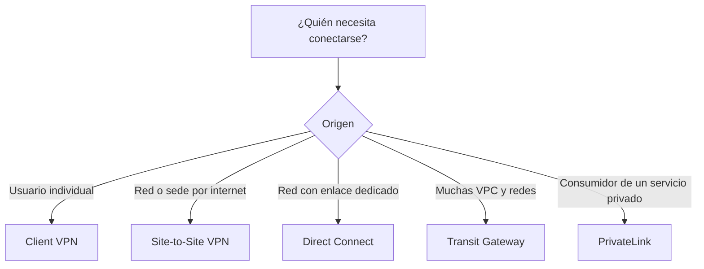
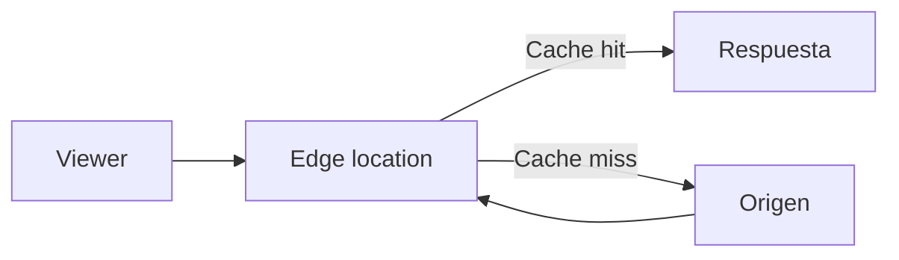
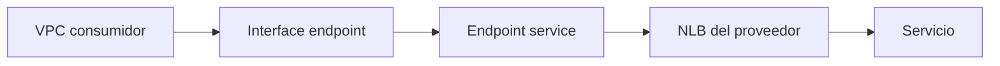
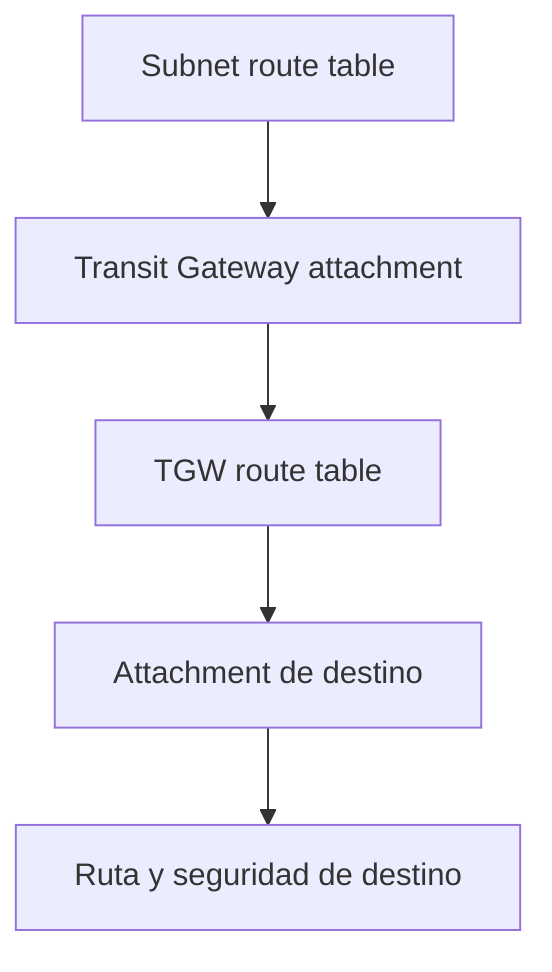
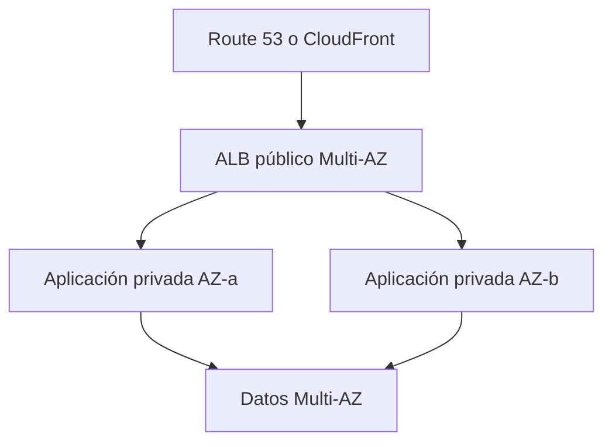

# Redes y entrega de contenido en AWS para el examen SAA-C03

## 1. Alcance necesario para el examen

Esta guía desarrolla únicamente los siguientes servicios de **Networking and Content Delivery**:

- AWS Client VPN
- Amazon CloudFront
- AWS Direct Connect
- Elastic Load Balancing - ELB
- AWS Global Accelerator
- AWS PrivateLink
- Amazon Route 53
- AWS Site-to-Site VPN
- AWS Transit Gateway
- Amazon VPC

El examen evalúa principalmente la capacidad de:

- Diseñar VPC, subnets, tablas de rutas y conectividad IPv4 e IPv6.
- Diferenciar security groups de network ACL.
- Publicar aplicaciones con balanceadores internos o expuestos a internet.
- Elegir entre CloudFront y Global Accelerator.
- Conectar usuarios, sedes, centros de datos, VPC y cuentas de AWS.
- Elegir entre VPN, Direct Connect, VPC peering, PrivateLink y Transit Gateway.
- Implementar DNS público, DNS privado, políticas de routing y failover.
- Diseñar arquitecturas Multi-AZ, híbridas y multirregión.
- Evitar rutas asimétricas, CIDR superpuestos y puntos únicos de falla.
- Optimizar costos de NAT Gateway, transferencia de datos, endpoints y conectividad híbrida.

> **Alcance:** otros servicios pueden aparecer como componentes de una solución -por ejemplo, AWS WAF, AWS Shield, AWS RAM, ACM o Amazon S3-, pero no se desarrollan como servicios principales en este capítulo.

---

## 2. Modelos fundamentales de red

### Servicios según la necesidad

| Necesidad | Servicio principal | Punto clave |
|---|---|---|
| Red virtual aislada en AWS | Amazon VPC | Subnets, rutas, seguridad y gateways |
| Acceso remoto de usuarios individuales | AWS Client VPN | VPN administrada basada en cliente |
| Conectar una sede por internet | AWS Site-to-Site VPN | Dos túneles IPsec por conexión |
| Conectividad privada dedicada con AWS | AWS Direct Connect | Rendimiento más consistente; no cifra por defecto |
| Conectar muchas VPC y redes híbridas | AWS Transit Gateway | Router regional hub-and-spoke y routing transitivo |
| Consumir un servicio de forma privada | AWS PrivateLink | Acceso privado unidireccional mediante endpoints |
| Distribuir contenido HTTP/HTTPS con caché | Amazon CloudFront | CDN global en ubicaciones de borde |
| Acelerar aplicaciones TCP/UDP globales | AWS Global Accelerator | IP anycast estáticas; no almacena contenido |
| Distribuir tráfico entre destinos saludables | Elastic Load Balancing | ALB, NLB o GWLB según la capa |
| DNS, registro de dominios y comprobaciones de salud | Amazon Route 53 | Políticas de routing basadas en DNS |

### Regla mental de conectividad

### Regla mental para aplicaciones globales

| Requisito dominante | Elegir |
|---|---|
| Contenido HTTP/HTTPS que puede almacenarse en caché | CloudFront |
| API o sitio HTTP/HTTPS que necesita CDN, protección de borde o funciones en el edge | CloudFront |
| TCP o UDP, IP estáticas globales o failover regional rápido | Global Accelerator |
| Selección del endpoint mediante DNS | Route 53 |
| Distribución regional entre instancias, IP, contenedores o funciones | ELB |

> **Trampa de examen:** estas opciones pueden complementarse. Route 53 puede dirigir un dominio a CloudFront, Global Accelerator o un load balancer; CloudFront puede utilizar un ALB como origen.

---

## 3. Conceptos de arquitectura que se deben dominar

### Región, zona de disponibilidad y edge

| Alcance | Ejemplos | Implicación |
|---|---|---|
| Regional | VPC, Transit Gateway, load balancers | La arquitectura debe habilitar varias AZ |
| Zonal | Subnet, ENI y algunos recursos de NAT | Una falla de AZ puede afectar el componente |
| Global | Route 53, CloudFront, Global Accelerator | Entrada global y selección de destino |
| Edge | Puntos de presencia de CloudFront y Global Accelerator | Menor distancia desde el cliente hacia la red de AWS |

### Plano de control y plano de datos

- El **plano de control** configura recursos: rutas, listeners, reglas DNS y asociaciones.
- El **plano de datos** transporta el tráfico real.
- Route 53 responde consultas DNS, pero no transporta ni actúa como proxy del tráfico de la aplicación.
- Transit Gateway y los gateways de VPC toman decisiones de forwarding según sus tablas de rutas.
- CloudFront y los load balancers sí reciben y reenvían solicitudes.

### CIDR y direccionamiento

- Una VPC recibe uno o más bloques CIDR IPv4 y, opcionalmente, IPv6.
- Cada subnet utiliza un subconjunto no superpuesto de los CIDR de la VPC.
- Las subnets no se extienden entre AZ.
- Se deben evitar CIDR superpuestos cuando se planea usar peering, Transit Gateway, VPN o Direct Connect.
- IPv4 privado no es enrutable directamente desde internet.
- Una dirección IPv4 pública o Elastic IP puede traducirse hacia una dirección privada mediante el internet gateway.
- Las direcciones IPv6 son globalmente únicas; la restricción de acceso depende de rutas y controles de seguridad, no de NAT.

### Selección de rutas

- Las rutas utilizan el criterio **longest prefix match**: gana la ruta más específica.
- Una ruta `/24` tiene prioridad sobre una ruta `/16` para direcciones incluidas en ambas.
- Una tabla de rutas de VPC contiene una ruta `local` para los CIDR de la VPC.
- Las rutas no conceden acceso por sí solas; security groups, NACL, firewalls y políticas también deben permitir el tráfico.
- El tráfico de retorno debe tener una ruta válida. Una arquitectura puede fallar aunque la ruta de ida sea correcta.

### Disponibilidad

- Distribuir recursos en al menos dos AZ evita que una sola AZ sea un punto único de falla.
- Un load balancer solo puede dirigir tráfico hacia targets que pasan sus health checks.
- Una conexión VPN tiene dos túneles, pero usar un único dispositivo físico del cliente mantiene un punto único de falla.
- Una única conexión Direct Connect sigue siendo un punto único de falla.
- Para failover regional se deben combinar componentes regionales con Route 53, Global Accelerator, CloudFront u otra estrategia multirregión.

---

## 4. AWS Client VPN

AWS Client VPN proporciona acceso remoto administrado y seguro para usuarios individuales hacia recursos de AWS y redes conectadas. Utiliza clientes compatibles con OpenVPN.

### Componentes

| Componente | Función |
|---|---|
| Client VPN endpoint | Punto administrado donde terminan las sesiones VPN |
| Client CIDR | Rango de direcciones asignado a los clientes; no debe superponerse con redes de destino |
| Target network association | Asociación del endpoint con una subnet de la VPC |
| Route table del endpoint | Determina las redes a las que puede enviarse tráfico |
| Authorization rule | Determina qué usuarios o grupos pueden acceder a cada red |
| Security group | Controla el tráfico entre clientes y recursos |
| Connection log | Registra intentos y sesiones de conexión |

### Autenticación y autorización

La autenticación comprueba la identidad; la autorización determina los destinos permitidos.

| Mecanismo | Uso |
|---|---|
| Mutual authentication | Certificados de cliente y servidor |
| Active Directory authentication | Usuarios y grupos de un directorio compatible |
| Federated authentication | Proveedor de identidad SAML 2.0 |

- El certificado del servidor administrado con ACM debe estar en la misma región que el Client VPN endpoint.
- Las authorization rules pueden conceder acceso a todos los usuarios o a grupos específicos.
- Autorizar una red no crea automáticamente la ruta; normalmente se necesitan **ruta y regla de autorización**.
- Los security groups de la asociación y de los recursos continúan aplicándose.

### Split tunnel frente a full tunnel

| Modo | Tráfico enviado por la VPN | Elegir cuando |
|---|---|---|
| Split tunnel | Solo los destinos definidos en las rutas del endpoint | Se quiere reducir ancho de banda y mantener el acceso local a internet |
| Full tunnel | Todo el tráfico del cliente | La organización necesita inspeccionar o controlar también la navegación a internet |

Con split tunnel, al modificar rutas puede ser necesario restablecer sesiones para que los clientes reciban la configuración actualizada. **Client Route Enforcement** ayuda a imponer las rutas definidas por el administrador.

### Alta disponibilidad

- Se debe asociar al menos una target network para que los clientes accedan a recursos.
- Para tolerancia a fallas se asocian subnets de varias AZ.
- Solo se puede asociar una subnet por AZ con el mismo endpoint.
- Las redes y reglas necesarias deben estar disponibles de forma coherente para las asociaciones.

### Casos de uso

- Administradores que acceden de forma remota a instancias privadas.
- Personal que necesita entrar a aplicaciones internas.
- Usuarios remotos que deben alcanzar una red local conectada a la VPC.
- Acceso temporal sin desplegar appliances VPN.

### Cuándo no elegirlo

- Para conectar de forma permanente una oficina completa → Site-to-Site VPN o Direct Connect.
- Para conectar muchas VPC entre sí → Transit Gateway.
- Para publicar una aplicación a usuarios externos sin otorgar acceso de red → ALB, CloudFront, API pública o PrivateLink según el caso.

> **Regla de examen:** Client VPN conecta **personas y dispositivos cliente**. Site-to-Site VPN conecta **redes**.

---

## 5. Amazon CloudFront

Amazon CloudFront es una red de entrega de contenido -CDN- que distribuye contenido HTTP/HTTPS desde ubicaciones de borde. Reduce latencia, descarga solicitudes del origen y puede proteger la aplicación en el edge.

### Flujo de una solicitud

### Componentes

| Componente | Función |
|---|---|
| Distribution | Configuración global de CloudFront |
| Origin | Fuente del contenido: S3, ALB, endpoint HTTP u otro origen compatible |
| Cache behavior | Regla por patrón de ruta que selecciona origen, protocolos y políticas |
| Cache policy | Define TTL y qué headers, cookies y query strings forman la cache key |
| Origin request policy | Envía valores adicionales al origen sin incluirlos necesariamente en la cache key |
| Response headers policy | Agrega o modifica headers de respuesta, incluidos CORS y seguridad |
| Edge location | Punto de presencia que atiende al viewer |

### Cache key y origin request

- La **cache key** identifica una variante almacenada.
- Incluir demasiados headers, cookies o query strings reduce el cache hit ratio.
- Todo valor incluido en la cache key también se envía al origen.
- Una **origin request policy** permite reenviar valores necesarios sin fragmentar la caché.
- Para contenido dinámico se pueden desactivar o reducir los TTL, pero CloudFront aún aporta conexión global, TLS y protección de borde.

### Expiración y actualización

- Los headers `Cache-Control` y `Expires` del origen pueden controlar la vigencia dentro de los límites de la cache policy.
- TTL más largo mejora el cache hit ratio y reduce carga y costo en el origen.
- Un contenido obsoleto puede retirarse mediante una **invalidation**.
- Utilizar nombres versionados -por ejemplo, `app.20260728.js`- suele ser más predecible y evita invalidaciones repetidas.

### Orígenes S3 privados

**Origin Access Control - OAC** es la opción recomendada para que CloudFront lea un bucket S3 privado:

- El bucket puede mantener Block Public Access.
- La bucket policy autoriza únicamente a la distribución de CloudFront.
- OAC admite escenarios con SSE-KMS cuando también se configura la key policy.
- Es la opción moderna frente a Origin Access Identity -OAI.

> **Trampa de examen:** un endpoint de **S3 static website hosting** se configura como custom origin y debe ser accesible como sitio web; no admite OAC. Si se quiere un bucket privado, se utiliza el endpoint normal de S3 con OAC.

### Contenido privado

| Opción | Elegir cuando |
|---|---|
| Signed URL | Se protege un archivo o un conjunto pequeño y cada URL puede llevar autorización |
| Signed cookie | Se protegen múltiples archivos o no se desea modificar cada URL |

- Se prefieren **trusted key groups** para administrar las claves de firma.
- El viewer obtiene una URL o cookie con restricciones como expiración y, opcionalmente, rango IP.
- OAC protege el salto CloudFront → S3; signed URLs y cookies protegen el acceso viewer → CloudFront.

### Protocolos, certificados y seguridad

- Viewer Protocol Policy puede permitir HTTP/HTTPS o redirigir HTTP hacia HTTPS.
- Origin Protocol Policy controla cómo CloudFront se comunica con un custom origin.
- El certificado ACM usado por una distribución CloudFront debe solicitarse o importarse en `us-east-1`.
- Un certificado utilizado directamente por un ALB origen se encuentra en la región del ALB.
- CloudFront se integra con AWS WAF y AWS Shield para protección de capa 7 y DDoS.
- Los access logs estándar y los real-time logs permiten análisis y auditoría.

### Origin failover

- Un origin group tiene un origen primario y otro secundario.
- CloudFront usa el secundario ante determinados códigos de error o fallas configuradas.
- El failover se aplica a `GET`, `HEAD` y `OPTIONS`.
- No se debe asumir failover para escrituras como `POST` o `PUT`.

### Funciones en el edge

| Característica | CloudFront Functions | Lambda@Edge |
|---|---|---|
| Eventos | Viewer request y viewer response | Viewer y origin request/response |
| Ejecución | Muy ligera y de gran escala | Más tiempo, memoria y capacidades |
| Cuerpo de la solicitud | No | Disponible en eventos compatibles |
| Uso típico | Redirects, headers, normalización y manipulación de URL | Lógica avanzada, autenticación o personalización cercana al origen |

### Origin Shield

- Agrega una capa de caché regional adicional delante del origen.
- Puede aumentar el cache hit ratio consolidado y reducir solicitudes al origen.
- Es útil cuando muchas ubicaciones de borde solicitan el mismo contenido.
- Introduce un costo adicional que debe justificarse por la reducción de carga y transferencia.

### Casos de examen

- Sitio estático global con S3 privado → CloudFront + OAC.
- Videos, imágenes y archivos descargables → CloudFront con TTL apropiado.
- API global HTTP/HTTPS → CloudFront, incluso con caché mínima o desactivada.
- Acceso privado a archivos premium → signed URLs o signed cookies.
- Protección de una aplicación web global → CloudFront + WAF.

> **Regla de examen:** CloudFront entiende HTTP/HTTPS y puede almacenar contenido en caché. Global Accelerator optimiza rutas TCP/UDP y no mantiene una caché.

---

## 6. AWS Direct Connect

AWS Direct Connect establece conectividad privada dedicada desde una red del cliente hacia AWS. Evita que el tráfico dependa del camino normal por internet y ofrece rendimiento más consistente.

### Cuándo elegirlo

- Transferencias grandes y constantes entre un centro de datos y AWS.
- Latencia y throughput más predecibles que una VPN por internet.
- Arquitecturas híbridas permanentes.
- Acceso privado a VPC o acceso a endpoints públicos de servicios AWS, según el tipo de VIF.

### Conexiones

| Tipo | Característica |
|---|---|
| Dedicated connection | Puerto físico dedicado al cliente en una ubicación Direct Connect |
| Hosted connection | Capacidad proporcionada por un Direct Connect Partner |

La provisión requiere coordinación física o con un partner, por lo que no suele ser la solución de conectividad inmediata.

### Virtual interfaces

| VIF | Destino | Asociación habitual |
|---|---|---|
| Private VIF | Direcciones privadas dentro de una o más VPC | Virtual private gateway o Direct Connect gateway |
| Public VIF | Endpoints públicos de servicios AWS | Prefijos públicos anunciados por AWS |
| Transit VIF | VPC conectadas a Transit Gateway | Direct Connect gateway asociado con Transit Gateway |

- Cada VIF utiliza una VLAN y una sesión BGP.
- Una public VIF no convierte el acceso a servicios públicos en PrivateLink; alcanza prefijos públicos de AWS sin usar el internet público como camino normal.
- Una transit VIF es la opción diseñada para integrar Direct Connect con Transit Gateway.

### Direct Connect gateway

- Permite asociar conectividad Direct Connect con virtual private gateways o Transit Gateway según el diseño.
- Facilita el acceso a múltiples VPC y regiones sin crear una private VIF independiente por cada VPC.
- No reemplaza las tablas de rutas ni resuelve CIDR superpuestos.
- Se deben revisar los prefijos permitidos y las asociaciones para controlar qué rutas se anuncian.

### Cifrado

> **Trampa de examen:** Direct Connect proporciona una ruta privada dedicada, pero **no cifra el tráfico por defecto**.

Opciones de cifrado:

- TLS a nivel de aplicación o del servicio.
- MACsec en conexiones dedicadas y puertos compatibles.
- Una VPN IPsec sobre conectividad compatible cuando se necesita cifrado de red.

### Resiliencia

| Diseño | Protección |
|---|---|
| Una conexión | Sin redundancia; punto único de falla |
| Dos conexiones en una ubicación | Protege frente a falla de conexión o dispositivo, no frente a pérdida de ubicación |
| Conexiones en dos ubicaciones | Protege frente a falla de una ubicación Direct Connect |
| Direct Connect + Site-to-Site VPN | VPN como respaldo o conectividad temporal |

- Se utiliza BGP para intercambiar rutas y ajustar preferencia de caminos.
- Para máxima resiliencia se usan conexiones separadas, dispositivos separados y más de una ubicación.
- El **Direct Connect Resiliency Toolkit** ayuda a crear y probar diseños de redundancia.
- La redundancia del enlace no sustituye la redundancia de routers y circuitos en las instalaciones del cliente.

### Costos

- Horas de puerto o capacidad de conexión.
- Transferencia de datos saliente.
- Tarifas del partner o proveedor del circuito.
- Equipos, cross-connect y conectividad hasta la ubicación Direct Connect.

> **Regla de examen:** VPN = despliegue rápido y cifrado por internet. Direct Connect = enlace dedicado y rendimiento consistente. Una solución crítica puede utilizar ambos.

---

## 7. Elastic Load Balancing - ELB

Elastic Load Balancing distribuye tráfico entre targets saludables en una o varias AZ. Se integra con Auto Scaling y realiza health checks antes de enviar tráfico.

### Tipos de load balancer

| Tipo | Capa y protocolos | Routing | Targets principales | Elegir cuando |
|---|---|---|---|---|
| Application Load Balancer - ALB | Capa 7: HTTP, HTTPS, WebSocket y gRPC | Host, path, headers, query string y método | Instancias, IP y Lambda | Aplicaciones web, microservicios y routing avanzado |
| Network Load Balancer - NLB | Capa 4: TCP, UDP y TLS | IP y puerto | Instancias, IP y ALB | Rendimiento extremo, baja latencia, IP estáticas o protocolos no HTTP |
| Gateway Load Balancer - GWLB | Capa 3 con GENEVE | Flujo transparente | Appliances virtuales | Firewalls, IDS/IPS e inspección centralizada |
| Classic Load Balancer - CLB | Generación anterior | Funciones básicas L4/L7 | Instancias | Cargas heredadas; no es la elección habitual para diseños nuevos |

### Componentes comunes

| Componente | Función |
|---|---|
| Load balancer | Punto de entrada distribuido |
| Listener | Protocolo y puerto de entrada |
| Listener rule | Condición y acción, especialmente en ALB |
| Target group | Conjunto lógico de destinos |
| Health check | Determina qué targets pueden recibir tráfico |
| Subnet/AZ habilitada | Ubicación donde ELB tiene capacidad para recibir tráfico |

### Application Load Balancer

- Permite múltiples servicios detrás de un mismo load balancer.
- Las reglas se evalúan por prioridad y terminan con una default rule.
- Puede dirigir `/api/*` a un target group y `/images/*` a otro.
- Puede dirigir `admin.example.com` y `shop.example.com` hacia aplicaciones distintas.
- Soporta redirects, fixed responses y autenticación compatible.
- Puede terminar TLS utilizando certificados de ACM.
- Se integra directamente con AWS WAF.
- Un ALB es accedido mediante DNS; no se deben codificar sus direcciones IP cambiantes.

### Network Load Balancer

- Trabaja principalmente en la capa de transporte.
- Proporciona una dirección IP estática por AZ habilitada y puede usar Elastic IP en un NLB internet-facing.
- Puede preservar la dirección IP de origen en configuraciones compatibles.
- Admite listeners TCP, UDP y TLS, y puede terminar TLS.
- Es una opción común como front end de un endpoint service de PrivateLink.
- Puede utilizar un ALB como target para combinar IP estáticas y rendimiento L4 con routing L7.
- Un NLB creado sin security groups no puede recibir security groups posteriormente; si se crean asociados, pueden administrarse después.

### Gateway Load Balancer

- Inserta appliances de red de forma transparente en el camino del tráfico.
- Utiliza GENEVE por el puerto `6081`.
- Combina un gateway de red con distribución y health checks.
- Los consumidores se conectan mediante Gateway Load Balancer endpoints.
- Se utiliza para escalar flotas de firewalls, sistemas IDS/IPS y appliances de inspección.

### Internet-facing frente a internal

| Esquema | Direcciones | Uso |
|---|---|---|
| Internet-facing | Nodos con direcciones públicas y resolución pública | Aplicaciones accesibles desde internet |
| Internal | Direcciones privadas | Aplicaciones internas, capas de backend y servicios privados |

Un internet-facing load balancer puede enviar tráfico a targets con direcciones privadas. Las instancias backend no necesitan direcciones públicas.

### Health checks y disponibilidad

- Los health checks se configuran en el target group.
- Un target puede estar ejecutándose y aun así no estar saludable para ELB.
- Se deben habilitar varias AZ y desplegar targets saludables en ellas.
- ELB no repara una aplicación; deja de dirigir tráfico al target defectuoso.
- Auto Scaling puede reemplazar instancias declaradas no saludables por ELB.
- **Connection draining/deregistration delay** permite completar conexiones en curso antes de retirar un target.

### Cross-zone load balancing

- Con cross-zone, cada nodo puede distribuir tráfico entre targets de todas las AZ habilitadas.
- ALB utiliza cross-zone a nivel del load balancer.
- En NLB puede habilitarse según la necesidad.
- Se deben evaluar los cargos de transferencia y la simetría zonal, además de la distribución de targets.

### TLS

- El listener HTTPS/TLS presenta un certificado al cliente.
- ALB puede elegir certificados mediante SNI para múltiples dominios.
- Si ELB termina TLS y se comunica por HTTP con el target, el cifrado termina en el load balancer.
- Para cifrado end-to-end se configura HTTPS/TLS también hacia los targets cuando el tipo de balanceador lo permite.

### Casos de examen

- Routing por path o host → ALB.
- Lambda detrás de un balanceador → ALB.
- TCP/UDP, IP estática o altísimo rendimiento → NLB.
- Flota escalable de appliances → GWLB.
- Backends privados expuestos a internet mediante un único punto administrado → internet-facing ALB o NLB.

> **Trampa de examen:** ELB distribuye tráfico dentro de una región. No reemplaza por sí solo el routing global multirregión de Route 53, CloudFront o Global Accelerator.

---

## 8. AWS Global Accelerator

AWS Global Accelerator mejora la disponibilidad y el rendimiento de aplicaciones globales dirigiendo tráfico hacia endpoints regionales saludables a través de la red global de AWS.

### Características

- Proporciona IP anycast estáticas como punto de entrada global.
- Un accelerator IPv4 proporciona dos direcciones IPv4 estáticas.
- Un accelerator dual-stack proporciona direcciones IPv4 e IPv6 estáticas.
- Acepta tráfico TCP y UDP mediante listeners.
- Enruta el tráfico al edge cercano y luego utiliza la red de AWS hacia el endpoint.
- Supervisa la salud y desvía conexiones nuevas de endpoints o regiones no saludables.
- No depende exclusivamente de cambios DNS para hacer failover.
- No almacena respuestas en caché.

### Componentes de un standard accelerator

| Componente | Función |
|---|---|
| Accelerator | Recurso global con IP anycast |
| Listener | Puertos y protocolos TCP/UDP aceptados |
| Endpoint group | Grupo regional de endpoints |
| Endpoint | ALB, NLB, instancia EC2 o Elastic IP compatible |
| Health check | Determina disponibilidad del endpoint |

### Controles de tráfico

- **Traffic dial:** controla qué porcentaje del tráfico ya asignado a un endpoint group regional se envía a esa región.
- **Endpoint weight:** distribuye tráfico entre endpoints del mismo endpoint group.
- Permiten despliegues graduales, migraciones y reducción controlada de tráfico.
- La client affinity puede mantener clientes en un endpoint cuando el caso lo necesita, pero reduce libertad de distribución.

### Standard frente a custom routing

| Tipo | Comportamiento | Uso |
|---|---|---|
| Standard accelerator | Selecciona un endpoint regional saludable y óptimo | Aplicaciones web, APIs, gaming y servicios TCP/UDP |
| Custom routing accelerator | Mapea puertos de entrada hacia destinos EC2 específicos | Aplicaciones que necesitan asignación determinista de sesiones, como determinados juegos o comunicaciones |

### CloudFront frente a Global Accelerator

| Característica | CloudFront | Global Accelerator |
|---|---|---|
| Protocolos | HTTP/HTTPS | TCP/UDP |
| Caché | Sí | No |
| IP anycast estáticas | No como requisito principal | Sí |
| Orígenes/endpoints | S3, ALB y HTTP, entre otros | ALB, NLB, EC2 y Elastic IP |
| Lógica de borde | Functions y Lambda@Edge | No |
| Uso principal | CDN y aplicaciones web | Aceleración de red y failover rápido |

### Casos de examen

- Usuarios globales acceden a una aplicación TCP/UDP → Global Accelerator.
- Clientes o firewalls exigen allowlist de IP fijas globales → Global Accelerator.
- Aplicación multirregión necesita failover rápido sin esperar expiración DNS → Global Accelerator.
- Contenido estático cacheable → CloudFront.
- Selección simple por DNS con menor costo → Route 53 puede ser suficiente.

> **Trampa de examen:** Global Accelerator no sustituye un load balancer regional. Frecuentemente utiliza ALB o NLB como endpoint.

---

## 9. AWS PrivateLink

AWS PrivateLink permite acceder de forma privada a servicios mediante direcciones IP privadas, sin exponer el tráfico a internet y sin requerir conectividad de red completa entre productor y consumidor.

### Modelo de proveedor y consumidor

### Interface endpoint

- Crea una o más ENI con direcciones privadas en subnets seleccionadas.
- Se asocian security groups al endpoint.
- Proporciona nombres DNS regionales y zonales.
- Con **private DNS**, el nombre público habitual de un servicio AWS compatible puede resolverse hacia las IP privadas del endpoint.
- Para private DNS, la VPC debe tener habilitados DNS resolution y DNS hostnames.
- Una endpoint policy agrega una capa de control, pero no reemplaza IAM ni las resource policies del servicio.

### Endpoint service

- El proveedor crea un endpoint service normalmente respaldado por un NLB.
- Define los principals autorizados a solicitar conexión.
- Puede aceptar conexiones automáticamente o requerir aprobación manual.
- El consumidor crea un interface endpoint y solicita conexión.
- Para ofrecer un nombre DNS privado propio se debe verificar la propiedad del dominio.

### Propiedades de arquitectura

- El consumidor inicia conexiones hacia el servicio; no se crea una red bidireccional general.
- Las tablas de rutas de ambas VPC no se unen.
- Es útil cuando existen CIDR superpuestos.
- Evita crear una malla completa de VPC peering.
- No habilita routing transitivo.
- Se debe desplegar el endpoint en las AZ necesarias para disponibilidad y para evitar transferencia entre AZ.
- PrivateLink admite escenarios cross-Region compatibles, pero no se debe asumir que implementa por sí solo el failover de la aplicación entre regiones.

### Tipos de VPC endpoint relacionados

| Tipo | SAA-C03-Services/destino | Implementación | Costo habitual |
|---|---|---|---|
| Interface endpoint | Servicios AWS compatibles, servicios de partners o propios | ENI con IP privada; usa PrivateLink | Hora por AZ y procesamiento de datos |
| Gateway endpoint | Amazon S3 y DynamoDB | Ruta hacia una prefix list en la tabla de rutas | Sin tarifa por hora del endpoint |
| Gateway Load Balancer endpoint | Appliances detrás de GWLB | Inserción transparente en la ruta | Hora y procesamiento |

> **Trampa de examen:** los gateway endpoints de S3 y DynamoDB no utilizan PrivateLink. Son regionales, se integran con tablas de rutas y normalmente son la opción de menor costo para acceso desde una VPC.

### Gateway endpoint frente a interface endpoint para S3

| Necesidad | Elegir |
|---|---|
| Acceso desde recursos de la misma VPC, con tabla de rutas compatible y menor costo | Gateway endpoint |
| Acceso privado desde on-premises, otra VPC o topología que necesita IP/DNS privado del endpoint | Interface endpoint |

Un gateway endpoint no puede extenderse directamente a través de peering, Transit Gateway, VPN o Direct Connect. Para esos consumidores se evalúa un interface endpoint o un diseño DNS/routing alternativo compatible.

### PrivateLink frente a VPC peering

| PrivateLink | VPC peering |
|---|---|
| Expone un servicio específico | Conecta redes completas mediante rutas |
| Acceso iniciado por el consumidor | Comunicación privada bidireccional según rutas y seguridad |
| Tolera CIDR superpuestos en muchos diseños | No admite CIDR superpuestos |
| No comparte toda la red del proveedor | Proporciona alcance a los CIDR enrutados |
| Escala bien para muchos consumidores de un servicio | Requiere administrar cada relación de peering |

### Casos de examen

- SaaS privado ofrecido a muchas cuentas → endpoint service + NLB.
- Acceso privado a un servicio AWS sin NAT ni internet gateway → interface endpoint.
- Compartir una API interna sin compartir toda la VPC → PrivateLink.
- Redes con CIDR superpuestos que consumen un servicio central → PrivateLink.

---

## 10. Amazon Route 53

Amazon Route 53 proporciona DNS autoritativo, registro de dominios y health checks. Su nombre hace referencia al puerto 53 usado por DNS.

### Funciones principales

- Registrar y administrar dominios.
- Crear public hosted zones para resolución desde internet.
- Crear private hosted zones para resolución dentro de VPC asociadas.
- Enrutar nombres hacia recursos AWS o endpoints externos.
- Realizar health checks y DNS failover.
- Resolver nombres entre VPC y redes híbridas mediante Route 53 Resolver.

### Registros alias frente a CNAME

| Característica | Alias | CNAME |
|---|---|---|
| Extensión de Route 53 | Sí | No; registro DNS estándar |
| Puede usarse en zone apex | Sí, para destinos compatibles | No |
| Destinos AWS seleccionados | Sí | Puede apuntar a nombres, pero sin semántica alias |
| Evaluate Target Health | Disponible en configuraciones compatibles | No como función de CNAME |
| Costo de consulta hacia determinados recursos AWS | Generalmente sin cargo de consulta alias | Consulta DNS normal |

- Un registro alias puede apuntar a un load balancer, una distribución CloudFront, otro registro de la misma hosted zone y otros recursos compatibles.
- No se debe crear un CNAME en el apex, como `example.com`.
- Para un ALB suele utilizarse un registro alias `A` y, si corresponde, `AAAA`.

### Políticas de routing

| Política | Selección | Uso típico |
|---|---|---|
| Simple | Uno o varios valores sin lógica especial | Un único recurso o respuesta básica |
| Weighted | Proporción configurada por peso | Canary, blue/green y reparto gradual |
| Latency | Región con menor latencia estimada para el usuario | Aplicación multirregión |
| Failover | Recurso primario o secundario según health check | Active-passive |
| Geolocation | Ubicación geográfica del usuario | Localización, cumplimiento y contenido regional |
| Geoproximity | Ubicación de recursos y usuarios, ajustada con bias | Mover frontera de tráfico entre regiones |
| IP-based | CIDR de origen de la consulta | Routing según rangos de red conocidos |
| Multivalue answer | Hasta ocho respuestas saludables seleccionadas aleatoriamente | Disponibilidad DNS básica para varios endpoints |

> **Trampa de examen:** multivalue answer no reemplaza un load balancer. Route 53 responde DNS y no comprueba cada solicitud o conexión.

### Health checks

| Tipo | Evalúa |
|---|---|
| Endpoint | Dirección IP o nombre público mediante HTTP, HTTPS o TCP |
| Calculated | Estado combinado de otros health checks |
| CloudWatch alarm | Estado de una métrica o condición supervisada por CloudWatch |

- Los health checkers públicos no pueden conectarse directamente a endpoints privados.
- Para un recurso privado se puede publicar una métrica y utilizar un health check basado en una alarma de CloudWatch.
- Los health checks tienen costo y deben desplegarse solo cuando aportan una decisión de routing.
- **Evaluate Target Health** permite que un alias herede el estado de determinados destinos AWS.

### TTL y failover

- DNS se almacena en caché en resolvers y clientes durante el TTL.
- Un TTL corto acelera la adopción de cambios, pero aumenta consultas y costo.
- Un TTL largo reduce consultas, pero prolonga el uso de una respuesta anterior.
- Un health check defectuoso no garantiza conmutación instantánea: se deben considerar intervalos de comprobación, umbral de falla y caché DNS.

### Public y private hosted zones

| Hosted zone | Resolución | Uso |
|---|---|---|
| Public | Internet | Sitios, APIs y servicios públicos |
| Private | VPC asociadas | Nombres internos y service discovery privado |

- Una private hosted zone puede asociarse con VPC autorizadas, incluso en más de una cuenta mediante el procedimiento correspondiente.
- Si existen zonas pública y privada con el mismo nombre, los resolvers dentro de la VPC utilizan la privada para ese namespace.
- Un registro ausente en la private hosted zone no produce automáticamente fallback hacia la zona pública del mismo nombre.

### Route 53 Resolver híbrido

| Endpoint | Dirección de consulta | Uso |
|---|---|---|
| Inbound Resolver endpoint | On-premises → VPC | Resolver private hosted zones y nombres privados de AWS |
| Outbound Resolver endpoint | VPC → on-premises | Reenviar dominios específicos a DNS local |

- Las Resolver rules determinan qué dominios se reenvían.
- Se despliegan direcciones de endpoint en varias AZ para alta disponibilidad.
- El camino de red -VPN o Direct Connect- y los security groups deben permitir DNS TCP/UDP 53.
- No se debe reenviar todo DNS indiscriminadamente si solo se requieren dominios específicos.

### Casos de examen

- Dominio raíz hacia un ALB → alias record.
- Active-passive entre regiones → failover policy + health check.
- Reparto 90/10 de una versión nueva → weighted policy.
- Atender desde la región con menor latencia → latency policy.
- Respuestas diferentes por país → geolocation.
- DNS privado desde on-premises → inbound Resolver endpoint.
- Resolver un dominio corporativo desde AWS → outbound Resolver endpoint + forwarding rule.

---

## 11. AWS Site-to-Site VPN

AWS Site-to-Site VPN conecta una red del cliente con una VPC o Transit Gateway mediante túneles IPsec cifrados, normalmente a través de internet.

### Componentes

| Componente | Función |
|---|---|
| Customer gateway device | Router o appliance físico/virtual del cliente |
| Customer gateway resource | Representación en AWS del dispositivo del cliente |
| Virtual private gateway - VGW | Terminación VPN asociada a una VPC |
| Transit Gateway - TGW | Hub regional que puede terminar conexiones VPN para muchas VPC |
| VPN connection | Relación IPsec que contiene dos túneles |

### Dos túneles

- Cada VPN connection proporciona dos túneles con endpoints AWS distintos.
- Se deben configurar ambos túneles en el dispositivo del cliente.
- AWS puede realizar mantenimiento o reemplazar un endpoint, por lo que depender de un solo túnel produce interrupciones evitables.
- Dos túneles hacia un único dispositivo no protegen frente a la falla física de ese dispositivo.
- Para mayor resiliencia se utilizan dispositivos de cliente separados y conexiones VPN redundantes.

### Routing estático y dinámico

| Tipo | Característica | Elegir cuando |
|---|---|---|
| Static routing | Se configuran prefijos manualmente | Dispositivo sin BGP o topología muy simple |
| Dynamic routing | BGP intercambia rutas y detecta cambios | Topologías complejas, redundancia y preferencia automática |

- Una conexión utiliza routing estático o dinámico; no ambos simultáneamente.
- Con VGW se puede habilitar route propagation en las tablas de rutas de VPC.
- Se debe conocer la prioridad entre rutas estáticas, propagadas y longest prefix match.
- Transit Gateway permite políticas de routing más flexibles y ECMP en diseños compatibles.

### VGW frente a TGW como terminación

| Virtual private gateway | Transit Gateway |
|---|---|
| Se asocia a una VPC | Conecta múltiples VPC y redes |
| Diseño simple | Hub-and-spoke y segmentación |
| No proporciona ECMP VPN | Puede usar ECMP para aumentar throughput en conexiones compatibles |
| Menor complejidad | Más costo y control centralizado |

### Rendimiento y disponibilidad

- El rendimiento depende de internet, del dispositivo, del cifrado, del número de flujos y de cuotas.
- BGP puede preferir un túnel y mantener otro como respaldo.
- Con Transit Gateway y ECMP se pueden aprovechar túneles o conexiones paralelas compatibles.
- **Accelerated Site-to-Site VPN** utiliza Global Accelerator para mejorar el camino hasta AWS y requiere Transit Gateway.
- Para ancho de banda constante y alto se considera Direct Connect.

### Casos de examen

- Conectar rápidamente una oficina a una VPC → Site-to-Site VPN.
- Cifrado IPsec obligatorio y volumen moderado → VPN.
- Conectividad temporal mientras se instala Direct Connect → VPN.
- Muchas VPC con routing centralizado → VPN terminada en Transit Gateway.
- Requisito de conexión dedicada y rendimiento predecible → Direct Connect, posiblemente con VPN como respaldo.

> **Regla de examen:** dos túneles son necesarios, pero la alta disponibilidad completa también requiere eliminar el punto único de falla en las instalaciones del cliente.

---

## 12. AWS Transit Gateway

AWS Transit Gateway es un router virtual regional administrado que conecta VPC y redes híbridas mediante un modelo hub-and-spoke.

### Attachments

Un Transit Gateway puede utilizar attachments para:

- VPC.
- Site-to-Site VPN.
- Peering con otro Transit Gateway.
- AWS Direct Connect mediante Direct Connect gateway y transit VIF.
- Transit Gateway Connect para appliances SD-WAN compatibles.

### Route tables

- Cada attachment se **asocia** con una tabla de rutas de Transit Gateway; esa tabla se consulta para el tráfico que entra por el attachment.
- Un attachment puede **propagar** sus rutas hacia una o varias tablas.
- Asociación y propagación son conceptos distintos.
- Una ruta estática puede enviar tráfico hacia un attachment específico.
- Una blackhole route descarta tráfico de forma intencional.
- Las tablas múltiples permiten separar producción, desarrollo, redes compartidas y perímetros.

### Flujo de routing

Para una comunicación correcta se requiere:

1. Una ruta en la subnet de origen hacia Transit Gateway.
2. Una ruta en la tabla de Transit Gateway hacia el attachment de destino.
3. Una ruta de retorno equivalente.
4. Security groups, NACL y firewalls que permitan el flujo.

### Segmentación

Ejemplo:

- Attachments de producción asociados a una tabla que alcanza servicios compartidos y perímetro.
- Attachments de desarrollo asociados a otra tabla sin ruta directa a producción.
- Una VPC de inspección conectada para controlar el tráfico entre segmentos.

Transit Gateway no concede acceso por el simple hecho de tener attachments. El acceso depende de asociaciones, propagaciones, rutas y seguridad.

### Propiedades importantes

- Es regional y altamente disponible por diseño.
- Admite routing transitivo: A puede alcanzar C mediante el hub si las rutas lo permiten.
- No admite conectividad útil entre VPC con CIDR superpuestos.
- Se comparte entre cuentas mediante AWS Resource Access Manager.
- Un Transit Gateway peering puede conectar regiones a través de la red global de AWS.
- Las rutas sobre un peering de Transit Gateway se configuran estáticamente.
- El tráfico de peering interregional está cifrado en la red de AWS.

### Appliance mode

- Se utiliza cuando el tráfico atraviesa un appliance con estado, como un firewall.
- Mantiene el flujo por una AZ coherente para conservar simetría.
- Sin un diseño correcto, ida y retorno pueden atravesar appliances o AZ distintos y romper sesiones.
- Se debe combinar con rutas y subnets de inspección adecuadas.

### Transit Gateway frente a VPC peering

| Transit Gateway | VPC peering |
|---|---|
| Hub-and-spoke | Conexión uno a uno |
| Routing transitivo | No transitivo |
| Administración centralizada | Rutas por cada relación |
| Mejor para muchas VPC | Conveniente para pocas VPC |
| Cobra attachments y datos procesados | No cobra por la relación, pero sí transferencia |
| Segmentación con varias route tables | Segmentación distribuida |

### Casos de examen

- Decenas o cientos de VPC necesitan conectividad central → Transit Gateway.
- Varias cuentas comparten red híbrida → Transit Gateway compartido mediante RAM.
- Se requiere routing transitivo → Transit Gateway.
- Se necesita inspección central de tráfico → Transit Gateway + arquitectura de appliances.
- Solo dos VPC necesitan comunicación directa y de bajo costo → VPC peering puede ser más simple.

---

## 13. Amazon VPC

Amazon Virtual Private Cloud permite crear una red virtual lógicamente aislada en una región de AWS. Es la base de la mayoría de arquitecturas de red del examen.

### Componentes esenciales

| Componente | Alcance | Función |
|---|---|---|
| VPC | Regional | Contenedor de red aislado |
| Subnet | Una AZ | Segmento de direcciones donde se crean recursos |
| Route table | VPC/subnet | Decide el siguiente salto por destino |
| Internet gateway - IGW | VPC | Conectividad IPv4/IPv6 con internet para recursos enrutables |
| NAT gateway | Zonal o regional según el tipo actual | Salida IPv4/NAT64 sin aceptar conexiones entrantes no solicitadas |
| Egress-only internet gateway | VPC | Salida IPv6 iniciada desde la VPC |
| Security group | ENI/recurso | Firewall stateful de allow rules |
| Network ACL - NACL | Subnet | Firewall stateless con allow y deny |
| VPC endpoint | VPC | Acceso privado a servicios |
| Elastic network interface - ENI | AZ | Interfaz virtual con direcciones y security groups |
| VPC Flow Logs | VPC, subnet o ENI | Metadatos de tráfico aceptado o rechazado |

### Diseño de CIDR

- Elegir rangos con espacio para crecimiento y sin superposición con otras VPC o redes locales.
- Se pueden agregar bloques CIDR secundarios compatibles.
- Cada subnet pertenece a un único CIDR y una única AZ.
- AWS reserva cinco direcciones IPv4 en cada subnet.
- CIDR pequeños desperdician una proporción mayor por las direcciones reservadas.
- IPv6 se diseña sin depender de NAT como mecanismo de seguridad.

### Subnet pública y privada

Una subnet no es pública por su nombre. Su clasificación depende de las rutas.

| Tipo | Ruta principal | Recurso IPv4 |
|---|---|---|
| Pública | `0.0.0.0/0` hacia internet gateway | Necesita IPv4 pública o Elastic IP para internet |
| Privada con salida | `0.0.0.0/0` hacia NAT gateway | Mantiene solo IPv4 privada |
| Aislada | Sin ruta por defecto hacia internet | Bases de datos o capas sin acceso directo |

> **Trampa de examen:** una ruta al internet gateway no basta. Para comunicación IPv4 por internet, el recurso también necesita una IPv4 pública o Elastic IP y reglas de seguridad adecuadas.

### Internet gateway

- Se adjunta a una VPC.
- Es horizontalmente escalable, redundante y altamente disponible.
- Permite comunicación IPv4 e IPv6 cuando existen rutas y direcciones válidas.
- Realiza la traducción lógica entre la IPv4 pública de una instancia y su IPv4 privada.
- No aplica NAT a IPv6.
- No reemplaza security groups ni NACL.

### NAT gateway

El patrón clásico usa un **public NAT gateway** en una subnet pública:

1. La subnet privada envía `0.0.0.0/0` al NAT gateway.
2. El NAT gateway utiliza una Elastic IP.
3. La subnet del NAT tiene ruta hacia el internet gateway.
4. La respuesta regresa por el mismo camino.

Características:

- Permite que instancias privadas inicien conexiones IPv4 hacia internet.
- No acepta conexiones entrantes no solicitadas desde internet.
- No se asocian security groups directamente al NAT gateway tradicional.
- Una NACL puede controlar la subnet donde se encuentra.
- En el diseño zonal clásico, se despliega un NAT gateway por AZ y las subnets privadas usan el NAT de su misma AZ para resiliencia y menor transferencia inter-AZ.
- AWS también ofrece **Regional NAT Gateway**, que simplifica determinados diseños actuales; para SAA-C03 se debe seguir dominando el patrón zonal por AZ y reconocer las restricciones del escenario.
- Un **private NAT gateway** traduce direcciones para conectividad privada mediante Transit Gateway o virtual private gateway; no proporciona salida a internet.

### IPv6 y egress-only internet gateway

- Una subnet con ruta `::/0` hacia internet gateway permite conectividad IPv6 si la seguridad la autoriza.
- Para permitir conexiones IPv6 salientes sin aceptar conexiones nuevas desde internet se utiliza un **egress-only internet gateway**.
- No se utiliza NAT gateway para ocultar direcciones IPv6.
- DNS64 y NAT64 mediante NAT gateway pueden permitir que workloads solo IPv6 alcancen destinos solo IPv4 en diseños compatibles.

### Route tables

- Cada subnet se asocia exactamente con una route table.
- Una route table puede asociarse con varias subnets.
- Si no se hace una asociación explícita, la subnet usa la main route table.
- La ruta `local` permite comunicación dentro de la VPC.
- Gana la ruta con el prefijo más específico.
- Una ruta puede apuntar a IGW, NAT gateway, Transit Gateway, peering, endpoint, ENI u otros destinos compatibles.
- Una ruta en estado `blackhole` apunta a un target ausente o no disponible y no transporta tráfico.

### Security groups y NACL

| Característica | Security group | Network ACL |
|---|---|---|
| Alcance | ENI o recurso | Subnet |
| Estado | Stateful | Stateless |
| Reglas | Solo allow | Allow y deny |
| Evaluación | Todas las reglas en conjunto | Número menor primero |
| Retorno | Permitido automáticamente para un flujo autorizado | Debe permitirse explícitamente |
| Referencia a otro SG | Sí, en condiciones compatibles | No |
| Uso | Control primario por workload | Capa adicional y bloqueo por CIDR |

#### Security groups

- No tienen reglas deny.
- Una respuesta a tráfico entrante permitido puede salir aunque no exista una regla outbound equivalente para ese flujo.
- Referenciar un security group no copia sus direcciones; permite tráfico desde ENI asociadas según el escenario.
- El security group del backend puede permitir solo tráfico proveniente del security group del ALB.
- Se aplica el principio de mínimo privilegio: puertos y orígenes específicos.

#### Network ACL

- Cada subnet debe estar asociada con una NACL.
- Las reglas inbound y outbound se evalúan por separado, empezando por el número más bajo.
- La primera coincidencia decide.
- Al ser stateless, se deben permitir puertos de retorno, incluidos los puertos efímeros.
- La default NACL permite tráfico; una custom NACL empieza denegando hasta agregar reglas.
- Es útil para bloquear CIDR concretos a nivel de subnet.

> **Trampa de examen:** si la solicitud sale pero la respuesta falla, revisar rutas de retorno, NACL outbound/inbound y puertos efímeros. Los security groups son stateful; las NACL no.

### VPC endpoints

- Evitan usar internet gateway o NAT para acceder a servicios compatibles.
- Un gateway endpoint es la opción común y sin tarifa horaria para S3 y DynamoDB desde la VPC.
- Un interface endpoint utiliza PrivateLink, ENI, security groups y DNS privado.
- Los endpoints reducen exposición y pueden evitar costos de NAT y transferencia.
- Endpoint policies, IAM y resource policies deben evaluarse conjuntamente.

### VPC peering

- Conecta dos VPC mediante direcciones privadas.
- Puede ser entre cuentas y entre regiones.
- Requiere rutas en ambos lados y reglas de seguridad.
- No admite CIDR superpuestos.
- No es transitivo: si A tiene peering con B y B con C, A no obtiene conectividad a C a través de B.
- No permite utilizar de forma transitiva el internet gateway, NAT, VPN o Direct Connect de la otra VPC.
- Para muchas VPC suele preferirse Transit Gateway.

### DNS en una VPC

- `enableDnsSupport` permite usar el resolver proporcionado por AWS.
- `enableDnsHostnames` permite asignar hostnames DNS públicos en condiciones compatibles.
- Private hosted zones proporcionan nombres internos.
- DHCP option sets controlan parámetros como servidores DNS y nombre de dominio.
- Para DNS híbrido se utilizan inbound y outbound Route 53 Resolver endpoints.

### VPC Flow Logs

- Capturan metadatos de tráfico IP en VPC, subnet o ENI.
- Pueden registrar tráfico aceptado, rechazado o ambos.
- Incluyen campos como origen, destino, puertos, protocolo, bytes y acción.
- No capturan el contenido completo de paquetes.
- Se publican en destinos compatibles como CloudWatch Logs o S3.
- Son útiles para diagnosticar NACL, security groups, rutas y comunicaciones inesperadas.
- No sustituyen packet capture ni logs de aplicación.

### Arquitectura Multi-AZ típica

Puntos de diseño:

- Subnets públicas separadas por AZ para componentes de entrada.
- Subnets privadas separadas por AZ para la aplicación.
- Datos en subnets aisladas o privadas según el servicio.
- Rutas y NAT diseñados por AZ o mediante la opción regional adecuada.
- Security groups referenciados entre capas.
- Health checks que validen la aplicación y no solo el puerto.

### Costos que se deben vigilar

- La VPC, route tables, internet gateway, security groups y NACL no tienen tarifa por hora por sí mismos.
- NAT Gateway cobra por hora y por GB procesado.
- Interface endpoints cobran por hora por AZ y por datos procesados.
- Transit Gateway cobra attachments y procesamiento.
- Las IPv4 públicas tienen costo.
- La transferencia entre AZ y regiones puede tener costo.
- VPC Flow Logs generan costos de entrega, almacenamiento y consulta de logs.

---

## 14. Seguridad, resiliencia y operaciones

### Defensa por capas

| Capa | Control |
|---|---|
| DNS y entrada global | Route 53 health checks, CloudFront o Global Accelerator |
| Borde | CloudFront, WAF, Shield y TLS |
| Entrada regional | ALB/NLB, listeners, certificados y health checks |
| Red | Rutas, segmentación de VPC y Transit Gateway |
| Subnet | Network ACL |
| Workload | Security groups |
| Servicio privado | PrivateLink, endpoint policies e IAM |
| Híbrido | BGP, túneles redundantes, cifrado y rutas |
| Observabilidad | Flow Logs, ELB logs, CloudFront logs y métricas |

### Patrón de mínimo privilegio

Ejemplo de aplicación web:

1. Route 53 publica un alias hacia CloudFront o ALB.
2. CloudFront acepta HTTPS y utiliza un origen protegido.
3. El ALB solo acepta tráfico desde el origen esperado cuando el diseño lo permite.
4. El security group de la aplicación solo acepta tráfico desde el security group del ALB.
5. La base solo acepta tráfico desde el security group de la aplicación.
6. Los recursos privados usan endpoints en lugar de NAT cuando resulte apropiado.

### Alta disponibilidad por componente

| Componente | Diseño recomendado |
|---|---|
| ALB/NLB | Habilitar varias AZ y mantener targets saludables |
| Client VPN | Asociar target networks en varias AZ |
| Site-to-Site VPN | Configurar ambos túneles; usar dispositivos redundantes |
| Direct Connect | Conexiones y ubicaciones redundantes; VPN de respaldo |
| Transit Gateway | Servicio regional HA; diseñar attachments y rutas redundantes |
| NAT | Evitar dependencia de una sola AZ en el patrón zonal |
| Resolver endpoints | Direcciones en varias AZ |
| Aplicación multirregión | Route 53, Global Accelerator o CloudFront con destinos saludables |

### Diagnóstico de conectividad

Orden práctico:

1. Confirmar DNS y la dirección devuelta.
2. Confirmar rutas de ida y retorno.
3. Confirmar estado de gateways, attachments y túneles.
4. Revisar security groups.
5. Revisar NACL y puertos efímeros.
6. Verificar listeners, target groups y health checks.
7. Consultar Flow Logs y logs del componente.
8. Verificar MTU, fragmentación, BGP y routing asimétrico en redes híbridas.

---

## 15. Matriz de decisión

| Requisito del escenario | Solución principal |
|---|---|
| Usuarios remotos necesitan acceso privado | AWS Client VPN |
| Oficina necesita conectividad cifrada rápida por internet | AWS Site-to-Site VPN |
| Centro de datos requiere enlace privado y consistente | AWS Direct Connect |
| Direct Connect necesita respaldo cifrado | Site-to-Site VPN |
| Muchas VPC y redes on-premises necesitan un hub | AWS Transit Gateway |
| Dos VPC necesitan conectividad privada simple | VPC peering |
| Un servicio debe compartirse sin exponer toda la red | AWS PrivateLink |
| VPC privada necesita S3 al menor costo de endpoint | Gateway endpoint de S3 |
| Aplicación HTTP requiere routing por path | ALB |
| Aplicación TCP/UDP requiere IP estáticas | NLB |
| Firewalls virtuales deben escalar transparentemente | GWLB |
| Contenido global debe almacenarse en caché | CloudFront |
| Aplicación TCP/UDP global necesita aceleración | Global Accelerator |
| Failover activo-pasivo basado en DNS | Route 53 failover |
| Distribución gradual 90/10 | Route 53 weighted |
| DNS privado desde on-premises | Route 53 Resolver inbound endpoint |
| VPC resuelve dominios locales | Route 53 Resolver outbound endpoint |
| Instancias privadas requieren salida IPv4 | NAT gateway |
| Workloads IPv6 requieren salida sin entrada iniciada desde internet | Egress-only internet gateway |

---

## 16. Diferencias y trampas frecuentes

### CloudFront, Global Accelerator y Route 53

| Pregunta | Respuesta |
|---|---|
| ¿Cuál almacena contenido en edge? | CloudFront |
| ¿Cuál entrega IP anycast estáticas? | Global Accelerator |
| ¿Cuál acepta TCP/UDP de forma general? | Global Accelerator |
| ¿Cuál responde DNS y no transporta el tráfico? | Route 53 |
| ¿Cuál puede ejecutar lógica de viewer/origin? | CloudFront |
| ¿Cuál evita depender de TTL DNS para failover de conexiones nuevas? | Global Accelerator |

### Client VPN, Site-to-Site VPN y Direct Connect

| Necesidad | Elegir |
|---|---|
| Personas y portátiles | Client VPN |
| Redes completas por internet cifrado | Site-to-Site VPN |
| Enlace dedicado y consistente | Direct Connect |
| Enlace dedicado con cifrado de red | Direct Connect + MACsec o VPN, según compatibilidad |

### PrivateLink, peering y Transit Gateway

| Necesidad | Elegir |
|---|---|
| Exponer solo un servicio | PrivateLink |
| Conectar dos VPC sin routing transitivo | VPC peering |
| Conectar muchas VPC y redes mediante un hub | Transit Gateway |
| CIDR superpuestos que solo consumen un servicio | PrivateLink |
| Routing transitivo | Transit Gateway |

### ALB, NLB y GWLB

| Pista | Balanceador |
|---|---|
| Host, path, HTTP headers, WAF | ALB |
| TCP, UDP, baja latencia, IP estática | NLB |
| Firewall, IDS/IPS, GENEVE | GWLB |

### Security group y NACL

- Security group = stateful, allow only, asociado a ENI o recurso.
- NACL = stateless, allow y deny, asociado a subnet.
- Una NACL debe permitir tráfico de retorno.
- Un security group no bloquea mediante una regla deny; se elimina la regla allow.

### Public subnet

- Una subnet pública tiene una ruta al internet gateway.
- Una instancia IPv4 también necesita dirección pública para comunicarse directamente con internet.
- Un ALB internet-facing puede tener targets privados.
- Un NAT gateway no permite publicar un servidor privado.

### Alta disponibilidad

- Rutas y gateways no compensan targets ausentes en una segunda AZ.
- Dos túneles en un solo router no eliminan el punto único de falla local.
- Una conexión Direct Connect no es redundante.
- DNS failover está influido por TTL.
- Un único NAT zonal utilizado por varias AZ puede convertirse en dependencia de una AZ y producir transferencia inter-AZ.

---

## 17. Optimización de costos

### NAT Gateway y endpoints

- Utilizar gateway endpoints para S3 y DynamoDB puede evitar procesamiento de NAT.
- Evaluar interface endpoints cuando el tráfico privado recurrente justifica su costo por hora y por GB.
- Consolidar demasiados endpoints centralmente puede introducir costos de Transit Gateway o transferencia entre AZ; comparar el costo total.
- Mantener los workloads y su NAT zonal en la misma AZ reduce transferencia entre AZ en el patrón clásico.
- Eliminar NAT gateways o endpoints no utilizados.

### Transferencia

- CloudFront puede reducir transferencia y solicitudes al origen gracias a la caché.
- Direct Connect puede tener precios de transferencia distintos, pero se deben sumar circuitos y puertos.
- Transit Gateway cobra procesamiento de datos; evitar hairpin innecesario.
- Cross-zone y tráfico entre AZ pueden generar cargos.
- Replicar datos cerca de los consumidores puede reducir transferencia recurrente, pero aumenta almacenamiento y complejidad.

### DNS y aceleración

- Route 53 suele ser suficiente si solo se necesita selección de endpoint por DNS.
- Global Accelerator se justifica por IP estáticas, rendimiento y failover rápido, no solo por tener usuarios globales.
- CloudFront se justifica cuando el protocolo y el patrón de contenido permiten aprovechar el edge.
- TTL adecuados reducen consultas sin impedir los objetivos de failover.

### Load balancers y logs

- Evitar múltiples load balancers cuando reglas de ALB y target groups pueden compartir uno de forma segura.
- No consolidar cargas incompatibles si crea riesgo operativo o de seguridad.
- Ajustar retención y destino de access logs y Flow Logs.
- Filtrar y analizar los logs con una estrategia de ciclo de vida.

---

## 18. Estrategia para responder preguntas SAA-C03

### Método de decisión

1. **Identificar el origen:** usuario, internet, VPC, sede o centro de datos.
2. **Identificar el destino:** aplicación pública, servicio privado, otra VPC o servicio AWS.
3. **Reconocer el protocolo:** HTTP/HTTPS, TCP/UDP, IPsec o DNS.
4. **Definir alcance:** una AZ, región, múltiples regiones o entorno híbrido.
5. **Separar disponibilidad de rendimiento:** failover, caché, throughput o latencia.
6. **Determinar exposición:** internet, IP privadas o enlace dedicado.
7. **Comprobar rutas de ida y retorno.**
8. **Aplicar seguridad:** SG, NACL, TLS, IPsec, endpoint policies e IAM.
9. **Eliminar puntos únicos de falla.**
10. **Comparar costo y operación** de las opciones que cumplen los requisitos.

### Palabras clave

| Pista en la pregunta | Respuesta probable |
|---|---|
| Remote employees, OpenVPN | Client VPN |
| IPsec, two tunnels, customer gateway | Site-to-Site VPN |
| Dedicated connection, consistent performance, BGP | Direct Connect |
| Hub-and-spoke, transitive routing, many VPC | Transit Gateway |
| Endpoint service, consumer VPC, overlapping CIDR | PrivateLink |
| CDN, cache hit, OAC, signed URL | CloudFront |
| Anycast static IP, TCP/UDP, fast regional failover | Global Accelerator |
| Host-based o path-based routing | ALB |
| Static IP, UDP, millions of connections | NLB |
| Virtual appliances, GENEVE | GWLB |
| Alias, TTL, weighted, latency, failover | Route 53 |
| Stateful, allow only | Security group |
| Stateless, rule number, deny, ephemeral ports | NACL |
| Private IPv4 outbound internet | NAT gateway |
| IPv6 outbound only | Egress-only internet gateway |
| S3 private access without NAT and low endpoint cost | Gateway endpoint |

### Trampas de redacción

- **“Privado” no significa “cifrado”:** Direct Connect es privado, pero no cifra por defecto.
- **“Público” no significa “sin seguridad”:** un ALB público puede proteger targets privados con security groups.
- **“Global” no significa lo mismo:** CloudFront distribuye HTTP y caché; Global Accelerator enruta conexiones; Route 53 responde DNS.
- **“Healthy” no significa “instancia encendida”:** el health check debe validar el endpoint configurado.
- **“Dos túneles” no significa “sin SPOF”:** el customer gateway device puede seguir siendo único.
- **“Conectado al hub” no significa “autorizado”:** Transit Gateway necesita asociaciones, propagaciones y rutas correctas.
- **“Ruta presente” no significa “tráfico permitido”:** faltan seguridad y camino de retorno.

---

## 19. Checklist final

Antes del examen, se debe poder explicar sin consultar documentación:

- Diferencia entre subnet pública, privada y aislada.
- Requisitos para que una instancia IPv4 tenga acceso directo a internet.
- Flujo de una subnet privada a través de NAT Gateway.
- Diferencia entre NAT Gateway y egress-only internet gateway.
- Longest prefix match y necesidad de rutas de retorno.
- Diferencia entre security groups y NACL.
- Cuándo elegir ALB, NLB o GWLB.
- Cómo ELB utiliza listeners, target groups y health checks.
- Diferencia entre CloudFront, Global Accelerator y Route 53.
- Cache policy frente a origin request policy.
- OAC para mantener un origen S3 privado.
- Signed URL frente a signed cookie.
- Restricción de región del certificado ACM para CloudFront.
- Políticas simple, weighted, latency, failover, geolocation y multivalue.
- Alias frente a CNAME y uso en zone apex.
- Inbound frente a outbound Route 53 Resolver endpoint.
- Client VPN frente a Site-to-Site VPN.
- Static routing frente a BGP en una VPN.
- Razón para configurar ambos túneles VPN.
- VIF privada, pública y transit de Direct Connect.
- Por qué Direct Connect no equivale a cifrado.
- Diseño redundante de Direct Connect y respaldo por VPN.
- PrivateLink frente a VPC peering.
- Interface endpoint frente a gateway endpoint.
- Transit Gateway frente a una malla de peering.
- Asociación y propagación en tablas de Transit Gateway.
- Por qué VPC peering no es transitivo.
- Cómo evitar CIDR superpuestos.
- Uso y limitación de VPC Flow Logs.
- Costos de NAT, endpoints, Transit Gateway, IPv4 pública y transferencia entre AZ.

---

## Referencias oficiales

### AWS Client VPN

- [¿Qué es AWS Client VPN?](https://docs.aws.amazon.com/vpn/latest/clientvpn-admin/what-is.html)
- [Cómo funciona AWS Client VPN](https://docs.aws.amazon.com/vpn/latest/clientvpn-admin/how-it-works.html)
- [Autenticación en AWS Client VPN](https://docs.aws.amazon.com/vpn/latest/clientvpn-admin/client-authentication.html)
- [Reglas de autorización](https://docs.aws.amazon.com/vpn/latest/clientvpn-admin/client-authorization.html)
- [Split tunnel](https://docs.aws.amazon.com/vpn/latest/clientvpn-admin/split-tunnel-vpn.html)

### Amazon CloudFront

- [Introducción a Amazon CloudFront](https://docs.aws.amazon.com/AmazonCloudFront/latest/DeveloperGuide/Introduction.html)
- [Controlar solicitudes al origen](https://docs.aws.amazon.com/AmazonCloudFront/latest/DeveloperGuide/controlling-origin-requests.html)
- [Expiración del contenido](https://docs.aws.amazon.com/AmazonCloudFront/latest/DeveloperGuide/Expiration.html)
- [Restringir acceso a un origen S3](https://docs.aws.amazon.com/AmazonCloudFront/latest/DeveloperGuide/private-content-restricting-access-to-s3.html)
- [Signed URLs y signed cookies](https://docs.aws.amazon.com/AmazonCloudFront/latest/DeveloperGuide/private-content-choosing-signed-urls-cookies.html)
- [Origin failover](https://docs.aws.amazon.com/AmazonCloudFront/latest/DeveloperGuide/high_availability_origin_failover.html)
- [Elegir una función de edge](https://docs.aws.amazon.com/AmazonCloudFront/latest/DeveloperGuide/edge-functions-choosing.html)
- [Requisitos de certificados TLS](https://docs.aws.amazon.com/AmazonCloudFront/latest/DeveloperGuide/cnames-and-https-requirements.html)

### AWS Direct Connect

- [¿Qué es AWS Direct Connect?](https://docs.aws.amazon.com/directconnect/latest/UserGuide/Welcome.html)
- [Virtual interfaces](https://docs.aws.amazon.com/directconnect/latest/UserGuide/WorkingWithVirtualInterfaces.html)
- [Cifrado en tránsito](https://docs.aws.amazon.com/directconnect/latest/UserGuide/encryption-in-transit.html)
- [MACsec](https://docs.aws.amazon.com/directconnect/latest/UserGuide/MACsec.html)
- [Direct Connect Resiliency Toolkit](https://docs.aws.amazon.com/directconnect/latest/UserGuide/resiliency_toolkit.html)
- [Opciones de conexión](https://docs.aws.amazon.com/directconnect/latest/UserGuide/connection_options.html)

### Elastic Load Balancing

- [¿Qué es Elastic Load Balancing?](https://docs.aws.amazon.com/elasticloadbalancing/latest/userguide/what-is-load-balancing.html)
- [Application Load Balancer](https://docs.aws.amazon.com/elasticloadbalancing/latest/application/introduction.html)
- [Network Load Balancer](https://docs.aws.amazon.com/elasticloadbalancing/latest/network/introduction.html)
- [Gateway Load Balancer](https://docs.aws.amazon.com/elasticloadbalancing/latest/gateway/introduction.html)
- [Classic Load Balancer](https://docs.aws.amazon.com/elasticloadbalancing/latest/classic/introduction.html)
- [Usar un ALB como target de un NLB](https://docs.aws.amazon.com/elasticloadbalancing/latest/network/application-load-balancer-target.html)

### AWS Global Accelerator

- [¿Qué es AWS Global Accelerator?](https://docs.aws.amazon.com/global-accelerator/latest/dg/what-is-global-accelerator.html)
- [Componentes de un accelerator](https://docs.aws.amazon.com/global-accelerator/latest/dg/introduction-components.html)
- [Cómo funciona AWS Global Accelerator](https://docs.aws.amazon.com/global-accelerator/latest/dg/introduction-how-it-works.html)
- [Traffic dials](https://docs.aws.amazon.com/global-accelerator/latest/dg/about-endpoint-groups-traffic-dial.html)
- [Endpoint weights](https://docs.aws.amazon.com/global-accelerator/latest/dg/about-endpoints-endpoint-weights.html)

### AWS PrivateLink

- [¿Qué es AWS PrivateLink?](https://docs.aws.amazon.com/vpc/latest/privatelink/what-is-privatelink.html)
- [Conceptos de AWS PrivateLink](https://docs.aws.amazon.com/vpc/latest/privatelink/concepts.html)
- [Interface endpoints](https://docs.aws.amazon.com/vpc/latest/privatelink/interface-endpoints.html)
- [Crear un endpoint service](https://docs.aws.amazon.com/vpc/latest/privatelink/create-endpoint-service.html)
- [Gateway endpoints](https://docs.aws.amazon.com/vpc/latest/privatelink/gateway-endpoints.html)

### Amazon Route 53

- [¿Qué es Amazon Route 53?](https://docs.aws.amazon.com/Route53/latest/DeveloperGuide/Welcome.html)
- [Políticas de routing](https://docs.aws.amazon.com/Route53/latest/DeveloperGuide/routing-policy.html)
- [DNS failover](https://docs.aws.amazon.com/Route53/latest/DeveloperGuide/dns-failover.html)
- [Tipos de health checks](https://docs.aws.amazon.com/Route53/latest/DeveloperGuide/health-checks-types.html)
- [Private hosted zones](https://docs.aws.amazon.com/Route53/latest/DeveloperGuide/hosted-zones-private.html)
- [Route 53 Resolver](https://docs.aws.amazon.com/Route53/latest/DeveloperGuide/resolver-getting-started.html)

### AWS Site-to-Site VPN

- [¿Qué es AWS Site-to-Site VPN?](https://docs.aws.amazon.com/vpn/latest/s2svpn/VPC_VPN.html)
- [Cómo funciona](https://docs.aws.amazon.com/vpn/latest/s2svpn/how_it_works.html)
- [Túneles VPN](https://docs.aws.amazon.com/vpn/latest/s2svpn/VPNTunnels.html)
- [Routing estático y dinámico](https://docs.aws.amazon.com/vpn/latest/s2svpn/vpn-static-dynamic.html)
- [Conexiones VPN redundantes](https://docs.aws.amazon.com/vpn/latest/s2svpn/vpn-redundant-connection.html)

### AWS Transit Gateway

- [¿Qué es AWS Transit Gateway?](https://docs.aws.amazon.com/vpc/latest/tgw/what-is-transit-gateway.html)
- [Cómo funciona Transit Gateway](https://docs.aws.amazon.com/vpc/latest/tgw/how-transit-gateways-work.html)
- [Tablas de rutas](https://docs.aws.amazon.com/vpc/latest/tgw/tgw-route-tables.html)
- [VPC attachments](https://docs.aws.amazon.com/vpc/latest/tgw/tgw-vpc-attachments.html)
- [Transit Gateway peering](https://docs.aws.amazon.com/vpc/latest/tgw/tgw-peering.html)
- [Prácticas recomendadas de diseño](https://docs.aws.amazon.com/vpc/latest/tgw/tgw-best-design-practices.html)

### Amazon VPC

- [¿Qué es Amazon VPC?](https://docs.aws.amazon.com/vpc/latest/userguide/what-is-amazon-vpc.html)
- [Subnets](https://docs.aws.amazon.com/vpc/latest/userguide/configure-subnets.html)
- [Route tables](https://docs.aws.amazon.com/vpc/latest/userguide/VPC_Route_Tables.html)
- [Internet gateways](https://docs.aws.amazon.com/vpc/latest/userguide/VPC_Internet_Gateway.html)
- [NAT gateways](https://docs.aws.amazon.com/vpc/latest/userguide/vpc-nat-gateway.html)
- [Security groups](https://docs.aws.amazon.com/vpc/latest/userguide/vpc-security-groups.html)
- [Network ACL](https://docs.aws.amazon.com/vpc/latest/userguide/vpc-network-acls.html)
- [VPC peering](https://docs.aws.amazon.com/vpc/latest/peering/what-is-vpc-peering.html)
