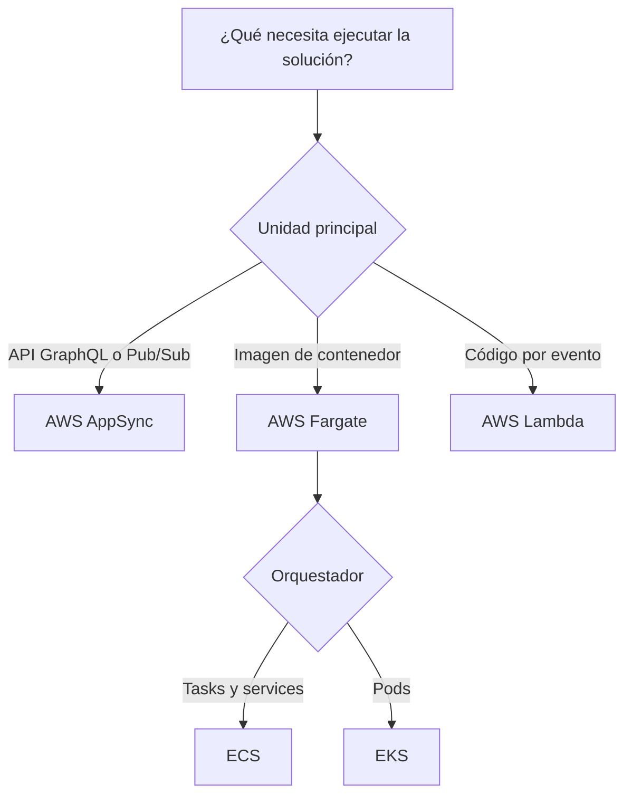
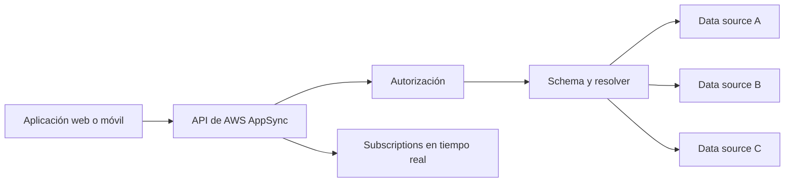
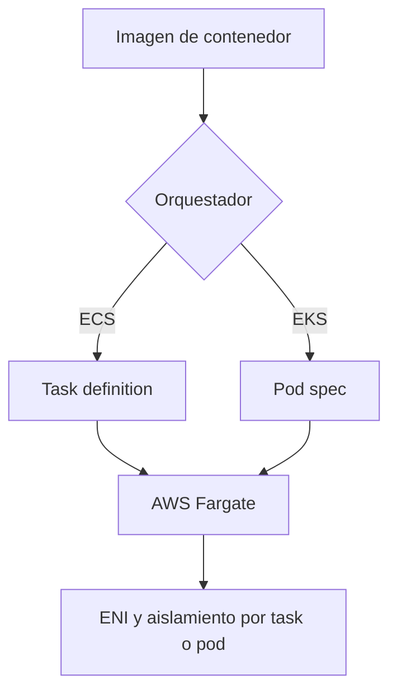
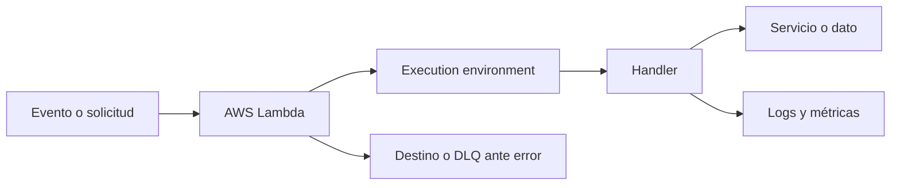
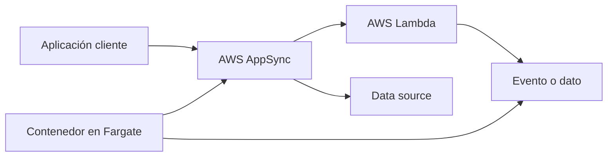

# Servicios serverless en AWS para el examen SAA-C03

## 1. Alcance necesario para el examen

La guía oficial vigente del SAA-C03 incluye los siguientes servicios en la categoría Serverless:

- AWS AppSync
- AWS Fargate
- AWS Lambda

El examen evalúa principalmente la capacidad de:

- Elegir entre funciones, contenedores y APIs administradas.
- Diseñar aplicaciones orientadas a eventos y sin estado.
- Seleccionar un modelo de invocación síncrono, asíncrono o basado en polling.
- Exponer datos mediante GraphQL y actualizaciones en tiempo real.
- Ejecutar contenedores sin administrar servidores.
- Controlar concurrencia, escalado y presión sobre dependencias.
- Aplicar permisos de menor privilegio a funciones, tasks, pods y resolvers.
- Diseñar reintentos, idempotencia, destinos de error y observabilidad.
- Optimizar costos según solicitudes, duración y capacidad consumida.

---

## 2. Modelos fundamentales de serverless

| Modelo | Unidad de ejecución | Servicio | Uso típico |
|---|---|---|---|
| API de datos y eventos | Query, mutation, subscription o evento | AWS AppSync | Aplicaciones web y móviles con GraphQL o Pub/Sub |
| Contenedor serverless | Task de ECS o pod de EKS | AWS Fargate | Microservicios y procesos contenerizados sin administrar hosts |
| Función orientada a eventos | Invocación de función | AWS Lambda | APIs, automatización y procesamiento de eventos |

### Regla mental inicial

> **Regla de examen:** AppSync administra la capa de API y tiempo real; Fargate proporciona capacidad para contenedores; Lambda ejecuta código en respuesta a eventos.

---

## 3. Conceptos de arquitectura que se deben dominar

### Qué significa serverless

Serverless no significa que no existan servidores. Significa que AWS administra gran parte de:

- Aprovisionamiento de infraestructura.
- Mantenimiento de hosts.
- Aplicación de parches a la plataforma.
- Escalado de capacidad.
- Disponibilidad del servicio administrado.

El cliente continúa siendo responsable de:

- Código e imágenes.
- Configuración.
- Identidades y permisos.
- Red.
- Protección de datos.
- Observabilidad.
- Comportamiento ante fallos.
- Costos y cuotas.

### Función frente a contenedor

| AWS Lambda | AWS Fargate |
|---|---|
| Unidad: invocación de una función | Unidad: task o pod |
| Orientado a eventos | Orientado a contenedores |
| Tiempo máximo por invocación tradicional | Puede ejecutar procesos de larga duración |
| Runtime administrado o imagen compatible | Imagen de contenedor estándar |
| Escala por concurrencia | Escala mediante tasks o pods |
| Menor control del entorno | Mayor control de runtime y dependencias |

### Ejecución efímera frente a servicio persistente

| Ejecución efímera | Servicio persistente |
|---|---|
| Inicia por evento y termina | Mantiene réplicas activas |
| Adecuada para Lambda | Adecuada para services o deployments en Fargate |
| No debe depender del estado local | Puede mantener conexiones mientras vive |
| El costo depende de invocaciones y duración | El costo depende del tiempo provisionado |

### Stateless e idempotencia

- Una ejecución no debe asumir que comparte memoria con otra.
- El estado duradero debe guardarse externamente.
- Los eventos pueden entregarse más de una vez.
- Un reintento no debe crear cobros, pedidos o registros duplicados.
- Una clave de idempotencia permite reconocer una operación ya procesada.
- La deduplicación debe conservarse el tiempo suficiente para cubrir los reintentos.

> **Regla de examen:** si una fuente garantiza entrega al menos una vez, el consumidor debe ser idempotente.

### Escalado y backpressure

Una capa serverless puede escalar más rápido que su dependencia.

Ejemplo:

1. Aumentan los eventos.
2. Lambda incrementa concurrencia.
3. Cada ejecución abre una conexión a una base.
4. La base agota conexiones.
5. La aplicación falla aunque Lambda tenga capacidad.

Controles:

- Concurrencia reservada.
- Colas.
- Batch size.
- Throttling.
- Autoscaling de tasks o pods.
- Connection pooling y proxies.
- Límites en el origen.

### Síncrono, asíncrono y polling

| Modelo | Comportamiento | Ejemplo |
|---|---|---|
| Síncrono | El invocador espera la respuesta | API que llama a Lambda |
| Asíncrono | El evento se almacena y se procesa después | Notificación que invoca Lambda |
| Polling | El consumidor lee lotes desde cola o stream | Event source mapping |
| Persistente | La carga permanece disponible | Service sobre Fargate |

### Identidades separadas

- Identidad del cliente que invoca la API.
- Rol utilizado por AppSync para acceder al data source.
- Execution role de Lambda.
- Task role de una task de ECS.
- Task execution role utilizado para iniciar una task.
- Identidad de un pod de EKS.

> **Regla de seguridad:** la aplicación debe recibir únicamente los permisos que necesita; no se deben reutilizar permisos amplios de infraestructura.

### Alta disponibilidad

- Los servicios administrados reducen la operación, pero la aplicación completa debe ser resiliente.
- Las funciones, tasks y pods deben distribuirse entre dominios de fallo.
- Las dependencias de datos también deben ser altamente disponibles.
- Un deployment debe tolerar el reemplazo de una unidad.
- Se deben diseñar reintentos, DLQ, destinos y alarmas.
- Multi-región requiere replicar API, cómputo, configuración y datos.

---

## 4. AWS AppSync

AWS AppSync permite conectar aplicaciones con datos y eventos mediante APIs GraphQL y Pub/Sub seguras, serverless y escalables.

### Capacidades principales

- Exponer una API GraphQL administrada.
- Acceder a varios data sources desde un endpoint.
- Ejecutar queries, mutations y subscriptions.
- Entregar actualizaciones en tiempo real mediante WebSocket.
- Crear Event APIs Pub/Sub.
- Aplicar autorización por campo.
- Ejecutar lógica en resolvers.
- Habilitar caché server-side.
- Crear Private APIs.
- Integrarse con AWS WAF.
- Combinar APIs mediante Merged APIs.

### GraphQL frente a REST

| GraphQL con AppSync | REST |
|---|---|
| Un endpoint con schema tipado | Múltiples recursos y métodos |
| El cliente selecciona campos | El servidor define la respuesta |
| Queries, mutations y subscriptions | Métodos HTTP |
| Puede combinar varios data sources | Cada endpoint suele representar un recurso |
| Reduce over-fetching y under-fetching | Modelo ampliamente conocido y simple |

GraphQL no reemplaza automáticamente a REST. Se elige cuando el schema, la agregación de datos, la flexibilidad del cliente o las subscriptions aportan valor.

### Arquitectura conceptual

### Schema

El schema define:

- Tipos.
- Campos.
- Argumentos.
- Relaciones.
- Operaciones disponibles.
- Datos de entrada y salida.

Operaciones:

| Operación | Función |
|---|---|
| Query | Leer datos |
| Mutation | Crear, actualizar o eliminar |
| Subscription | Recibir actualizaciones en tiempo real |

El schema actúa como contrato entre clientes y backend.

### Resolvers

Un resolver determina cómo un campo obtiene o modifica datos.

Puede:

- Validar argumentos.
- Construir una solicitud al data source.
- Aplicar lógica.
- Transformar la respuesta.
- Manejar errores.
- Encadenar varias operaciones.

AppSync permite resolvers con:

- Runtime `APPSYNC_JS`.
- Velocity Template Language -VTL-.

### Unit resolver frente a pipeline resolver

| Unit resolver | Pipeline resolver |
|---|---|
| Interactúa con un data source | Ejecuta varias funciones en secuencia |
| Request y response handler | Before, funciones y after |
| Menor complejidad | Lógica y agregación más complejas |
| Adecuado para operaciones directas | Adecuado para varios pasos o data sources |

> **Regla de examen:** si una operación requiere varias fuentes o pasos secuenciales, un pipeline resolver evita concentrar toda la lógica en una única función externa.

### Data sources

AppSync puede conectarse con:

- Tablas NoSQL.
- Funciones Lambda.
- Bases relacionales compatibles mediante las integraciones disponibles.
- Motores de búsqueda.
- Endpoints HTTP.
- Buses de eventos.
- Data source `NONE`.

| Data source | Uso |
|---|---|
| DynamoDB | Operaciones escalables de baja latencia |
| Lambda | Lógica personalizada |
| RDS compatible | Datos relacionales |
| OpenSearch | Búsqueda de texto y consultas |
| HTTP | Servicio existente |
| EventBridge | Publicar eventos |
| NONE | Procesar localmente o emitir subscriptions sin persistencia |

Un rol de servicio permite que AppSync acceda al data source. Debe limitarse a las acciones y recursos necesarios.

### Llamada directa frente a Lambda resolver

| Resolver directo | Lambda resolver |
|---|---|
| AppSync accede al data source | AppSync invoca una función |
| Menor latencia y costo | Mayor flexibilidad |
| Menos código operativo | Permite lógica compleja |
| Adecuado para CRUD simple | Adecuado para integración o reglas personalizadas |

> **Regla de costos:** no agregar Lambda si el resolver puede realizar de forma segura y simple la operación directamente.

### Modos de autorización

| Modo | Uso |
|---|---|
| API key | Acceso simple o público con controles limitados |
| IAM | SigV4 y permisos para identidades de AWS |
| Cognito user pools | Autenticación de usuarios y grupos |
| OpenID Connect | Proveedor OIDC externo |
| Lambda authorization | Lógica personalizada |

AppSync admite un modo predeterminado y modos adicionales. Las directivas del schema pueden aplicar diferentes autorizaciones por tipo o campo.

### API key

- Es un valor generado por AppSync.
- Tiene vencimiento y debe rotarse.
- Es apropiado para escenarios públicos o de desarrollo controlados.
- No representa una identidad de usuario individual.
- No debe utilizarse como único control para datos sensibles.

### IAM

- La solicitud se firma con Signature Version 4.
- Permite control detallado mediante políticas.
- Es apropiado para servicios y usuarios con credenciales temporales de AWS.
- Puede aplicarse autorización a operaciones o campos.

### Cognito y OIDC

- Validan tokens de usuario.
- Los claims y grupos pueden influir en la autorización.
- Son apropiados para aplicaciones web y móviles.
- El schema puede restringir operaciones por modo.
- La autorización del API no reemplaza la validación de propiedad del dato.

### Lambda authorization

- Permite lógica de autorización personalizada.
- Evalúa tokens y contexto.
- Puede devolver contexto para resolvers.
- Agrega invocaciones, costo y latencia.
- Debe utilizar caché con cuidado para no compartir decisiones incorrectas.

### Autorización por propietario y campo

Ejemplos:

- Un usuario solo puede leer su perfil.
- Un grupo de administradores puede actualizar estados.
- El público puede consultar productos.
- Solo identidades IAM pueden ejecutar una operación interna.

La protección debe implementarse en:

- Modo de autorización.
- Directivas del schema.
- Resolver.
- Data source.

### Queries y selección de campos

El cliente solicita únicamente los campos necesarios.

Ventajas:

- Menor transferencia.
- Menos over-fetching.
- Contrato tipado.
- Evolución del frontend sin crear numerosos endpoints.

Riesgos:

- Queries demasiado profundas.
- Demasiados resolvers por solicitud.
- Patrón N+1.
- Respuestas grandes.

Se deben aplicar límites de profundidad, cantidad de resolvers y diseño eficiente del schema.

### Mutations

- Modifican estado.
- Pueden activar subscriptions.
- Deben validar autorización y datos.
- Deben ser idempotentes cuando el cliente puede reintentar.
- Deben devolver los campos necesarios para los consumidores.

### Subscriptions

Las subscriptions:

- Mantienen una conexión WebSocket administrada.
- Entregan actualizaciones en tiempo real.
- Se asocian con mutations.
- Pueden filtrar qué eventos recibe cada cliente.
- Heredan controles de autorización.

Casos de uso:

- Chat.
- Estado de pedidos.
- Notificaciones.
- Paneles en tiempo real.
- Colaboración.

> **Trampa de examen:** una GraphQL subscription normalmente recibe eventos producidos por una mutation configurada; no consulta periódicamente el data source.

### AWS AppSync Events

AppSync Events permite crear Event APIs serverless basadas en WebSocket para Pub/Sub.

Características:

- Canales.
- Publicación y suscripción.
- Unicast, multicast y broadcast.
- Administración automática de conexiones.
- Autorización integrada.
- Logs y métricas.
- Publicación mediante WebSocket o HTTP según el flujo.

| GraphQL subscriptions | AppSync Events |
|---|---|
| Basadas en schema GraphQL | Basadas en canales Pub/Sub |
| Asociadas con mutations | Publicación directa de eventos |
| Adecuadas para datos tipados de una API | Adecuadas para mensajería en tiempo real |

Para el SAA-C03 se debe priorizar el modelo GraphQL tradicional, pero reconocer AppSync Events como la capacidad actual de Pub/Sub del servicio.

### Caché

AppSync puede mantener respuestas en una caché server-side.

Beneficios:

- Reducir latencia.
- Reducir llamadas a data sources.
- Absorber consultas repetitivas.

Consideraciones:

- La cache key debe separar correctamente usuarios y argumentos.
- Los datos sensibles no deben compartirse entre identidades.
- El TTL debe reflejar la tolerancia a datos desactualizados.
- La invalidación forma parte del diseño.
- La caché tiene costo adicional.

### Sincronización y conflictos

Para aplicaciones móviles u offline:

- Los cambios pueden almacenarse localmente.
- El cliente puede sincronizar al recuperar conectividad.
- El versionado ayuda a detectar conflictos.
- Se debe definir una estrategia de resolución.
- Last writer wins no es correcto para todos los datos.

Casos como inventario, saldos o cupos requieren reglas de negocio más estrictas que una resolución automática simple.

### Private APIs

- Restringen acceso mediante endpoints privados.
- Son apropiadas para consumidores dentro de una VPC.
- Reducen exposición pública.
- Requieren diseño de DNS, endpoints y políticas.
- No convierten automáticamente en privados a todos los data sources.

### AWS WAF

Puede proteger una API pública contra:

- Patrones maliciosos.
- Direcciones IP no permitidas.
- Bots y tráfico abusivo.
- Exceso de solicitudes según reglas.

WAF complementa la autorización; no la reemplaza.

### Merged APIs

Permiten combinar varias source APIs GraphQL en una API unificada.

Son útiles cuando:

- Varios equipos administran dominios diferentes.
- Se necesita un schema compuesto.
- Se quiere conservar autonomía de las APIs fuente.

Se deben controlar conflictos de schema, autorizaciones y dependencias entre equipos.

### Observabilidad

Supervisar:

- Solicitudes.
- Errores GraphQL.
- Latencia.
- Errores de resolver.
- Latencia del data source.
- Conexiones y mensajes en tiempo real.
- Hits y misses de caché.
- Logs de campos y resolvers.
- Trazas cuando estén habilitadas.

### Costos

Los factores principales incluyen:

- Operaciones de API.
- Actualizaciones y mensajes en tiempo real.
- Minutos de conexión cuando corresponda.
- Caché.
- Data sources invocados.
- Lambda authorization o Lambda resolvers.
- Logs y trazas.

### Cuándo elegir AWS AppSync

- Se requiere una API GraphQL administrada.
- El cliente necesita seleccionar campos.
- Se deben combinar varios data sources.
- Se necesitan subscriptions en tiempo real.
- Se requieren capacidades offline y sincronización.
- Se busca Pub/Sub WebSocket administrado.
- Varios equipos necesitan componer APIs GraphQL.

### Cuándo no elegirlo

- La aplicación requiere únicamente una API REST simple.
- No se necesita schema GraphQL ni Pub/Sub.
- El requisito es ejecutar un contenedor.
- El requisito es procesar un evento con código.

### Trampas del examen

- AppSync no es una base de datos.
- GraphQL no elimina la necesidad de autorización en el data source.
- API key no es apropiada como identidad de usuario para datos sensibles.
- Una subscription no sustituye la persistencia.
- Agregar un Lambda resolver puede aumentar costo y latencia innecesariamente.
- La caché debe aislar datos por identidad y argumentos.
- Private API y data source privado son decisiones diferentes.

---

## 5. AWS Fargate

AWS Fargate proporciona capacidad de cómputo serverless y bajo demanda para ejecutar contenedores con Amazon ECS o Amazon EKS sin aprovisionar ni administrar hosts.

### Responsabilidad

| AWS | Cliente |
|---|---|
| Administra hosts y aislamiento | Construye y protege la imagen |
| Aprovisiona capacidad | Define CPU y memoria |
| Mantiene el runtime de la plataforma | Configura red y security groups |
| Aplica parches a la infraestructura | Configura IAM |
| Reemplaza infraestructura subyacente | Diseña escalado y disponibilidad |

### Fargate no es un orquestador

Fargate necesita un orquestador:

| Modelo | Unidad | Configuración |
|---|---|---|
| ECS con Fargate | Task | Task definition y service |
| EKS con Fargate | Pod | Pod spec y Fargate profile |

> **Regla de examen:** ECS o EKS programa la carga; Fargate proporciona la capacidad donde se ejecuta.

### Arquitectura conceptual

### Tamaño de la carga

Se especifica:

- vCPU.
- Memoria.
- Arquitectura compatible.
- Sistema operativo compatible.
- Almacenamiento efímero.
- Puertos.
- Variables y secretos.

Las combinaciones de CPU y memoria deben ser válidas para Fargate.

Rightsizing:

- Recursos insuficientes provocan throttling o errores de memoria.
- Recursos excesivos aumentan costo.
- Se deben observar uso real y percentiles.
- Las cargas con picos deben escalar horizontalmente cuando sea posible.

### Aislamiento

- Cada task o pod tiene su propio límite de aislamiento.
- No comparte kernel, CPU, memoria ni ENI con otra unidad.
- El cliente no accede al host.
- No se deben diseñar dependencias sobre recursos del host.
- El reemplazo de una unidad debe ser seguro.

### Redes en ECS

Las tasks de Fargate utilizan `awsvpc`.

Cada task recibe:

- ENI.
- Dirección IP privada.
- Security groups.
- Rutas de la subred.
- DNS según la configuración de VPC.

Un load balancer debe registrar las tasks por target type `ip`, no `instance`.

### Subred pública frente a privada

| Subred pública | Subred privada |
|---|---|
| Puede asignar IP pública a la task | La task conserva IP privada |
| Ruta directa mediante Internet Gateway | Salida mediante NAT o VPC endpoints |
| Mayor exposición potencial | Patrón preferido para backends |

Para descargar una imagen:

- Una task pública puede utilizar IP pública.
- Una task privada puede utilizar NAT.
- Una task privada puede utilizar endpoints para ECR y dependencias compatibles.

> **Trampa de examen:** colocar una task en una subnet pública no asigna automáticamente una IP pública; debe configurarse.

### Security groups

- Se aplican a la ENI de la task.
- Deben permitir solo puertos necesarios.
- El load balancer puede ser el origen permitido.
- La salida debe limitarse según la aplicación.
- Las reglas se evalúan junto con rutas y network ACLs.

### Load balancing

Services sobre Fargate pueden utilizar load balancers compatibles.

- Application Load Balancer para HTTP/HTTPS y routing de capa 7.
- Network Load Balancer para TCP, UDP o alta performance.
- Target type `ip`.
- Health checks determinan si la task recibe tráfico.
- El service reemplaza tasks no saludables.

### IAM en ECS con Fargate

| Rol | Función |
|---|---|
| Task role | Permisos utilizados por la aplicación |
| Task execution role | Descargar imágenes, obtener secretos y enviar logs durante el inicio |

> **Regla de seguridad:** los permisos de negocio pertenecen al task role; el task execution role no debe utilizarse como sustituto.

### EKS con Fargate

Un Fargate profile selecciona pods mediante:

- Namespace.
- Labels opcionales.
- Subredes.

Si un pod no coincide con un profile, puede permanecer en `Pending`.

Consideraciones:

- Los pods se ejecutan en subredes privadas.
- Cada pod tiene su propio límite de aislamiento y ENI.
- Load balancers utilizan targets IP.
- DaemonSets no son compatibles.
- Contenedores privileged no son compatibles.
- No se dispone de acceso al host.
- Fargate Spot no está disponible para EKS.

### Almacenamiento

#### Efímero

- Existe durante la vida de la task o pod.
- Se elimina cuando termina.
- Es apropiado para archivos temporales, buffers y caché.
- No debe almacenar datos que deban sobrevivir al reemplazo.

#### Persistente

La compatibilidad depende del orquestador y de la integración:

- ECS con Fargate puede utilizar almacenamiento de archivos compatible.
- EKS con Fargate admite EFS mediante aprovisionamiento compatible.
- EKS Fargate no permite montar EBS directamente en los pods.

> **Trampa de examen:** aumentar el almacenamiento efímero no lo convierte en persistente.

### Platform versions

Una platform version identifica:

- Kernel.
- Runtime de contenedores.
- Capacidades disponibles.
- Correcciones y parches.

Una task conserva su revisión durante su vida. Para adoptar una revisión nueva, se inicia una task nueva. AWS puede retirar tasks afectadas por mantenimiento o vulnerabilidades.

La aplicación debe:

- Ejecutar varias réplicas.
- Manejar terminación.
- Utilizar health checks.
- Distribuirse entre AZ.
- Mantener datos fuera de la task.

### Escalado

En ECS:

- Service Auto Scaling cambia desired count.
- Métricas como CPU, memoria o tráfico pueden iniciar escalado.
- Capacity providers seleccionan Fargate o Fargate Spot.

En EKS:

- Horizontal Pod Autoscaler modifica réplicas.
- Fargate aprovisiona capacidad para los pods compatibles.
- Requests de CPU y memoria influyen en el tamaño asignado.

### Fargate Spot

Fargate Spot utiliza capacidad sobrante con descuento para tasks de ECS tolerantes a interrupciones.

Características:

- Puede interrumpirse.
- Proporciona una advertencia previa breve.
- Es apropiado para workers, jobs y capacidad adicional.
- La aplicación debe manejar `SIGTERM`.
- Debe guardar checkpoints externamente.
- Debe combinarse con capacidad regular para la línea base crítica.

No elegir Fargate Spot para:

- Tasks que no toleran interrupciones.
- Procesos sin checkpoint.
- Réplica única crítica.
- Trabajo con deadline estricto.

### Alta disponibilidad

- Ejecutar varias tasks o pods.
- Distribuirlas entre varias AZ.
- Configurar health checks.
- Diseñar graceful shutdown.
- Mantener estado fuera del contenedor.
- Conservar capacidad regular suficiente.
- Utilizar deployment policies que mantengan réplicas saludables.

### Observabilidad

Supervisar:

- CPU.
- Memoria.
- Tasks o pods `Pending`.
- Reinicios.
- Exit codes.
- Health checks.
- Logs.
- Tráfico de ENI.
- Errores al descargar imágenes.
- Eventos de mantenimiento.

Diagnóstico:

| Síntoma | Revisar |
|---|---|
| Task no inicia | CPU/memoria válida, imagen, execution role y red |
| Pod `Pending` | Fargate profile, namespace, labels y subredes |
| No descarga imagen | Rutas, NAT, endpoints y permisos |
| No recibe tráfico | Target type, health check y security groups |
| Se pierde información | Uso incorrecto de almacenamiento efímero |

### Costos

Los factores principales incluyen:

- vCPU asignada.
- Memoria asignada.
- Duración de la task o pod.
- Sistema operativo y arquitectura.
- Almacenamiento efímero adicional.
- Transferencia de datos.
- Logs.
- Load balancer.
- Fargate Spot cuando sea aplicable.

Se paga por recursos solicitados, no por el promedio realmente utilizado. Por ello, rightsizing es esencial.

### Cuándo elegir AWS Fargate

- La aplicación ya está contenerizada.
- No se quieren administrar hosts.
- Se necesita un proceso de más larga duración que una función tradicional.
- Se requieren dependencias o runtime personalizados.
- Se necesita escuchar tráfico continuamente.
- Se quiere usar ECS o EKS con capacidad bajo demanda.

### Cuándo no elegirlo

- Se requiere acceso o personalización del host.
- Se necesitan privileged containers.
- Se necesitan GPUs no compatibles.
- La carga es una función breve y orientada a eventos.
- El objetivo es únicamente exponer una API GraphQL.
- La carga exige una característica no compatible con Fargate.

### Trampas del examen

- Fargate no reemplaza a ECS o EKS.
- No se administran hosts, pero sí imágenes, red, IAM y aplicaciones.
- ECS Fargate y EKS Fargate tienen capacidades diferentes.
- Fargate Spot está disponible para ECS, no para EKS.
- El almacenamiento efímero se pierde al terminar.
- Los load balancers usan target type `ip`.
- Un pod de EKS debe coincidir con un Fargate profile.

---

## 6. AWS Lambda

AWS Lambda es un servicio de cómputo serverless que ejecuta código sin aprovisionar ni administrar servidores. Su modelo principal para el SAA-C03 es la función que responde a eventos o llamadas de API.

### Componentes

| Componente | Función |
|---|---|
| Function | Código y configuración ejecutable |
| Handler | Punto de entrada |
| Runtime | Entorno del lenguaje |
| Trigger | Servicio o configuración que genera invocaciones |
| Event source mapping | Poller administrado para colas y streams |
| Execution role | Permisos utilizados por el código |
| Resource-based policy | Quién puede invocar la función |
| Version | Snapshot inmutable de código y configuración |
| Alias | Puntero estable hacia una versión |

### Arquitectura conceptual

### Modelo de ejecución

1. Llega una invocación.
2. Lambda selecciona o crea un execution environment.
3. Se ejecuta la fase de inicialización cuando es necesario.
4. Se llama al handler.
5. Se devuelve el resultado o se registra el error.
6. El environment puede reutilizarse.
7. Lambda puede eliminarlo en cualquier momento.

### Tiempo de ejecución

- Una Lambda Function tradicional puede ejecutar hasta 15 minutos por invocación.
- El timeout debe ajustarse a la duración esperada.
- Un timeout demasiado alto retrasa la detección de procesos bloqueados.
- Un timeout demasiado bajo provoca reintentos innecesarios.
- Procesos prolongados o servidores persistentes suelen encajar mejor en Fargate.

### Runtime y empaquetado

Una función puede desplegarse como:

- Archivo `.zip`.
- Imagen de contenedor compatible con Lambda.

| Paquete ZIP | Imagen de contenedor |
|---|---|
| Simple para funciones pequeñas | Incluye dependencias y runtime personalizados |
| Utiliza runtime administrado o custom runtime | Utiliza una imagen compatible con Lambda |
| Adecuado para librerías ligeras | Adecuado para dependencias grandes o complejas |

> **Trampa de examen:** una imagen de Lambda sigue utilizando el modelo de ejecución de Lambda; no se convierte en una task de Fargate.

### Variables, layers y `/tmp`

- Environment variables almacenan configuración no secreta.
- Layers comparten librerías y componentes entre funciones.
- `/tmp` proporciona almacenamiento efímero dentro del environment.
- El contenido de `/tmp` puede existir durante una reutilización, pero no debe considerarse duradero.
- Los secretos deben obtenerse mediante un servicio seguro.
- Las dependencias críticas deben versionarse.

### Inicialización y reutilización

Código fuera del handler puede:

- Inicializar SDK clients.
- Crear pools de conexión.
- Cargar configuración.
- Preparar modelos.

Ventajas:

- Reutilizar recursos durante warm invocations.
- Reducir latencia.

Precauciones:

- No guardar datos de un usuario para otro.
- Verificar conexiones antes de reutilizarlas.
- No asumir que siempre existirá warm start.
- Limpiar información sensible.

### Cold start

Un cold start ocurre cuando Lambda debe inicializar un nuevo environment.

Factores:

- Runtime.
- Tamaño de paquete.
- Dependencias.
- Código de inicialización.
- Conectividad.
- Memoria.

Mitigaciones:

- Reducir dependencias.
- Inicializar eficientemente.
- Aumentar memoria cuando mejore CPU e inicialización.
- Utilizar provisioned concurrency para latencia predecible.
- Utilizar SnapStart en runtimes compatibles.

### Invocación síncrona

El invocador espera:

- Respuesta.
- Error.
- Timeout.

Ejemplos:

- API.
- SDK.
- Aplicación que necesita resultado inmediato.

El invocador suele administrar reintentos. Un error de función se devuelve directamente.

### Invocación asíncrona

Lambda:

1. Recibe el evento.
2. Lo coloca en una cola interna.
3. Devuelve aceptación.
4. Ejecuta la función posteriormente.

Se pueden configurar:

- Reintentos.
- Edad máxima del evento.
- Dead-letter queue.
- Destinations para éxito o error.

> **Regla de examen:** aceptar un evento asíncrono no significa que el código ya finalizó correctamente.

### Event source mappings

Un event source mapping:

- Lee desde una cola o stream.
- Agrupa registros.
- Invoca la función.
- Administra pollers.
- Escala según la fuente.
- Mantiene checkpoints cuando corresponde.

Fuentes conceptuales:

- Colas.
- Streams.
- Kafka administrado o autogestionado.
- Bases compatibles.

Los registros se procesan al menos una vez; pueden existir duplicados.

### Trigger directo frente a event source mapping

| Trigger directo | Event source mapping |
|---|---|
| El servicio empuja el evento | Lambda realiza polling |
| Configuración en el productor | Recurso administrado por Lambda |
| Adecuado para eventos discretos | Adecuado para colas y streams |
| Invocación inmediata | Puede utilizar batch |

### Batch size y batching window

- Batch size controla el máximo de registros por invocación.
- Batching window permite esperar para reunir registros.
- Un batch grande mejora eficiencia.
- Un batch grande aumenta latencia y trabajo repetido ante errores.
- El tamaño debe considerar payload, timeout y capacidad downstream.

### Errores en batch

Sin manejo parcial:

- Un registro defectuoso puede hacer fallar todo el batch.
- Los registros correctos pueden procesarse otra vez.

Con partial batch response:

- La función informa qué registros fallaron.
- Se reduce el reprocesamiento.
- La aplicación sigue necesitando idempotencia.

En streams también se deben considerar:

- Orden.
- Shards.
- Bisect batch on error.
- Edad máxima.
- Número de reintentos.
- Destino de registros descartados.

### Concurrencia

La concurrencia es la cantidad de invocaciones en ejecución simultáneamente.

Fórmula:

`Concurrencia = solicitudes por segundo × duración media en segundos`

Ejemplo:

- 200 solicitudes por segundo.
- Duración media de 0,5 segundos.
- Concurrencia aproximada: 100.

La concurrencia es regional y está sujeta a cuotas de cuenta y función.

### Reserved concurrency frente a provisioned concurrency

| Reserved concurrency | Provisioned concurrency |
|---|---|
| Reserva y limita concurrencia | Preinicializa environments |
| Protege capacidad para una función | Reduce cold starts |
| Protege dependencias mediante límite máximo | Se utiliza para latencia predecible |
| No tiene cargo directo adicional | Tiene costo adicional |
| No elimina cold starts | Reduce significativamente inicialización bajo la capacidad provisionada |

> **Trampa de examen:** reserved concurrency no mantiene environments inicializados; provisioned concurrency sí.

### Reserved concurrency como protección

Puede:

- Evitar que una función consuma toda la concurrencia regional.
- Proteger otras funciones.
- Limitar conexiones hacia una base.
- Garantizar una porción de capacidad.

Si se configura en `0`, la función queda bloqueada.

### Provisioned concurrency

Se utiliza cuando:

- La latencia del primer request es crítica.
- La carga base es predecible.
- El runtime tiene inicialización costosa.
- El costo adicional está justificado.

Las invocaciones por encima de la capacidad provisionada pueden utilizar concurrencia on-demand si la configuración lo permite y experimentar cold starts.

### SnapStart

SnapStart crea y reutiliza un snapshot de un environment inicializado para runtimes compatibles.

Consideraciones:

- Reduce tiempo de inicialización.
- Requiere revisar unicidad, aleatoriedad, conexiones y secretos restaurados.
- No puede combinarse con provisioned concurrency en la misma versión.
- Debe habilitarse y probarse según el runtime.

### Versiones y aliases

| Version | Alias |
|---|---|
| Snapshot inmutable | Nombre estable que apunta a una versión |
| Código y configuración publicados | Puede cambiar de destino |
| Número específico | Nombres como `dev` o `prod` |
| No se modifica | Puede distribuir tráfico entre versiones |

Los aliases permiten:

- Blue/green.
- Canary.
- Rollback.
- Integraciones con un nombre estable.

`$LATEST` es mutable y no debe utilizarse como estrategia de producción sin control.

### Execution role frente a resource-based policy

| Execution role | Resource-based policy |
|---|---|
| Qué puede hacer la función | Quién puede invocar la función |
| Acceso a datos y APIs | Permisos a servicios o cuentas |
| Lo asume Lambda durante ejecución | Está adjunta a la función |

> **Regla de seguridad:** permitir que un servicio invoque la función no concede al código permisos para acceder a otros recursos.

### Conectividad VPC

Por defecto, Lambda ejecuta en una VPC administrada por el servicio y tiene conectividad saliente administrada.

Se conecta a la VPC del cliente cuando necesita acceder a:

- Bases privadas.
- Caches privadas.
- Endpoints internos.
- Recursos con IP privada.

La configuración selecciona:

- Subredes.
- Security groups.
- Rutas.

Lambda utiliza Hyperplane ENIs para proporcionar conectividad.

### Acceso a internet desde VPC

- Conectar Lambda a una subnet pública no le entrega una IP pública.
- Una función en subnets privadas necesita NAT para salida general a internet.
- Puede utilizar VPC endpoints para servicios compatibles.
- DNS y security groups deben permitir el tráfico.
- No adjuntar a VPC si no existe un requisito de acceso privado.

> **Trampa de examen:** subnet pública no significa internet automático para una función Lambda conectada a VPC.

### Destinations frente a DLQ

| Destinations | Dead-letter queue |
|---|---|
| Registra contexto de la invocación | Recibe el evento no procesado |
| Puede manejar éxito y error | Se utiliza principalmente para fallos |
| Facilita encadenar procesamiento | Facilita reprocesamiento |
| Recomendada para flujos asíncronos modernos | Opción simple y compatible |

La selección depende del tipo de invocación. Los errores de event source mappings se configuran en el mapping y la fuente, no igual que una invocación asíncrona directa.

### Reintentos

El comportamiento depende del origen:

| Origen | Quién administra el reintento |
|---|---|
| Invocación síncrona | Cliente o servicio invocador |
| Invocación asíncrona | Lambda |
| Queue event source mapping | Lambda y visibilidad de la cola |
| Stream event source mapping | Lambda según posición y configuración |

Se debe estudiar el origen exacto antes de elegir DLQ, destination, batch failure o visibility timeout.

### Idempotencia

Patrón:

1. Extraer un identificador único del evento.
2. Registrar la operación con escritura condicional.
3. Si ya existe, devolver el resultado anterior.
4. Ejecutar el efecto una sola vez.
5. Guardar resultado o estado.

No basta con comprobar y después escribir sin atomicidad, porque dos invocaciones concurrentes pueden procesar el mismo evento.

### Variables y secretos

- Environment variables son apropiadas para configuración.
- Los secretos deben almacenarse y rotarse externamente.
- El execution role concede acceso para leer el secreto.
- Se puede reutilizar un secreto en memoria durante la vida del environment.
- Los logs no deben exponer tokens ni credenciales.

### Observabilidad

Supervisar:

- Invocations.
- Errors.
- Duration.
- Throttles.
- ConcurrentExecutions.
- IteratorAge para streams.
- Dead-letter errors.
- Async event age.
- Provisioned concurrency spillover.
- Logs y trazas.

Diagnóstico:

| Síntoma | Revisar |
|---|---|
| Throttles | Concurrency, quotas y reserved concurrency |
| Duration alta | Código, memoria, dependencia y red |
| IteratorAge aumenta | Concurrencia, batch, errores y capacidad |
| Timeout | Dependencia, red y valor configurado |
| Duplicados | Idempotencia y reintentos |
| Sin internet en VPC | NAT, rutas, endpoints y DNS |

### Memoria y CPU

- Lambda asigna CPU en proporción a la memoria configurada.
- Aumentar memoria puede reducir duración.
- Una configuración más grande puede ser más barata si termina mucho más rápido.
- Se deben probar distintos tamaños.
- El objetivo es optimizar costo total, no solo memoria mínima.

### Costos

Los factores principales incluyen:

- Cantidad de invocaciones.
- Duración.
- Memoria asignada.
- Arquitectura.
- Almacenamiento efímero adicional.
- Provisioned concurrency.
- Logs.
- Transferencia.
- Servicios invocados.

La duración se cobra incluso cuando el código espera una respuesta de red. Las funciones deben evitar espera innecesaria.

### Capacidades actuales de Lambda

La documentación actual también incluye:

| Capacidad | Propósito |
|---|---|
| Lambda Durable Functions | Flujos con checkpoints que pueden durar hasta un año |
| Lambda MicroVMs | Ambientes aislados con estado temporal y control de ciclo de vida |

Para el SAA-C03 se debe priorizar el modelo tradicional de Lambda Functions: invocaciones orientadas a eventos, hasta 15 minutos, stateless, concurrencia, permisos y manejo de errores.

### Cuándo elegir AWS Lambda

- Procesamiento breve orientado a eventos.
- Automatización.
- APIs serverless.
- Transformación de archivos.
- Procesamiento de colas y streams.
- Tareas programadas.
- Integraciones con servicios de AWS.
- Demanda variable o impredecible.

### Cuándo no elegirlo

- El proceso tradicional dura más de 15 minutos.
- Se necesita escuchar continuamente en un puerto.
- Se requiere control completo del sistema operativo.
- Se requiere un proceso persistente.
- La aplicación necesita un contenedor con capacidades no compatibles.
- El requisito principal es una API GraphQL administrada.

### Trampas del examen

- Lambda no garantiza una única entrega.
- Reserved concurrency no elimina cold starts.
- Provisioned concurrency tiene costo.
- Más memoria también proporciona más CPU.
- Una subnet pública no entrega internet a Lambda.
- El execution role no controla quién invoca la función.
- Una imagen de contenedor de Lambda no equivale a Fargate.
- `/tmp` no es almacenamiento persistente.
- El reintento depende del modelo de invocación.
- Escalar Lambda puede saturar una dependencia.

---

## 7. Seguridad, disponibilidad y operaciones

### Flujo serverless integrado

### Menor privilegio

- Limitar el modo de autorización de AppSync por campo.
- Limitar el rol de AppSync al data source necesario.
- Separar task role y task execution role.
- Limitar el execution role de Lambda.
- Limitar quién puede invocar funciones.
- No incluir secretos en imágenes o variables expuestas.
- Aplicar condiciones de cuenta y ARN en trust policies.

### Resiliencia

- Diseñar unidades sin estado.
- Ejecutar varias réplicas de contenedores.
- Distribuir entre AZ.
- Limitar concurrencia hacia dependencias.
- Usar colas para absorber picos.
- Implementar idempotencia.
- Configurar DLQ o destinos.
- Supervisar edad, errores y throttling.
- Probar retiros de tasks, reintentos y failover.

### Datos

- AppSync no sustituye al data source.
- Fargate pierde almacenamiento efímero al terminar.
- Lambda pierde memoria y `/tmp` cuando se elimina el environment.
- Los datos duraderos deben almacenarse externamente.
- La disponibilidad y recuperación dependen del servicio de datos seleccionado.

---

## 8. Matriz de decisión para preguntas del examen

| Requisito | Elección principal | Motivo |
|---|---|---|
| API GraphQL administrada | AWS AppSync | Schema, resolvers y data sources |
| Consultar varias fuentes desde un endpoint | AWS AppSync | Agregación mediante resolvers |
| Actualizaciones GraphQL en tiempo real | AppSync subscriptions | WebSocket administrado |
| Pub/Sub basado en canales | AWS AppSync Events | Event API serverless |
| Lógica simple contra DynamoDB | Resolver directo de AppSync | Menor latencia y operación |
| Varios pasos o data sources | Pipeline resolver | Funciones secuenciales |
| Autenticación de usuarios GraphQL | Cognito u OIDC en AppSync | Tokens y autorización por schema |
| GraphQL accesible solo desde VPC | AppSync Private API | Endpoint privado |
| Contenedor sin administrar hosts | AWS Fargate | Capacidad serverless para ECS o EKS |
| Tasks y services nativos de AWS | ECS con Fargate | Modelo ECS |
| Pods Kubernetes sin nodos administrados | EKS con Fargate | Fargate profile |
| Task ECS tolerante a interrupciones | Fargate Spot | Menor costo |
| Proceso contenerizado de larga duración | AWS Fargate | Sin límite tradicional de 15 minutos |
| Código breve por evento | AWS Lambda | Función orientada a eventos |
| API serverless basada en funciones | AWS Lambda | Ejecución bajo demanda |
| Procesar una cola o stream | Lambda event source mapping | Polling y batches administrados |
| Proteger una base de demasiadas conexiones | Reserved concurrency | Limita concurrencia máxima |
| Reducir cold starts | Provisioned concurrency o SnapStart | Environments preparados o snapshots |
| Despliegue canary de función | Versiones y alias | Distribución de tráfico |
| Acceder desde Lambda a una base privada | Lambda conectada a VPC | Subnets y security groups |
| Evento asíncrono fallido con contexto | Lambda destination | Registra resultado de invocación |

---

## 9. Diferencias que suelen generar errores

### AWS AppSync frente a AWS Lambda

| AWS AppSync | AWS Lambda |
|---|---|
| API GraphQL y Pub/Sub | Ejecución de código |
| Schema y resolvers | Handler y runtime |
| Conecta clientes con data sources | Procesa eventos |
| Puede invocar Lambda | Puede actuar como resolver |

### AWS Lambda frente a AWS Fargate

| AWS Lambda | AWS Fargate |
|---|---|
| Función orientada a eventos | Contenedor |
| Hasta 15 minutos por invocación tradicional | Procesos de larga duración |
| Runtime más restringido | Mayor control de dependencias |
| Escala por concurrencia | Escala por tasks o pods |
| Pago por invocación y duración | Pago por recursos y tiempo de ejecución |

### Fargate frente a ECS o EKS

| AWS Fargate | ECS o EKS |
|---|---|
| Capacidad de cómputo | Orquestador |
| Ejecuta task o pod | Programa y mantiene estado deseado |
| No administra hosts | Define services, deployments y escalado |
| No reemplaza al orquestador | Puede utilizar Fargate como capacidad |

### Resolver directo frente a Lambda resolver

| Resolver directo | Lambda resolver |
|---|---|
| Menor costo y latencia | Mayor flexibilidad |
| Operación simple | Lógica personalizada |
| Menos componentes | Nueva función y permisos |
| Adecuado para acceso directo | Adecuado para reglas complejas |

### GraphQL subscription frente a AppSync Events

| GraphQL subscription | AppSync Events |
|---|---|
| Basada en schema y mutation | Basada en canales |
| Entrega datos GraphQL | Pub/Sub de eventos |
| Integrada con queries y mutations | Mensajería WebSocket directa |

### Síncrono frente a asíncrono

| Síncrono | Asíncrono |
|---|---|
| El invocador espera | Lambda almacena el evento |
| Error se devuelve al invocador | Lambda administra reintentos |
| Cliente controla reintento | Se configuran destino, DLQ y edad |
| Adecuado para APIs | Adecuado para eventos |

### Asíncrono frente a event source mapping

| Invocación asíncrona | Event source mapping |
|---|---|
| Evento en cola interna de Lambda | Pollers leen una fuente externa |
| Lambda administra reintentos asíncronos | Configuración depende de cola o stream |
| Destinations y DLQ asíncrona | Batch failure y destinos del mapping |
| Productor empuja | Lambda realiza polling |

### Reserved frente a provisioned concurrency

| Reserved concurrency | Provisioned concurrency |
|---|---|
| Reserva y limita | Preinicializa |
| Protege capacidad y dependencias | Reduce cold starts |
| Sin cargo directo | Con cargo |
| Puede seguir teniendo cold start | Mantiene environments preparados |

### Execution role frente a resource-based policy

| Execution role | Resource-based policy |
|---|---|
| Permisos del código | Permisos para invocar |
| Lambda lo asume | Está adjunta a la función |
| Acceso a datos y APIs | Acceso desde servicios o cuentas |

### Almacenamiento efímero frente a persistente

| Efímero | Persistente |
|---|---|
| Vive con execution environment, task o pod | Vive fuera de la unidad |
| `/tmp` o disco temporal | Base, objeto, bloque o archivo |
| Puede desaparecer | Sobrevive al reemplazo |
| Caché y buffers | Datos de negocio |

---

## 10. Optimización de costos

### AWS AppSync

- Utilizar resolvers directos cuando sean suficientes.
- Evitar queries excesivamente profundas.
- Aplicar caché solo a datos reutilizables.
- Ajustar TTL.
- Limitar logs detallados a lo necesario.
- Evitar subscriptions innecesarias.
- Revisar costo de data sources y Lambda authorization.

### AWS Fargate

- Ajustar CPU y memoria.
- Escalar tasks o pods según demanda.
- Utilizar Fargate Spot para capacidad interrumpible de ECS.
- Detener jobs y tasks completadas.
- Eliminar pods de jobs finalizados.
- Optimizar imágenes y tiempo de inicio.
- Evitar almacenamiento efímero adicional sin necesidad.

### AWS Lambda

- Reducir duración.
- Seleccionar memoria mediante pruebas.
- Usar arquitectura eficiente cuando sea compatible.
- Agrupar eventos sin exceder timeout o payload.
- Evitar provisioned concurrency si la latencia no lo requiere.
- Filtrar eventos antes de invocar cuando sea posible.
- Controlar logs.
- Reutilizar conexiones y SDK clients.
- Evitar espera de red innecesaria.

---

## 11. Estrategia para resolver preguntas SAA-C03

1. Identificar si se necesita una API, una función o un contenedor.
2. Determinar si la carga es breve, persistente o de larga duración.
3. Identificar el modelo de invocación.
4. Determinar si puede haber duplicados.
5. Revisar dónde vive el estado.
6. Identificar quién necesita permisos y sobre qué recurso.
7. Proteger dependencias ante escalado.
8. Diseñar errores, reintentos y destinos.
9. Elegir la opción con menor costo y operación que cumpla todos los requisitos.

### Palabras clave

- **GraphQL administrado:** AWS AppSync.
- **Queries, mutations y subscriptions:** AWS AppSync.
- **Varios data sources:** AppSync pipeline resolver.
- **GraphQL en tiempo real:** AppSync subscriptions.
- **Pub/Sub por canales:** AWS AppSync Events.
- **GraphQL privado:** AppSync Private API.
- **Contenedor sin hosts:** AWS Fargate.
- **Task serverless:** ECS con Fargate.
- **Pod serverless:** EKS con Fargate.
- **Task interrumpible y económica:** Fargate Spot.
- **Proceso contenerizado largo:** AWS Fargate.
- **Código breve por evento:** AWS Lambda.
- **Hasta 15 minutos:** Lambda Function tradicional.
- **Cola o stream:** Event source mapping.
- **Limitar escalado hacia una base:** Reserved concurrency.
- **Latencia predecible:** Provisioned concurrency.
- **Reducir inicialización compatible:** SnapStart.
- **Quién invoca Lambda:** Resource-based policy.
- **Qué puede hacer Lambda:** Execution role.
- **Backend privado:** Lambda conectada a VPC.
- **Duplicados:** Idempotencia.
- **Evento asíncrono fallido:** Destination o DLQ.

---

## 12. Lista de comprobación final

- Comprender qué administra AWS en un modelo serverless.
- Diferenciar API, función y contenedor.
- Diferenciar ejecución efímera y servicio persistente.
- Comprender stateless e idempotencia.
- Diferenciar síncrono, asíncrono y polling.
- Reconocer schema, query, mutation y subscription de AppSync.
- Diferenciar unit resolver y pipeline resolver.
- Reconocer los data sources de AppSync.
- Diferenciar resolver directo y Lambda resolver.
- Comprender API key, IAM, Cognito, OIDC y Lambda authorization.
- Comprender autorización por campo.
- Diferenciar GraphQL subscriptions y AppSync Events.
- Comprender caché y cache keys.
- Reconocer Private APIs y Merged APIs.
- Recordar que Fargate no es un orquestador.
- Diferenciar ECS Fargate y EKS Fargate.
- Comprender CPU, memoria y almacenamiento efímero.
- Comprender ENI, subnets y security groups.
- Recordar target type `ip`.
- Diferenciar task role y task execution role.
- Comprender Fargate profiles.
- Recordar limitaciones de EKS Fargate.
- Reconocer cuándo usar Fargate Spot.
- Comprender handler, runtime, trigger y execution environment.
- Diferenciar ZIP e imagen de contenedor Lambda.
- Comprender cold start y warm start.
- Recordar el límite tradicional de 15 minutos.
- Diferenciar trigger directo y event source mapping.
- Comprender batch size y batching window.
- Implementar partial batch response cuando corresponda.
- Calcular concurrencia.
- Diferenciar reserved y provisioned concurrency.
- Comprender SnapStart.
- Diferenciar versiones y aliases.
- Diferenciar execution role y resource-based policy.
- Comprender conectividad Lambda con VPC.
- Recordar que una subnet pública no entrega internet a Lambda.
- Diferenciar destination y DLQ.
- Interpretar errores, duration, throttles e iterator age.
- Seleccionar el servicio correcto a partir de palabras clave.

---

## Referencias oficiales

- [Guía oficial del examen AWS Certified Solutions Architect – Associate SAA-C03](https://docs.aws.amazon.com/pdfs/aws-certification/latest/solutions-architect-associate-03/solutions-architect-associate-03.pdf)
- [Servicios incluidos en el alcance del SAA-C03](https://docs.aws.amazon.com/aws-certification/latest/solutions-architect-associate-03/saa-03-in-scope-services.html)
- [Introducción a AWS AppSync](https://docs.aws.amazon.com/appsync/latest/devguide/what-is-appsync.html)
- [Autenticación y autorización de AWS AppSync](https://docs.aws.amazon.com/appsync/latest/devguide/security-authz.html)
- [Resolvers de AWS AppSync](https://docs.aws.amazon.com/appsync/latest/devguide/resolver-components.html)
- [Data sources de AWS AppSync](https://docs.aws.amazon.com/appsync/latest/devguide/attaching-a-data-source.html)
- [AWS AppSync Events](https://docs.aws.amazon.com/appsync/latest/eventapi/event-api-welcome.html)
- [Caching de AWS AppSync](https://docs.aws.amazon.com/appsync/latest/devguide/enabling-caching.html)
- [Introducción a AWS Fargate para Amazon ECS](https://docs.aws.amazon.com/AmazonECS/latest/developerguide/AWS_Fargate.html)
- [Redes de tasks ECS sobre Fargate](https://docs.aws.amazon.com/AmazonECS/latest/developerguide/fargate-task-networking.html)
- [Almacenamiento de tasks ECS sobre Fargate](https://docs.aws.amazon.com/AmazonECS/latest/developerguide/fargate-task-storage.html)
- [AWS Fargate con Amazon EKS](https://docs.aws.amazon.com/eks/latest/userguide/fargate.html)
- [Introducción a AWS Lambda](https://docs.aws.amazon.com/lambda/latest/dg/welcome.html)
- [Modelos de invocación de AWS Lambda](https://docs.aws.amazon.com/lambda/latest/dg/lambda-invocation.html)
- [Invocación asíncrona](https://docs.aws.amazon.com/lambda/latest/dg/invocation-async.html)
- [Event source mappings](https://docs.aws.amazon.com/lambda/latest/dg/invocation-eventsourcemapping.html)
- [Concurrencia de AWS Lambda](https://docs.aws.amazon.com/lambda/latest/dg/lambda-concurrency.html)
- [Versiones de funciones Lambda](https://docs.aws.amazon.com/lambda/latest/dg/configuration-versions.html)
- [Conectividad de Lambda con VPC](https://docs.aws.amazon.com/lambda/latest/dg/configuration-vpc.html)
- [Lambda Destinations](https://docs.aws.amazon.com/lambda/latest/dg/invocation-async-retain-records.html)
- [Lambda Durable Functions](https://docs.aws.amazon.com/lambda/latest/dg/durable-functions.html)
- [AWS Lambda MicroVMs](https://docs.aws.amazon.com/lambda/latest/dg/lambda-microvms-guide.html)
