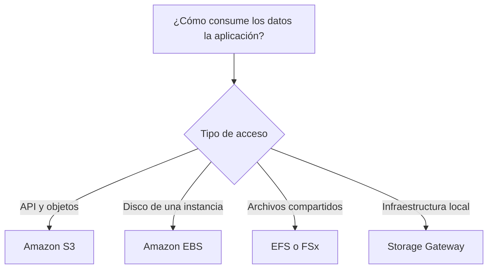

# Almacenamiento en AWS para el examen SAA-C03

## 1. Alcance necesario para el examen

La guía oficial de AWS incluye los siguientes servicios de almacenamiento:

- AWS Backup
- Amazon EBS
- Amazon EFS
- Amazon FSx, incluidos todos sus tipos
- Amazon S3
- Amazon S3 Glacier
- AWS Storage Gateway

También se deben conocer los servicios relacionados con migración y transferencia:

- AWS DataSync
- AWS Snow Family
- AWS Transfer Family

El examen evalúa principalmente la capacidad de elegir una solución según:

- Tipo de acceso: objetos, bloques o archivos.
- Frecuencia de acceso y tiempo de recuperación.
- Persistencia y durabilidad.
- Alcance de disponibilidad: host, zona de disponibilidad o región.
- Rendimiento: IOPS, throughput y latencia.
- Acceso compartido o exclusivo.
- Requisitos de respaldo, replicación y recuperación ante desastres.
- Integración híbrida entre infraestructura local y AWS.
- Costo de almacenamiento, solicitudes, transferencia y recuperación.

---

## 2. Modelos fundamentales de almacenamiento

| Modelo | Organización | Acceso habitual | Servicio principal | Uso típico |
|---|---|---|---|---|
| Objetos | Objetos con clave y metadatos | API HTTP/HTTPS | Amazon S3 | Archivos estáticos, copias de seguridad, contenido, logs y data lakes |
| Bloques | Bloques presentados como disco | Sistema operativo y sistema de archivos | Amazon EBS | Discos de EC2, bases de datos y volúmenes de arranque |
| Archivos | Directorios y archivos jerárquicos | NFS o SMB | Amazon EFS y Amazon FSx | Sistemas de archivos compartidos |
| Local temporal | Disco físico del host EC2 | Bloques locales | EC2 Instance Store | Caché, buffers y datos temporales |
| Híbrido | Archivos, volúmenes o cintas locales respaldados por AWS | NFS, SMB, iSCSI o VTL | AWS Storage Gateway | Integrar aplicaciones locales con almacenamiento en AWS |

### Regla mental inicial

---

## 3. Amazon S3: almacenamiento de objetos

Amazon S3 es almacenamiento de objetos regional, altamente escalable y accesible mediante API. No es un disco de bloques ni un sistema de archivos tradicional.

### Características que se deben recordar

- Los datos se almacenan en **buckets** como **objetos** identificados por una clave.
- S3 ofrece consistencia fuerte después de operaciones de escritura y eliminación.
- S3 Standard y la mayoría de las clases distribuyen los datos en un mínimo de tres zonas de disponibilidad.
- Está diseñado para una durabilidad de `99.999999999 %` -once nueves- por objeto.
- Escala sin aprovisionar capacidad.
- Es adecuado para contenido estático, copias de seguridad, logs, archivos multimedia, artefactos y data lakes.
- Para cargas grandes se recomienda **Multipart Upload**, generalmente desde 100 MB.
- No se debe seleccionar S3 cuando la aplicación necesita un disco de arranque, acceso de bloques o semántica completa de un sistema de archivos.

### Clases de almacenamiento de S3

| Clase | Patrón de acceso | AZ | Acceso/recuperación | Duración mínima | Punto clave para el examen |
|---|---:|---:|---|---:|---|
| **S3 Standard** | Frecuente | ≥ 3 | Milisegundos | Ninguna | Opción predeterminada para datos activos |
| **S3 Intelligent-Tiering** | Desconocido o cambiante | ≥ 3 | Milisegundos en niveles automáticos | Ninguna | Mueve objetos entre niveles según el acceso; cobra monitoreo por objeto, pero no recuperación |
| **S3 Standard-IA** | Aproximadamente una vez al mes | ≥ 3 | Milisegundos | 30 días | Datos importantes e infrecuentes; cobra recuperación |
| **S3 One Zone-IA** | Infrecuente y recreable | 1 | Milisegundos | 30 días | Más barato, pero no resiste la pérdida de la AZ |
| **S3 Express One Zone** | Muy frecuente y sensible a latencia | 1 | Milisegundos de un solo dígito | Ninguna | Alto rendimiento dentro de una AZ; no es Multi-AZ |
| **S3 Glacier Instant Retrieval** | Archivo consultado aproximadamente una vez por trimestre | ≥ 3 | Milisegundos | 90 días | Archivo con acceso inmediato; cobra recuperación |
| **S3 Glacier Flexible Retrieval** | Archivo consultado aproximadamente una vez al año | ≥ 3 | Minutos u horas | 90 días | Requiere restaurar antes de leer |
| **S3 Glacier Deep Archive** | Menos de una vez al año | ≥ 3 | Horas | 180 días | Menor costo para retención prolongada; requiere restaurar |

### Tiempos de recuperación de Glacier

| Clase | Opción | Tiempo típico |
|---|---|---:|
| Glacier Instant Retrieval | `GET` directo | Milisegundos |
| Glacier Flexible Retrieval | Expedited | 1–5 minutos |
| Glacier Flexible Retrieval | Standard | 3–5 horas |
| Glacier Flexible Retrieval | Bulk | 5–12 horas |
| Glacier Deep Archive | Standard | Dentro de 12 horas |
| Glacier Deep Archive | Bulk | Dentro de 48 horas |

> **Trampa de examen:** Glacier Instant Retrieval permite leer directamente. Glacier Flexible Retrieval y Deep Archive necesitan una operación de restauración antes de acceder al objeto.

### Consideraciones de costo

- Standard-IA y One Zone-IA tienen duración mínima de 30 días y tamaño facturable mínimo de 128 KB.
- Glacier Instant Retrieval tiene duración mínima de 90 días y tamaño facturable mínimo de 128 KB.
- Glacier Flexible Retrieval y Deep Archive agregan metadatos facturables por objeto.
- Las clases IA y Glacier pueden cobrar por recuperación.
- Muchos objetos pequeños pueden costar más de lo esperado por solicitudes, monitoreo o tamaños mínimos.
- La clase con menor precio por GB no siempre produce el menor costo total.

### S3 Intelligent-Tiering

- Los objetos comienzan en **Frequent Access**.
- Después de 30 días sin acceso pasan automáticamente a **Infrequent Access**.
- Después de 90 días sin acceso pasan a **Archive Instant Access**, manteniendo acceso en milisegundos.
- Opcionalmente se pueden habilitar:
  - **Archive Access**, desde 90 días, con recuperación equivalente a Glacier Flexible Retrieval.
  - **Deep Archive Access**, desde 180 días, equivalente a Glacier Deep Archive.
- Los objetos menores de 128 KB permanecen en Frequent Access y no se supervisan para cambio automático.

**Elegir Intelligent-Tiering cuando:** el patrón de acceso es impredecible o cambia con el tiempo.

### Funciones de protección y administración de S3

#### Versioning

- Conserva varias versiones de un objeto.
- Permite recuperarse de sobrescrituras y eliminaciones accidentales.
- Una eliminación normal crea un **delete marker**; no necesariamente destruye las versiones anteriores.
- Suspender versioning no elimina las versiones ya existentes.

#### Lifecycle

- Transiciona objetos o versiones anteriores hacia clases de menor costo.
- Expira objetos o versiones antiguas automáticamente.
- Puede abortar cargas multipart incompletas.
- Se usa para reducir costos según la edad y el patrón de acceso.

#### Replicación

- **SRR:** replica a otro bucket en la misma región.
- **CRR:** replica a otra región.
- Es asíncrona.
- Requiere versioning en los buckets de origen y destino.
- Las reglas normales cubren nuevos objetos; para objetos existentes se utiliza **S3 Batch Replication**.
- Es útil para cumplimiento, aislamiento entre cuentas, menor latencia o recuperación ante desastres.

#### Object Lock

- Implementa WORM: *Write Once, Read Many*.
- Requiere versioning.
- **Governance mode:** usuarios con permisos especiales pueden omitir la retención.
- **Compliance mode:** una versión protegida no puede eliminarse durante la retención, ni siquiera por el usuario raíz.
- **Legal hold:** protege sin una fecha fija hasta que se retire el bloqueo.

#### Seguridad

- **Block Public Access** ayuda a evitar exposición pública accidental.
- El acceso se controla con IAM, bucket policies, access points y ACL cuando sea necesario.
- Las URL prefirmadas proporcionan acceso temporal a objetos privados.
- S3 cifra automáticamente los nuevos objetos con SSE-S3; también se debe conocer SSE-KMS, DSSE-KMS, SSE-C y cifrado del lado del cliente.
- SSE-KMS permite control y auditoría mediante KMS, pero introduce permisos, cuotas y costos de solicitudes KMS.

### Funciones de rendimiento y distribución

- **Multipart Upload:** partes paralelas para cargas grandes; recomendado desde aproximadamente 100 MB.
- **S3 Transfer Acceleration:** usa ubicaciones de borde para acelerar transferencias por internet a larga distancia.
- **CloudFront:** distribuye y almacena en caché contenido cerca de los usuarios; no reemplaza a S3 como origen.
- **S3 presigned URL:** acceso temporal directo sin hacer público el bucket.

---

## 4. Amazon EBS: almacenamiento de bloques persistente

Amazon Elastic Block Store proporciona volúmenes de bloques persistentes para EC2. El sistema operativo los administra como discos.

### Características clave

- Un volumen EBS se crea en una **zona de disponibilidad**.
- La instancia y el volumen deben estar en la misma AZ para conectarse.
- Normalmente un volumen se conecta a una instancia.
- **Multi-Attach** está disponible para volúmenes Provisioned IOPS compatibles, bajo condiciones específicas y dentro de la misma AZ.
- Los datos persisten al detener o reiniciar la instancia.
- El comportamiento al terminar la instancia depende de `DeleteOnTermination`.
- Se puede cambiar capacidad, tipo y rendimiento mediante Elastic Volumes, según las restricciones aplicables.
- EBS puede cifrar volúmenes, snapshots y datos en tránsito entre instancias compatibles y el volumen.

### Tipos de volúmenes EBS

| Tipo | Tecnología | Optimizado para | Uso típico | Punto clave |
|---|---|---|---|---|
| **gp3** | SSD | Precio/rendimiento general | Boot, aplicaciones, desarrollo y bases de datos comunes | IOPS y throughput se configuran independientemente del tamaño; opción general preferida |
| **gp2** | SSD | Uso general heredado | Cargas existentes | El rendimiento aumenta con el tamaño del volumen |
| **io2 / io2 Block Express** | SSD | IOPS altas, latencia baja y alta durabilidad | Bases de datos críticas y cargas transaccionales | Mayor rendimiento y consistencia; admite Multi-Attach en configuraciones compatibles |
| **io1** | SSD | IOPS provisionadas heredadas | Bases de datos que ya lo utilizan | Generalmente se prefiere io2 para diseños nuevos |
| **st1** | HDD | Throughput secuencial alto | Big data, logs y data warehouse | No sirve como volumen de arranque; no elegir para I/O aleatoria |
| **sc1** | HDD | Menor costo para acceso poco frecuente | Datos fríos con lectura secuencial | No sirve como volumen de arranque; menor rendimiento |
| **standard** | Magnético | Cargas heredadas | Sistemas antiguos | Generación anterior |

### Regla SSD frente a HDD

- **SSD:** elegir cuando importan IOPS, latencia y operaciones pequeñas o aleatorias.
- **HDD:** elegir para archivos grandes y operaciones secuenciales donde importa el throughput.
- `st1` y `sc1` no se pueden utilizar como volúmenes de arranque.

### Snapshots de EBS

- Son copias en un punto del tiempo.
- Son incrementales: después del primero se guardan únicamente los bloques modificados.
- Aunque sean incrementales, cada snapshot puede restaurar un volumen completo.
- Son recursos regionales administrados por AWS y se pueden usar para crear volúmenes en cualquier AZ de esa región.
- Se pueden copiar entre regiones o cuentas para recuperación ante desastres.
- **Fast Snapshot Restore** evita la penalización de inicialización al crear determinados volúmenes desde snapshots.
- **Amazon Data Lifecycle Manager** automatiza snapshots EBS y AMI respaldadas por EBS.

### Casos de examen

- Disco raíz o de datos para EC2 → **EBS**.
- Base de datos con IOPS críticas y latencia consistente → **io2**.
- Volumen general y económico → **gp3**.
- Procesamiento secuencial de grandes logs → **st1**.
- Mover un volumen a otra AZ → crear snapshot y restaurar un volumen en la AZ destino.
- Recuperación en otra región → copiar el snapshot a la región destino y crear el volumen.

---

## 5. EC2 Instance Store: almacenamiento local temporal

Instance Store proporciona bloques en discos físicamente conectados al host de EC2.

### Características

- Muy baja latencia y alto rendimiento local.
- La cantidad y el tipo dependen de la familia de instancia.
- Los datos sobreviven a un reinicio de la instancia.
- Los datos se pierden al detener, hibernar o terminar la instancia, al cambiar el tipo o ante determinadas fallas del host.
- No se puede desacoplar y conectar el volumen a otra instancia.
- No tiene snapshots administrados como EBS.

### Usos correctos

- Caché.
- Buffers.
- Datos temporales o *scratch*.
- Resultados intermedios.
- Datos replicados en varios nodos.

> **Trampa de examen:** nunca elegir Instance Store como única copia de datos importantes.

---

## 6. Amazon EFS: sistema de archivos compartido para Linux

Amazon Elastic File System es un sistema de archivos NFS administrado, elástico y compartido.

### Características

- Utiliza NFS y semántica de archivos POSIX.
- Es la opción habitual para múltiples instancias Linux que deben compartir archivos.
- Crece y disminuye automáticamente; no se aprovisiona la capacidad del sistema de archivos.
- Puede montarse desde EC2 y utilizarse con servicios como ECS, EKS y Lambda.
- Se accede mediante **mount targets** ubicados en subredes y protegidos con security groups.
- Admite cifrado en reposo y en tránsito.
- Los **EFS Access Points** proporcionan identidades y directorios de entrada específicos para aplicaciones.

### Tipo regional frente a One Zone

| Tipo | Resiliencia | Uso |
|---|---|---|
| **Regional** | Datos distribuidos entre varias AZ | Producción y cargas que requieren alta disponibilidad |
| **One Zone** | Datos dentro de una AZ | Desarrollo, datos recreables o cargas tolerantes a la pérdida de la AZ |

### Clases de almacenamiento EFS

- **EFS Standard:** archivos activos, menor latencia.
- **EFS Infrequent Access (IA):** archivos poco consultados; cobra por acceso.
- **EFS Archive:** archivos regionales consultados muy pocas veces; menor costo y mayor latencia.
- **EFS One Zone:** datos activos en una sola AZ.
- **EFS One Zone-IA:** datos infrecuentes en una sola AZ.
- Lifecycle Management mueve archivos según el tiempo transcurrido desde su último acceso.

### Modos de rendimiento

- **General Purpose:** menor latencia; recomendado para la mayoría de aplicaciones.
- **Max I/O:** mayor paralelismo agregado, a cambio de mayor latencia por operación; útil para cargas altamente paralelas compatibles.

### Modos de throughput

- **Elastic:** AWS ajusta automáticamente el throughput; opción recomendada para cargas variables.
- **Bursting:** el throughput crece con el tamaño y utiliza créditos.
- **Provisioned:** se configura throughput independientemente del tamaño almacenado.

### Casos de examen

- Varias instancias Linux necesitan el mismo directorio → **EFS**.
- Contenido web compartido por un Auto Scaling Group → **EFS**.
- Carga Linux con archivos compartidos que escala automáticamente → **EFS Regional**.
- Archivos recreables y sensibles al costo en una sola AZ → **EFS One Zone**.

---

## 7. Amazon FSx: sistemas de archivos especializados

FSx ofrece sistemas de archivos administrados basados en tecnologías conocidas.

| Tipo de FSx | Protocolos/características | Uso principal | Palabras clave del examen |
|---|---|---|---|
| **FSx for Windows File Server** | SMB, Windows ACL, Active Directory, DFS y entorno Windows nativo | Aplicaciones Windows y comparticiones corporativas | Windows, SMB, NTFS, Active Directory |
| **FSx for Lustre** | Sistema de archivos paralelo de alto rendimiento e integración con S3 | HPC, machine learning, análisis, modelado financiero y procesamiento multimedia | HPC, throughput masivo, procesamiento paralelo, S3 |
| **FSx for NetApp ONTAP** | NFS, SMB e iSCSI; multiprotocolo, snapshots, clones, deduplicación, compresión y tiering | Migraciones NetApp y almacenamiento empresarial multiprotocolo | ONTAP, SnapMirror, NFS + SMB, iSCSI |
| **FSx for OpenZFS** | NFS, snapshots, clones y compresión de ZFS | Aplicaciones Linux/ZFS que requieren baja latencia y funciones ZFS | OpenZFS, NFS, snapshots y clones |

### FSx for Windows File Server

- Sistema Windows completamente administrado.
- Integración con AWS Managed Microsoft AD o Active Directory autoadministrado.
- Soporta autenticación y permisos de archivos basados en identidades de AD.
- **Multi-AZ** es la elección habitual para producción.
- **Single-AZ** es apropiado para desarrollo o aplicaciones con su propia redundancia.

### FSx for Lustre

- Diseñado para procesamiento paralelo de grandes conjuntos de datos.
- Puede presentar objetos de un bucket S3 como archivos y exportar resultados a S3.
- **Scratch:** procesamiento temporal, sin la durabilidad de un sistema persistente.
- **Persistent:** almacenamiento de mayor duración, replicación y soporte de backups.
- Elegirlo cuando EFS no proporciona el throughput paralelo requerido.

### FSx for NetApp ONTAP

- Soporta acceso NFS, SMB e iSCSI, incluido acceso NFS y SMB al mismo volumen.
- Permite migrar entornos NetApp con menor cambio mediante SnapMirror.
- Mueve datos fríos desde SSD hacia un nivel de capacidad de menor costo.
- Incluye funciones de eficiencia como compresión, compactación y deduplicación.

### FSx for OpenZFS

- Opción para aplicaciones basadas en Linux, NFS o ZFS.
- Proporciona snapshots y clones rápidos, compresión y baja latencia.
- Facilita migraciones desde servidores ZFS sin cambiar el modelo de archivos.

---

## 8. AWS Storage Gateway: almacenamiento híbrido

Storage Gateway conecta aplicaciones locales con almacenamiento administrado en AWS y conserva caché local cuando corresponde.

| Gateway | Interfaz local | Dónde queda el dato principal | Uso |
|---|---|---|---|
| **S3 File Gateway** | NFS o SMB | Objetos en S3 | Aplicaciones locales que necesitan una interfaz de archivos sobre S3 |
| **FSx File Gateway** | SMB | FSx for Windows File Server | Acceso local de baja latencia a archivos Windows en FSx |
| **Volume Gateway - Cached** | iSCSI | AWS; subconjunto activo en caché local | Reducir almacenamiento local manteniendo baja latencia para datos frecuentes |
| **Volume Gateway - Stored** | iSCSI | Local; backup asíncrono en AWS | Mantener todo el dataset local y obtener backups externos |
| **Tape Gateway** | VTL/iSCSI | Cintas virtuales; archivo en Glacier | Reemplazar infraestructura física de cintas sin cambiar el software de backup |

### Puntos clave

- S3 File Gateway crea una relación nativa entre archivos y objetos S3.
- La escritura se confirma en caché local y luego se carga asíncronamente a S3.
- Volume Gateway expone volúmenes de bloques iSCSI, no carpetas NFS/SMB.
- Tape Gateway trabaja con aplicaciones de backup que esperan una Virtual Tape Library.
- Las cintas expulsadas pueden archivarse en Glacier Flexible Retrieval o Deep Archive.

> **Nota vigente:** FSx File Gateway ya no está disponible para clientes nuevos, aunque los clientes existentes pueden seguir utilizándolo. Debe reconocerse su función porque continúa formando parte de la familia Storage Gateway.

### Storage Gateway frente a DataSync

- **Storage Gateway:** acceso híbrido continuo para aplicaciones.
- **DataSync:** movimiento o sincronización acelerada de datos.

---

## 9. AWS Backup

AWS Backup centraliza y automatiza la protección de datos de múltiples servicios AWS.

### Conceptos

- **Backup plan:** frecuencia, ventana, retención, lifecycle y reglas de copia.
- **Backup selection:** recursos protegidos, seleccionados directamente o por etiquetas.
- **Backup vault:** contenedor lógico para puntos de recuperación.
- **Recovery point:** copia recuperable de un recurso.

### Funciones importantes

- Políticas centralizadas y programadas.
- Copias entre regiones para recuperación ante desastres.
- Copias entre cuentas para aislamiento frente a errores o compromisos de la cuenta de producción.
- Lifecycle hacia almacenamiento frío cuando el tipo de recurso lo admite.
- **Vault Lock** para impedir cambios o eliminaciones no autorizadas.
- En **Compliance mode**, después del periodo de gracia, la configuración del bloqueo no puede alterarse mientras existan puntos de recuperación protegidos.
- Integración con AWS Organizations para administrar protección en varias cuentas.

### AWS Backup frente a Data Lifecycle Manager

| Servicio | Alcance | Elegir cuando |
|---|---|---|
| **AWS Backup** | Varios servicios AWS | Se necesita gobierno centralizado, varias cuentas, varias regiones o diferentes tipos de recurso |
| **Amazon Data Lifecycle Manager** | Snapshots EBS y AMI respaldadas por EBS | Solo se necesita automatizar el ciclo de vida de EBS/AMI |

---

## 10. Migración y transferencia de datos

### AWS DataSync

- Servicio de transferencia rápida y administrada para archivos y objetos.
- Mueve datos entre almacenamiento local y servicios AWS, o entre servicios AWS.
- Se utiliza con S3, EFS y FSx, entre otros endpoints compatibles.
- Automatiza programación, cifrado, validación de integridad y transferencias incrementales.
- Es adecuado para migraciones, replicaciones periódicas, protección de datos y procesamiento en AWS.

**Palabra clave:** transferencia en línea, rápida y automatizada de muchos archivos.

### AWS Transfer Family

- Proporciona endpoints administrados de **SFTP, FTPS, FTP, AS2** y transferencias mediante navegador.
- Guarda los datos en Amazon S3 o Amazon EFS.
- Permite conservar clientes y flujos tradicionales de intercambio de archivos.

**Palabra clave:** socios o aplicaciones que obligatoriamente utilizan SFTP/FTPS/FTP/AS2.

### AWS Snow Family

- Conceptualmente se usa para transferencias físicas cuando el volumen es muy grande, la conexión es lenta o el tiempo por red no cumple el plazo.
- Los dispositivos transportan datos cifrados y pueden ejecutar determinadas cargas en ubicaciones con conectividad limitada.
- Para preguntas tradicionales:
  - **Snowcone:** dispositivo pequeño y portátil.
  - **Snowball Edge:** transferencia de grandes volúmenes y capacidad de cómputo en el borde.
  - **Snowmobile:** migraciones extremadamente grandes.

> **Actualización 2026:** Snowball Edge ya no está disponible para clientes nuevos. AWS recomienda DataSync para transferencias en línea, AWS Data Transfer Terminal o soluciones de socios para transferencias físicas, y Outposts para cómputo en el borde. Sin embargo, AWS Snow Family continúa apareciendo en el alcance oficial del SAA-C03, por lo que se debe conocer el concepto.

### Comparación rápida

| Necesidad | Servicio |
|---|---|
| Transferir archivos/objetos por red de forma acelerada y programada | DataSync |
| Mantener acceso híbrido permanente con caché local | Storage Gateway |
| Exponer SFTP, FTPS, FTP o AS2 administrado | Transfer Family |
| Acelerar cargas de objetos S3 a larga distancia por internet | S3 Transfer Acceleration |
| Transferir un volumen masivo cuando la red no cumple el plazo | Snow Family como concepto de examen |

---

## 11. Matriz de decisión para preguntas del examen

| Requisito del escenario | Respuesta más probable |
|---|---|
| Objetos, contenido estático, logs, backups o data lake | S3 |
| Acceso frecuente y patrón estable | S3 Standard |
| Patrón impredecible o cambiante | S3 Intelligent-Tiering |
| Acceso infrecuente, milisegundos y resiliencia Multi-AZ | S3 Standard-IA |
| Datos infrecuentes, recreables y menor costo | S3 One Zone-IA |
| Archivo trimestral con acceso inmediato | S3 Glacier Instant Retrieval |
| Archivo anual recuperable en minutos u horas | S3 Glacier Flexible Retrieval |
| Retención de varios años al menor costo | S3 Glacier Deep Archive |
| Disco de arranque o datos de una instancia EC2 | EBS |
| Disco general con buena relación costo/rendimiento | EBS gp3 |
| Base de datos crítica con muchas IOPS | EBS io2 |
| Grandes lecturas/escrituras secuenciales | EBS st1 |
| Datos temporales con máximo rendimiento local | EC2 Instance Store |
| Archivos compartidos entre servidores Linux | EFS |
| Compartición de archivos Windows con SMB y AD | FSx for Windows File Server |
| HPC, ML o procesamiento paralelo de un dataset S3 | FSx for Lustre |
| Migración NetApp o acceso NFS, SMB e iSCSI | FSx for NetApp ONTAP |
| Aplicación OpenZFS o NFS con funciones ZFS | FSx for OpenZFS |
| Aplicación local NFS/SMB que debe guardar objetos en S3 | S3 File Gateway |
| Aplicación local iSCSI con datos primarios en AWS | Volume Gateway Cached |
| Aplicación local iSCSI con dataset completo local | Volume Gateway Stored |
| Reemplazar librería física de cintas | Tape Gateway |
| Copias centralizadas, entre cuentas y regiones | AWS Backup |
| Sincronización rápida por red hacia S3, EFS o FSx | DataSync |
| Endpoint administrado para SFTP | AWS Transfer Family |

---

## 12. Diferencias que suelen generar errores

### EBS frente a EFS

| EBS | EFS |
|---|---|
| Bloques | Archivos |
| Asociado a una AZ | Regional Multi-AZ o One Zone |
| Normalmente para una instancia | Compartido por muchos clientes |
| Capacidad aprovisionada | Capacidad elástica |
| Boot, aplicaciones y bases de datos | Contenido compartido, directorios y aplicaciones Linux |

### EFS frente a FSx for Windows

| EFS | FSx for Windows |
|---|---|
| NFS/POSIX | SMB/Windows |
| Principalmente Linux | Aplicaciones Windows |
| No requiere Active Directory | Integración con Active Directory |

### S3 frente a EFS

| S3 | EFS |
|---|---|
| Objetos mediante API | Sistema de archivos mediante NFS |
| No ofrece semántica POSIX completa | Ofrece directorios, permisos y semántica de archivos |
| Ideal para contenido, backup y data lakes | Ideal para aplicaciones Linux que comparten archivos |

### Replicación frente a backup

- La replicación mejora disponibilidad geográfica y distribuye copias, pero también puede propagar cambios no deseados.
- Versioning conserva estados anteriores de objetos.
- Un backup aplica políticas de retención y recuperación independientes.
- Para protección sólida se pueden combinar versioning, replicación entre cuentas y AWS Backup/Object Lock según los requisitos.

---

## 13. Estrategia para resolver preguntas SAA-C03

1. Identificar el modelo requerido: objeto, bloque o archivo.
2. Determinar si el dato debe ser persistente o puede perderse.
3. Identificar si el acceso es exclusivo, compartido o híbrido.
4. Buscar el protocolo: NFS, SMB, iSCSI, SFTP o API.
5. Determinar el patrón: frecuente, infrecuente, impredecible o archivo.
6. Comparar el tiempo de recuperación requerido: milisegundos, minutos u horas.
7. Revisar si se necesita tolerar la pérdida de una AZ o región.
8. Considerar costos de recuperación, solicitudes, duración mínima y transferencia.
9. Verificar requisitos de backup, inmutabilidad, RPO y RTO.
10. Elegir la solución más simple que cumpla todos los requisitos.

### Palabras clave

- **Objetos, estáticos, data lake, durabilidad:** S3.
- **Disco, boot, IOPS, bloques:** EBS.
- **Temporal, caché, scratch, host:** Instance Store.
- **Linux, NFS, compartido, elástico:** EFS.
- **Windows, SMB, Active Directory:** FSx for Windows.
- **HPC, paralelo, alto throughput:** FSx for Lustre.
- **NetApp, multiprotocolo, SnapMirror:** FSx for ONTAP.
- **ZFS, NFS, clones:** FSx for OpenZFS.
- **Cintas, VTL:** Tape Gateway.
- **Migración en línea:** DataSync.
- **SFTP/FTPS/FTP/AS2:** Transfer Family.
- **WORM, retención inmutable:** S3 Object Lock o AWS Backup Vault Lock.

---

## 14. Lista de comprobación final

- Diferenciar objeto, bloque y archivo.
- Elegir correctamente entre S3, EBS, EFS e Instance Store.
- Memorizar el caso de uso de cada clase de S3.
- Comprender duración mínima, recuperación y costo de las clases IA/Glacier.
- Diferenciar versioning, lifecycle, replication y Object Lock.
- Diferenciar gp3, io2, st1 y sc1.
- Recordar que EBS es de una AZ y sus snapshots son regionales.
- Recordar cuándo se pierde Instance Store.
- Diferenciar EFS Regional y One Zone.
- Reconocer los cuatro tipos de Amazon FSx.
- Diferenciar los tipos y modos de Storage Gateway.
- Diferenciar AWS Backup de Data Lifecycle Manager.
- Diferenciar Storage Gateway, DataSync, Transfer Family y Snow Family.

---

## Referencias oficiales

- [Guía oficial del examen AWS Certified Solutions Architect – Associate SAA-C03](https://docs.aws.amazon.com/pdfs/aws-certification/latest/solutions-architect-associate-03/solutions-architect-associate-03.pdf)
- [Servicios incluidos en el alcance del SAA-C03](https://docs.aws.amazon.com/aws-certification/latest/solutions-architect-associate-03/saa-03-in-scope-services.html)
- [Clases de almacenamiento de Amazon S3](https://docs.aws.amazon.com/AmazonS3/latest/userguide/storage-class-intro.html)
- [Funcionamiento de S3 Intelligent-Tiering](https://docs.aws.amazon.com/AmazonS3/latest/userguide/intelligent-tiering-overview.html)
- [Opciones de recuperación de S3 Glacier](https://docs.aws.amazon.com/AmazonS3/latest/userguide/restoring-objects-retrieval-options.html)
- [Tipos de volúmenes Amazon EBS](https://docs.aws.amazon.com/ebs/latest/userguide/ebs-volume-types.html)
- [Snapshots de Amazon EBS](https://docs.aws.amazon.com/ebs/latest/userguide/ebs-snapshots.html)
- [EC2 Instance Store](https://docs.aws.amazon.com/AWSEC2/latest/UserGuide/InstanceStorage.html)
- [Introducción a Amazon EFS](https://docs.aws.amazon.com/efs/latest/ug/whatisefs.html)
- [Documentación de Amazon FSx](https://docs.aws.amazon.com/fsx/)
- [Documentación de AWS Storage Gateway](https://docs.aws.amazon.com/storagegateway/)
- [AWS Backup Vault Lock](https://docs.aws.amazon.com/aws-backup/latest/devguide/vault-lock.html)
- [Introducción a AWS DataSync](https://docs.aws.amazon.com/datasync/latest/userguide/what-is-datasync.html)
- [Introducción a AWS Transfer Family](https://docs.aws.amazon.com/transfer/latest/userguide/what-is-aws-transfer-family.html)
- [Cambio de disponibilidad de AWS Snowball Edge](https://docs.aws.amazon.com/snowball/latest/developer-guide/snowball-edge-availability-change.html)
