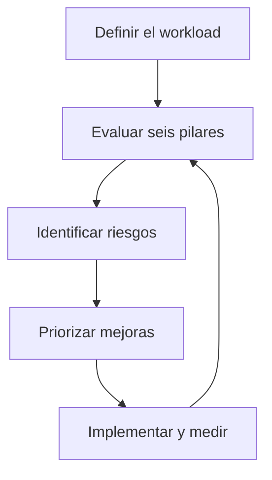
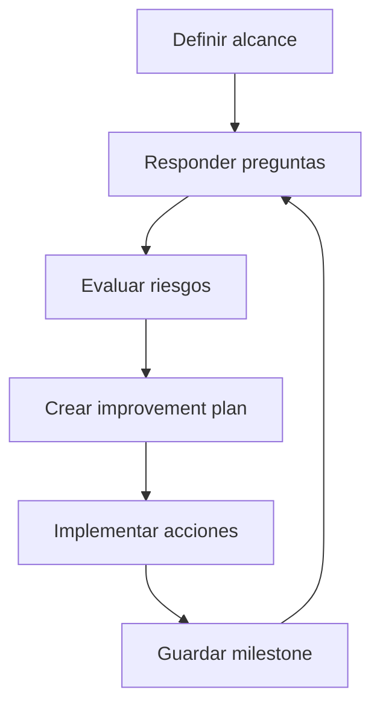

# AWS Well-Architected Framework para el examen SAA-C03

> Guía de estudio enfocada en los seis pilares, sus principios de diseño, el proceso de revisión y su aplicación en decisiones arquitectónicas del examen.
>
> Actualizado: julio de 2026.

## 1. Alcance necesario para el examen

AWS Well-Architected Framework proporciona un enfoque coherente para diseñar, evaluar y mejorar cargas de trabajo en AWS. Ayuda a comprender los beneficios, riesgos y compensaciones —*trade-offs*— de las decisiones arquitectónicas.

El SAA-C03 valida explícitamente la capacidad de diseñar soluciones basadas en AWS Well-Architected Framework. Para el examen se debe poder:

- Reconocer los seis pilares y su objetivo.
- Aplicar sus principios a escenarios técnicos.
- Identificar qué pilar se afecta por una decisión.
- Comprender que una misma decisión puede impactar varios pilares.
- Detectar riesgos, puntos únicos de fallo y capacidad ociosa.
- Elegir servicios y configuraciones según requisitos medibles.
- Revisar una arquitectura existente y proponer mejoras.
- Diferenciar el Framework del servicio AWS Well-Architected Tool.
- Comprender workload, lens, milestone, HRI, MRI e improvement plan.
- Priorizar mejoras según impacto de negocio, riesgo, esfuerzo y dependencias.

### Relación con los dominios del SAA-C03

| Dominio oficial | Ponderación | Pilares relacionados principalmente |
|---|---:|---|
| Diseñar arquitecturas seguras | 30 % | Seguridad y excelencia operativa |
| Diseñar arquitecturas resilientes | 26 % | Confiabilidad y excelencia operativa |
| Diseñar arquitecturas de alto rendimiento | 24 % | Eficiencia del rendimiento y confiabilidad |
| Diseñar arquitecturas optimizadas en costos | 20 % | Optimización de costos y sostenibilidad |

> **Regla de examen:** los dominios no están aislados. Por ejemplo, una arquitectura Multi-AZ afecta confiabilidad, costo, rendimiento de red y operación.

### Qué no se necesita memorizar

- Todos los códigos de preguntas y mejores prácticas, como `SEC03-BP02` o `REL11-BP03`.
- Todas las preguntas internas de cada lens.
- El procedimiento completo de la consola.
- Una lista exhaustiva de AWS Lenses.

Se debe comprender la intención de las prácticas y aplicarlas a escenarios.

---

## 2. Modelo fundamental de Well-Architected

### Definiciones esenciales

| Término | Significado |
|---|---|
| Componente | Código, configuración y recursos AWS que satisfacen un requisito |
| Workload | Conjunto de componentes que entrega valor de negocio |
| Arquitectura | Organización y relación entre componentes |
| Pilar | Dimensión de calidad utilizada para evaluar el workload |
| Best practice | Práctica recomendada para reducir riesgo o mejorar resultados |
| Lens | Conjunto de preguntas y prácticas para evaluar una tecnología o industria |
| Review | Conversación estructurada para evaluar decisiones y riesgos |
| Improvement plan | Acciones recomendadas para mejorar el workload |
| Milestone | Estado guardado del workload en un momento concreto |

### Los seis pilares

| Pilar | Pregunta principal | Resultado buscado |
|---|---|---|
| Excelencia operativa | ¿Se puede operar y mejorar eficazmente? | Cambios seguros, observabilidad y aprendizaje continuo |
| Seguridad | ¿Cómo se protegen datos, sistemas y activos? | Identidad sólida, defensa en profundidad y respuesta |
| Confiabilidad | ¿Puede funcionar y recuperarse ante fallos? | Disponibilidad, resiliencia y recuperación |
| Eficiencia del rendimiento | ¿Usa los recursos correctos eficientemente? | Rendimiento medido y adaptable |
| Optimización de costos | ¿Entrega valor al menor costo total? | Uso eficiente, atribución y mejora continua |
| Sostenibilidad | ¿Minimiza recursos e impacto por unidad de trabajo? | Mayor utilización y menor desperdicio |

### Regla mental inicial

> **Regla clave:** Well-Architected es un ciclo de mejora continua, no una validación que se completa una sola vez.

---

## 3. Principios generales de diseño

AWS define principios generales aplicables a todos los pilares.

### Dejar de adivinar las necesidades de capacidad

- Medir demanda y utilización.
- Aprovisionar capacidad según datos.
- Escalar horizontal o verticalmente cuando corresponda.
- Automatizar scale-out y scale-in.
- Revisar cuotas además de capacidad.

**Ejemplo de examen:** una aplicación presenta picos impredecibles → Auto Scaling, serverless o buffering son preferibles a una flota fija para el pico máximo.

### Probar sistemas a escala de producción

- Crear temporalmente ambientes comparables con producción.
- Ejecutar pruebas de carga, resiliencia y recuperación.
- Eliminar los recursos al finalizar.
- Validar no solo que el sistema funciona, sino cómo falla.

**Ejemplo:** restaurar backups en un entorno aislado y medir si se cumplen RTO y RPO.

### Automatizar pensando en la experimentación

- Definir infraestructura, configuración y procedimientos como código.
- Repetir experimentos con parámetros distintos.
- Auditar cambios.
- Revertir configuraciones.
- Evitar variaciones manuales entre ambientes.

### Permitir arquitecturas evolutivas

- Evitar diseños que solo pueden cambiar mediante proyectos masivos.
- Favorecer componentes desacoplados.
- Realizar cambios pequeños y reversibles.
- Revisar decisiones cuando cambian demanda, servicios y requisitos.

### Basar la arquitectura en datos

- Medir latencia, errores, throughput, disponibilidad, uso y costo.
- Formular hipótesis.
- Probar alternativas.
- Elegir mediante evidencia.
- Validar el impacto después del cambio.

> **Trampa de examen:** no escalar o cambiar un servicio únicamente por intuición si el escenario ofrece métricas que identifican otro cuello de botella.

### Mejorar mediante game days

- Simular fallos o eventos relevantes.
- Probar procedimientos y automatización.
- Observar comportamiento técnico y respuesta humana.
- Registrar aprendizajes.
- Corregir riesgos antes de un evento real.

### Resumen para memorizar

| Principio | Acción mental |
|---|---|
| No adivinar capacidad | Medir y escalar |
| Probar a escala | Crear, probar y eliminar |
| Automatizar experimentos | Infraestructura y operaciones como código |
| Evolucionar | Cambios pequeños y reversibles |
| Decidir con datos | Métricas antes y después |
| Game days | Simular fallos y aprender |

---

## 4. Pilar de excelencia operativa

### Definición

La excelencia operativa es la capacidad de desarrollar y ejecutar workloads eficazmente, obtener información sobre sus operaciones y mejorar continuamente los procesos para entregar valor de negocio.

### Áreas de mejores prácticas

| Área | Objetivo |
|---|---|
| Organization | Alinear equipos, prioridades y modelo operativo |
| Prepare | Diseñar telemetría, procedimientos y preparación operativa |
| Operate | Entender la salud y responder a eventos |
| Evolve | Aprender y mejorar continuamente |

### Principios de diseño

#### Organizar equipos alrededor de resultados de negocio

- Definir propietarios.
- Alinear objetivos técnicos con resultados del cliente.
- Compartir prioridades.
- Establecer KPIs operativos y de negocio.
- Asegurar apoyo de liderazgo.

#### Implementar observabilidad para obtener información accionable

- Recopilar métricas, logs y trazas.
- Correlacionar salud técnica con resultados de negocio.
- Crear alarmas accionables.
- Utilizar dashboards orientados a decisiones.
- Medir experiencia del usuario, no solo recursos.

#### Automatizar de forma segura donde sea posible

- Infraestructura como código.
- Configuración como código.
- Pipelines de despliegue.
- Respuestas automatizadas a eventos.
- Guardrails, límites, aprobaciones y rollback.

#### Realizar cambios frecuentes, pequeños y reversibles

- Reducir el blast radius.
- Utilizar rolling, blue/green o canary según el caso.
- Desacoplar componentes.
- Automatizar pruebas.
- Definir criterios de rollback.

#### Refinar procedimientos frecuentemente

- Actualizar runbooks y playbooks.
- Validar que reflejen la arquitectura actual.
- Entrenar a quienes los ejecutan.
- Automatizar pasos repetitivos.
- Incorporar aprendizajes.

#### Anticipar fallos

- Modelar escenarios.
- Ejecutar game days.
- Probar failover.
- Verificar cuotas y dependencias.
- Preparar procedimientos antes del incidente.

#### Aprender de todos los eventos y métricas

- Realizar análisis sin culpabilización.
- Revisar éxitos, incidentes y casi fallos.
- Compartir aprendizajes entre equipos.
- Convertir conclusiones en acciones medibles.

#### Utilizar servicios administrados

- Reducir tareas indiferenciadas.
- Mantener procedimientos para las responsabilidades que permanecen.
- No asumir que un servicio administrado elimina observabilidad, seguridad o costos.

### Señales de una arquitectura operacionalmente excelente

- Despliegues repetibles.
- Pocos cambios manuales.
- Alarmas con una acción asociada.
- Procedimientos probados.
- Propiedad clara de cada componente.
- Métricas técnicas y de negocio.
- Rollback automatizado.
- Cambios pequeños.
- Postmortems y mejora continua.

### Servicios relacionados

| Necesidad | Servicio o capacidad |
|---|---|
| Métricas, logs, dashboards y alarmas | Amazon CloudWatch |
| Auditoría de acciones API | AWS CloudTrail |
| Trazas distribuidas | AWS X-Ray u OpenTelemetry compatible |
| Infraestructura como código | AWS CloudFormation |
| Automatización operativa | AWS Systems Manager |
| Eventos de servicios | Amazon EventBridge |
| Estado y cumplimiento de configuración | AWS Config |
| Revisión de arquitectura | AWS Well-Architected Tool |

### Trampas de examen

- **Más logs** no significa automáticamente mejor observabilidad; deben permitir actuar.
- Un procedimiento escrito pero nunca probado no garantiza recuperación.
- Automatizar sin límites puede ampliar el impacto de un error.
- La excelencia operativa no consiste únicamente en monitoreo; incluye organización, preparación, operación y evolución.

---

## 5. Pilar de seguridad

### Definición

El pilar de seguridad describe cómo utilizar tecnologías de nube para proteger datos, sistemas y activos, mejorando la postura de seguridad.

### Áreas de mejores prácticas

| Área | Objetivo |
|---|---|
| Security foundations | Gobierno, cuentas, responsabilidades y preparación |
| Identity and access management | Identidades, autenticación y autorización |
| Detection | Registro, monitoreo y detección de eventos |
| Infrastructure protection | Protección de redes y recursos |
| Data protection | Clasificación, cifrado, acceso y ciclo de vida |
| Incident response | Preparación, investigación, contención y recuperación |
| Application security | Seguridad durante diseño, desarrollo y entrega |

### Principios de diseño

#### Implementar una base de identidad sólida

- Centralizar identidad humana.
- Utilizar credenciales temporales.
- Aplicar menor privilegio.
- Separar funciones.
- Proteger el usuario raíz.
- Utilizar MFA.

#### Mantener trazabilidad

- Registrar acciones.
- Centralizar logs.
- Protegerlos contra modificación.
- Detectar cambios y comportamientos anómalos.
- Conservar evidencia según cumplimiento.

#### Aplicar seguridad en todas las capas

- Edge.
- DNS.
- Red.
- Balanceadores.
- Cómputo.
- Sistema operativo.
- Aplicación.
- Datos.

Esto implementa defensa en profundidad: si falla un control, otros continúan reduciendo riesgo.

#### Automatizar prácticas de seguridad

- Policies as code.
- Infraestructura segura por defecto.
- Escaneo en pipelines.
- Remediación automatizada bajo guardrails.
- Controles preventivos y detectivos a escala.

#### Proteger datos en tránsito y en reposo

- Clasificar datos.
- Utilizar TLS.
- Seleccionar claves y permisos.
- Rotar claves y certificados cuando corresponda.
- Aplicar controles de acceso además de cifrado.

#### Mantener a las personas alejadas de los datos

- Evitar acceso directo innecesario.
- Automatizar procesamiento.
- Enmascarar o tokenizar.
- Utilizar acceso temporal y auditado.
- Reducir operaciones manuales sobre datos sensibles.

#### Prepararse para eventos de seguridad

- Definir funciones y contactos.
- Crear playbooks.
- Preparar acceso de investigación.
- Centralizar evidencia.
- Simular incidentes.
- Automatizar detección, contención y recuperación.

### Modelo de responsabilidad compartida

| AWS: seguridad de la nube | Cliente: seguridad en la nube |
|---|---|
| Centros de datos | Clasificación y acceso a datos |
| Hardware | Identidades y permisos |
| Infraestructura física | Configuración de red |
| Capa de virtualización administrada | Configuración de servicios |
| Infraestructura global | Código y vulnerabilidades de aplicación |

La distribución exacta cambia según el servicio:

- En EC2, el cliente administra más capas.
- En RDS, AWS administra SO y motor subyacente, pero el cliente administra datos, usuarios y configuración.
- En servicios serverless, AWS administra más infraestructura, pero el cliente continúa administrando código, permisos, configuración y datos.

### Decisiones frecuentes del SAA-C03

| Requisito | Respuesta arquitectónica |
|---|---|
| Acceso humano centralizado | IAM Identity Center y federación |
| Acceso de workload | IAM role y credenciales temporales |
| Acceso entre cuentas | Role con trust policy y permisos mínimos |
| Límite para cuentas miembro | SCP |
| Secreto con rotación | AWS Secrets Manager |
| Cifrado y control de claves | AWS KMS |
| TLS público administrado | AWS Certificate Manager |
| Protección de aplicaciones HTTP | AWS WAF |
| Protección DDoS | AWS Shield y arquitectura resiliente |
| Detección de amenazas | Amazon GuardDuty |
| Clasificación de datos S3 | Amazon Macie |
| Hallazgos consolidados | AWS Security Hub |

### Trampas de examen

- Una SCP no concede permisos.
- Un security group no reemplaza autenticación y autorización.
- Una subnet privada no garantiza por sí sola seguridad.
- Cifrar datos no corrige permisos excesivos.
- Las access keys de larga duración no son la opción preferida para workloads.
- El usuario raíz no se utiliza para operación diaria.

---

## 6. Pilar de confiabilidad

### Definición

La confiabilidad es la capacidad de un workload para realizar su función prevista correctamente y de forma consistente cuando se espera. Incluye operar, probar y recuperarse a lo largo del ciclo de vida.

### Áreas de mejores prácticas

| Área | Objetivo |
|---|---|
| Foundations | Cuotas, restricciones y topología de red |
| Workload Architecture | Límites, desacoplamiento y diseño distribuido |
| Change Management | Monitoreo, escalado y cambios controlados |
| Failure Management | Detección, recuperación, backup y DR |

### Principios de diseño

#### Recuperarse automáticamente de fallos

- Monitorear indicadores.
- Ejecutar health checks.
- Reemplazar componentes no saludables.
- Enrutar hacia recursos sanos.
- Automatizar healing.

#### Probar procedimientos de recuperación

- Restaurar backups.
- Simular pérdida de componentes.
- Probar failover.
- Medir RTO y RPO.
- Validar dependencias y procedimientos humanos.

#### Escalar horizontalmente

- Reemplazar un recurso grande por varios más pequeños cuando sea posible.
- Distribuir solicitudes.
- Reducir el impacto de una falla individual.
- Evitar que las réplicas compartan el mismo dominio de fallo.

#### Dejar de adivinar capacidad

- Escalar según demanda.
- Utilizar buffers.
- Revisar cuotas.
- Evitar saturación y sobreaprovisionamiento.
- Probar el comportamiento durante picos.

#### Administrar cambios mediante automatización

- Aplicar cambios con pipelines e IaC.
- Registrar versiones.
- Utilizar infraestructura inmutable cuando corresponda.
- Probar y revertir.
- Reducir configuración divergente.

### Conceptos esenciales

| Concepto | Significado |
|---|---|
| Disponibilidad | Probabilidad de que el servicio esté accesible |
| Durabilidad | Probabilidad de conservar los datos |
| Resiliencia | Capacidad de resistir o recuperarse de interrupciones |
| Tolerancia a fallos | Continuar operando durante un fallo |
| RTO | Tiempo máximo aceptable para restaurar el servicio |
| RPO | Cantidad máxima de datos, medida en tiempo, que se acepta perder |

### Patrones de confiabilidad

- Multi-AZ.
- Auto Scaling y reemplazo automático.
- Health checks y failover.
- Estado externalizado.
- Colas y desacoplamiento.
- Idempotencia.
- Timeouts.
- Reintentos limitados con *backoff* y *jitter*.
- DLQ.
- Bulkheads y aislamiento.
- Replicación.
- Backups.
- Infraestructura como código.
- DR Multi-Region cuando lo exige el negocio.

### Alcance del fallo

| Requisito | Diseño |
|---|---|
| Tolerar fallo de proceso | Réplicas y reinicio |
| Tolerar fallo de host | Reemplazo automático |
| Tolerar fallo de AZ | Multi-AZ |
| Tolerar fallo regional | Multi-Region |
| Recuperar eliminación o corrupción | Versionado, PITR o backup |

### Alta disponibilidad frente a recuperación

- Multi-AZ suele resolver disponibilidad ante fallos zonales.
- Multi-Region suele relacionarse con DR regional o servicio global.
- Un backup no proporciona failover inmediato.
- Replicación no reemplaza el backup frente a corrupción o eliminación replicada.
- Una segunda región no sirve si carece de datos, configuración, cuotas o procedimiento de tráfico.

### Trampas de examen

- RDS Multi-AZ DB instance tradicional no se elige para escalar lecturas.
- Una Read Replica no equivale al failover Multi-AZ.
- Múltiples instancias en una sola AZ no toleran pérdida zonal.
- Auto Scaling no protege datos almacenados únicamente en disco local.
- El backup solo es confiable cuando se puede restaurar dentro de los objetivos.

---

## 7. Pilar de eficiencia del rendimiento

### Definición

La eficiencia del rendimiento es la capacidad de utilizar recursos de cómputo eficientemente para cumplir requisitos y mantener esa eficiencia cuando cambian la demanda y la tecnología.

### Áreas de enfoque

| Área | Decisión |
|---|---|
| Architecture selection | Elegir el patrón y servicio adecuados |
| Compute and hardware | Familia, tamaño, acelerador y modelo de ejecución |
| Data management | Tipo de almacenamiento, base y patrón de acceso |
| Networking and content delivery | Topología, ancho de banda, latencia y edge |
| Process and culture | Medir, probar y adoptar mejoras |

### Principios de diseño

#### Democratizar tecnologías avanzadas

- Consumir bases, analítica, ML o procesamiento como servicios administrados.
- Evitar que cada equipo opere infraestructura especializada.
- Enfocar esfuerzo en el resultado de negocio.

#### Alcanzar escala global en minutos

- Desplegar cerca de usuarios cuando los requisitos lo justifican.
- Utilizar edge, CDN o aceleración.
- Considerar residencia de datos, consistencia, costo y operación.

> **Trampa de examen:** “usuarios globales” no implica automáticamente una aplicación activa en muchas regiones. CloudFront o Global Accelerator pueden satisfacer el requisito con menor complejidad.

#### Utilizar arquitecturas serverless

- Reducir administración de hosts.
- Escalar por demanda.
- Pagar por consumo.
- Mantener control de cuotas, concurrencia y dependencias.

#### Experimentar con mayor frecuencia

- Comparar familias, tamaños y configuraciones.
- Ejecutar benchmarks.
- Probar con datos representativos.
- Adoptar servicios o versiones más eficientes.

#### Considerar mechanical sympathy

Seleccionar tecnología alineada con el comportamiento real:

- SSD para I/O aleatorio y baja latencia.
- HDD para throughput secuencial.
- Base relacional para relaciones y transacciones.
- Clave-valor para acceso por clave a gran escala.
- Almacenamiento columnar para analítica.
- Caché para lecturas repetidas.

### Rendimiento medible

| Dimensión | Métricas |
|---|---|
| Usuario | Latencia p50, p95, p99 y errores |
| Cómputo | CPU, memoria, concurrencia y duración |
| Almacenamiento | IOPS, throughput, latencia y queue depth |
| Base de datos | Consultas, conexiones, locks, lag e I/O |
| Red | Ancho de banda, paquetes, latencia y pérdida |
| Streaming | Throughput, lag e iterator age |
| Caché | Hit ratio, evictions y latencia |

### Proceso correcto

1. Definir el objetivo.
2. Medir la línea base.
3. Identificar el cuello de botella.
4. Probar una alternativa.
5. Medir el resultado.
6. Revisar costos y efectos secundarios.
7. Adoptar o revertir.

### Trampas de examen

- Seleccionar la instancia más grande sin medir.
- Escalar web servers cuando el cuello de botella está en la base.
- Agregar caché sin considerar invalidación.
- Utilizar CPU como única métrica para una cola.
- Confundir rendimiento con alta disponibilidad.
- Seleccionar un servicio por popularidad y no por patrón de acceso.

---

## 8. Pilar de optimización de costos

### Definición

La optimización de costos consiste en ejecutar workloads que entregan valor al menor precio total posible, cumpliendo requisitos funcionales y no funcionales.

### Áreas de enfoque

| Área | Objetivo |
|---|---|
| Practice Cloud Financial Management | Crear responsabilidad y capacidad financiera |
| Expenditure and usage awareness | Comprender y atribuir costos |
| Cost-effective resources | Elegir servicios, tamaños y precios adecuados |
| Manage demand and supply resources | Ajustar oferta y modificar demanda |
| Optimize over time | Revisar y mejorar continuamente |

### Principios de diseño

#### Implementar Cloud Financial Management

- Integrar finanzas, negocio y tecnología.
- Definir propietarios.
- Establecer presupuestos y previsiones.
- Medir valor y no solo gasto.
- Crear una cultura consciente del costo.

#### Adoptar un modelo de consumo

- Pagar por lo utilizado.
- Apagar ambientes sin uso.
- Escalar hacia arriba y hacia abajo.
- Utilizar serverless cuando corresponde.
- Evitar capacidad fija para picos esporádicos.

#### Medir eficiencia general

- Relacionar costo con resultados.
- Costo por solicitud.
- Costo por cliente.
- Costo por transacción.
- Costo por GB procesado.
- Costo por ambiente o producto.

#### Dejar de gastar en tareas indiferenciadas

- Utilizar servicios administrados cuando reducen operación total.
- Considerar licencias y esfuerzo humano.
- Automatizar mantenimiento repetitivo.
- Concentrarse en capacidades que diferencian el negocio.

#### Analizar y atribuir gastos

- Cuentas.
- Tags de asignación.
- Cost Categories.
- Consolidated billing.
- Reportes de uso.
- Propietarios y centros de costo.

### Palancas de optimización

| Palanca | Ejemplo |
|---|---|
| Rightsizing | Ajustar instancia, volumen o capacidad |
| Elasticidad | Auto Scaling o serverless |
| Compromiso | Savings Plans o Reserved Instances compatibles |
| Capacidad interrumpible | Spot |
| Ciclo de vida | S3 Lifecycle y archivado |
| Modelo de datos | Parquet y particiones para reducir escaneo |
| Arquitectura | Cola para suavizar picos |
| Red | VPC endpoints y rutas que evitan transferencia innecesaria |
| Operación | Apagado programado y eliminación de recursos |

### Costo total

No evaluar únicamente el precio principal:

- Transferencia entre AZ.
- Transferencia entre regiones.
- Procesamiento de NAT Gateway.
- Solicitudes.
- Recuperación de almacenamiento.
- Logs y retención.
- KMS.
- Licencias.
- Backups.
- Operación humana.
- Downtime.

### Trampas de examen

- La opción más barata deja de ser correcta si incumple un requisito.
- Comprar compromisos sin una línea base puede generar desperdicio.
- Spot no es adecuado como única capacidad para workloads no interrumpibles.
- Una clase S3 con menor precio por GB puede tener recuperación y duración mínima.
- Reducir redundancia puede ahorrar, pero afectar RTO, RPO o disponibilidad.

---

## 9. Pilar de sostenibilidad

### Definición

La sostenibilidad busca minimizar el impacto ambiental de ejecutar workloads mediante una utilización eficiente y una reducción de recursos consumidos por unidad de trabajo.

### Áreas de mejores prácticas

| Área | Objetivo |
|---|---|
| Region selection | Considerar negocio y objetivos de sostenibilidad |
| Alignment to demand | Ajustar recursos y niveles de servicio a la demanda |
| Software and architecture | Reducir trabajo y componentes innecesarios |
| Data management | Almacenar, mover y conservar solo lo necesario |
| Hardware and services | Utilizar hardware y servicios eficientes |
| Process and culture | Medir, aprender y adoptar mejoras |

### Principios de diseño

#### Comprender el impacto

- Medir recursos por unidad de trabajo.
- Identificar los componentes de mayor consumo.
- Modelar crecimiento.
- Establecer KPIs.

#### Establecer objetivos de sostenibilidad

- Reducir recursos por transacción o usuario.
- Definir objetivos de largo plazo.
- Asignar propietarios.
- Medir regresiones y mejoras.

#### Maximizar utilización

- Rightsizing.
- Auto Scaling.
- Consolidar recursos subutilizados.
- Apagar ambientes ociosos.
- Eliminar procesamiento innecesario.

#### Adoptar hardware y software más eficientes

- Evaluar nuevas generaciones.
- Mantener runtimes y plataformas actualizados.
- Diseñar para cambiar de tecnología.
- Probar antes de adoptar.

#### Utilizar servicios administrados

- Compartir infraestructura a escala.
- Delegar operación eficiente a AWS.
- Utilizar funciones automáticas, como scaling y lifecycle.

#### Reducir el impacto posterior en los consumidores

- Reducir transferencia.
- Optimizar payloads.
- Evitar procesamiento innecesario en dispositivos.
- Mantener compatibilidad razonable.
- Probar diferentes dispositivos.

### Relación con otros pilares

| Mejora | Sostenibilidad | Otro beneficio |
|---|---|---|
| Auto Scaling | Reduce capacidad ociosa | Menor costo |
| Formatos columnares | Reduce procesamiento | Mejor rendimiento y costo |
| Lifecycle de datos | Reduce almacenamiento activo | Menor costo |
| Caché bien dimensionada | Reduce trabajo repetido | Menor latencia |
| Servicio administrado | Mayor utilización compartida | Menor operación |
| Región cercana | Menos distancia de red | Menor latencia |

> **Regla de examen:** sostenibilidad no tiene un dominio independiente en el SAA-C03, pero sus decisiones suelen coincidir con rendimiento y costo.

### Trampas de examen

- Sostenibilidad no significa eliminar redundancia necesaria.
- La región no se elige únicamente por sostenibilidad; primero se validan cumplimiento, latencia, servicios y negocio.
- Mayor utilización no debe provocar saturación.
- Borrar datos solo es válido cuando retención, recuperación y cumplimiento lo permiten.

---

## 10. Interacción y trade-offs entre pilares

No existe una arquitectura universalmente perfecta. El objetivo es cumplir resultados y administrar riesgos conscientemente.

### Matriz de efectos

| Decisión | Mejora | Posible efecto adverso |
|---|---|---|
| Multi-AZ | Confiabilidad | Costo y transferencia |
| Multi-Region | DR y latencia global | Consistencia, costo y operación |
| Caché | Rendimiento y costo de backend | Datos obsoletos y complejidad |
| Cifrado con KMS | Seguridad y auditoría | Costo, permisos y cuotas |
| Auto Scaling | Confiabilidad, costo y sostenibilidad | Dependencias pueden saturarse |
| Cola | Resiliencia y suavizado de carga | Mayor latencia y consistencia eventual |
| Servicio administrado | Operación, rendimiento y sostenibilidad | Menor control de bajo nivel |
| Spot | Costo y utilización | Interrupciones |
| Logs detallados | Seguridad y operación | Costo y datos sensibles |
| Backups frecuentes | Recuperación | Costo de almacenamiento y operación |

### Cómo priorizar

1. Cumplimiento y seguridad obligatoria.
2. Requisitos funcionales.
3. Objetivos de disponibilidad, RTO y RPO.
4. Rendimiento mínimo.
5. Operación y capacidad de soporte.
6. Costo total.
7. Sostenibilidad y evolución.

El orden puede cambiar según el negocio, pero un requisito duro no se sacrifica para optimizar una preferencia.

### Ejemplo

Una empresa puede decidir utilizar una arquitectura Multi-AZ porque:

- El negocio exige continuidad ante pérdida de una AZ.
- El costo adicional es aceptable.
- El equipo puede operar el diseño.
- Las pruebas demuestran el failover.

La decisión sería excesiva si el workload es temporal, recreable y tolera horas de interrupción. Sería insuficiente si debe sobrevivir a la pérdida completa de una región.

---

## 11. Well-Architected Review

### Propósito

Una revisión Well-Architected busca:

- Comprender la arquitectura y sus decisiones.
- Identificar riesgos.
- Comparar con prácticas recomendadas.
- Crear acciones de mejora.
- Medir progreso.

No es:

- Una auditoría.
- Un ejercicio para culpar personas.
- Una garantía de disponibilidad.
- Una certificación del workload.
- Un reemplazo de pruebas técnicas o cumplimiento.

### Principios de la revisión

- Conversación constructiva.
- Enfoque sin culpabilización.
- Ligera y práctica.
- Basada en evidencia.
- Con participación de las personas adecuadas.
- Aplicada desde diseño y durante todo el ciclo de vida.
- Repetida cuando cambia la arquitectura.

### Participantes habituales

- Product owner.
- Arquitectura.
- Desarrollo.
- Operaciones o SRE.
- Seguridad.
- Redes.
- Datos.
- Finanzas o FinOps cuando corresponda.
- Propietarios de dependencias críticas.

### Flujo de revisión

### Paso 1: definir correctamente el workload

Incluir todos los componentes necesarios para entregar el resultado:

- Cuentas y regiones.
- Entrada y DNS.
- Red.
- Cómputo.
- Integraciones.
- Datos.
- Seguridad.
- Observabilidad.
- Despliegue.
- Dependencias externas.

> **Trampa:** revisar solo EC2 o solo la base puede ocultar riesgos en DNS, identidades, red o recuperación.

### Paso 2: recopilar evidencia

Ejemplos:

- Diagramas.
- IaC.
- Métricas y dashboards.
- Resultados de pruebas.
- Runbooks.
- Backups y restauraciones.
- Políticas IAM.
- Reglas de red.
- Cost and Usage Report.
- RTO, RPO y SLA.
- Historial de incidentes.

### Paso 3: responder con el estado real

- No seleccionar una práctica porque está planificada.
- Registrar notas y justificaciones.
- Indicar prácticas no aplicables con contexto.
- Reconocer riesgos abiertos.

### Paso 4: identificar HRI y MRI

| Riesgo | Significado |
|---|---|
| HRI — High Risk Issue | Decisión que puede causar impacto negativo significativo |
| MRI — Medium Risk Issue | Puede afectar negativamente, pero con menor impacto |

Los riesgos son oportunidades de mejora, no un puntaje moral.

### Paso 5: crear el improvement plan

Para cada riesgo:

- Describir impacto.
- Identificar solución.
- Estimar esfuerzo.
- Definir propietario.
- Establecer prioridad.
- Identificar dependencias.
- Establecer criterio de finalización.

### Paso 6: priorizar

| Dimensión | Pregunta |
|---|---|
| Impacto | ¿Qué sucede si el riesgo se materializa? |
| Probabilidad | ¿Qué tan posible es? |
| Urgencia | ¿Existe un evento o fecha cercana? |
| Esfuerzo | ¿Cuánto cuesta remediarlo? |
| Dependencias | ¿Qué debe ocurrir primero? |
| Reversibilidad | ¿Se puede probar y revertir? |

### Paso 7: implementar y medir

- Realizar cambios.
- Validar resultados.
- Actualizar respuestas.
- Guardar evidencia.
- Crear milestones.
- Repetir la revisión.

---

## 12. AWS Well-Architected Tool

AWS Well-Architected Tool —AWS WA Tool— es el servicio que permite documentar workloads, aplicar lenses, registrar respuestas, identificar riesgos y administrar mejoras.

### Framework frente a Tool

| AWS Well-Architected Framework | AWS Well-Architected Tool |
|---|---|
| Conjunto de principios y prácticas | Servicio AWS |
| Define cómo evaluar una arquitectura | Facilita documentar la evaluación |
| Existe como documentación y guía | Se utiliza mediante consola y API |
| No depende del Tool | Implementa un proceso basado en el Framework |

> **Regla de examen:** el Framework es la metodología; AWS WA Tool es el servicio que ayuda a aplicarla.

### Conceptos del Tool

| Concepto | Uso |
|---|---|
| Workload | Alcance que se evalúa |
| Lens | Preguntas y mejores prácticas aplicables |
| Answer | Estado documentado para una pregunta |
| Notes | Contexto, evidencia o justificación |
| HRI/MRI | Riesgos identificados |
| Improvement plan | Recomendaciones y acciones |
| Milestone | Snapshot del estado de revisión |
| Report | Documento generado con resultados |
| Profile | Contexto de negocio que ayuda a priorizar preguntas |
| Review template | Respuestas reutilizables para estandarizar revisiones |

### Flujo práctico

1. Definir workload y propietario.
2. Aplicar lenses.
3. Documentar el estado.
4. Revisar riesgos.
5. Revisar el improvement plan.
6. Implementar mejoras.
7. Actualizar respuestas.
8. Guardar milestone.
9. Repetir.

### Milestones

- Guardan el estado en un momento.
- Permiten comparar evolución.
- Son apropiados después de completar una revisión o aplicar mejoras.
- Pueden asociarse con diseño, pruebas, go-live y producción.
- No reemplazan versionado de IaC ni backups.

### Improvement plan

- Presenta acciones recomendadas.
- Puede filtrarse por pilar y riesgo.
- Debe adaptarse al contexto de negocio.
- No implementa automáticamente las mejoras.
- La organización decide prioridad, propietario y aceptación de riesgo.

### Integraciones

AWS WA Tool puede utilizar información de servicios integrados, como AWS Trusted Advisor y AWS Service Catalog AppRegistry, para facilitar descubrimiento de información. La revisión todavía requiere contexto y juicio arquitectónico.

### Trampas de examen

- AWS WA Tool no modifica automáticamente el workload.
- Un milestone no es un backup de infraestructura.
- Resolver todas las recomendaciones no elimina todos los riesgos posibles.
- HRI y MRI se basan en respuestas; se debe responder según el estado real.
- El Tool no sustituye AWS Config, Security Hub, CloudWatch o auditorías.

---

## 13. Lenses

Una lens adapta la revisión a una tecnología, tipo de workload o industria.

### Tipos

| Tipo | Propietario | Uso |
|---|---|---|
| Lens Catalog | AWS | Prácticas oficiales de tecnología o industria |
| Custom lens | Cliente o tercero | Requisitos internos, gobierno o tecnología específica |

### Estructura conceptual

- Pillars.
- Questions.
- Best practices.
- Improvement plan.

### Ejemplos de aplicación

- Workload serverless.
- Plataforma SaaS.
- Machine learning.
- Servicios financieros.
- IoT.
- Migración.
- Requisitos internos de una organización.

La lista exacta de lenses oficiales puede cambiar. Para el examen se debe recordar su función, no memorizar el catálogo completo.

### Custom lenses

Permiten:

- Incorporar estándares internos.
- Evaluar controles regulatorios.
- Agregar prácticas propias.
- Compartir entre cuentas.
- Registrar progreso mediante milestones.

> **Trampa:** una custom lens complementa el Framework; no convierte automáticamente un workload en compatible con una regulación.

---

## 14. Aplicación integrada a una arquitectura

### Escenario

Una aplicación de comercio electrónico utiliza:

- Route 53.
- Application Load Balancer.
- Instancias EC2 en Auto Scaling.
- Amazon RDS.
- Amazon S3.
- Amazon CloudFront.
- Amazon SQS.

### Evaluación por pilar

| Pilar | Preguntas | Posibles mejoras |
|---|---|---|
| Excelencia operativa | ¿Hay IaC, métricas, alarmas y rollback? | CloudFormation, dashboards y despliegue gradual |
| Seguridad | ¿Existen roles, cifrado y defensa en profundidad? | IAM roles, KMS, WAF y Secrets Manager |
| Confiabilidad | ¿Tolera host y AZ? ¿Cumple RTO/RPO? | Multi-AZ, Auto Scaling, backup y pruebas |
| Rendimiento | ¿Dónde está el cuello de botella? | CloudFront, caché, Read Replicas o rightsizing medido |
| Costo | ¿Hay capacidad o datos ociosos? | Savings Plans compatibles, lifecycle y scaling |
| Sostenibilidad | ¿Se reduce trabajo y almacenamiento innecesario? | Auto Scaling, lifecycle, compresión y eliminación |

### Riesgo transversal: base de datos Single-AZ

- **Confiabilidad:** punto único zonal.
- **Operación:** recuperación más lenta.
- **Costo:** Multi-AZ aumenta gasto.
- **Rendimiento:** el failover puede cambiar conexiones y latencia.
- **Seguridad:** la recuperación debe conservar cifrado y permisos.

La decisión correcta depende del requisito. Para producción crítica con continuidad zonal, Multi-AZ suele ser la mejora. Para un entorno de desarrollo tolerante a interrupción, Single-AZ puede ser aceptable y más económico.

### Riesgo transversal: logs sin retención

- **Operación:** difícil investigar.
- **Seguridad:** falta trazabilidad.
- **Costo:** retención ilimitada aumenta gasto.
- **Sostenibilidad:** almacenamiento innecesario.

La solución debe equilibrar retención operativa, seguridad, regulación, costo y lifecycle.

---

## 15. Mapeo de escenarios SAA-C03 a pilares

| Señal del escenario | Pilar dominante | Decisión habitual |
|---|---|---|
| Credenciales dentro del código | Seguridad | IAM role o Secrets Manager |
| Sin logs para investigar cambios | Seguridad y operación | CloudTrail y centralización |
| Cambios manuales inconsistentes | Excelencia operativa | IaC y automatización |
| Aplicación en una sola AZ | Confiabilidad | Distribución Multi-AZ |
| Cola crece durante picos | Confiabilidad y rendimiento | Escalar por backlog |
| Usuarios globales con latencia | Rendimiento | CloudFront, aceleración o despliegue geográfico |
| Instancias sobredimensionadas | Costo y sostenibilidad | Rightsizing y Auto Scaling |
| Datos antiguos en S3 Standard | Costo y sostenibilidad | Lifecycle o Intelligent-Tiering |
| Backup nunca restaurado | Confiabilidad y operación | Prueba de recuperación |
| Alertas sin procedimiento | Excelencia operativa | Playbook y automatización |
| Cifrado sin permisos correctos | Seguridad | Key policy y acceso mínimo |
| Réplicas de lectura saturadas | Rendimiento | Escalar, cachear o cambiar patrón |
| Spot para workload crítico | Costo frente a confiabilidad | Combinar con capacidad no interrumpible |
| Multi-Region sin necesidad | Confiabilidad frente a costo | Ajustar al dominio de fallo requerido |

---

## 16. Diferencias con marcos y servicios relacionados

### Well-Architected Framework frente a AWS CAF

| AWS Well-Architected Framework | AWS Cloud Adoption Framework |
|---|---|
| Evalúa diseño y operación de workloads | Guía transformación y adopción organizacional |
| Se organiza en seis pilares | Se organiza en perspectivas y capacidades |
| Orientado a decisiones técnicas y operativas | Incluye negocio, personas, gobierno, plataforma, seguridad y operaciones |
| Pregunta “¿está bien diseñada esta carga?” | Pregunta “¿cómo adopta y transforma la organización?” |

> **Regla de examen:** diseñar o revisar una arquitectura → Well-Architected. Planificar transformación organizacional hacia cloud → AWS CAF.

### AWS WA Tool frente a Trusted Advisor

| AWS WA Tool | AWS Trusted Advisor |
|---|---|
| Revisión basada en preguntas y contexto | Checks sobre recursos y cuenta |
| Documenta decisiones y riesgos | Detecta determinadas oportunidades técnicas |
| Incluye los seis pilares | Organiza recomendaciones por categorías |
| Requiere conversación y evidencia | Utiliza telemetría y configuración disponible |

### AWS WA Tool frente a AWS Config

| AWS WA Tool | AWS Config |
|---|---|
| Evaluación arquitectónica | Registro y evaluación de configuración |
| Contexto del workload | Recursos y reglas |
| Recomendaciones de mejora | Compliance frente a condiciones configuradas |
| No registra cada cambio de recurso | Mantiene historial compatible de configuración |

### AWS WA Tool frente a Security Hub

| AWS WA Tool | AWS Security Hub |
|---|---|
| Riesgo arquitectónico integral | Hallazgos y postura de seguridad |
| Seis pilares | Seguridad |
| Respuestas de revisión | Controles y findings |
| Improvement plan arquitectónico | Consolidación y priorización de hallazgos |

### Lens frente a milestone

| Lens | Milestone |
|---|---|
| Define cómo evaluar | Guarda cuándo se evaluó |
| Contiene preguntas y prácticas | Captura el estado de respuestas |
| Puede actualizarse | Conserva un punto de comparación |

---

## 17. Casos razonados de examen

### Caso 1: capacidad para un evento

**Situación:** una empresa aprovisiona capacidad máxima todo el año para un evento de dos días.

**Pilares:** costo, rendimiento y sostenibilidad.

**Mejora:** utilizar pruebas de carga, Auto Scaling, serverless o capacidad temporal según la aplicación.

**Principio:** dejar de adivinar capacidad.

### Caso 2: despliegues con interrupción

**Situación:** cada cambio reemplaza todos los servidores simultáneamente.

**Pilares:** excelencia operativa y confiabilidad.

**Mejora:** cambios pequeños y reversibles mediante rolling, blue/green o canary, con health checks y rollback.

### Caso 3: backup no probado

**Situación:** existen snapshots diarios, pero se desconoce el tiempo de restauración.

**Pilares:** confiabilidad y operación.

**Mejora:** restaurar periódicamente, validar integridad y medir RTO/RPO.

**Trampa:** tener backup no demuestra recuperación.

### Caso 4: access keys en EC2

**Situación:** una aplicación guarda access keys en un archivo.

**Pilar:** seguridad.

**Mejora:** IAM role con credenciales temporales y permisos mínimos.

**Principio:** base de identidad sólida.

### Caso 5: API global

**Situación:** contenido cacheable se entrega desde una sola región a usuarios globales.

**Pilares:** rendimiento, costo y sostenibilidad.

**Mejora:** CloudFront para acercar contenido y reducir carga del origen.

**Trampa:** no desplegar Multi-Region si una CDN cumple el requisito.

### Caso 6: alertas no accionables

**Situación:** el equipo recibe cientos de alertas de CPU sin relación con impacto.

**Pilar:** excelencia operativa.

**Mejora:** definir KPIs, eliminar ruido, relacionar alarmas con salud y asociar procedimientos.

### Caso 7: menor costo que incumple disponibilidad

**Situación:** se propone mover una base crítica Multi-AZ a Single-AZ para ahorrar.

**Pilares:** costo y confiabilidad.

**Decisión:** conservar el diseño que cumpla el objetivo de disponibilidad y optimizar otras dimensiones.

**Trampa:** la solución más barata no es válida si rompe un requisito.

### Caso 8: pipeline manual

**Situación:** seguridad se revisa después de desplegar.

**Pilares:** seguridad y excelencia operativa.

**Mejora:** controles de seguridad, análisis y guardrails dentro del pipeline.

### Caso 9: workers saturan una base

**Situación:** Auto Scaling incrementa consumidores y agota conexiones.

**Pilares:** rendimiento y confiabilidad.

**Mejora:** limitar concurrencia, usar proxy o pooling, escalar por backlog y proteger la dependencia.

**Trampa:** escalar un componente puede degradar todo el workload.

### Caso 10: HRI aceptado temporalmente

**Situación:** una restricción contractual impide corregir inmediatamente un riesgo.

**Proceso correcto:** documentar contexto, impacto, aprobación, mitigaciones, propietario y fecha de revisión.

**Trampa:** ocultar el riesgo o marcar la práctica como implementada.

---

## 18. Estrategia para resolver preguntas SAA-C03

1. Identificar el resultado de negocio.
2. Extraer requisitos duros.
3. Determinar el pilar dominante.
4. Revisar efectos sobre otros pilares.
5. Identificar la práctica o principio aplicable.
6. Eliminar respuestas que incumplen requisitos.
7. Preferir automatización, medición y servicios administrados cuando son compatibles.
8. Evitar complejidad que no aporta al requisito.
9. Validar operación y recuperación.
10. Elegir el mejor trade-off.

### Palabras clave

- **Cambios manuales:** automatización e IaC.
- **Cambios grandes:** cambios pequeños y reversibles.
- **No se conoce la salud:** observabilidad.
- **Alerta sin acción:** procedimiento accionable.
- **Incidente repetido:** aprendizaje y mejora.
- **Credenciales estáticas:** identidad temporal.
- **Menor privilegio:** permisos mínimos.
- **Defensa en profundidad:** seguridad en todas las capas.
- **Fallo de AZ:** Multi-AZ.
- **Fallo regional:** DR Multi-Region.
- **Backup no probado:** prueba de restauración.
- **Picos impredecibles:** elasticidad y buffering.
- **Capacidad ociosa:** rightsizing y modelo de consumo.
- **Usuarios globales:** edge o aceleración.
- **Patrón de acceso:** mechanical sympathy.
- **Revisión arquitectónica:** Well-Architected.
- **Registrar estado de revisión:** milestone.
- **Preguntas especializadas:** lens.
- **Riesgo significativo:** HRI.
- **Acciones recomendadas:** improvement plan.

### Preguntas rápidas

- ¿Qué pilar se intenta mejorar?
- ¿Qué pilar podría empeorar?
- ¿La decisión está basada en métricas?
- ¿El cambio se puede automatizar y revertir?
- ¿Se ha probado el fallo o recuperación?
- ¿Existe un propietario?
- ¿La solución agrega complejidad innecesaria?
- ¿El costo incluye operación y transferencia?
- ¿Se cumple el modelo de responsabilidad compartida?
- ¿La mejora resuelve la causa o solo el síntoma?

---

## 19. Lista de comprobación final

- [ ] Comprender que Well-Architected evalúa workloads y decisiones.
- [ ] Memorizar los seis pilares.
- [ ] Relacionar los cuatro dominios SAA-C03 con los pilares.
- [ ] Diferenciar componente, workload y arquitectura.
- [ ] Comprender que los pilares interactúan.
- [ ] Recordar que no existe una arquitectura universalmente perfecta.
- [ ] Dejar de adivinar capacidad.
- [ ] Probar a escala de producción.
- [ ] Automatizar pensando en experimentación.
- [ ] Permitir arquitecturas evolutivas.
- [ ] Tomar decisiones basadas en datos.
- [ ] Utilizar game days.
- [ ] Conocer Organization, Prepare, Operate y Evolve.
- [ ] Implementar observabilidad accionable.
- [ ] Realizar cambios pequeños y reversibles.
- [ ] Refinar procedimientos.
- [ ] Aprender de eventos sin culpabilización.
- [ ] Comprender las siete áreas del pilar de seguridad.
- [ ] Aplicar menor privilegio y credenciales temporales.
- [ ] Aplicar defensa en profundidad.
- [ ] Proteger datos en tránsito y reposo.
- [ ] Prepararse para incidentes.
- [ ] Comprender el modelo de responsabilidad compartida.
- [ ] Conocer las cuatro áreas del pilar de confiabilidad.
- [ ] Recuperarse automáticamente.
- [ ] Probar recuperación.
- [ ] Escalar horizontalmente cuando corresponda.
- [ ] Administrar cambios mediante automatización.
- [ ] Diferenciar disponibilidad, durabilidad y resiliencia.
- [ ] Comprender RTO y RPO.
- [ ] Diferenciar Multi-AZ y Multi-Region.
- [ ] Conocer las áreas del pilar de rendimiento.
- [ ] Comprender mechanical sympathy.
- [ ] Identificar y medir cuellos de botella.
- [ ] Conocer las cinco áreas de optimización de costos.
- [ ] Adoptar un modelo de consumo.
- [ ] Medir costo por unidad de valor.
- [ ] Analizar y atribuir gastos.
- [ ] Optimizar continuamente.
- [ ] Conocer las seis áreas de sostenibilidad.
- [ ] Maximizar utilización sin provocar saturación.
- [ ] Reducir datos y trabajo innecesarios.
- [ ] Comprender el propósito de una Well-Architected Review.
- [ ] Recordar que la revisión es una conversación, no una auditoría.
- [ ] Definir correctamente el alcance del workload.
- [ ] Recopilar evidencia.
- [ ] Diferenciar HRI y MRI.
- [ ] Crear y priorizar un improvement plan.
- [ ] Guardar milestones después de mejoras.
- [ ] Diferenciar Framework y AWS WA Tool.
- [ ] Diferenciar lens y milestone.
- [ ] Comprender Lens Catalog y custom lenses.
- [ ] Diferenciar AWS WA Tool, Trusted Advisor, Config y Security Hub.
- [ ] Diferenciar Well-Architected Framework y AWS CAF.
- [ ] Seleccionar la opción que satisface requisitos con el mejor trade-off.

---

## Referencias oficiales

- [Guía oficial del examen AWS Certified Solutions Architect – Associate SAA-C03](https://docs.aws.amazon.com/aws-certification/latest/solutions-architect-associate-03/solutions-architect-associate-03.html)
- [AWS Well-Architected Framework](https://docs.aws.amazon.com/wellarchitected/latest/framework/welcome.html)
- [Definiciones de AWS Well-Architected Framework](https://docs.aws.amazon.com/wellarchitected/latest/framework/definitions.html)
- [Principios generales de diseño](https://docs.aws.amazon.com/wellarchitected/latest/framework/general-design-principles.html)
- [Los seis pilares](https://docs.aws.amazon.com/wellarchitected/latest/framework/the-pillars-of-the-framework.html)
- [Proceso de revisión](https://docs.aws.amazon.com/wellarchitected/latest/framework/the-review-process.html)
- [Pilar de excelencia operativa](https://docs.aws.amazon.com/wellarchitected/latest/operational-excellence-pillar/operational-excellence.html)
- [Pilar de seguridad](https://docs.aws.amazon.com/wellarchitected/latest/security-pillar/security.html)
- [Principios de diseño de confiabilidad](https://docs.aws.amazon.com/wellarchitected/latest/reliability-pillar/design-principles.html)
- [Definiciones del pilar de confiabilidad](https://docs.aws.amazon.com/wellarchitected/latest/reliability-pillar/definitions.html)
- [Principios de eficiencia del rendimiento](https://docs.aws.amazon.com/wellarchitected/latest/performance-efficiency-pillar/design-principles.html)
- [Definición de eficiencia del rendimiento](https://docs.aws.amazon.com/wellarchitected/latest/performance-efficiency-pillar/definition.html)
- [Principios de optimización de costos](https://docs.aws.amazon.com/wellarchitected/latest/cost-optimization-pillar/design-principles.html)
- [Definición de optimización de costos](https://docs.aws.amazon.com/wellarchitected/latest/cost-optimization-pillar/definition.html)
- [Principios de diseño para sostenibilidad](https://docs.aws.amazon.com/wellarchitected/latest/sustainability-pillar/design-principles-for-sustainability-in-the-cloud.html)
- [Mejores prácticas de sostenibilidad](https://docs.aws.amazon.com/wellarchitected/latest/sustainability-pillar/best-practices-for-sustainability-in-the-cloud.html)
- [Introducción a AWS Well-Architected Tool](https://docs.aws.amazon.com/wellarchitected/latest/userguide/intro.html)
- [Tutorial de AWS Well-Architected Tool](https://docs.aws.amazon.com/wellarchitected/latest/userguide/tutorial.html)
- [Milestones](https://docs.aws.amazon.com/wellarchitected/latest/userguide/milestones.html)
- [Lenses](https://docs.aws.amazon.com/wellarchitected/latest/userguide/lenses.html)
- [Lens Catalog](https://docs.aws.amazon.com/wellarchitected/latest/userguide/lens-catalog.html)
- [Custom lenses](https://docs.aws.amazon.com/wellarchitected/latest/userguide/lenses-custom.html)
- [Identificar HRI y MRI](https://docs.aws.amazon.com/wellarchitected/latest/userguide/identify-and-understand-risks.html)
- [Mejorar un workload](https://docs.aws.amazon.com/wellarchitected/latest/userguide/improving-your-workload.html)
