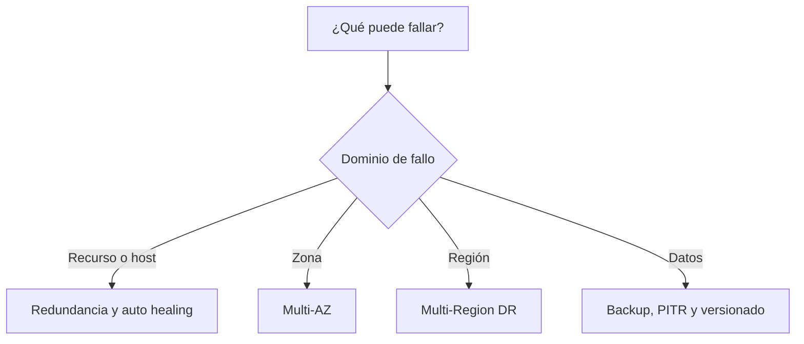
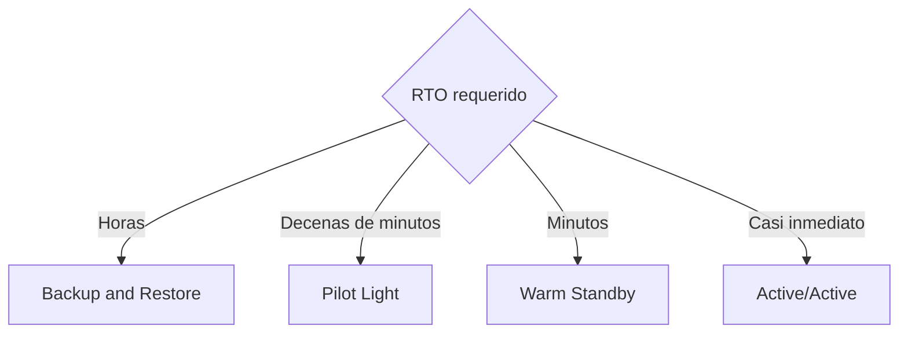
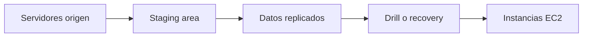

# Resiliencia y Disaster Recovery en AWS para el examen SAA-C03

> Guía de estudio enfocada en alta disponibilidad, tolerancia a fallos, protección de datos, RTO, RPO, estrategias Multi-AZ y Multi-Region, recuperación y decisiones de arquitectura.
>
> Actualizado: julio de 2026.

## 1. Alcance necesario para el examen

El dominio 2 del SAA-C03 evalúa la capacidad de diseñar arquitecturas resilientes. Para responder correctamente se debe poder:

- Diferenciar confiabilidad, resiliencia, disponibilidad, durabilidad y tolerancia a fallos.
- Reconocer el dominio de fallo que debe soportar el workload.
- Eliminar puntos únicos de fallo.
- Diseñar alta disponibilidad mediante varias zonas de disponibilidad.
- Determinar cuándo se necesita una segunda región.
- Definir y aplicar RTO y RPO.
- Diferenciar backup, replicación, failover, recovery y failback.
- Elegir entre Backup and Restore, Pilot Light, Warm Standby y Multi-Site Active/Active.
- Diseñar recuperación de datos ante corrupción, eliminación y ransomware.
- Seleccionar servicios y patrones para replicar datos y reconstruir infraestructura.
- Diseñar health checks, enrutamiento de failover y recuperación automática.
- Considerar cuotas, dependencias, DNS, configuración, secretos y observabilidad.
- Probar restauraciones y procedimientos de DR.
- Optimizar el equilibrio entre tiempo de recuperación, pérdida de datos, costo y complejidad.

> **Regla de examen:** Multi-AZ resuelve principalmente alta disponibilidad ante fallos zonales. Multi-Region se utiliza cuando el negocio exige protección ante una interrupción regional, menor latencia geográfica o presencia global.

---

## 2. Modelos fundamentales de resiliencia

### Conceptos principales

| Concepto | Pregunta que responde |
|---|---|
| Confiabilidad | ¿El workload realiza correctamente su función cuando se espera? |
| Resiliencia | ¿Puede resistir, adaptarse y recuperarse de interrupciones? |
| Disponibilidad | ¿Qué porcentaje del tiempo puede utilizarse correctamente? |
| Durabilidad | ¿Qué probabilidad existe de conservar los datos? |
| Alta disponibilidad | ¿Puede reducirse el downtime mediante redundancia y failover? |
| Tolerancia a fallos | ¿Puede continuar funcionando durante el fallo? |
| Disaster Recovery | ¿Cómo se restaura el workload después de una interrupción grave? |
| Business Continuity | ¿Cómo continúa operando el negocio durante y después del evento? |

### Resiliencia no es únicamente Disaster Recovery

La resiliencia incluye:

- Prevenir que un fallo afecte todo el workload.
- Detectar degradación.
- Absorber picos.
- Reintentar fallos transitorios.
- Reemplazar recursos.
- Aislar componentes.
- Degradar funcionalidad de forma controlada.
- Recuperar datos y servicio.
- Aprender y mejorar después del evento.

DR es una parte de la resiliencia centrada en restaurar el workload cuando la ubicación o arquitectura primaria ya no puede prestar el servicio requerido.

### Regla mental inicial

### Capas de defensa

| Capa | Protección |
|---|---|
| Aplicación | Timeouts, idempotencia, degradación y circuit breaker |
| Integración | Colas, reintentos, DLQ y buffering |
| Cómputo | Réplicas, health checks y Auto Scaling |
| Zona | Distribución Multi-AZ |
| Datos | Replicación, backup, PITR y versionado |
| Región | Estrategia Multi-Region |
| Operación | Observabilidad, automatización, runbooks y pruebas |

> **Regla de arquitectura:** una estrategia regional no reemplaza Multi-AZ, y Multi-AZ no reemplaza backups.

---

## 3. Dominios de fallo

Antes de elegir una solución, identificar el alcance del evento que se debe mitigar.

| Dominio | Ejemplo | Mitigación habitual |
|---|---|---|
| Proceso | Crash de una aplicación | Reinicio y múltiples procesos |
| Contenedor o pod | Fallo de task o pod | Desired count, ReplicaSet y health checks |
| Instancia | Host EC2 defectuoso | Auto Scaling y reemplazo |
| Rack o infraestructura | Fallo físico localizado | Servicio administrado o múltiples recursos |
| Zona de disponibilidad | Pérdida de conectividad o energía zonal | Multi-AZ |
| Región | Interrupción regional grave | Multi-Region |
| Dependencia | API externa no disponible | Timeout, retry, circuit breaker y fallback |
| Capacidad | Saturación o cuota | Elasticidad, buffering y cuotas |
| Configuración | Cambio defectuoso | IaC, rollback e infraestructura inmutable |
| Datos | Corrupción o eliminación | Versionado, PITR y backup aislado |
| Seguridad | Credenciales comprometidas o ransomware | Menor privilegio, inmutabilidad y recuperación |
| Persona o proceso | Error operativo | Automatización, revisiones y guardrails |

### Puntos únicos de fallo

Un punto único de fallo —SPOF— es un componente cuya pérdida interrumpe todo el servicio.

Ejemplos:

- Una sola instancia EC2.
- Todas las instancias en una AZ.
- Una base Single-AZ.
- Un NAT Gateway en una AZ utilizado por recursos de otras AZ.
- Un único enlace Direct Connect sin VPN de respaldo.
- Estado de sesión guardado solo en memoria local.
- Una clave, secreto o configuración disponible únicamente en el entorno primario.
- Un proceso manual que depende de una sola persona.

### Cómo eliminarlos

1. Duplicar únicamente donde el requisito lo justifica.
2. Colocar copias en dominios de fallo diferentes.
3. Detectar salud.
4. Redirigir tráfico.
5. Mantener datos y configuración disponibles.
6. Probar que el failover funciona.

> **Trampa de examen:** duplicar componentes dentro del mismo dominio de fallo no elimina ese dominio. Diez instancias dentro de una sola AZ todavía dependen de esa AZ.

---

## 4. Métricas de recuperación

### RTO

**Recovery Time Objective** es el retraso máximo aceptable entre una interrupción y la restauración del servicio.

El RTO real puede incluir:

1. Detección.
2. Confirmación del incidente.
3. Decisión de failover.
4. Aprovisionamiento o escalado.
5. Restauración o promoción de datos.
6. Despliegue de código y configuración.
7. Cambio de tráfico.
8. Validación.
9. Comunicación.

### RPO

**Recovery Point Objective** es la cantidad máxima de datos, medida en tiempo, que se acepta perder.

Ejemplos:

- Backup cada 24 horas → el RPO potencial puede aproximarse a 24 horas.
- PITR continuo → puede permitir elegir un punto reciente dentro del periodo compatible.
- Replicación asíncrona → el RPO depende del lag.
- Replicación síncrona → puede reducir pérdida ante determinados fallos, pero no sustituye backups.

### Línea temporal

### RTO y RPO no son valores del servicio aislado

Los objetivos corresponden al workload completo:

- DNS.
- Red.
- Aplicación.
- Datos.
- Identidades.
- Claves y secretos.
- Dependencias.
- Validación.
- Capacidad.
- Equipo de respuesta.

Una base puede recuperarse en cinco minutos, pero la aplicación puede tardar una hora si el DNS, los secretos o los workers no están preparados.

### Objetivos por criticidad

| Nivel orientativo | RTO | RPO | Ejemplo |
|---|---|---|---|
| Crítico | Segundos o minutos | Cercano a cero o segundos | Pagos o control esencial |
| Alto | Minutos | Segundos o minutos | Comercio electrónico |
| Medio | Horas | Minutos u horas | Aplicación interna |
| Bajo | Horas o días | Horas o un día | Reportes recreables |

Los valores anteriores son ejemplos. Deben definirse mediante impacto de negocio y no copiarse de una plantilla.

### Dependencias

El RTO de un workload no puede ser menor que el de una dependencia crítica sin una alternativa.

Ejemplo:

- Aplicación: RTO 15 minutos.
- Proveedor de identidad: RTO 4 horas.
- Sin autenticación alternativa.

El objetivo de la aplicación no es alcanzable.

> **Trampa de examen:** RPO cero y RTO cero son objetivos extremadamente exigentes. No deben asumirse si el escenario no los exige.

---

## 5. Disponibilidad, resiliencia y DR

### Alta disponibilidad

Busca mantener el servicio disponible durante fallos esperables:

- Varias instancias.
- Varias AZ.
- Load balancing.
- Health checks.
- Replicación de datos.
- Failover automático.

### Tolerancia a fallos

Busca continuar con poca o ninguna interrupción:

- Capacidad redundante activa.
- Aislamiento.
- Replicación adecuada.
- Conmutación automática.
- Sin depender de reconstrucción durante el fallo.

### Disaster Recovery

Se activa cuando:

- El entorno primario no puede cumplir el servicio.
- Se requiere restaurar desde otra ubicación o punto.
- Ocurre corrupción o pérdida extensa.
- Un evento supera la tolerancia de la arquitectura HA.

### Comparación

| Objetivo | Tiempo | Patrón |
|---|---|---|
| Auto healing | Segundos o minutos | Reemplazar un recurso |
| Alta disponibilidad | Segundos o minutos | Multi-AZ y failover |
| Disaster Recovery | Minutos, horas o días | Restaurar o cambiar de región |
| Business Continuity | Durante todo el evento | Personas, procesos, instalaciones y tecnología |

### Disponibilidad compuesta

Los componentes en serie reducen la disponibilidad total. Si todos son necesarios, la disponibilidad aproximada se multiplica.

Ejemplo conceptual:

$$
A_{\text{total}} = A_1 \times A_2 \times A_3
$$

Agregar componentes dependientes puede reducir disponibilidad si no se diseñan con redundancia.

> **Regla de examen:** más componentes no garantizan mayor resiliencia. Cada dependencia agrega un modo de fallo.

---

## 6. Multi-AZ frente a Multi-Region

### Multi-AZ

- Los recursos se distribuyen dentro de una región.
- Las AZ están físicamente separadas.
- La conectividad entre AZ es de baja latencia.
- Permite replicación síncrona para muchos workloads.
- Es el patrón habitual de producción.
- Protege principalmente frente a fallos zonales.

Ejemplos:

- ALB con targets en varias AZ.
- EC2 Auto Scaling distribuido.
- RDS Multi-AZ.
- Aurora con réplicas en varias AZ.
- ElastiCache Multi-AZ.
- Amazon EFS regional.
- S3 y DynamoDB distribuidos por el servicio entre varias AZ.

### Multi-Region

- Los recursos se despliegan en regiones independientes.
- Protege ante eventos regionales.
- Puede reducir latencia global.
- Agrega replicación, tráfico, operación y costo.
- La replicación entre regiones suele ser asíncrona.
- Requiere administrar consistencia y posibles conflictos.
- Debe cumplir residencia y soberanía de datos.

### Comparación

| Multi-AZ | Multi-Region |
|---|---|
| Alta disponibilidad regional | DR regional o workload global |
| Baja latencia entre AZ | Mayor latencia entre regiones |
| Menor complejidad | Mayor complejidad |
| Replicación síncrona posible | Replicación generalmente asíncrona |
| Menor costo | Mayor costo |
| No protege de pérdida regional completa | Protege si la región secundaria es independiente |

### Cuándo elegir cada uno

- “Tolerar pérdida de una instancia” → múltiples recursos.
- “Tolerar pérdida de una AZ” → Multi-AZ.
- “Tolerar pérdida de una región” → Multi-Region.
- “Datos no pueden salir de la región” → Multi-AZ y backups permitidos por regulación.
- “Usuarios globales y escritura regional” → evaluar edge antes de Multi-Region activo.

> **Trampa de examen:** no implementar Multi-Region si Multi-AZ satisface los objetivos. AWS lo identifica como un anti-patrón por costo y complejidad innecesarios.

---

## 7. Patrones de resiliencia que se deben dominar

### Stateless y estado externo

- El cómputo debe poder reemplazarse.
- Las sesiones se almacenan en un servicio compartido.
- Los archivos importantes no viven únicamente en el host.
- Las instancias no deben depender de una configuración manual.

### Escalado horizontal

- Distribuye tráfico.
- Reduce el impacto de perder un nodo.
- Facilita reemplazo.
- Requiere que el estado no esté acoplado al nodo.

### Health checks

Un health check útil valida que el componente pueda realizar su función:

- Proceso activo.
- Dependencias necesarias.
- Capacidad para atender.
- Resultado de negocio cuando sea posible.

> **Trampa:** un puerto abierto no demuestra que la aplicación pueda completar una transacción.

### Auto healing

- Detectar recurso no saludable.
- Sacarlo de servicio.
- Reemplazarlo.
- Verificar el reemplazo.
- Generar telemetría.

### Desacoplamiento

Una cola permite:

- Absorber picos.
- Separar disponibilidad del productor y consumidor.
- Reintentar.
- Escalar consumidores.
- Evitar pérdida de solicitudes.

No elimina:

- Necesidad de idempotencia.
- Monitoreo del backlog.
- DLQ.
- Control de antigüedad.
- Diseño de orden.

### Idempotencia

Procesar varias veces la misma solicitud debe producir el mismo resultado observable que procesarla una vez.

Casos:

- Crear un pedido.
- Aplicar un pago.
- Enviar una instrucción.
- Actualizar inventario.

Se puede utilizar:

- Idempotency key.
- Registro de operaciones procesadas.
- Condiciones de escritura.
- Deduplicación.

### Timeouts

- Evitan esperar indefinidamente.
- Deben ser menores que el tiempo máximo del llamador.
- Deben considerar latencia normal.
- Deben acompañarse de manejo de error.

### Reintentos

Utilizar:

- Número limitado.
- Exponential backoff.
- Jitter.
- Operaciones idempotentes.
- Presupuesto total de tiempo.

Evitar:

- Reintentos infinitos.
- Reintentos simultáneos desde todas las capas.
- Reintentar errores no transitorios.

### Circuit breaker

- Detiene llamadas repetidas a una dependencia fallida.
- Evita consumir recursos.
- Permite recuperación gradual.
- Puede ofrecer fallback.

### Bulkhead

- Divide recursos o tráfico.
- Evita que un fallo consuma toda la capacidad.
- Puede separar tenants, colas, pools o celdas.
- Limita el blast radius.

### Degradación controlada

Ejemplos:

- Mostrar catálogo sin recomendaciones.
- Aceptar pedidos y procesarlos después.
- Servir contenido almacenado en caché.
- Deshabilitar una función no crítica.

### DLQ

Una dead-letter queue permite:

- Aislar mensajes fallidos.
- Evitar bloquear el flujo principal.
- Analizar la causa.
- Reprocesar de manera controlada.

No debe convertirse en almacenamiento sin monitoreo.

---

## 8. Static stability y dependencia del control plane

### Static stability

Una arquitectura es estáticamente estable cuando puede continuar operando durante un fallo sin tener que crear recursos nuevos inmediatamente.

Ejemplo Multi-AZ:

- Dos AZ atienden 50 % de carga cada una.
- Si una falla, la otra debe soportar 100 %.
- Si la AZ restante necesita escalar primero, la recuperación depende del control plane y de capacidad disponible.

### Capacidad N+1

La capacidad restante debe soportar la pérdida del dominio previsto.

| Diseño | Resultado ante pérdida de una AZ |
|---|---|
| 50 % + 50 % sin margen | La AZ restante se satura |
| 50 % + 50 % con capacidad escalable inmediata | Depende de scale-out |
| Capacidad suficiente en cada AZ | Continúa sin aprovisionar |

Static stability mejora RTO, pero incrementa costo.

### Data plane frente a control plane

| Data plane | Control plane |
|---|---|
| Atiende operaciones normales | Crea o modifica recursos |
| Enrutar, leer, escribir, procesar | Lanzar, configurar, promover |
| Debe continuar durante el evento | Puede degradarse durante un evento |

Para recuperación crítica:

- Precrear recursos esenciales.
- Preconfigurar roles, rutas y secretos.
- Mantener capacidad.
- Utilizar health-based routing.
- Evitar depender de cambios manuales complejos.

### Dependencias ocultas del control plane

- Crear instancias.
- Aumentar cuotas.
- Crear NAT Gateway.
- Emitir certificados.
- Copiar secretos.
- Crear endpoints.
- Modificar infraestructura por primera vez.

> **Regla de examen:** cuanto menor es el RTO, más elementos deben estar preaprovisionados, probados y disponibles antes del desastre.

---

## 9. Protección de datos

### Backup frente a replicación

| Backup | Replicación |
|---|---|
| Copia en un punto del tiempo | Copia actualizada continuamente |
| Permite volver a un estado anterior | Facilita disponibilidad o failover |
| Mayor RPO según frecuencia | Menor RPO según lag |
| Requiere restauración | Puede promoverse o utilizarse |
| Protege de corrupción si conserva puntos anteriores | Puede replicar corrupción |

> **Regla de examen:** replicación y backup cumplen objetivos diferentes; una arquitectura crítica suele necesitar ambos.

### Versionado

- Conserva versiones anteriores.
- Ayuda ante sobrescritura o eliminación.
- No reemplaza completamente un backup independiente.
- Debe combinarse con lifecycle y controles de acceso.

### Point-in-Time Recovery

- Permite restaurar a un punto compatible dentro de un periodo.
- Es útil frente a cambios lógicos incorrectos.
- La restauración suele crear un recurso nuevo.
- Requiere procedimiento para validar y reconectar.

### Inmutabilidad

Protege contra modificación o eliminación durante un periodo:

- S3 Object Lock.
- AWS Backup Vault Lock.
- Políticas de retención.
- Acceso separado.

### Separación

Copias críticas pueden necesitar:

- Otra cuenta.
- Otra región.
- Permisos independientes.
- Claves accesibles durante recuperación.
- Protección contra eliminación.

### Restauración

Un plan de backup debe responder:

- ¿Qué se respalda?
- ¿Con qué frecuencia?
- ¿Dónde se guarda?
- ¿Durante cuánto tiempo?
- ¿Quién puede eliminarlo?
- ¿Qué clave lo cifra?
- ¿Cómo se restaura?
- ¿Cuánto tarda?
- ¿Cómo se valida?

### Consistencia de aplicaciones

Para workloads con varios componentes:

- Coordinar puntos de recuperación.
- Evitar restaurar bases relacionadas a tiempos incompatibles.
- Quiesce o utilizar mecanismos application-consistent cuando sea necesario.
- Documentar orden de restauración.

### Datos recreables

No todos los datos necesitan la misma estrategia:

| Tipo | Tratamiento |
|---|---|
| Transacciones | Backup, replicación y controles estrictos |
| Datos derivados | Pueden reconstruirse desde origen |
| Caché | Se puede descartar |
| Logs regulatorios | Retención e inmutabilidad |
| Artefactos de despliegue | Replicación o repositorio disponible |
| Configuración | Versionado e IaC |

---

## 10. Estrategias principales de Disaster Recovery

AWS presenta cuatro estrategias Multi-Region principales. Aumentan en costo y complejidad mientras disminuyen RTO y RPO.

| Estrategia | Estado de la región de recuperación | RPO orientativo AWS | RTO orientativo AWS | Costo relativo |
|---|---|---:|---:|---:|
| Backup and Restore | Datos respaldados; infraestructura se reconstruye | Horas | Hasta 24 horas o menos | Bajo |
| Pilot Light | Datos y núcleo activo; cómputo adicional no desplegado | Minutos | Decenas de minutos | Bajo-medio |
| Warm Standby | Workload completo activo a capacidad reducida | Segundos | Minutos | Medio-alto |
| Multi-Site Active/Active | Varias regiones sirven tráfico | Cercano a cero | Potencialmente cero | Alto |

> Los valores son ejemplos orientativos publicados por AWS, no garantías. La implementación, el volumen de datos, las dependencias y las pruebas determinan el resultado real.

### Regla mental

### Diferencia esencial

- **Backup and Restore:** se reconstruye y restaura.
- **Pilot Light:** el núcleo y los datos están preparados; faltan componentes.
- **Warm Standby:** todo funciona, pero con menor capacidad.
- **Active/Active:** varias regiones atienden producción.

---

## 11. Backup and Restore

### Modelo

La región de recuperación conserva:

- Backups.
- IaC.
- Código.
- Imágenes.
- Configuración.
- Secretos o mecanismos para recrearlos.

Durante recuperación:

1. Se despliega infraestructura.
2. Se restauran datos.
3. Se despliega la aplicación.
4. Se valida.
5. Se cambia el tráfico.

### Ventajas

- Menor costo.
- Menor complejidad en operación normal.
- Adecuado para workloads tolerantes a downtime.
- Protege frente a corrupción si existen puntos históricos.

### Desventajas

- Mayor RTO.
- Mayor dependencia del control plane.
- La restauración puede tardar por volumen.
- Riesgo de configuración incompleta.
- Requiere capacidad disponible al momento del desastre.

### Servicios habituales

- AWS Backup.
- Snapshots de EBS.
- Backups y snapshots de RDS.
- Backups y PITR de DynamoDB.
- Amazon S3 con versionado, replicación o backup.
- AWS CloudFormation.
- Repositorios de código e imágenes.

### Cuándo elegir

- Aplicaciones internas.
- Ambientes no productivos.
- Workloads recreables.
- RTO de horas.
- Presupuesto limitado.

### Trampas

- Guardar backup en la misma ubicación sin protección adicional.
- No respaldar configuración, claves o artefactos.
- Suponer que “snapshot creado” equivale a “workload recuperable”.
- No probar tiempos de restauración.

---

## 12. Pilot Light

### Modelo

La región secundaria mantiene siempre disponibles:

- Datos replicados.
- Backups.
- Red y componentes centrales necesarios.
- Configuración e IaC.
- Determinados servicios críticos.

No mantiene desplegada toda la capacidad de aplicación.

Durante recuperación:

1. Se completa la infraestructura.
2. Se despliega o inicia cómputo.
3. Se escalan componentes.
4. Se valida.
5. Se redirige tráfico.

### Ventajas

- Menor costo que un entorno completo.
- RPO bajo mediante replicación.
- Recuperación más rápida que Backup and Restore.
- Adecuado para aplicaciones importantes.

### Desventajas

- No puede atender solicitudes inmediatamente.
- Depende de aprovisionamiento durante el evento.
- Requiere automatización completa.
- Puede fallar por cuotas o capacidad.

### Diferencia con recursos detenidos

En la nube suele ser preferible:

- Definir recursos mediante IaC.
- Desplegarlos cuando se necesitan.
- Mantener artefactos y configuración preparados.

Una instancia detenida continúa generando ciertos costos relacionados y no garantiza una arquitectura completa ni actualizada.

### Cuándo elegir

- RTO de decenas de minutos.
- RPO de minutos.
- Se acepta desplegar componentes durante el evento.
- El costo de Warm Standby es excesivo.

### AWS Elastic Disaster Recovery

AWS DRS implementa un modelo de recuperación con:

- Replicación continua a una staging area.
- Almacenamiento económico y cómputo mínimo durante operación normal.
- Lanzamiento de instancias para drill o recovery.
- Selección de un punto anterior.
- Recuperación de servidores on-premises o cloud compatibles.

AWS Well-Architected lo presenta como una alternativa cloud-native de estilo Pilot Light que puede mejorar objetivos de recuperación.

---

## 13. Warm Standby y Hot Standby

### Warm Standby

La región secundaria contiene el workload completo:

- Entrada.
- Red.
- Cómputo.
- Aplicación.
- Datos.
- Configuración.
- Seguridad.
- Observabilidad.

La capacidad es menor que producción.

Durante recuperación:

1. Se aumenta capacidad.
2. Se valida salud.
3. Se redirige tráfico.

### Ventajas

- RTO de minutos.
- Menor dependencia de creación de recursos.
- Se puede probar frecuentemente.
- Puede atender tráfico reducido.

### Desventajas

- Costo permanente.
- Configuración y versiones deben permanecer sincronizadas.
- El scale-up depende de cuotas y capacidad.
- La replicación de datos debe monitorearse.

### Hot Standby

Es una forma de standby con capacidad completa o cercana a producción.

- Menor RTO.
- Menor dependencia de scale-up.
- Mayor costo.
- Normalmente activo/pasivo.

### Pilot Light frente a Warm Standby

| Pilot Light | Warm Standby |
|---|---|
| No puede procesar producción sin acciones adicionales | Puede procesar tráfico a capacidad reducida |
| Faltan componentes | Todos los componentes existen |
| Debe desplegar y escalar | Principalmente debe escalar |
| Menor costo | Mayor costo |
| Mayor RTO | Menor RTO |

> **Regla de examen:** si la región secundaria ya tiene toda la aplicación funcional a menor escala, es Warm Standby, no Pilot Light.

---

## 14. Multi-Site Active/Active

### Modelo

- Dos o más regiones sirven tráfico.
- Cada región tiene un stack funcional.
- Los usuarios se enrutan a regiones saludables.
- Los datos se replican.
- La capacidad restante debe absorber la pérdida de una región.

### Ventajas

- RTO potencialmente cercano a cero.
- RPO cercano a cero según el servicio y patrón de escritura.
- Menor latencia para usuarios globales.
- Utilización de ambas regiones.

### Desventajas

- Mayor costo.
- Mayor complejidad.
- Conflictos de escritura.
- Consistencia eventual.
- Observabilidad distribuida.
- Despliegues coordinados.
- Dependencias globales.
- Failback más complejo.

### Diseños de escritura

| Modelo | Característica |
|---|---|
| Single-writer | Una región escribe; otras leen o esperan |
| Multi-writer | Varias regiones escriben |
| Home Region | Cada entidad tiene una región propietaria |
| Write forwarding | Una región recibe y reenvía escritura |

### Conflictos

Un diseño multi-writer debe definir:

- Clave de partición.
- Propiedad del dato.
- Resolución de conflictos.
- Idempotencia.
- Orden.
- Experiencia durante partición de red.

### Cuándo elegir

- RTO extremadamente bajo.
- Workload de misión crítica.
- Usuarios globales.
- Capacidad técnica y operativa para administrar consistencia.
- Presupuesto compatible.

### Cuándo no elegir

- Multi-AZ satisface el requisito.
- La aplicación no maneja consistencia distribuida.
- Los datos no pueden salir de la región.
- El costo y operación no se justifican.

> **Trampa de examen:** Active/Active no protege por sí solo frente a corrupción lógica. La corrupción puede replicarse; se necesitan backups o PITR.

---

## 15. Replicación y recuperación por servicio

### Amazon S3

| Necesidad | Función |
|---|---|
| Recuperar sobrescritura o eliminación | Versioning |
| Replicar dentro de la región | Same-Region Replication |
| Replicar entre regiones | Cross-Region Replication |
| Copiar objetos existentes | S3 Batch Replication |
| WORM | S3 Object Lock |
| Acceso global a buckets | S3 Multi-Region Access Points |
| Automatizar clases y expiración | S3 Lifecycle |

Consideraciones:

- Replicación es asíncrona.
- Versioning es necesario para replicación.
- Eliminar o corromper puede afectar copias según configuración.
- MRAP no reemplaza la estrategia de replicación ni el backup.

### Amazon EBS

- Los volúmenes son zonales.
- Snapshots permiten restaurar volúmenes en otra AZ de la región.
- Los snapshots pueden copiarse a otra región.
- La restauración crea un volumen nuevo.
- Para HA entre AZ se necesita replicación a nivel de aplicación o servicio.

### Amazon EFS

- El modo regional almacena datos en varias AZ.
- EFS Replication permite replicar hacia otro sistema de archivos compatible.
- AWS Backup puede proteger EFS.
- El target de replicación y el acceso deben planificarse.

### Amazon RDS

| Objetivo | Función |
|---|---|
| Alta disponibilidad zonal | Multi-AZ |
| Escalado de lectura | Read Replica |
| Recuperación a un punto | Automated backups y PITR |
| Copia persistente | Manual snapshot |
| DR regional | Cross-Region Read Replica o copia de snapshot compatible |

Consideraciones:

- Multi-AZ DB instance tradicional utiliza standby para failover, no para lectura.
- Read Replica es asíncrona.
- Promover una Read Replica no es el mismo proceso que failover Multi-AZ.
- Restaurar crea un recurso nuevo.

### Amazon Aurora

- El clúster distribuye almacenamiento entre varias AZ.
- Aurora Replicas ayudan a lectura y failover.
- Aurora Global Database replica entre regiones.
- Un clúster secundario puede promoverse.
- Backups y PITR continúan siendo necesarios.
- El lag y el proceso de switchover/failover afectan RPO y RTO.

### Amazon DynamoDB

- Servicio regional Multi-AZ.
- PITR protege frente a cambios lógicos dentro del periodo compatible.
- On-demand backups crean puntos persistentes.
- Global Tables proporciona replicación multi-activa entre regiones.
- Los conflictos deben comprenderse en diseños multi-región.
- Backup y Global Tables resuelven problemas distintos.

### Amazon ElastiCache

- Replication Groups permiten réplicas.
- Multi-AZ con failover automático mejora disponibilidad.
- Global Datastore para Redis OSS permite replicación entre regiones compatibles.
- Una caché puede recrearse si el origen de datos continúa disponible.
- No tratar caché como única copia de datos.

### Amazon Redshift

- Snapshots protegen datos.
- Se pueden copiar snapshots entre regiones mediante configuración compatible.
- Multi-AZ está disponible para determinados tipos de despliegue.
- El diseño debe considerar tiempo de restauración y volumen.

### Amazon ECR

- Replicación entre regiones o cuentas para imágenes.
- La infraestructura secundaria necesita acceso a artefactos.
- Conservar tags inmutables o identificadores reproducibles.

---

## 16. Servicios AWS para resiliencia y DR

| Servicio | Uso principal |
|---|---|
| AWS Backup | Administrar y automatizar backups compatibles |
| AWS Elastic Disaster Recovery | Replicar servidores y lanzar recovery instances |
| AWS Resilience Hub | Evaluar resiliencia frente a políticas RTO/RPO |
| AWS Fault Injection Service | Ejecutar experimentos de inyección de fallos |
| Amazon Route 53 | Health checks y routing de failover |
| AWS Global Accelerator | Endpoints globales y tráfico hacia regiones saludables |
| Amazon Application Recovery Controller | Controles y readiness para recuperación |
| AWS CloudFormation | Reconstruir infraestructura |
| CloudFormation StackSets | Desplegar entre cuentas y regiones |
| Amazon CloudWatch | Métricas, logs y alarmas |
| Amazon EventBridge | Reaccionar a eventos |
| AWS Systems Manager | Automatización y runbooks |
| AWS Config | Detectar drift y configuración |
| AWS KMS | Proteger backups y datos replicados |

### Servicio administrado no significa DR automático

Se debe verificar:

- Alcance regional.
- Comportamiento Multi-AZ.
- Opciones Multi-Region.
- Failover.
- Backup.
- Cuotas.
- Identidad.
- Claves.
- DNS.
- Pruebas.

---

## 17. AWS Elastic Disaster Recovery

### Modelo

### Componentes

- Agente de replicación en servidores compatibles.
- Replication servers administrados.
- Staging area subnet.
- Volúmenes replicados.
- Launch settings.
- Drill instances.
- Recovery instances.

### Flujo

1. Instalar agente.
2. Replicar bloques.
3. Configurar launch settings.
4. Ejecutar drill.
5. Validar aplicación.
6. Iniciar recovery.
7. Redirigir tráfico.
8. Realizar failback cuando corresponda.

### Recovery frente a failover

AWS DRS:

- Lanza recovery instances.
- Ayuda con failback.

El cliente:

- Redirige el tráfico.
- Valida el workload.
- Administra DNS o traffic management.
- Coordina la decisión.

> **Trampa de examen:** AWS DRS no realiza por sí solo el cambio de tráfico de producción. La documentación oficial diferencia recovery de failover.

### Cuándo elegir

- Lift-and-shift.
- Servidores on-premises.
- Workloads basados en EC2.
- Cambios mínimos en aplicación.
- Replicación continua de bloques.

### Cuándo no es suficiente

- Arquitectura cloud-native con datos distribuidos que requiere estrategia por servicio.
- Dependencias SaaS.
- Identidades, DNS o secretos no replicados.
- Requisitos active/active de aplicación.

---

## 18. AWS Resilience Hub y AWS Fault Injection Service

### AWS Resilience Hub

Permite:

- Definir resiliency policies.
- Establecer RTO y RPO para distintos tipos de interrupción.
- Evaluar AppComponents.
- Estimar si la aplicación cumple objetivos.
- Recomendar alarmas, SOP y pruebas.
- Detectar cambios que afectan resiliencia.
- Comparar opciones por RTO/RPO, costo o cambios mínimos.

### Importante

Los valores de Resilience Hub son estimaciones basadas en configuración. Las pruebas propias determinan los tiempos reales.

### AWS Fault Injection Service

Permite:

- Ejecutar experimentos de fault injection.
- Simular fallos o degradación.
- Observar comportamiento.
- Validar auto healing.
- Descubrir debilidades.
- Utilizar CloudWatch alarms como stop conditions.

### Comparación

| AWS Resilience Hub | AWS Fault Injection Service |
|---|---|
| Evalúa configuración | Inyecta fallos controlados |
| Compara con política RTO/RPO | Observa respuesta real |
| Genera recomendaciones | Ejecuta experimentos |
| Estima recuperación | Ayuda a validar resiliencia |

### Práctica correcta

1. Definir objetivos.
2. Evaluar arquitectura.
3. Implementar recomendaciones.
4. Diseñar experimento.
5. Configurar stop conditions.
6. Ejecutar en un alcance controlado.
7. Medir.
8. Mejorar.

---

## 19. Gestión del tráfico, failover y failback

### Definiciones

| Término | Acción |
|---|---|
| Recovery | Restaurar o lanzar recursos |
| Failover | Cambiar producción al entorno secundario |
| Switchover | Cambio planificado |
| Failback | Regresar al entorno original o nuevo primario |

### Amazon Route 53

Puede:

- Realizar health checks.
- Utilizar failover routing para active/passive.
- Utilizar políticas compatibles y health checks para active/active.
- Dejar de devolver endpoints no saludables.

Consideraciones:

- DNS utiliza caché.
- Los resolvers y clientes respetan TTL de manera variable.
- El health check debe representar la salud del workload.
- El failover DNS no restaura datos ni aplicación.

### AWS Global Accelerator

Adecuado cuando:

- Se requiere endpoint global con direcciones anycast.
- Se desea enrutar TCP/UDP hacia endpoints saludables.
- Se busca failover de red más rápido que un cambio basado únicamente en DNS.

No reemplaza:

- Replicación de datos.
- Capacidad secundaria.
- Recuperación de aplicación.

### Amazon Application Recovery Controller

Ayuda con:

- Readiness.
- Routing controls.
- Gestión segura de cambios de tráfico.
- Zonal shift o recuperación según la capacidad compatible.

### Failback

Debe planificarse antes del desastre:

1. Verificar estabilidad del destino.
2. Elegir nuevo sistema de registro.
3. Sincronizar cambios.
4. Realizar switchover controlado.
5. Validar.
6. Reanudar protección.

> **Trampa:** hacer failback demasiado pronto puede provocar una segunda interrupción.

---

## 20. Plan de recuperación completo

### Paso 1: Business Impact Analysis

Identificar:

- Funciones críticas.
- Impacto financiero.
- Impacto regulatorio.
- Impacto reputacional.
- Dependencias.
- Periodos críticos.

### Paso 2: clasificar workloads

| Tier | Ejemplo de estrategia |
|---|---|
| 0 — Esencial | Active/Active o Hot Standby |
| 1 — Crítico | Warm Standby |
| 2 — Importante | Pilot Light |
| 3 — Tolerante | Backup and Restore |

La relación es orientativa. Cada tier debe tener objetivos y presupuesto aprobados.

### Paso 3: definir objetivos

- RTO.
- RPO.
- Disponibilidad.
- Alcance del fallo.
- Retención.
- Consistencia.
- Capacidad durante recuperación.

### Paso 4: diseñar

- Región.
- Cuentas.
- VPC y CIDR.
- Rutas.
- DNS.
- Cómputo.
- Datos.
- Artefactos.
- Identidades.
- Claves y secretos.
- Observabilidad.

### Paso 5: automatizar

- IaC.
- Pipelines.
- Runbooks.
- Backups.
- Replicación.
- Health checks.
- Escalado.
- Cambio de tráfico.

### Paso 6: validar

- Restore test.
- Recovery drill.
- Failover test.
- Failback test.
- Game day.
- Fault injection.

### Paso 7: medir

- MTTD.
- Tiempo de decisión.
- Tiempo de infraestructura.
- Tiempo de restauración.
- Tiempo de validación.
- Tiempo de tráfico.
- RTO real.
- RPO real.

### Paso 8: mejorar

- Documentar incidentes.
- Corregir runbooks.
- Actualizar diagramas.
- Revisar cuotas.
- Repetir pruebas.

---

## 21. Runbook y playbook

### Runbook

Procedimiento técnico para una tarea:

- Restaurar una base.
- Promover una réplica.
- Escalar un entorno.
- Cambiar DNS.

### Playbook

Coordina la respuesta completa:

- Criterios para declarar desastre.
- Roles.
- Comunicación.
- Runbooks que se ejecutan.
- Decisiones.
- Validación.
- Failback.

### Contenido mínimo

- Propietario.
- Prerrequisitos.
- Permisos.
- Comandos o automatización.
- Orden.
- Criterio de éxito.
- Criterio de rollback.
- Tiempo estimado.
- Evidencia.
- Contactos.

### Automatización

Automatizar:

- Pasos repetitivos.
- Creación de infraestructura.
- Validaciones.
- Alarmas.
- Recolección de evidencia.

Mantener intervención humana cuando:

- Existe riesgo alto.
- El contexto determina la decisión.
- La conmutación puede causar pérdida.
- Se requiere aprobación regulatoria o de negocio.

---

## 22. Pruebas de resiliencia y DR

### Tipos

| Prueba | Objetivo |
|---|---|
| Restore test | Verificar backup e integridad |
| Component failure | Probar reemplazo automático |
| AZ impairment | Validar capacidad y routing |
| Regional drill | Validar recovery y failover |
| Game day | Probar tecnología, personas y procesos |
| Fault injection | Crear un fallo controlado |
| Failback test | Verificar retorno seguro |

### Prueba no disruptiva

- Ambiente aislado.
- Drill instances.
- Datos protegidos.
- Sin cambiar producción.
- Validación funcional.

### Prueba completa

- Cambiar tráfico real o controlado.
- Validar capacidad.
- Medir DNS.
- Procesar transacciones.
- Comprobar observabilidad.
- Ejecutar failback.

### Stop conditions

En fault injection:

- Definir alarmas.
- Limitar alcance.
- Limitar duración.
- Proteger datos.
- Tener rollback.
- Notificar participantes.

### Evidencia

Registrar:

- Inicio.
- Detección.
- Acciones.
- Errores.
- Recuperación.
- RTO real.
- RPO real.
- Hallazgos.
- Acciones y propietarios.

> **Regla de examen:** un diseño no demuestra resiliencia hasta que la recuperación y los procedimientos han sido probados.

---

## 23. Quotas, capacidad y dependencias

### Cuotas

La región secundaria debe permitir:

- Número de instancias.
- Direcciones IP.
- Load balancers.
- Capacidad de NAT.
- Funciones y concurrencia.
- Clústeres.
- IOPS.
- Throughput.

Una cuota insuficiente puede impedir recuperación aunque exista IaC.

### Capacidad

Considerar:

- Tipo de instancia disponible.
- Diversificación de familias.
- Capacidad On-Demand.
- Warm pools o recursos activos.
- Scale-up probado.
- Capacidad de bases y cachés.

### Dependencias globales

- Identidad.
- CI/CD.
- Repositorios.
- DNS.
- Observabilidad.
- Claves.
- Licencias.
- Servicios externos.

### Dependencias regionales

Recrear o replicar:

- Secretos.
- Parámetros.
- Imágenes.
- Certificados.
- Reglas de red.
- VPC endpoints.
- Alarmas.
- Dashboards.
- Topics y colas cuando sea necesario.

### Configuración drift

Evitar:

- Cambios manuales solo en primaria.
- Versiones distintas.
- Políticas divergentes.
- Runbooks obsoletos.

Utilizar:

- IaC común.
- Pipelines multi-región.
- AWS Config.
- Inventario.
- Pruebas periódicas.

---

## 24. Seguridad de la recuperación

### Identidad

- Roles precreados.
- Acceso break-glass controlado.
- MFA.
- Menor privilegio.
- Auditoría.
- Acceso entre cuentas probado.

### Cifrado

- Claves disponibles en destino.
- Key policies correctas.
- Grants o roles validados.
- Copias cifradas.
- TLS.

### Backups

- Cuentas separadas.
- Inmutabilidad.
- Retención.
- Vault Lock cuando corresponde.
- Alarmas de fallos de backup.
- Protección frente a eliminación.

### Red

- Subnets.
- Rutas.
- Security groups.
- NACL.
- Endpoints.
- Firewalls.
- Conectividad híbrida redundante.

### Auditoría

- CloudTrail.
- Logs de aplicación.
- Eventos de recovery.
- Acciones de failover.
- Evidencia centralizada.

> **Trampa de examen:** un backup cifrado no sirve si la región o cuenta de recuperación no puede utilizar la clave.

---

## 25. Optimización de costos

### Relación general

Menor RTO y RPO suelen requerir:

- Más recursos activos.
- Replicación más frecuente.
- Más capacidad.
- Más automatización.
- Más pruebas.
- Mayor complejidad operativa.

### Palancas de costo

| Palanca | Efecto |
|---|---|
| Clasificar workloads | Evita aplicar la estrategia más costosa a todos |
| Pilot Light | Reduce cómputo activo |
| Warm Standby reducido | Balancea costo y RTO |
| Serverless | Reduce capacidad ociosa |
| Lifecycle | Reduce costo de backups antiguos |
| Retención adecuada | Evita conservar copias innecesarias |
| Diversificación de capacidad | Reduce riesgo de falta de instancia |
| Pruebas temporales | Pagar solo durante drills |

### Costos ocultos

- Transferencia entre regiones.
- Replicación.
- Solicitudes.
- Snapshots.
- KMS.
- Logs.
- NAT.
- Capacidad secundaria.
- Licencias.
- Personal y pruebas.

### Pregunta correcta

No preguntar únicamente:

> ¿Cuál estrategia cuesta menos?

Preguntar:

> ¿Cuál es la estrategia de menor costo que cumple RTO, RPO, disponibilidad, seguridad y cumplimiento?

---

## 26. Matriz de decisión

| Requisito | Estrategia o patrón |
|---|---|
| Tolerar fallo de host | Auto Scaling y múltiples instancias |
| Tolerar pérdida de AZ | Multi-AZ |
| Tolerar pérdida regional | Multi-Region |
| RTO de horas | Backup and Restore |
| RTO de decenas de minutos | Pilot Light |
| RTO de minutos | Warm Standby |
| RTO potencialmente cero | Active/Active |
| Datos corruptos | PITR, versionado o backup |
| Servidores legacy con cambios mínimos | AWS DRS |
| Evaluar política RTO/RPO | AWS Resilience Hub |
| Probar reacción a fallos | AWS FIS |
| Failover active/passive basado en DNS | Route 53 failover routing |
| Tráfico global TCP/UDP | Global Accelerator |
| Imágenes de contenedor en destino | ECR cross-Region replication |
| Infraestructura consistente | CloudFormation, StackSets o IaC compatible |

---

## 27. Casos razonados de examen

### Caso 1: aplicación crítica en una AZ

**Situación:** tres instancias EC2 y una base se encuentran en una sola AZ.

**Problema:** la cantidad de instancias no elimina la dependencia zonal.

**Mejora:** distribuir cómputo entre varias AZ, utilizar load balancer y base Multi-AZ.

### Caso 2: snapshots diarios

**Situación:** el negocio acepta perder máximo 15 minutos de datos.

**Problema:** snapshots cada 24 horas no cumplen RPO.

**Mejora:** PITR o replicación compatible que entregue un punto dentro del objetivo, además de backups.

### Caso 3: pérdida regional

**Situación:** el requisito exige continuar si la región primaria no está disponible.

**Decisión:** estrategia Multi-Region con datos, infraestructura, identidades, tráfico y pruebas.

**Distractor:** RDS Multi-AZ dentro de la misma región.

### Caso 4: bajo costo y RTO de horas

**Situación:** aplicación interna tolera ocho horas de downtime.

**Decisión:** Backup and Restore con IaC y restauraciones probadas.

**Distractor:** Active/Active Multi-Region.

### Caso 5: datos activos, aplicación no desplegada

**Situación:** la región secundaria mantiene base replicada, backups y red; la aplicación se despliega durante el desastre.

**Estrategia:** Pilot Light.

### Caso 6: stack completo reducido

**Situación:** la región secundaria atiende health checks y puede procesar tráfico reducido; durante failover se escala.

**Estrategia:** Warm Standby.

### Caso 7: corrupción replicada

**Situación:** una operación elimina registros y se replica a la región secundaria.

**Problema:** la réplica no protege frente a destrucción lógica.

**Mejora:** PITR o backup anterior, procedimiento de restauración y control de acceso.

### Caso 8: DNS secundario sin aplicación

**Situación:** Route 53 puede apuntar a la región secundaria, pero no existen secretos ni imágenes.

**Problema:** traffic failover no equivale a workload recovery.

**Mejora:** replicar artefactos, preparar configuración y probar el stack completo.

### Caso 9: AWS DRS

**Situación:** servidores VMware on-premises deben recuperarse en AWS con cambios mínimos.

**Decisión:** AWS Elastic Disaster Recovery.

**Consideración:** DRS lanza recovery instances; el cambio de tráfico debe planificarse aparte.

### Caso 10: Auto Scaling durante una AZ failure

**Situación:** la capacidad restante no soporta producción y depende de crear instancias.

**Riesgo:** capacidad o control plane no disponibles a tiempo.

**Mejora:** static stability o capacidad preaprovisionada según RTO.

### Caso 11: backup sin clave

**Situación:** snapshots cifrados se copiaron a otra cuenta, pero la clave no permite restaurar.

**Problema:** el backup existe pero no es recuperable.

**Mejora:** política de clave, rol y procedimiento probados.

### Caso 12: medir resiliencia

**Situación:** arquitectura documentada, pero se desconoce el RTO real.

**Decisión:** evaluar con Resilience Hub y validar mediante drills o AWS FIS según el escenario.

---

## 28. Diferencias y trampas de examen

### Conceptos que no se deben confundir

| Concepto A | Concepto B | Diferencia |
|---|---|---|
| Disponibilidad | Durabilidad | Acceso actual frente a conservación |
| Alta disponibilidad | DR | Continuidad ante fallos frente a restauración grave |
| Multi-AZ | Multi-Region | Protección zonal frente a regional |
| Backup | Replicación | Punto histórico frente a copia actualizada |
| RTO | RPO | Tiempo de servicio frente a pérdida de datos |
| Failover | Failback | Cambiar al secundario frente a regresar |
| Recovery | Failover | Restaurar recursos frente a cambiar tráfico |
| Pilot Light | Warm Standby | Núcleo incompleto frente a stack funcional reducido |
| Warm Standby | Active/Active | Secundario pasivo frente a varias regiones atendiendo |
| Multi-AZ RDS | Read Replica | Failover frente a escalado de lectura |
| Health check | Monitoreo | Decidir salud de routing frente a observar métricas |
| Resilience Hub | AWS FIS | Evaluación frente a inyección de fallos |
| AWS Backup | AWS DRS | Backup de recursos frente a replicación de servidores |

### Trampas habituales

- Elegir Multi-Region sin requisito regional.
- Suponer que replicación protege contra corrupción.
- No respaldar configuración y artefactos.
- Ignorar DNS y TTL en RTO.
- Olvidar cuotas en la región secundaria.
- Tener varias instancias en una AZ.
- Escalar durante el fallo sin capacidad garantizada.
- Confundir Read Replica con Multi-AZ.
- Confundir failover con recuperación.
- No diseñar failback.
- No probar backups.
- Usar health checks superficiales.
- Ignorar idempotencia durante reintentos.
- Depender de una persona para ejecutar DR.
- Asumir que un servicio administrado es automáticamente Multi-Region.
- Copiar datos sin copiar claves o permisos.

---

## 29. Estrategia para resolver preguntas SAA-C03

1. Identificar el dominio de fallo.
2. Extraer RTO y RPO.
3. Determinar si se necesita HA o DR.
4. Identificar dónde vive el estado.
5. Revisar backup, replicación y PITR.
6. Identificar componentes que deben existir en destino.
7. Revisar tráfico y health checks.
8. Revisar cuotas y capacidad.
9. Revisar seguridad, claves y secretos.
10. Elegir la estrategia de menor costo que cumple todos los requisitos.

### Palabras clave

- **Fallo de instancia:** Auto Scaling.
- **Fallo de AZ:** Multi-AZ.
- **Fallo de región:** Multi-Region.
- **Pérdida máxima de datos:** RPO.
- **Downtime máximo:** RTO.
- **Restaurar desde copias:** Backup and Restore.
- **Datos activos, aplicación incompleta:** Pilot Light.
- **Stack completo reducido:** Warm Standby.
- **Varias regiones sirven tráfico:** Active/Active.
- **Recuperación de servidores con cambios mínimos:** AWS DRS.
- **Evaluar objetivos:** AWS Resilience Hub.
- **Inyectar fallos:** AWS FIS.
- **Failover DNS:** Route 53.
- **TCP/UDP global:** Global Accelerator.
- **Corrupción lógica:** PITR o backup.
- **Evitar duplicados:** idempotencia.
- **Absorber picos:** cola.
- **Recuperar sin crear recursos:** static stability.
- **Reconstruir consistentemente:** IaC.

### Preguntas rápidas

- ¿Qué debe sobrevivir: host, AZ o región?
- ¿Cuántos datos pueden perderse?
- ¿Cuánto downtime se acepta?
- ¿El entorno secundario puede atender ahora?
- ¿Faltan componentes?
- ¿La replicación puede copiar la corrupción?
- ¿Las claves están disponibles?
- ¿La capacidad restante soporta la carga?
- ¿El cambio de tráfico está automatizado?
- ¿Se ha probado failback?

---

## 30. Lista de comprobación final

- [ ] Diferenciar confiabilidad, resiliencia, disponibilidad y durabilidad.
- [ ] Diferenciar alta disponibilidad, tolerancia a fallos y DR.
- [ ] Identificar dominios de fallo.
- [ ] Reconocer puntos únicos de fallo.
- [ ] Distribuir producción en varias AZ.
- [ ] Diferenciar Multi-AZ y Multi-Region.
- [ ] Comprender RTO.
- [ ] Comprender RPO.
- [ ] Incluir detección, validación y tráfico dentro del RTO.
- [ ] Alinear objetivos de dependencias.
- [ ] Diferenciar backup, versioning, PITR y replicación.
- [ ] Recordar que replicación puede copiar corrupción.
- [ ] Probar restauraciones.
- [ ] Proteger backups mediante separación e inmutabilidad.
- [ ] Mantener claves y permisos disponibles en recuperación.
- [ ] Diseñar workloads stateless cuando corresponda.
- [ ] Aplicar health checks útiles.
- [ ] Implementar auto healing.
- [ ] Desacoplar con colas.
- [ ] Diseñar operaciones idempotentes.
- [ ] Utilizar timeouts.
- [ ] Utilizar retries limitados con backoff y jitter.
- [ ] Comprender circuit breaker.
- [ ] Comprender bulkheads.
- [ ] Utilizar DLQ y monitorearla.
- [ ] Diseñar degradación controlada.
- [ ] Comprender static stability.
- [ ] Diferenciar data plane y control plane.
- [ ] Revisar cuotas antes de un desastre.
- [ ] Memorizar las cuatro estrategias DR.
- [ ] Diferenciar Backup and Restore y Pilot Light.
- [ ] Diferenciar Pilot Light y Warm Standby.
- [ ] Diferenciar Warm Standby y Active/Active.
- [ ] Recordar que los RTO/RPO de las estrategias son orientativos.
- [ ] Comprender single-writer y multi-writer.
- [ ] Diseñar resolución de conflictos.
- [ ] Comprender S3 Versioning y CRR.
- [ ] Recordar que EBS es zonal.
- [ ] Diferenciar RDS Multi-AZ y Read Replica.
- [ ] Comprender Aurora Global Database.
- [ ] Comprender DynamoDB Global Tables.
- [ ] Mantener artefactos disponibles en la región de recuperación.
- [ ] Comprender el modelo de AWS DRS.
- [ ] Recordar que DRS no cambia el tráfico automáticamente.
- [ ] Comprender AWS Resilience Hub.
- [ ] Comprender AWS Fault Injection Service.
- [ ] Diferenciar recovery, failover y failback.
- [ ] Comprender Route 53 health checks y failover.
- [ ] Considerar DNS y TTL.
- [ ] Diseñar runbooks y playbooks.
- [ ] Probar failover y failback.
- [ ] Registrar RTO y RPO reales.
- [ ] Implementar IaC.
- [ ] Controlar configuration drift.
- [ ] Seleccionar la estrategia de menor costo que cumple los objetivos.

---

## Referencias oficiales

- [Guía oficial del examen AWS Certified Solutions Architect – Associate SAA-C03](https://docs.aws.amazon.com/aws-certification/latest/solutions-architect-associate-03/solutions-architect-associate-03.html)
- [Dominio 2: diseñar arquitecturas resilientes](https://docs.aws.amazon.com/aws-certification/latest/solutions-architect-associate-03/solutions-architect-associate-03-domain2.html)
- [AWS Well-Architected Reliability Pillar](https://docs.aws.amazon.com/wellarchitected/latest/reliability-pillar/welcome.html)
- [Resiliencia y componentes de confiabilidad](https://docs.aws.amazon.com/wellarchitected/latest/reliability-pillar/resiliency-and-the-components-of-reliability.html)
- [Disponibilidad](https://docs.aws.amazon.com/wellarchitected/latest/reliability-pillar/availability.html)
- [Definir RTO y RPO](https://docs.aws.amazon.com/wellarchitected/latest/reliability-pillar/rel_planning_for_recovery_objective_defined_recovery.html)
- [Planificar Disaster Recovery](https://docs.aws.amazon.com/wellarchitected/latest/reliability-pillar/plan-for-disaster-recovery-dr.html)
- [Estrategias de recuperación](https://docs.aws.amazon.com/wellarchitected/latest/reliability-pillar/rel_planning_for_recovery_disaster_recovery.html)
- [Desplegar el workload en varias ubicaciones](https://docs.aws.amazon.com/wellarchitected/latest/reliability-pillar/rel_fault_isolation_multiaz_region_system.html)
- [Realizar failover hacia recursos saludables](https://docs.aws.amazon.com/wellarchitected/latest/reliability-pillar/rel_withstand_component_failures_failover2good.html)
- [Static stability](https://docs.aws.amazon.com/wellarchitected/latest/reliability-pillar/rel_withstand_component_failures_static_stability.html)
- [Arquitecturas bulkhead](https://docs.aws.amazon.com/wellarchitected/latest/reliability-pillar/rel_fault_isolation_use_bulkhead.html)
- [Respaldar datos](https://docs.aws.amazon.com/wellarchitected/latest/reliability-pillar/back-up-data.html)
- [Probar recuperación de backups](https://docs.aws.amazon.com/wellarchitected/latest/reliability-pillar/rel_backing_up_data_periodic_recovery_testing_data.html)
- [Pruebas de resiliencia](https://docs.aws.amazon.com/wellarchitected/latest/reliability-pillar/rel_tracking_change_management_resiliency_testing.html)
- [AWS Elastic Disaster Recovery](https://docs.aws.amazon.com/drs/latest/userguide/what-is-drs.html)
- [Recovery, failover y failback con AWS DRS](https://docs.aws.amazon.com/drs/latest/userguide/failback.html)
- [AWS Resilience Hub](https://docs.aws.amazon.com/resilience-hub/latest/userguide/what-is.html)
- [Resiliency policies de AWS Resilience Hub](https://docs.aws.amazon.com/resilience-hub/latest/userguide/resiliency-policies.html)
- [Recomendaciones de AWS Resilience Hub](https://docs.aws.amazon.com/resilience-hub/latest/userguide/resil-recs.html)
- [AWS Fault Injection Service](https://docs.aws.amazon.com/fis/latest/userguide/what-is.html)
- [Planificar experimentos de AWS FIS](https://docs.aws.amazon.com/fis/latest/userguide/getting-started-planning.html)
- [Amazon Route 53 health checks y DNS failover](https://docs.aws.amazon.com/Route53/latest/DeveloperGuide/dns-failover.html)
- [Failover active-active y active-passive](https://docs.aws.amazon.com/Route53/latest/DeveloperGuide/dns-failover-types.html)
