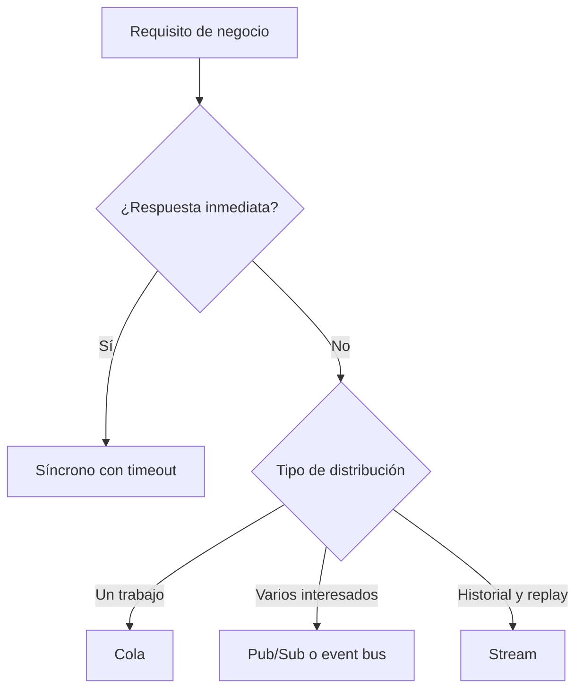
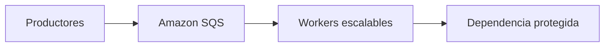
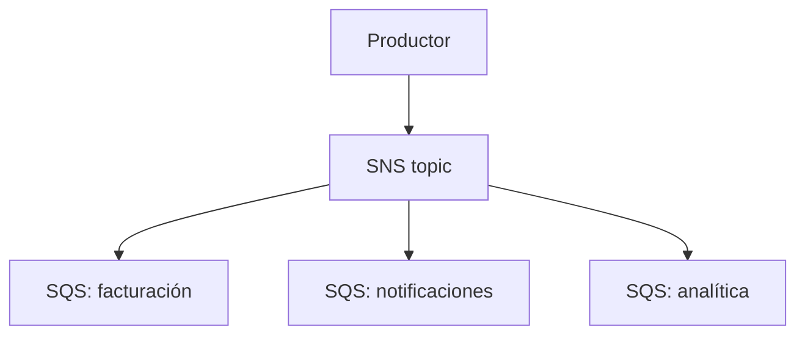
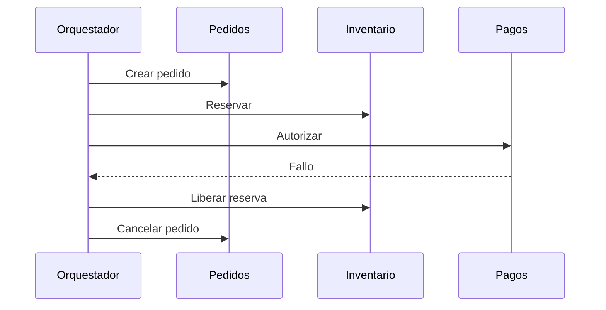
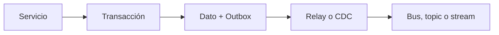

# Patrones de sistemas distribuidos en AWS para el examen SAA-C03

> Guía de estudio enfocada en desacoplamiento, comunicación asíncrona, mensajería, consistencia, idempotencia, control de fallos, transacciones distribuidas, particionamiento y selección de servicios AWS.
>
> Actualizado: julio de 2026.

## 1. Alcance necesario para el examen

Un sistema distribuido está formado por componentes independientes que se comunican mediante una red y colaboran para entregar una función de negocio.

Para el SAA-C03 se debe poder:

- Diseñar arquitecturas escalables y débilmente acopladas.
- Diferenciar comunicación síncrona y asíncrona.
- Diseñar componentes stateless que puedan escalar horizontalmente.
- Elegir entre cola, Pub/Sub, event bus, stream y workflow.
- Absorber picos mediante buffering y queue-based load leveling.
- Distribuir trabajo entre consumidores competidores.
- Diseñar consumidores idempotentes.
- Comprender las semánticas at-most-once, at-least-once y exactly-once.
- Controlar duplicados, orden, concurrencia y mensajes fallidos.
- Aplicar timeouts, retries, exponential backoff y jitter.
- Evitar fallos en cascada con circuit breaker, bulkheads y degradación controlada.
- Aplicar throttling, backpressure y load shedding.
- Diseñar transacciones entre microservicios mediante sagas y compensaciones.
- Evitar el problema de dual write con transactional outbox.
- Comprender consistencia fuerte, consistencia eventual y convergencia.
- Reconocer CQRS, materialized views y event sourcing.
- Diseñar claves de partición que distribuyan carga.
- Elegir una estrategia de caché según el patrón de acceso.
- Implementar observabilidad y trazabilidad de extremo a extremo.
- Seleccionar el servicio AWS más simple que satisfaga orden, entrega, retención, throughput y operación.

La guía oficial relaciona estos conocimientos principalmente con:

- **Dominio 2:** arquitecturas escalables, resilientes y débilmente acopladas.
- **Dominio 3:** cómputo elástico, mensajería, Pub/Sub, datos y caché de alto rendimiento.

> **Alcance:** este capítulo estudia patrones y decisiones. Las características completas de Amazon SQS, Amazon SNS, Amazon EventBridge, Amazon MQ y AWS Step Functions permanecen en `02-Application-Integration.md`.

---

## 2. Modelo fundamental de decisión

### Regla mental inicial

### Preguntas que se deben resolver

1. ¿El productor necesita una respuesta inmediata?
2. ¿El mensaje representa un comando, un evento o datos de streaming?
3. ¿Debe procesarlo un consumidor o varios?
4. ¿Debe conservarse hasta que sea procesado?
5. ¿Se necesita orden?
6. ¿El orden es global o únicamente por entidad?
7. ¿Se toleran duplicados?
8. ¿Se necesita replay?
9. ¿Cuánto tiempo deben retenerse los datos?
10. ¿Cuál es el throughput esperado?
11. ¿Cómo se escala el consumidor?
12. ¿Qué sucede cuando el consumidor falla?
13. ¿Cómo se detecta y reprocesa un mensaje problemático?
14. ¿La transacción modifica más de un servicio o data store?
15. ¿Qué consistencia exige el negocio?

### Servicio según la intención

| Intención principal | Patrón | Servicio habitual |
|---|---|---|
| Ejecutar una solicitud y obtener respuesta | Request-response | API Gateway, ALB o llamada de servicio |
| Conservar trabajo para un consumidor | Queue | Amazon SQS |
| Enviar una copia a varios consumidores | Publish-subscribe | Amazon SNS |
| Enrutar eventos según su contenido | Event routing | Amazon EventBridge |
| Conservar y reproducir una secuencia | Event stream | Kinesis Data Streams o Amazon MSK |
| Coordinar pasos, decisiones y compensaciones | Orchestration | AWS Step Functions |
| Mantener protocolos de broker existentes | Message broker | Amazon MQ |

> **Regla de examen:** cola para trabajo, topic para fan-out, event bus para ruteo, stream para historial reproducible y workflow para coordinación con estado.

---

## 3. Fundamentos de un sistema distribuido

### La red puede fallar

En una llamada remota pueden ocurrir varios resultados:

- La solicitud no llegó.
- La solicitud llegó y falló.
- La solicitud se procesó, pero la respuesta se perdió.
- La respuesta llegó fuera del tiempo esperado.
- El cliente reintentó y la operación se ejecutó dos veces.
- Una dependencia respondió con datos desactualizados.

El cliente no siempre puede distinguir estos casos. Por ello, el diseño necesita:

- Timeouts.
- Reintentos limitados.
- Idempotencia.
- Correlation IDs.
- Métricas y trazas.
- Reconciliación.

### Fallo parcial

Un sistema distribuido puede quedar parcialmente operativo:

- El frontend funciona, pero pagos no.
- Una AZ está disponible y otra no.
- El productor publica, pero un consumidor está detenido.
- La base acepta escrituras, pero una réplica tiene lag.
- Un servicio responde, pero una dependencia interna está saturada.

No se debe tratar cada fallo parcial como caída total si el negocio permite continuar con funcionalidad reducida.

### Latencia

Cada salto agrega:

- Tiempo de red.
- Serialización y deserialización.
- Autenticación.
- Encolamiento.
- Procesamiento.
- Reintentos.

Una cadena síncrona larga aumenta:

- Latencia acumulada.
- Probabilidad de fallo.
- Consumo de conexiones y threads.
- Dificultad para cumplir el timeout total.

### Concurrencia

Varios componentes pueden modificar o leer el mismo estado al mismo tiempo.

Mecanismos habituales:

- Optimistic locking con versión.
- Conditional writes.
- Transactions dentro del alcance soportado.
- Single writer por entidad.
- Serialización mediante message group o partition key.
- Idempotency keys.

### Relojes y orden

Los timestamps de hosts diferentes no garantizan por sí solos un orden global perfecto.

Para ordenar eventos se puede utilizar:

- Sequence number del stream.
- Versión de la entidad.
- Orden dentro de una partición.
- Logical clock o número monotónico definido por la aplicación.

> **Trampa de examen:** “último timestamp gana” es una política de conflicto, no una garantía universal de que el dato correcto sobrevivirá.

---

## 4. Límites, contratos y propiedad de datos

### Separar por capacidad de negocio

Un microservicio debe representar una responsabilidad coherente:

- Pedidos.
- Inventario.
- Pagos.
- Notificaciones.

Dividir únicamente por tablas o funciones técnicas puede producir demasiadas llamadas y acoplamiento.

### Propiedad de datos

Cada servicio debería controlar su propio estado.

| Diseño | Consecuencia |
|---|---|
| Base compartida por todos | Acoplamiento de schema y despliegue |
| Data store por servicio | Mayor autonomía y consistencia eventual |
| Acceso directo a tabla ajena | El consumidor depende de detalles internos |
| API o evento estable | Contrato explícito y evolución controlada |

### Contratos

Un contrato debe definir:

- Nombre y propósito.
- Schema.
- Campos requeridos y opcionales.
- Identificador del evento o solicitud.
- Versión.
- Semántica de entrega.
- Errores.
- Compatibilidad.

### Evolución compatible

Preferir:

- Agregar campos opcionales.
- Mantener consumidores tolerantes a campos desconocidos.
- Versionar cambios incompatibles.
- Evitar reutilizar un campo con significado diferente.
- Probar producers y consumers independientemente.

### Evento frente a comando

| Evento | Comando |
|---|---|
| Describe algo que ocurrió | Solicita ejecutar una acción |
| `PedidoCreado` | `ReservarInventario` |
| Puede interesar a varios consumidores | Suele tener un destino lógico |
| El productor no necesita conocer receptores | El emisor conoce la intención |
| Se expresa en pasado | Se expresa como acción |

> **Regla:** un evento es un hecho; no debe exigir que un consumidor específico haga algo para que el hecho sea verdadero.

---

## 5. Stateless, stateful y escalado horizontal

### Componente stateless

Una instancia stateless no depende de estado local exclusivo entre solicitudes.

El estado importante se almacena en:

- Amazon DynamoDB.
- Amazon RDS o Aurora.
- Amazon ElastiCache.
- Amazon EFS cuando se requiere un filesystem compartido.
- Amazon S3 para objetos.
- Una cola o workflow para trabajo pendiente.

### Ventajas

- Escalado horizontal.
- Reemplazo de instancias.
- Distribución Multi-AZ.
- Despliegues rolling o blue/green.
- Menor afinidad de sesión.

### Estado que suele causar problemas

- Sesión solo en memoria.
- Archivos solo en el disco local.
- Contadores locales no coordinados.
- Configuración modificada manualmente.
- Trabajo pendiente únicamente en un proceso.

### Sesiones

Opciones:

| Necesidad | Patrón |
|---|---|
| Evitar estado de servidor | Token firmado o sesión en cliente segura |
| Compartir sesión | ElastiCache o data store compatible |
| Mantener afinidad temporal | Sticky sessions, con menor flexibilidad |

Sticky sessions pueden ser válidas, pero no eliminan la necesidad de recuperar la sesión si la instancia desaparece.

### Escalado horizontal frente a vertical

| Horizontal | Vertical |
|---|---|
| Agregar nodos | Aumentar tamaño |
| Mejora resiliencia | Sigue dependiendo del recurso |
| Requiere distribución | Menor cambio inicial |
| Adecuado para stateless | Útil cuando el software no distribuye |
| Límite más flexible | Tiene un tamaño máximo |

> **Regla de examen:** si la pregunta pide elasticidad y alta disponibilidad, normalmente se busca escalado horizontal y componentes stateless.

---

## 6. Comunicación síncrona y asíncrona

### Comunicación síncrona

El cliente espera una respuesta para continuar.

Adecuada cuando:

- Se necesita respuesta inmediata.
- El usuario debe conocer el resultado.
- La consulta es rápida.
- El flujo no puede aceptar trabajo pendiente.

Riesgos:

- Acoplamiento temporal.
- Propagación de fallos.
- Latencia acumulada.
- Saturación de conexiones.
- Retry storms.

### Comunicación asíncrona

El productor registra trabajo o publica un evento y continúa.

Adecuada cuando:

- El procesamiento puede diferirse.
- Se deben absorber picos.
- Los componentes escalan a ritmos diferentes.
- El consumidor puede estar temporalmente inactivo.
- Varios consumidores necesitan reaccionar.

Costos de diseño:

- Consistencia eventual.
- Seguimiento del estado.
- Duplicados.
- Reintentos.
- DLQ.
- Observabilidad.

### Comparación

| Síncrona | Asíncrona |
|---|---|
| Respuesta inmediata | Acknowledgment de recepción |
| Acoplamiento temporal | Desacoplamiento temporal |
| Error visible al llamador | Error tratado fuera de la solicitud |
| Menor complejidad inicial | Mayor resiliencia ante picos |
| Cadena de dependencias | Buffer o evento intermedio |

### Patrón híbrido

Un API puede:

1. Validar la solicitud.
2. Guardar o encolar el trabajo.
3. Responder `202 Accepted`.
4. Procesar de forma asíncrona.
5. Permitir consultar el estado.

> **Trampa:** asíncrono no significa “sin respuesta”. El productor debe conocer si el trabajo fue aceptado y cómo consultar o recibir el resultado.

---

## 7. Queue-based load leveling

Una cola nivela la diferencia entre la velocidad de llegada y la capacidad de procesamiento.

### Beneficios

- Absorbe ráfagas.
- Evita saturar downstream.
- Conserva solicitudes.
- Permite escalar consumers de forma independiente.
- Separa disponibilidad de producer y consumer.

### Backlog

El backlog representa trabajo pendiente.

Métricas importantes:

- Cantidad aproximada de mensajes visibles.
- Antigüedad del mensaje más antiguo.
- Tasa de entrada.
- Tasa de salida.
- Mensajes en vuelo.
- Mensajes enviados a DLQ.

### Escalado de consumers

La cantidad total de mensajes no siempre es la mejor métrica. Se puede utilizar:

$$
\text{Backlog por worker} =
\frac{\text{Mensajes pendientes}}{\text{Workers activos}}
$$

La meta debe relacionarse con:

- Tiempo promedio de procesamiento.
- Latencia máxima aceptable.
- Capacidad de la dependencia.
- Concurrency disponible.

### Riesgo de cola ilimitada

Una cola no convierte capacidad insuficiente en capacidad suficiente.

Si la entrada supera continuamente la salida:

- Crece la latencia.
- Los mensajes pueden expirar.
- Aumenta el costo.
- La recuperación tarda más.
- Se incumple el objetivo de negocio.

Se debe controlar:

- Admission rate.
- Tamaño o antigüedad aceptable del backlog.
- Autoscaling.
- Throttling.
- Prioridades.
- Load shedding cuando corresponda.

---

## 8. Competing consumers

Varios workers consumen de una misma cola para repartir trabajo.

### Funcionamiento

- Cada mensaje representa una unidad independiente.
- Un worker recibe y oculta el mensaje.
- Procesa el trabajo.
- Elimina el mensaje después del éxito.
- Si falla, el mensaje vuelve a ser visible.

### Ventajas

- Throughput horizontal.
- Reemplazo de workers.
- Distribución de carga.
- Menor impacto por fallo de un consumer.

### Condiciones necesarias

- El trabajo puede procesarse en paralelo.
- Los workers son idempotentes.
- El visibility timeout cubre el procesamiento.
- El sistema downstream soporta la concurrencia.
- Existe una política para poison messages.

### Visibility timeout

Debe ser mayor que el tiempo de procesamiento esperado.

Si es demasiado corto:

- Otro worker recibe el mismo mensaje.
- Se producen duplicados concurrentes.

Si es demasiado largo:

- Un mensaje fallido tarda más en reintentarse.

Para trabajos variables se puede extender dinámicamente mediante la operación compatible.

### SQS con Lambda

- Lambda realiza polling.
- Entrega mensajes por lotes.
- El procesamiento sigue un modelo at-least-once.
- El código debe ser idempotente.
- Partial batch response evita reintentar mensajes exitosos cuando solo algunos fallan.
- La concurrencia debe proteger la base o API downstream.

> **Trampa de examen:** aumentar consumers puede empeorar el sistema si la base de datos es el cuello de botella.

---

## 9. Publish-subscribe y fan-out

Pub/Sub permite que un productor publique una vez y varios consumidores reciban su propia copia.

### SNS con SQS

La combinación proporciona:

- Fan-out.
- Una cola independiente por consumidor.
- Ritmo y escalado separados.
- Reintentos por consumidor.
- Aislamiento de fallos.
- Retención mientras un consumidor está inactivo.

### Topic directo frente a topic con colas

| Suscripción directa | SNS → SQS |
|---|---|
| Menor número de componentes | Mayor durabilidad del trabajo |
| Entrega push | Consumo pull o event source mapping |
| Endpoint debe estar listo | Queue absorbe indisponibilidad |
| Reintento depende de la suscripción | Consumer controla procesamiento |
| Adecuado para notificación simple | Adecuado para microservicios independientes |

### Filtering

Una filter policy evita enviar mensajes irrelevantes a una suscripción.

Beneficios:

- Menos código de filtrado.
- Menos invocaciones.
- Menor costo.
- Menor acoplamiento.

### Fan-out no es balanceo

- Varios consumers de **una cola** compiten por cada mensaje.
- Varias **suscripciones** reciben copias independientes.

> **Regla:** si tres sistemas deben procesar el mismo evento, usar tres suscripciones o colas; no tres workers compitiendo en una única cola.

---

## 10. Event bus y arquitecturas orientadas a eventos

### Event-driven architecture

Los producers emiten hechos y los consumers reaccionan según reglas.

Ventajas:

- Bajo conocimiento entre componentes.
- Integración many-to-many.
- Evolución independiente.
- Incorporación de nuevos consumers sin modificar producers.

### Amazon EventBridge

Adecuado para:

- Eventos de servicios AWS.
- Eventos de aplicaciones propias.
- Integraciones SaaS compatibles.
- Enrutamiento basado en contenido.
- Integración entre cuentas.
- Archive y replay cuando se configura.

### Event bus frente a SNS

| EventBridge | Amazon SNS |
|---|---|
| Reglas ricas por contenido | Pub/Sub y notificaciones |
| Eventos AWS, custom y SaaS | Publicación a topics |
| Many-to-many | One-to-many |
| Archive y replay opcional | Durabilidad mediante endpoints como SQS |
| Sin garantía de orden | FIFO disponible con endpoints compatibles |

### EventBridge Pipes

Una pipe crea una integración point-to-point:

1. Source.
2. Filter opcional.
3. Enrichment opcional.
4. Target.

Es útil para reducir código de integración. Un event bus sigue siendo más adecuado para ruteo many-to-many.

### Contratos de eventos

Incluir:

- `eventId`.
- `eventType`.
- `eventVersion`.
- `occurredAt`.
- Identificador de entidad.
- Correlation ID.
- Causation ID cuando se necesita rastrear el evento anterior.

### Loops

Una regla puede producir un evento que vuelva a activarla.

Prevenir mediante:

- Event patterns precisos.
- Estado terminal.
- Campo de origen.
- Idempotencia.
- Alarmas de volumen y costo.

---

## 11. Queue frente a stream

### Cola

- Representa trabajo pendiente.
- Un grupo de consumers procesa cada mensaje.
- El mensaje se elimina tras el éxito.
- Adecuada para distribución de tareas.

### Stream

- Representa una secuencia persistida.
- Varios consumers pueden leer independientemente.
- Los registros permanecen durante la retención.
- Permite replay dentro del periodo disponible.
- Adecuado para telemetría, CDC, analytics y event history.

### Comparación

| Amazon SQS | Kinesis Data Streams o Amazon MSK |
|---|---|
| Work queue | Event log |
| Mensaje eliminado después de procesar | Registro retenido |
| Consumers compiten | Consumer applications leen independientemente |
| Orden FIFO opcional | Orden dentro de shard o partition |
| Escalado administrado de cola | Capacidad asociada a shards o partitions |
| Replay mediante redrive o copia | Replay nativo durante retención |

### Kinesis Data Streams

- Orden dentro de un shard.
- Partition key determina distribución.
- Varios consumers pueden leer el stream.
- Retención configurable desde 24 horas hasta 365 días.
- Enhanced fan-out ofrece capacidad de lectura dedicada por consumer registrado.
- Checkpoint y procesamiento deben soportar duplicados.

### Amazon MSK

Adecuado cuando:

- Se requiere compatibilidad con Apache Kafka.
- Existen producers y consumers Kafka.
- Se necesitan topics, partitions, offsets y consumer groups.
- Se controla la retención y el replay con semántica Kafka.

### Selección rápida

- Tareas independientes → SQS.
- Telemetría ordenada por dispositivo → Kinesis.
- Plataforma Kafka existente → Amazon MSK.
- Ruteo por contenido sin log de larga duración → EventBridge.

> **Trampa:** un stream no reemplaza automáticamente una queue. El consumer administra offsets o checkpoints y los registros no desaparecen por haber sido procesados.

---

## 12. Semánticas de entrega

### At-most-once

- El mensaje puede perderse.
- No se reintenta después de una entrega incierta.
- Evita duplicados a costa de posible pérdida.

Adecuado únicamente cuando perder algunos datos es aceptable, por ejemplo determinadas métricas no críticas.

### At-least-once

- Se prioriza no perder el mensaje.
- Puede entregarse o procesarse más de una vez.
- Requiere consumidores idempotentes.

Es la semántica común en sistemas distribuidos resilientes.

### Exactly-once

Debe analizarse dentro de un alcance concreto:

- Deduplicación al publicar.
- Ejecución de un workflow.
- Escritura en un data store.
- Efecto de negocio de extremo a extremo.

Un componente puede ofrecer exactly-once dentro de su frontera sin garantizar que una operación externa se ejecute una sola vez.

### Ejemplo de resultado incierto

1. El consumer aplica un pago.
2. Falla antes de registrar el acknowledgment.
3. El mensaje vuelve a entregarse.
4. Sin idempotencia, el pago puede duplicarse.

### Servicios que se deben diferenciar

| Servicio o modo | Semántica relevante |
|---|---|
| SQS Standard | At-least-once; puede haber duplicados |
| SQS FIFO | Orden y deduplicación dentro de la semántica definida |
| Lambda event source mapping | At-least-once |
| Step Functions Standard | Exactly-once de ejecución del workflow, salvo Retry definido |
| Step Functions Express | At-least-once |
| Streams y consumers | Diseñar para reprocesamiento y duplicados |

> **Regla de examen:** aunque aparezca la expresión exactly-once, revisar los side effects fuera del servicio y mantener idempotencia cuando un retry sea posible.

---

## 13. Idempotencia y deduplicación

### Definición

Una operación idempotente produce el mismo resultado observable aunque se ejecute varias veces con la misma intención.

Ejemplos:

- Crear el pedido `P-100` una sola vez.
- Aplicar una transacción con un identificador único.
- Establecer el estado en `PAGADO`.
- Guardar un objeto con una clave determinística.

Operaciones naturalmente menos seguras:

- Incrementar un contador.
- Debitar sin transaction ID.
- Enviar un correo en cada intento.
- Crear un recurso con un ID aleatorio nuevo.

### Idempotency key

El producer genera una clave única por operación de negocio.

El consumer:

1. Recibe la clave.
2. Comprueba si ya fue procesada.
3. Registra el resultado de forma atómica.
4. Ejecuta o devuelve el resultado anterior.

### Estado conceptual

| Idempotency key | Estado | Resultado |
|---|---|---|
| `PAY-1001` | `IN_PROGRESS` | Operación iniciada |
| `PAY-1002` | `COMPLETED` | Respuesta almacenada |
| `PAY-1003` | `FAILED_RETRYABLE` | Puede reintentarse |

### Implementaciones AWS

- DynamoDB conditional write con clave única.
- Transacción de base de datos.
- Constraint única en RDS o Aurora.
- Powertools for AWS Lambda para idempotencia, cuando corresponda.
- SQS FIFO con deduplication ID para evitar duplicados de envío dentro de la ventana soportada.

### SQS FIFO

- Deduplication ID evita que un retry de envío introduzca otra copia durante la ventana compatible de cinco minutos.
- Content-based deduplication calcula la clave a partir del body, no de los message attributes.
- Message group conserva orden dentro del grupo.

SQS FIFO no impide por sí solo que un consumer:

- Ejecute un side effect y falle antes de borrar el mensaje.
- Sea invocado nuevamente.
- Duplique una operación externa.

### Caducidad del registro

El registro de idempotencia debe conservarse al menos durante el periodo en que un duplicate puede reaparecer.

Considerar:

- Retención de la queue o stream.
- Archive y replay.
- Retries.
- Reconciliación manual.
- Requisitos de auditoría.

---

## 14. Orden, particionamiento y paralelismo

### Orden global

Procesar todos los mensajes en un único orden limita el paralelismo.

Solo debe solicitarse cuando el negocio realmente lo necesita.

### Orden por entidad

Frecuentemente se necesita orden únicamente para:

- Una cuenta.
- Un pedido.
- Un dispositivo.
- Un cliente.

Se utiliza el identificador como:

- SQS message group ID.
- Kinesis partition key.
- Kafka record key.

Esto permite procesar entidades distintas en paralelo.

### Ejemplo

| Entidad | Secuencia |
|---|---|
| Pedido A | Creado → Pagado → Enviado |
| Pedido B | Creado → Cancelado |

El sistema debe conservar el orden dentro de cada pedido, pero no necesita decidir si un evento del pedido A ocurrió antes que uno del B.

### Escalado

| Diseño | Paralelismo |
|---|---|
| Un único message group | Uno por vez para ese grupo |
| Muchos message groups | Paralelismo entre grupos |
| Un shard | Capacidad limitada por ese shard |
| Varios shards bien distribuidos | Procesamiento paralelo |
| Hot partition key | Concentración y throttling |

### Eventos fuera de orden

El consumer puede:

- Rechazar una versión antigua.
- Almacenar temporalmente hasta completar la secuencia.
- Aplicar optimistic locking.
- Reconciliar con el sistema de registro.
- Diseñar operaciones conmutativas cuando sea posible.

### Regla de versión

Un evento puede incluir:

- `entityId`.
- `entityVersion`.
- `eventId`.

El consumer aplica el cambio únicamente si la versión es la esperada o si es mayor según la política definida.

> **Trampa:** FIFO no significa paralelismo cero. Message groups diferentes pueden procesarse en paralelo.

---

## 15. Timeouts, retries, backoff y jitter

### Timeout

Toda llamada remota debe tener límites apropiados:

- Connection timeout.
- Request timeout.
- Tiempo total del proceso.

No depender de valores predeterminados sin validarlos.

### Jerarquía de timeouts

En una cadena:

`Cliente → API → Servicio A → Servicio B`

El timeout de una dependencia debe permitir que el caller:

- Reciba el error.
- Libere recursos.
- Aplique fallback o retry.
- Responda antes de su propio límite.

### Qué se debe reintentar

| Tipo de fallo | Acción habitual |
|---|---|
| Timeout transitorio | Retry limitado |
| Throttling | Backoff y jitter |
| Error 5xx transitorio | Retry según política |
| Error de validación | Fail fast |
| Unauthorized o AccessDenied | Corregir configuración |
| Recurso inexistente definitivo | No reintentar indefinidamente |

### Exponential backoff

El tiempo aumenta después de cada intento.

Modelo conceptual:

$$
t_n = \min(t_{\max}, t_0 \times 2^n) + \text{jitter}
$$

El jitter agrega variación para evitar que todos los clientes reintenten simultáneamente.

### Retry budget

Definir:

- Máximo de intentos.
- Máximo tiempo total.
- Errores reintentables.
- Capa responsable del retry.
- Política al agotar intentos.

### Retry storm

Si cada capa reintenta tres veces:

- API Gateway.
- Aplicación.
- SDK.
- Base o dependencia.

Una solicitud puede multiplicarse de forma inesperada.

Preferir una estrategia coordinada y conocer los retries ya implementados por SDKs y servicios.

### Regla de seguridad

Reintentar operaciones mutables únicamente si:

- Son idempotentes.
- Tienen una idempotency key.
- El servicio proporciona un token de cliente compatible.

> **Regla de examen:** retry sin backoff puede aumentar la falla; retry sin idempotencia puede duplicar el efecto.

---

## 16. Circuit breaker, fail fast y fallback

### Circuit breaker

Evita continuar llamando a una dependencia que falla repetidamente.

Estados conceptuales:

| Estado | Comportamiento |
|---|---|
| Closed | Las solicitudes pasan |
| Open | Se rechazan rápidamente |
| Half-open | Se permiten pruebas limitadas |

### Beneficios

- Evita consumir threads y conexiones.
- Reduce carga sobre una dependencia degradada.
- Permite recuperación.
- Evita fallos en cascada.

### Fail fast

Rechazar rápidamente cuando:

- La solicitud es inválida.
- No existe capacidad.
- La dependencia está marcada como no saludable.
- El resultado ya no puede cumplir el deadline.

Fail fast no significa perder trabajo. Para procesos diferibles puede significar:

- Encolar.
- Responder `202 Accepted`.
- Aplicar fallback.

### Fallback

Ejemplos:

- Mostrar datos de caché.
- Omitir recomendaciones.
- Utilizar valores predeterminados seguros.
- Aceptar trabajo para procesamiento posterior.
- Servir una respuesta parcial.

### Circuit breaker frente a retry

| Retry | Circuit breaker |
|---|---|
| Supone fallo transitorio | Reconoce fallo sostenido |
| Intenta nuevamente | Detiene temporalmente llamadas |
| Consume capacidad adicional | Protege recursos |
| Backoff y límite | Open, half-open y closed |

### Uso conjunto

1. Timeout.
2. Retry limitado para fallos transitorios.
3. Abrir circuit breaker si el error persiste.
4. Fallback o degradación.
5. Probar recuperación.

---

## 17. Bulkhead, celdas y aislamiento

El patrón bulkhead separa recursos para que una falla no consuma toda la capacidad.

### Formas de aislamiento

- Queues separadas.
- Thread pools separados.
- Connection pools separados.
- Concurrency reservada.
- Cuentas o VPC diferentes.
- Shards o celdas.
- Límites por tenant.

### Ejemplo

Una plataforma procesa:

- Pagos críticos.
- Reportes pesados.

Si ambos usan la misma queue y workers, los reportes pueden retrasar pagos. Separar colas y capacidad protege el flujo crítico.

### Cell-based architecture

Cada celda atiende un subconjunto de usuarios o entidades con:

- Cómputo.
- Datos.
- Capacidad.
- Límites.

Ventajas:

- Menor blast radius.
- Escalado repetible.
- Fallo limitado.

Costos:

- Operación más compleja.
- Distribución de tenants.
- Rebalanceo.
- Datos entre celdas.

### Prioridades

Amazon SQS no proporciona una prioridad general automática entre mensajes de una misma standard queue.

Un patrón habitual es:

- Queue alta.
- Queue normal.
- Queue baja.
- Consumers y capacidad separados.

> **Regla:** aislamiento de carga crítica suele ser más seguro que confiar únicamente en que el autoscaling reaccionará.

---

## 18. Backpressure, throttling y load shedding

### Backpressure

El consumer indica, directa o indirectamente, que no puede procesar más rápido.

Una queue implementa backpressure desacoplando llegada y procesamiento, pero el backlog debe permanecer dentro de límites.

### Throttling

Limita solicitudes para proteger capacidad.

Puede aplicarse en:

- Amazon API Gateway.
- AWS WAF para reglas de rate-based filtering.
- La aplicación detrás de un load balancer.
- Lambda reserved concurrency.
- Consumers de SQS.
- Data stores mediante capacidad configurada.

### Load shedding

Rechaza trabajo no esencial cuando la capacidad está comprometida.

Ejemplos:

- Rechazar reportes de baja prioridad.
- Desactivar recomendaciones.
- Limitar usuarios abusivos.
- Reducir calidad de una respuesta no crítica.

### Admission control

Antes de aceptar trabajo, comprobar:

- Capacidad.
- Deadline.
- Cuota.
- Prioridad.
- Tamaño del backlog.

### Señales para escalar o limitar

| Señal | Interpretación |
|---|---|
| Queue depth | Trabajo acumulado |
| Age of oldest message | Latencia real del backlog |
| CPU | Presión de cómputo |
| Concurrency | Ejecuciones simultáneas |
| Throttles | Límite alcanzado |
| Error rate | Saturación o dependencia fallida |
| Latencia p95/p99 | Experiencia de cola larga |

### Evitar autoscaling inestable

- Escalar con una métrica relacionada con demanda.
- Usar cooldowns adecuados.
- Proteger downstream.
- Mantener capacidad mínima si la latencia lo exige.
- Probar picos y recuperación.

---

## 19. Dead-letter queue, poison messages y redrive

### Poison message

Es un mensaje que falla repetidamente por:

- Schema inválido.
- Dato no compatible.
- Bug del consumer.
- Dependencia permanente inexistente.
- Permisos.

### DLQ

Después de varios intentos, el mensaje se mueve a una dead-letter queue.

La DLQ permite:

- Aislar el problema.
- Mantener el flujo principal.
- Investigar.
- Corregir.
- Reprocesar.

### Una DLQ necesita operación

Configurar:

- Alarma si contiene mensajes.
- Retención suficiente.
- Acceso restringido.
- Runbook.
- Dashboard.
- Política de redrive.

Para SQS es una práctica recomendada mantener la retención de la DLQ mayor que la de la queue de origen.

### Redrive

Antes de reprocesar:

1. Identificar la causa.
2. Corregir consumer, permisos o datos.
3. Definir velocidad.
4. Evitar sobrecargar downstream.
5. Mantener idempotencia.
6. Observar resultados.

### Riesgos

- Redrive masivo.
- Duplicar side effects.
- Reintroducir el mismo poison message.
- Perder el orden FIFO.
- Usar DLQ como archivo permanente.

### DLQ frente a archive

| DLQ | Archive |
|---|---|
| Mensajes que fallaron | Historial seleccionado de eventos |
| Diagnóstico y redrive | Replay por periodo |
| Resultado excepcional | Capacidad planificada |
| Normalmente SQS | EventBridge Archive, stream o almacenamiento |

> **Trampa:** configurar una DLQ sin alarma ni procedimiento no completa la solución.

---

## 20. Orquestación frente a coreografía

### Orquestación

Un coordinador conoce el proceso.

Adecuada cuando:

- Existe una secuencia.
- Hay decisiones.
- Se necesitan retries y catch centralizados.
- Debe verse el estado.
- Hay compensaciones.

AWS Step Functions puede implementar:

- Task.
- Choice.
- Wait.
- Parallel.
- Map.
- Retry.
- Catch.
- Timeout.

### Coreografía

Cada servicio reacciona a eventos y publica otros.

Adecuada cuando:

- Hay pocos participantes.
- Las reacciones son independientes.
- Se busca bajo acoplamiento central.
- No se necesita un estado global explícito.

### Comparación

| Orquestación | Coreografía |
|---|---|
| Coordinador central | Reacciones distribuidas |
| Flujo visible | Flujo emergente |
| Manejo central de errores | Manejo en cada participante |
| Menor autonomía del flujo | Mayor autonomía |
| Step Functions | EventBridge o SNS |
| Fácil auditar secuencia | Requiere trazabilidad fuerte |

### Riesgos de coreografía

- Ciclos de eventos.
- Dependencias difíciles de descubrir.
- Compensaciones distribuidas.
- Debugging complejo.
- Dual write.

### Diseño combinado

Un patrón común:

- Step Functions coordina el proceso crítico.
- EventBridge publica hechos del resultado.
- Consumers secundarios reaccionan de forma independiente.

> **Regla:** orquestar el flujo que debe completar una transacción; publicar eventos para efectos secundarios independientes.

---

## 21. Saga y transacciones distribuidas

Una saga divide una transacción de negocio en transacciones locales.

Ejemplo:

1. Crear pedido.
2. Reservar inventario.
3. Autorizar pago.
4. Confirmar envío.

Si un paso falla, se ejecutan acciones de continuación o compensación.

### Compensación

No siempre es un rollback técnico exacto.

| Acción | Compensación posible |
|---|---|
| Reservar inventario | Liberar reserva |
| Autorizar pago | Revertir autorización |
| Emitir cupón | Invalidar cupón |
| Crear envío | Cancelar envío si aún es posible |

Una compensación puede:

- Fallar.
- Requerir retry.
- Necesitar intervención.
- Tener efectos externos irreversibles.

### Saga orquestada

### Saga coreografiada

- Pedido publica `PedidoCreado`.
- Inventario publica `InventarioReservado`.
- Pagos publica `PagoRechazado`.
- Otros servicios reaccionan con compensaciones.

### Cuándo elegir Step Functions

- El orden es explícito.
- El proceso tiene larga duración.
- Se necesita auditoría.
- Existen retries, timeouts o compensaciones.
- Se integran varios servicios AWS.

### Standard frente a Express

| Standard | Express |
|---|---|
| Larga duración | Hasta cinco minutos |
| Historial administrado | Logging debe configurarse |
| Exactly-once de workflow salvo Retry | At-least-once |
| Acciones no idempotentes compatibles | Acciones idempotentes |
| Cobro por state transition | Adecuado para alto volumen |

> **Trampa:** Saga no proporciona una transacción ACID global. Logra consistencia mediante transacciones locales y compensaciones.

---

## 22. Transactional outbox y el problema de dual write

### Dual write

Un servicio necesita:

1. Actualizar su base.
2. Publicar un evento.

No existe atomicidad automática entre ambos sistemas.

Posibles fallos:

| Base de datos | Evento | Resultado |
|---|---|---|
| Commit | Publicado | Correcto |
| Rollback | Publicado | Evento describe un cambio inexistente |
| Commit | No publicado | Otros servicios no conocen el cambio |

### Transactional outbox

El servicio guarda dentro de la misma transacción:

- El cambio de negocio.
- Un registro en una tabla outbox.

Luego un relay publica los eventos pendientes.

### Propiedades

- El evento solo existe si el commit fue exitoso.
- El relay puede reintentar.
- Puede publicar duplicados.
- El consumer continúa necesitando idempotencia.
- Debe conservarse orden cuando el negocio lo exige.

### Implementaciones

- Tabla outbox en RDS o Aurora y publisher.
- DynamoDB transaction para estado y outbox en tablas compatibles.
- DynamoDB Streams para reaccionar a cambios.
- Change Data Capture con una solución compatible.

### Inbox

Un consumer puede mantener una tabla inbox con los event IDs procesados.

- Outbox protege publicación.
- Inbox protege consumo.

> **Regla de examen:** si una respuesta propone “guardar en la base y después publicar” sin resolver la falla entre ambas acciones, todavía existe dual write.

---

## 23. CQRS, materialized views y event sourcing

### CQRS

**Command Query Responsibility Segregation** separa:

- Modelo de escritura.
- Modelo de lectura.

Adecuado cuando:

- Lecturas y escrituras tienen patrones diferentes.
- Las consultas necesitan una vista desnormalizada.
- El volumen de lectura es mucho mayor.
- Se aceptan proyecciones eventualmente consistentes.

### Materialized view

Una vista precalculada optimiza consultas.

Ejemplo:

- Pedidos mantiene su data store.
- Inventario mantiene el suyo.
- Precios mantiene el suyo.
- Eventos actualizan una vista de catálogo consolidada.

### Beneficios y costos

| Beneficio | Costo |
|---|---|
| Consultas rápidas | Duplicación de datos |
| Escalado independiente | Consistencia eventual |
| Modelo adaptado al consumidor | Pipeline de actualización |
| Menos joins distribuidos | Rebuild y reconciliación |

### Event sourcing

El estado se representa como una secuencia inmutable de eventos.

Ejemplo:

- `CuentaCreada`.
- `DepositoRealizado`.
- `RetiroRealizado`.

El estado actual se reconstruye aplicando los eventos.

### Ventajas

- Historial completo.
- Auditoría.
- Replay.
- Reconstrucción de proyecciones.
- Análisis temporal.

### Desventajas

- Mayor complejidad.
- Versionado de eventos.
- Crecimiento del event store.
- Replays costosos.
- Proyecciones eventualmente consistentes.
- Manejo de información que debe eliminarse o anonimizarse.

### Event sourcing no es igual a event-driven

| Event-driven | Event sourcing |
|---|---|
| Componentes reaccionan a eventos | Los eventos son la fuente de verdad |
| Puede conservar solo estado actual | Conserva historial de cambios |
| No exige replay completo | Reconstruye estado mediante replay |

### Selección

- Necesidad de consulta rápida → caché o materialized view.
- Lecturas y escrituras muy diferentes → evaluar CQRS.
- Auditoría y reconstrucción completa → evaluar event sourcing.
- Aplicación CRUD sencilla → no agregar estos patrones sin necesidad.

---

## 24. Consistencia en sistemas distribuidos

### Consistencia fuerte

Después de una escritura exitosa, una lectura compatible devuelve el valor actualizado.

Adecuada para:

- Validar saldo.
- Evitar doble reserva.
- Control de concurrencia.
- Decisiones críticas.

### Consistencia eventual

Las réplicas o proyecciones convergen con el tiempo.

Adecuada para:

- Feeds.
- Catálogos.
- Métricas.
- Recomendaciones.
- Copias de lectura donde se tolera lag.

### Consistencia no es durabilidad

- Consistencia: qué valor se observa.
- Durabilidad: si el dato sobrevivirá.
- Disponibilidad: si puede accederse al sistema.

### Read-after-write

Una aplicación puede necesitar que el usuario vea su cambio inmediatamente.

Patrones:

- Leer del writer por un periodo.
- Devolver el nuevo estado en la respuesta.
- Session consistency.
- Esperar confirmación de proyección.
- Mostrar estado `PENDIENTE`.

### Conflictos

En diseños multi-writer se debe definir:

- Propiedad del dato.
- Versión.
- Merge.
- Last writer wins cuando sea aceptable.
- Reglas de negocio.
- Reconciliación.

### CAP como regla conceptual

Durante una partición de red, un sistema distribuido debe decidir cómo equilibrar:

- Consistencia.
- Disponibilidad.

No se usa CAP para afirmar que un servicio es siempre “CP” o “AP” en todas sus operaciones. Se debe revisar la configuración y semántica concreta.

### Regla de negocio

| Función | Preferencia habitual durante degradación |
|---|---|
| Cobrar | Consistencia |
| Mostrar recomendaciones | Disponibilidad |
| Reservar unidad única | Consistencia |
| Servir catálogo | Disponibilidad con datos posiblemente antiguos |

> **Trampa:** la consistencia eventual no significa datos incorrectos permanentemente; significa que existe una ventana de convergencia que la aplicación debe manejar.

---

## 25. Particionamiento, sharding y hot keys

### Objetivo

Distribuir datos y carga entre varias unidades de capacidad.

Una partition key adecuada:

- Tiene alta cardinalidad.
- Distribuye tráfico.
- Coincide con access patterns.
- Evita concentrar una entidad extremadamente activa.

### Hot partition

Ocurre cuando una clave o rango recibe una proporción excesiva de tráfico.

Ejemplos:

- Fecha del día como única clave.
- Todos los dispositivos usan `GLOBAL`.
- Un tenant concentra todas las solicitudes.
- Un SQS FIFO message group único.
- Una Kinesis partition key única.

### Consecuencias

- Throttling.
- Latencia.
- Capacidad infrautilizada en otras particiones.
- Menor paralelismo.

### Mitigaciones

- Agregar hash o suffix.
- Dividir una entidad caliente.
- Aumentar message groups.
- Elegir claves con mayor cardinalidad.
- Cachear lecturas.
- Preagregar en varios buckets y consolidar.

### Trade-off

Distribuir escrituras puede dificultar:

- Consultas por rango.
- Orden global.
- Transacciones.
- Agregaciones.

Por ello, la clave debe diseñarse desde los access patterns y no solo desde la estructura del dato.

### Kinesis y Kafka

- Orden se conserva dentro de la partición.
- Aumentar particiones mejora paralelismo.
- Una clave caliente limita capacidad.
- Consumers no pueden superar indefinidamente el paralelismo disponible por partición.

### DynamoDB

- Diseñar partition key para distribución.
- Evitar filtros que lean grandes cantidades y descarten.
- Utilizar sort key para patrones de rango dentro de una partición.
- Considerar sharding de escritura para claves extremadamente calientes.

> **Regla de examen:** más capacidad total no corrige necesariamente una única clave caliente.

---

## 26. Patrones de caché

### Cache-aside

1. La aplicación consulta caché.
2. Si hay miss, consulta la base.
3. Guarda el resultado en caché.

Ventajas:

- Solo se cachea lo utilizado.
- Control desde la aplicación.

Riesgos:

- Primer acceso lento.
- Datos antiguos.
- Cache stampede.

### Write-through

La escritura actualiza caché y data store mediante el mecanismo definido.

Ventaja:

- Caché caliente.

Riesgo:

- Mayor latencia y complejidad de escritura.

### Write-behind

La caché acepta cambios y persiste después.

Ventaja:

- Escritura rápida.

Riesgo:

- Pérdida o inconsistencia si falla antes de persistir.

No utilizar para datos críticos sin durabilidad compatible.

### TTL

El TTL equilibra:

- Freshness.
- Hit ratio.
- Carga sobre origen.
- Memoria.

Un TTL corto:

- Datos más frescos.
- Más misses.

Un TTL largo:

- Menos carga.
- Mayor riesgo de datos antiguos.

### Invalidación

Opciones:

- TTL.
- Evento de cambio.
- Invalidación explícita.
- Versioned cache key.

### Cache stampede

Cuando una clave popular expira, muchos clientes consultan el origen simultáneamente.

Mitigar con:

- Jitter en TTL.
- Request coalescing.
- Lock corto.
- Stale-while-revalidate.
- Precarga.

### Servicios

| Necesidad | Servicio |
|---|---|
| Caché de aplicación en memoria | Amazon ElastiCache |
| Caché compatible con DynamoDB | DynamoDB Accelerator, cuando aplica |
| Contenido web global | Amazon CloudFront |
| Caché de respuestas API | API Gateway cache compatible |

> **Trampa:** una caché mejora rendimiento, pero agrega invalidación y consistencia; no debe ser la única copia de datos críticos.

---

## 27. Observabilidad distribuida

### Tres señales principales

- Métricas.
- Logs.
- Traces.

### Propagación de contexto

Cada solicitud o evento debería transportar:

- Correlation ID.
- Trace context.
- Event ID.
- Entity ID.
- Causation ID cuando sea útil.

No transportar:

- Secretos.
- Tokens innecesarios.
- Datos sensibles sin justificación.

### Métricas por patrón

| Patrón | Métricas |
|---|---|
| API síncrona | Latencia, errors y requests |
| SQS | Depth, age, in-flight y DLQ |
| Lambda | Errors, duration, throttles y concurrency |
| EventBridge | Failed invocations y DLQ |
| Kinesis | Iterator age, throughput y throttles |
| Step Functions | Failed, timed out, aborted y duration |
| Caché | Hit ratio, evictions y memory |
| Data store | Latencia, connections, throttles y lag |

### Edad frente a cantidad

Una queue con 10 mensajes de una hora puede ser más crítica que una con 1.000 mensajes recientes.

Monitorizar:

- Backlog.
- Age of oldest message.
- Tasa de drenaje.
- Tiempo estimado para vaciar.

### Distributed tracing

AWS X-Ray y las capacidades compatibles de observabilidad ayudan a:

- Visualizar dependencias.
- Encontrar latencia.
- Relacionar errores.
- Identificar retries.
- Analizar el camino de una solicitud.

### Logs

Preferir logs estructurados con:

- Timestamp.
- Nivel.
- Servicio.
- Operación.
- Correlation ID.
- Resultado.
- Error code.

Evitar registrar datos sensibles.

### Alarmas accionables

Una alarma debe asociarse con:

- Impacto.
- Responsable.
- Runbook.
- Umbral.
- Acción.

---

## 28. Seguridad en patrones distribuidos

### Menor privilegio

Separar permisos:

- Producer puede publicar.
- Consumer puede recibir y borrar.
- Administrador puede cambiar configuración.
- Operador de redrive tiene una función específica.

### Resource policies

Se utilizan según el servicio para permitir:

- SNS → SQS.
- EventBridge → target.
- Acceso cross-account.
- S3 → servicios compatibles.

Restringir con condiciones como:

- Source ARN.
- Source account.
- Organization ID cuando corresponde.

### Cifrado

- TLS en tránsito.
- Cifrado administrado o AWS KMS en reposo según servicio.
- Key policy que permita al servicio y principals autorizados.
- Planificar permisos cross-account.

### Acceso privado

Cuando el requisito evita internet público, utilizar VPC endpoints compatibles.

Esto no elimina:

- IAM.
- Resource policies.
- Security groups para interface endpoints.
- DNS y routing.

### Contenido de eventos

Minimizar:

- PII.
- Credenciales.
- Tokens.
- Datos completos si basta un identificador.

Un evento puede ser:

- Persistido.
- Reintentado.
- Enviado a DLQ.
- Archivado.
- Reproducido.

### Confused deputy

Restringir una policy de servicio con condiciones de origen cuando sea compatible.

### Replay seguro

Reprocesar eventos antiguos puede:

- Reenviar correos.
- Reaplicar pagos.
- Reabrir estados.

Utilizar:

- Idempotencia.
- Entorno o destino controlado.
- Filtros.
- Ventana definida.
- Autorización.

---

## 29. Matriz de decisión de servicios y patrones

| Requisito | Elección principal | Motivo |
|---|---|---|
| Un mensaje para un worker | SQS Standard | Work queue de alto throughput |
| Orden por entidad y deduplicación | SQS FIFO | Message group y deduplication |
| Una copia para varios sistemas | SNS + una SQS por consumer | Fan-out durable y aislamiento |
| Ruteo por campos del evento | EventBridge | Event patterns |
| Integración point-to-point sin glue code | EventBridge Pipes | Source, filter, enrichment y target |
| Secuencia con replay | Kinesis Data Streams | Stream retenido por shards |
| Compatibilidad Kafka | Amazon MSK | Topics, partitions y consumer groups |
| Protocolos ActiveMQ o RabbitMQ | Amazon MQ | Broker administrado compatible |
| Workflow con decisiones | Step Functions | Estado, Choice, Retry y Catch |
| Transacción entre servicios | Saga | Transacciones locales y compensaciones |
| Base + evento atómicamente relacionados | Transactional outbox | Evita dual write inconsistente |
| Procesamiento duplicado posible | Idempotency key | Side effect único |
| Dependencia falla repetidamente | Circuit breaker | Evita fallos en cascada |
| Picos sobre downstream | Queue-based load leveling | Buffer y escalado separado |
| Consultas muy diferentes de escrituras | CQRS | Modelos independientes |
| Historial como fuente de verdad | Event sourcing | Replay y auditoría |
| Clave demasiado activa | Sharding | Distribución de carga |
| Lecturas repetitivas | Cache-aside | Reduce latencia y carga |

### Selección SQS, SNS, EventBridge, Kinesis o Step Functions

| Pregunta | Servicio |
|---|---|
| ¿Quién puede ejecutar este trabajo? | SQS |
| ¿Quiénes deben recibir una copia? | SNS |
| ¿Qué consumers coinciden con el contenido? | EventBridge |
| ¿Quién debe leer este historial? | Kinesis o MSK |
| ¿Qué paso se ejecuta después? | Step Functions |

---

## 30. Arquitecturas de referencia para el examen

### Procesamiento asíncrono de pedidos

1. API Gateway recibe solicitud.
2. Lambda valida.
3. Se registra una idempotency key.
4. SQS conserva el trabajo.
5. Lambda o ECS procesa.
6. DynamoDB o RDS guarda estado.
7. DLQ conserva fallos agotados.
8. CloudWatch alarma por antigüedad y DLQ.

### Fan-out de eventos de negocio

1. Servicio publica `PedidoConfirmado`.
2. SNS entrega a colas independientes.
3. Facturación consume su queue.
4. Notificaciones consume su queue.
5. Analítica consume su queue.
6. Cada consumer escala y reintenta de forma independiente.

### Event routing entre cuentas

1. Aplicación publica en un event bus.
2. Rules seleccionan por `source`, `detail-type` y detalle.
3. Eventos se envían a buses o targets autorizados.
4. Resource policies restringen origen.
5. DLQ captura fallos de entrega.

### Streaming de telemetría

1. Dispositivos publican con device ID como partition key.
2. Kinesis conserva orden por dispositivo.
3. Consumers independientes procesan alertas y analítica.
4. Firehose puede entregar datos a S3 para histórico.
5. Consumers usan checkpoint e idempotencia.

### Saga de compra

1. Step Functions crea pedido.
2. Reserva inventario.
3. Autoriza pago.
4. Si pago falla, libera inventario.
5. Registra estado final.
6. Publica evento final para efectos secundarios.

---

## 31. Casos razonados de examen

### Caso 1: picos de carga

**Situación:** una API recibe 20.000 solicitudes en pocos minutos, pero la base procesa 500 por segundo.

**Decisión:** colocar SQS entre recepción y procesamiento, escalar consumers dentro de la capacidad de la base y vigilar antigüedad.

**Distractor:** agregar consumers sin controlar conexiones a la base.

### Caso 2: tres sistemas requieren el mismo evento

**Situación:** facturación, correo y analítica deben procesar cada pedido.

**Decisión:** SNS con una SQS por sistema.

**Motivo:** fan-out, buffering y fallos aislados.

### Caso 3: solo un worker debe procesar

**Situación:** diez workers comparten trabajos independientes.

**Decisión:** una SQS con competing consumers.

**Distractor:** topic SNS directo a los diez workers, porque crearía copias.

### Caso 4: ruteo por contenido

**Situación:** eventos de varias cuentas deben enviarse a targets según tipo, región y estado.

**Decisión:** EventBridge con event patterns y policies apropiadas.

### Caso 5: orden por cliente

**Situación:** las operaciones de una cuenta deben ejecutarse en secuencia, pero cuentas diferentes pueden procesarse en paralelo.

**Decisión:** SQS FIFO con account ID como message group ID.

**Distractor:** un único message group global.

### Caso 6: telemetría y replay

**Situación:** varias aplicaciones deben leer datos de sensores y poder reprocesar las últimas horas.

**Decisión:** Kinesis Data Streams con partition key distribuida y retención compatible.

**Distractor:** SQS, porque elimina mensajes al finalizar.

### Caso 7: Kafka existente

**Situación:** producers y consumers ya utilizan APIs y ecosistema Kafka.

**Decisión:** Amazon MSK.

**Distractor:** reescribir todo para SQS sin requisito de modernización.

### Caso 8: cobro duplicado

**Situación:** un consumer cobra correctamente, pero falla antes del acknowledgment.

**Decisión:** idempotency key o transaction ID único registrado de forma atómica.

**Distractor:** confiar únicamente en visibility timeout.

### Caso 9: un mensaje daña el lote

**Situación:** Lambda procesa diez mensajes SQS; uno falla y nueve se repiten.

**Decisión:** partial batch response e idempotencia.

### Caso 10: dependencia saturada

**Situación:** una API de terceros responde con timeouts y miles de clientes reintentan de inmediato.

**Decisión:** timeout, retries limitados con exponential backoff y jitter, circuit breaker y fallback.

### Caso 11: proceso de compra distribuido

**Situación:** pedido, inventario y pago usan bases diferentes y se necesitan compensaciones.

**Decisión:** saga orquestada con Step Functions.

**Distractor:** una transacción ACID única entre todas las bases.

### Caso 12: base actualizada, evento perdido

**Situación:** el servicio confirma un pedido en RDS, pero falla antes de publicar el evento.

**Decisión:** transactional outbox o mecanismo CDC compatible.

### Caso 13: backlog crece

**Situación:** Auto Scaling se basa solo en CPU baja, pero la antigüedad de SQS aumenta.

**Decisión:** escalar con backlog por worker o edad, considerando capacidad downstream.

### Caso 14: hot key

**Situación:** todos los eventos Kinesis usan la fecha como partition key.

**Problema:** tráfico concentrado en un shard.

**Decisión:** clave de alta cardinalidad relacionada con la entidad.

### Caso 15: catálogo con joins distribuidos

**Situación:** cada consulta llama a productos, precios e inventario y presenta alta latencia.

**Decisión:** materialized view o read model CQRS actualizado por eventos.

### Caso 16: función secundaria no disponible

**Situación:** recomendaciones falla y deja inutilizable toda la página.

**Decisión:** degradación controlada; mostrar catálogo sin recomendaciones.

### Caso 17: mensajes fallidos

**Situación:** mensajes agotan sus reintentos.

**Decisión:** DLQ, alarma, diagnóstico, corrección y redrive controlado.

### Caso 18: workflow de alto volumen

**Situación:** proceso dura menos de cinco minutos y todas las acciones son idempotentes.

**Decisión:** evaluar Step Functions Express.

**Contraste:** utilizar Standard si se necesita larga duración, historial administrado o acciones no idempotentes.

---

## 32. Diferencias y trampas de examen

### Conceptos que no se deben confundir

| Concepto A | Concepto B | Diferencia |
|---|---|---|
| Queue | Stream | Trabajo consumible frente a historial retenido |
| Competing consumers | Fan-out | Repartir un mensaje frente a copiarlo |
| SNS | EventBridge | Topic Pub/Sub frente a ruteo por contenido |
| EventBridge Bus | EventBridge Pipes | Many-to-many frente a point-to-point |
| SQS Standard | SQS FIFO | Throughput flexible frente a orden y deduplicación |
| Retry | Redrive | Reintento normal frente a devolver desde DLQ |
| Timeout | Visibility timeout | Límite de llamada frente a ocultamiento de mensaje |
| Deduplicación | Idempotencia | Evitar copia en un componente frente a side effect seguro |
| Orquestación | Coreografía | Coordinador frente a reacciones distribuidas |
| Saga | Transacción ACID | Compensaciones frente a atomicidad global |
| Outbox | DLQ | Publicación confiable frente a aislamiento de fallos |
| CQRS | Event sourcing | Separar modelos frente a eventos como fuente de verdad |
| Caché | Réplica | Copia temporal frente a copia de datos administrada |
| Consistencia | Durabilidad | Valor observado frente a conservación |
| Throttling | Load shedding | Limitar tasa frente a rechazar trabajo |
| Backpressure | Autoscaling | Regular flujo frente a agregar capacidad |

### Trampas habituales

- Usar una llamada síncrona cuando el resultado puede procesarse después.
- Usar una única queue cuando todos los consumidores necesitan una copia.
- Usar SNS directo cuando cada consumidor necesita buffering durable.
- Elegir FIFO sin requisito de orden.
- Utilizar un único message group y eliminar paralelismo.
- Confiar en exactly-once sin revisar side effects.
- Procesar SQS o streams sin idempotencia.
- Configurar visibility timeout menor que el procesamiento.
- Aumentar consumers sin proteger downstream.
- Medir queue depth sin medir antigüedad.
- Reintentar errores permanentes.
- Reintentar desde todas las capas.
- No usar backoff ni jitter.
- Mantener retries infinitos.
- Crear una DLQ sin alarmas.
- Hacer redrive sin corregir la causa.
- Suponer que EventBridge garantiza orden.
- Tratar una saga como rollback ACID.
- Realizar dual write sin outbox.
- Elegir event sourcing para una aplicación CRUD simple.
- Diseñar partition key de baja cardinalidad.
- Usar caché sin estrategia de invalidación.
- Guardar secretos o PII innecesaria en eventos.
- Perder correlation IDs en saltos asíncronos.

---

## 33. Estrategia para resolver preguntas SAA-C03

1. Identificar si el flujo necesita respuesta inmediata.
2. Determinar si es comando, evento, trabajo o stream.
3. Contar cuántos consumers deben procesar cada elemento.
4. Extraer requisitos de orden, duplicados y replay.
5. Determinar retención y throughput.
6. Identificar el estado y su propietario.
7. Revisar consistencia requerida.
8. Revisar comportamiento ante fallo.
9. Diseñar idempotencia.
10. Diseñar retries, DLQ y observabilidad.
11. Proteger dependencias mediante límites.
12. Elegir el servicio administrado más simple que cumpla todo.

### Palabras clave

- **Absorber picos:** SQS.
- **Desacoplar producer y consumer:** queue o eventos.
- **Un mensaje, un worker:** competing consumers.
- **Una copia para cada sistema:** Pub/Sub.
- **Ruteo por contenido:** EventBridge.
- **Replay e historial:** stream.
- **Kafka:** Amazon MSK.
- **Protocolos tradicionales:** Amazon MQ.
- **Secuencia y decisiones:** Step Functions.
- **Orden por entidad:** message group o partition key.
- **Duplicados:** idempotencia.
- **Fallo transitorio:** retry con backoff y jitter.
- **Fallo sostenido:** circuit breaker.
- **Dependencia no crítica:** fallback o degradación.
- **Mensajes agotados:** DLQ.
- **Base más evento:** transactional outbox.
- **Varias bases en un proceso:** saga.
- **Lecturas y escrituras diferentes:** CQRS.
- **Historial como verdad:** event sourcing.
- **Clave caliente:** sharding.
- **Lecturas repetidas:** caché.

### Preguntas rápidas

- ¿El usuario debe esperar?
- ¿Se puede responder `202 Accepted`?
- ¿Un consumer o varios?
- ¿El trabajo debe sobrevivir a la caída del consumer?
- ¿Se necesita orden global o por entidad?
- ¿Se necesita replay?
- ¿Qué ocurre si se procesa dos veces?
- ¿Qué ocurre si falla después del commit?
- ¿Qué métrica representa la experiencia real?
- ¿Qué dependencia se puede saturar?
- ¿Existe un fallback?
- ¿Cómo se investigan los fallos?

---

## 34. Lista de comprobación final

- [ ] Diferenciar sistema monolítico y distribuido.
- [ ] Comprender fallos parciales.
- [ ] Comprender que la red puede perder solicitudes o respuestas.
- [ ] Diseñar contratos versionados.
- [ ] Diferenciar evento y comando.
- [ ] Separar propiedad de datos por servicio.
- [ ] Diseñar componentes stateless.
- [ ] Diferenciar escalado horizontal y vertical.
- [ ] Diferenciar comunicación síncrona y asíncrona.
- [ ] Utilizar timeouts en llamadas remotas.
- [ ] Comprender queue-based load leveling.
- [ ] Comprender competing consumers.
- [ ] Escalar por backlog y antigüedad.
- [ ] Diferenciar queue depth y age of oldest message.
- [ ] Comprender Pub/Sub y fan-out.
- [ ] Diferenciar fan-out y balanceo.
- [ ] Comprender SNS con varias SQS.
- [ ] Comprender event-driven architecture.
- [ ] Diferenciar EventBridge Bus y Pipes.
- [ ] Diferenciar queue y stream.
- [ ] Comprender orden por shard o partition.
- [ ] Diferenciar SQS Standard y FIFO.
- [ ] Comprender at-most-once.
- [ ] Comprender at-least-once.
- [ ] Analizar el alcance de exactly-once.
- [ ] Diseñar idempotency keys.
- [ ] Comprender la ventana de deduplicación FIFO.
- [ ] Diseñar orden por entidad.
- [ ] Evitar message groups únicos sin necesidad.
- [ ] Aplicar exponential backoff.
- [ ] Agregar jitter.
- [ ] Limitar retries.
- [ ] Evitar retry storms.
- [ ] Comprender circuit breaker.
- [ ] Aplicar fail fast.
- [ ] Diseñar fallback y degradación.
- [ ] Comprender bulkhead.
- [ ] Separar carga crítica.
- [ ] Aplicar throttling y admission control.
- [ ] Comprender backpressure.
- [ ] Comprender load shedding.
- [ ] Configurar DLQ.
- [ ] Alarmar y operar la DLQ.
- [ ] Realizar redrive controlado.
- [ ] Diferenciar orquestación y coreografía.
- [ ] Comprender saga y compensaciones.
- [ ] Diferenciar Step Functions Standard y Express.
- [ ] Reconocer el problema de dual write.
- [ ] Comprender transactional outbox.
- [ ] Comprender CQRS.
- [ ] Comprender materialized views.
- [ ] Diferenciar event-driven y event sourcing.
- [ ] Diferenciar consistencia fuerte y eventual.
- [ ] Diseñar read-after-write cuando sea necesario.
- [ ] Comprender hot partitions.
- [ ] Diseñar partition keys distribuidas.
- [ ] Comprender cache-aside.
- [ ] Planificar TTL e invalidación.
- [ ] Evitar cache stampede.
- [ ] Propagar correlation ID y trace context.
- [ ] Medir latencia p95 y p99.
- [ ] Aplicar menor privilegio a producers y consumers.
- [ ] Minimizar datos sensibles en mensajes.
- [ ] Diseñar replay seguro.
- [ ] Elegir el patrón más simple que cumple el requisito.

---

## Referencias oficiales

- [Guía oficial del examen AWS Certified Solutions Architect – Associate SAA-C03](https://docs.aws.amazon.com/aws-certification/latest/solutions-architect-associate-03/solutions-architect-associate-03.html)
- [Dominio 2: diseñar arquitecturas resilientes](https://docs.aws.amazon.com/aws-certification/latest/solutions-architect-associate-03/solutions-architect-associate-03-domain2.html)
- [Dominio 3: diseñar arquitecturas de alto rendimiento](https://docs.aws.amazon.com/aws-certification/latest/solutions-architect-associate-03/solutions-architect-associate-03-domain3.html)
- [AWS Well-Architected: diseñar interacciones para mitigar fallos](https://docs.aws.amazon.com/wellarchitected/latest/reliability-pillar/design-interactions-in-a-distributed-system-to-mitigate-or-withstand-failures.html)
- [Implementar dependencias débilmente acopladas](https://docs.aws.amazon.com/wellarchitected/latest/reliability-pillar/rel_prevent_interaction_failure_loosely_coupled_system.html)
- [Implementar degradación controlada](https://docs.aws.amazon.com/wellarchitected/latest/reliability-pillar/rel_mitigate_interaction_failure_graceful_degradation.html)
- [Limitar solicitudes mediante throttling](https://docs.aws.amazon.com/wellarchitected/latest/reliability-pillar/rel_mitigate_interaction_failure_throttle_requests.html)
- [Controlar y limitar retries](https://docs.aws.amazon.com/wellarchitected/latest/reliability-pillar/rel_mitigate_interaction_failure_limit_retries.html)
- [Fail fast y límites de queues](https://docs.aws.amazon.com/wellarchitected/latest/reliability-pillar/rel_mitigate_interaction_failure_fail_fast.html)
- [Configurar timeouts de cliente](https://docs.aws.amazon.com/wellarchitected/latest/reliability-pillar/rel_mitigate_interaction_failure_client_timeouts.html)
- [Diseñar sistemas stateless cuando sea posible](https://docs.aws.amazon.com/wellarchitected/latest/reliability-pillar/rel_mitigate_interaction_failure_stateless.html)
- [Cloud design patterns de AWS Prescriptive Guidance](https://docs.aws.amazon.com/prescriptive-guidance/latest/cloud-design-patterns/introduction.html)
- [Patrón Publish-Subscribe](https://docs.aws.amazon.com/prescriptive-guidance/latest/cloud-design-patterns/publish-subscribe.html)
- [Patrón Retry with Backoff](https://docs.aws.amazon.com/prescriptive-guidance/latest/cloud-design-patterns/retry-backoff.html)
- [Patrón Circuit Breaker](https://docs.aws.amazon.com/prescriptive-guidance/latest/cloud-design-patterns/circuit-breaker.html)
- [Patrones Saga](https://docs.aws.amazon.com/prescriptive-guidance/latest/cloud-design-patterns/saga-patterns.html)
- [Saga Orchestration](https://docs.aws.amazon.com/prescriptive-guidance/latest/cloud-design-patterns/saga-orchestration.html)
- [Saga Choreography](https://docs.aws.amazon.com/prescriptive-guidance/latest/cloud-design-patterns/saga-choreography.html)
- [Transactional Outbox](https://docs.aws.amazon.com/prescriptive-guidance/latest/cloud-design-patterns/transactional-outbox.html)
- [Event Sourcing](https://docs.aws.amazon.com/prescriptive-guidance/latest/cloud-design-patterns/event-sourcing-pattern.html)
- [Amazon SQS, SNS o EventBridge: guía de decisión](https://docs.aws.amazon.com/decision-guides/latest/sns-or-sqs-or-eventbridge/sns-or-sqs-or-eventbridge.html)
- [SQS Standard y entrega at-least-once](https://docs.aws.amazon.com/AWSSimpleQueueService/latest/SQSDeveloperGuide/standard-queues-at-least-once-delivery.html)
- [SQS FIFO y exactly-once processing](https://docs.aws.amazon.com/AWSSimpleQueueService/latest/SQSDeveloperGuide/FIFO-queues-exactly-once-processing.html)
- [Visibility timeout de Amazon SQS](https://docs.aws.amazon.com/AWSSimpleQueueService/latest/SQSDeveloperGuide/sqs-visibility-timeout.html)
- [Long polling de Amazon SQS](https://docs.aws.amazon.com/AWSSimpleQueueService/latest/SQSDeveloperGuide/sqs-short-and-long-polling.html)
- [Dead-letter queues de Amazon SQS](https://docs.aws.amazon.com/AWSSimpleQueueService/latest/SQSDeveloperGuide/sqs-dead-letter-queues.html)
- [Fan-out de Amazon SNS hacia Amazon SQS](https://docs.aws.amazon.com/sns/latest/dg/sns-sqs-as-subscriber.html)
- [Orden y deduplicación con SNS FIFO](https://docs.aws.amazon.com/sns/latest/dg/sns-fifo-topics.html)
- [Introducción a Amazon EventBridge](https://docs.aws.amazon.com/eventbridge/latest/userguide/eb-what-is.html)
- [EventBridge Pipes](https://docs.aws.amazon.com/eventbridge/latest/userguide/eb-pipes.html)
- [Retries de entrega en EventBridge](https://docs.aws.amazon.com/eventbridge/latest/userguide/eb-rule-retry-policy.html)
- [Archive y replay en EventBridge](https://docs.aws.amazon.com/eventbridge/latest/userguide/eb-archive.html)
- [Step Functions Standard frente a Express](https://docs.aws.amazon.com/step-functions/latest/dg/choosing-workflow-type.html)
- [Event source mappings de AWS Lambda](https://docs.aws.amazon.com/lambda/latest/dg/invocation-eventsourcemapping.html)
- [AWS Lambda con Amazon SQS](https://docs.aws.amazon.com/lambda/latest/dg/with-sqs.html)
- [Retención de Kinesis Data Streams](https://docs.aws.amazon.com/streams/latest/dev/kinesis-extended-retention.html)
- [Manejo de registros duplicados en Kinesis Data Streams](https://docs.aws.amazon.com/streams/latest/dev/kinesis-record-processor-duplicates.html)
