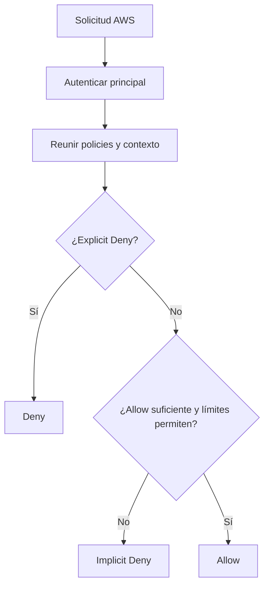
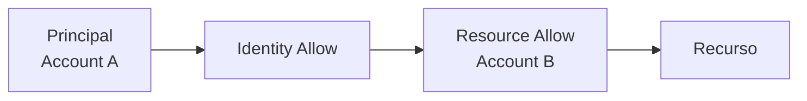
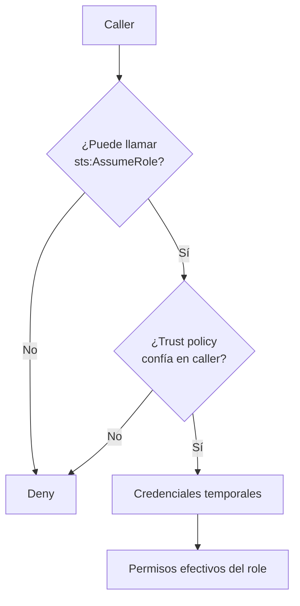
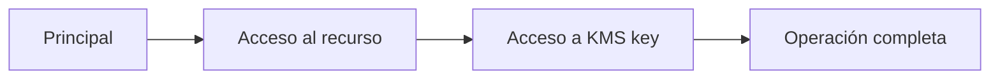
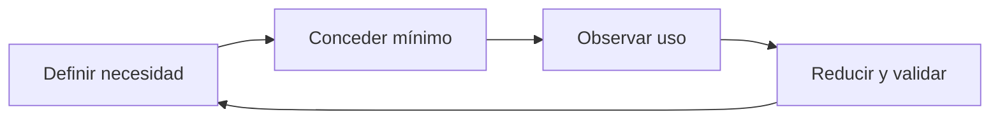

# Evaluación efectiva de permisos en AWS para el examen SAA-C03

> Guía de estudio enfocada en la lógica de autorización de AWS, tipos de policies, acceso entre cuentas, roles, guardrails, condiciones, permisos secundarios y diagnóstico de errores `AccessDenied`.
>
> Actualizado: julio de 2026.

## 1. Alcance necesario para el examen

El dominio 1 del SAA-C03 evalúa la capacidad de diseñar acceso seguro a recursos AWS. Para responder correctamente se debe poder:

- Diferenciar autenticación y autorización.
- Identificar el principal real que realiza una solicitud.
- Interpretar una policy JSON.
- Comprender `Action`, `Resource`, `Principal` y `Condition`.
- Diferenciar implicit deny y explicit deny.
- Combinar identity-based y resource-based policies.
- Comprender el efecto de permissions boundaries y session policies.
- Diferenciar SCP y RCP de AWS Organizations.
- Diseñar acceso entre cuentas.
- Diferenciar trust policy y permissions policy de un IAM role.
- Comprender `sts:AssumeRole` e `iam:PassRole`.
- Aplicar RBAC y ABAC.
- Restringir acceso mediante tags, organización, red, región o MFA cuando corresponda.
- Comprender endpoint policies y controles específicos de servicios.
- Evaluar autorización adicional de AWS KMS.
- Reconocer permisos secundarios requeridos por servicios.
- Diagnosticar `AccessDenied` mediante mensajes, CloudTrail y herramientas de IAM.
- Aplicar el principio de mínimo privilegio.

> **Alcance:** este capítulo desarrolla la evaluación efectiva de permisos. El catálogo completo de servicios de seguridad permanece en `14-Security-Identity-and-Compliance.md`.

---

## 2. Modelo fundamental de autorización

Una solicitud AWS contiene, de forma conceptual:

- Principal.
- Acción.
- Recurso.
- Contexto.

AWS autentica al principal, construye el request context y evalúa todas las policies aplicables.

### Flujo mental



### Regla central

1. Por defecto, el acceso está denegado.
2. Un `Allow` aplicable puede autorizar.
3. Un `Explicit Deny` aplicable gana sobre todos los `Allow`.
4. Una policy que actúa como límite no concede permisos.
5. En cross-account se debe autorizar el lado del principal y el lado del recurso.

### Fórmula conceptual

Para un caso común con IAM role:

$$
\text{Permiso efectivo} =
\text{Allow concedido}
\cap \text{Boundary}
\cap \text{Session policy}
\cap \text{SCP}
\cap \text{RCP}
\cap \text{Otros límites aplicables}
$$

Y siempre:

$$
\text{Explicit Deny} \Rightarrow \text{Deny}
$$

La fórmula es una simplificación. Las resource-based policies tienen matices según si conceden al ARN de un user, un role o una role session.

> **Regla de examen:** `AdministratorAccess` no supera un explicit deny de SCP, RCP, permissions boundary, session policy, endpoint policy o resource policy aplicable.

---

## 3. Autenticación frente a autorización

### Autenticación

Responde:

> ¿Quién realiza la solicitud?

La identidad puede proceder de:

- Root user.
- IAM user.
- IAM role session.
- IAM Identity Center.
- Federación SAML.
- Web identity mediante OIDC.
- AWS service principal.
- Solicitud anónima en servicios que la permiten.

### Autorización

Responde:

> ¿Puede este principal ejecutar esta acción sobre este recurso bajo este contexto?

Tener credenciales válidas no implica autorización.

### Credenciales temporales

Una sesión temporal incluye:

- Access key ID.
- Secret access key.
- Session token.
- Expiración.

La sesión utiliza los permisos efectivos del role o mecanismo de federación, no la suma automática de los permisos originales del caller y los del role.

### Principal real

Al asumir un role:

| Identidad | Ejemplo de ARN |
|---|---|
| IAM role | `arn:aws:iam::111122223333:role/AppRole` |
| Assumed-role session | `arn:aws:sts::111122223333:assumed-role/AppRole/session-name` |

El principal que realiza llamadas con credenciales STS es la role session.

Sin embargo, el global condition key `aws:PrincipalArn` devuelve normalmente el ARN del IAM role para una role session, no el ARN STS de la sesión.

### Verificación inicial

Una comprobación habitual es:

```bash
aws sts get-caller-identity
```

Permite confirmar:

- Account.
- ARN.
- Principal ID.

> **Trampa:** revisar las policies del role esperado sin confirmar las credenciales reales puede llevar a diagnosticar la identidad equivocada.

---

## 4. Request context

AWS crea un contexto con información sobre:

- Principal.
- Cuenta.
- Sesión.
- Acción.
- Recurso.
- Región solicitada.
- Hora.
- IP de origen.
- VPC o VPC endpoint cuando está disponible.
- TLS.
- Tags.
- Servicio que actúa como intermediario.
- Source ARN y source account.

### Las condiciones dependen de disponibilidad

Un context key no aparece en todas las solicitudes.

Antes de utilizarlo se debe verificar:

- En qué acciones existe.
- Si es single-valued o multivalued.
- Qué tipo de dato utiliza.
- Si el servicio lo soporta.
- Qué ocurre si está ausente.

### Context keys frecuentes

| Context key | Uso |
|---|---|
| `aws:PrincipalArn` | Restringir el principal |
| `aws:PrincipalAccount` | Restringir cuenta del principal |
| `aws:PrincipalOrgID` | Restringir a una organización |
| `aws:RequestedRegion` | Restringir región solicitada |
| `aws:SourceIp` | Restringir IP pública de origen |
| `aws:SourceVpc` | Restringir VPC cuando está disponible |
| `aws:SourceVpce` | Restringir VPC endpoint |
| `aws:SecureTransport` | Exigir TLS |
| `aws:SourceArn` | Vincular llamada de un servicio a un recurso origen |
| `aws:SourceAccount` | Vincular llamada de un servicio a una cuenta |
| `aws:PrincipalTag/*` | ABAC por atributo del principal |
| `aws:ResourceTag/*` | ABAC por tag del recurso |
| `aws:RequestTag/*` | Controlar tags solicitados |
| `aws:TagKeys` | Limitar claves de tag |

### Principal de cuenta frente a root user

En `Principal`:

```json
{
  "Principal": {
    "AWS": "arn:aws:iam::111122223333:root"
  }
}
```

normalmente delega autoridad a la cuenta AWS, no únicamente al root user.

En una condición con `aws:PrincipalArn`, el mismo ARN puede utilizarse para identificar específicamente al root user.

> **Trampa:** el significado depende de si el ARN aparece en `Principal` o como valor de un context key.

---

## 5. Estructura de una IAM policy

### Ejemplo

```json
{
  "Version": "2012-10-17",
  "Statement": [
    {
      "Sid": "ReadReports",
      "Effect": "Allow",
      "Action": [
        "s3:GetObject"
      ],
      "Resource": "arn:aws:s3:::example-reports/*",
      "Condition": {
        "StringEquals": {
          "aws:PrincipalTag/Environment": "prod"
        }
      }
    }
  ]
}
```

### Elementos

| Elemento | Función |
|---|---|
| `Version` | Versión del lenguaje de policy |
| `Statement` | Uno o varios bloques |
| `Sid` | Identificador opcional |
| `Effect` | `Allow` o `Deny` |
| `Principal` | Quién, en policies compatibles |
| `Action` | Operaciones AWS |
| `NotAction` | Todas las acciones aplicables excepto las indicadas |
| `Resource` | Recursos afectados |
| `NotResource` | Todos los recursos aplicables excepto los indicados |
| `Condition` | Cuándo se aplica |

### Dónde se utiliza `Principal`

- Resource-based policy.
- IAM role trust policy.
- Key policy.
- Queue o topic policy.

Una identity-based policy ya está vinculada a un user, group o role y normalmente no contiene `Principal`.

### Orden de statements

El orden de los statements no cambia el resultado.

- Los allows aplicables se acumulan.
- Un deny aplicable prevalece.
- `Sid` no establece prioridad.

---

## 6. Coincidencia de acción y recurso

Una policy autoriza únicamente si coincide:

1. Principal, cuando aplica.
2. Action.
3. Resource.
4. Condition.

### Action

Ejemplos:

- `s3:GetObject`.
- `ec2:RunInstances`.
- `kms:Decrypt`.
- `iam:PassRole`.
- `sts:AssumeRole`.

Los nombres de consola pueden ocultar varias API actions. Una operación visual puede necesitar:

- `List*`.
- `Describe*`.
- `Get*`.
- La acción de cambio.
- Permisos secundarios.

### Resource

Cada servicio define:

- Tipos de recursos.
- Formato ARN.
- Acciones que aceptan resource-level permissions.
- Condition keys disponibles.

Cuando una acción no soporta resource-level permissions, puede requerir:

```json
"Resource": "*"
```

Esto no significa que deba concederse `Action: "*"`.

### S3: bucket frente a objeto

| Acción | Resource |
|---|---|
| `s3:ListBucket` | `arn:aws:s3:::example-bucket` |
| `s3:GetObject` | `arn:aws:s3:::example-bucket/*` |
| `s3:PutObject` | `arn:aws:s3:::example-bucket/prefix/*` |

Errores habituales:

- Usar el ARN del bucket para `GetObject`.
- Usar `bucket/*` para `ListBucket`.
- Olvidar el prefix.
- Conceder acceso al objeto sin `kms:Decrypt` cuando está cifrado con una customer managed key.

### Wildcards

Utilizar el wildcard más limitado posible.

| Patrón | Alcance |
|---|---|
| `s3:GetObject` | Una acción |
| `s3:Get*` | Varias acciones de lectura |
| `s3:*` | Todo S3 |
| `*` | Todas las acciones de todos los servicios |

> **Regla:** validar cada combinación Action–Resource en la Service Authorization Reference.

---

## 7. Condition: operadores y lógica

### Evaluación básica

Si un statement tiene varios operadores o context keys, todos deben resolverse como verdaderos para que el statement se aplique.

Dentro de muchos operadores, varios valores para una misma key se evalúan como alternativas.

### Operadores comunes

| Operador | Uso |
|---|---|
| `StringEquals` | Comparación exacta |
| `StringLike` | Comparación con wildcard |
| `ArnEquals` | Comparación exacta de ARN |
| `ArnLike` | ARN con wildcard |
| `Bool` | Valor booleano |
| `IpAddress` | CIDR |
| `NumericLessThan` | Límite numérico |
| `DateLessThan` | Límite temporal |
| `Null` | Verificar presencia de una key |
| `ForAnyValue` | Algún valor coincide |
| `ForAllValues` | Todos los valores coinciden |
| `...IfExists` | Evaluar si la key existe |

### `IfExists`

`IfExists` indica que:

- Si la key existe, se evalúa.
- Si no existe, la condición se considera verdadera.

Debe usarse con cuidado, especialmente en `Allow`, porque una key ausente puede no restringir la solicitud.

### `Null`

Permite exigir presencia o ausencia de una key.

No se combina con el suffix `IfExists`.

### Context keys multivalued

Utilizar set operators únicamente con keys definidas como multivalued.

`ForAllValues` puede resultar verdadero si el conjunto del request está vacío. Cuando la presencia sea obligatoria, combinar con una comprobación `Null`.

### ARN operators

AWS recomienda operadores ARN al comparar ARNs:

- `ArnEquals`.
- `ArnLike`.
- `ArnNotEquals`.
- `ArnNotLike`.

### Deny condicional

Un deny condicional es una herramienta potente para guardrails, pero debe considerar:

- Llamadas realizadas por AWS services.
- Context keys ausentes.
- Operaciones globales.
- Break-glass roles.
- Automatizaciones.

> **Trampa:** una condición que no coincide no produce un deny por sí misma; simplemente hace que ese statement no aplique.

---

## 8. Implicit deny, explicit allow y explicit deny

### Implicit deny

Existe cuando ninguna policy aplicable concede la acción requerida.

No aparece como un statement.

Ejemplo:

- El role permite `s3:GetObject`.
- Solicita `s3:DeleteObject`.
- No existe allow.
- Resultado: implicit deny.

### Explicit allow

Un statement con:

```json
"Effect": "Allow"
```

autoriza únicamente si coinciden action, resource, principal y conditions, y ningún límite o explicit deny bloquea.

### Explicit deny

Un statement con:

```json
"Effect": "Deny"
```

prevalece sobre cualquier allow aplicable.

Puede existir en:

- Identity-based policy.
- Resource-based policy.
- Permissions boundary.
- Session policy.
- SCP.
- RCP.
- Endpoint policy.
- Policy específica de un servicio.

### Tabla de decisión

| Allow aplicable | Explicit Deny aplicable | Resultado |
|---:|---:|---|
| No | No | Implicit Deny |
| Sí | No | Allow, si todos los límites permiten |
| No | Sí | Explicit Deny |
| Sí | Sí | Explicit Deny |

> **Regla de examen:** agregar otro `Allow` no corrige un `Explicit Deny`.

---

## 9. Identity-based policies

Se adjuntan a:

- IAM users.
- IAM groups.
- IAM roles.

### Para un user

Se combinan:

- Policies directas.
- Policies de todos sus groups.
- Inline policies.
- Managed policies.

Un group:

- No es un principal.
- No tiene credenciales.
- No se asume.
- Organiza permisos de users.

### Para un role

Las permissions policies determinan qué puede hacer una sesión del role.

Tipos:

| Tipo | Característica |
|---|---|
| AWS managed | AWS la mantiene y puede actualizar |
| Customer managed | Cliente controla versiones y reutilización |
| Inline | Pertenece a una identidad |

### Unión

Los allows de varias identity policies se unen.

Ejemplo:

- Policy A permite lectura S3.
- Policy B permite escritura DynamoDB.
- Permiso potencial: ambas capacidades.

Sigue limitado por:

- Permissions boundary.
- Session policy.
- SCP.
- RCP.
- Resource policy aplicable.
- Endpoint y controles de servicio.

### Mínimo privilegio

Preferir:

- Acciones concretas.
- ARNs específicos.
- Prefixes.
- Conditions.
- Roles por workload.
- Credenciales temporales.

---

## 10. Resource-based policies en la misma cuenta

Se adjuntan a un recurso y definen:

- Principal.
- Acción.
- Recurso.
- Condiciones.

Servicios comunes:

- S3 bucket policies.
- KMS key policies.
- SQS queue policies.
- SNS topic policies.
- Lambda resource-based policies.
- Secrets Manager resource policies.
- ECR repository policies.
- EventBridge event bus policies.
- IAM role trust policies.

### Regla simplificada

En la misma cuenta, los allows de identity-based y resource-based policies normalmente se combinan como una unión.

Esto permite:

- Conceder desde la identidad.
- Conceder desde el recurso.
- Utilizar ambos.

Un explicit deny en cualquiera de las policies aplicables gana.

### Cuándo usar resource policy

- Acceso cross-account.
- AWS service invoca el recurso.
- Control central desde el recurso.
- Limitar source account o source ARN.
- Permitir una identidad sin modificar directamente su policy, cuando la semántica del servicio lo admite.

### Resource policy no siempre es opcional

Ejemplos:

- Trust policy para asumir un role.
- Key policy de KMS.
- Lambda invocation permission para determinados event sources.
- Bucket policy para un AWS service que entrega archivos a S3.

---

## 11. Matices del principal en una resource-based policy

La regla de unión anterior es suficiente para la mayoría de preguntas, pero existen diferencias según el principal al que se concede acceso.

| Principal concedido en la misma cuenta | Efecto de un implicit deny en boundary o session policy |
|---|---|
| ARN de IAM user | El permiso directo desde el recurso puede no quedar limitado |
| ARN de IAM role | El permiso queda limitado por boundary y session policy |
| ARN de assumed-role session | El permiso se concede directamente a la sesión y puede no quedar limitado |

Estos permisos directos nunca superan:

- Un explicit deny aplicable.
- Un SCP o RCP aplicable.
- Un endpoint policy deny.
- Un control específico del servicio.

### `aws:PrincipalArn` con `Principal: "*"`

Algunas resource policies utilizan:

```json
{
  "Effect": "Allow",
  "Principal": "*",
  "Action": "s3:GetObject",
  "Resource": "arn:aws:s3:::example-bucket/*",
  "Condition": {
    "ArnEquals": {
      "aws:PrincipalArn": "arn:aws:iam::111122223333:role/AppRole"
    }
  }
}
```

Para una role session, `aws:PrincipalArn` identifica normalmente el ARN del role. Esta técnica evita tener que conocer el nombre de cada sesión.

> **Orden recomendado:** resolver primero con el modelo simplificado. Aplicar este matiz únicamente cuando la pregunta distingue explícitamente entre role ARN, user ARN y role-session ARN.

---

## 12. Acceso directo entre cuentas

Supongamos:

- Account A contiene el principal.
- Account B contiene el recurso.

Para acceso cross-account directo normalmente se requiere:

1. Identity-based policy en Account A que permita la acción.
2. Resource-based policy en Account B que confíe en el principal o cuenta.
3. Ausencia de explicit deny.
4. Que boundaries, session policies, SCPs y RCPs aplicables permitan.
5. Autorización adicional de KMS si el recurso está cifrado con una customer managed key.



### Regla de los dos lados

| Lado | Pregunta |
|---|---|
| Cuenta del principal | ¿La identidad puede solicitar la acción? |
| Cuenta del recurso | ¿El recurso confía en esa identidad? |

Si falta uno de los dos lados, el acceso se deniega.

### Alternativas

| Patrón | Cuándo utilizar |
|---|---|
| Resource policy cross-account | El servicio la soporta y se desea acceso directo |
| AssumeRole en la cuenta destino | Se desea operar temporalmente como un role del destino |
| AWS RAM | Compartir tipos de recursos compatibles sin duplicarlos |

> **Trampa:** una bucket policy que confía en otra cuenta delega acceso, pero el administrador de la cuenta confiada todavía debe conceder permisos a su principal.

---

## 13. Trust policy y `sts:AssumeRole`

Un IAM role tiene dos planos diferentes.

| Policy | Pregunta que responde |
|---|---|
| Trust policy | ¿Quién puede asumir el role? |
| Permissions policies | ¿Qué puede hacer la sesión después de asumirlo? |

### Flujo



### Cross-account AssumeRole

Normalmente se necesita:

- Identity policy del caller con `sts:AssumeRole` sobre el role destino.
- Trust policy del role destino que permita al caller.
- Policies del role para las acciones posteriores.

### Same-account AssumeRole

Una concesión directa al principal en la trust policy puede actuar como la autorización basada en recurso. Aun así, para preguntas de diseño es más claro y auditable conceder `sts:AssumeRole` de forma explícita y limitar ambos lados.

### Duración

- Cada role tiene una duración máxima de sesión configurable.
- El caller puede solicitar una duración menor.
- Role chaining limita la nueva sesión encadenada a un máximo de una hora.

### Confused deputy

Cuando un tercero asume roles de varios clientes:

- Utilizar `sts:ExternalId`.
- El tercero entrega un valor único por cliente.
- La trust policy exige ese valor.
- El External ID no debe considerarse una contraseña.

Para AWS services que acceden a recursos, suelen utilizarse:

- `aws:SourceArn`.
- `aws:SourceAccount`.

Estas condiciones vinculan la llamada al recurso o cuenta esperados.

---

## 14. Session policies, tags y SourceIdentity

Una session policy se entrega al crear una sesión temporal.

### Efecto

$$
\text{Permisos de sesión} =
\text{Permisos del role}
\cap \text{Session policy}
$$

La session policy:

- Puede reducir permisos.
- No puede añadir permisos que el role no tenga.
- Puede ser inline o referenciar managed policies según la operación STS.

### Session tags

Permiten transferir atributos a la sesión:

- Departamento.
- Proyecto.
- Entorno.
- Nivel de acceso.

Se utilizan con `aws:PrincipalTag/*` para ABAC. Determinados tags pueden declararse transitive para conservarse en role chaining.

### SourceIdentity

Permite conservar un identificador original durante una sesión y mejorar la trazabilidad en CloudTrail.

### Permisos del caller después de AssumeRole

Una vez utilizadas las credenciales del role:

- La solicitud se firma como la role session.
- No se suman automáticamente las permissions policies originales del caller.
- Se evalúan los permisos efectivos de la nueva sesión.

> **Trampa:** un administrador puede asumir correctamente un role de solo lectura y quedar limitado a solo lectura dentro de esa sesión.

---

## 15. Permissions boundaries

Una permissions boundary define el máximo de permisos que una identity-based policy puede conceder a un IAM user o role.

### Regla

$$
\text{Permisos efectivos} =
\text{Identity Allow}
\cap \text{Boundary Allow}
$$

La boundary:

- No concede permisos.
- No se adjunta a IAM groups.
- Permite delegar creación de roles sin permitir escalación fuera de un límite.
- No reemplaza las identity policies.

### Ejemplo

| Identity policy | Boundary | Resultado |
|---|---|---|
| `s3:*` | Solo `s3:Get*` | Solo lectura compatible |
| `ec2:*` | Solo S3 | Ningún permiso EC2 |
| Sin allow | `s3:*` | Ningún permiso S3 |

### Caso de delegación

Un equipo puede crear roles de aplicación si:

- Debe adjuntar una boundary aprobada.
- No puede eliminarla.
- No puede editar la boundary.
- No puede pasar roles más privilegiados.
- Se controlan `iam:CreatePolicyVersion`, `iam:SetDefaultPolicyVersion` y acciones equivalentes.

### Riesgo con `NotPrincipal`

AWS desaconseja combinar `Effect: Deny` y `NotPrincipal` en resource policies cuando existen principals con permissions boundaries, porque puede denegar más identidades de las previstas.

Preferir condiciones como:

```json
"ArnNotEquals": {
  "aws:PrincipalArn": "arn:aws:iam::111122223333:role/ApprovedRole"
}
```

---

## 16. Service Control Policies

Las SCP de AWS Organizations son guardrails centrados en principals de cuentas miembro.

### Características

- Definen el máximo de permisos disponible.
- Nunca conceden permisos.
- Afectan a IAM users, roles y root user de cuentas miembro.
- No afectan a principals de la management account.
- No restringen service-linked roles.
- Se heredan por root, organizational units y cuenta.

### Cálculo conceptual

Para que una acción esté disponible:

- La identidad o recurso debe concederla.
- Cada nivel de la jerarquía con estrategia allow-list debe permitirla.
- Ninguna SCP aplicable debe denegarla.

### Estrategias

| Estrategia | Diseño |
|---|---|
| Deny-list | Mantener `FullAWSAccess` y añadir denies específicos |
| Allow-list | Reemplazar acceso amplio por allows explícitos en cada nivel |

### Usos

- Bloquear desactivación de CloudTrail o Config.
- Restringir regiones.
- Impedir abandonar la organización.
- Proteger recursos críticos.
- Prohibir servicios no aprobados.

### Excepciones importantes

Una SCP:

- No concede acceso a un bucket.
- No reemplaza IAM.
- No controla directamente a un principal externo que accede a un recurso miembro.
- No limita recursos de la management account.

> **Trampa:** adjuntar un SCP `Allow` a una OU no da permisos a sus roles. Aún se necesita un allow de IAM o de recurso.

---

## 17. Resource Control Policies

Las RCP de AWS Organizations son guardrails centrados en recursos compatibles de cuentas miembro.

### Características

- Definen el máximo de permisos disponible para el recurso.
- Nunca conceden permisos.
- Se aplican aunque el principal proceda de fuera de la organización.
- Se heredan por root, OU y cuenta.
- No afectan recursos de la management account.
- No afectan service-linked roles.
- No afectan AWS managed KMS keys.
- Solo funcionan con servicios y recursos compatibles.

### SCP frente a RCP

| Aspecto | SCP | RCP |
|---|---|---|
| Centro de control | Principal | Recurso |
| Principal externo | No lo restringe directamente | Puede limitar su acceso al recurso |
| Cuenta miembro | Sí | Sí |
| Concede permisos | No | No |
| Compatibilidad | Amplia para principals | Solo recursos soportados |

### Ejemplo mental

Un bucket de una cuenta miembro concede acceso a un principal externo.

- La SCP de la cuenta del bucket no controla directamente al principal externo.
- Una RCP aplicable al bucket sí puede imponer un límite al recurso.
- La bucket policy todavía debe conceder el acceso.

> **Examen:** comprender el propósito de una RCP es más importante que memorizar la lista cambiante de servicios compatibles.

---

## 18. Endpoint policies y condiciones de red

Una VPC endpoint policy controla qué puede atravesar un VPC endpoint.

### Propiedades

- Es una capa adicional.
- No concede por sí sola acceso al servicio.
- No reemplaza identity o resource policies.
- La policy predeterminada suele permitir acceso completo a través del endpoint.
- Solo afecta solicitudes que utilizan ese endpoint.

### Fórmula conceptual

$$
\text{Acceso mediante endpoint} =
\text{Permiso IAM/recurso}
\cap \text{Endpoint policy}
$$

### Restricciones frecuentes

- Solo ciertos buckets.
- Solo ciertos principals.
- Solo acciones de lectura.
- Denegar acceso a recursos fuera de la organización.

### Context keys de red

| Key | Consideración |
|---|---|
| `aws:SourceIp` | IP pública observada; no siempre representa el origen detrás de servicios |
| `aws:SourceVpc` | Disponible solo en determinados escenarios |
| `aws:SourceVpce` | Identifica el endpoint utilizado |
| `aws:SecureTransport` | Permite exigir HTTPS |

Las solicitudes hechas en nombre del principal por AWS services pueden tener un contexto diferente. Un deny de red demasiado general puede romper integraciones administradas.

---

## 19. Riesgos de los elementos negativos

### `NotAction`

En un `Allow`, concede todas las acciones aplicables excepto las listadas, dentro del alcance del recurso.

No significa automáticamente “todos los servicios”, pero puede crear permisos mucho más amplios de lo previsto.

### `NotResource`

En un `Allow`, concede sobre todos los recursos aplicables excepto los indicados. Debe evitarse para políticas de mínimo privilegio.

### `NotPrincipal`

Excluye principals de una resource policy. En un `Deny` es fácil bloquear principals inesperados.

### Guía

| Objetivo | Opción más clara |
|---|---|
| Permitir pocas acciones | `Action` explícito |
| Permitir pocos recursos | `Resource` explícito |
| Excluir un role de un deny | Condition con `aws:PrincipalArn` |
| Guardrail regional | Deny con `NotAction` cuidadosamente limitado para servicios globales |

> **Trampa:** `NotAction` no invierte el valor de `Effect`. El resultado depende de combinar ambos elementos.

---

## 20. RBAC y ABAC

### RBAC

Role-Based Access Control asigna permisos según una función:

- Developer.
- Auditor.
- DatabaseAdministrator.
- NetworkAdministrator.

Ventajas:

- Modelo simple.
- Fácil de auditar.
- Apropiado para funciones estables.

### ABAC

Attribute-Based Access Control utiliza atributos:

- Principal tags.
- Resource tags.
- Request tags.
- Session tags.

Ejemplo conceptual:

```json
{
  "Effect": "Allow",
  "Action": "ec2:StartInstances",
  "Resource": "*",
  "Condition": {
    "StringEquals": {
      "aws:ResourceTag/Project": "${aws:PrincipalTag/Project}"
    }
  }
}
```

### Controles necesarios

ABAC es seguro solo si se controla:

- Quién puede modificar principal tags.
- Quién puede agregar o cambiar resource tags.
- Qué tag keys se permiten al crear recursos.
- Qué session tags puede enviar un caller.
- La existencia obligatoria del tag.

### Comparación

| Necesidad | Elección |
|---|---|
| Pocas funciones estables | RBAC |
| Muchos proyectos con recursos dinámicos | ABAC |
| Gobierno empresarial | Combinación RBAC + ABAC |
| Acceso temporal federado | Roles con session tags |

---

## 21. `iam:PassRole`

`iam:PassRole` autoriza a un principal a asociar un IAM role con un AWS service.

No es una API independiente que se invoque directamente; AWS lo comprueba durante operaciones como:

- Crear una función Lambda con un execution role.
- Lanzar EC2 con un instance profile.
- Crear una task definition o servicio ECS con roles.
- Iniciar un job que utiliza un service role.
- Crear una stack o pipeline con un role de servicio.

### Requisitos

1. El caller tiene `iam:PassRole` sobre el role exacto.
2. El role y el servicio receptor pertenecen a la misma cuenta.
3. La trust policy del role confía en el service principal.
4. El caller tiene permiso para la operación principal, por ejemplo `lambda:CreateFunction`.

### Policy limitada

```json
{
  "Effect": "Allow",
  "Action": "iam:PassRole",
  "Resource": "arn:aws:iam::111122223333:role/application/*",
  "Condition": {
    "StringEquals": {
      "iam:PassedToService": "lambda.amazonaws.com"
    }
  }
}
```

### Riesgo de escalación

Si un developer puede pasar cualquier role a un servicio que controla, puede lograr que el servicio actúe con permisos superiores.

Restringir:

- ARN del role.
- Path del role.
- Servicio receptor.
- Acciones para crear o modificar recursos que utilizan el role.

> **Diferencia clave:** `sts:AssumeRole` entrega credenciales al caller; `iam:PassRole` permite que un AWS service utilice el role.

---

## 22. Roles para workloads

Las aplicaciones deben utilizar credenciales temporales asociadas al workload.

| Workload | Identidad recomendada | Distinción importante |
|---|---|---|
| EC2 | IAM role mediante instance profile | El instance profile es el contenedor que se adjunta a EC2 |
| Lambda | Execution role | La trust policy confía en `lambda.amazonaws.com` |
| ECS task | Task role | Permisos del código de los containers |
| ECS agent | Task execution role | Pull de imagen, logs y acciones del agente |
| EKS pod | EKS Pod Identity o IRSA | Permisos por workload, no por node role |
| AWS service | Service role o service-linked role | Actúa en nombre del cliente |
| CI/CD externo | OIDC federation hacia un role | Evita access keys de larga duración |

### ECS: error frecuente

| Necesidad | Role |
|---|---|
| Aplicación consulta DynamoDB | Task role |
| ECS obtiene imagen de ECR | Task execution role |
| Enviar logs mediante configuración administrada | Task execution role |

### EKS

Con IRSA, la trust policy suele validar:

- OIDC provider.
- Claim `sub` del service account.
- Claim `aud`.

Un error en estos claims impide asumir el role aunque sus permissions policies sean correctas.

### Credenciales

No almacenar access keys en:

- AMIs.
- User data.
- Código.
- Container images.
- Variables sin protección.

Preferir el proveedor de credenciales del SDK para obtener y renovar credenciales temporales.

---

## 23. Permisos de invocación entre servicios

Cuando un AWS service invoca otro recurso, preguntar:

1. ¿Qué service principal realiza la llamada?
2. ¿Utiliza un role o una resource policy?
3. ¿Qué recurso origen debe limitarse?
4. ¿Existe un permiso adicional de KMS?

### Patrones

| Integración | Autorización habitual |
|---|---|
| API Gateway → Lambda | Lambda resource-based policy permite `lambda:InvokeFunction` |
| EventBridge → Lambda | Lambda resource-based policy permite la invocación |
| SNS → SQS | Queue policy permite a SNS `sqs:SendMessage` |
| S3 → SQS/SNS | Queue/topic policy confía en S3 con SourceArn/SourceAccount |
| EventBridge → servicio mediante role | EventBridge asume un execution role |
| CloudFront → S3 privado | Bucket policy permite OAC y limita distribución |
| ELB → S3 logs | Bucket policy permite entrega de logs según documentación |

### Confused deputy

Para un service principal amplio, limitar cuando sea posible:

```json
"Condition": {
  "ArnEquals": {
    "aws:SourceArn": "arn:aws:events:us-east-1:111122223333:rule/ApprovedRule"
  },
  "StringEquals": {
    "aws:SourceAccount": "111122223333"
  }
}
```

> **Trampa:** conceder al execution role de Lambda no permite que API Gateway invoque la función; la invocación se controla en la resource-based policy de Lambda.

---

## 24. Evaluación efectiva en Amazon S3

S3 puede combinar:

- IAM identity policy.
- Bucket policy.
- Access point policy.
- ACL, si está habilitada.
- S3 Block Public Access.
- VPC endpoint policy.
- SCP.
- RCP.
- KMS key policy y permisos KMS.
- Object ownership.

### Object Ownership

Con `Bucket owner enforced`:

- Las ACL quedan deshabilitadas.
- El bucket owner controla los objetos.
- El acceso se gestiona mediante policies.

Es el modelo preferido para simplificar autorización.

### Block Public Access

S3 aplica la combinación más restrictiva de la configuración en:

- Organization, cuando exista el control correspondiente.
- Account.
- Bucket.
- Access point.

Puede bloquear una bucket policy pública aunque esa policy contenga un `Allow`.

### Orden mental para un `GetObject`

1. Confirmar principal real.
2. Confirmar `s3:GetObject`.
3. Confirmar ARN `bucket/key`.
4. Revisar identity y bucket/access point policies.
5. Revisar explicit denies y guardrails.
6. Revisar endpoint policy si usa gateway endpoint.
7. Revisar Block Public Access si el acceso es público.
8. Si es SSE-KMS, revisar KMS.

### Tabla de permisos frecuentes

| Operación | Permiso S3 | Posible permiso adicional |
|---|---|---|
| Listar objetos | `s3:ListBucket` | Condition `s3:prefix` |
| Descargar SSE-S3 | `s3:GetObject` | Ninguno de KMS |
| Descargar SSE-KMS | `s3:GetObject` | `kms:Decrypt` |
| Subir SSE-KMS | `s3:PutObject` | Permisos KMS según flujo |
| Copiar objeto | Lectura origen + escritura destino | KMS en origen y/o destino |

---

## 25. Evaluación efectiva en AWS KMS

Cada KMS key tiene exactamente una key policy. Es el punto principal de control.

### Formas de autorización

- Key policy.
- IAM policy, si la key policy habilita esa delegación.
- KMS grant.
- SCP y RCP aplicables.
- VPC endpoint policy, si la solicitud pasa por un endpoint.

### Regla esencial

Un `Allow` de IAM no tiene efecto sobre una KMS key si la key policy:

- No permite directamente al principal, y
- No habilita a la cuenta para delegar mediante IAM.

### Cross-account

Para utilizar una customer managed key de otra cuenta normalmente se necesita:

1. Key policy en la cuenta de la key que autorice al principal o a su cuenta.
2. IAM policy del principal que permita la operación KMS.
3. Ausencia de límites o denies.

### Acciones frecuentes

| Necesidad | Acción |
|---|---|
| Descifrar datos | `kms:Decrypt` |
| Cifrar | `kms:Encrypt` |
| Generar data key | `kms:GenerateDataKey` |
| Describir key | `kms:DescribeKey` |
| Reencriptar | `kms:ReEncrypt*` |

### Grants

Los grants se utilizan frecuentemente por servicios integrados para delegar operaciones específicas sobre una key. Son diferentes de una IAM policy y de la key policy.

> **Trampa:** tener acceso al objeto S3, secreto o volumen no implica acceso a la customer managed KMS key que lo protege.

---

## 26. Recursos cifrados y permisos compuestos

Una operación puede requerir autorización sobre más de un servicio.



### Ejemplos

| Operación | Permiso principal | Permiso secundario posible |
|---|---|---|
| Leer secret | `secretsmanager:GetSecretValue` | `kms:Decrypt` |
| Leer parámetro SecureString | `ssm:GetParameter` | `kms:Decrypt` |
| Leer objeto SSE-KMS | `s3:GetObject` | `kms:Decrypt` |
| Crear función con role | `lambda:CreateFunction` | `iam:PassRole` |
| Lanzar EC2 con role | `ec2:RunInstances` | `iam:PassRole` |
| Publicar desde un servicio | Acción del servicio | Resource policy del destino |
| Usar AMI o snapshot compartido cifrado | Permisos EC2 | Acceso a snapshot y KMS key |

### Método

Descomponer la solicitud en:

- Acción de control plane.
- Acceso a datos.
- Role entregado o asumido.
- Clave de cifrado.
- Recursos origen y destino.
- Llamadas realizadas por otros servicios.

---

## 27. IAM Access Analyzer

IAM Access Analyzer ayuda a identificar y mejorar permisos.

### Capacidades

| Capacidad | Utilidad |
|---|---|
| External access analyzer | Detectar recursos compartidos fuera de la zona de confianza |
| Internal access analyzer | Identificar acceso interno a recursos críticos |
| Unused access analyzer | Detectar roles, credenciales o permisos no utilizados |
| Policy validation | Comprobar sintaxis y prácticas de seguridad |
| Custom policy checks | Verificar que una nueva policy no amplíe acceso indebidamente |
| Policy generation | Generar una base de policy desde actividad observada en CloudTrail |

### Zona de confianza

Puede definirse usando:

- Account.
- Organization.

Una finding no significa automáticamente que exista una vulnerabilidad; indica acceso que debe revisarse respecto de la intención.

### Policy generation

Utiliza actividad de CloudTrail para proponer permisos observados durante un intervalo de hasta 90 días.

Limitaciones:

- Solo refleja actividad registrada.
- Una acción necesaria pero no ejecutada puede faltar.
- Requiere revisión humana.
- No reemplaza pruebas.

> **Uso de examen:** para descubrir acceso externo no intencional, elegir IAM Access Analyzer; para registrar quién hizo una llamada, elegir CloudTrail.

---

## 28. IAM Policy Simulator

El simulator permite probar el efecto de determinadas policies sin realizar la acción.

### Puede ayudar a

- Probar identity-based policies.
- Incluir una permissions boundary.
- Evaluar context keys proporcionadas.
- Comparar acciones y recursos.
- Analizar algunos casos de resource policies para IAM users.

### Limitaciones relevantes

- No simula resource policies para IAM roles.
- No soporta RCP.
- No simula acceso cross-account completo.
- La evaluación de SCP tiene limitaciones, especialmente con condiciones.
- El resultado puede diferir del entorno real.
- No ejecuta la solicitud.

### Uso correcto

1. Utilizarlo para acotar la causa.
2. Proporcionar el request context necesario.
3. Revisar además resource policies y controles del servicio.
4. Validar con una prueba real controlada cuando sea seguro.

> **Trampa:** “Allowed” en el simulator no garantiza que S3 Block Public Access, KMS, una RCP o una policy no simulada permita la operación real.

---

## 29. CloudTrail y evidencia

CloudTrail registra llamadas API y ayuda a responder:

- Quién hizo la solicitud.
- Cuándo.
- Desde dónde.
- Con qué role session.
- Qué acción y recurso intentó.
- Qué error devolvió el servicio.

### Campos útiles

- `eventSource`.
- `eventName`.
- `awsRegion`.
- `sourceIPAddress`.
- `userAgent`.
- `userIdentity`.
- `requestParameters`.
- `errorCode`.
- `errorMessage`.
- `recipientAccountId`.

Dentro de `userIdentity` pueden aparecer:

- ARN de sesión.
- Principal ID.
- Session issuer.
- Source identity.
- MFA.
- Credenciales temporales.

### Management y data events

- Management events cubren operaciones de administración.
- Data events cubren operaciones de alto volumen sobre datos, como objetos S3 o invocaciones Lambda.
- Los data events no se incluyen de forma predeterminada en un trail común y deben configurarse.

### Mensajes codificados

Algunos errores de autorización incluyen un encoded authorization message. Se puede decodificar con:

```bash
aws sts decode-authorization-message \
  --encoded-message 'ENCODED_VALUE'
```

El principal que decodifica necesita:

```text
sts:DecodeAuthorizationMessage
```

El contenido puede indicar:

- Principal.
- Acción.
- Recurso.
- Statement coincidente.
- Tipo de policy que produjo deny.

---

## 30. Procedimiento para diagnosticar `AccessDenied`

Aplicar siempre el mismo orden.

### Paso 1: reproducir con precisión

Registrar:

- Comando o API.
- Timestamp.
- Región.
- Account.
- ARN del recurso.
- Mensaje completo.

### Paso 2: confirmar identidad

```bash
aws sts get-caller-identity
```

Determinar si es:

- User.
- Role session.
- Service principal.
- Federated principal.
- Root.

### Paso 3: identificar la solicitud

Separar:

- `Action`.
- `Resource`.
- Request context.
- Acciones secundarias.

### Paso 4: reunir policies aplicables

- Identity policies.
- Resource policy.
- Trust policy, si hay AssumeRole.
- Permissions boundary.
- Session policy.
- SCP.
- RCP.
- Endpoint policy.
- KMS key policy.
- Controles específicos del servicio.

### Paso 5: buscar explicit deny

Si existe y coincide:

- Corregir el deny o su condición.
- No añadir otro allow.

### Paso 6: verificar el allow

Comprobar:

- Acción exacta.
- ARN correcto.
- Principal correcto.
- Conditions verdaderas.
- Ambos lados en cross-account.

### Paso 7: comprobar intersecciones

Cada límite aplicable debe permitir:

- Boundary.
- Session policy.
- Jerarquía SCP.
- Jerarquía RCP.
- Endpoint policy.

### Paso 8: revisar permisos secundarios

- `kms:Decrypt`.
- `iam:PassRole`.
- `sts:AssumeRole`.
- Permiso de invocación.
- Acceso al recurso de origen.

### Paso 9: utilizar evidencia

- CloudTrail.
- Mensaje de error mejorado.
- DecodeAuthorizationMessage.
- Policy Simulator.
- Access Analyzer.

### Paso 10: corregir con mínimo privilegio

Modificar la capa que contiene la causa y probar nuevamente con el menor alcance posible.

---

## 31. Interpretación de errores de autorización

El mensaje puede orientar, pero no siempre enumera todas las capas evaluadas.

| Mensaje o síntoma | Primera revisión |
|---|---|
| “No identity-based policy allows...” | Identity policy, action y resource |
| “With an explicit deny in a service control policy” | SCP heredadas por root, OU y cuenta |
| “Permissions boundary...” | Boundary del user o role |
| “Resource control policy...” | RCP heredadas y compatibilidad del recurso |
| `AssumeRole` denied | Identity allow del caller y trust policy |
| Operación funciona sin endpoint pero falla con endpoint | Endpoint policy |
| S3 devuelve 403 con SSE-KMS | S3 y KMS |
| Creación de recurso falla al entregar un role | `iam:PassRole` y trust del servicio |
| Integración no invoca Lambda | Resource-based policy de Lambda |
| Acceso público S3 no funciona | Block Public Access y bucket policy |

### Precauciones

- Algunos servicios ocultan detalles para no revelar información.
- Un error cross-account puede no mostrar toda la policy responsable.
- Un allow ausente y un explicit deny pueden producir mensajes distintos.
- Pueden existir varios problemas simultáneos.
- Resolver el primer error puede revelar el siguiente.

---

## 32. Ciclo de mínimo privilegio

Mínimo privilegio no es una configuración única; es un proceso.



### Prácticas

1. Empezar con tareas y recursos concretos.
2. Utilizar roles y credenciales temporales.
3. Limitar `Action`, `Resource` y `Condition`.
4. Separar funciones de administración y aplicación.
5. Proteger cambios de IAM y `iam:PassRole`.
6. Analizar acceso externo y no utilizado.
7. Revisar la actividad real.
8. Eliminar permisos obsoletos.
9. Mantener un mecanismo break-glass controlado.
10. Probar cambios antes de producción.

### Escalación indirecta

No basta con limitar `iam:*`. También se deben revisar acciones que permiten:

- Ejecutar código con un role privilegiado.
- Modificar una función existente.
- Cambiar una task definition.
- Actualizar una stack.
- Adjuntar un instance profile.
- Cambiar una resource policy.
- Editar una KMS key policy.
- Crear una nueva versión de una managed policy y hacerla default.

---

## 33. Matriz para elegir el mecanismo

| Necesidad | Mecanismo principal |
|---|---|
| Conceder acciones a un workload | Identity policy en un IAM role |
| Decidir quién puede asumir un role | Trust policy |
| Compartir un recurso compatible entre cuentas | Resource policy o AWS RAM |
| Operar temporalmente en otra cuenta | Cross-account role |
| Limitar el máximo de un role delegado | Permissions boundary |
| Limitar principals de cuentas miembro | SCP |
| Limitar recursos de cuentas miembro, incluso frente a externos | RCP |
| Reducir una sesión concreta | Session policy |
| Restringir lo que cruza un VPC endpoint | Endpoint policy |
| Autorizar uso de una KMS key | Key policy, IAM y/o grant |
| Permitir que un servicio use un role | `iam:PassRole` más trust policy |
| Permitir que un servicio invoque un recurso | Resource policy o execution role, según integración |
| Escalar permisos por proyecto o entorno | ABAC |
| Encontrar exposición externa | IAM Access Analyzer |
| Registrar la solicitud real | CloudTrail |
| Probar una policy de identidad | IAM Policy Simulator |

---

## 34. Casos razonados para el examen

### Caso 1: role con `AdministratorAccess` y boundary de lectura

**Situación:** el role tiene `AdministratorAccess`, pero su boundary solo permite `s3:Get*`.

**Resultado:** únicamente las acciones S3 compatibles con ambos allows.

**Razón:** identity policy y boundary se intersectan. La boundary no concede y establece el máximo.

---

### Caso 2: administrador bloqueado por SCP

**Situación:** un role administrador de una cuenta miembro intenta desactivar CloudTrail. Una SCP lo deniega.

**Resultado:** denegado.

**Razón:** el explicit deny de SCP gana. Agregar otro IAM allow no lo corrige.

---

### Caso 3: bucket cross-account con solo identity policy

**Situación:** el role de Account A permite `s3:GetObject` sobre un bucket de Account B, pero el bucket no confía en Account A.

**Resultado:** denegado.

**Razón:** falta autorización en el lado del recurso.

---

### Caso 4: bucket cross-account con solo bucket policy

**Situación:** el bucket de Account B confía en Account A, pero el role de A no tiene `s3:GetObject`.

**Resultado:** denegado en el modelo normal de delegación a la cuenta.

**Razón:** la cuenta confiada debe asignar el permiso al principal.

---

### Caso 5: trust policy correcta, caller sin AssumeRole

**Situación:** la trust policy de un role cross-account permite al caller, pero el caller no tiene `sts:AssumeRole`.

**Resultado:** no puede asumir el role.

**Razón:** en cross-account deben autorizar tanto la identity policy del caller como la trust policy destino.

---

### Caso 6: AssumeRole exitoso, acceso S3 fallido

**Situación:** el caller asume correctamente el role, pero las permissions policies del role no permiten `s3:GetObject`.

**Resultado:** se crean credenciales, pero `GetObject` falla.

**Razón:** trust y permissions son planos distintos.

---

### Caso 7: session policy reduce al role

**Situación:** el role permite S3 y DynamoDB, pero al asumirlo se envía una session policy solo para S3.

**Resultado:** la sesión no puede utilizar DynamoDB.

**Razón:** la session policy intersecta y solo reduce.

---

### Caso 8: leer secret cifrado

**Situación:** el role tiene `secretsmanager:GetSecretValue`, pero no puede usar la customer managed KMS key.

**Resultado:** falla la lectura o el descifrado.

**Razón:** se requieren permisos sobre el secreto y sobre KMS.

---

### Caso 9: crear Lambda con execution role

**Situación:** un developer tiene `lambda:CreateFunction`, pero no `iam:PassRole` sobre el execution role.

**Resultado:** la creación falla.

**Razón:** entregar un role a Lambda requiere `iam:PassRole`.

---

### Caso 10: ARN S3 incorrecto

**Situación:** una policy permite `s3:GetObject` sobre `arn:aws:s3:::reports`.

**Resultado:** no autoriza objetos.

**Razón:** `GetObject` requiere el ARN de objeto, por ejemplo `arn:aws:s3:::reports/*`.

---

### Caso 11: endpoint policy restrictiva

**Situación:** IAM y bucket policy permiten acceso, pero la solicitud pasa por un VPC endpoint cuya policy no permite el bucket.

**Resultado:** denegado mediante ese endpoint.

**Razón:** la endpoint policy es un límite adicional.

---

### Caso 12: bucket policy pública y Block Public Access

**Situación:** una bucket policy permite `Principal: "*"`, pero S3 Block Public Access rechaza policies públicas.

**Resultado:** la exposición pública no queda habilitada.

**Razón:** S3 aplica el control más restrictivo de Block Public Access.

---

### Caso 13: ABAC sin tag

**Situación:** la policy permite acceso cuando `PrincipalTag/Project` coincide con `ResourceTag/Project`; el principal no tiene el tag.

**Resultado:** el allow condicional no aplica.

**Razón:** la condición no es verdadera y permanece el implicit deny.

---

### Caso 14: EKS IRSA con claim incorrecto

**Situación:** el role tiene permisos DynamoDB, pero la trust policy espera otro `sub` de Kubernetes.

**Resultado:** el pod no puede obtener las credenciales del role.

**Razón:** falla la autenticación federada antes de evaluar permisos DynamoDB.

---

### Caso 15: Identity Center Administrator y SCP

**Situación:** un permission set concede administración en una cuenta miembro, pero una SCP deniega regiones no aprobadas.

**Resultado:** la sesión sigue restringida por la SCP.

**Razón:** el permission set genera permisos de role; no supera guardrails de Organizations.

---

### Caso 16: EventBridge no invoca Lambda

**Situación:** la función tiene un execution role muy amplio, pero su resource policy no permite a la regla de EventBridge invocarla.

**Resultado:** la invocación falla.

**Razón:** el execution role controla lo que hace el código; la resource policy controla quién invoca la función.

---

### Caso 17: proveedor SaaS y External ID

**Situación:** varios clientes confían en el mismo proveedor para asumir roles.

**Solución:** exigir un External ID único por cliente en cada trust policy.

**Razón:** mitiga el confused deputy; no reemplaza los permisos del role.

---

### Caso 18: principal externo frente a recurso miembro

**Situación:** una bucket policy concede acceso a un principal externo. Se necesita un guardrail de Organizations sobre el recurso.

**Solución:** utilizar una RCP si el recurso y acción son compatibles.

**Razón:** una SCP de la cuenta del bucket no restringe directamente al principal externo; la RCP está centrada en el recurso.

---

### Caso 19: acceso ECR de una task

**Situación:** la aplicación posee un task role, pero ECS no puede descargar la imagen privada.

**Revisión:** task execution role, autenticación ECR, repository policy si es cross-account y KMS si existe cifrado relevante.

**Razón:** el pull de imagen pertenece al plano de ejecución de ECS, no a los permisos del código.

---

### Caso 20: policy con `IfExists`

**Situación:** un `Allow` utiliza `StringEqualsIfExists`; la request no contiene la key.

**Resultado:** esa condición se considera verdadera.

**Razón:** `IfExists` evita que la ausencia haga fallar la condición. Debe combinarse con controles de presencia si la key es obligatoria.

---

## 35. Diferencias que deben memorizarse

| Conceptos | Diferencia |
|---|---|
| Authentication / Authorization | Quién es / Qué puede hacer |
| IAM role / Role session | Identidad configurable / Principal temporal activo |
| Trust policy / Permissions policy | Quién asume / Qué hace la sesión |
| AssumeRole / PassRole | Caller obtiene credenciales / Servicio recibe role |
| Identity policy / Resource policy | Permisos desde principal / Confianza desde recurso |
| Boundary / SCP | Máximo de una identidad / Guardrail de una organización |
| SCP / RCP | Principal de cuenta miembro / Recurso de cuenta miembro |
| Explicit deny / Implicit deny | Statement bloquea / Falta un allow suficiente |
| RBAC / ABAC | Función / Atributos |
| Access Analyzer / CloudTrail | Analiza acceso / Registra actividad |
| Policy Simulator / Prueba real | Simulación parcial / Evaluación completa del servicio |
| SourceArn / PrincipalArn | Recurso que originó llamada / Principal de la solicitud |
| SourceAccount / PrincipalAccount | Cuenta del recurso origen / Cuenta del principal |
| Task role / Task execution role | Código de aplicación / Agente ECS |
| KMS key policy / IAM policy | Control principal de la key / Delegación si la key policy lo permite |

---

## 36. Estrategia para preguntas del SAA-C03

### Secuencia rápida

1. Subrayar el principal.
2. Identificar acción y recurso.
3. Determinar si es same-account o cross-account.
4. Localizar el allow.
5. Buscar explicit deny.
6. Aplicar intersecciones.
7. Revisar permisos secundarios.
8. Elegir la solución de mínimo privilegio y menor carga operativa.

### Preguntas guía

- ¿El caller usa sus credenciales o asumió un role?
- ¿La confianza está en el lugar correcto?
- ¿La acción soporta el ARN utilizado?
- ¿Existe una boundary o session policy?
- ¿La cuenta pertenece a Organizations?
- ¿El control debe limitar principals o recursos?
- ¿La llamada usa un VPC endpoint?
- ¿El dato utiliza una customer managed KMS key?
- ¿Se entrega un role a un servicio?
- ¿La integración exige una resource policy?
- ¿Falta una condición SourceArn, SourceAccount o ExternalId?

### Eliminar respuestas incorrectas

Descartar opciones que:

- Utilizan access keys de larga duración cuando existe un role.
- Conceden `AdministratorAccess` para corregir un problema específico.
- Agregan un allow frente a un explicit deny.
- Confunden trust policy con permissions policy.
- Confunden `PassRole` con `AssumeRole`.
- Resuelven cross-account en un solo lado.
- Ignoran KMS.
- Cambian ACLs cuando Object Ownership y policies son la solución adecuada.
- Proponen una SCP como mecanismo de concesión.

---

## 37. Checklist final

Antes del examen se debe poder responder sin consultar documentación:

- [ ] ¿Cuál es el orden entre implicit deny, allow y explicit deny?
- [ ] ¿Cómo se combinan identity y resource policies en la misma cuenta?
- [ ] ¿Qué dos lados deben permitir en cross-account?
- [ ] ¿Cuál es la diferencia entre trust y permissions policy?
- [ ] ¿Qué cambia al utilizar credenciales de una role session?
- [ ] ¿Por qué una session policy nunca aumenta permisos?
- [ ] ¿Cómo limita una permissions boundary?
- [ ] ¿Por qué SCP y RCP no conceden permisos?
- [ ] ¿Cuándo conviene una RCP frente a una SCP?
- [ ] ¿Qué limita una VPC endpoint policy?
- [ ] ¿Cuál es la diferencia entre `AssumeRole` y `PassRole`?
- [ ] ¿Cómo evitar confused deputy?
- [ ] ¿Cómo se usan principal, resource y session tags en ABAC?
- [ ] ¿Qué ocurre si una condition key está ausente?
- [ ] ¿Qué riesgos tienen `NotAction`, `NotResource` y `NotPrincipal`?
- [ ] ¿Qué ARN necesita `ListBucket` y cuál `GetObject`?
- [ ] ¿Cómo interviene S3 Block Public Access?
- [ ] ¿Por qué KMS puede denegar aunque el recurso permita?
- [ ] ¿Qué role usa la aplicación y cuál usa el agente ECS?
- [ ] ¿Qué controla la resource policy de Lambda?
- [ ] ¿Para qué sirven Access Analyzer, Policy Simulator y CloudTrail?
- [ ] ¿Cómo se diagnostica sistemáticamente un `AccessDenied`?

---

## Referencias oficiales

- [SAA-C03 Domain 1: Design Secure Architectures](https://docs.aws.amazon.com/aws-certification/latest/solutions-architect-associate-03/solutions-architect-associate-03-domain1.html)
- [Policy evaluation logic](https://docs.aws.amazon.com/IAM/latest/UserGuide/reference_policies_evaluation-logic.html)
- [Policy evaluation: explicit deny and allow](https://docs.aws.amazon.com/IAM/latest/UserGuide/reference_policies_evaluation-logic_policy-eval-denyallow.html)
- [Cross-account policy evaluation](https://docs.aws.amazon.com/IAM/latest/UserGuide/reference_policies_evaluation-logic-cross-account.html)
- [Permissions boundaries](https://docs.aws.amazon.com/IAM/latest/UserGuide/access_policies_boundaries.html)
- [IAM roles](https://docs.aws.amazon.com/IAM/latest/UserGuide/id_roles.html)
- [Controlling permissions for AssumeRole](https://docs.aws.amazon.com/IAM/latest/UserGuide/id_credentials_temp_control-access_assumerole.html)
- [Granting a user permissions to pass a role](https://docs.aws.amazon.com/IAM/latest/UserGuide/id_roles_use_passrole.html)
- [IAM global condition context keys](https://docs.aws.amazon.com/IAM/latest/UserGuide/reference_policies_condition-keys.html)
- [IAM condition operators](https://docs.aws.amazon.com/IAM/latest/UserGuide/reference_policies_elements_condition_operators.html)
- [AWS Organizations service control policies](https://docs.aws.amazon.com/organizations/latest/userguide/orgs_manage_policies_scps.html)
- [AWS Organizations resource control policies](https://docs.aws.amazon.com/organizations/latest/userguide/orgs_manage_policies_rcps.html)
- [VPC endpoint policies](https://docs.aws.amazon.com/vpc/latest/privatelink/vpc-endpoints-access.html)
- [S3 policy evaluation](https://docs.aws.amazon.com/AmazonS3/latest/userguide/how-s3-evaluates-access-control.html)
- [S3 Block Public Access](https://docs.aws.amazon.com/AmazonS3/latest/userguide/access-control-block-public-access.html)
- [KMS key policies](https://docs.aws.amazon.com/kms/latest/developerguide/key-policies.html)
- [KMS policy evaluation](https://docs.aws.amazon.com/kms/latest/developerguide/policy-evaluation.html)
- [IAM Access Analyzer](https://docs.aws.amazon.com/IAM/latest/UserGuide/what-is-access-analyzer.html)
- [IAM Access Analyzer policy generation](https://docs.aws.amazon.com/IAM/latest/UserGuide/access-analyzer-policy-generation.html)
- [IAM Policy Simulator](https://docs.aws.amazon.com/IAM/latest/UserGuide/access_policies_testing-policies.html)
- [CloudTrail user identity element](https://docs.aws.amazon.com/awscloudtrail/latest/userguide/cloudtrail-event-reference-user-identity.html)
- [STS DecodeAuthorizationMessage](https://docs.aws.amazon.com/STS/latest/APIReference/API_DecodeAuthorizationMessage.html)

