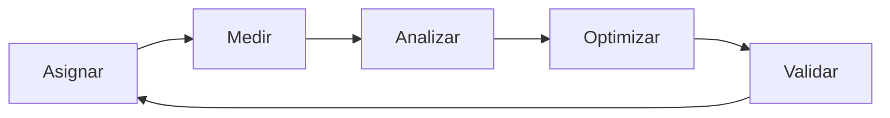
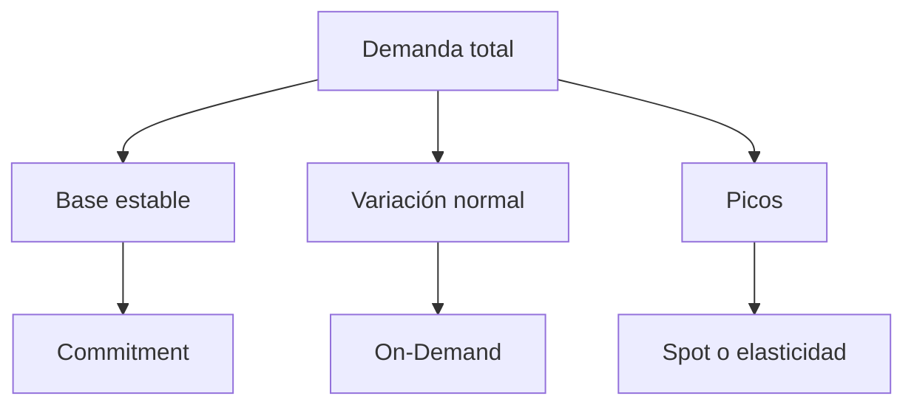
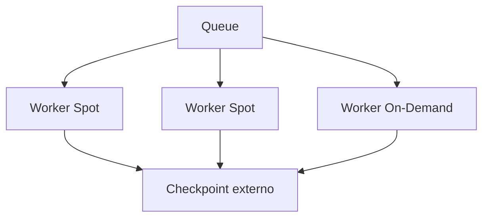
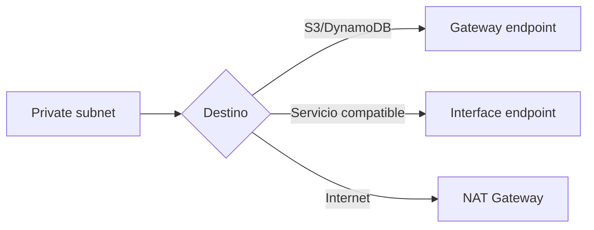

# Optimización de costos transversal en AWS para el examen SAA-C03

> Guía de estudio enfocada en decisiones arquitectónicas costo-eficientes, visibilidad financiera, modelos de compra, rightsizing, elasticidad, almacenamiento, bases de datos, transferencia de datos, disponibilidad y mejora continua.
>
> Actualizado: julio de 2026.

## 1. Alcance necesario para el examen

El dominio 4 del SAA-C03 evalúa el diseño de arquitecturas optimizadas en costos. Se divide en:

1. Soluciones de almacenamiento costo-eficientes.
2. Soluciones de cómputo costo-eficientes.
3. Soluciones de bases de datos costo-eficientes.
4. Arquitecturas de red costo-eficientes.

Para responder correctamente se debe poder:

- Elegir servicios según el requisito y no solo según su precio.
- Diferenciar costo total, costo marginal y costo por unidad de negocio.
- Identificar recursos ociosos, sobredimensionados y duplicados.
- Relacionar elasticidad con reducción de capacidad no utilizada.
- Diferenciar On-Demand, Spot, Reserved Instances y Savings Plans.
- Separar reserva de capacidad de descuento de facturación.
- Seleccionar el compromiso apropiado para una demanda estable.
- Diseñar workloads tolerantes a interrupciones para Spot.
- Aplicar rightsizing antes de adquirir compromisos.
- Seleccionar almacenamiento según frecuencia, recuperación y retención.
- Comprender S3 Requester Pays y quién asume cada cargo.
- Considerar requests, retrievals, transiciones y duración mínima.
- Diseñar lifecycle policies para datos y backups.
- Elegir bases relacionales, NoSQL, serverless o caches según el patrón.
- Seleccionar DynamoDB on-demand o provisioned.
- Reducir data transfer entre AZ, regiones, internet y servicios.
- Comparar NAT Gateway, VPC endpoints, peering y Transit Gateway.
- Usar CloudFront para reducir tráfico repetido al origin.
- Diferenciar Cost Explorer, AWS Budgets y CUR.
- Utilizar tags, cuentas y Cost Categories para asignar costos.
- Comprender consolidated billing y discount sharing.
- Medir utilización y cobertura de compromisos.
- Evaluar costo contra disponibilidad, rendimiento, seguridad y operación.
- Optimizar continuamente porque demanda, precios y servicios cambian.

> **Alcance:** este capítulo enseña a tomar decisiones de costo entre dominios. Los detalles de cada servicio permanecen en los capítulos de almacenamiento, cómputo, bases de datos, red y administración.

---

## 2. Pilar Cost Optimization

El pilar Cost Optimization del AWS Well-Architected Framework busca obtener el resultado de negocio requerido al menor costo sostenible.

No significa:

- Elegir siempre el recurso más barato.
- Eliminar redundancia sin evaluar disponibilidad.
- Comprar compromisos para toda la demanda.
- Reducir observabilidad o seguridad.
- Mover un costo hacia otro servicio sin medir el total.

Significa:

- Comprender dónde y por qué se consume.
- Eliminar desperdicio.
- Seleccionar recursos costo-eficientes.
- Ajustar oferta a demanda.
- Aprovechar modelos de precios.
- Revisar y mejorar continuamente.

### Áreas principales

| Área | Pregunta |
|---|---|
| Cloud Financial Management | ¿Existe responsabilidad financiera compartida? |
| Expenditure and usage awareness | ¿Se puede atribuir y explicar el gasto? |
| Cost-effective resources | ¿El servicio y tamaño corresponden al workload? |
| Manage demand and supply | ¿La capacidad sigue a la demanda? |
| Optimize over time | ¿Se revisan nuevas oportunidades continuamente? |

### Ciclo



> **Regla de examen:** una arquitectura costo-optimizada sigue cumpliendo los requisitos funcionales y no funcionales.

---

## 3. El costo es un requisito arquitectónico

El presupuesto debe tratarse como un requisito no funcional junto con:

- Disponibilidad.
- Latencia.
- Throughput.
- Durabilidad.
- Seguridad.
- RTO y RPO.
- Complejidad operativa.

### Preguntas iniciales

- ¿Cuál es el presupuesto mensual?
- ¿Qué crecimiento se espera?
- ¿Cuál es la unidad de negocio medible?
- ¿Qué demanda es permanente?
- ¿Qué demanda es variable?
- ¿Qué componentes pueden interrumpirse?
- ¿Qué datos pueden archivarse o eliminarse?
- ¿Qué disponibilidad requiere cada ambiente?
- ¿Qué tráfico cruza AZ, región o internet?
- ¿Qué licencias forman parte del costo?

### Ejemplo de requisito

> Procesar hasta 20 millones de transacciones mensuales, mantener p95 menor a 300 ms y un costo de infraestructura menor a USD 0,003 por transacción.

Este requisito permite:

- Comparar alternativas.
- Detectar crecimiento ineficiente.
- Validar optimizaciones.
- Evitar que una reducción de gasto degrade el servicio.

---

## 4. Costo total y costo unitario

El costo mensual de un workload puede modelarse como:

$$
C_{total}=C_{compute}+C_{storage}+C_{requests}+C_{transfer}+C_{database}+C_{license}+C_{operations}
$$

No todos los componentes aparecen como una línea independiente en la factura, pero deben considerarse en la decisión.

### Costo unitario

$$
C_{unitario}=\frac{C_{total}}{Unidades\ de\ negocio}
$$

Ejemplos de unidad:

- Costo por transacción.
- Costo por usuario activo.
- Costo por pedido.
- Costo por GB procesado.
- Costo por video convertido.
- Costo por ambiente.

### Por qué importa

| Situación | Gasto total | Costo unitario | Lectura |
|---|---:|---:|---|
| Demanda crece y plataforma escala eficientemente | Sube | Baja o estable | Saludable |
| Demanda permanece igual y gasto aumenta | Sube | Sube | Investigar |
| Gasto baja por eliminar capacidad necesaria | Baja | Puede bajar | Riesgo de SLO |
| Gasto baja por rightsizing | Baja | Baja | Optimización real |

> **Regla de examen:** reducir la factura no es suficiente; se debe mantener el resultado requerido.

---

## 5. Tipos de costo y patrones de demanda

### Costos fijos y variables

| Tipo | Ejemplos |
|---|---|
| Relativamente fijo | NAT Gateway por hora, load balancer por hora, cluster administrado, instancia encendida |
| Variable por uso | Lambda duration, S3 requests, DynamoDB on-demand, data transfer |
| Comprometido | Savings Plans, Reserved Instances, reserved capacity |
| Eventual | Retrieval de archivo, restauración, migración, snapshot export |

### Demanda

| Patrón | Estrategia frecuente |
|---|---|
| Base estable | Compromisos y capacidad aprovisionada correctamente |
| Variable predecible | Scheduled o predictive scaling |
| Variable impredecible | Auto Scaling, serverless u on-demand |
| Batch flexible | Spot y colas |
| Estacional | Comprometer base, escalar el pico |
| Esporádica | Pago por uso o capacidad que pueda reducirse a cero |

### Capas de capacidad



La mezcla depende de la tolerancia a interrupción y de la previsibilidad.

---

## 6. Proceso transversal de optimización

### Secuencia recomendada

1. Definir requisitos y unidad de negocio.
2. Asignar costos a owners y workloads.
3. Medir uso, costo y rendimiento.
4. Eliminar recursos sin uso.
5. Aplicar rightsizing.
6. Incorporar elasticidad y scheduling.
7. Cambiar arquitectura o servicio cuando convenga.
8. Comprar compromisos para la nueva base estable.
9. Validar SLO, costo total y riesgo.
10. Repetir periódicamente.

### Orden importante

Comprar un compromiso antes de rightsizing puede:

- Fijar gasto sobre capacidad innecesaria.
- Reducir flexibilidad.
- Ocultar desperdicio con un descuento.
- Disminuir la utilización del compromiso.

> **Regla de examen:** primero eliminar desperdicio y dimensionar; después cubrir la demanda estable con descuentos.

---

## 7. Visibilidad y responsabilidad financiera

No se puede optimizar un gasto que no se puede atribuir.

### Dimensiones útiles

- Cuenta.
- Organizational Unit.
- Ambiente.
- Aplicación.
- Producto.
- Equipo.
- Owner.
- Centro de costo.
- Región.
- Servicio.
- Tipo de uso.

### Estrategia de cuentas

Separar workloads en cuentas facilita:

- Aislamiento.
- Presupuestos.
- Cost allocation.
- Límites de servicio.
- Ownership.
- Chargeback o showback.

### Showback y chargeback

| Modelo | Resultado |
|---|---|
| Showback | Informa a cada unidad cuánto consumió |
| Chargeback | Imputa o cobra el consumo a la unidad |

Ambos requieren una taxonomía coherente.

---

## 8. Cost allocation tags

Los tags permiten clasificar costos con dimensiones de negocio.

### Ejemplo

```text
Environment = prod
Application = payments
Owner       = digital-platform
CostCenter  = CC-1020
ManagedBy   = Terraform
```

### Consideraciones

- Crear un tag en un recurso no lo convierte automáticamente en dimensión de costo.
- Los tags definidos por el usuario deben activarse como cost allocation tags.
- La normalización importa: `Prod`, `prod` y `production` pueden fragmentar reportes.
- No todos los recursos admiten los mismos tags.
- Los recursos compartidos necesitan una regla de asignación.
- El tagging debe aplicarse desde IaC y políticas de gobierno.

### Tags frente a Cost Categories

| Mecanismo | Uso |
|---|---|
| Cost allocation tag | Clasificación granular del recurso |
| Account | Límite fuerte de ownership y facturación |
| Cost Category | Regla empresarial que agrupa cuentas, tags, servicios o cargos |

### Tagging efectivo

- Definir claves obligatorias.
- Restringir valores permitidos.
- Automatizar validación.
- Activar tags de costo.
- Revisar cobertura.
- Corregir recursos no etiquetados.

> **Trampa:** un tag creado hoy no debe asumirse como clasificación histórica completa de costos anteriores.

---

## 9. AWS Organizations y consolidated billing

Consolidated billing permite que una organización:

- Reciba una factura consolidada.
- Vea costos de cuentas miembro.
- Combine uso para determinados descuentos por volumen.
- Comparta beneficios de Reserved Instances y Savings Plans según configuración y elegibilidad.
- Centralice herramientas de costos.

### Beneficios

| Beneficio | Resultado |
|---|---|
| Una factura | Simplifica pago y conciliación |
| Uso combinado | Puede alcanzar tiers de volumen |
| Discount sharing | Mejora aplicación de compromisos |
| Separación por cuentas | Mantiene atribución y aislamiento |

### No confundir

- Consolidated billing no fusiona recursos.
- Una cuenta miembro sigue siendo un límite de seguridad.
- AWS Organizations no sustituye tags.
- Una SCP no es una herramienta de análisis de facturación.

### Diseño recomendado

- Management account sin workloads.
- Cuentas separadas por función o producto.
- Costos centralizados.
- Acceso de lectura delegado según responsabilidad.
- Políticas de descuento y créditos revisadas.

---

## 10. AWS Cost Explorer

Cost Explorer sirve para análisis interactivo de costo y uso.

Permite:

- Visualizar tendencias.
- Filtrar y agrupar.
- Comparar periodos.
- Analizar por servicio, cuenta, región, tag o usage type.
- Generar forecasts cuando existe información suficiente.
- Revisar utilización y cobertura de compromisos.
- Obtener determinadas recomendaciones de compra.
- Guardar reportes.

### Casos

| Pregunta | Uso de Cost Explorer |
|---|---|
| ¿Qué servicio incrementó el gasto? | Agrupar por service |
| ¿Qué cuenta es responsable? | Agrupar por linked account |
| ¿Qué región creció? | Agrupar por region |
| ¿Cuánto cuesta producción? | Filtrar por tag o Cost Category |
| ¿Se utiliza el Savings Plan? | Reporte de utilization |
| ¿Cuánto usage elegible está cubierto? | Reporte de coverage |

### Tipos de costo

| Vista | Utilidad |
|---|---|
| Unblended | Cargos según tarifa aplicada a cada línea |
| Blended | Tarifa promedio en consolidated billing |
| Amortized | Distribuye compromisos y upfront fees en el periodo |
| Net amortized | Considera descuentos y amortización |

Para evaluar el costo económico de compromisos durante el tiempo, suele ser útil amortized o net amortized.

> **Regla de examen:** Cost Explorer explica y explora; no sustituye un presupuesto con umbrales de alerta.

---

## 11. AWS Budgets y Cost Anomaly Detection

### AWS Budgets

Permite establecer objetivos y alertas sobre:

- Cost.
- Usage.
- RI utilization.
- RI coverage.
- Savings Plans utilization.
- Savings Plans coverage.

Puede utilizar:

- Umbrales reales.
- Umbrales forecasted.
- Notificaciones.
- Budget Actions bajo condiciones definidas.

### Cost Anomaly Detection

Detecta patrones de gasto inusuales mediante modelos de consumo.

### Diferencias

| Necesidad | Servicio |
|---|---|
| Avisar al superar USD 10 000 mensuales | AWS Budgets |
| Avisar si el forecast supera el objetivo | AWS Budgets |
| Detectar un incremento inesperado sin umbral fijo | Cost Anomaly Detection |
| Explorar qué produjo el aumento | Cost Explorer |
| Analítica detallada con line items | CUR o CUR 2.0 |

### Buen patrón

Usar conjuntamente:

1. Budgets para límites conocidos.
2. Anomaly Detection para desviaciones inesperadas.
3. Cost Explorer para investigar.
4. CUR para análisis profundo o automatizado.

> **Trampa:** un Budget alerta o ejecuta acciones configuradas; no garantiza por sí mismo que el gasto nunca exceda el límite.

---

## 12. AWS Cost and Usage Report y Data Exports

AWS Cost and Usage Report, conocido como CUR, proporciona datos detallados de costo y uso.

Actualmente, AWS Data Exports ofrece CUR 2.0 como vía recomendada para nuevos exports detallados.

### Usos

- Line items detallados.
- Granularidad temporal configurable.
- Resource IDs cuando están disponibles.
- Cost allocation tags.
- Análisis de Savings Plans y RI.
- Chargeback.
- Detección de desperdicio.
- Consultas con Athena.
- Dashboards con QuickSight u otras herramientas.

### Pipeline frecuente


### Selección

| Herramienta | Profundidad | Caso |
|---|---|---|
| Bills | Factura y cargos | Conciliación |
| Cost Explorer | Interactiva | Tendencias e investigación |
| Budgets | Objetivos | Alertas y control |
| CUR 2.0 | Máximo detalle | FinOps, SQL y chargeback |

> **Regla de examen:** si se pide el dataset más detallado de costos y uso, seleccionar CUR.

---

## 13. AWS Pricing Calculator

AWS Pricing Calculator estima el costo de una arquitectura antes de implementarla.

### Debe incluir

- Región.
- Cantidad y tiempo activo.
- Tipo de instancia.
- Storage.
- Requests.
- Data transfer.
- Alta disponibilidad.
- Backups.
- Licencias.
- Modelo de compra.
- Crecimiento esperado.

### Limitaciones

Una estimación es tan buena como sus supuestos.

No reemplaza:

- Load tests.
- Medición real.
- Cost Explorer.
- CUR.
- Revisión posterior al despliegue.

### Escenarios recomendados

Comparar:

- On-Demand frente a commitments.
- EC2 frente a Lambda o Fargate.
- Single-AZ frente a Multi-AZ.
- RDS provisioned frente a Aurora Serverless v2.
- S3 Standard frente a tiering.
- NAT Gateway frente a endpoints.

---

## 14. Principios de compromisos de consumo

Un commitment intercambia flexibilidad por descuento.

### Dos métricas

$$
Utilization=\frac{Compromiso\ utilizado}{Compromiso\ adquirido}
$$

$$
Coverage=\frac{Uso\ elegible\ cubierto}{Uso\ elegible\ total}
$$

### Interpretación

| Situación | Utilization | Coverage | Lectura |
|---|---:|---:|---|
| Compromiso pequeño y bien usado | Alta | Baja | Existe base adicional por cubrir |
| Compromiso excesivo | Baja | Alta | Sobrecompromiso |
| Compromiso equilibrado | Alta | Objetivo | Saludable |
| Sin compromiso | No aplica | 0 % | Todo elegible queda a tarifa normal |

### Estrategia

- Comprometer la base estable, no el peak.
- Mantener margen para cambios arquitectónicos.
- Utilizar historial representativo.
- Evitar comprometer workloads próximos a migrarse.
- Revisar expiraciones.
- Evaluar sharing en Organizations.
- Medir utilization y coverage por separado.

---

## 15. Opciones de compra de Amazon EC2

| Opción | Compromiso | Interrupción | Uso |
|---|---|---|---|
| On-Demand | Ninguno | No por modelo de compra | Demanda variable, nueva o de corta duración |
| Savings Plans | USD/h durante 1 o 3 años | No | Base estable con diferente flexibilidad |
| Reserved Instances | Configuración y plazo definidos | No | Uso estable que coincide con atributos |
| Spot Instances | Ninguno | Sí | Batch, workers, CI, análisis y capacidad flexible |
| Dedicated Instances | Hardware dedicado a una cuenta | No | Requisito de tenancy |
| Dedicated Hosts | Host físico dedicado | No | Licencias o compliance específicos |
| Capacity Reservation | Reserva capacidad en una AZ | No | Garantía de capacidad |

### On-Demand

Ventajas:

- Sin compromiso.
- Máxima flexibilidad.
- Adecuado para experimentar.

Desventaja:

- Mayor tarifa relativa para uso estable.

### Reserved Instances

Una RI de EC2 es principalmente un beneficio de facturación aplicado a uso coincidente.

Considerar la diferencia:

| Alcance de la RI | Efecto |
|---|---|
| Regional RI | Beneficio de facturación dentro de la región; no reserva capacidad |
| Zonal RI | Beneficio de facturación y reserva de capacidad en una AZ |

No se debe asumir que una RI:

- Crea una instancia.
- Se renueva automáticamente.

### Capacity Reservation

Reserva capacidad para lanzar instancias en una AZ.

Puede combinarse con un beneficio de facturación elegible, pero:

> **Reserva de capacidad y descuento son dimensiones diferentes.**

---

## 16. Savings Plans

Savings Plans aplican descuentos a uso elegible a cambio de un compromiso medido en USD por hora durante un plazo.

### Tipos relevantes

| Tipo | Flexibilidad | Cobertura conceptual |
|---|---|---|
| Compute Savings Plans | Mayor | EC2 entre familias, tamaños, regiones, OS y tenancy elegibles; también Fargate y Lambda |
| EC2 Instance Savings Plans | Menor | Familia de instancia en una región |

El plan menos flexible puede ofrecer mayor descuento, pero aumenta el riesgo de que el workload cambie.

### Elegir

Compute Savings Plans cuando:

- Se prevé cambiar familia.
- Se puede mover entre regiones.
- Se combinan EC2, Fargate y Lambda.
- La flexibilidad tiene valor.

EC2 Instance Savings Plans cuando:

- La familia y región son estables.
- Se busca un descuento potencialmente mayor.
- El riesgo de cambio es bajo.

### No cubren

El compromiso de cómputo no elimina necesariamente:

- EBS.
- Data transfer.
- Elastic IP o public IPv4.
- Load balancers.
- NAT Gateway.
- Licencias no elegibles.
- Otros cargos del servicio.

> **Trampa:** Savings Plans reducen tarifas elegibles, pero no corrigen instancias ociosas.

---

## 17. Spot Instances

Spot utiliza capacidad EC2 disponible con precio reducido, pero puede interrumpirse.

### Workloads adecuados

- Batch.
- Render.
- CI/CD.
- Procesamiento de colas.
- Analytics distribuido.
- Stateless web tier con mezcla de capacidad.
- Contenedores con rescheduling.

### Workloads inadecuados sin rediseño

- Base de datos primaria única.
- Nodo stateful sin réplica.
- Proceso largo sin checkpoint.
- Aplicación que requiere una familia exacta y sin fallback.
- Componente que no tolera interrupción.

### Diseño

- Diversificar tipos y AZ.
- Utilizar Auto Scaling mixed instances.
- Mantener capacidad On-Demand base cuando corresponda.
- Implementar checkpoints.
- Drenar conexiones.
- Reintentar de forma idempotente.
- Guardar estado fuera de la instancia.
- Responder a interruption notices.

### Patrón



> **Regla de examen:** Spot es correcto cuando el workload tolera interrupción, no solo cuando la pregunta pide menor costo.

---

## 18. Rightsizing, scheduling y Auto Scaling

### Rightsizing

Seleccionar:

- Familia correcta.
- Tamaño correcto.
- Arquitectura de CPU compatible.
- Storage e IOPS apropiados.
- Cantidad adecuada.

Fuentes:

- CloudWatch.
- AWS Compute Optimizer.
- Cost Optimization Hub.
- Performance tests.
- Métricas de aplicación.

No reducir basándose únicamente en Average CPU. Revisar:

- p95 y p99.
- Memoria.
- Red.
- EBS.
- Latencia.
- Picos.
- Crecimiento.

### Scheduling

Detener recursos de desarrollo fuera de horario puede reducir costo:

- EC2.
- RDS cuando el patrón y límites de stop lo permiten.
- Entornos de prueba.
- Clusters temporales.

Eliminar es diferente de detener:

- Una instancia EC2 detenida deja de cobrar compute.
- EBS y otros recursos asociados continúan generando costo.

### Hibernation

EC2 hibernation:

- Conserva el contenido de RAM en el root volume EBS.
- Permite reanudar procesos con mayor rapidez en workloads compatibles.
- No cobra uso de la instancia mientras permanece en estado `stopped`.
- Continúa cobrando EBS, incluido el espacio necesario para RAM.
- Debe habilitarse y cumplir requisitos de instancia, AMI, cifrado y root volume.

Usarla cuando el tiempo de inicialización es costoso y el workload admite periodos detenido.

### Auto Scaling

Reduce capacidad ociosa ajustando cantidad a demanda.

Debe considerar:

- Min, desired y max.
- Scaling metric.
- Warmup.
- Cooldown.
- Availability.
- Scale-in protection.
- Costo de componentes dependientes.

### Graviton

Instancias basadas en AWS Graviton pueden mejorar precio-rendimiento cuando:

- El software soporta Arm.
- Las dependencias están disponibles.
- Las imágenes se compilan y prueban.

> **Trampa:** cambiar arquitectura de CPU sin validar compatibilidad no es una optimización segura.

---

## 19. Cómputo administrado, containers y serverless

### EC2 frente a Fargate frente a Lambda

| Requisito | Opción probable |
|---|---|
| Control total, carga sostenida y alta utilización | EC2 |
| Containers sin administrar nodos | Fargate |
| Eventos breves e intermitentes | Lambda |
| Batch interrumpible | EC2 Spot o AWS Batch |
| Carga container sostenida y predecible | ECS/EKS sobre EC2 puede ser costo-eficiente |

### Lambda

El costo conceptual depende de:

- Invocaciones.
- Duración.
- Memoria configurada.
- Arquitectura.
- Provisioned concurrency.
- Servicios asociados.

Optimizar:

- Memory mediante pruebas, no seleccionando siempre el mínimo.
- Duración y dependencias.
- Tamaño de payload.
- Logs.
- Concurrencia provisionada solo donde se requiera.

Una función con más memoria puede terminar antes y costar igual o menos.

### Fargate

Optimizar:

- vCPU y memory por task.
- Duración.
- Arquitectura compatible.
- Uso de Fargate Spot para tareas tolerantes.
- Evitar tasks ociosas.

### ECS y EKS sobre EC2

Optimizar dos niveles:

1. Requests y limits de pods/tasks.
2. Capacidad de nodes/instances.

Problemas frecuentes:

- Requests inflados.
- Nodes fragmentados.
- DaemonSets costosos.
- Baja densidad.
- Instancias homogéneas innecesarias.
- Ambientes no productivos encendidos permanentemente.

### EKS

Además del worker, considerar:

- Costo del control plane.
- Load balancers.
- NAT Gateway.
- EBS.
- Logs.
- Data transfer entre AZ.

> **Regla de examen:** serverless reduce administración y capacidad ociosa, pero no es automáticamente la opción más barata para toda carga sostenida.

---

## 20. Almacenamiento: modelo completo de costo

El costo de almacenamiento no es solo `GB-mes`.

$$
C_{storage}=C_{capacity}+C_{requests}+C_{retrieval}+C_{transition}+C_{transfer}+C_{replication}
$$

También se deben revisar:

- Duración mínima.
- Tamaño mínimo facturable.
- Backups.
- Snapshots.
- Versiones.
- Replicación.
- IOPS.
- Throughput.
- Recursos huérfanos.

### Preguntas

- ¿Object, block o file?
- ¿Acceso frecuente, infrecuente o archive?
- ¿Qué latencia de recuperación se permite?
- ¿Una AZ o múltiples AZ?
- ¿Cuánto dura la retención?
- ¿Se puede eliminar?
- ¿Existe deduplicación o compresión?
- ¿Cuántas requests se realizan?
- ¿Qué datos se replican?

---

## 21. Optimización de Amazon S3

### Storage classes

| Clase | Patrón |
|---|---|
| S3 Standard | Acceso frecuente y multi-AZ |
| S3 Intelligent-Tiering | Patrón desconocido o cambiante |
| S3 Standard-IA | Infrecuente, recuperación rápida y multi-AZ |
| S3 One Zone-IA | Recreable o tolerante a pérdida de AZ |
| S3 Glacier Instant Retrieval | Archivo con acceso inmediato |
| S3 Glacier Flexible Retrieval | Archivo con recuperación no inmediata |
| S3 Glacier Deep Archive | Retención larga y recuperación lenta |
| S3 Express One Zone | Alta performance en una AZ para casos compatibles |

### Lifecycle

S3 Lifecycle puede:

- Transicionar objetos.
- Expirar objetos.
- Eliminar versiones no actuales.
- Abortar incomplete multipart uploads.

### Intelligent-Tiering

Adecuado cuando:

- El patrón es desconocido.
- El acceso cambia.
- Se quiere automatizar tiering.

Considerar:

- Monitoring and automation charge para objetos elegibles.
- Objetos muy pequeños.
- Archive tiers opcionales.
- Tiempo de recuperación de tiers de archivo.

### Requester Pays

En un bucket S3 Requester Pays:

- El bucket owner continúa pagando storage.
- El requester paga las requests y la descarga de datos.
- El requester debe confirmar explícitamente que acepta el cargo.
- No habilita acceso: IAM y bucket policies siguen controlando autorización.

Es útil para datasets compartidos cuando el propietario no debe absorber el costo de consumo de terceros.

### Riesgos de seleccionar solo por precio de almacenamiento

- Retrieval fees.
- Request fees.
- Minimum storage duration.
- Costo de transición.
- Latencia de restauración.
- Pérdida de resiliencia con One Zone.

### Herramientas

- S3 Storage Lens.
- S3 Inventory.
- Lifecycle.
- Storage Class Analysis.
- Cost Explorer y CUR.

> **Regla de examen:** si el patrón es desconocido o cambia, Intelligent-Tiering suele ser preferible a una transición fija basada en suposiciones.

---

## 22. EBS, EFS, FSx y backups

### Amazon EBS

Optimizar:

- Eliminar volúmenes unattached.
- Eliminar snapshots obsoletos según retención.
- Migrar gp2 a gp3 cuando corresponda.
- Ajustar size, IOPS y throughput.
- Usar st1/sc1 solo para patrones secuenciales compatibles.
- No usar HDD como boot volume.

| Tipo | Decisión de costo |
|---|---|
| gp3 | General purpose; separa size, IOPS y throughput |
| io2 | IOPS y durabilidad exigentes |
| st1 | Throughput secuencial frecuente |
| sc1 | Datos fríos y secuenciales |

### Amazon EFS

Revisar:

- Storage classes.
- Lifecycle Management.
- Throughput mode.
- Acceso multi-AZ o One Zone.
- Frecuencia real.

EFS One Zone puede costar menos, pero cambia la tolerancia a fallo de AZ.

### Amazon FSx

Seleccionar solo cuando el filesystem o funcionalidad lo requiere:

- FSx for Windows File Server.
- FSx for Lustre.
- FSx for NetApp ONTAP.
- FSx for OpenZFS.

### Backups

Optimizar:

- Retention real.
- Frecuencia según RPO.
- Cross-Region copy solo cuando DR lo requiere.
- Cross-account copy cuando aporta aislamiento.
- Lifecycle hacia cold storage cuando esté soportado.
- Evitar snapshots manuales olvidados.

> **Trampa:** eliminar el recurso origen no siempre elimina snapshots, AMIs, backups o volúmenes asociados.

### Transferencia y almacenamiento híbrido

| Necesidad | Servicio o estrategia |
|---|---|
| Transferencia online administrada de archivos u objetos | AWS DataSync |
| SFTP, FTPS o FTP administrado hacia storage AWS | AWS Transfer Family |
| Acceso híbrido continuo con interfaces de storage | AWS Storage Gateway |
| Migración física examinable en SAA-C03 | AWS Snow Family |
| Transferencia física para nuevos casos actuales | Evaluar AWS Data Transfer Terminal o soluciones partner |

La elección depende de:

- Volumen.
- Ancho de banda disponible.
- Ventana de migración.
- Downtime permitido.
- Distancia.
- Costo de red.
- Costo y logística del dispositivo.

> **Nota vigente:** Snowball Edge ya no está disponible para nuevos clientes. Aun así, Snow Family puede aparecer en materiales y preguntas del SAA-C03; se debe comprender el patrón de transferencia offline.

---

## 23. Bases de datos relacionales

### Componentes de costo

- DB instance o ACUs.
- Storage.
- IOPS.
- Backups y snapshots.
- Read replicas.
- Multi-AZ.
- Data transfer.
- Licencias.
- I/O según configuración o modalidad.
- RDS Proxy.

### Selección

| Patrón | Opción |
|---|---|
| Relacional estable | RDS o Aurora provisioned correctamente dimensionado |
| Relacional variable o intermitente | Aurora Serverless v2, si cumple requisitos |
| Lecturas intensivas | Read replicas o cache |
| Conexiones explosivas | RDS Proxy |
| Dev/test con inactividad tolerable | Opción que permita detener o pausar según servicio |

### Reserved DB Instances

Adecuadas para:

- Instancias estables.
- Configuración predecible.
- Uso prolongado.

No confundir con EC2 RI:

- Cada servicio tiene sus propios compromisos y atributos.
- Una RI de EC2 no cubre RDS.

### Aurora Serverless v2

Se factura por capacidad utilizada en ACU-time.

Optimizar:

- Minimum ACU.
- Maximum ACU.
- Capacidad de readers.
- Auto-pause a cero cuando la versión, configuración y SLO lo permiten.

Un mínimo demasiado alto conserva costo ocioso. Un mínimo demasiado bajo puede afectar la velocidad de escalado o la experiencia al reanudar.

### Read replicas

Agregar una read replica:

- Puede reducir presión de lectura.
- Incrementa costo de compute y otros componentes.
- Debe responder a un requerimiento real.

> **Regla de examen:** Multi-AZ se justifica por disponibilidad; no debe eliminarse únicamente para ahorrar si el SLA lo exige.

---

## 24. DynamoDB costo-eficiente

### Capacity modes

| Modo | Facturación | Patrón |
|---|---|---|
| On-demand | Requests procesadas | Impredecible, nuevo, variable o esporádico |
| Provisioned | RCU y WCU aprovisionadas | Predecible y con utilización suficiente |

Provisioned puede combinarse con:

- Auto Scaling.
- Reserved capacity para tablas elegibles.

### Factores de consumo

- Tamaño del item.
- Consistencia de lectura.
- Lecturas frente a escrituras.
- GSIs.
- Streams.
- Global Tables.
- Backups.
- Table class.
- Export e import.

### Optimizar

- Diseñar access patterns.
- Evitar scans.
- Proyectar solo atributos necesarios.
- Diseñar keys distribuidas.
- Eliminar GSIs sin uso.
- Elegir consistencia eventual cuando sea válida.
- Usar Standard-IA table class para almacenamiento infrecuente cuando el patrón lo justifica.
- Establecer TTL para datos expirables.

### TTL

TTL elimina items expirados sin requerir un proceso de borrado de aplicación por cada item.

Casos:

- Sesiones.
- Tokens.
- Datos temporales.
- Eventos con retención limitada.

### DAX y caches

Una cache añade costo propio. Es costo-eficiente si:

- Reduce capacidad de lectura más costosa.
- Mejora latencia requerida.
- Tiene hit ratio suficiente.

> **Trampa:** aumentar capacidad de tabla no resuelve una hot partition causada por una partition key deficiente.

---

## 25. Caching, colas y procesamiento batch

### Caching

Puede reducir:

- Consultas de base.
- Compute repetido.
- Latencia.
- Data transfer al origin.

Pero añade:

- Nodos de cache.
- Invalidación.
- Operación.
- Riesgo de stale data.

Medir:

$$
Hit\ ratio=\frac{Cache\ hits}{Cache\ hits+Cache\ misses}
$$

### Colas

SQS permite:

- Desacoplar picos.
- Escalar workers por backlog.
- Procesar cuando exista capacidad costo-eficiente.
- Utilizar Spot para consumers tolerantes.

### Batch

Optimizar:

- Agrupar trabajo.
- Utilizar Spot.
- Seleccionar compute environment correcto.
- Aplicar checkpoints.
- Apagar capacidad cuando no existe trabajo.

### Requests pequeños

Millones de objetos o requests pequeños pueden generar:

- Más request cost.
- Más metadata.
- Ineficiencia de procesamiento.

Cuando el patrón lo permite, agrupar datos puede reducir costo, pero cambia:

- Latencia.
- Granularidad.
- Paralelismo.
- Recuperación.

### Throttling

Throttling y cuotas pueden proteger backends frente a picos o abuso y evitar escalado innecesario.

Sin embargo:

- Los límites de API Gateway se aplican como objetivos best-effort.
- Un usage plan no es un límite financiero estricto.
- Budgets y Anomaly Detection siguen siendo necesarios para vigilar gasto.
- WAF, autenticación y autorización controlan abuso con propósitos diferentes.

---

## 26. Data transfer como decisión arquitectónica

Data transfer puede cobrar por:

- Salida a internet.
- Tráfico entre regiones.
- Tráfico entre AZ.
- Procesamiento por NAT Gateway.
- Procesamiento por Transit Gateway.
- PrivateLink y endpoints.
- Global Accelerator.
- Replicación.
- CDN según tráfico y requests.

### Método

1. Identificar source y destination.
2. Identificar región y AZ.
3. Dibujar el path real.
4. Enumerar cada servicio intermedio.
5. Revisar cargos por hora, GB y procesamiento.
6. Multiplicar por volumen.

$$
C_{network}=\sum(GB_i \times Tarifa_i)+\sum(Cargo\ horario_j)+C_{processing}
$$

### Preguntas

- ¿El tráfico cruza AZ innecesariamente?
- ¿Sale por NAT hacia un servicio AWS?
- ¿Existe gateway endpoint?
- ¿La cache evita transferencia repetida?
- ¿La aplicación está cerca del usuario o los datos?
- ¿La replicación completa es necesaria?
- ¿El formato puede comprimirse?

---

## 27. NAT Gateway y VPC endpoints

NAT Gateway tiene:

- Costo por hora.
- Costo por GB procesado.
- Posible data transfer inter-AZ si el path cruza AZ.

### Gateway endpoints

Para S3 y DynamoDB:

- Permiten acceso privado.
- No requieren NAT.
- No tienen cargo adicional por el endpoint.
- Deben asociarse a route tables.

### Interface endpoints

AWS PrivateLink:

- Tiene costo por hora por AZ.
- Tiene costo de data processing.
- Puede evitar NAT e internet.
- Es rentable según cantidad de endpoints, AZ y volumen.

### Decisión

| Tráfico | Opción |
|---|---|
| Alto volumen desde VPC hacia S3 | Gateway endpoint |
| Alto volumen desde VPC hacia DynamoDB | Gateway endpoint |
| Servicio AWS compatible con PrivateLink | Comparar interface endpoint frente a NAT |
| Pocos requests a muchos servicios | NAT puede ser más simple o económico |
| Mucho tráfico a pocos servicios | Endpoints pueden reducir costo |

### Topología NAT



Una NAT Gateway por AZ:

- Mejora resiliencia.
- Evita paths cross-AZ si las rutas son locales.
- Incrementa cargos horarios.

Una NAT compartida:

- Reduce cargos horarios.
- Puede agregar tráfico inter-AZ.
- Introduce dependencia de una AZ.

> **Regla de examen:** la opción depende simultáneamente de disponibilidad, volumen y path; no existe una respuesta universal de “una NAT siempre es más barata”.

---

## 28. Topología, conectividad y routing

### VPC peering frente a Transit Gateway

| Factor | VPC peering | Transit Gateway |
|---|---|---|
| Topología pequeña | Simple | Puede ser innecesario |
| Muchas VPC | Mesh complejo | Hub-and-spoke |
| Transitividad | No | Sí |
| Cargos | Data transfer aplicable | Attachment y data processing |
| Operación | Crece con conexiones | Centralizada |

Una opción con menor tarifa directa puede tener mayor complejidad operativa.

### VPN frente a Direct Connect

| Requisito | Opción |
|---|---|
| Implementación rápida y volumen moderado | Site-to-Site VPN |
| Tráfico sostenido, privado y predecible | Evaluar Direct Connect |
| Alta disponibilidad híbrida | Conexiones y paths redundantes |

Direct Connect puede ser costo-eficiente para tráfico sostenido, pero requiere:

- Port.
- Location/provider.
- Redundancia.
- Data transfer.
- Operación.

### Routing

El path más corto técnicamente no siempre es el configurado.

Revisar:

- Route tables.
- TGW associations y propagations.
- DNS.
- Hairpinning.
- Egress centralizado.
- Inspección.

> **Trampa:** centralizar egress reduce cantidad de appliances, pero puede incrementar procesamiento y transferencia.

---

## 29. Load balancing, CDN y edge

### Load balancers

Seleccionar según requisito:

| Requisito | Servicio |
|---|---|
| HTTP/HTTPS, host/path routing | ALB |
| TCP/UDP, alta performance, IP estática | NLB |
| Appliances virtuales | GWLB |

No elegir NLB solo porque parece más simple si se necesita routing Layer 7.

### Consolidación

Un ALB puede compartir múltiples aplicaciones mediante:

- Host-based routing.
- Path-based routing.

Esto puede reducir cantidad de load balancers, pero debe evaluar:

- Blast radius.
- Cuotas.
- Ownership.
- Seguridad.
- Availability.

### CloudFront

Puede reducir:

- Latencia global.
- Requests repetidas al origin.
- Data transfer desde el origin.
- Compute en el backend.

Optimizar:

- Cache key.
- TTL.
- Compression.
- Origin Shield cuando corresponda.
- Price class según cobertura requerida.

### Global Accelerator

Mejora conectividad global para ciertos workloads, pero añade costo.

Elegirlo por:

- Anycast static IPs.
- Health-based routing.
- Tráfico TCP/UDP.
- Performance global.

No reemplaza una CDN de objetos cacheables.

---

## 30. Disponibilidad, resiliencia y costo

Cada nivel adicional de resiliencia puede agregar:

- Recursos duplicados.
- Storage.
- Replicación.
- Data transfer.
- Operación.

### Clases de workload

| Clase | Ejemplo de diseño |
|---|---|
| Producción crítica | Multi-AZ, backups, observabilidad y capacidad de failover |
| Producción no crítica | Redundancia ajustada al SLA |
| Desarrollo | Horarios, menor tamaño, Single-AZ cuando sea aceptable |
| Laboratorio efímero | Creación y destrucción automática |

### Costo esperado del riesgo

Una comparación conceptual:

$$
Costo\ esperado\ del\ riesgo=Probabilidad\ de\ fallo \times Impacto
$$

No es una fórmula exacta de examen, pero ayuda a decidir si el ahorro justifica la exposición.

### Overprovisioning frente a headroom

- Overprovisioning: capacidad innecesaria sostenida.
- Headroom: margen deliberado para picos, fallos o scaling lag.

Eliminar todo el headroom puede:

- Aumentar errores.
- Impedir failover.
- Elevar latencia.
- Crear costo de incidentes.

> **Regla de examen:** no eliminar Multi-AZ, backups o cifrado si son requisitos explícitos.

---

## 31. Multi-Region y disaster recovery

Multi-Region puede agregar:

- Cómputo duplicado.
- Replicación de bases.
- Cross-Region data transfer.
- Storage duplicado.
- DNS y health checks.
- Observabilidad.
- Pruebas.

### Estrategias

| Estrategia | Costo relativo | RTO |
|---|---:|---:|
| Backup and restore | Menor | Mayor |
| Pilot light | Bajo a medio | Menor que backup |
| Warm standby | Medio a alto | Bajo |
| Multi-site active/active | Mayor | Muy bajo |

### Selección

Elegir según:

- RTO.
- RPO.
- Impacto de indisponibilidad.
- Requisitos regulatorios.
- Capacidad operativa.

### Optimización

- Replicar solo datos necesarios.
- Seleccionar storage class destino.
- Mantener infraestructura como código.
- Escalar secondary al mínimo compatible con RTO.
- Probar recovery.
- Expirar copias antiguas.

> **Trampa:** active/active es una respuesta costosa e incorrecta cuando un RTO de horas permite backup and restore.

---

## 32. Licencias, tenancy e híbrido

### Licencias

El costo puede depender de:

- vCPU.
- Socket.
- Core.
- Host físico.
- Edición del software.
- License Included frente a BYOL.

### Dedicated Hosts

Pueden ser apropiados cuando:

- Una licencia requiere visibilidad o asignación a host.
- Existe un requisito regulatorio.
- BYOL produce ahorro suficiente.

No son una optimización universal.

### AWS License Manager

Ayuda a:

- Controlar uso.
- Aplicar reglas.
- Evitar sobreutilización.
- Administrar licencias en AWS y entornos compatibles.

### Outposts

Elegir por:

- Latencia local.
- Procesamiento local.
- Residencia de datos.
- Integración híbrida.

No elegir solamente como mecanismo para reducir precio de cloud.

---

## 33. Gobierno y automatización

### Controles preventivos

- Service Catalog.
- IaC modules.
- Tag policies.
- SCP cuando corresponda.
- Approved instance types.
- Límites por ambiente.
- Reglas de backup.

### Controles detectivos

- AWS Config.
- Cost Anomaly Detection.
- AWS Budgets.
- Compute Optimizer.
- Trusted Advisor.
- Cost Optimization Hub.
- S3 Storage Lens.

### Controles correctivos

- Scheduler.
- Lambda o Systems Manager Automation.
- Lifecycle policies.
- Auto Scaling.
- Eliminación aprobada de recursos huérfanos.

### Automation safety

Antes de detener o eliminar:

- Confirmar owner.
- Revisar dependencias.
- Respetar tags de exclusión.
- Mantener approval para producción.
- Crear snapshot si la política lo exige.
- Registrar la acción.
- Proporcionar rollback.

### FinOps

Responsabilidad compartida entre:

- Finanzas.
- Ingeniería.
- Arquitectura.
- Producto.
- Seguridad.
- Operaciones.

El equipo técnico controla decisiones que determinan gran parte del costo:

- Arquitectura.
- Escalado.
- Data path.
- Retención.
- Requests.
- Eficiencia del código.

---

## 34. AWS Compute Optimizer, Trusted Advisor y Cost Optimization Hub

### AWS Compute Optimizer

Genera recomendaciones basadas en configuración y utilización para recursos compatibles.

Puede ayudar a identificar:

- Overprovisioned.
- Underprovisioned.
- Idle.
- Alternativas de tipo o tamaño.

### AWS Trusted Advisor

Proporciona checks en categorías como:

- Cost optimization.
- Performance.
- Security.
- Fault tolerance.
- Service limits.
- Operational excellence.

La disponibilidad de checks depende del soporte y configuración.

### Cost Optimization Hub

Centraliza oportunidades de ahorro, por ejemplo:

- Eliminar recursos sin uso.
- Rightsizing.
- Savings Plans.
- Reservations.

### Uso responsable

Una recomendación debe validarse contra:

- Picos.
- SLO.
- Memoria.
- Dependencies.
- Commitments existentes.
- Licencias.
- Arquitectura.
- Ventana de análisis.

> **Regla de examen:** una recomendación es evidencia para decidir, no una orden que debe aplicarse automáticamente a producción.

---

## 35. Anti-patterns de costo

### Visibilidad

- No usar tags ni cuentas por workload.
- Compartir recursos sin regla de asignación.
- Analizar solo la factura total.
- Ignorar costo unitario.
- No definir owner.

### Cómputo

- Mantener dev/test 24x7.
- Usar instancias burstable para CPU sostenida.
- Comprar compromisos antes de rightsizing.
- Ejecutar todo On-Demand aunque la base sea estable.
- Ejecutar todo Spot aunque no tolere interrupción.
- Configurar min capacity según el peak.
- Ignorar arquitectura Graviton compatible.

### Storage

- Mantener todos los datos en hot tier.
- Crear lifecycle sin considerar retrieval.
- Acumular snapshots y versiones.
- Conservar incomplete multipart uploads.
- Usar io2 sin necesidad de IOPS.
- Sobredimensionar EBS para obtener rendimiento cuando gp3 permite separarlo.

### Database

- Usar RDS para un access pattern key-value simple sin evaluar DynamoDB.
- Mantener read replicas sin tráfico.
- Utilizar provisioned capacity con baja utilización constante.
- Hacer scans frecuentes en DynamoDB.
- Retener datos temporales sin TTL.
- Mantener mínimos de Serverless demasiado altos.

### Network

- Enviar S3 y DynamoDB por NAT.
- Cruzar AZ para llegar a NAT de forma innecesaria.
- Replicar datos entre regiones sin requerimiento.
- No utilizar cache para contenido repetido.
- Mantener endpoints privados sin uso.
- Centralizar paths sin modelar processing y transfer.

### Gobierno

- Comprar commitments por intuición.
- Optimizar únicamente al final del proyecto.
- Ejecutar cleanup destructivo sin ownership.
- Medir ahorro bruto e ignorar compromisos no utilizados.

---

## 36. Diagnóstico sistemático de una factura

### Secuencia

1. Confirmar periodo, moneda y tipo de costo.
2. Comparar contra periodo anterior y forecast.
3. Agrupar por servicio.
4. Agrupar el servicio por cuenta, región y usage type.
5. Identificar recurso o dimensión responsable.
6. Determinar si creció uso, tarifa, duplicación o desperdicio.
7. Correlacionar con despliegues y demanda.
8. Diseñar corrección.
9. Validar el SLO.
10. Medir el resultado.

### Preguntas por síntoma

| Síntoma | Investigar |
|---|---|
| EC2 sube sin más tráfico | Horas, tamaños, ASG min, instancias huérfanas |
| EBS sube | Volúmenes unattached, snapshots, provisioned IOPS |
| S3 sube | Storage class, requests, versions, replication, retrieval |
| NAT sube | Bytes procesados, destino, cross-AZ, endpoints |
| RDS sube | Nuevas replicas, class, storage, IOPS, backups |
| DynamoDB sube | Capacity mode, GSIs, scans, item size, Global Tables |
| CloudWatch sube | Logs, retention, custom metrics, ingestion |
| Transfer sube | Path, región, AZ, internet, replication |

### Variación

$$
\Delta Costo=Costo_{actual}-Costo_{anterior}
$$

La variación debe explicarse con unidades de consumo, no solo con porcentaje.

---

## 37. Matriz de decisión transversal

| Requisito | Elección principal | Motivo |
|---|---|---|
| Analizar tendencias interactivamente | Cost Explorer | Filtros, grupos y forecasts |
| Alertar por umbral real o forecasted | AWS Budgets | Objetivo configurable |
| Detectar gasto inesperado | Cost Anomaly Detection | Patrón anómalo |
| Obtener máximo detalle | CUR 2.0 | Line items para analítica |
| Estimar arquitectura nueva | Pricing Calculator | Modelado previo |
| Asignar gasto por aplicación | Tags y Cost Categories | Dimensión empresarial |
| Factura central multi-account | Organizations | Consolidated billing |
| Demanda EC2 nueva e incierta | On-Demand | Sin compromiso |
| Base flexible entre EC2/Fargate/Lambda | Compute Savings Plans | Cobertura flexible |
| Familia EC2 y región estables | EC2 Instance Savings Plans | Menor flexibilidad |
| Batch tolerante a interrupción | Spot | Capacidad con descuento |
| Garantizar EC2 en una AZ | Capacity Reservation | Reserva de capacidad |
| Storage pattern desconocido | S3 Intelligent-Tiering | Tiering automático |
| Archivo de larga retención | S3 Glacier Deep Archive | Menor storage cost y recuperación lenta |
| EBS general purpose | gp3 | Ajuste independiente |
| DynamoDB impredecible | On-demand | Pago por request |
| DynamoDB estable | Provisioned con Auto Scaling | Capacidad gestionada |
| Relacional intermitente | Aurora Serverless v2 | ACU elástica |
| Tráfico VPC hacia S3 | Gateway endpoint | Evita NAT sin cargo del endpoint |
| Contenido global cacheable | CloudFront | Reduce origin y latencia |
| DR con RTO de horas | Backup and restore | Menor costo relativo |
| DR con RTO de minutos | Warm standby | Capacidad secundaria activa reducida |

---

## 38. Casos razonados para el examen

### Caso 1: entorno de desarrollo nocturno

**Escenario:** veinte instancias EC2 de desarrollo no se utilizan por las noches ni fines de semana.

**Respuesta:** programar stop/start y conservar solo recursos necesarios.

**Razón:** reduce horas de compute ociosas.

**Trampa:** los volúmenes EBS y otros componentes continúan generando cargos aunque EC2 esté detenida.

---

### Caso 2: compra de Savings Plans antes de optimizar

**Escenario:** las instancias tienen 10 % de CPU y el equipo propone un compromiso por el gasto actual.

**Respuesta:** realizar rightsizing y después comprometer la base resultante.

**Razón:** un descuento sobre capacidad desperdiciada sigue siendo desperdicio.

---

### Caso 3: aplicación migrará de EC2 a Fargate

**Escenario:** existe una base estable, pero el roadmap moverá containers de EC2 a Fargate.

**Respuesta:** evaluar Compute Savings Plans.

**Razón:** ofrece flexibilidad entre uso elegible de EC2, Fargate y Lambda.

**Trampa:** EC2 Instance Savings Plans limita más la flexibilidad.

---

### Caso 4: proceso batch reintentable

**Escenario:** miles de archivos pueden procesarse en cualquier momento y cada job guarda checkpoint.

**Respuesta:** AWS Batch o Auto Scaling con Spot diversificado.

**Razón:** tolera interrupción y aprovecha capacidad de menor costo.

---

### Caso 5: base de datos primaria única

**Escenario:** se propone Spot para la única instancia de base de datos porque es más barato.

**Respuesta:** rechazar la propuesta o rediseñar completamente el estado y la resiliencia.

**Razón:** el componente no tolera interrupción.

---

### Caso 6: compromiso con baja utilización

**Escenario:** Savings Plans coverage es alta, pero utilization es baja.

**Respuesta:** existe sobrecompromiso; revisar uso elegible, sharing y futuras compras.

**Razón:** parte del compromiso se paga pero no se consume.

---

### Caso 7: coverage baja y utilization alta

**Escenario:** todos los compromisos se utilizan, pero mucho uso permanece On-Demand.

**Respuesta:** evaluar un compromiso adicional para la base estable.

**Razón:** hay uso elegible no cubierto sin indicar sobrecompromiso actual.

---

### Caso 8: costo por aplicación

**Escenario:** una cuenta contiene recursos de cinco productos y se requiere showback.

**Respuesta:** estandarizar y activar cost allocation tags; agrupar con Cost Categories si es necesario.

**Razón:** permite atribuir gasto por producto.

---

### Caso 9: alerta de presupuesto

**Escenario:** finanzas necesita notificación cuando el forecast mensual supere USD 20 000.

**Respuesta:** AWS Budgets con threshold forecasted.

**Razón:** compara gasto proyectado contra un objetivo.

---

### Caso 10: incremento inesperado

**Escenario:** se requiere detectar patrones anómalos aunque no superen un presupuesto fijo.

**Respuesta:** Cost Anomaly Detection.

**Razón:** detecta desviaciones del patrón esperado.

---

### Caso 11: analítica SQL de facturación

**Escenario:** FinOps necesita line items detallados en S3 y consultas con Athena.

**Respuesta:** AWS Data Exports con CUR 2.0.

**Razón:** entrega el dataset detallado para análisis.

---

### Caso 12: objetos con acceso impredecible

**Escenario:** no se conoce cuáles objetos serán consultados en los próximos seis meses.

**Respuesta:** S3 Intelligent-Tiering.

**Razón:** ajusta tiers según acceso sin una regla fija basada en suposiciones.

---

### Caso 13: archivo regulatorio

**Escenario:** datos deben conservarse siete años y pueden recuperarse en horas.

**Respuesta:** evaluar S3 Glacier Deep Archive con lifecycle.

**Razón:** prioriza retención de bajo costo sobre acceso inmediato.

---

### Caso 14: archivo solicitado diariamente

**Escenario:** objetos en Glacier Flexible Retrieval se restauran todos los días.

**Respuesta:** moverlos a una clase con acceso más frecuente.

**Razón:** retrieval y operación pueden superar el ahorro de almacenamiento.

---

### Caso 15: bucket con versioning crece

**Escenario:** el tamaño visible parece estable, pero el costo aumenta.

**Respuesta:** revisar noncurrent versions y configurar lifecycle.

**Razón:** versiones anteriores siguen almacenadas y facturadas.

---

### Caso 16: volúmenes gp2 grandes por IOPS

**Escenario:** se aprovisionó capacidad adicional solo para obtener rendimiento.

**Respuesta:** evaluar gp3 y configurar size, IOPS y throughput requeridos.

**Razón:** gp3 desacopla esas dimensiones.

---

### Caso 17: EBS unattached

**Escenario:** se terminaron instancias, pero la factura EBS no disminuyó.

**Respuesta:** identificar y eliminar volúmenes huérfanos después de validar datos y retención.

**Razón:** un volumen persiste y se cobra independientemente de EC2.

---

### Caso 18: tabla DynamoDB nueva

**Escenario:** no existe historial y el tráfico puede variar ampliamente.

**Respuesta:** comenzar con on-demand.

**Razón:** evita estimar RCU/WCU prematuramente.

---

### Caso 19: tabla DynamoDB predecible

**Escenario:** tráfico estable, continuo y bien conocido.

**Respuesta:** evaluar provisioned con Auto Scaling y, para la base elegible, reserved capacity.

**Razón:** puede mejorar costo con utilización sostenida.

---

### Caso 20: datos temporales en DynamoDB

**Escenario:** millones de sesiones expiradas permanecen en la tabla.

**Respuesta:** configurar TTL.

**Razón:** automatiza expiración y reduce almacenamiento acumulado.

---

### Caso 21: RDS estable por años

**Escenario:** una instancia productiva correctamente dimensionada operará de forma continua.

**Respuesta:** evaluar Reserved DB Instance.

**Razón:** la demanda estable es candidata a compromiso del servicio.

---

### Caso 22: base relacional usada dos horas al día

**Escenario:** una aplicación interna tolera reanudación y tiene largos periodos sin conexiones.

**Respuesta:** evaluar Aurora Serverless v2 con minimum adecuado y auto-pause si es compatible.

**Razón:** reduce capacidad ociosa.

---

### Caso 23: tráfico S3 por NAT

**Escenario:** instancias privadas descargan terabytes de S3 mediante NAT Gateway.

**Respuesta:** gateway VPC endpoint para S3.

**Razón:** evita procesamiento NAT y el endpoint no tiene cargo adicional.

---

### Caso 24: múltiples interface endpoints sin tráfico

**Escenario:** cada VPC tiene decenas de endpoints que casi no se usan.

**Respuesta:** comparar cargos horarios y por GB contra NAT o centralización.

**Razón:** PrivateLink no es automáticamente más barato para bajo volumen y muchos endpoints.

---

### Caso 25: NAT en otra AZ

**Escenario:** private subnets de tres AZ envían todo por una NAT en una sola AZ.

**Respuesta:** modelar costo y resiliencia; para alto volumen, NAT por AZ con rutas locales puede evitar cross-AZ.

**Razón:** existe trade-off entre cargos horarios adicionales y transferencia inter-AZ.

---

### Caso 26: contenido estático global

**Escenario:** usuarios descargan repetidamente los mismos objetos desde S3.

**Respuesta:** CloudFront con cache policy apropiada.

**Razón:** reduce acceso repetido al origin y mejora latencia.

---

### Caso 27: cinco aplicaciones con cinco ALB

**Escenario:** son del mismo equipo, mismo nivel de seguridad y poco tráfico.

**Respuesta:** evaluar consolidación mediante host/path routing.

**Razón:** puede reducir costos fijos.

**Trampa:** no consolidar si el blast radius, ownership o aislamiento lo impiden.

---

### Caso 28: mesh de VPC pequeño

**Escenario:** solo dos VPC necesitan comunicación privada.

**Respuesta:** VPC peering puede ser más simple que Transit Gateway.

**Razón:** TGW aporta transitividad y escala, pero añade componentes y costo.

---

### Caso 29: 100 VPC en mesh

**Escenario:** la organización administra cientos de peerings.

**Respuesta:** evaluar Transit Gateway.

**Razón:** el costo operativo y la complejidad del mesh pueden superar el cargo del hub.

---

### Caso 30: DR con RTO de 24 horas

**Escenario:** la empresa acepta restaurar el sistema al día siguiente.

**Respuesta:** backup and restore con IaC.

**Razón:** mantener active/active sería desproporcionado.

---

### Caso 31: producción crítica Multi-AZ

**Escenario:** se propone pasar RDS a Single-AZ para ahorrar, pero el SLA no tolera una interrupción de AZ.

**Respuesta:** conservar Multi-AZ y optimizar tamaño, storage o commitments.

**Razón:** el ahorro no satisface disponibilidad.

---

### Caso 32: logs sin retención

**Escenario:** CloudWatch Logs crece indefinidamente.

**Respuesta:** establecer retention por log group y exportar o archivar solo cuando el requisito lo demande.

**Razón:** la observabilidad necesita una política de ciclo de vida.

---

### Caso 33: Lambda con memoria mínima

**Escenario:** una función usa 128 MB, tarda mucho y consume CPU intensivamente.

**Respuesta:** realizar power tuning y comparar costo por invocación.

**Razón:** más memoria asigna más CPU y puede reducir duración.

---

### Caso 34: requests S3 muy pequeños

**Escenario:** un pipeline escribe millones de archivos de pocos bytes.

**Respuesta:** evaluar batching o formatos agregados según requisitos de acceso.

**Razón:** request cost y overhead pueden dominar.

---

### Caso 35: recomendación automática

**Escenario:** Compute Optimizer recomienda reducir una instancia productiva.

**Respuesta:** validar picos, memoria, rendimiento y SLO antes de cambiar.

**Razón:** el historial observado puede no incluir failover o evento estacional.

---

### Caso 36: data transfer interregional

**Escenario:** una aplicación consulta continuamente una base en otra región.

**Respuesta:** acercar compute y data, o replicar selectivamente si el volumen y consistencia lo justifican.

**Razón:** el chatty cross-Region path añade latencia y transferencia.

---

## 39. Diferencias que deben memorizarse

| Conceptos | Diferencia |
|---|---|
| Cost reduction / Cost optimization | Menos gasto / Mejor resultado por costo |
| Total cost / Unit cost | Gasto completo / Gasto por unidad de negocio |
| Cost Explorer / Budgets | Analizar / Alertar contra objetivo |
| Budgets / Anomaly Detection | Umbral conocido / Desviación inesperada |
| Cost Explorer / CUR | Exploración visual / Line items detallados |
| Tag / Cost allocation tag | Metadata / Tag activado para costos |
| Tag / Cost Category | Clasificación de recurso / Regla empresarial |
| Showback / Chargeback | Informar / Imputar costo |
| Utilization / Coverage | Uso del compromiso / Uso elegible cubierto |
| Savings Plans / Spot | Commitment / Capacidad interrumpible |
| RI / Capacity Reservation | Descuento / Capacidad en AZ |
| Compute SP / EC2 Instance SP | Mayor flexibilidad / Familia y región |
| On-Demand / Commitment | Flexibilidad / Descuento por compromiso |
| Rightsizing / Auto Scaling | Tamaño correcto / Cantidad dinámica |
| Stop / Terminate | Pausar compute / Eliminar instancia |
| Stop / Hibernate | Reinicio normal / Conserva RAM en EBS |
| S3 Standard-IA / One Zone-IA | Multi-AZ / Una AZ |
| Bucket owner / Requester Pays | Owner paga consumo / Requester paga requests y descarga |
| Lifecycle / Intelligent-Tiering | Regla por tiempo / Tiering por acceso |
| gp3 / io2 | General purpose / IOPS críticos |
| Snapshot / Volume | Copia incremental / Block storage activo |
| DynamoDB on-demand / Provisioned | Pago por request / RCU-WCU |
| Multi-AZ / Read replica | Availability / Read scaling |
| NAT Gateway / Gateway endpoint | Egress genérico / S3-DynamoDB privado |
| Gateway endpoint / Interface endpoint | Sin cargo endpoint / Hora y processing |
| Peering / Transit Gateway | Punto a punto / Hub transitivo |
| CloudFront / Global Accelerator | Cache HTTP / Network acceleration |
| Backup restore / Active-active | Menor costo y mayor RTO / Mayor costo y menor RTO |
| Overprovisioning / Headroom | Desperdicio / Margen deliberado |

---

## 40. Estrategia para preguntas del SAA-C03

### Secuencia rápida

1. Identificar requisito obligatorio.
2. Clasificar demanda: estable, variable, burst o interrumpible.
3. Determinar unidad de costo.
4. Identificar todos los componentes facturables.
5. Elegir servicio y tamaño correctos.
6. Eliminar capacidad ociosa.
7. Aplicar elasticidad.
8. Seleccionar pricing model.
9. Revisar data path y lifecycle.
10. Validar disponibilidad, rendimiento y seguridad.

### Palabras clave

| Frase | Considerar |
|---|---|
| “Patrón desconocido” | On-demand, serverless o Intelligent-Tiering |
| “Carga estable” | Provisioned correctamente y commitments |
| “Puede interrumpirse” | Spot |
| “Mayor detalle de facturación” | CUR |
| “Alerta de forecast” | Budgets |
| “Gasto inusual” | Cost Anomaly Detection |
| “S3 desde private subnet” | Gateway endpoint |
| “Contenido global repetido” | CloudFront |
| “RTO de horas” | Backup restore o pilot light |
| “Acceso infrecuente” | Storage tier y lifecycle |
| “Una AZ aceptable” | One Zone options |

### Eliminar respuestas incorrectas

Descartar opciones que:

- Incumplen disponibilidad explícita.
- Usan Spot para estado único.
- Compran commitments para peaks.
- Confunden RI con capacity reservation.
- Eliminan backups obligatorios.
- Seleccionan archive con recuperación incompatible.
- Envían S3 por NAT sin necesidad.
- Agregan Multi-Region sin RTO/RPO que lo justifique.
- Tratan serverless como siempre más barato.
- Reducen size sin revisar memoria o p99.
- Aplican recomendaciones sin validar.
- Ignoran retrieval, requests o data transfer.
- Mantienen recursos compartidos sin asignación.

---

## 41. Checklist final

Antes del examen se debe poder responder sin consultar documentación:

- [ ] ¿Cuál es la diferencia entre reducir costo y optimizar costo?
- [ ] ¿Cómo se calcula el costo unitario?
- [ ] ¿Qué componentes forman el costo total?
- [ ] ¿Cuáles son las cinco áreas del pilar Cost Optimization?
- [ ] ¿Por qué rightsizing se realiza antes de comprometer?
- [ ] ¿Qué diferencia existe entre utilization y coverage?
- [ ] ¿Cuándo usar On-Demand?
- [ ] ¿Cuándo usar Spot?
- [ ] ¿Qué workloads toleran interrupción?
- [ ] ¿Qué diferencia existe entre RI y Capacity Reservation?
- [ ] ¿Cuándo elegir Compute Savings Plans?
- [ ] ¿Cuándo elegir EC2 Instance Savings Plans?
- [ ] ¿Qué continúa cobrando cuando EC2 está detenida?
- [ ] ¿Qué diferencia existe entre stop e hibernation?
- [ ] ¿Cómo optimizar containers en dos niveles?
- [ ] ¿Por qué más memoria Lambda puede reducir costo?
- [ ] ¿Cuándo EC2 puede ser más económico que serverless?
- [ ] ¿Qué diferencia existe entre tag y cost allocation tag?
- [ ] ¿Qué función cumple Cost Categories?
- [ ] ¿Qué aporta consolidated billing?
- [ ] ¿Cuándo Cost Explorer, Budgets, Anomaly Detection o CUR?
- [ ] ¿Qué vista ayuda a analizar commitments amortizados?
- [ ] ¿Cuándo utilizar Pricing Calculator?
- [ ] ¿Qué componentes forman el costo de S3?
- [ ] ¿Cuándo Intelligent-Tiering?
- [ ] ¿Quién paga storage, requests y descarga con Requester Pays?
- [ ] ¿Qué riesgos tienen IA y Glacier?
- [ ] ¿Cómo eliminar noncurrent versions?
- [ ] ¿Por qué gp3 puede ser costo-eficiente?
- [ ] ¿Qué recursos persisten después de terminar EC2?
- [ ] ¿Cuándo DynamoDB on-demand o provisioned?
- [ ] ¿Qué función tiene TTL?
- [ ] ¿Cuándo Reserved DB Instances?
- [ ] ¿Cuándo Aurora Serverless v2?
- [ ] ¿Qué costo añade Multi-AZ?
- [ ] ¿Por qué no eliminar Multi-AZ si lo exige el SLA?
- [ ] ¿Cómo dibujar y costear un data path?
- [ ] ¿Cuándo DataSync, Transfer Family, Storage Gateway o transferencia offline?
- [ ] ¿Cuándo gateway endpoint?
- [ ] ¿Cuándo interface endpoint?
- [ ] ¿Qué trade-off existe entre una NAT compartida y NAT por AZ?
- [ ] ¿Cuándo peering o Transit Gateway?
- [ ] ¿Cómo CloudFront puede reducir costo?
- [ ] ¿Por qué throttling no sustituye un control financiero?
- [ ] ¿Cómo RTO/RPO determinan el costo de DR?
- [ ] ¿Cómo validar recomendaciones de Compute Optimizer?
- [ ] ¿Cómo detectar una variación anómala?

---

## Referencias oficiales

- [SAA-C03 Domain 4: Design Cost-Optimized Architectures](https://docs.aws.amazon.com/aws-certification/latest/solutions-architect-associate-03/solutions-architect-associate-03-domain4.html)
- [AWS Well-Architected Cost Optimization Pillar](https://docs.aws.amazon.com/wellarchitected/latest/cost-optimization-pillar/welcome.html)
- [AWS Billing and Cost Management](https://docs.aws.amazon.com/cost-management/latest/userguide/what-is-costmanagement.html)
- [AWS Cost Explorer](https://docs.aws.amazon.com/cost-management/latest/userguide/ce-what-is.html)
- [AWS Budgets](https://docs.aws.amazon.com/cost-management/latest/userguide/budgets-managing-costs.html)
- [AWS Cost Anomaly Detection](https://docs.aws.amazon.com/cost-management/latest/userguide/manage-ad.html)
- [AWS Data Exports](https://docs.aws.amazon.com/cur/latest/userguide/what-is-data-exports.html)
- [Cost and Usage Report 2.0](https://docs.aws.amazon.com/cur/latest/userguide/table-dictionary-cur2.html)
- [AWS Cost and Usage Reports](https://docs.aws.amazon.com/cur/latest/userguide/what-is-cur.html)
- [Cost allocation tags](https://docs.aws.amazon.com/awsaccountbilling/latest/aboutv2/cost-alloc-tags.html)
- [AWS Organizations consolidated billing](https://docs.aws.amazon.com/awsaccountbilling/latest/aboutv2/consolidated-billing.html)
- [AWS Pricing Calculator](https://docs.aws.amazon.com/pricing-calculator/latest/userguide/what-is-pricing-calculator.html)
- [Amazon EC2 purchasing options](https://docs.aws.amazon.com/AWSEC2/latest/UserGuide/instance-purchasing-options.html)
- [Savings Plans types](https://docs.aws.amazon.com/savingsplans/latest/userguide/plan-types.html)
- [Amazon EC2 Spot Instances](https://docs.aws.amazon.com/AWSEC2/latest/UserGuide/using-spot-instances.html)
- [Amazon EC2 Reserved Instances](https://docs.aws.amazon.com/AWSEC2/latest/UserGuide/ec2-reserved-instances.html)
- [Amazon EC2 Capacity Reservations](https://docs.aws.amazon.com/AWSEC2/latest/UserGuide/ec2-capacity-reservations.html)
- [AWS Compute Optimizer](https://docs.aws.amazon.com/compute-optimizer/latest/ug/what-is-compute-optimizer.html)
- [AWS Cost Optimization Hub](https://docs.aws.amazon.com/cost-management/latest/userguide/cost-optimization-hub.html)
- [Amazon EC2 hibernation](https://docs.aws.amazon.com/AWSEC2/latest/UserGuide/Hibernate.html)
- [Amazon S3 cost optimization](https://docs.aws.amazon.com/AmazonS3/latest/userguide/cost-optimization.html)
- [Amazon S3 storage classes](https://docs.aws.amazon.com/AmazonS3/latest/userguide/storage-class-intro.html)
- [Amazon S3 Lifecycle](https://docs.aws.amazon.com/AmazonS3/latest/userguide/object-lifecycle-mgmt.html)
- [Amazon S3 Intelligent-Tiering](https://docs.aws.amazon.com/AmazonS3/latest/userguide/intelligent-tiering.html)
- [Amazon S3 Requester Pays](https://docs.aws.amazon.com/AmazonS3/latest/userguide/RequesterPaysBuckets.html)
- [Amazon S3 Storage Lens cost optimization](https://docs.aws.amazon.com/AmazonS3/latest/userguide/storage-lens-optimize-storage.html)
- [Amazon EBS volume types](https://docs.aws.amazon.com/ebs/latest/userguide/ebs-volume-types.html)
- [Amazon EFS lifecycle management](https://docs.aws.amazon.com/efs/latest/ug/lifecycle-management-efs.html)
- [AWS DataSync](https://docs.aws.amazon.com/datasync/latest/userguide/what-is-datasync.html)
- [Snowball Edge availability change](https://docs.aws.amazon.com/snowball/latest/developer-guide/snowball-edge-availability-change.html)
- [Amazon RDS Reserved DB Instances](https://docs.aws.amazon.com/AmazonRDS/latest/UserGuide/USER_WorkingWithReservedDBInstances.html)
- [Aurora Serverless v2](https://docs.aws.amazon.com/AmazonRDS/latest/AuroraUserGuide/aurora-serverless-v2.html)
- [DynamoDB capacity modes](https://docs.aws.amazon.com/amazondynamodb/latest/developerguide/capacity-mode.html)
- [DynamoDB reserved capacity](https://docs.aws.amazon.com/amazondynamodb/latest/developerguide/reserved-capacity.html)
- [DynamoDB TTL](https://docs.aws.amazon.com/amazondynamodb/latest/developerguide/TTL.html)
- [NAT Gateway pricing](https://docs.aws.amazon.com/vpc/latest/userguide/nat-gateway-pricing.html)
- [Gateway endpoints for Amazon S3](https://docs.aws.amazon.com/vpc/latest/privatelink/vpc-endpoints-s3.html)
- [Gateway endpoints for DynamoDB](https://docs.aws.amazon.com/vpc/latest/privatelink/vpc-endpoints-ddb.html)
- [API Gateway throttling](https://docs.aws.amazon.com/apigateway/latest/developerguide/api-gateway-request-throttling.html)
- [Reducing data transfer costs](https://docs.aws.amazon.com/wellarchitected/latest/framework/cost_data_transfer_implement_services.html)
