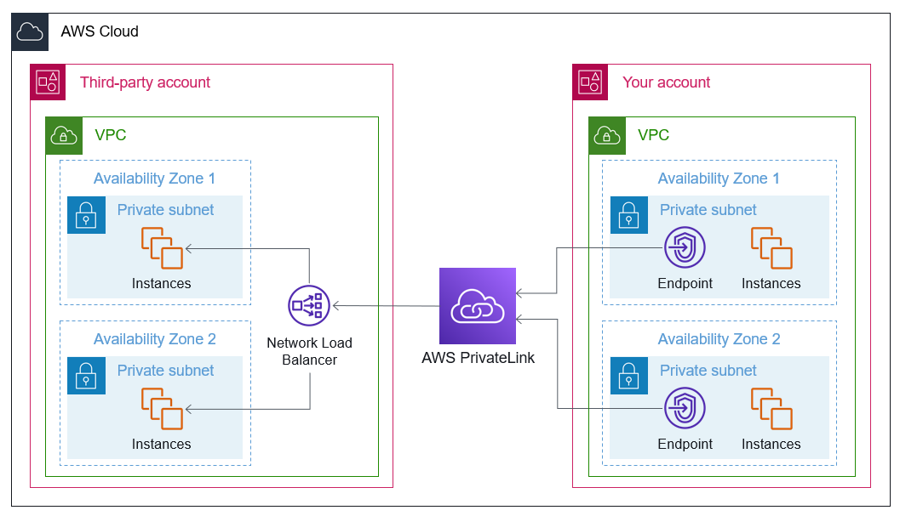
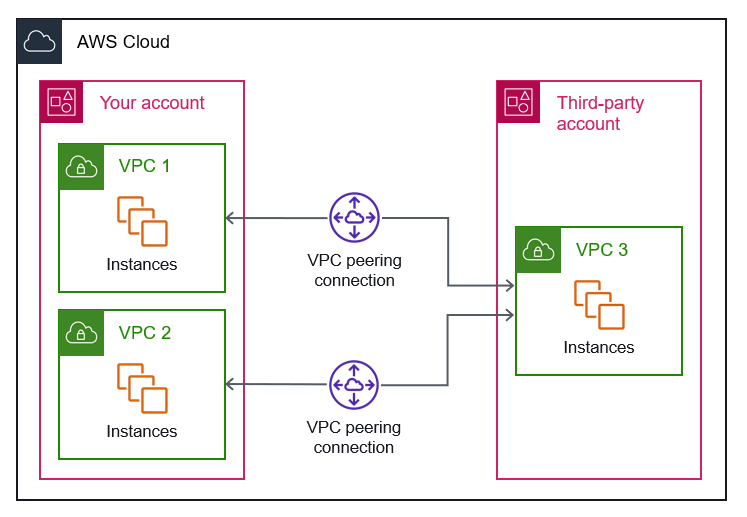
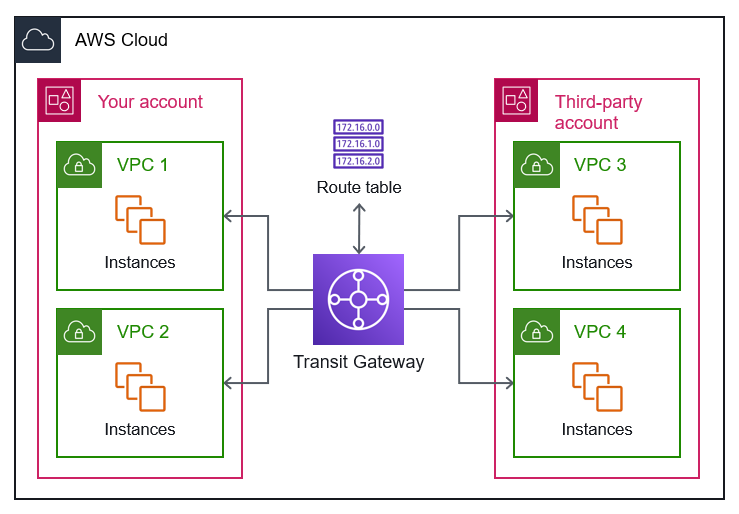
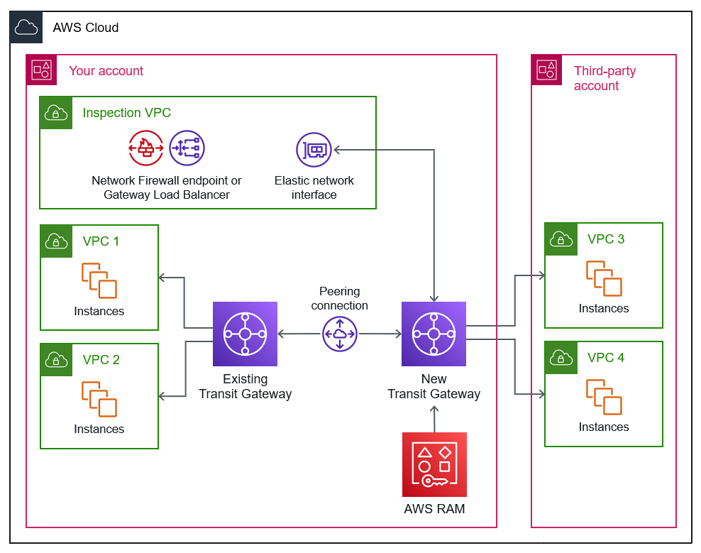
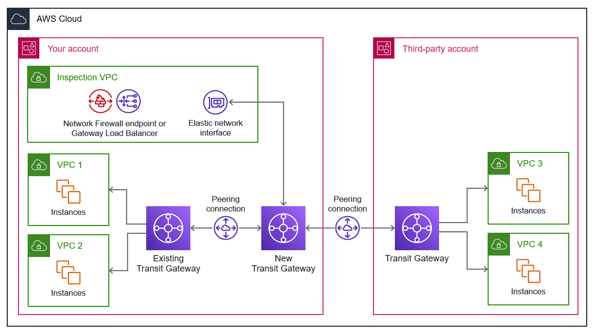

# AWS Certified Solutions Architect -- Associate (SAA-C03)

# Notas - Arquitecturas de Interconexión de Redes

## Integración de servicios de terceros en el Nube de AWS

### [Arquitectura 1: AWS PrivateLink](https://docs.aws.amazon.com/es_es/prescriptive-guidance/latest/integrate-third-party-services/architecture-1.html)

El siguiente diagrama de arquitectura muestra cómo puede usar PrivateLink un Network Load Balancer para conectar los puntos finales de su cuenta con los puntos finales de interfaz de una cuenta de terceros, como la cuenta de un proveedor de software como servicio (SaaS). La cuenta de terceros aloja el equilibrador de carga de red.

Consideraciones sobre costos

- Se aplica un cargo por hora por cada punto de conexión de VPC aprovisionado en cada zona de disponibilidad, independientemente del estado de su asociación con el servicio. Incluso si el punto de conexión está en estado pendiente, se le cobrará por hora. 

- Se aplican cargos de procesamiento de datos por cada gigabyte procesado a través del punto de conexión de VPC, independientemente de la fuente o el destino del tráfico.

### [Arquitectura 2: VPC Peering Connection](https://docs.aws.amazon.com/es_es/prescriptive-guidance/latest/integrate-third-party-services/architecture-2.html)

Esta arquitectura admite el tráfico bidireccional entre las VPC y admite todos los tipos de tráfico IP. El tráfico permanece en la AWS infraestructura global y nunca viaja a través de la Internet pública. Esto reduce el riesgo de amenazas externas, como las vulnerabilidades comunes y los ataques DDoS. Todo el tráfico entre regiones está cifrado. Esta arquitectura está diseñada para evitar puntos únicos de errores y cuellos de botella en el ancho de banda.

En el siguiente diagrama de arquitectura, se muestra cómo puede usar las conexiones de emparejamiento de VPC para conectar las VPC de su cuenta con una VPC de la cuenta de terceros.

Consideraciones sobre costos

- No se aplica ningún cargo por crear un emparejamiento de VPC.

- Hay un cargo por la transferencia de datos a través de conexiones de intercambio de tráfico.

### [Arquitectura 3: AWS Transit Gateway](https://docs.aws.amazon.com/es_es/prescriptive-guidance/latest/integrate-third-party-services/architecture-3.html)

En el siguiente diagrama de arquitectura, se muestra una representación simplificada del uso de Transit Gateway para conectar sus VPC a las de un proveedor externo. Cada VPC se conecta a la puerta de enlace de tránsito y la puerta de enlace admite el enrutamiento transitivo entre todas las VPC conectadas.

Consideraciones sobre costos

- La tarifa por hora de la conexión de puerta de enlace de tránsito se cobra al propietario de la cuenta de la conexión (o VPC). Algunos costos serán de su propiedad y otros serán propiedad de un tercero.

- El procesamiento de datos se carga al propietario de la VPC que envía el tráfico a través de la puerta de enlace de tránsito. La recepción de datos de puerta de enlace de tránsito es gratuita.

- No se cobran cargos por procesamiento de datos para los datos enviados entre dos puertas de enlace de tránsito interconectadas.

### [Arquitectura 3.1: Transit Gateway con AWS RAM](https://docs.aws.amazon.com/es_es/prescriptive-guidance/latest/integrate-third-party-services/architecture-3-1.html)

El siguiente diagrama de arquitectura muestra cómo se suele AWS RAM compartir una pasarela de tránsito con un proveedor de servicios externo. Por motivos de seguridad, usted crea una nueva puerta de enlace de tránsito en su cuenta. Conecta la nueva puerta de enlace de tránsito a las VPC de terceros. Utiliza una interconexión para conectar la nueva puerta de enlace de tránsito a una puerta de enlace tránsito existente en su cuenta, que está conectada a sus VPC. Debe habilitar el modo dispositivo en la nueva puerta de enlace de tránsito para conectarse con la interfaz de red elástica de la VPC de inspección.

### [Arquitectura 3.2: Transit Gateway con Peering Connection](https://docs.aws.amazon.com/es_es/prescriptive-guidance/latest/integrate-third-party-services/architecture-3-2.html)

En el siguiente diagrama de arquitectura, se muestra cómo se crea una interconexión entre dos puertas de enlace de tránsito, una nueva puerta de enlace de tránsito en su cuenta y una puerta de enlace de tránsito en la cuenta de terceros. El tercero es responsable de conectar sus VPC a su puerta de enlace de tránsito. También utiliza una interconexión para conectar la nueva puerta de enlace de tránsito de su cuenta a una puerta de enlace de tránsito existente, que está conectada a sus VPC. Debe habilitar el modo dispositivo en la nueva puerta de enlace de tránsito para conectarse con la interfaz de red elástica de la VPC de inspección.

