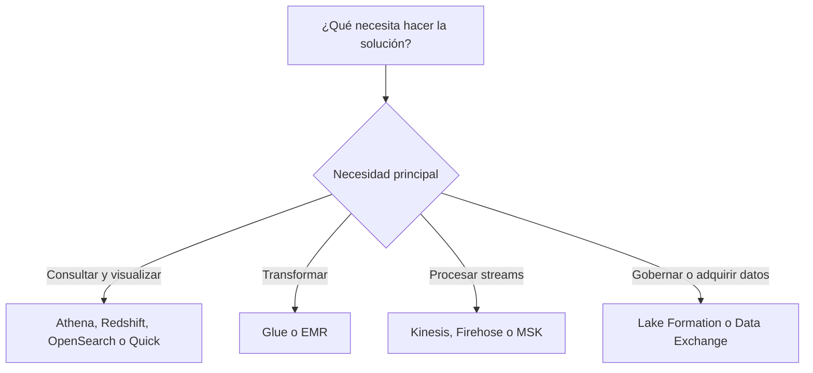
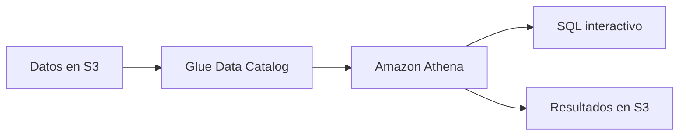
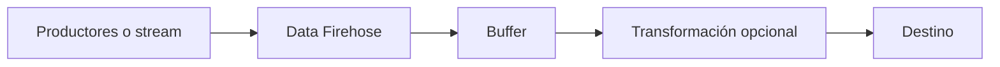
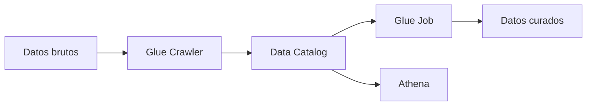
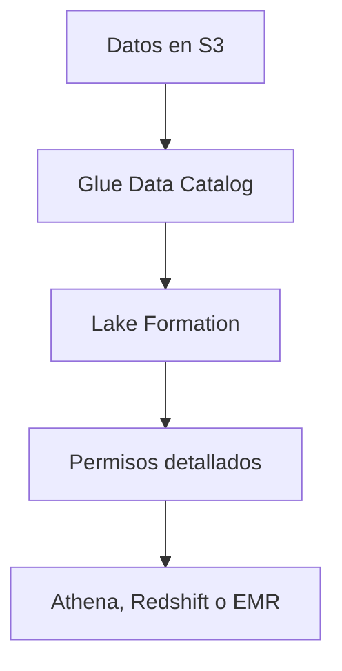
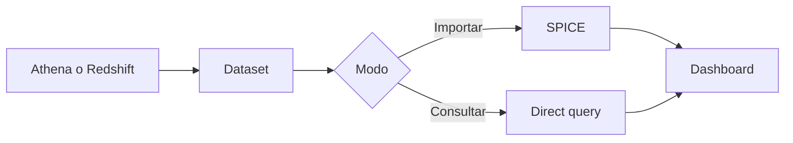

# Servicios de analítica en AWS para el examen SAA-C03

## 1. Alcance necesario para el examen

La guía oficial vigente del SAA-C03 incluye los siguientes servicios en la categoría Analytics:

- Amazon Athena
- AWS Data Exchange
- Amazon Data Firehose
- Amazon EMR
- AWS Glue
- Amazon Kinesis
- AWS Lake Formation
- Amazon Managed Streaming for Apache Kafka —Amazon MSK—
- Amazon OpenSearch Service
- Amazon Quick
- Amazon Redshift

El examen evalúa principalmente la capacidad de:

- Elegir entre procesamiento batch, streaming y consultas interactivas.
- Diferenciar un data lake, un data warehouse, un motor de búsqueda y una herramienta de BI.
- Elegir entre una solución serverless y una con capacidad aprovisionada.
- Diseñar ingesta, transformación, catálogo, gobierno, consulta y visualización de datos.
- Reducir el volumen de datos leído mediante particiones y formatos columnares.
- Diseñar flujos de streaming con orden, retención, consumidores y tolerancia a duplicados.
- Proteger datos con IAM, cifrado, redes privadas y permisos detallados.
- Seleccionar la solución con menor costo y operación que satisfaga latencia, escala y disponibilidad.

> **Alcance de esta guía:** solo se desarrollan los once servicios anteriores. Otros servicios pueden aparecer como integraciones necesarias, pero no se estudian como secciones independientes.

---

## 2. Modelos fundamentales de analítica

| Necesidad | Modelo | Servicio principal | Uso típico |
|---|---|---|---|
| Consultar archivos con SQL | Consulta interactiva serverless | Amazon Athena | Consultas ad hoc sobre un data lake |
| Adquirir o compartir datos externos | Intercambio de datos | AWS Data Exchange | Suscribirse a productos de datos de terceros |
| Entregar un stream a un destino | Pipeline administrado de entrega | Amazon Data Firehose | Cargar eventos en S3, Redshift u OpenSearch |
| Ejecutar frameworks de big data | Clúster o ejecución serverless | Amazon EMR | Spark, Hadoop, Hive y procesamiento distribuido |
| Catalogar y transformar datos | Integración de datos serverless | AWS Glue | Crawlers, Data Catalog y trabajos ETL |
| Crear streams con consumidores propios | Streaming administrado | Amazon Kinesis | Procesamiento de eventos en tiempo real |
| Gobernar un data lake | Gobierno y permisos detallados | AWS Lake Formation | Acceso por tabla, columna, fila o etiqueta |
| Utilizar el ecosistema Apache Kafka | Kafka administrado | Amazon MSK | Topics, partitions, consumer groups y offsets |
| Buscar documentos y analizar logs | Motor de búsqueda y observabilidad | Amazon OpenSearch Service | Full-text search, logs y métricas |
| Visualizar y compartir información | BI y espacio de trabajo analítico | Amazon Quick | Análisis, dashboards y consultas en lenguaje natural |
| Analítica SQL de alto rendimiento | Data warehouse MPP columnar | Amazon Redshift | BI empresarial y consultas repetitivas complejas |

### Regla mental inicial

> **Regla de examen:** primero identifique la etapa del ciclo de datos. Un servicio que ingiere no necesariamente transforma, uno que cataloga no consulta y uno que visualiza no reemplaza al motor analítico.

---

## 3. Conceptos de arquitectura que se deben dominar

### Batch frente a streaming

| Batch | Streaming |
|---|---|
| Procesa un conjunto acumulado | Procesa eventos conforme llegan |
| Latencia de minutos u horas | Latencia de segundos o inferior, según el diseño |
| Adecuado para ETL periódico | Adecuado para alertas, telemetría y eventos |
| EMR, Glue y Redshift son opciones comunes | Kinesis, MSK y Data Firehose son opciones comunes |

No todo requisito “en tiempo real” necesita un broker con consumidores personalizados. Si la necesidad es únicamente entregar eventos a S3 u otro destino compatible, Data Firehose reduce la operación.

### Data lake frente a data warehouse

| Data lake | Data warehouse |
|---|---|
| Conserva datos estructurados y no estructurados | Optimizado para datos analíticos estructurados |
| Habitualmente usa almacenamiento de objetos | Usa almacenamiento y cómputo optimizados para SQL |
| Schema-on-read | Predomina schema-on-write |
| Flexible y económico para grandes volúmenes | Alto rendimiento para consultas repetitivas |
| Athena consulta; Glue cataloga; Lake Formation gobierna | Amazon Redshift almacena y consulta |

Un diseño puede utilizar ambos:

1. Los datos brutos llegan al data lake.
2. Glue los cataloga y transforma.
3. Athena realiza exploración ad hoc.
4. Redshift almacena datos curados para BI.
5. Quick publica análisis y dashboards.

### Schema-on-read frente a schema-on-write

- **Schema-on-read:** la estructura se aplica al consultar. Es común en Athena sobre archivos de un data lake.
- **Schema-on-write:** los datos se validan y organizan antes de cargarse. Es común en un data warehouse.
- AWS Glue Data Catalog almacena metadatos; no contiene los datos de negocio.
- Un crawler puede inferir el esquema, pero la inferencia debe revisarse cuando la calidad o consistencia son críticas.

### ETL frente a ELT

| ETL | ELT |
|---|---|
| Extraer, transformar y cargar | Extraer, cargar y transformar |
| La transformación ocurre antes del destino | La transformación ocurre en el motor analítico |
| Común con Glue o EMR | Común con Redshift |

La elección depende de dónde sea más eficiente ejecutar la transformación, los controles de gobierno y el formato que necesita el consumidor.

### Formato, compresión y particionamiento

- **CSV y JSON** son simples, pero suelen leer más bytes.
- **Parquet y ORC** son columnares y permiten leer solo las columnas necesarias.
- La compresión reduce almacenamiento y datos transferidos o escaneados.
- Las particiones organizan datos por claves frecuentes de filtro, como fecha o región.
- Demasiadas particiones pequeñas y demasiados archivos pequeños perjudican el rendimiento.
- Filtrar por una clave de partición reduce el escaneo en Athena y otros motores compatibles.

> **Regla de costo:** en motores que cobran por datos leídos, particionar, comprimir y utilizar formatos columnares mejora simultáneamente rendimiento y costo.

### Conceptos de streaming

- **Producer:** publica registros.
- **Stream, topic o delivery stream:** canal por el que circulan los datos.
- **Partition o shard:** unidad de paralelismo y capacidad.
- **Consumer:** lee y procesa registros.
- **Offset, sequence number o checkpoint:** posición de lectura.
- **Retention:** tiempo durante el cual se puede volver a leer.
- **Replay:** reprocesamiento desde una posición anterior.
- **At-least-once:** un registro puede entregarse más de una vez; el consumidor debe ser idempotente.

### Gobierno, seguridad y catálogo

- IAM controla quién puede llamar a las APIs del servicio.
- Lake Formation agrega permisos detallados sobre recursos catalogados y ubicaciones del data lake.
- KMS permite controlar claves y auditar el uso del cifrado.
- Las políticas de red limitan el acceso a endpoints, dominios y brokers.
- El catálogo proporciona metadatos compartidos a motores como Athena, EMR y Redshift.
- Gobierno no significa solo cifrado: también incluye clasificación, propiedad, permisos, auditoría y linaje.

---

## 4. Amazon Athena

Amazon Athena es un servicio de consultas interactivas que permite analizar datos directamente en Amazon S3 mediante SQL estándar. Es serverless: no se crean ni administran clústeres para ejecutar consultas.

### Características clave

- Consulta datos en S3 sin cargarlos previamente en una base.
- Utiliza un enfoque **schema-on-read**.
- Se integra habitualmente con AWS Glue Data Catalog para tablas, columnas y particiones.
- Es apropiado para consultas ad hoc, exploración, logs y análisis de un data lake.
- Guarda los resultados de las consultas en una ubicación de S3 configurada.
- Admite formatos como CSV, JSON, Parquet y ORC.
- Puede crear tablas o convertir formatos mediante `CTAS`.
- Admite consultas federadas a fuentes compatibles mediante conectores.
- Los **workgroups** aíslan usuarios y cargas, aplican configuración y controlan uso.
- Puede utilizar capacidad bajo demanda por consulta o reservas de capacidad cuando se necesita mayor previsibilidad.

### Arquitectura conceptual

El Data Catalog contiene metadatos. Athena continúa leyendo los archivos desde su ubicación original.

### Rendimiento y costo

En el modelo SQL habitual, el costo depende principalmente de la cantidad de datos escaneados.

Para reducirlo:

- Convertir texto a Parquet u ORC.
- Comprimir los archivos.
- Particionar por claves utilizadas en filtros.
- Seleccionar únicamente las columnas necesarias.
- Evitar `SELECT *` cuando no sea necesario.
- Compactar archivos excesivamente pequeños.
- Usar workgroups y límites de uso.
- Reutilizar resultados cuando la frescura requerida lo permita.

### Cuándo elegir Athena

- Consultas ad hoc sobre archivos en S3.
- Investigar logs sin mantener un clúster.
- Explorar un data lake antes de definir un modelo de warehouse.
- Carga esporádica o impredecible.
- SQL serverless con mínima operación.

### Cuándo no elegirlo

- Aplicaciones OLTP con escrituras por fila y transacciones frecuentes.
- Consultas repetitivas de BI que necesitan optimización y rendimiento estable a gran escala.
- Búsqueda de texto completo.
- Procesamiento de streams registro por registro.

### Trampas del examen

- Athena **no almacena** los datos consultados; los lee desde la fuente.
- Glue Data Catalog almacena el esquema, no los registros.
- Particionar solo ayuda si la consulta filtra por la clave correspondiente.
- Athena no es una base de datos transaccional.
- Para un warehouse MPP de consultas complejas repetidas, normalmente se evalúa Redshift.

---

## 5. AWS Data Exchange

AWS Data Exchange ayuda a compartir y administrar a escala los derechos de acceso —entitlements— a datos de otras organizaciones. Está integrado con AWS Marketplace para productos comerciales y también admite mecanismos de concesión de datos.

### Conceptos clave

| Concepto | Significado |
|---|---|
| Provider | Organización que publica o concede datos |
| Subscriber o receiver | Organización que recibe el derecho de acceso |
| Product | Oferta que agrupa uno o más conjuntos de datos |
| Data set | Recurso lógico que contiene activos |
| Revision | Versión de un data set |
| Asset | Archivo, API u otro recurso entregado |
| Entitlement | Derecho del receptor a utilizar el data set |

### Tipos de entrega que se deben reconocer

- Archivos.
- APIs.
- Data shares de Amazon Redshift.
- Acceso directo a datos en Amazon S3.
- Permisos de datos mediante AWS Lake Formation, cuando estén disponibles para el tipo de producto.

El acceso directo a S3 evita que el suscriptor tenga que copiar todos los archivos a su propio bucket. Un producto basado en Redshift permite consumir datos compartidos sin crear una exportación manual.

### Características

- Los proveedores pueden publicar revisiones nuevas.
- Los suscriptores pueden recibir actualizaciones según el producto y su configuración.
- Permite ofertas públicas o privadas y productos comerciales o gratuitos.
- Los permisos de IAM siguen siendo necesarios para acceder a los recursos entregados.
- El proveedor continúa siendo responsable de la calidad, legalidad y documentación de los datos.

### Cuándo elegir AWS Data Exchange

- Adquirir datos demográficos, financieros, meteorológicos o sectoriales de terceros.
- Compartir productos de datos entre organizaciones a escala.
- Administrar suscripciones, concesiones y derechos de acceso.
- Consumir datos mediante S3, API, Redshift o Lake Formation sin construir un portal propio.

### Cuándo no elegirlo

- Transformar, limpiar o catalogar datos propios.
- Transportar telemetría en tiempo real.
- Consultar archivos con SQL.
- Implementar por sí solo el gobierno interno de un data lake.

### Trampas del examen

- Data Exchange distribuye o concede acceso a datos; no reemplaza a Glue como ETL.
- Una suscripción no elimina la necesidad de permisos IAM.
- Data Exchange y Lake Formation pueden integrarse, pero resuelven problemas distintos: intercambio frente a gobierno detallado.

---

## 6. Amazon Data Firehose

Amazon Data Firehose —antes llamado Amazon Kinesis Data Firehose— es un servicio totalmente administrado para recibir, almacenar en búfer, transformar opcionalmente y entregar datos de streaming a destinos compatibles.

### Flujo conceptual

### Características clave

- No requiere administrar shards.
- Escala la infraestructura de entrega de forma administrada.
- Puede recibir registros directamente mediante API.
- Puede leer desde Amazon Kinesis Data Streams.
- Puede utilizar Amazon MSK como fuente para destinos compatibles.
- Agrupa registros según tiempo o tamaño antes de entregarlos.
- Puede comprimir, cifrar y convertir formatos.
- Puede invocar Lambda para transformar registros.
- Puede aplicar particionamiento dinámico al entregar en S3.
- Conserva datos fallidos o de respaldo en S3 según la configuración.
- Expone métricas y logs de errores mediante CloudWatch.

### Destinos que se deben reconocer

- Amazon S3.
- Amazon Redshift.
- Amazon OpenSearch Service y OpenSearch Serverless.
- Endpoints HTTP compatibles.
- Otros destinos de observabilidad y analítica admitidos.

Para Redshift, Data Firehose normalmente entrega primero los datos a S3 y después utiliza `COPY` para cargarlos en Redshift.

### Latencia

Data Firehose es una solución de entrega **near real time**. El buffering mejora la eficiencia, pero añade latencia. Si cada registro debe procesarse inmediatamente mediante lógica propia, Kinesis Data Streams o MSK suelen ser opciones más apropiadas.

### Transformación

- La transformación con Lambda es opcional.
- No convierte a Firehose en una plataforma ETL compleja.
- Los errores de transformación o entrega deben enviarse a una ubicación de respaldo y monitorizarse.
- El destino debe conceder a Firehose un rol con los permisos necesarios.

### Cuándo elegir Data Firehose

- Entregar logs o eventos en S3.
- Indexar telemetría en OpenSearch sin escribir consumidores.
- Cargar eventos en Redshift mediante un pipeline administrado.
- Convertir JSON a Parquet durante la entrega.
- Reducir al mínimo la administración de streaming.

### Cuándo no elegirlo

- Varios consumidores independientes con lógica propia.
- Replay controlado por cada aplicación consumidora.
- Compatibilidad obligatoria con APIs de Kafka.
- Orden y procesamiento personalizado por registro con latencia mínima.

### Trampas del examen

- Data Firehose entrega datos; no es un broker general para múltiples consumidores.
- El buffering significa que la entrega no es necesariamente instantánea.
- No se aprovisionan shards.
- En preguntas antiguas puede aparecer como **Kinesis Data Firehose**.

---

## 7. Amazon EMR

Amazon EMR es una plataforma administrada de big data para ejecutar frameworks distribuidos como Apache Spark, Hadoop, Hive y otras herramientas compatibles.

### Formas de ejecución

| Opción | Control | Uso típico |
|---|---|---|
| EMR sobre Amazon EC2 | Mayor control de instancias, red y configuración | Clústeres personalizados y cargas persistentes |
| EMR Serverless | Sin administrar clústeres | Jobs Spark o Hive variables |
| EMR sobre Amazon EKS | Jobs EMR sobre un clúster Kubernetes | Organizaciones estandarizadas en EKS |

### Arquitectura de un clúster EMR sobre EC2

| Tipo de nodo | Función | Consideración |
|---|---|---|
| Primary | Coordina el clúster y servicios principales | Su pérdida puede afectar al clúster |
| Core | Ejecuta tareas y almacena datos HDFS | No se debe retirar agresivamente si conserva bloques HDFS |
| Task | Solo ejecuta tareas | Adecuado para capacidad elástica o Spot |

Un diseño frecuente utiliza capacidad estable para nodos críticos y Spot para nodos task tolerantes a interrupción.

### Almacenamiento

- **HDFS:** almacenamiento distribuido ligado a los nodos; puede perder capacidad al terminar el clúster.
- **EMRFS con S3:** desacopla almacenamiento y cómputo, facilita clústeres transitorios y reutilización de datos.
- El almacenamiento local sirve para datos temporales, shuffle y procesamiento.
- Los resultados duraderos deben guardarse fuera de nodos efímeros.

### Clúster transitorio frente a persistente

| Transitorio | Persistente |
|---|---|
| Se crea para un job y se termina | Permanece activo |
| Reduce costo inactivo | Menor latencia de inicio |
| Adecuado con datos en S3 | Adecuado para cargas continuas |
| Requiere automatización de creación | Requiere operación y monitoreo constantes |

### Escalado y costo

- EMR Managed Scaling ajusta capacidad según la carga.
- Las instance fleets permiten combinar tipos de instancia y opciones de compra.
- Spot reduce costo en trabajo tolerante a interrupciones.
- Deben evitarse Spot para componentes cuya interrupción provoque pérdida crítica o indisponibilidad.
- El costo incluye la capacidad subyacente y el cargo de EMR.
- Terminar clústeres transitorios al completar el trabajo evita capacidad ociosa.

### Cuándo elegir EMR

- Procesamiento distribuido con Spark o Hadoop.
- Necesidad de instalar frameworks o personalizar configuraciones.
- Migración de cargas existentes del ecosistema Hadoop.
- Procesamiento a escala que requiere mayor control que un ETL administrado.
- Cargas que se benefician de clústeres transitorios o capacidad Spot.

### Cuándo no elegirlo

- Una consulta SQL ad hoc sencilla sobre S3.
- Un ETL estándar donde Glue reduce la operación.
- Un data warehouse para dashboards repetitivos.
- Entrega directa de un stream a S3.

### EMR frente a Glue

| Amazon EMR | AWS Glue |
|---|---|
| Plataforma de big data flexible | Integración de datos serverless |
| Mayor control del runtime y frameworks | Menor operación |
| Clúster, Serverless o EKS | Jobs administrados |
| Apropiado para cargas complejas o migradas | Apropiado para ETL y catálogo |

### Trampas del examen

- EMR no es únicamente Hadoop; también ejecuta Spark y otros frameworks.
- Los nodos task no almacenan HDFS.
- Separar datos en S3 permite terminar y recrear clústeres.
- Un clúster administrado todavía requiere decisiones de capacidad, red, seguridad y aplicaciones.

---

## 8. AWS Glue

AWS Glue es un servicio serverless de integración de datos para descubrir, preparar, mover e integrar datos de múltiples fuentes.

### Componentes principales

| Componente | Función |
|---|---|
| AWS Glue Data Catalog | Repositorio central de metadatos |
| Crawler | Descubre fuentes e infiere esquemas y particiones |
| Job | Ejecuta transformación o movimiento de datos |
| Trigger | Inicia jobs o crawlers por tiempo o condición |
| Workflow | Coordina varios componentes |
| Connection | Define conectividad con un data store |
| Job bookmark | Conserva estado para evitar reprocesar datos ya tratados |

### AWS Glue Data Catalog

- Almacena bases lógicas, tablas, columnas, particiones y ubicaciones.
- Puede ser utilizado por Athena, EMR, Redshift Spectrum y Lake Formation.
- No almacena los registros de negocio.
- Proporciona una definición compartida para varios motores.
- Puede recibir tablas creadas manualmente, por API o mediante crawlers.

### Crawlers

- Conectan con una fuente.
- Clasifican datos.
- Infieren esquemas.
- Crean o actualizan tablas y particiones.
- Pueden ejecutarse bajo demanda o con programación.

> **Trampa de examen:** un crawler cataloga; no transforma el contenido.

### Jobs de Glue

- Ejecutan ETL administrado sin aprovisionar servidores.
- Los jobs Spark son una opción habitual para grandes volúmenes.
- Pueden leer del Data Catalog y escribir en varios destinos.
- La capacidad se expresa mediante workers y Data Processing Units —DPUs—.
- Los job bookmarks ayudan al procesamiento incremental.
- Un bookmark no sustituye la idempotencia del destino.
- Los jobs de streaming pueden procesar fuentes compatibles de forma continua.

### Flujo típico

### Cuándo elegir Glue

- Crear un catálogo central.
- Descubrir esquema y particiones automáticamente.
- Ejecutar ETL serverless.
- Convertir datos a Parquet.
- Coordinar pipelines de integración de datos.
- Procesar incrementos con job bookmarks.

### Cuándo no elegirlo

- Consultar datos directamente con SQL como objetivo principal.
- Necesitar control profundo de un clúster o un framework específico.
- Implementar un broker de streaming.
- Publicar dashboards.

### Trampas del examen

- Glue Data Catalog y Glue ETL son capacidades diferentes del mismo servicio.
- Un job bookmark conserva estado de procesamiento; no deduplica cualquier efecto externo.
- Glue es serverless, pero se paga por la capacidad y duración consumidas.
- Lake Formation usa recursos del Data Catalog, pero agrega gobierno y permisos detallados.

---

## 9. Amazon Kinesis

Amazon Kinesis proporciona capacidades de streaming en AWS. Para el SAA-C03, el foco arquitectónico principal es **Amazon Kinesis Data Streams**; Amazon Data Firehose se estudia por separado.

### Amazon Kinesis Data Streams

Kinesis Data Streams recibe y conserva registros para que una o más aplicaciones consumidoras los procesen en tiempo real.

### Conceptos

| Concepto | Función |
|---|---|
| Stream | Conjunto ordenado de registros distribuidos |
| Shard | Unidad de capacidad y paralelismo |
| Record | Datos, partition key y sequence number |
| Partition key | Determina el shard de un registro |
| Producer | Escribe registros |
| Consumer | Lee y procesa registros |
| Checkpoint | Posición procesada por una aplicación |

### Orden

- El orden se conserva dentro de un shard.
- Los registros con la misma partition key se asignan normalmente al mismo shard.
- No existe un orden global práctico entre todos los shards.
- Una partition key con tráfico desproporcionado puede crear un **hot shard**.

### Modos de capacidad

| Provisioned | On-demand |
|---|---|
| Se administran shards | Kinesis administra la capacidad |
| Adecuado para tráfico predecible | Adecuado para tráfico variable |
| Requiere dimensionamiento y resharding | Menor operación |
| Costo ligado a capacidad y uso | Costo ligado al throughput utilizado |

En modo provisionado, un shard admite como referencia clásica hasta 1 MB/s o 1.000 registros/s de escritura y hasta 2 MB/s de lectura compartida. Las cuotas vigentes siempre deben verificarse antes de un diseño real.

### Consumidores

- **Shared fan-out:** los consumidores comparten el throughput de lectura del shard.
- **Enhanced fan-out:** cada consumidor registrado obtiene capacidad de lectura dedicada y entrega push con menor latencia.
- Kinesis Client Library —KCL— distribuye shards entre workers y administra checkpoints mediante recursos auxiliares.

### Retención y replay

- Los registros permanecen durante el período de retención configurado.
- Cada consumidor puede leer a su propio ritmo.
- Es posible volver a leer datos aún retenidos.
- Si el consumidor se retrasa más allá de la retención, los registros expiran.
- Se debe monitorizar la antigüedad del último registro procesado.

### Escalado

- En provisioned, dividir o fusionar shards ajusta capacidad.
- Una mala partition key puede impedir una distribución uniforme.
- En on-demand, AWS administra shards y escala dentro de las características y cuotas del modo.
- Aumentar consumers no soluciona un hot shard causado por una partition key.

### Cuándo elegir Kinesis Data Streams

- Varios consumidores independientes.
- Procesamiento personalizado en tiempo real.
- Necesidad de retención y replay.
- Integración nativa con servicios de AWS.
- Control de orden por partition key.

### Cuándo no elegirlo

- Solo se necesita entregar eventos a un destino compatible.
- La organización requiere las APIs y herramientas de Apache Kafka.
- El trabajo es puramente batch.

### Trampas del examen

- Los shards definen paralelismo y capacidad en modo provisionado.
- El orden es por shard o partition key, no global.
- El mismo registro puede procesarse más de una vez; se necesita idempotencia.
- Enhanced fan-out entrega capacidad dedicada por consumidor.
- Kinesis conserva datos; Data Firehose se enfoca en entregarlos.

---

## 10. AWS Lake Formation

AWS Lake Formation facilita crear, proteger y administrar data lakes. Trabaja con datos almacenados en ubicaciones como S3 y con metadatos del AWS Glue Data Catalog.

### Qué aporta

- Registro de ubicaciones de datos.
- Administración centralizada de permisos.
- Acceso detallado a catálogos, bases, tablas y columnas.
- Filtros de datos para acceso por filas, columnas y celdas.
- Control basado en etiquetas con **LF-Tags**.
- Compartición entre cuentas.
- Auditoría e integración con motores analíticos compatibles.
- Modo híbrido para adoptar permisos de Lake Formation gradualmente.

### Arquitectura conceptual

Lake Formation no mueve automáticamente todos los datos ni ejecuta las consultas. Autoriza el acceso que realizan los motores integrados.

### IAM frente a permisos de Lake Formation

| IAM | Lake Formation |
|---|---|
| Controla APIs y recursos AWS | Controla acceso detallado a datos catalogados |
| Permisos generalmente más amplios sobre S3 y Glue | Permisos por base, tabla, columna, fila o etiqueta |
| Sigue siendo necesario | Se combina con IAM |

Para que una consulta funcione, el principal necesita la combinación correcta de permisos de IAM, Lake Formation, catálogo y ubicación subyacente.

### LF-Tags

- Son pares clave-valor aplicados a recursos del catálogo.
- Permiten conceder permisos por clasificación, dominio o sensibilidad.
- Escalan mejor que grants manuales cuando existen muchas tablas.
- Son útiles para compartir de forma consistente entre cuentas y unidades organizativas.

Ejemplo conceptual:

- `dominio=ventas`
- `sensibilidad=restringida`
- Los analistas reciben `SELECT` únicamente sobre recursos con etiquetas autorizadas.

### Cuándo elegir Lake Formation

- Gobierno central de un data lake.
- Permisos por tabla, columna o fila.
- Compartir datasets catalogados entre cuentas sin copiarlos.
- Aplicar políticas mediante etiquetas.
- Reducir la administración manual de permisos S3 por cada consumidor.

### Cuándo no elegirlo

- Ejecutar ETL como objetivo principal.
- Consultar directamente archivos.
- Adquirir productos de datos de terceros.
- Crear un data warehouse.

### Trampas del examen

- Lake Formation no reemplaza a S3: gobierna datos almacenados.
- No reemplaza a Glue Data Catalog: utiliza sus recursos de metadatos.
- IAM continúa formando parte de la autorización.
- Compartir mediante Lake Formation no implica copiar físicamente los datos.

---

## 11. Amazon Managed Streaming for Apache Kafka —Amazon MSK—

Amazon MSK es un servicio totalmente administrado para crear y ejecutar aplicaciones que utilizan Apache Kafka. AWS administra gran parte de la infraestructura del clúster; el cliente conserva el modelo de datos y las aplicaciones Kafka.

### Conceptos Kafka

| Concepto | Función |
|---|---|
| Broker | Servidor que almacena particiones y atiende clientes |
| Topic | Flujo lógico de eventos |
| Partition | Unidad de orden y paralelismo |
| Producer | Publica eventos |
| Consumer group | Conjunto que comparte el procesamiento |
| Offset | Posición de un consumer dentro de una partition |
| Replica | Copia de una partition para disponibilidad |

### Opciones de clúster

| MSK Provisioned | MSK Serverless |
|---|---|
| Se eligen brokers y capacidad | AWS aprovisiona y escala capacidad |
| Mayor control y opciones | Menor operación |
| Adecuado para tráfico estable o personalizado | Adecuado para tráfico variable |
| Se paga capacidad provisionada | Modelo ligado al uso |

### Responsabilidad compartida

AWS administra:

- Aprovisionamiento y reemplazo de brokers.
- Parches y mantenimiento de infraestructura.
- Integración con monitoreo y seguridad de AWS.
- Opciones de despliegue entre zonas de disponibilidad.

El cliente administra:

- Topics y número de partitions.
- Replication factor y configuraciones Kafka.
- Producers, consumers y consumer groups.
- Esquemas, serialización y compatibilidad.
- Backpressure, errores e idempotencia.
- Capacidad y rendimiento del cliente.

### Disponibilidad

- Distribuir brokers entre varias AZ protege frente a fallos.
- Las partitions deben tener réplicas suficientes.
- Un replication factor incorrecto puede limitar la resiliencia aunque los brokers estén distribuidos.
- Los clientes deben manejar reconexiones, cambio de leader y reintentos.
- Se debe monitorizar almacenamiento, throughput, lag y estado de partitions.

### Seguridad

- Cifrado TLS entre clientes y brokers.
- Cifrado de datos en reposo.
- Autenticación mediante IAM, SASL/SCRAM o mutual TLS según la configuración.
- Autorización mediante IAM o ACL de Kafka, según el método.
- Acceso privado dentro de VPC y opciones de conectividad privada entre VPC o cuentas.

### Cuándo elegir MSK

- Aplicaciones existentes que usan APIs de Kafka.
- Necesidad del ecosistema Kafka, sus conectores y semántica.
- Portabilidad entre entornos basada en clientes Kafka.
- Topics con múltiples consumer groups.
- Control de partitions, offsets y configuración Kafka.

### Cuándo no elegirlo

- Solo se requiere enviar un stream a S3 u OpenSearch.
- Se busca una experiencia AWS nativa con menor conocimiento de Kafka.
- No se necesitan APIs ni ecosistema Kafka.

### Trampas del examen

- MSK administra Kafka, pero no escribe la lógica de producers y consumers.
- Un topic no equivale a un delivery stream de Firehose.
- El orden se conserva dentro de una partition, no en todo el topic.
- Más partitions aumentan paralelismo, pero también complejidad.
- MSK Serverless elimina dimensionamiento de brokers, no el diseño de Kafka.

---

## 12. Amazon OpenSearch Service

Amazon OpenSearch Service permite desplegar, operar y escalar OpenSearch para búsqueda, análisis de logs, observabilidad y casos de uso de analítica de documentos.

### Modelos de despliegue

| Dominios provisionados | OpenSearch Serverless |
|---|---|
| Se eligen nodos, almacenamiento y topología | Se utilizan collections que escalan automáticamente |
| Mayor control y ajuste | Menor operación |
| Costo por recursos provisionados | Costo por capacidad de cómputo y almacenamiento consumida |
| Adecuado para cargas estables o personalizadas | Adecuado para cargas variables |

### Conceptos

| Concepto | Significado |
|---|---|
| Domain | Clúster OpenSearch provisionado por AWS |
| Collection | Recurso lógico de OpenSearch Serverless |
| Index | Colección de documentos |
| Document | Registro JSON indexado |
| Primary shard | Fragmento principal de un índice |
| Replica shard | Copia para disponibilidad y lecturas |
| Cluster manager node | Coordina el estado del clúster |
| Data node | Almacena shards y ejecuta operaciones |

### Características

- Búsqueda de texto completo.
- Indexación near real time.
- Agregaciones sobre documentos.
- Dashboards para explorar datos y logs.
- Integración con Data Firehose para ingesta administrada.
- Dominios dentro de VPC.
- Fine-grained access control.
- Cifrado en tránsito y en reposo.
- Snapshots administrados y opciones manuales según el modelo.
- Niveles de almacenamiento como UltraWarm para determinados dominios.

### Disponibilidad

- Las réplicas protegen los shards primarios y distribuyen lecturas.
- Multi-AZ distribuye nodos entre zonas.
- Multi-AZ with Standby proporciona una configuración de producción simplificada y altamente disponible.
- Para dominios de producción se utilizan cluster manager nodes dedicados.
- Un estado yellow indica que todos los primary shards están asignados, pero falta al menos una réplica.

### Cuándo elegir OpenSearch Service

- Búsqueda de texto completo en catálogos o documentos.
- Centralización y exploración de logs.
- Observabilidad y análisis operativo.
- Consultas por términos, relevancia y agregaciones sobre documentos.
- Dashboards operativos de baja latencia sobre datos indexados.

### Cuándo no elegirlo

- Transacciones relacionales.
- Data warehouse SQL con joins complejos a gran escala.
- Almacenamiento duradero de datos brutos como fuente única.
- ETL general.

### Trampas del examen

- OpenSearch no es un reemplazo general de una base relacional.
- Los datos deben indexarse antes de buscarse eficientemente.
- Un replica shard no puede asignarse al mismo nodo que su primary.
- Serverless reduce la operación, pero continúan siendo necesarios permisos, políticas de red e índices adecuados.

---

## 13. Amazon Quick

Amazon Quick es un espacio de trabajo impulsado por IA que evolucionó de Amazon QuickSight. La capacidad histórica de business intelligence continúa como **Amazon Quick Sight**, una función central dentro de Quick. Las APIs, SDK e integraciones existentes de QuickSight continúan funcionando.

> **Para el SAA-C03:** las preguntas pueden utilizar el nombre actual Amazon Quick o la terminología histórica QuickSight. Las claves arquitectónicas de BI siguen siendo análisis, dashboards, datasets, SPICE, direct query, visualización y embedded analytics.

### Capacidades de BI que se deben dominar

| Recurso | Función |
|---|---|
| Data source | Conexión al origen |
| Dataset | Preparación lógica de los datos |
| Analysis | Espacio editable donde el autor crea visuales |
| Dashboard | Versión publicada para consumidores |
| SPICE | Motor en memoria optimizado para análisis |
| Direct query | Consulta el origen cuando el usuario interactúa |

### SPICE frente a direct query

| SPICE | Direct query |
|---|---|
| Importa datos al motor en memoria | Consulta la fuente |
| Respuesta rápida y menor carga al origen | Datos tan actuales como el origen |
| Requiere refresh | Depende de rendimiento y disponibilidad del origen |
| Consume capacidad SPICE | Puede aumentar consultas y costo del origen |

### Características

- Visualizaciones y dashboards interactivos.
- Conectores a data lakes, bases y data warehouses.
- Compartición de análisis y dashboards.
- Acceso por filas y columnas según la configuración.
- Embedded analytics para integrar visuales en aplicaciones.
- Alertas, informes y distribución programada.
- Capacidades generativas y consultas en lenguaje natural.
- Roles orientados a autores y lectores para cargas de BI.

Amazon Quick también incorpora capacidades de IA, investigación, colaboración y automatización. Para preguntas de arquitectura SAA-C03, el patrón más probable continúa siendo la capa de BI que consume datos desde Athena, Redshift u otras fuentes.

### Flujo típico de BI

### Cuándo elegir Amazon Quick

- Crear dashboards sin administrar servidores de BI.
- Permitir análisis interactivo a usuarios de negocio.
- Visualizar datos de Athena o Redshift.
- Compartir informes y métricas.
- Integrar analítica en aplicaciones.
- Utilizar lenguaje natural y capacidades generativas sobre datos gobernados.

### Cuándo no elegirlo

- Transformar grandes volúmenes como motor ETL.
- Almacenar el data warehouse.
- Procesar streams.
- Reemplazar controles de acceso del origen.

### Trampas del examen

- Un analysis es editable; un dashboard es la versión publicada.
- SPICE contiene una importación que debe actualizarse.
- Direct query depende del origen.
- Quick visualiza y analiza; no reemplaza a Athena o Redshift como motor o almacén.
- Reconocer **QuickSight** como nombre histórico y **Quick Sight** como función actual dentro de Amazon Quick.

---

## 14. Amazon Redshift

Amazon Redshift es un data warehouse administrado, columnar y de procesamiento masivamente paralelo —MPP—, diseñado para analítica SQL a gran escala.

### Opciones

| Redshift provisioned | Redshift Serverless |
|---|---|
| Se crea un clúster | Se crea un namespace y un workgroup |
| Se eligen tipos y cantidad de nodos | AWS administra capacidad |
| Adecuado para cargas estables | Adecuado para cargas variables o intermitentes |
| Mayor control de topología | Menor operación |

### Arquitectura

- En clústeres provisionados, el leader node coordina consultas y comunicación.
- Los compute nodes almacenan y procesan datos en paralelo.
- El almacenamiento columnar reduce I/O en consultas analíticas.
- La compresión disminuye el volumen leído.
- Los nodos RA3 separan en mayor medida el almacenamiento administrado de la capacidad de cómputo.
- Redshift Serverless mide capacidad mediante RPUs.

### Diseño de tablas

#### Distribution style

Determina cómo se distribuyen las filas entre nodos:

- **AUTO:** Redshift selecciona y puede optimizar el estilo.
- **EVEN:** distribuye filas uniformemente.
- **KEY:** coloca juntas filas con la misma distribution key para reducir movimiento en joins.
- **ALL:** copia una tabla pequeña en todos los nodos.

Una mala distribution key provoca skew o movimiento excesivo de datos.

#### Sort key

- Organiza físicamente los datos para reducir bloques leídos.
- Debe relacionarse con filtros, rangos y patrones de consulta.
- Las capacidades automáticas pueden optimizar decisiones en diseños compatibles.

### Carga y descarga

- `COPY` carga datos en paralelo desde fuentes como S3.
- `UNLOAD` exporta resultados a S3.
- Las cargas masivas son más eficientes que muchos inserts individuales.
- Los archivos deben tener tamaños y distribución apropiados para paralelismo.

### Redshift Spectrum

- Permite consultar datos en S3 sin cargarlos en tablas locales.
- Utiliza catálogos externos compatibles, habitualmente Glue Data Catalog.
- Puede combinar datos del warehouse con datos del lake.
- El dato permanece en S3.

### Escalabilidad y concurrencia

- Workload Management —WLM— separa y prioriza cargas.
- Concurrency Scaling agrega capacidad transitoria para determinados picos.
- Elastic resize y resize clásico cambian capacidad de clústeres compatibles.
- Materialized views precalculan resultados para consultas repetitivas.
- Redshift Serverless ajusta capacidad de forma administrada.

### Data sharing

- Comparte datos activos entre clústeres, workgroups, cuentas y regiones compatibles.
- Evita copiar o descargar manualmente los datos.
- El producer comparte y el consumer consulta.
- Los consumidores ven los cambios autorizados sin mantener copias completas separadas.

### Respaldo y disponibilidad

- Snapshots automatizados y manuales protegen clústeres provisionados.
- Las copias de snapshots entre regiones apoyan recuperación ante desastres.
- Redshift Serverless mantiene recovery points y snapshots según su modelo.
- Multi-AZ está disponible para configuraciones provisionadas compatibles.
- Alta disponibilidad regional no equivale a recuperación multi-región.

### Cuándo elegir Redshift

- Data warehouse empresarial.
- Consultas SQL complejas y repetitivas.
- Grandes joins y agregaciones.
- BI con rendimiento predecible.
- Datos curados y modelo analítico estable.
- Compartir datos activos entre consumidores Redshift.

### Cuándo no elegirlo

- Consultas esporádicas sencillas sobre archivos sin cargar.
- OLTP de baja latencia por fila.
- Búsqueda de texto completo.
- Procesamiento registro por registro de un stream.

### Trampas del examen

- Redshift es OLAP, no OLTP.
- Spectrum consulta S3; no significa que todos los datos se carguen en Redshift.
- `COPY` es preferible para cargas masivas.
- Distribution keys reducen movimiento solo cuando se eligen según joins y cardinalidad.
- Un snapshot no sustituye un diseño de continuidad multi-región.

---

## 15. Seguridad, disponibilidad y operaciones

### Menor privilegio

- Separar roles de ingesta, transformación, consulta y visualización.
- Conceder a Data Firehose acceso solo a su fuente, transformación y destino.
- Limitar los jobs Glue y EMR a las ubicaciones necesarias.
- Aplicar Lake Formation cuando se requiere acceso detallado.
- Restringir consumers y producers de Kinesis o MSK a streams y topics autorizados.
- Utilizar permisos de solo lectura para dashboards y consumidores.
- Separar administración del servicio y acceso a datos.

### Cifrado

- Cifrar datos en tránsito mediante TLS.
- Cifrar datos en reposo con claves administradas por AWS o KMS según control requerido.
- Verificar permisos de KMS para cada rol del pipeline.
- Una política de datos correcta puede fallar si el principal no puede usar la clave.
- La rotación o revocación de claves debe considerar datos históricos y servicios dependientes.

### Red

- Utilizar subnets privadas y security groups para clústeres y workers cuando corresponda.
- Preferir endpoints privados para evitar rutas públicas innecesarias.
- Los dominios OpenSearch en VPC no se vuelven accesibles públicamente por agregar credenciales.
- Los clientes MSK necesitan conectividad de red y autenticación.
- Un job privado que accede a un servicio externo necesita una ruta de salida apropiada.

### Observabilidad

Monitorizar:

- Errores y duración de consultas.
- Bytes escaneados.
- Fallos de jobs y registros no procesados.
- Lag de consumers.
- Hot shards o partitions.
- Errores de entrega.
- Capacidad, CPU, memoria y almacenamiento.
- Estado de clúster y shards.
- Actualización de datasets y dashboards.
- Accesos denegados y eventos de auditoría.

### Resiliencia

- Conservar datos brutos permite reprocesar.
- Diseñar consumers idempotentes.
- Configurar destinos de error o buckets de respaldo.
- Replicar datos críticos de acuerdo con RPO y RTO.
- Distribuir brokers y nodos entre AZ.
- Probar restauración de snapshots.
- Evitar que un pipeline dependa de estado efímero no recuperable.

---

## 16. Matriz de decisión para preguntas del examen

| Requisito principal | Servicio | Razón |
|---|---|---|
| SQL ad hoc directamente sobre S3 | Amazon Athena | Serverless y pago por consulta o capacidad |
| Adquirir datasets de terceros | AWS Data Exchange | Productos, revisiones y entitlements |
| Entregar un stream en S3 sin crear consumers | Amazon Data Firehose | Pipeline administrado con buffering |
| Ejecutar Spark con control del framework | Amazon EMR | Plataforma distribuida flexible |
| ETL serverless y catálogo central | AWS Glue | Jobs, crawlers y Data Catalog |
| Varios consumers AWS nativos con replay | Amazon Kinesis | Retención, shards y consumers independientes |
| Permiso por columna o fila en un data lake | AWS Lake Formation | Gobierno detallado |
| Aplicación existente basada en Kafka | Amazon MSK | APIs y ecosistema Apache Kafka |
| Búsqueda full-text o analítica de logs | Amazon OpenSearch Service | Índices, documentos y relevancia |
| Dashboards de negocio | Amazon Quick | BI, SPICE y visualización |
| Warehouse columnar MPP | Amazon Redshift | SQL analítico de alto rendimiento |
| Consultar S3 desde el warehouse | Redshift Spectrum | Consulta externa integrada con Redshift |
| Convertir JSON en Parquet durante entrega | Amazon Data Firehose | Conversión administrada y entrega en S3 |
| Inferir esquemas de archivos | AWS Glue crawler | Descubrimiento y catálogo |
| Procesar solo datos nuevos en un ETL | AWS Glue job bookmark | Estado incremental |
| Compartir datos Redshift sin copiarlos | Redshift data sharing | Acceso a datos activos |

---

## 17. Diferencias que suelen generar errores

### Amazon Athena frente a Amazon Redshift

| Amazon Athena | Amazon Redshift |
|---|---|
| Consulta serverless sobre S3 | Data warehouse administrado |
| Ideal para ad hoc | Ideal para consultas repetitivas |
| Schema-on-read | Modelo analítico definido |
| Costo habitual por bytes escaneados | Costo por capacidad provisionada o serverless |
| Sin carga previa | Datos normalmente cargados y optimizados |

Elegir Athena para exploración esporádica. Elegir Redshift para BI de alto rendimiento y modelos analíticos estables.

### AWS Glue frente a Amazon EMR

| AWS Glue | Amazon EMR |
|---|---|
| Integración de datos serverless | Plataforma de big data |
| Crawler y catálogo | Frameworks distribuidos |
| Menor operación | Mayor control |
| ETL administrado | Cargas Spark/Hadoop complejas |

### Kinesis Data Streams frente a Data Firehose frente a Amazon MSK

| Kinesis Data Streams | Data Firehose | Amazon MSK |
|---|---|---|
| Stream para consumers propios | Entrega a destinos | Kafka administrado |
| Shards | Sin shards administrados por el usuario | Topics y partitions |
| Retención y replay | Buffer y entrega | Offsets y retención Kafka |
| APIs de AWS | Pipeline administrado | APIs de Apache Kafka |
| Lógica consumidora personalizada | Mínima operación | Ecosistema Kafka |

### AWS Glue Data Catalog frente a Lake Formation

| Glue Data Catalog | Lake Formation |
|---|---|
| Metadatos | Gobierno y permisos |
| Tablas, columnas y particiones | Grants, LF-Tags y filtros |
| Descubrimiento mediante crawlers | Acceso detallado |
| Utilizado por motores analíticos | Autoriza motores integrados |

### OpenSearch frente a Redshift

| OpenSearch Service | Amazon Redshift |
|---|---|
| Documentos e índices | Tablas columnares |
| Búsqueda full-text | SQL analítico |
| Relevancia y logs | Joins y agregaciones complejas |
| Near-real-time search | Data warehouse |

### AWS Data Exchange frente a Lake Formation

| AWS Data Exchange | AWS Lake Formation |
|---|---|
| Intercambio entre proveedores y receptores | Gobierno de data lakes |
| Productos y entitlements | Permisos detallados |
| Integración con Marketplace | Integración con Glue Catalog y S3 |
| Adquirir o conceder acceso | Administrar quién consulta qué |

### Amazon Quick frente a motores analíticos

| Amazon Quick | Athena o Redshift |
|---|---|
| Capa de BI y visualización | Capa de consulta |
| Dashboards y análisis | Ejecutan SQL |
| SPICE o direct query | Leen o almacenan datos |
| Consume fuentes | Producen resultados analíticos |

---

## 18. Optimización de costos

### Amazon Athena

- Usar Parquet u ORC.
- Comprimir y particionar.
- Evitar columnas innecesarias.
- Controlar consultas mediante workgroups.
- Comparar pago por consulta con reserva de capacidad para cargas constantes.

### AWS Data Exchange

- Revisar términos, frecuencia de revisiones y costo del producto.
- Seleccionar acceso directo cuando evite copias innecesarias.
- Eliminar exportaciones duplicadas que ya no sean necesarias.

### Amazon Data Firehose

- Ajustar buffering al equilibrio entre latencia y eficiencia.
- Comprimir y convertir formatos antes de almacenar.
- Evitar transformaciones Lambda innecesarias.
- Controlar datos fallidos y reintentos.

### Amazon EMR

- Usar clústeres transitorios.
- Aplicar Managed Scaling.
- Utilizar Spot en nodos task tolerantes a interrupción.
- Conservar datos duraderos en S3.
- Elegir EMR Serverless cuando evite capacidad ociosa.

### AWS Glue

- Ajustar worker type y cantidad de workers.
- Activar auto scaling cuando corresponda.
- Utilizar job bookmarks para no reprocesar.
- Detener jobs de streaming que no se necesitan.
- Controlar frecuencia de crawlers.

### Amazon Kinesis

- Elegir correctamente provisioned u on-demand.
- Distribuir partition keys.
- Ajustar retención a la necesidad de replay.
- Usar enhanced fan-out solo cuando aporte capacidad o latencia necesarias.

### AWS Lake Formation

- Utilizar LF-Tags para reducir grants manuales.
- Compartir sin copiar datos cuando sea posible.
- Evitar duplicar catálogos y políticas innecesariamente.

### Amazon MSK

- Dimensionar brokers, almacenamiento y partitions.
- Comparar Provisioned con Serverless.
- Evitar retención excesiva.
- Monitorizar consumer lag y tráfico entre AZ.

### Amazon OpenSearch Service

- Dimensionar primary y replica shards.
- Evitar exceso de shards pequeños.
- Usar niveles de almacenamiento cuando el patrón lo permita.
- Comparar dominios provisionados y Serverless.
- Aplicar políticas de retención a índices de logs.

### Amazon Quick

- Elegir SPICE o direct query según frescura, rendimiento y costo.
- Programar refresh solo con la frecuencia necesaria.
- Administrar capacidad SPICE.
- Asignar roles de autor y lector según uso.

### Amazon Redshift

- Elegir provisioned o Serverless según estabilidad de carga.
- Utilizar RA3 cuando la separación de almacenamiento y cómputo aporte valor.
- Pausar clústeres compatibles cuando no se utilicen.
- Optimizar tablas para reducir movimiento y escaneo.
- Usar materialized views para consultas repetitivas.

---

## 19. Estrategia para resolver preguntas SAA-C03

1. Identificar si los datos están en reposo o en movimiento.
2. Determinar si el objetivo es ingerir, transformar, catalogar, gobernar, consultar o visualizar.
3. Identificar la latencia requerida.
4. Determinar si se necesita replay o múltiples consumidores.
5. Distinguir APIs AWS nativas de compatibilidad Kafka.
6. Identificar si los datos están en un lake, warehouse o índice.
7. Evaluar serverless frente a capacidad aprovisionada.
8. Revisar orden, duplicados y backpressure.
9. Aplicar permisos de menor privilegio y cifrado.
10. Elegir la opción con menor costo y administración que cumpla todos los requisitos.

### Palabras clave

- **SQL ad hoc sobre S3:** Amazon Athena.
- **Datos escaneados:** optimizar Athena.
- **Producto de datos de terceros:** AWS Data Exchange.
- **Entitlements y revisiones:** AWS Data Exchange.
- **Entrega administrada de streams:** Amazon Data Firehose.
- **Buffer antes del destino:** Amazon Data Firehose.
- **Spark o Hadoop administrado:** Amazon EMR.
- **Clúster transitorio:** Amazon EMR.
- **Crawler:** AWS Glue.
- **Catálogo central:** AWS Glue Data Catalog.
- **ETL serverless:** AWS Glue.
- **Procesamiento incremental:** Glue job bookmark.
- **Shards y partition key:** Kinesis Data Streams.
- **Enhanced fan-out:** Kinesis Data Streams.
- **Gobierno de data lake:** AWS Lake Formation.
- **Permiso por fila o columna:** AWS Lake Formation.
- **LF-Tags:** AWS Lake Formation.
- **Apache Kafka administrado:** Amazon MSK.
- **Topics, partitions y consumer groups:** Amazon MSK.
- **Full-text search:** Amazon OpenSearch Service.
- **Análisis de logs:** Amazon OpenSearch Service.
- **SPICE:** Amazon Quick Sight dentro de Amazon Quick.
- **Dashboard de BI:** Amazon Quick.
- **Warehouse MPP columnar:** Amazon Redshift.
- **Consultar S3 desde Redshift:** Redshift Spectrum.
- **Compartir datos activos sin copiar:** Redshift data sharing.
- **Carga masiva en Redshift:** `COPY`.

---

## 20. Lista de comprobación final

- [ ] Diferenciar batch y streaming.
- [ ] Diferenciar data lake, data warehouse e índice de búsqueda.
- [ ] Comprender schema-on-read y schema-on-write.
- [ ] Diferenciar ETL y ELT.
- [ ] Reconocer el efecto de Parquet, ORC, compresión y particiones.
- [ ] Elegir Athena para SQL ad hoc sobre S3.
- [ ] Comprender Glue Data Catalog y workgroups de Athena.
- [ ] Reducir bytes escaneados por Athena.
- [ ] Reconocer products, data sets, revisions, assets y entitlements.
- [ ] Diferenciar AWS Data Exchange y Lake Formation.
- [ ] Recordar el nombre actual Amazon Data Firehose.
- [ ] Comprender buffering, transformación y destinos de Firehose.
- [ ] Recordar que Firehose no requiere administrar shards.
- [ ] Diferenciar nodos primary, core y task de EMR.
- [ ] Diferenciar EMR sobre EC2, EMR Serverless y EMR sobre EKS.
- [ ] Reconocer EMRFS con S3 y clústeres transitorios.
- [ ] Diferenciar crawler, catálogo y job de Glue.
- [ ] Comprender job bookmarks.
- [ ] Comprender streams, shards, records y partition keys.
- [ ] Recordar que el orden de Kinesis es por shard.
- [ ] Diferenciar shared y enhanced fan-out.
- [ ] Comprender retención, replay y consumer lag.
- [ ] Comprender permisos detallados y LF-Tags.
- [ ] Combinar correctamente IAM y Lake Formation.
- [ ] Diferenciar broker, topic, partition, consumer group y offset.
- [ ] Diferenciar MSK Provisioned y MSK Serverless.
- [ ] Comprender autenticación y disponibilidad de MSK.
- [ ] Diferenciar Kinesis, Data Firehose y MSK.
- [ ] Comprender domains, collections, indexes, documents y shards de OpenSearch.
- [ ] Reconocer Multi-AZ, réplicas y cluster manager nodes.
- [ ] Elegir OpenSearch para búsqueda de texto y logs.
- [ ] Reconocer que Amazon Quick evolucionó de QuickSight.
- [ ] Diferenciar analysis y dashboard.
- [ ] Diferenciar SPICE y direct query.
- [ ] Comprender la arquitectura MPP columnar de Redshift.
- [ ] Diferenciar Redshift provisioned y Serverless.
- [ ] Comprender distribution styles y sort keys.
- [ ] Reconocer `COPY`, Spectrum y data sharing.
- [ ] Diseñar cifrado, permisos, observabilidad e idempotencia.
- [ ] Seleccionar el servicio a partir de palabras clave.

---

## Referencias oficiales

- [Guía oficial del examen AWS Certified Solutions Architect – Associate SAA-C03](https://docs.aws.amazon.com/pdfs/aws-certification/latest/solutions-architect-associate-03/solutions-architect-associate-03.pdf)
- [Servicios incluidos en el alcance del SAA-C03](https://docs.aws.amazon.com/aws-certification/latest/solutions-architect-associate-03/saa-03-in-scope-services.html)
- [Introducción a Amazon Athena](https://docs.aws.amazon.com/athena/latest/ug/what-is.html)
- [Optimización de datos en Amazon Athena](https://docs.aws.amazon.com/athena/latest/ug/performance-tuning-data-optimization-techniques.html)
- [Introducción a AWS Data Exchange](https://docs.aws.amazon.com/data-exchange/latest/userguide/what-is.html)
- [Datos en AWS Data Exchange](https://docs.aws.amazon.com/data-exchange/latest/userguide/data-sets.html)
- [Introducción a Amazon Data Firehose](https://docs.aws.amazon.com/firehose/latest/dev/what-is-this-service.html)
- [Fuentes y destinos de Amazon Data Firehose](https://docs.aws.amazon.com/firehose/latest/dev/create-name.html)
- [Arquitectura y capas de Amazon EMR](https://docs.aws.amazon.com/emr/latest/ManagementGuide/emr-overview-arch.html)
- [Tipos de nodos de Amazon EMR](https://docs.aws.amazon.com/emr/latest/ManagementGuide/emr-master-core-task-nodes.html)
- [Introducción a AWS Glue](https://docs.aws.amazon.com/glue/latest/dg/what-is-glue.html)
- [Conceptos de AWS Glue](https://docs.aws.amazon.com/glue/latest/dg/components-key-concepts.html)
- [Conceptos de Amazon Kinesis Data Streams](https://docs.aws.amazon.com/streams/latest/dev/key-concepts.html)
- [Cuotas de Amazon Kinesis Data Streams](https://docs.aws.amazon.com/streams/latest/dev/service-sizes-and-limits.html)
- [Introducción a AWS Lake Formation](https://docs.aws.amazon.com/lake-formation/latest/dg/what-is-lake-formation.html)
- [Control de acceso detallado de Lake Formation](https://docs.aws.amazon.com/lake-formation/latest/dg/access-control-fine-grained.html)
- [Introducción a Amazon MSK](https://docs.aws.amazon.com/msk/latest/developerguide/what-is-msk.html)
- [MSK Serverless](https://docs.aws.amazon.com/msk/latest/developerguide/serverless.html)
- [Introducción a Amazon OpenSearch Service](https://docs.aws.amazon.com/opensearch-service/latest/developerguide/what-is.html)
- [OpenSearch Serverless](https://docs.aws.amazon.com/opensearch-service/latest/developerguide/serverless-overview.html)
- [Introducción a Amazon Quick](https://docs.aws.amazon.com/quick/latest/userguide/what-is.html)
- [Funcionamiento de Amazon Quick](https://docs.aws.amazon.com/quick/latest/userguide/how-quicksuite-works.html)
- [Introducción a Amazon Redshift](https://docs.aws.amazon.com/redshift/latest/mgmt/welcome.html)
- [Arquitectura de Amazon Redshift](https://docs.aws.amazon.com/redshift/latest/dg/c_redshift_system_overview.html)
- [Amazon Redshift Spectrum](https://docs.aws.amazon.com/redshift/latest/dg/c-spectrum-overview.html)
- [Data sharing de Amazon Redshift](https://docs.aws.amazon.com/redshift/latest/dg/datashare-overview.html)
