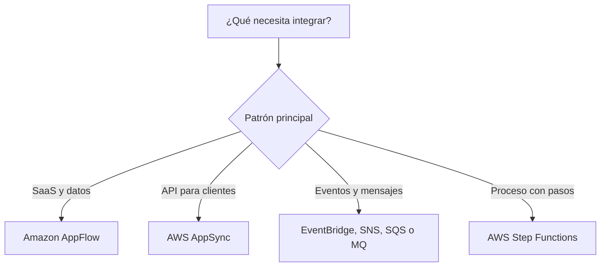
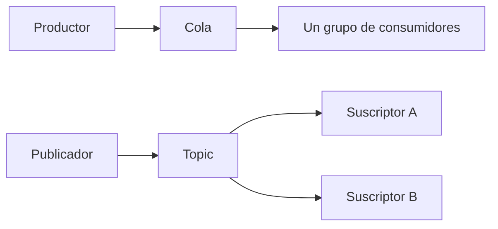
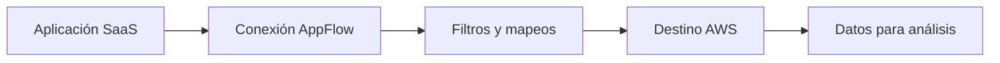
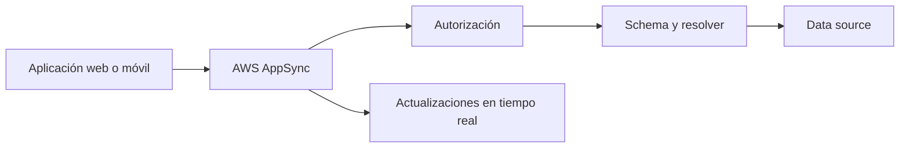
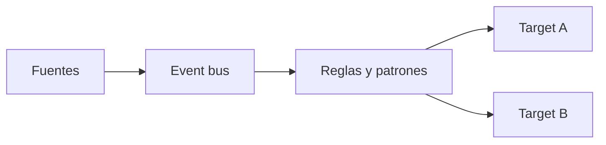
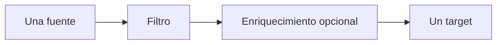
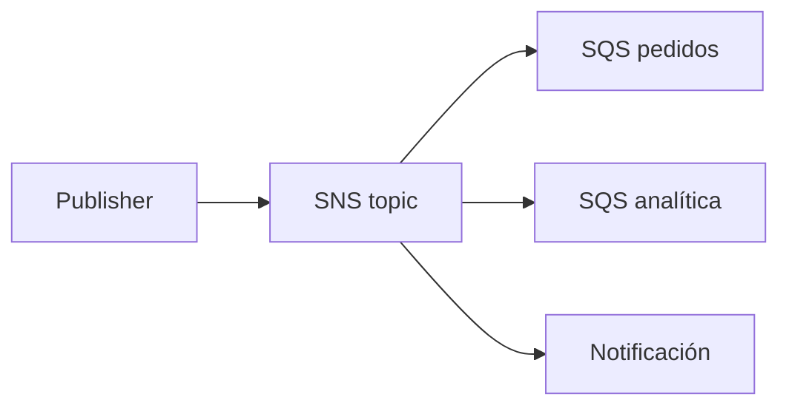
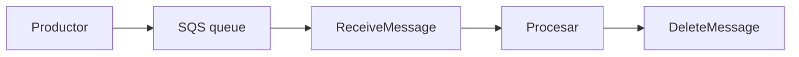
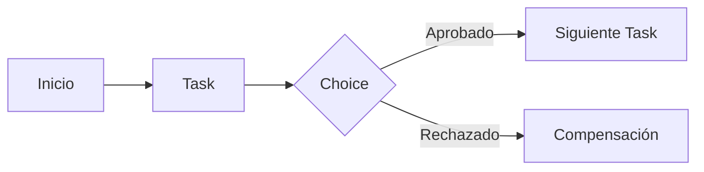

# Servicios de integración de aplicaciones en AWS para el examen SAA-C03

## 1. Alcance necesario para el examen

La guía oficial vigente del SAA-C03 incluye los siguientes servicios en la categoría Application Integration:

- Amazon AppFlow
- AWS AppSync
- Amazon EventBridge
- Amazon MQ
- Amazon SNS
- Amazon SQS
- AWS Step Functions

El examen evalúa principalmente la capacidad de:

- Desacoplar productores y consumidores.
- Elegir entre integración síncrona y asíncrona.
- Diferenciar colas, topics, event buses, brokers y workflows.
- Diseñar arquitecturas orientadas a eventos.
- Elegir entre push, pull, fan-out y ruteo basado en contenido.
- Controlar orden, duplicados, reintentos y mensajes fallidos.
- Absorber picos y aplicar backpressure.
- Integrar aplicaciones SaaS con servicios de AWS.
- Migrar aplicaciones que utilizan protocolos de mensajería tradicionales.
- Orquestar procesos distribuidos con estado, decisiones y manejo de errores.
- Aplicar permisos de menor privilegio, cifrado y acceso privado.
- Seleccionar la solución con menor costo y operación que cumpla los requisitos.

> **Alcance de esta guía:** solo se desarrollan los siete servicios anteriores. Otros servicios pueden aparecer como productores, consumidores, data sources o destinos, pero no se estudian como secciones independientes.

---

## 2. Modelos fundamentales de integración

| Necesidad | Modelo | Servicio principal | Uso típico |
|---|---|---|---|
| Transferir datos entre SaaS y AWS | Flujo de datos administrado | Amazon AppFlow | Mover registros de una aplicación SaaS a S3 o un destino compatible |
| Exponer datos y eventos a aplicaciones | API GraphQL y Pub/Sub | AWS AppSync | Backend web o móvil con consultas y actualizaciones en tiempo real |
| Enrutar eventos por contenido | Event bus | Amazon EventBridge | Integración desacoplada entre aplicaciones y servicios |
| Mantener protocolos de broker existentes | Message broker administrado | Amazon MQ | Migrar ActiveMQ o RabbitMQ sin reescribir clientes |
| Publicar un mensaje a varios receptores | Topic Pub/Sub | Amazon SNS | Fan-out, notificaciones y entrega push |
| Conservar trabajo hasta que un consumidor lo procese | Cola | Amazon SQS | Buffer, desacoplamiento y procesamiento asíncrono |
| Coordinar pasos con estado | Orquestación | AWS Step Functions | Workflows, decisiones, reintentos y procesos de larga duración |

### Regla mental inicial

> **Regla de examen:** una cola conserva trabajo, un topic distribuye copias, un event bus enruta por contenido, un broker mantiene protocolos de mensajería y un workflow coordina estados.

---

## 3. Conceptos de arquitectura que se deben dominar

### Integración síncrona frente a asíncrona

| Síncrona | Asíncrona |
|---|---|
| El cliente espera la respuesta | El productor entrega trabajo y continúa |
| Acoplamiento temporal | Productor y consumidor no necesitan estar activos al mismo tiempo |
| Latencia visible al usuario | Latencia absorbida por cola o eventos |
| Una falla downstream puede propagarse | Reintentos y buffering aíslan fallos |
| Adecuada para respuestas inmediatas | Adecuada para procesos desacoplados |

Una solución asíncrona mejora resiliencia, pero requiere:

- Idempotencia.
- Observabilidad.
- Manejo de reintentos.
- Destinos de mensajes fallidos.
- Seguimiento de estado cuando el proceso lo necesita.

### Cola, topic, event bus, broker y workflow

| Componente | Comportamiento | Pregunta que responde |
|---|---|---|
| Cola | Un mensaje se conserva hasta ser procesado | “¿Quién puede ejecutar este trabajo?” |
| Topic | Publica una copia a cada suscripción | “¿Quiénes deben recibir esta notificación?” |
| Event bus | Evalúa reglas y enruta por contenido | “¿Qué consumidores están interesados en este evento?” |
| Broker | Implementa protocolos y semántica de mensajería | “¿Cómo conservo compatibilidad con clientes existentes?” |
| Workflow | Mantiene el estado y orden de varios pasos | “¿Qué debe ocurrir después y cómo manejo errores?” |

### Point-to-point frente a Pub/Sub

- En una cola, varios workers pueden competir por el trabajo; cada mensaje se procesa como una unidad.
- En Pub/Sub, cada suscripción recibe su propia copia.
- Para combinar fan-out y buffering se utiliza frecuentemente un topic SNS con varias colas SQS.

### Orquestación frente a coreografía

| Orquestación | Coreografía |
|---|---|
| Un coordinador conoce los pasos | Cada servicio reacciona a eventos |
| Estado y flujo visibles | Menor acoplamiento central |
| Step Functions | EventBridge o SNS |
| Adecuada para secuencias y compensaciones | Adecuada para reacciones independientes |
| Facilita auditoría del proceso | Puede ser más difícil reconstruir el flujo completo |

No existe una opción universalmente mejor. Un sistema puede orquestar un proceso crítico y publicar eventos para acciones secundarias.

### Evento, comando y mensaje

- **Evento:** describe algo que ya ocurrió, por ejemplo `PedidoCreado`.
- **Comando:** solicita una acción, por ejemplo `ReservarInventario`.
- **Mensaje:** sobre que contiene datos y metadatos; puede representar un evento o comando.
- Los productores de eventos no deberían conocer todos los consumidores.
- Un contrato estable permite evolucionar consumidores sin romper productores.
- Incluir versión del schema facilita cambios compatibles.

### Push frente a pull

| Push | Pull |
|---|---|
| El servicio envía al suscriptor | El consumidor solicita mensajes |
| SNS y EventBridge | SQS |
| Entrega rápida | El consumidor controla el ritmo |
| El endpoint debe absorber la entrega | La cola absorbe picos |
| Reintentos administrados por el emisor | Visibilidad y eliminación administradas por el consumidor |

### Semánticas de entrega

| Semántica | Significado |
|---|---|
| At-most-once | Puede perderse una ejecución, pero no se repite |
| At-least-once | Se intenta no perderla, pero puede repetirse |
| Exactly-once | Se evita repetir dentro de la semántica definida por el servicio |

“Exactly-once” en un componente no garantiza automáticamente exactly-once de extremo a extremo. Una respuesta puede perderse después de aplicar un cambio. Por ello:

- Usar claves de idempotencia.
- Registrar operaciones ya procesadas.
- Hacer que los reintentos produzcan el mismo resultado.
- Diseñar consumidores para posibles duplicados.

### Orden y paralelismo

- El orden global reduce paralelismo.
- FIFO suele mantener orden dentro de un **message group**, no necesariamente entre todos los grupos.
- Varios grupos permiten procesar en paralelo conservando orden por entidad.
- Una única clave o grupo puede convertirse en cuello de botella.
- No se debe elegir FIFO si la aplicación no necesita orden estricto o deduplicación.

### Reintentos y backoff

- Los fallos transitorios deben reintentarse.
- El backoff exponencial evita saturar una dependencia.
- El jitter reduce reintentos simultáneos.
- Los fallos permanentes no deben reintentarse indefinidamente.
- Un límite de intentos y un destino de errores permiten investigar.
- La operación reintentada debe ser idempotente.

### Dead-letter queue

Una DLQ recibe mensajes o eventos que no pudieron procesarse o entregarse después de la política configurada.

Una DLQ:

- No corrige automáticamente la causa.
- Debe monitorizarse.
- Necesita retención suficiente.
- Requiere un proceso de análisis y redrive.
- Debe proteger datos sensibles igual que la fuente.

> **Trampa de examen:** crear una DLQ sin alarmas ni proceso de redrive únicamente oculta el fallo.

### Backpressure y desacoplamiento

Cuando el productor es más rápido que el consumidor:

1. La cola acumula mensajes.
2. Los consumidores escalan según el backlog.
3. El productor continúa mientras no se excedan cuotas y retención.
4. La antigüedad de mensajes indica si la capacidad es insuficiente.

Una cola no elimina el problema de capacidad; permite absorberlo y administrarlo.

---

## 4. Amazon AppFlow

Amazon AppFlow es un servicio administrado de integración que transfiere datos entre aplicaciones SaaS compatibles y servicios de AWS sin tener que desarrollar un pipeline personalizado.

### Componentes

| Componente | Función |
|---|---|
| Connection | Credenciales y configuración para conectarse a una aplicación |
| Flow | Define fuente, destino, trigger y procesamiento |
| Source | Aplicación o servicio que entrega los registros |
| Destination | Aplicación o servicio que recibe los registros |
| Trigger | Determina cuándo se ejecuta el flujo |
| Mapping | Relaciona campos de origen y destino |
| Filter | Selecciona los registros que se transfieren |

### Flujo conceptual

### Tipos de trigger

| Trigger | Comportamiento | Uso típico |
|---|---|---|
| On demand | Se inicia manualmente o mediante API | Carga puntual |
| Scheduled | Se ejecuta según una programación | Sincronización periódica |
| Event-triggered | Responde a cambios de una fuente compatible | Transferencia cercana al evento |

La disponibilidad de triggers y capacidades incrementales depende del conector.

### Transformación y calidad

Según el conector y destino, un flow puede:

- Seleccionar campos.
- Mapear nombres y tipos.
- Filtrar registros.
- Aplicar transformaciones básicas.
- Validar valores.
- Transferir todos los registros o cambios incrementales compatibles.
- Agregar metadatos del flujo.
- Catalogar datos entregados en S3 mediante AWS Glue Data Catalog.

AppFlow no reemplaza un motor de ETL complejo cuando se necesitan joins extensos, lógica distribuida o procesamiento personalizado.

### Seguridad

- Cifra datos en tránsito y en reposo.
- Puede utilizar una clave de KMS administrada por el cliente.
- Las conexiones almacenan de forma segura los datos de autenticación.
- IAM controla quién crea, ejecuta o administra flows.
- AWS PrivateLink permite transferencia privada para conectores compatibles.
- La opción privada no está disponible automáticamente para todos los conectores.

### Casos de uso

- Transferir datos de CRM a un data lake.
- Llevar datos SaaS a un warehouse.
- Exportar resultados procesados hacia una aplicación empresarial.
- Sincronizar información periódicamente sin mantener código.
- Consolidar datos de negocio para analítica.

### Cuándo elegir Amazon AppFlow

- Existe un conector administrado compatible.
- La integración es principalmente transferencia de registros.
- Se necesita reducir código y operación.
- Se requieren filtros, mapeos o transformaciones simples.
- Se desea acceso privado mediante PrivateLink para una fuente compatible.

### Cuándo no elegirlo

- Enrutar eventos entre microservicios.
- Mantener una cola de trabajo.
- Orquestar varios pasos con decisiones.
- Implementar una API para clientes.
- Ejecutar ETL distribuido complejo.

### Trampas del examen

- AppFlow mueve datos; no es un event bus.
- Un trigger por evento depende de que la aplicación SaaS lo admita.
- PrivateLink depende del conector.
- El flujo necesita permisos tanto para la fuente como para el destino.
- AppFlow puede catalogar datos entregados, pero no reemplaza al motor que los consulta.

---

## 5. AWS AppSync

AWS AppSync conecta aplicaciones y servicios con datos y eventos mediante APIs GraphQL y Pub/Sub serverless, seguras y escalables.

### GraphQL

Una API GraphQL define un schema tipado y normalmente expone:

| Operación | Función |
|---|---|
| Query | Leer datos |
| Mutation | Crear, modificar o eliminar datos |
| Subscription | Recibir actualizaciones en tiempo real |

El cliente solicita únicamente los campos que necesita. AppSync resuelve esos campos desde uno o varios data sources.

### Componentes

| Componente | Función |
|---|---|
| Schema | Define tipos y operaciones |
| Resolver | Conecta un campo con lógica o un data source |
| Data source | Backend que contiene o procesa datos |
| Function | Paso reutilizable dentro de un pipeline resolver |
| Subscription | Canal GraphQL de actualizaciones |
| Event API | Pub/Sub por canales y namespaces |

### Arquitectura conceptual

### Resolvers

- Un **unit resolver** ejecuta una operación contra un data source.
- Un **pipeline resolver** ejecuta varias funciones en secuencia.
- Los resolvers pueden escribirse con el runtime JavaScript de AppSync.
- También existe el lenguaje de plantillas VTL en implementaciones compatibles.
- Un resolver directo evita una función adicional cuando la integración nativa es suficiente.

### Data sources que se deben reconocer

- Tablas de Amazon DynamoDB.
- Funciones AWS Lambda.
- Dominios de Amazon OpenSearch Service.
- Bases compatibles mediante integración administrada.
- Endpoints HTTP.
- Data source `NONE` para procesamiento local y Pub/Sub.

> **Regla de examen:** utilizar un resolver directo cuando la operación es simple; utilizar Lambda cuando se necesita lógica personalizada que el resolver no debe o no puede implementar.

### Tiempo real

#### GraphQL subscriptions

- Mantienen conexiones WebSocket administradas.
- Normalmente se asocian con mutations.
- Una mutation exitosa puede publicar datos a los clientes suscritos.
- Los clientes pueden recibir actualizaciones sin polling constante.
- Los argumentos y mecanismos de autorización limitan qué recibe cada cliente.

#### AppSync Events

- Proporciona Pub/Sub serverless.
- Organiza eventos mediante namespaces y channels.
- Es apropiado para eventos en tiempo real hacia aplicaciones.
- No requiere modelar todas las interacciones como operaciones GraphQL.

### Autorización

AppSync admite:

- API key.
- AWS IAM.
- Amazon Cognito User Pools.
- OpenID Connect.
- AWS Lambda authorizer.

Se puede configurar un modo principal y modos adicionales. La autorización por campo permite proteger partes del schema.

### Otras capacidades

- Caching administrado.
- Private APIs accesibles desde VPC.
- Merged APIs para combinar schemas de varios equipos.
- Logs y métricas.
- Integración con AWS WAF para APIs compatibles.
- Batching y optimizaciones en resolvers.

### Cuándo elegir AWS AppSync

- API GraphQL administrada.
- Aplicaciones web o móviles que necesitan datos de varias fuentes.
- Actualizaciones en tiempo real mediante subscriptions.
- Pub/Sub orientado a clientes.
- Schema tipado y selección flexible de campos.
- Backend serverless con mínima administración.

### Cuándo no elegirlo

- Transferir registros de una aplicación SaaS a S3.
- Enrutar eventos generales entre decenas de servicios.
- Mantener trabajo duradero en una cola.
- Migrar clientes JMS, AMQP o RabbitMQ.
- Coordinar un workflow de larga duración.

### Trampas del examen

- AppSync es principalmente GraphQL y Pub/Sub; no es un API REST.
- Una subscription GraphQL está normalmente vinculada a una mutation.
- El resolver accede al data source; el schema por sí solo no obtiene datos.
- API key no sustituye un mecanismo de identidad fuerte para datos sensibles.
- AppSync conecta clientes con datos y eventos; EventBridge integra aplicaciones mediante eventos.

---

## 6. Amazon EventBridge

Amazon EventBridge es un servicio serverless para crear aplicaciones orientadas a eventos. Recibe eventos, evalúa reglas y los entrega a targets compatibles.

### Event bus

Un event bus recibe eventos de varias fuentes y permite que varias reglas los enruten hacia diferentes targets.

| Tipo de bus | Uso |
|---|---|
| Default event bus | Eventos de servicios de AWS y aplicaciones |
| Custom event bus | Eventos propios de una aplicación o dominio |
| Partner event bus | Eventos de proveedores SaaS integrados |

### Flujo de eventos

### Eventos

Un evento contiene campos como:

- `source`
- `detail-type`
- `detail`
- `account`
- `region`
- `time`
- `resources`

La aplicación debe colocar los datos específicos dentro de `detail` y mantener un contrato versionado.

### Rules y event patterns

- Una rule evalúa un event pattern.
- El patrón puede filtrar por source, tipo, recursos y contenido de `detail`.
- Una rule puede entregar a varios targets.
- Input transformation modifica la forma enviada al target.
- La transformación no reemplaza procesamiento de negocio complejo.

### Targets

EventBridge puede invocar o entregar eventos a múltiples servicios compatibles, por ejemplo:

- Funciones.
- Colas y topics.
- State machines.
- Event buses de otras cuentas.
- APIs HTTPS mediante API Destinations.
- Tareas y jobs administrados compatibles.

El target necesita una política de recurso o un rol que permita la entrega.

### EventBridge Pipes

Pipes implementa una integración point-to-point:

Características:

- Una fuente por pipe.
- Un target por pipe.
- Filtrado antes de invocar el enriquecimiento.
- Transformación de entrada.
- Enriquecimiento mediante un servicio compatible.
- Menos código de integración.

> **Regla de examen:** event bus para many-to-many; Pipe para point-to-point.

### EventBridge Scheduler

EventBridge Scheduler:

- Crea tareas one-time.
- Admite expresiones `rate` y `cron`.
- Admite zonas horarias.
- Puede utilizar flexible time windows.
- Configura reintentos y una DLQ.
- Escala a una gran cantidad de schedules.

Las scheduled rules del event bus son una capacidad heredada. Para nuevos requisitos de programación, AWS recomienda EventBridge Scheduler.

### Archive y replay

- Un archive conserva eventos que coinciden con un patrón.
- Se configura un período de retención.
- Replay vuelve a enviar eventos al **event bus de origen**.
- Se puede elegir un intervalo de tiempo y reglas de destino.
- Replay no elimina los eventos del archive.
- Es útil para recuperación, pruebas controladas y nuevos consumidores.

Archive no convierte EventBridge en una cola de trabajo consumida mediante polling.

### Schema Registry

- Descubre y almacena schemas de eventos.
- Facilita generación de bindings de código.
- Ayuda a mantener contratos entre productores y consumidores.
- No valida automáticamente toda la lógica de compatibilidad de negocio.

### Integración entre cuentas y regiones

- Las resource policies permiten recibir eventos entre cuentas.
- Una rule puede enviar a otro event bus autorizado.
- Los global endpoints enrutan eventos personalizados hacia una región secundaria según un health check.
- La aplicación secundaria debe tener reglas, targets, permisos y capacidad equivalentes.
- La conmutación de eventos no replica por sí sola el estado de las aplicaciones.

### Reintentos y DLQ

- Los targets configuran política de reintentos.
- Para errores recuperables, EventBridge usa backoff y jitter.
- La configuración predeterminada de rules reintenta hasta 24 horas y 185 intentos.
- Algunos errores no recuperables se envían directamente a la DLQ si está configurada.
- La DLQ de una rule de EventBridge debe ser una cola SQS Standard.
- Los consumidores deben ser idempotentes.

### Cuándo elegir EventBridge

- Integrar aplicaciones mediante eventos.
- Enrutar por contenido.
- Recibir eventos nativos de servicios AWS.
- Integrar eventos SaaS de partners.
- Implementar many-to-many.
- Crear schedules administrados.
- Conectar una fuente y un target mediante Pipes.
- Archivar y reproducir eventos.

### Cuándo no elegirlo

- Se necesita una cola consumida a ritmo propio.
- Se requiere orden estricto global.
- Se necesita compatibilidad con protocolos de broker tradicionales.
- Se necesita un workflow con estado y decisiones.
- Se pretende mover datasets completos entre aplicaciones SaaS.

### Trampas del examen

- EventBridge enruta; SQS conserva trabajo.
- EventBridge no garantiza orden general de eventos.
- Archive replay solo vuelve al bus de origen.
- Una DLQ conserva entregas fallidas, pero debe monitorizarse.
- Pipes no es many-to-many.
- Scheduler y las scheduled rules no son la misma capacidad.

---

## 7. Amazon MQ

Amazon MQ es un servicio administrado de message brokers para Apache ActiveMQ Classic y RabbitMQ. Reduce la operación de brokers y facilita migrar aplicaciones existentes sin reescribir sus protocolos de mensajería.

### Cuándo aparece en una pregunta

Palabras clave frecuentes:

- ActiveMQ.
- RabbitMQ.
- JMS.
- AMQP.
- STOMP.
- MQTT.
- OpenWire.
- Aplicación heredada.
- Migración con mínimos cambios.

La compatibilidad exacta de protocolos depende del motor seleccionado.

### Responsabilidad compartida

AWS administra:

- Aprovisionamiento de brokers.
- Reemplazo de infraestructura.
- Mantenimiento del servicio.
- Integración con métricas.
- Opciones de almacenamiento y alta disponibilidad.

El cliente administra:

- Usuarios del broker.
- Autorización de aplicaciones.
- Queues, exchanges, topics y bindings según el motor.
- Configuración compatible del broker.
- Productores y consumidores.
- Reintentos, DLQ y semántica de negocio.
- Capacidad y conectividad de los clientes.

### ActiveMQ Classic

Opciones principales:

| Opción | Características |
|---|---|
| Single instance | Un broker en una AZ; menor costo, menor disponibilidad |
| Active/standby | Dos brokers en AZ diferentes; uno activo y otro en espera |

En active/standby:

- Los clientes se conectan mediante endpoints de failover.
- Amazon EFS proporciona almacenamiento compartido Multi-AZ.
- El standby toma el control ante un fallo.
- La reconexión depende de la configuración correcta del cliente.

ActiveMQ también puede utilizar redes de brokers para determinados patrones de escala y disponibilidad.

### RabbitMQ

Opciones principales:

| Opción | Características |
|---|---|
| Single instance | Un nodo en una AZ |
| Cluster deployment | Tres nodos distribuidos entre varias AZ y un endpoint administrado |

El diseño de queues, exchanges, bindings y estrategias de replicación sigue las semánticas de RabbitMQ.

### Almacenamiento y persistencia

- Mensajes persistentes sobreviven mejor a reinicios o failover.
- Mensajes no persistentes pueden ofrecer mayor rendimiento, pero aceptan pérdida.
- El tipo de almacenamiento y opciones disponibles dependen del motor y despliegue.
- La durabilidad end-to-end también depende de acknowledgements y configuración del productor.

### Red y seguridad

- Los brokers se despliegan dentro de una VPC.
- Security groups controlan acceso a puertos.
- TLS protege conexiones.
- Los usuarios y permisos del broker controlan destinos de mensajería.
- Secrets y credenciales deben rotarse.
- No se debe exponer públicamente un broker si no existe una necesidad justificada.

### Cuándo elegir Amazon MQ

- Migrar ActiveMQ o RabbitMQ.
- Mantener protocolos estándar existentes.
- Evitar cambios extensos en clientes heredados.
- Necesitar semántica específica de broker.
- Aplicaciones híbridas que ya utilizan estas tecnologías.

### Cuándo no elegirlo

- Aplicación cloud-native sin dependencia de protocolos existentes.
- Cola con escalado serverless y mínima operación.
- Fan-out simple administrado.
- Ruteo de eventos de servicios AWS.
- Workflow con estado.

### Amazon MQ frente a servicios nativos

| Amazon MQ | Amazon SQS y SNS |
|---|---|
| Broker aprovisionado | Servicios serverless |
| Protocolos tradicionales | APIs de AWS |
| Mayor compatibilidad | Menor operación |
| Capacidad por instancia o clúster | Escalado administrado |
| Adecuado para migración | Adecuado para aplicaciones cloud-native |

### Trampas del examen

- Amazon MQ no es serverless.
- Elegirlo por compatibilidad, no solo porque la pregunta diga “mensajes”.
- Active/standby no significa dos brokers procesando simultáneamente la misma carga.
- El despliegue HA de ActiveMQ y el de RabbitMQ son diferentes.
- AWS administra infraestructura; el cliente todavía diseña queues, permisos y consumidores.

---

## 8. Amazon SNS

Amazon Simple Notification Service es un servicio administrado de mensajería Pub/Sub. Los publishers envían mensajes a un topic y SNS entrega una copia a cada suscripción compatible.

### Arquitectura fan-out

### Conceptos

| Concepto | Función |
|---|---|
| Topic | Punto lógico de publicación |
| Publisher | Envía mensajes al topic |
| Subscription | Asociación entre topic y endpoint |
| Subscriber | Receptor del mensaje |
| Filter policy | Selecciona mensajes para una suscripción |
| Delivery policy | Controla reintentos en endpoints compatibles |

### Tipos de endpoint

SNS puede entregar a destinos como:

- Colas SQS.
- Funciones.
- Endpoints HTTP/S.
- Correo electrónico.
- SMS.
- Mobile push.
- Streams de entrega compatibles.

No todos los tipos de endpoint ofrecen las mismas garantías, throughput o políticas de reintento.

### Standard topics

- Alto throughput.
- Entrega at-least-once.
- Orden best-effort.
- Puede entregar duplicados.
- Admite una gama amplia de protocolos de suscripción.
- Adecuado cuando importa más el fan-out que el orden estricto.

### FIFO topics

- Orden estricto dentro de cada message group.
- Deduplicación.
- Requiere `MessageGroupId`.
- Utiliza `MessageDeduplicationId` o deduplicación basada en contenido.
- Puede entregar a colas SQS FIFO y Standard compatibles.
- Una cola Standard pierde la garantía FIFO end-to-end.
- Varios message groups aumentan paralelismo.
- El nombre del topic termina en `.fifo`.

> **Regla de examen:** para conservar orden de extremo a extremo, utilizar SNS FIFO con SQS FIFO y mantener correctamente el message group.

### Message filtering

Cada suscripción puede aplicar su propia filter policy.

El filtro puede evaluar:

- Message attributes.
- Propiedades de un message body JSON.
- Coincidencias exactas.
- Prefijos y sufijos compatibles.
- Rangos numéricos.
- Existencia o ausencia de campos.

Sin filter policy, la suscripción recibe todos los mensajes del topic.

### Fan-out con SNS y SQS

Patrón:

1. El productor publica una sola vez.
2. SNS crea una entrega por suscripción.
3. Cada cola SQS conserva su copia.
4. Cada grupo de consumidores escala de forma independiente.
5. Un consumidor lento no bloquea a los demás.

Este patrón combina:

- Distribución de SNS.
- Buffering de SQS.
- Reintentos independientes.
- Aislamiento de fallos.

### Raw message delivery

- Sin raw delivery, SNS agrega un sobre con metadatos.
- Con raw delivery, el endpoint recibe el cuerpo del mensaje directamente.
- La elección afecta el formato que debe procesar el consumidor.
- Los límites de message attributes pueden variar con esta opción y el endpoint.

### Reintentos y DLQ

- SNS aplica políticas de reintento según el tipo de endpoint.
- Una suscripción puede enviar entregas fallidas a una cola SQS como DLQ.
- La DLQ se asocia a la suscripción, no al topic completo.
- Cada suscripción puede fallar de forma independiente.
- Se deben crear alarmas para mensajes en la DLQ.

### Seguridad

- IAM controla publicación y administración.
- Topic policies permiten acceso entre servicios o cuentas.
- KMS permite cifrado server-side.
- VPC endpoints permiten publicar de forma privada.
- Para SNS→SQS, la queue policy debe autorizar al topic específico.
- Utilizar condiciones `aws:SourceArn` reduce el riesgo de confused deputy.

### Cuándo elegir Amazon SNS

- Publicar a varios consumidores.
- Enviar notificaciones push.
- Implementar fan-out.
- Combinar un topic con varias colas.
- Filtrar mensajes por suscripción.
- Entregar a protocolos diversos.

### Cuándo no elegirlo

- Un único grupo de workers debe competir por trabajo.
- Los consumidores necesitan controlar la lectura mediante polling.
- Se requiere ruteo avanzado de eventos de muchas fuentes.
- Se necesita mantener estado de un proceso.
- Se necesitan protocolos de ActiveMQ o RabbitMQ.

### Trampas del examen

- SNS realiza push; SQS utiliza pull.
- Un topic no reemplaza una cola para absorber un consumidor desconectado indefinidamente.
- La filter policy pertenece a la suscripción.
- Una DLQ de SNS captura fallos de entrega de esa suscripción.
- SNS FIFO no conserva orden si el destino final es Standard.

---

## 9. Amazon SQS

Amazon Simple Queue Service es una cola de mensajes administrada y serverless que desacopla productores de consumidores, conserva trabajo y ayuda a absorber picos.

### Flujo de procesamiento

El consumidor debe eliminar el mensaje después de procesarlo correctamente. Recibirlo no lo elimina.

### Standard frente a FIFO

| Standard queue | FIFO queue |
|---|---|
| Throughput muy alto | Throughput sujeto a cuotas FIFO |
| Entrega at-least-once | Deduplicación y exactly-once processing del servicio |
| Orden best-effort | Orden estricto por message group |
| Puede entregar duplicados | Evita duplicados dentro de la ventana de deduplicación |
| Nombre normal | Nombre termina en `.fifo` |
| Opción predeterminada | Elegir solo si el orden o deduplicación son necesarios |

No se puede convertir una queue Standard existente en FIFO ni una FIFO en Standard.

### Ciclo de vida de un mensaje

1. El productor envía un mensaje.
2. SQS lo replica y conserva.
3. Un consumidor lo recibe.
4. El mensaje queda invisible.
5. El consumidor procesa.
6. El consumidor elimina usando el receipt handle.
7. Si no se elimina, vuelve a ser visible al expirar el timeout.

### Visibility timeout

- Inicia cuando un consumidor recibe el mensaje.
- Durante ese período otros consumidores no lo ven.
- El valor predeterminado es 30 segundos.
- El máximo es 12 horas desde la recepción.
- Puede extenderse con `ChangeMessageVisibility`.
- Debe ser mayor que el tiempo normal de procesamiento.
- Un valor demasiado largo retrasa recuperación ante fallos.
- Un valor demasiado corto produce procesamiento duplicado.

> **Trampa de examen:** visibility timeout no es retención y no elimina el mensaje.

### Long polling

- `WaitTimeSeconds` mayor que cero activa long polling.
- Puede esperar hasta 20 segundos.
- Reduce respuestas vacías.
- Reduce llamadas API y costo.
- Generalmente es preferible a short polling.
- El timeout HTTP del cliente debe superar el tiempo de espera configurado.

### Retención, tamaño y delay

- Retención configurable desde 1 minuto hasta 14 días.
- La retención predeterminada es 4 días.
- El tamaño máximo vigente por mensaje es 1 MiB.
- Materiales antiguos pueden mencionar el límite histórico de 256 KiB.
- Una delay queue oculta mensajes nuevos temporalmente.
- El delay máximo es 15 minutos.
- Para esperas mayores o calendarios precisos se evalúan Scheduler o Step Functions.

### Delay frente a visibility timeout

| Delivery delay | Visibility timeout |
|---|---|
| Se aplica al enviar | Se aplica después de recibir |
| Oculta un mensaje nuevo | Oculta un mensaje en procesamiento |
| Evita consumo inmediato | Evita procesamiento simultáneo |
| Máximo 15 minutos | Máximo 12 horas desde la recepción |

### FIFO: message groups y deduplicación

- `MessageGroupId` define el ámbito de orden.
- Un mensaje bloquea los siguientes del mismo grupo mientras está in-flight.
- Grupos distintos pueden procesarse en paralelo.
- `MessageDeduplicationId` identifica envíos duplicados.
- La ventana de deduplicación es de 5 minutos.
- La deduplicación basada en contenido calcula un hash del body.
- Los message attributes no forman parte del hash de contenido.

Aunque FIFO reduzca duplicados introducidos en la queue, el consumidor debe continuar siendo idempotente frente a fallos después de aplicar un cambio y antes de eliminar el mensaje.

### Dead-letter queue

Una redrive policy define:

- ARN de la DLQ.
- `maxReceiveCount`.

Cuando el mensaje supera el número de recepciones, SQS lo mueve a la DLQ.

Buenas prácticas:

- Usar una DLQ del mismo tipo que la queue de origen.
- Configurar retención mayor que la fuente.
- Alarmar cuando existan mensajes visibles.
- Analizar la causa antes de redrive.
- Evitar un `maxReceiveCount` demasiado bajo.
- No utilizar DLQ en un flujo FIFO si romper el orden es inaceptable sin una estrategia de compensación.

### Escalado de consumidores

Métricas útiles:

- `ApproximateNumberOfMessagesVisible`.
- `ApproximateNumberOfMessagesNotVisible`.
- `ApproximateAgeOfOldestMessage`.
- Mensajes enviados, recibidos y eliminados.

Escalar solo por cantidad puede ser insuficiente. La antigüedad del mensaje refleja mejor si se está incumpliendo el tiempo de procesamiento esperado.

### Seguridad

- IAM controla llamadas API.
- Queue policies permiten acceso de servicios y otras cuentas.
- SSE-SQS proporciona cifrado administrado.
- SSE-KMS proporciona mayor control mediante KMS.
- Interface VPC endpoints permiten acceso privado.
- Las queue URLs no son secretos; la autorización depende de IAM y policies.

### Cuándo elegir Amazon SQS

- Desacoplar productor y consumidor.
- Absorber picos.
- Crear una work queue.
- Permitir que consumers controlen su ritmo.
- Escalar workers según backlog.
- Reintentar procesamiento.
- Necesitar orden por entidad mediante FIFO.

### Cuándo no elegirlo

- Todos los consumidores necesitan una copia.
- Se requiere notificación push.
- Se necesita ruteo por contenido many-to-many.
- Se necesitan protocolos tradicionales de broker.
- Se necesita coordinar un proceso con varios pasos y estado.

### Trampas del examen

- SQS usa pull.
- Receive no elimina.
- Visibility timeout no es delivery delay.
- Standard puede entregar duplicados y fuera de orden.
- FIFO conserva orden por message group.
- Una DLQ debe monitorizarse y tener redrive.
- SQS no coordina por sí solo una saga o aprobación humana.

---

## 10. AWS Step Functions

AWS Step Functions es un servicio de orquestación serverless que modela procesos distribuidos como state machines. Mantiene el estado, ejecuta pasos, evalúa decisiones y administra errores.

### Amazon States Language

Una state machine se define mediante Amazon States Language —ASL— en JSON.

Estados que se deben reconocer:

| Estado | Función |
|---|---|
| Task | Ejecuta una unidad de trabajo |
| Choice | Selecciona una rama |
| Wait | Pausa sin mantener un servidor |
| Parallel | Ejecuta ramas simultáneas |
| Map | Ejecuta pasos para cada elemento |
| Pass | Transforma o pasa datos |
| Succeed | Termina correctamente |
| Fail | Termina con error |

### Arquitectura conceptual

### Standard frente a Express

| Standard Workflow | Express Workflow |
|---|---|
| Hasta un año | Hasta cinco minutos |
| Exactly-once workflow execution | Asynchronous: at-least-once |
| Historial durable y auditable | Alto volumen de ejecuciones |
| Costo por state transition | Costo por ejecuciones, duración y memoria |
| Adecuado para procesos críticos | Adecuado para eventos de alta tasa |
| Admite `.sync` y callback | No admite `.sync` ni callback |

Synchronous Express utiliza semántica at-most-once. Asynchronous Express utiliza at-least-once. Las tareas deben diseñarse según la semántica del tipo de ejecución.

### Patrones de integración

| Patrón | Comportamiento |
|---|---|
| Request Response | Espera la respuesta de la API y continúa |
| Run a Job `.sync` | Espera que un job finalice |
| Wait for Callback `.waitForTaskToken` | Espera que un proceso externo devuelva un token |

#### Request Response

- Adecuado para llamadas rápidas.
- La respuesta API no siempre significa que el trabajo interno terminó.
- Es el patrón predeterminado.

#### Run a Job

- Step Functions espera la finalización.
- Útil para jobs batch o procesos administrados compatibles.
- Evita implementar polling personalizado.
- Solo está disponible en integraciones y workflows compatibles.

#### Callback con task token

- La state machine entrega un token a un proceso externo.
- El workflow pausa hasta recibir éxito o error.
- Adecuado para aprobaciones humanas o sistemas externos.
- El token debe protegerse como credencial temporal.
- Se debe definir timeout para evitar esperas indefinidas.

### Retry y Catch

`Retry` configura:

- Tipos de error.
- Intervalo inicial.
- Número máximo de intentos.
- Backoff rate.
- Jitter compatible.

`Catch` redirige a otro estado después de un error no recuperado.

Patrón:

1. Reintentar errores transitorios.
2. No reintentar errores de validación.
3. Capturar el fallo.
4. Ejecutar compensación o notificación.
5. Conservar contexto para auditoría.

### Timeout y heartbeat

- `TimeoutSeconds` limita duración de una task.
- Heartbeats detectan workers que dejaron de responder.
- Un timeout debe generar una ruta de error controlada.
- La state machine completa también debe tener límites coherentes.

### Parallel frente a Map

| Parallel | Map |
|---|---|
| Ramas diferentes | Mismos pasos por elemento |
| Número de ramas definido | Número de iteraciones depende de datos |
| Une resultados al finalizar | Produce resultados por elemento |

### Inline Map frente a Distributed Map

| Inline Map | Distributed Map |
|---|---|
| Iteraciones dentro del workflow padre | Crea child workflow executions |
| Concurrencia limitada | Alta concurrencia |
| Dataset dentro de límites del workflow | Puede leer datasets grandes de S3 |
| Historial compartido | Cada child tiene su ejecución |

Distributed Map es apropiado para procesar grandes conjuntos de objetos o filas en paralelo, pero no reemplaza un motor analítico general.

### Datos y estado

- Cada estado recibe input y produce output.
- JSONPath o JSONata permiten seleccionar y transformar datos según la configuración.
- No se deben pasar payloads grandes innecesariamente entre estados.
- Los datos grandes deben guardarse externamente y pasarse por referencia.
- El historial Standard facilita auditoría y depuración.

### Service integrations

Step Functions puede llamar APIs de muchos servicios directamente.

Ventajas:

- Menos funciones de “pegamento”.
- IAM generado o definido según el recurso.
- Reintentos y errores visibles.
- Menor cantidad de código.

Una función sigue siendo útil cuando se necesita lógica de negocio o transformación no disponible en la integración.

### Cuándo elegir Step Functions

- Proceso con varios pasos.
- Decisiones condicionales.
- Reintentos y compensaciones.
- Esperas largas sin mantener cómputo.
- Aprobación humana.
- Coordinación de jobs.
- Procesamiento paralelo o Map.
- Historial auditable.

### Cuándo no elegirlo

- Solo se necesita una cola para absorber picos.
- Todos los consumidores deben reaccionar a un evento.
- Se necesita transferir un dataset SaaS.
- Se requiere un broker compatible con JMS.
- La operación es una única llamada sencilla sin coordinación.

### Trampas del examen

- Step Functions orquesta; EventBridge coreografía.
- Standard y Express tienen duración, costo y semánticas diferentes.
- El tipo Standard o Express no se puede cambiar después de crear la state machine.
- `Wait` no mantiene un servidor ejecutándose.
- `.sync` espera un job; callback espera un task token.
- Retry sin idempotencia puede duplicar efectos.
- Distributed Map procesa elementos en child workflows; no es igual a Parallel.

---

## 11. Seguridad, resiliencia y operaciones

### Identidades separadas

- Publisher que envía a SNS o EventBridge.
- Producer que escribe en SQS.
- Consumer que recibe y elimina mensajes.
- Rol de EventBridge para invocar un target.
- Rol de Step Functions para llamar servicios.
- Rol de AppFlow para acceder a fuente y destino.
- Rol de AppSync para acceder a un data source.
- Usuario o aplicación que se autentica contra Amazon MQ.

Cada identidad debe tener solo las acciones y recursos necesarios.

### Resource policies

Se utilizan para:

- Permitir que SNS publique en una queue SQS.
- Autorizar envíos entre cuentas.
- Permitir que EventBridge entregue a un recurso.
- Controlar quién publica en un topic o event bus.
- Restringir orígenes mediante `aws:SourceArn` y `aws:SourceAccount`.

> **Regla de seguridad:** una policy amplia con principal de servicio debe limitarse al recurso de origen esperado.

### Cifrado

- TLS para datos en tránsito.
- Cifrado server-side en topics, queues y buses compatibles.
- KMS cuando se requiere control de claves.
- El rol del servicio necesita permiso sobre la clave.
- Un fallo KMS puede impedir publicar, recibir o entregar.
- Rotación y políticas deben considerar todos los productores y consumidores.

### Red privada

- Interface VPC endpoints para APIs compatibles.
- Brokers Amazon MQ dentro de VPC y protegidos por security groups.
- AppFlow privado únicamente con conectores compatibles.
- AppSync Private API para clientes internos.
- API Destinations requiere conectividad administrada hacia el endpoint externo.
- Acceso privado no sustituye autenticación y autorización.

### Observabilidad

Monitorizar:

- Errores de publicación y entrega.
- Edad y cantidad de mensajes.
- Mensajes in-flight.
- DLQ.
- Consumer lag o backlog.
- Throttling.
- Fallos y duración de flows.
- Ejecuciones fallidas o timed out.
- State transitions.
- Latencia de targets.
- Conexiones y almacenamiento de brokers.

### Idempotencia

Una clave de idempotencia puede derivarse de:

- ID de evento.
- ID de pedido.
- ID de transacción.
- Número de versión.
- Combinación de entidad y operación.

El registro de deduplicación debe persistir el tiempo suficiente para cubrir reintentos y replay.

### Recuperación

- Alarmar sobre DLQ.
- Conservar datos necesarios para reprocesar.
- Documentar redrive.
- Archivar eventos cuando exista requisito de replay.
- Utilizar callbacks y timeouts para procesos externos.
- Probar failover de brokers y endpoints.
- Replicar estado de negocio; reenviar eventos no reemplaza replicación de datos.

---

## 12. Matriz de decisión para preguntas del examen

| Requisito principal | Servicio | Razón |
|---|---|---|
| Transferir Salesforce u otro SaaS compatible hacia S3 | Amazon AppFlow | Conector y flow administrados |
| API GraphQL serverless | AWS AppSync | Schema, resolvers y data sources |
| Actualizaciones GraphQL en tiempo real | AWS AppSync | Subscriptions administradas |
| Enrutar eventos por contenido | Amazon EventBridge | Event patterns y rules |
| Integración many-to-many | EventBridge event bus | Varias fuentes, reglas y targets |
| Una fuente hacia un target con filtro y enrichment | EventBridge Pipes | Point-to-point administrado |
| Ejecutar una tarea en una fecha futura | EventBridge Scheduler | Schedule one-time administrado |
| Reprocesar eventos históricos | EventBridge archive y replay | Conservación y replay al bus de origen |
| Migrar una aplicación JMS o ActiveMQ | Amazon MQ | Compatibilidad con broker existente |
| RabbitMQ administrado | Amazon MQ | Cluster administrado compatible |
| Enviar una copia a varios consumidores | Amazon SNS | Pub/Sub fan-out |
| Fan-out con buffering independiente | SNS + SQS | Topic con una queue por consumidor |
| Filtrar mensajes por cada suscripción | Amazon SNS | Subscription filter policy |
| Absorber picos de trabajo | Amazon SQS | Buffer duradero |
| Workers compiten por mensajes | Amazon SQS | Queue point-to-point |
| Orden por entidad y deduplicación | SQS FIFO | Message groups y deduplication ID |
| Proceso con decisiones y reintentos | AWS Step Functions | State machine |
| Esperar una aprobación humana | Step Functions Standard | Callback con task token |
| Flujo corto de muy alto volumen | Step Functions Express | Ejecuciones rápidas y de alta tasa |
| Procesar un dataset grande en paralelo | Step Functions Distributed Map | Child workflow executions |

---

## 13. Diferencias que suelen generar errores

### Amazon SNS frente a Amazon SQS

| Amazon SNS | Amazon SQS |
|---|---|
| Topic Pub/Sub | Queue |
| Push | Pull |
| Una copia por suscripción | Un mensaje para un grupo de workers |
| Fan-out | Buffer y backpressure |
| El endpoint recibe | El consumidor controla el ritmo |

### Amazon SNS frente a Amazon EventBridge

| Amazon SNS | Amazon EventBridge |
|---|---|
| Fan-out de mensajes | Ruteo de eventos |
| Topic y subscriptions | Event bus, rules y targets |
| Filtrado por suscripción | Patrones de eventos |
| Protocolos de notificación | Integraciones AWS, SaaS y APIs |
| Modelo simple de publicación | Arquitectura many-to-many |

Elegir SNS para fan-out directo. Elegir EventBridge cuando importan múltiples fuentes, ruteo por contenido, integración de eventos y menor conocimiento entre productores y targets.

### Amazon SQS frente a Amazon EventBridge

| Amazon SQS | Amazon EventBridge |
|---|---|
| Conserva mensajes para polling | Empuja eventos a targets |
| Controla backpressure | Enruta por patrones |
| Workers compiten | Varias rules pueden reaccionar |
| Visibilidad y eliminación | Reintentos de entrega |
| Retención de queue | Archive opcional |

### Standard frente a FIFO

| Standard | FIFO |
|---|---|
| Mayor throughput | Orden y deduplicación |
| At-least-once | Exactly-once processing del servicio |
| Best-effort ordering | Orden estricto por grupo |
| Preferida si no se requiere orden | Requiere IDs y diseño de grupos |

### Amazon MQ frente a SQS y SNS

| Amazon MQ | SQS y SNS |
|---|---|
| ActiveMQ o RabbitMQ | Servicios nativos de AWS |
| Protocolos tradicionales | APIs AWS |
| Broker provisionado | Serverless |
| Migración con pocos cambios | Modernización cloud-native |
| Más control y operación | Menos operación |

### EventBridge Pipes frente a EventBridge Bus

| Pipes | Event bus |
|---|---|
| Point-to-point | Many-to-many |
| Una fuente y un target | Muchas fuentes y rules |
| Filtro y enrichment | Patterns e input transformation |
| Flujo directo | Ruteo de eventos |

### EventBridge frente a Step Functions

| EventBridge | Step Functions |
|---|---|
| Coreografía | Orquestación |
| Eventos independientes | Estado del proceso |
| Rules y targets | States y transitions |
| No conoce la secuencia completa | Coordina el orden |
| Reacciones desacopladas | Decisiones, Retry y Catch |

### Amazon AppFlow frente a EventBridge

| Amazon AppFlow | Amazon EventBridge |
|---|---|
| Transferencia de datos | Ruteo de eventos |
| Registros SaaS | Eventos discretos |
| Flows programados o por evento | Event buses y rules |
| Mapeos y filtros de campos | Event patterns |
| Analítica e integración de datos | Arquitecturas event-driven |

### AWS AppSync frente a EventBridge

| AWS AppSync | Amazon EventBridge |
|---|---|
| API orientada a clientes | Integración service-to-service |
| GraphQL y Pub/Sub | Event bus |
| Queries, mutations y subscriptions | Events, rules y targets |
| Schema de datos | Schema de eventos |
| Web y móvil | Aplicaciones y servicios |

### Step Functions Standard frente a Express

| Standard | Express |
|---|---|
| Hasta un año | Hasta cinco minutos |
| Exactly-once workflow execution | Async at-least-once; sync at-most-once |
| Historial durable | Logs para observabilidad |
| Costo por transición | Costo por ejecución y duración |
| Aprobaciones y procesos críticos | Alto volumen y procesos cortos |

---

## 14. Optimización de costos

### Amazon AppFlow

- Transferir solo campos y registros necesarios.
- Utilizar filtros en la fuente cuando sea posible.
- Ajustar la frecuencia del schedule.
- Evitar flows duplicados.
- Comprimir y organizar datos en el destino.
- Revisar cargos del sistema SaaS y transferencia.

### AWS AppSync

- Utilizar resolvers directos.
- Evitar queries innecesariamente profundas.
- Aplicar caching solo a resultados reutilizables.
- Ajustar TTL.
- Limitar logs detallados.
- Evitar subscriptions innecesarias.
- Seleccionar el data source apropiado.

### Amazon EventBridge

- Filtrar eventos antes del target.
- Utilizar Pipes para evitar código de integración.
- Evitar rules duplicadas.
- Configurar retención de archives según necesidad.
- Usar Scheduler para schedules a escala.
- Controlar reintentos que invocan targets costosos.

### Amazon MQ

- Dimensionar brokers según conexiones, throughput y almacenamiento.
- Utilizar single instance solo cuando la pérdida de disponibilidad sea aceptable.
- Eliminar brokers de prueba inactivos.
- Ajustar persistencia de mensajes al requisito.
- Monitorizar uso antes de escalar instancias.
- Considerar SQS y SNS para nuevas aplicaciones cloud-native.

### Amazon SNS

- Filtrar en la suscripción para evitar invocaciones innecesarias.
- Publicar por lotes cuando sea compatible.
- Evitar suscripciones duplicadas.
- Elegir Standard si no se necesita FIFO.
- Controlar SMS y endpoints con costos adicionales.
- Usar SQS para proteger consumidores lentos.

### Amazon SQS

- Utilizar long polling.
- Procesar mensajes en batch.
- Eliminar mensajes correctamente.
- Ajustar visibility timeout.
- Configurar retención necesaria, no máxima por defecto.
- Elegir Standard si no se necesita FIFO.
- Escalar consumers según backlog y antigüedad.

### AWS Step Functions

- Elegir Express para ejecuciones cortas y de gran volumen compatibles.
- Evitar states Pass innecesarios.
- Utilizar integraciones directas en lugar de funciones de pegamento.
- Evitar polling mediante `.sync` cuando esté disponible.
- Ajustar Retry para no ejecutar costosamente errores permanentes.
- No pasar payloads grandes entre states.

---

## 15. Estrategia para resolver preguntas SAA-C03

1. Determinar si la integración debe ser síncrona o asíncrona.
2. Identificar si se mueve un dataset o se envían mensajes.
3. Determinar si un consumidor o varios necesitan cada mensaje.
4. Elegir pull o push.
5. Identificar si se requiere buffering y backpressure.
6. Evaluar orden, deduplicación y paralelismo.
7. Identificar compatibilidad con protocolos heredados.
8. Determinar si existe una secuencia con estado.
9. Diseñar reintentos, idempotencia y DLQ.
10. Aplicar permisos y cifrado.
11. Elegir Standard, FIFO, Standard Workflow o Express según semántica.
12. Seleccionar la solución con menor operación que cumpla todos los requisitos.

### Palabras clave

- **Transferencia SaaS sin código:** Amazon AppFlow.
- **Salesforce hacia S3:** Amazon AppFlow.
- **PrivateLink con SaaS compatible:** Amazon AppFlow.
- **API GraphQL:** AWS AppSync.
- **Query, mutation y subscription:** AWS AppSync.
- **Actualización en tiempo real para web o móvil:** AWS AppSync.
- **Resolver:** AWS AppSync.
- **Ruteo por contenido:** Amazon EventBridge.
- **Event bus:** Amazon EventBridge.
- **Eventos de servicios AWS:** Amazon EventBridge.
- **Point-to-point con enrichment:** EventBridge Pipes.
- **Tarea one-time o cron administrado:** EventBridge Scheduler.
- **Archive y replay:** Amazon EventBridge.
- **ActiveMQ o RabbitMQ:** Amazon MQ.
- **JMS, AMQP o protocolo heredado:** Amazon MQ.
- **Fan-out:** Amazon SNS.
- **Topic y subscriptions:** Amazon SNS.
- **Push notification:** Amazon SNS.
- **Filter policy:** Amazon SNS.
- **Buffer o backlog:** Amazon SQS.
- **Pull:** Amazon SQS.
- **Visibility timeout:** Amazon SQS.
- **Long polling:** Amazon SQS.
- **Orden por entidad:** SQS FIFO.
- **MessageGroupId:** SNS FIFO o SQS FIFO.
- **Mensaje fallido:** DLQ.
- **Proceso con pasos:** AWS Step Functions.
- **Choice, Parallel o Map:** AWS Step Functions.
- **Aprobación humana:** callback con task token.
- **Job administrado que debe terminar:** `.sync`.
- **Proceso auditable de larga duración:** Standard Workflow.
- **Proceso corto de alto volumen:** Express Workflow.
- **Dataset grande en paralelo:** Distributed Map.

---

## 16. Lista de comprobación final

- [ ] Diferenciar integración síncrona y asíncrona.
- [ ] Diferenciar queue, topic, event bus, broker y workflow.
- [ ] Diferenciar point-to-point y Pub/Sub.
- [ ] Comprender orquestación y coreografía.
- [ ] Diferenciar evento y comando.
- [ ] Diferenciar push y pull.
- [ ] Comprender at-most-once, at-least-once y exactly-once.
- [ ] Diseñar consumers idempotentes.
- [ ] Comprender retry, backoff y jitter.
- [ ] Diseñar una DLQ con alarmas y redrive.
- [ ] Reconocer conexiones, flows, triggers y mappings de AppFlow.
- [ ] Diferenciar on-demand, scheduled y event-triggered flows.
- [ ] Comprender restricciones de PrivateLink por conector.
- [ ] Reconocer schema, query, mutation y subscription de AppSync.
- [ ] Diferenciar unit y pipeline resolver.
- [ ] Reconocer data sources y modos de autorización de AppSync.
- [ ] Diferenciar GraphQL subscriptions y AppSync Events.
- [ ] Reconocer default, custom y partner event buses.
- [ ] Comprender event patterns, rules y targets.
- [ ] Diferenciar EventBridge Pipes y event bus.
- [ ] Elegir EventBridge Scheduler para nuevos schedules.
- [ ] Comprender archive y replay.
- [ ] Diseñar reintentos y DLQ de EventBridge.
- [ ] Reconocer global endpoints y sus límites.
- [ ] Diferenciar ActiveMQ y RabbitMQ en Amazon MQ.
- [ ] Reconocer single instance y alta disponibilidad.
- [ ] Elegir Amazon MQ para compatibilidad heredada.
- [ ] Comprender publishers, topics, subscriptions y subscribers de SNS.
- [ ] Diferenciar topics Standard y FIFO.
- [ ] Diseñar fan-out SNS→SQS.
- [ ] Aplicar filter policies.
- [ ] Comprender raw message delivery.
- [ ] Diferenciar queues Standard y FIFO.
- [ ] Recordar que Receive no elimina un mensaje.
- [ ] Comprender visibility timeout.
- [ ] Diferenciar delay y visibility.
- [ ] Utilizar long polling.
- [ ] Recordar retención, delay y tamaño de mensaje vigentes.
- [ ] Diseñar message groups para paralelismo FIFO.
- [ ] Comprender deduplication ID y su ventana.
- [ ] Configurar una redrive policy.
- [ ] Escalar consumers por backlog y antigüedad.
- [ ] Reconocer los estados principales de Step Functions.
- [ ] Diferenciar Standard y Express.
- [ ] Comprender Request Response, `.sync` y task token.
- [ ] Configurar Retry y Catch.
- [ ] Diferenciar Parallel, Inline Map y Distributed Map.
- [ ] Utilizar integraciones directas cuando corresponda.
- [ ] Aplicar IAM, resource policies, KMS y acceso privado.
- [ ] Seleccionar el servicio correcto a partir de palabras clave.

---

## Referencias oficiales

- [Guía oficial del examen AWS Certified Solutions Architect – Associate SAA-C03](https://docs.aws.amazon.com/pdfs/aws-certification/latest/solutions-architect-associate-03/solutions-architect-associate-03.pdf)
- [Servicios incluidos en el alcance del SAA-C03](https://docs.aws.amazon.com/aws-certification/latest/solutions-architect-associate-03/saa-03-in-scope-services.html)
- [Introducción a Amazon AppFlow](https://docs.aws.amazon.com/appflow/latest/userguide/what-is-appflow.html)
- [Flows de Amazon AppFlow](https://docs.aws.amazon.com/appflow/latest/userguide/flows.html)
- [Triggers de Amazon AppFlow](https://docs.aws.amazon.com/appflow/latest/userguide/flow-triggers.html)
- [Flows privados de Amazon AppFlow](https://docs.aws.amazon.com/appflow/latest/userguide/private-flows.html)
- [Introducción a AWS AppSync](https://docs.aws.amazon.com/appsync/latest/devguide/what-is-appsync.html)
- [Data sources de AWS AppSync](https://docs.aws.amazon.com/appsync/latest/devguide/data-source-components.html)
- [Autorización de AWS AppSync](https://docs.aws.amazon.com/appsync/latest/devguide/security-authz.html)
- [Tiempo real con subscriptions de AWS AppSync](https://docs.aws.amazon.com/appsync/latest/devguide/aws-appsync-real-time-data.html)
- [Introducción a Amazon EventBridge](https://docs.aws.amazon.com/eventbridge/latest/userguide/eb-what-is.html)
- [Event buses de Amazon EventBridge](https://docs.aws.amazon.com/eventbridge/latest/userguide/eb-event-bus.html)
- [Amazon EventBridge Pipes](https://docs.aws.amazon.com/eventbridge/latest/userguide/eb-pipes.html)
- [Amazon EventBridge Scheduler](https://docs.aws.amazon.com/eventbridge/latest/userguide/using-eventbridge-scheduler.html)
- [Archive y replay de Amazon EventBridge](https://docs.aws.amazon.com/eventbridge/latest/userguide/eb-archive.html)
- [DLQ de Amazon EventBridge](https://docs.aws.amazon.com/eventbridge/latest/userguide/eb-rule-dlq.html)
- [Introducción a Amazon MQ](https://docs.aws.amazon.com/amazon-mq/latest/developer-guide/welcome.html)
- [Arquitectura de Amazon MQ para ActiveMQ](https://docs.aws.amazon.com/amazon-mq/latest/developer-guide/amazon-mq-broker-architecture.html)
- [Arquitectura de Amazon MQ para RabbitMQ](https://docs.aws.amazon.com/amazon-mq/latest/developer-guide/rabbitmq-broker-architecture.html)
- [Introducción a Amazon SNS](https://docs.aws.amazon.com/sns/latest/dg/welcome.html)
- [Características de Amazon SNS](https://docs.aws.amazon.com/sns/latest/dg/welcome-features.html)
- [Filtrado de mensajes de Amazon SNS](https://docs.aws.amazon.com/sns/latest/dg/sns-message-filtering.html)
- [DLQ de Amazon SNS](https://docs.aws.amazon.com/sns/latest/dg/sns-dead-letter-queues.html)
- [Introducción a Amazon SQS](https://docs.aws.amazon.com/AWSSimpleQueueService/latest/SQSDeveloperGuide/welcome.html)
- [Tipos de queue de Amazon SQS](https://docs.aws.amazon.com/AWSSimpleQueueService/latest/SQSDeveloperGuide/sqs-queue-types.html)
- [Parámetros y límites configurables de Amazon SQS](https://docs.aws.amazon.com/AWSSimpleQueueService/latest/SQSDeveloperGuide/sqs-configure-queue-parameters.html)
- [Visibility timeout de Amazon SQS](https://docs.aws.amazon.com/AWSSimpleQueueService/latest/SQSDeveloperGuide/sqs-visibility-timeout.html)
- [Long polling de Amazon SQS](https://docs.aws.amazon.com/AWSSimpleQueueService/latest/SQSDeveloperGuide/sqs-short-and-long-polling.html)
- [DLQ de Amazon SQS](https://docs.aws.amazon.com/AWSSimpleQueueService/latest/SQSDeveloperGuide/sqs-dead-letter-queues.html)
- [Introducción a AWS Step Functions](https://docs.aws.amazon.com/step-functions/latest/dg/welcome.html)
- [Elección del tipo de workflow](https://docs.aws.amazon.com/step-functions/latest/dg/choosing-workflow-type.html)
- [Patrones de integración de Step Functions](https://docs.aws.amazon.com/step-functions/latest/dg/getting-started.html)
- [Manejo de errores en Step Functions](https://docs.aws.amazon.com/step-functions/latest/dg/concepts-error-handling.html)
- [Map state de Step Functions](https://docs.aws.amazon.com/step-functions/latest/dg/state-map.html)
