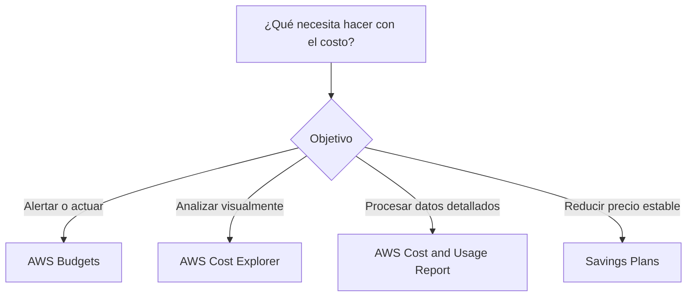
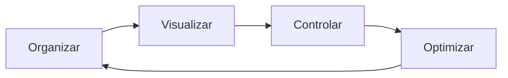
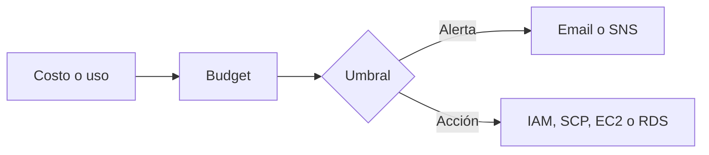
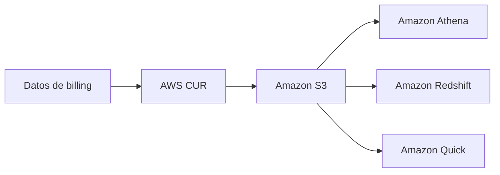
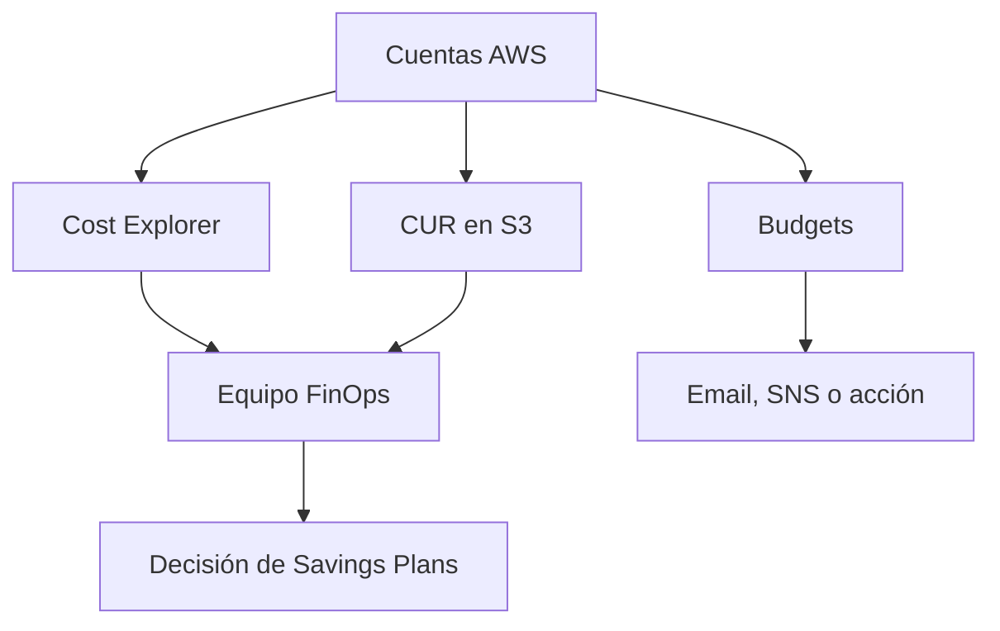

# Servicios de administración de costos en AWS para el examen SAA-C03

> Guía de estudio enfocada en visibilidad, análisis, presupuestos, reportes detallados, compromisos de consumo y decisiones de arquitectura rentables.
>
> Actualizado: julio de 2026.

## 1. Alcance necesario para el examen

La guía oficial vigente del SAA-C03 incluye los siguientes servicios en la categoría AWS Cost Management:

- AWS Budgets
- AWS Cost and Usage Report
- AWS Cost Explorer
- Savings Plans

El examen evalúa principalmente la capacidad de:

- Configurar alertas sobre costos o uso reales y pronosticados.
- Elegir la herramienta adecuada para visualizar tendencias y analizar incrementos.
- Obtener el conjunto más detallado de datos de facturación y uso.
- Diferenciar análisis interactivo y procesamiento personalizado de datos.
- Seleccionar un compromiso de consumo para cargas estables.
- Diferenciar flexibilidad, descuento y capacidad reservada.
- Interpretar utilización y cobertura de compromisos.
- Distribuir costos entre cuentas, equipos, aplicaciones y ambientes.
- Analizar costos en organizaciones con facturación consolidada.
- Elegir la solución con menor costo que cumpla los requisitos técnicos.

> **Alcance de esta guía:** solo se desarrollan los cuatro servicios anteriores. Otros servicios pueden aparecer como fuentes, destinos o herramientas de consulta, pero no se estudian como secciones independientes.

---

## 2. Modelos fundamentales de administración de costos

| Necesidad | Modelo | Servicio principal | Uso típico |
|---|---|---|---|
| Recibir una alerta al alcanzar un umbral | Presupuesto | AWS Budgets | Notificar o ejecutar una acción por costo o uso |
| Obtener datos de facturación detallados | Exportación | AWS Cost and Usage Report | Entregar line items a S3 para análisis personalizado |
| Explorar tendencias rápidamente | Análisis interactivo | AWS Cost Explorer | Filtrar, agrupar, pronosticar y guardar reportes |
| Reducir precio a cambio de compromiso | Modelo de descuento | Savings Plans | Comprometer un monto por hora durante uno o tres años |

### Regla mental inicial

> **Regla de examen:** Budgets vigila umbrales, Cost Explorer investiga tendencias, CUR entrega el detalle para análisis propio y Savings Plans reduce el precio mediante un compromiso.

---

## 3. Conceptos de costos que se deben dominar

### Ciclo de gestión de costos

| Fase | Actividades |
|---|---|
| Organizar | Cuentas, tags, cost categories y responsables |
| Visualizar | Cost Explorer y reportes |
| Controlar | Budgets, alertas y acciones |
| Optimizar | Rightsizing, eliminación de desperdicio y Savings Plans |

Comprar un compromiso antes de estabilizar y medir la carga puede convertir un descuento potencial en gasto desperdiciado.

### Costo, uso, utilización y cobertura

| Concepto | Pregunta que responde |
|---|---|
| Costo | “¿Cuánto se facturó?” |
| Uso | “¿Cuántas unidades se consumieron?” |
| Utilización | “¿Qué porcentaje del compromiso comprado se aprovechó?” |
| Cobertura | “¿Qué porcentaje del uso elegible recibió el descuento?” |

- **Utilización baja:** se compró más compromiso del que se consume.
- **Cobertura baja:** existe uso On-Demand elegible que no está cubierto.
- Utilización alta no implica cobertura alta.
- Maximizar cobertura comprando demasiado puede reducir utilización.

### Costo real y costo pronosticado

| Actual | Forecasted |
|---|---|
| Ya se generó | Se estima a partir del historial |
| Puede tener retraso de facturación | Puede cambiar por volatilidad |
| Confirma un umbral alcanzado | Permite actuar antes del cierre |
| No equivale necesariamente a factura final | No es una garantía |

Un forecast necesita historial suficiente y es menos preciso cuando el gasto cambia abruptamente.

### Tipos de costo

| Métrica | Significado principal | Uso |
|---|---|---|
| Unblended | Costo del uso a la tarifa aplicable | Analizar cargos directos |
| Blended | Tarifa promedio de la familia de facturación consolidada | Distribución agregada entre cuentas |
| Amortized | Distribuye cargos upfront y recurrentes del compromiso durante su plazo | Comprender costo efectivo |
| Net unblended | Unblended después de descuentos y créditos aplicables | Analizar costo neto |
| Net amortized | Amortized incluyendo descuentos aplicables | Costo efectivo neto |

> **Regla de examen:** para comparar el costo efectivo de compromisos a lo largo del tiempo, normalmente interesa el costo amortized; para ver el cargo sin distribuir el upfront, interesa unblended.

### Dimensiones, filtros y agrupaciones

Los costos pueden analizarse por:

- Servicio.
- Cuenta vinculada.
- Región.
- Availability Zone cuando existe esa dimensión.
- Tipo de uso.
- Operación.
- Purchase option.
- Cost category.
- Cost allocation tag activado.
- Recurso cuando el dataset lo permite.

Un tag aplicado al recurso no aparece retroactivamente como cost allocation tag. Debe activarse para facturación y la cobertura varía por servicio.

### Tags y Cost Categories

| Cost allocation tag | Cost Category |
|---|---|
| Se origina en tags de recursos | Regla lógica de negocio |
| Requiere activación | Agrupa costos por condiciones |
| Puede identificar aplicación, equipo o ambiente | Puede combinar cuentas, servicios, tags y cargos |
| Depende de que el recurso admita tags | Facilita una taxonomía financiera común |

Buenas prácticas:

- Definir claves obligatorias como `Environment`, `Application`, `CostCenter` y `Owner`.
- Normalizar mayúsculas, valores y nombres.
- Separar cuentas por ambiente o dominio cuando aporte gobierno.
- Asignar costos compartidos mediante reglas documentadas.
- Revisar recursos no etiquetados.

### Facturación consolidada

- La management account recibe la factura consolidada.
- Cost Explorer puede analizar cuentas vinculadas.
- Un CUR de la management account puede incluir la organización.
- Savings Plans y descuentos compatibles pueden compartirse según preferencias.
- Compartir descuento no concede acceso a recursos.
- Mover cuentas entre organizaciones puede cambiar visibilidad y aplicación de beneficios.

### Datos estimados y retraso

- La información de facturación no es tiempo real.
- Budgets, Cost Explorer y CUR tienen diferentes ciclos de actualización.
- Los cargos del mes actual son estimados hasta su finalización.
- Créditos, refunds, impuestos y cargos de soporte pueden modificar resultados.
- Dos herramientas pueden diferir temporalmente si su actualización o configuración no coincide.

---

## 4. AWS Budgets

AWS Budgets permite definir objetivos de costo, uso, utilización o cobertura, recibir notificaciones y ejecutar acciones cuando se alcanzan determinados umbrales.

### Tipos de budget

| Tipo | Qué controla | Condición típica |
|---|---|---|
| Cost budget | Gasto | Supera valor real o forecasted |
| Usage budget | Unidades de uso | Supera cantidad real o forecasted |
| RI utilization budget | Uso del compromiso RI | Cae por debajo del objetivo |
| RI coverage budget | Uso cubierto por RI | Cae por debajo del objetivo |
| Savings Plans utilization budget | Compromiso aprovechado | Cae por debajo del objetivo |
| Savings Plans coverage budget | Uso elegible cubierto | Cae por debajo del objetivo |

### Periodos y montos

Un budget puede utilizar:

- Periodos recurrentes.
- Periodos personalizados.
- Monto fijo.
- Montos planificados o variables según configuración.
- Umbrales absolutos.
- Porcentajes del monto presupuestado.

Los periodos personalizados permiten alinear un presupuesto con un proyecto, año fiscal o subvención, pero no se renuevan automáticamente.

### Alertas

| Alerta | Cuándo se evalúa |
|---|---|
| Actual | Después de que el valor alcanza el umbral |
| Forecasted | Cuando la previsión indica que alcanzará el umbral |

Las notificaciones pueden enviarse a:

- Direcciones de email.
- Un topic de Amazon SNS.
- Integraciones posteriores a través de SNS.

Consideraciones:

- Las alertas no son instantáneas.
- El gasto puede seguir aumentando antes de que llegue la notificación.
- Una alerta actual normalmente se envía cuando el umbral se alcanza por primera vez en el periodo.
- Una forecasted puede cambiar si cambia la previsión.
- El topic SNS necesita policy y suscripciones confirmadas.

### Budget actions

Una acción puede ejecutarse:

- Automáticamente.
- Después de aprobación manual.

Acciones compatibles incluyen:

- Aplicar una IAM policy.
- Aplicar una service control policy.
- Actuar sobre instancias EC2 específicas.
- Actuar sobre instancias RDS específicas.

### Seguridad

- AWS Budgets necesita un rol para ejecutar acciones.
- Aplicar least privilege al rol.
- Una acción que detiene una instancia de un Auto Scaling group puede ser revertida por el grupo al reemplazarla.
- Un SCP puede impedir nuevo aprovisionamiento, pero se debe evaluar el impacto.
- La management account puede aplicar un SCP a otra cuenta, pero no detener mediante Budgets instancias EC2 o RDS de otra cuenta.

### Cuándo elegirlo

- Alertar al 50 %, 80 % y 100 % del presupuesto.
- Avisar si el gasto forecasted excederá el límite mensual.
- Monitorizar cobertura de Savings Plans.
- Notificar a un equipo mediante SNS.
- Aplicar una acción de control previamente aprobada.

### Cuándo no elegirlo

- Para investigar qué servicio causó el incremento: Cost Explorer.
- Para ejecutar SQL sobre cada line item: CUR.
- Para imponer un límite de facturación duro y en tiempo real.
- Para reducir precios automáticamente: Savings Plans requiere una compra.

### Trampas de examen

- Un budget no detiene el gasto por defecto.
- Una notificación no es una acción.
- El dato de billing tiene retraso.
- Forecasted necesita historial suficiente.
- Los budgets pueden filtrar costos, pero los tags del propio budget no son cost allocation tags.
- Una acción automática mal diseñada puede afectar producción.

---

## 5. AWS Cost and Usage Report

AWS Cost and Usage Report, conocido como **AWS CUR**, entrega a un bucket S3 el conjunto más completo de datos de costo y uso.

### Características principales

| Característica | Descripción |
|---|---|
| Destino | Bucket Amazon S3 del cliente |
| Granularidad | Horaria, diaria o mensual |
| Contenido | Line items de producto, tipo de uso, operación y costos |
| Resource IDs | Opcionales; aumentan detalle y tamaño |
| Cost allocation tags | Columnas para tags activados |
| Manifest | Describe archivos, columnas y periodo |
| Actualización | Al menos diaria; datos acumulados del mes |

### Flujo de análisis

### Archivos y versiones

Un reporte puede:

- Sobrescribir la versión anterior.
- Entregar una nueva versión en cada actualización.

| Opción | Ventaja | Consideración |
|---|---|---|
| Overwrite | Menor almacenamiento y ruta estable | Menor historial de versiones intermedias |
| New report version | Mayor auditabilidad de cambios | Más objetos y costo de almacenamiento |

Los archivos del mes son acumulativos. Los cargos siguen siendo estimados hasta que la factura se finaliza.

### Granularidad

| Granularidad | Uso |
|---|---|
| Hourly | Análisis preciso y asignación detallada |
| Daily | Tendencias diarias con menor volumen |
| Monthly | Resumen y menor volumen |

Incluir resource IDs o split cost allocation data incrementa significativamente el número de filas y tamaño.

### Integraciones analíticas

- Athena permite consultas SQL serverless sobre S3.
- El formato Parquet reduce escaneo y costo de consultas.
- Redshift sirve para análisis de data warehouse.
- Amazon Quick permite visualización de business intelligence.
- Los permisos del bucket y de la herramienta de consulta deben configurarse.

### CUR clásico y CUR 2.0

En julio de 2026:

- El CUR clásico sigue existiendo y permanece en el alcance oficial del SAA-C03.
- La página clásica aparece como una función legacy en la consola.
- AWS Data Exports con **CUR 2.0** es el método recomendado para nuevos exports detallados.
- CUR 2.0 usa un schema consistente y admite selección de columnas mediante SQL.

> **Para el examen:** si la pregunta pide el dataset de facturación más detallado en S3 para consultas propias, la respuesta sigue siendo AWS Cost and Usage Report. Data Exports/CUR 2.0 es su evolución operativa, no una razón para elegir Cost Explorer.

### CUR 2.0

Mejoras principales:

- Schema consistente.
- Datos anidados para reducir columnas dispersas.
- Columnas adicionales.
- Configuración de granularidad.
- Inclusión opcional de datos por recurso.
- Compatibilidad con consolidated billing.

La management account puede exportar datos de las member accounts; una member account ve su propio alcance según las reglas vigentes.

### Cuándo elegirlo

- Análisis detallado y personalizado.
- Showback o chargeback.
- Consultas SQL sobre facturación.
- Integración con un data lake.
- Auditoría de cargos y descuentos.
- Procesamiento automatizado de datos de costos.

### Cuándo no elegirlo

- Para una visualización rápida sin construir consultas: Cost Explorer.
- Para alertar cuando se alcance un umbral: Budgets.
- Para obtener datos en tiempo real.
- Para reducir el precio por sí solo.

### Trampas de examen

- CUR entrega datos; no genera automáticamente una estrategia de ahorro.
- El bucket S3, consultas y visualizaciones pueden generar cargos.
- Incluir resource IDs aumenta volumen.
- El reporte mensual se actualiza mientras los cargos son estimados.
- Cost Explorer y CUR pueden diferir si los periodos, tipos de costo o refresh settings no coinciden.
- La policy de S3 debe permitir entrega del reporte y restringir acceso no autorizado.

---

## 6. AWS Cost Explorer

AWS Cost Explorer proporciona una interfaz visual y una API para explorar, filtrar, agrupar y pronosticar costos y uso.

### Capacidades

- Gráficos de costos y uso.
- Filtros y agrupaciones.
- Reportes preconfigurados.
- Reportes guardados.
- Forecasts.
- Análisis por cuenta vinculada.
- Informes de cobertura y utilización.
- Recomendaciones de compromisos compatibles.
- Exportación de resultados.

### Ventana de datos

La configuración predeterminada proporciona:

- El mes actual.
- Hasta los 13 meses anteriores.
- Granularidad diaria y mensual.
- Forecast de hasta los siguientes 18 meses según la vista y disponibilidad.
- Actualización de datos al menos una vez cada 24 horas, sujeta al origen de billing.

Opciones adicionales:

| Opción | Disponibilidad principal |
|---|---|
| Multi-year data | Hasta 38 meses, granularidad mensual |
| Hourly data | Últimos 14 días |
| Resource-level daily data | Últimos 14 días para servicios seleccionados |
| EC2 resource-level hourly data | Últimos 14 días |

Las funciones granulares y multianuales deben habilitarse desde las preferencias de Cost Management y pueden generar cargos.

### Filtros y agrupaciones

Ejemplos:

- `Service`.
- `Linked account`.
- `Region`.
- `Usage type`.
- `Operation`.
- `Purchase option`.
- `Tag`.
- `Cost Category`.
- `Charge type`.

Una consulta debe comparar periodos equivalentes y el mismo tipo de costo.

### Forecast

- Usa el historial del gasto.
- Muestra un rango de predicción.
- Puede no estar disponible si no existe suficiente información.
- No conoce cambios futuros no reflejados en el historial.
- Sirve para activar decisiones y budgets, no como factura garantizada.

### Cost Explorer y Savings Plans

Cost Explorer permite:

- Consultar recomendaciones de Savings Plans.
- Seleccionar lookback y preferencias.
- Ver utilización.
- Ver cobertura.
- Evaluar ahorro potencial.
- Analizar uso On-Demand elegible.

La recomendación no compra automáticamente el plan.

### Costos

- La interfaz de Cost Explorer no tiene cargo directo.
- Las solicitudes paginadas de la API tienen costo.
- Las funciones de datos granulares y multianuales pueden generar cargos.
- Exportar resultados puede implicar otros servicios.

### Cuándo elegirlo

- Identificar qué servicio incrementó el gasto.
- Comparar este mes con el anterior.
- Agrupar costo por cuenta o tag.
- Pronosticar el cierre del mes.
- Revisar utilización y cobertura.
- Obtener una recomendación de Savings Plans.

### Cuándo no elegirlo

- Para conservar el dataset más detallado en S3: CUR.
- Para enviar alertas de umbral: Budgets.
- Para análisis financiero complejo con SQL sobre todos los line items.
- Para asumir que los datos son en tiempo real.

### Trampas de examen

- Cost Explorer analiza; Budgets alerta.
- Los datos del día actual pueden no estar completos.
- Usage quantity solo es útil si se comparan unidades compatibles.
- Un forecast no es garantía.
- Agrupar por tag requiere que el cost allocation tag esté activado.
- La recomendación de compra debe validarse con planes de crecimiento o migración.

---

## 7. Savings Plans

Savings Plans reduce el precio de uso elegible a cambio de comprometer un monto de consumo por hora durante uno o tres años.

### Elementos del compromiso

| Elemento | Opciones |
|---|---|
| Commitment | Importe por hora |
| Term | Uno o tres años |
| Payment | No Upfront, Partial Upfront o All Upfront |
| Tipo | Compute, Database, EC2 Instance o SageMaker AI |

- Un plazo mayor y mayor pago upfront suelen ofrecer mayor descuento.
- El compromiso se cobra aunque no exista suficiente uso elegible.
- El uso elegible por encima del compromiso se factura a tarifa aplicable, normalmente On-Demand.
- Los términos del compromiso no se modifican después de la compra.

### Tipos vigentes en julio de 2026

| Tipo | Flexibilidad | Cobertura principal | Descuento máximo publicado |
|---|---|---|---|
| Compute Savings Plans | Mayor flexibilidad de compute | EC2, Fargate y Lambda compatibles | Hasta 66 % |
| EC2 Instance Savings Plans | Familia de instancia y Región específicas | EC2 dentro de familia y Región | Hasta 72 % |
| Database Savings Plans | Flexibilidad entre bases compatibles | Servicios de base de datos elegibles | Hasta 35 % |
| SageMaker AI Savings Plans | Flexible entre usos SageMaker AI | Instancias y componentes elegibles | Hasta 64 % |

> **Actualización importante:** materiales históricos del SAA-C03 suelen concentrarse en Compute Savings Plans y EC2 Instance Savings Plans. La documentación vigente también incluye Database Savings Plans y SageMaker AI Savings Plans.

### Compute Savings Plans

Se aplican al uso compatible de:

- Amazon EC2.
- AWS Fargate.
- AWS Lambda.

Ofrecen flexibilidad entre:

- Familias.
- Tamaños.
- Sistemas operativos.
- Tenancy.
- Regiones.
- EC2, Fargate y Lambda.

Son apropiados cuando la arquitectura puede migrar entre opciones de cómputo.

### EC2 Instance Savings Plans

El compromiso se asocia con:

- Una familia EC2.
- Una Región.

Mantiene flexibilidad de:

- Tamaño dentro de la familia.
- Sistema operativo.
- Tenancy compatible.

Ofrece mayor descuento potencial a cambio de menor flexibilidad.

### Database Savings Plans

La opción vigente ofrece descuentos sobre servicios de base de datos elegibles, incluidos usos compatibles de:

- Aurora y RDS.
- DynamoDB.
- ElastiCache.
- DocumentDB.
- Neptune.
- Timestream.
- Keyspaces.
- DMS.
- OpenSearch Service.

Se aplica a generaciones y modalidades compatibles según las reglas vigentes. Antes de comprar, verificar elegibilidad exacta del uso.

### SageMaker AI Savings Plans

Se aplica a uso elegible de SageMaker AI con flexibilidad entre:

- Familias.
- Tamaños.
- Regiones.
- Componentes compatibles, como training e inference.

### Aplicación del beneficio

1. AWS identifica uso elegible.
2. Aplica primero el beneficio con mayor porcentaje de ahorro.
3. Consume el commitment disponible de la hora.
4. El uso adicional queda a la tarifa correspondiente.

En facturación consolidada:

- El beneficio se aplica primero a la cuenta propietaria.
- Puede aplicarse a otras cuentas si sharing está habilitado.
- El plan no se comparte fuera de la organización aplicable.

### Utilización y cobertura

| Métrica | Cálculo conceptual | Riesgo |
|---|---|---|
| Utilization | Commitment usado ÷ commitment comprado | Sobrecompra |
| Coverage | Uso elegible cubierto ÷ uso elegible total | Exceso de On-Demand |

Ejemplo:

- Compromiso: USD 10/h.
- Uso del compromiso: USD 9/h.
- Utilización aproximada: 90 %.
- Si existe mucho uso elegible adicional On-Demand, la cobertura puede seguir siendo baja.

### Savings Plans frente a capacidad

Savings Plans:

- Proporciona descuento.
- No reserva capacidad.
- No garantiza disponibilidad de una instancia.
- Puede combinarse con una On-Demand Capacity Reservation.
- No se aplica al uso Spot.
- No se aplica al uso ya cubierto por una RI.

### Cuándo elegirlo

- Existe un baseline estable y medido.
- La organización puede comprometer gasto por uno o tres años.
- Se desea flexibilidad mayor que una configuración fija.
- La utilización prevista será alta.
- Se acepta el riesgo del compromiso.

### Cuándo no elegirlo

- Carga nueva sin historial.
- Consumo muy impredecible.
- Trabajo completamente interrumpible mejor atendido con Spot.
- Requisito de capacidad garantizada.
- Migración próxima hacia un servicio no elegible.

### Trampas de examen

- El commitment se mide en importe por hora, no en una cantidad fija de instancias.
- Un Savings Plan no reserva capacidad.
- Compute Savings Plans es más flexible; EC2 Instance Savings Plans puede ofrecer mayor descuento.
- EC2 Instance Savings Plans fija familia y Región, no tamaño exacto.
- All Upfront cambia el pago, no elimina la obligación del plazo.
- Comprar al 100 % del pico puede dejar compromiso sin utilizar.
- Las recomendaciones se basan en historial; no conocen decisiones futuras.

---

## 8. Seguridad, gobierno y operación

### Arquitectura FinOps básica

### Acceso a billing

- Los permisos de billing y cost management se controlan con IAM.
- Aplicar least privilege a Cost Explorer, Budgets y reportes.
- Separar quien analiza, quien configura acciones y quien compra compromisos.
- Proteger el bucket CUR porque contiene información financiera y organizacional.
- Registrar cambios administrativos mediante servicios de auditoría.
- Utilizar MFA y procesos de aprobación para compras importantes.

### CUR en S3

Buenas prácticas:

- Block Public Access.
- Cifrado.
- Bucket policy restringida.
- Lifecycle para versiones antiguas.
- Acceso de lectura solo a herramientas y equipos autorizados.
- Logs y monitoreo según requisitos.
- Separar resultados de consultas de los archivos entregados.

### Presupuestos por niveles

Una estrategia útil:

| Nivel | Ejemplo |
|---|---|
| Organización | Presupuesto total mensual |
| Cuenta | Límite por ambiente o unidad |
| Servicio | Presupuesto para un servicio costoso |
| Proyecto | Periodo personalizado |
| Compromiso | Utilización y cobertura |

Los niveles se complementan; no se deben sumar sin revisar superposición.

### Proceso de compra de compromisos

1. Eliminar desperdicio evidente.
2. Aplicar rightsizing.
3. Estabilizar el baseline.
4. Revisar recomendaciones.
5. Evaluar cambios futuros.
6. Comprar de forma conservadora.
7. Monitorizar utilization y coverage.
8. Añadir compromiso gradualmente si es necesario.

---

## 9. Matriz de decisión para preguntas del examen

| Requisito del escenario | Servicio más probable | Razón |
|---|---|---|
| Email cuando el gasto alcance 80 % | AWS Budgets | Alerta por umbral |
| Aviso antes de exceder el mes | AWS Budgets | Alerta forecasted |
| Aplicar SCP al superar un límite | AWS Budgets | Budget action |
| Identificar el servicio que aumentó | AWS Cost Explorer | Filtros y agrupaciones |
| Comparar costo mensual por cuenta | AWS Cost Explorer | Análisis interactivo |
| Pronosticar el gasto | AWS Cost Explorer | Forecast |
| Consultar cada line item con SQL | AWS Cost and Usage Report | Dataset detallado en S3 |
| Construir un dashboard financiero propio | AWS Cost and Usage Report | Fuente para Athena, Redshift o Quick |
| Hacer chargeback detallado | AWS Cost and Usage Report | Recursos, tags y cuentas |
| Reducir costo estable de EC2, Fargate y Lambda | Compute Savings Plans | Flexibilidad de compute |
| Máximo descuento para familia EC2 estable en una Región | EC2 Instance Savings Plans | Menor flexibilidad, mayor descuento |
| Reducir costo de bases elegibles con flexibilidad | Database Savings Plans | Compromiso de base de datos |
| Ver porcentaje de compromiso usado | Savings Plans utilization report | Mide utilización |
| Ver porcentaje de uso elegible cubierto | Savings Plans coverage report | Mide cobertura |
| Garantizar capacidad EC2 | No lo resuelve Savings Plans | Se necesita una reserva de capacidad compatible |

---

## 10. Diferencias que suelen generar errores

### AWS Budgets frente a Cost Explorer

| AWS Budgets | AWS Cost Explorer |
|---|---|
| Monitoriza objetivos | Analiza tendencias |
| Notifica por umbrales | Filtra y agrupa |
| Actual o forecasted | Historial y forecast |
| Puede ejecutar acciones | No impone un budget |
| Control | Exploración |

### Cost Explorer frente a CUR

| AWS Cost Explorer | AWS Cost and Usage Report |
|---|---|
| Interfaz lista para usar | Dataset detallado |
| Análisis interactivo | Procesamiento personalizado |
| Filtros y gráficos | Line items en S3 |
| Menor esfuerzo | Mayor flexibilidad |
| Retención y granularidad definidas | Retención controlada en S3 |

### Budget frente a límite duro

| Budget | Límite duro |
|---|---|
| Evalúa datos de billing con retraso | Bloquea de inmediato |
| Alerta o ejecuta acciones configuradas | Impide todo gasto adicional |
| Puede superarse antes de notificar | No permite exceder |

AWS Budgets no es un límite duro de facturación.

### Utilización frente a cobertura

| Utilización | Cobertura |
|---|---|
| ¿Uso lo que compré? | ¿Qué parte de mi uso recibe descuento? |
| Detecta sobrecompra | Detecta oportunidad de compra |
| Denominador: commitment | Denominador: uso elegible |
| Baja: compromiso ocioso | Baja: más uso On-Demand |

### Compute frente a EC2 Instance Savings Plans

| Compute Savings Plans | EC2 Instance Savings Plans |
|---|---|
| EC2, Fargate y Lambda | EC2 |
| Cualquier Región compatible | Región elegida |
| Cualquier familia compatible | Familia elegida |
| Mayor flexibilidad | Mayor descuento potencial |
| Hasta 66 % publicado | Hasta 72 % publicado |

### Savings Plans frente a Reserved Instances

| Savings Plans | Reserved Instances |
|---|---|
| Compromiso monetario por hora | Compromiso asociado a atributos de instancia o servicio |
| Beneficio de precio | Beneficio de precio |
| No reserva capacidad | Una RI regional tampoco garantiza capacidad; una zonal EC2 RI incluye reserva según modalidad |
| Compute SP puede cubrir EC2, Fargate y Lambda | RI se asocia con el servicio compatible |

### Savings Plans frente a Spot

| Savings Plans | Spot |
|---|---|
| Compromiso de uno o tres años | Sin compromiso largo |
| Uso no interrumpible compatible | Capacidad recuperable por AWS |
| Descuento sobre uso elegible | Descuento por aceptar interrupción |
| Baseline estable | Procesamiento tolerante a fallos |

### Unblended frente a amortized

| Unblended | Amortized |
|---|---|
| Muestra cargos cuando se generan | Distribuye costo del compromiso |
| Upfront puede aparecer como pico | Refleja costo efectivo en el tiempo |
| Adecuado para conciliación de cargos | Adecuado para análisis económico |

---

## 11. Optimización de costos

### Antes de comprar un compromiso

- Eliminar recursos sin uso.
- Programar ambientes no productivos.
- Aplicar rightsizing.
- Revisar almacenamiento y transferencia.
- Validar arquitectura serverless o administrada cuando reduzca operación.
- Analizar al menos un ciclo representativo.

### AWS Budgets

- Crear varios umbrales.
- Usar actual y forecasted.
- Notificar a responsables reales.
- Probar SNS.
- Revisar filtros.
- Evitar acciones destructivas sin aprobación.
- Crear budgets de utilization y coverage.

### AWS Cost and Usage Report

- Elegir la granularidad necesaria.
- Incluir resource IDs solo cuando aporten valor.
- Usar Parquet para Athena.
- Aplicar lifecycle en S3.
- Particionar y filtrar consultas.
- Evitar escanear todas las columnas y periodos.
- Considerar CUR 2.0 para nuevos diseños.

### AWS Cost Explorer

- Guardar vistas de uso frecuente.
- Comparar periodos equivalentes.
- Revisar varios tipos de costo.
- Activar granularidad adicional solo si se utilizará.
- Limitar llamadas API innecesarias.
- Revisar tendencias por cuenta, servicio y tag.

### Savings Plans

- Comprar sobre el baseline, no sobre el pico.
- Preferir flexibilidad si la arquitectura cambiará.
- Escalonar compras.
- Revisar utilization y coverage.
- Configurar budgets de compromiso.
- Evaluar uno frente a tres años.
- Evaluar No, Partial y All Upfront.
- Incluir planes de migración en la decisión.

---

## 12. Estrategia para resolver preguntas SAA-C03

1. Identificar si el requisito pide alerta, análisis, detalle o descuento.
2. Determinar si la información debe ser visual o consultable mediante SQL.
3. Identificar el alcance: recurso, servicio, cuenta u organización.
4. Diferenciar costo actual y forecasted.
5. Determinar si se necesita una notificación o una acción.
6. Para compromisos, identificar servicio, estabilidad y flexibilidad.
7. Diferenciar utilization y coverage.
8. Verificar si el requisito es descuento o capacidad.
9. Revisar plazo y opción de pago.
10. Considerar tags, cuentas y cost categories.
11. Confirmar retraso y granularidad del dato.
12. Elegir la opción con menor costo que conserve los requisitos técnicos.

### Palabras clave

- **Presupuesto:** AWS Budgets.
- **Umbral actual:** AWS Budgets.
- **Umbral forecasted:** AWS Budgets.
- **Email o SNS por gasto:** AWS Budgets.
- **Aplicar IAM policy o SCP por costo:** Budget action.
- **RI utilization o coverage:** AWS Budgets.
- **Savings Plans utilization o coverage:** AWS Budgets.
- **Mayor detalle de facturación:** AWS Cost and Usage Report.
- **Line items:** AWS Cost and Usage Report.
- **Datos de billing en S3:** AWS Cost and Usage Report.
- **Athena sobre costos:** AWS Cost and Usage Report.
- **Chargeback personalizado:** AWS Cost and Usage Report.
- **CUR 2.0:** AWS Data Exports como evolución del CUR.
- **Gráfico de tendencias:** AWS Cost Explorer.
- **Filtrar por servicio o cuenta:** AWS Cost Explorer.
- **Forecast:** AWS Cost Explorer.
- **Comparar meses:** AWS Cost Explorer.
- **Recomendación de compromiso:** AWS Cost Explorer.
- **Commitment por hora:** Savings Plans.
- **Uno o tres años:** Savings Plans.
- **All, Partial o No Upfront:** Savings Plans.
- **EC2, Fargate y Lambda:** Compute Savings Plans.
- **Familia EC2 y Región:** EC2 Instance Savings Plans.
- **Mayor flexibilidad de compute:** Compute Savings Plans.
- **Mayor descuento EC2 potencial:** EC2 Instance Savings Plans.
- **Bases de datos elegibles:** Database Savings Plans.
- **SageMaker AI:** SageMaker AI Savings Plans.
- **Compromiso usado:** Utilization.
- **Uso elegible con descuento:** Coverage.
- **Garantizar capacidad:** no basta con Savings Plans.
- **Carga interrumpible:** Spot, no Savings Plans como requisito principal.
- **Distribuir upfront en el plazo:** Amortized cost.

---

## 13. Lista de comprobación final

- [ ] Diferenciar organizar, visualizar, controlar y optimizar costos.
- [ ] Diferenciar costo, uso, utilización y cobertura.
- [ ] Diferenciar actual y forecasted.
- [ ] Comprender el retraso de los datos de billing.
- [ ] Diferenciar unblended, blended, amortized y net costs.
- [ ] Comprender cost allocation tags.
- [ ] Comprender Cost Categories.
- [ ] Reconocer el efecto de consolidated billing.
- [ ] Reconocer todos los tipos de AWS Budgets.
- [ ] Diferenciar alerta y budget action.
- [ ] Comprender email y SNS.
- [ ] Recordar que un budget no es un límite duro.
- [ ] Recordar que una acción necesita permisos.
- [ ] Reconocer granularidad hourly, daily y monthly del CUR.
- [ ] Comprender resource IDs y su impacto.
- [ ] Reconocer manifest, archivos y report versions.
- [ ] Integrar CUR con Athena, Redshift o Quick.
- [ ] Comprender diferencias entre overwrite y nuevas versiones.
- [ ] Reconocer CUR 2.0 como evolución recomendada.
- [ ] Proteger el bucket S3 del CUR.
- [ ] Reconocer filtros y agrupaciones de Cost Explorer.
- [ ] Comprender historial, granularidad y forecast.
- [ ] Recordar que Cost Explorer no muestra datos en tiempo real.
- [ ] Diferenciar Cost Explorer y CUR.
- [ ] Comprender el commitment monetario por hora.
- [ ] Memorizar plazos de uno y tres años.
- [ ] Memorizar opciones All, Partial y No Upfront.
- [ ] Diferenciar los cuatro tipos vigentes de Savings Plans.
- [ ] Diferenciar Compute y EC2 Instance Savings Plans.
- [ ] Reconocer cobertura de Database Savings Plans.
- [ ] Diferenciar utilization y coverage.
- [ ] Recordar que Savings Plans no reserva capacidad.
- [ ] Recordar que Savings Plans no se aplica a Spot.
- [ ] Comprar sobre baseline, no sobre picos.
- [ ] Considerar cambios futuros antes de comprometer gasto.
- [ ] Seleccionar el servicio correcto a partir de palabras clave.

---

## Referencias oficiales

- [Guía oficial del examen AWS Certified Solutions Architect – Associate SAA-C03](https://docs.aws.amazon.com/pdfs/aws-certification/latest/solutions-architect-associate-03/solutions-architect-associate-03.pdf)
- [Servicios incluidos en el alcance del SAA-C03](https://docs.aws.amazon.com/aws-certification/latest/solutions-architect-associate-03/saa-03-in-scope-services.html)
- [Introducción a AWS Budgets](https://docs.aws.amazon.com/cost-management/latest/userguide/budgets-managing-costs.html)
- [Buenas prácticas de AWS Budgets](https://docs.aws.amazon.com/cost-management/latest/userguide/budgets-best-practices.html)
- [Creación de un cost budget](https://docs.aws.amazon.com/cost-management/latest/userguide/create-cost-budget.html)
- [Configuración de budget actions](https://docs.aws.amazon.com/cost-management/latest/userguide/budgets-controls.html)
- [Creación de Savings Plans budgets](https://docs.aws.amazon.com/cost-management/latest/userguide/create-savingsplans-budget.html)
- [Introducción a AWS Cost and Usage Reports](https://docs.aws.amazon.com/cur/latest/userguide/what-is-cur.html)
- [Creación de AWS Cost and Usage Reports](https://docs.aws.amazon.com/cur/latest/userguide/cur-create.html)
- [Versiones de AWS Cost and Usage Reports](https://docs.aws.amazon.com/cur/latest/userguide/understanding-report-versions.html)
- [Consulta de CUR con Amazon Athena](https://docs.aws.amazon.com/cur/latest/userguide/cur-query-athena.html)
- [Cost and Usage Report 2.0](https://docs.aws.amazon.com/cur/latest/userguide/table-dictionary-cur2.html)
- [Creación de un standard data export](https://docs.aws.amazon.com/cur/latest/userguide/dataexports-create-standard.html)
- [Introducción a AWS Cost Explorer](https://docs.aws.amazon.com/cost-management/latest/userguide/ce-what-is.html)
- [Exploración de datos con Cost Explorer](https://docs.aws.amazon.com/cost-management/latest/userguide/ce-exploring-data.html)
- [Opciones avanzadas de Cost Explorer](https://docs.aws.amazon.com/cost-management/latest/userguide/ce-advanced.html)
- [Datos multianuales y granulares](https://docs.aws.amazon.com/cost-management/latest/userguide/ce-configuring-data.html)
- [Forecasting con Cost Explorer](https://docs.aws.amazon.com/cost-management/latest/userguide/ce-forecast.html)
- [Introducción a Savings Plans](https://docs.aws.amazon.com/savingsplans/latest/userguide/what-is-savings-plans.html)
- [Tipos de Savings Plans](https://docs.aws.amazon.com/savingsplans/latest/userguide/plan-types.html)
- [Savings Plans frente a Reserved Instances](https://docs.aws.amazon.com/savingsplans/latest/userguide/sp-ris.html)
- [Aplicación del beneficio de Savings Plans](https://docs.aws.amazon.com/savingsplans/latest/userguide/sp-applying.html)
- [Recomendaciones de Savings Plans](https://docs.aws.amazon.com/savingsplans/latest/userguide/sp-recommendations.html)
- [Compra de Savings Plans](https://docs.aws.amazon.com/savingsplans/latest/userguide/sp-purchase.html)
- [Monitoreo de Savings Plans](https://docs.aws.amazon.com/savingsplans/latest/userguide/sp-monitoring.html)
- [Reporte de utilización de Savings Plans](https://docs.aws.amazon.com/savingsplans/latest/userguide/ce-sp-usingPR.html)
- [Reporte de cobertura de Savings Plans](https://docs.aws.amazon.com/savingsplans/latest/userguide/ce-sp-usingCR.html)
