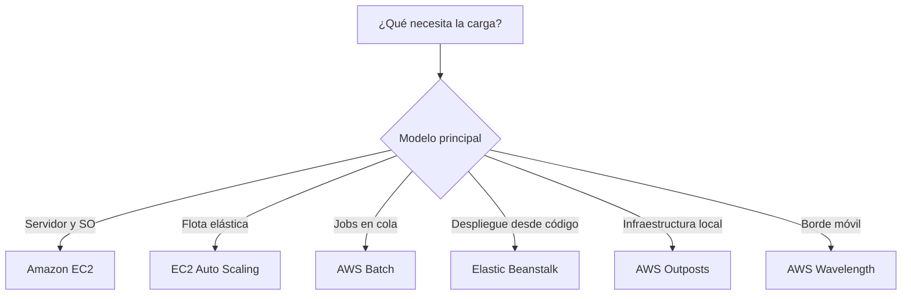

# Servicios de cómputo en AWS para el examen SAA-C03

## 1. Alcance necesario para el examen

La guía oficial vigente del SAA-C03 incluye los siguientes servicios en la categoría Compute:

- AWS Batch
- Amazon EC2
- Amazon EC2 Auto Scaling
- AWS Elastic Beanstalk
- AWS Outposts
- AWS Serverless Application Repository
- VMware Cloud on AWS
- AWS Wavelength

El examen evalúa principalmente la capacidad de:

- Elegir el modelo de cómputo adecuado para una carga.
- Seleccionar familias, almacenamiento y opciones de compra de EC2.
- Diseñar flotas Multi-AZ sin puntos únicos de fallo.
- Diferenciar alta disponibilidad, balanceo y escalado.
- Seleccionar una política de EC2 Auto Scaling.
- Elegir entre servidores, procesamiento batch y una plataforma administrada.
- Diseñar cargas híbridas o de borde.
- Optimizar costos sin incumplir rendimiento, latencia o disponibilidad.

---

## 2. Modelos fundamentales de cómputo

| Modelo | Nivel de control | Servicio principal | Uso típico |
|---|---|---|---|
| Máquina virtual | Control del sistema operativo | Amazon EC2 | Aplicaciones tradicionales, software específico y procesos persistentes |
| Flota elástica | Plantillas y políticas de capacidad | Amazon EC2 Auto Scaling | Aplicaciones distribuidas y demanda variable |
| Procesamiento por lotes | Definiciones, colas y recursos del job | AWS Batch | Simulaciones, renderizado, ETL y procesamiento masivo |
| Plataforma administrada | Código y configuración de la aplicación | AWS Elastic Beanstalk | Aplicaciones web desplegadas rápidamente |
| Infraestructura híbrida | Cargas y capacidad local | AWS Outposts | Procesamiento en las instalaciones y residencia local |
| Repositorio de aplicaciones | Plantilla, código y permisos | AWS Serverless Application Repository | Publicar o reutilizar aplicaciones serverless |
| Entorno VMware | Máquinas virtuales y herramientas VMware | VMware Cloud on AWS | Migración y extensión de data centers VMware |
| Cómputo de borde móvil | Aplicación y red de borde | AWS Wavelength | Aplicaciones 4G/5G sensibles a latencia |

### Regla mental inicial

---

## 3. Conceptos de arquitectura que se deben dominar

### Escalado vertical frente a horizontal

| Escalado vertical | Escalado horizontal |
|---|---|
| Aumentar CPU, memoria o tamaño de una instancia | Agregar más instancias |
| Puede requerir detener o reemplazar | Permite reemplazar unidades individualmente |
| Tiene un límite máximo | Puede adaptarse dinámicamente |
| No elimina el punto único de fallo | Favorece alta disponibilidad |

### Alta disponibilidad frente a escalabilidad

- **Alta disponibilidad:** mantener la aplicación operativa durante fallos.
- **Escalabilidad:** aumentar o reducir la capacidad.
- **Elasticidad:** ajustar la capacidad automáticamente.
- **Tolerancia a fallos:** continuar funcionando aunque un componente falle.
- Una instancia grande puede aportar rendimiento, pero continúa siendo un punto único de fallo.
- Una flota distribuida en varias AZ puede aportar disponibilidad y escalabilidad.

### Infraestructura inmutable

1. Crear una nueva AMI.
2. Publicar una nueva versión del launch template.
3. Reemplazar gradualmente las instancias.
4. Validar health checks.
5. Retirar la versión anterior.

Este enfoque reduce diferencias de configuración y facilita rollback.

### Descuento frente a garantía de capacidad

- Savings Plans y Reserved Instances se utilizan principalmente para reducir costo.
- Una Capacity Reservation garantiza capacidad para una configuración en una AZ.
- Un descuento no garantiza por sí solo que una instancia pueda lanzarse.
- Una reserva de capacidad no implica automáticamente un descuento.

> **Trampa de examen:** primero determine si el requisito es ahorrar o garantizar capacidad. Son problemas diferentes.

---

## 4. AWS Batch

AWS Batch es un servicio administrado para planificar y ejecutar trabajos por lotes. El usuario define el trabajo y sus recursos; Batch administra las colas, el scheduler y la capacidad de cómputo configurada.

### Características

- Administra trabajos no interactivos.
- Mantiene jobs pendientes en colas.
- Programa trabajos cuando existe capacidad.
- Permite asignar prioridades.
- Aprovisiona y reduce capacidad automáticamente en entornos administrados.
- Puede utilizar instancias EC2 On-Demand o Spot.
- Soporta dependencias, reintentos, timeouts y ejecución paralela.
- Es apropiado para trabajos de duración variable.

### Componentes

| Componente | Función |
|---|---|
| Job definition | Plantilla del trabajo |
| Job | Unidad de ejecución |
| Job queue | Cola donde espera el trabajo |
| Compute environment | Capacidad utilizada para ejecutar |
| Scheduler | Selecciona qué job ejecutar y dónde |

### Job definition

Define:

- Imagen y comando.
- vCPU y memoria.
- Variables de entorno.
- Volúmenes.
- Permisos.
- Reintentos.
- Timeout.
- Parámetros reemplazables al enviar el job.

Una definición puede tener varias revisiones. Esto permite actualizar la configuración sin eliminar versiones anteriores.

### Job queue

- Un job espera en la cola hasta que pueda programarse.
- Se pueden crear varias colas.
- Cada cola tiene una prioridad.
- Las colas de mayor prioridad se evalúan primero.
- Una cola puede asociarse con uno o más compute environments.

Ejemplo:

| Cola | Capacidad | Uso |
|---|---|---|
| Alta prioridad | EC2 On-Demand | Trabajos críticos |
| Baja prioridad | EC2 Spot | Trabajos reiniciables y sin urgencia |

### Compute environment

Define la capacidad disponible:

- Tipos de instancia.
- Cantidad mínima y máxima de recursos.
- Subredes.
- Reglas de red.
- Roles y permisos.
- On-Demand o Spot.

Puede ser:

| Tipo | Responsabilidad |
|---|---|
| Administrado | AWS Batch aprovisiona y escala la capacidad |
| No administrado | El cliente proporciona y opera la capacidad |

Para preguntas que buscan menor esfuerzo operativo, normalmente se elige un compute environment administrado.

### Estados habituales de un job

| Estado | Significado |
|---|---|
| SUBMITTED | Job aceptado |
| PENDING | Espera a que se resuelvan dependencias |
| RUNNABLE | Está listo, pero espera capacidad |
| STARTING | Se prepara el entorno |
| RUNNING | Está ejecutándose |
| SUCCEEDED | Finalizó correctamente |
| FAILED | Finalizó con error |

> **Pista de diagnóstico:** un job que permanece en `RUNNABLE` suele estar esperando capacidad o una configuración compatible.

### Dependencias

Permiten que un job espere a otro.

Ejemplo:

1. Extraer datos.
2. Transformarlos.
3. Generar el reporte.

El segundo job no empieza hasta que termine el primero.

### Array jobs

Permiten ejecutar muchas variantes del mismo trabajo:

- Procesar partes de un dataset.
- Renderizar distintos frames.
- Analizar muchos archivos.
- Ejecutar simulaciones con parámetros diferentes.

Son más eficientes que registrar manualmente miles de definiciones independientes.

### Reintentos

- Se puede definir una cantidad máxima de intentos.
- Son útiles ante fallos transitorios.
- El trabajo debe ser idempotente.
- Los datos parciales deben poder recuperarse o sobrescribirse.
- Los checkpoints deben almacenarse fuera de la instancia.

### Timeout

Impide que un trabajo permanezca ejecutándose indefinidamente.

Debe considerar:

- Duración normal.
- Variación de carga.
- Tiempo necesario para cerrar de forma segura.
- Costo de un proceso bloqueado.

### Uso de Spot

Spot es adecuado cuando:

- El job tolera interrupciones.
- Puede reiniciarse.
- Guarda checkpoints.
- No tiene una fecha límite estricta.
- El costo es más importante que el tiempo exacto de finalización.

No es adecuado cuando:

- El trabajo no puede reiniciarse.
- Existe una ventana estricta.
- La interrupción implica pérdida de datos.

### Casos de uso

- Renderizado.
- Simulaciones.
- Procesamiento científico.
- ETL.
- Transcodificación.
- Cálculos financieros.
- Procesamiento masivo de archivos.
- Compilaciones intensivas.

### Cuándo elegir AWS Batch

- Existen trabajos independientes que deben ponerse en cola.
- Se necesitan prioridades.
- Se requiere capacidad dinámica.
- Los trabajos necesitan mucha CPU o memoria.
- Se quieren aprovechar instancias Spot.
- Existen dependencias entre fases.
- Se necesita procesamiento paralelo.

### Trampas del examen

- Batch administra trabajos, no solicitudes interactivas.
- Una cola de Batch no es una cola genérica de mensajes de aplicación.
- El scheduler decide cuándo ejecutar; el código sigue siendo responsabilidad del cliente.
- Spot solo debe usarse con trabajos tolerantes a interrupciones.
- Un compute environment administrado reduce operación.
- Un job puede esperar en `RUNNABLE` aunque esté correctamente enviado.

---

## 5. Amazon EC2

Amazon Elastic Compute Cloud proporciona servidores virtuales bajo demanda. Se utiliza cuando se necesita control del sistema operativo, software específico, procesos de larga duración o hardware especializado.

### Componentes de una instancia

| Componente | Función |
|---|---|
| AMI | Plantilla del sistema operativo y software |
| Instance type | CPU, memoria, red y almacenamiento |
| Volumen raíz | Sistema operativo de la instancia |
| Instance store | Almacenamiento local efímero |
| ENI | Interfaz de red |
| Security group | Firewall stateful |
| Instance profile | Credenciales temporales |
| User data | Script de inicialización |

### Familias de instancias

| Categoría | Prefijos comunes | Uso |
|---|---|---|
| Uso general | M, T | Servidores web, aplicaciones y desarrollo |
| Optimizadas para cómputo | C | CPU intensiva y alto rendimiento |
| Optimizadas para memoria | R, X, U | Grandes datasets y procesamiento en memoria |
| Optimizadas para almacenamiento | I, D, H | Alto IOPS y almacenamiento local |
| Cómputo acelerado | P, G, Inf, Trn, F | GPU, ML, gráficos y FPGA |
| HPC | HPC | Simulación y cómputo científico |

### Instancias burstable

Las familias T:

- Proporcionan una línea base de CPU.
- Acumulan créditos cuando consumen menos que la línea base.
- Utilizan créditos durante picos.
- Son adecuadas para cargas con uso medio bajo.
- No son ideales para CPU alta y sostenida.
- Pueden generar cargos adicionales en modo Unlimited.

### Arquitectura del procesador

| Arquitectura | Característica |
|---|---|
| AWS Graviton — Arm | Buena relación precio-rendimiento |
| Intel o AMD — x86 | Amplia compatibilidad |

Antes de migrar a Arm:

- Verificar que la AMI sea compatible.
- Revisar binarios y dependencias.
- Probar funcionalidad.
- Comparar rendimiento y costo.

### AMI

Una Amazon Machine Image contiene:

- Imagen del volumen raíz.
- Permisos de lanzamiento.
- Mapeo de dispositivos.

Conceptos:

- Es una plantilla para crear instancias.
- Es regional.
- Puede copiarse a otra región.
- Puede compartirse con cuentas autorizadas.
- Puede contener una configuración corporativa estándar.
- Permite implementar servidores inmutables.
- El user data de una instancia no se incorpora automáticamente al crear una AMI.

### Golden AMI

Una golden AMI puede incluir:

- Sistema operativo actualizado.
- Agentes corporativos.
- Configuración de seguridad.
- Runtime.
- Dependencias comunes.

Ventajas:

- Lanzamiento más rápido.
- Configuración consistente.
- Menos tareas durante el bootstrap.
- Mejor control de versiones.

### User data

Permite ejecutar instrucciones al iniciar:

- Instalar paquetes.
- Descargar configuración.
- Iniciar servicios.
- Registrar agentes.
- Preparar la aplicación.

Buenas prácticas:

- Mantenerlo corto.
- Hacerlo idempotente.
- No guardar contraseñas.
- No guardar access keys.
- Registrar errores de inicialización.
- Utilizar una AMI preparada si el proceso tarda mucho.

> Por defecto, el user data normalmente se ejecuta en el primer arranque, no en cada reboot.

### Instance Metadata Service — IMDS

Permite consultar:

- ID de instancia.
- Región.
- Zona de disponibilidad.
- Información de red.
- User data.
- Credenciales temporales del rol.

Para el examen:

- Prefiera IMDSv2.
- IMDSv2 utiliza tokens de sesión.
- Limite el acceso de procesos no confiables.
- No utilice metadata para almacenar secretos.

### Instance profile

Proporciona credenciales temporales a aplicaciones en EC2.

Ventajas:

- Evita access keys estáticas.
- Las credenciales se rotan.
- Los permisos se administran centralmente.
- Puede cambiarse el rol de la instancia.

Debe aplicarse mínimo privilegio.

### Estados

| Acción | Resultado |
|---|---|
| Reboot | Reinicia el sistema operativo |
| Stop | Detiene una instancia respaldada por almacenamiento persistente |
| Start | Vuelve a iniciar, posiblemente en otro host |
| Hibernate | Guarda la RAM si la configuración es compatible |
| Terminate | Elimina la instancia |

### Persistencia

| Recurso | Reboot | Stop/Start | Terminate |
|---|---|---|---|
| Almacenamiento persistente | Persiste | Persiste | Depende de la configuración |
| Instance store | Persiste | Se pierde | Se pierde |
| RAM normal | Se pierde | Se pierde | Se pierde |
| RAM con hibernación | No aplica | Se restaura | Se pierde |

> **Trampa:** instance store debe utilizarse para caché, buffers o datos temporales, no como almacenamiento durable.

### Direcciones IP

- La IPv4 privada principal se conserva durante stop/start.
- La IPv4 pública automática puede cambiar.
- Una Elastic IP es estática.
- Una Elastic IP genera costo y debe utilizarse solo cuando sea necesaria.
- Las flotas escalables no deben depender de la IP de una instancia.

### ENI

Una Elastic Network Interface puede contener:

- Direcciones privadas.
- IPv6.
- Security groups.
- Dirección MAC.
- Dirección pública asociada.

Una ENI secundaria puede moverse entre instancias compatibles dentro de la misma AZ. Esto no proporciona resiliencia Multi-AZ.

### Security groups

- Son stateful.
- Contienen reglas allow.
- Controlan entrada y salida.
- Pueden referenciar otros security groups.
- Se asocian con interfaces de red.

Buenas prácticas:

- No abrir SSH o RDP a todo internet.
- Utilizar orígenes específicos.
- Separar reglas por función.
- Permitir solo los puertos necesarios.

### Tenencia

| Modalidad | Característica | Uso |
|---|---|---|
| Shared | Hardware compartido de forma segura | Predeterminada |
| Dedicated Instance | Hardware dedicado a una cuenta | Aislamiento |
| Dedicated Host | Servidor físico dedicado y visible | Licencias por socket, núcleo o host |

Dedicated Host ofrece mayor control físico que Dedicated Instance.

### Placement groups

| Estrategia | Distribución | Uso |
|---|---|---|
| Cluster | Instancias cercanas en una AZ | Baja latencia y alto throughput |
| Partition | Particiones de hardware separadas | Grandes cargas distribuidas |
| Spread | Pocas instancias en hardware distinto | Reducir fallos correlacionados |

Reglas:

- Cluster no abarca varias AZ.
- Cluster favorece rendimiento de red.
- Partition es apropiado para grandes sistemas distribuidos.
- Spread es apropiado para pocas instancias críticas.
- No reemplazan una arquitectura Multi-AZ.

### Status checks

| Tipo | Detecta |
|---|---|
| System status check | Fallo del host, red o infraestructura |
| Instance status check | Problema del SO o configuración |

Acciones:

- Ante fallo de sistema: recuperar, detener/iniciar o esperar resolución.
- Ante fallo de instancia: reiniciar o reparar el sistema operativo.

### Opciones de compra

| Opción | Compromiso | Interrupción | Uso |
|---|---|---|---|
| On-Demand | Ninguno | No por la opción | Carga irregular |
| Savings Plans | Gasto por hora de 1 o 3 años | No | Línea base estable |
| Reserved Instances | Plazo y atributos | No | Uso estable coincidente |
| Spot | Ninguno | Sí | Carga tolerante |
| Dedicated Host | Host completo | No | BYOL y aislamiento |
| Capacity Reservation | Capacidad en una AZ | No | Garantizar lanzamiento |

### On-Demand

- Sin compromiso.
- Adecuado para cargas nuevas.
- Adecuado para demanda impredecible.
- Precio base más alto.

### Savings Plans

- Compromiso de gasto por hora.
- Reduce costo.
- Puede ofrecer flexibilidad de configuración según el tipo.
- No garantiza capacidad.

### Reserved Instances

- Son principalmente un beneficio de facturación.
- No son una instancia física.
- Standard ofrece mayor descuento y menor flexibilidad.
- Convertible permite cambiar atributos dentro de sus reglas.
- Una reserva regional no garantiza capacidad.

### Spot

- Utiliza capacidad sobrante.
- Puede ser interrumpida.
- Tiene un costo menor.
- Requiere tolerancia a fallos.
- Debe guardar estado fuera de la instancia.
- Es conveniente diversificar tipos y AZ.

### Capacity Reservation

- Garantiza capacidad para una configuración en una AZ.
- Se cobra aunque no se utilice.
- No implica por sí sola un descuento.
- Puede combinarse con un beneficio de facturación compatible.

> **Trampa esencial:** Savings Plans reducen costo; Capacity Reservation garantiza capacidad.

### Optimización de costos

- Seleccionar la familia adecuada.
- Realizar rightsizing.
- Evaluar Graviton.
- Aplicar compromiso solo a la línea base.
- Utilizar Spot para capacidad flexible.
- Apagar entornos no productivos.
- Eliminar recursos no utilizados.

### Cuándo elegir EC2

- Se necesita acceso al sistema operativo.
- El proceso es permanente o prolongado.
- Se requiere hardware especializado.
- La aplicación tiene licencias particulares.
- Se necesita una configuración personalizada.
- Se requiere control de red y almacenamiento.

### Trampas del examen

- Una sola instancia es un punto único de fallo.
- Stop no elimina automáticamente el almacenamiento persistente.
- La IPv4 pública automática puede cambiar.
- Instance store no es durable.
- Una AMI es regional.
- Una RI no equivale a capacidad garantizada.
- Dedicated Host se utiliza para requisitos físicos o de licencia.

---

## 6. Amazon EC2 Auto Scaling

Amazon EC2 Auto Scaling mantiene y ajusta automáticamente una flota de instancias EC2.

### Componentes

| Componente | Función |
|---|---|
| Launch template | Define cómo crear las instancias |
| Auto Scaling Group — ASG | Define AZ y capacidad |
| Scaling policy | Define cuándo escalar |
| Health check | Detecta instancias no saludables |
| Lifecycle hook | Pausa una transición |

### Launch template

Puede definir:

- AMI.
- Tipo de instancia.
- Volúmenes.
- Red.
- Security groups.
- Instance profile.
- User data.
- Opciones de metadata.

Características:

- Tiene versiones.
- Es reutilizable.
- Permite Mixed Instances Policy.
- Es preferible a las launch configurations heredadas.

### Minimum, desired y maximum

| Valor | Significado |
|---|---|
| Minimum | Límite inferior |
| Desired | Cantidad que el ASG mantiene |
| Maximum | Límite superior |

Ejemplo:

- `minimum = 2`
- `desired = 4`
- `maximum = 10`

El ASG intenta mantener cuatro instancias y ajusta dentro de los límites.

### Alta disponibilidad

Un ASG puede utilizar varias AZ:

- Distribuye capacidad.
- Reemplaza instancias no saludables.
- Recupera desired capacity.
- Rebalancea la flota.

Para una aplicación crítica:

- Utilizar al menos dos AZ.
- Usar instancias reemplazables.
- Mantener el estado fuera de la instancia.
- Utilizar health checks de aplicación.

### Auto Scaling frente a balanceo

| Auto Scaling | Balanceo |
|---|---|
| Agrega y elimina instancias | Distribuye tráfico |
| Mantiene desired capacity | Envía solicitudes a destinos saludables |
| Reemplaza capacidad | No crea instancias |

Se suelen utilizar juntos, pero resuelven problemas diferentes.

### Health checks

- Las comprobaciones EC2 detectan problemas de infraestructura o instancia.
- Las comprobaciones de aplicación detectan si el servicio responde.
- Una instancia marcada como no saludable es reemplazada.
- El grace period evita reemplazarla mientras inicia.

> Un status check correcto no garantiza que la aplicación esté respondiendo correctamente.

### Políticas de escalado

| Política | Funcionamiento | Uso |
|---|---|---|
| Target tracking | Mantiene una métrica objetivo | Demanda variable |
| Step scaling | Escala según magnitud de alarma | Control granular |
| Simple scaling | Un ajuste y cooldown | Configuración heredada |
| Scheduled scaling | Cambia capacidad en un horario | Pico conocido |
| Predictive scaling | Pronostica patrones | Ciclos recurrentes |

### Target tracking

Ejemplos:

- Mantener CPU promedio en 50 %.
- Mantener solicitudes por instancia cerca de un objetivo.
- Mantener una métrica personalizada.

La métrica debe reducirse al agregar capacidad para una carga constante.

Ventajas:

- Configuración sencilla.
- Administra alarmas.
- Prioriza disponibilidad.
- Escala hacia adentro de manera conservadora.

### Step scaling

Ejemplo:

| Alarma | Acción |
|---|---|
| CPU entre 60 % y 70 % | Agregar 1 |
| CPU entre 70 % y 85 % | Agregar 2 |
| CPU superior a 85 % | Agregar 4 |

Se utiliza cuando el ajuste debe depender de la gravedad del evento.

### Scheduled scaling

Adecuado para:

- Aumentar antes de una campaña.
- Reducir por la noche.
- Preparar capacidad cada lunes.

Es preferible preparar capacidad antes del pico conocido.

### Predictive scaling

- Analiza datos históricos.
- Identifica patrones.
- Pronostica demanda.
- Prepara capacidad.
- Puede combinarse con escalado dinámico.

Se utiliza para patrones diarios o semanales repetitivos.

### Warmup

Es el tiempo requerido para que una instancia:

- Termine el bootstrap.
- Comience a recibir tráfico.
- Produzca métricas representativas.

Un warmup demasiado corto puede provocar scale-out excesivo.

### Cooldown

Evita que ciertas políticas ejecuten acciones consecutivas antes de observar el efecto del ajuste anterior.

No debe confundirse con warmup.

### Lifecycle hooks

Pausan:

- Lanzamiento antes de `InService`.
- Terminación antes de destruir.

Casos:

- Descargar configuración.
- Ejecutar pruebas.
- Registrar un agente.
- Drenar conexiones.
- Guardar logs.

### Warm pools

Mantienen instancias preinicializadas.

Elegir cuando:

- El arranque es lento.
- La aplicación debe escalar rápidamente.
- El costo de mantener recursos preparados es aceptable.

No usar si el arranque es rápido y no justifica el costo.

### Instance refresh

Reemplaza gradualmente instancias para aplicar:

- Nueva AMI.
- Nueva versión del launch template.
- Nuevo tipo de instancia.
- Cambios de configuración.

Permite controlar:

- Capacidad saludable mínima.
- Tamaño de lotes.
- Checkpoints.
- Rollback compatible.

### Mixed Instances Policy

Permite:

- Varios tipos de instancia.
- On-Demand y Spot.
- Capacidad base On-Demand.
- Porcentaje adicional Spot.
- Diversificación de capacidad.

Ventajas:

- Mayor disponibilidad.
- Menor dependencia de un tipo.
- Optimización de costo.

### Capacity Rebalancing

- Detecta una Spot Instance en riesgo.
- Intenta lanzar reemplazo antes de la interrupción.
- Reduce riesgo, pero no garantiza capacidad.
- La aplicación debe continuar siendo tolerante a fallos.

### Protección contra scale-in

Evita que determinadas instancias sean seleccionadas durante una reducción de capacidad.

Debe utilizarse temporalmente. No debe convertir una flota elástica en un conjunto de servidores permanentes.

### Casos de examen

| Requisito | Selección |
|---|---|
| Reemplazar una instancia fallida | ASG con health checks |
| Mantener CPU objetivo | Target tracking |
| Escalar por rangos | Step scaling |
| Pico conocido | Scheduled scaling |
| Patrón histórico recurrente | Predictive scaling |
| Arranque lento | Warm pool |
| Acción antes de terminar | Lifecycle hook |
| Nueva AMI en toda la flota | Instance refresh |
| Mezclar On-Demand y Spot | Mixed Instances Policy |

### Trampas del examen

- Auto Scaling no distribuye tráfico.
- Desired no siempre es igual a minimum.
- Una sola AZ no tolera un fallo zonal.
- Un health check EC2 puede no detectar un error HTTP.
- Warmup incorrecto causa decisiones de escalado deficientes.
- Launch templates son preferibles para nuevos diseños.

---

## 7. AWS Elastic Beanstalk

AWS Elastic Beanstalk despliega y administra aplicaciones desde el código. Aprovisiona la infraestructura necesaria y conserva acceso a los recursos subyacentes.

### Características

- Despliegue desde un paquete de código.
- Plataformas administradas.
- Aprovisionamiento de EC2.
- Integración con EC2 Auto Scaling.
- Balanceo y health monitoring.
- Versionado de la aplicación.
- Variables de entorno.
- Actualizaciones y políticas de despliegue.

Los recursos:

- Son visibles.
- Pueden personalizarse.
- Generan sus cargos normales.

### Componentes

| Concepto | Descripción |
|---|---|
| Application | Contenedor lógico |
| Application version | Versión desplegable |
| Environment | Recursos que ejecutan la aplicación |
| Platform | SO, runtime y componentes |
| Configuration | Parámetros de la aplicación y entorno |

### Tipos de entorno

| Tipo | Uso |
|---|---|
| Single instance | Desarrollo y pruebas |
| Load balanced, scalable | Producción |
| Web server tier | Atiende solicitudes web |
| Worker tier | Procesa trabajos asíncronos |

### Responsabilidad

AWS administra:

- Aprovisionamiento de la plataforma.
- Health reporting.
- Integración entre componentes.
- Versiones de plataforma.

El cliente administra:

- Código.
- Dependencias.
- Configuración.
- Datos.
- Permisos.
- Compatibilidad.

### Políticas de despliegue

| Política | Disponibilidad | Característica |
|---|---|---|
| All at once | Puede causar downtime | Más rápida |
| Rolling | Capacidad reducida por lotes | Actualización gradual |
| Rolling with additional batch | Mantiene capacidad | Recursos adicionales |
| Immutable | Nuevas instancias | Rollback seguro |
| Traffic splitting | Parte del tráfico a nueva versión | Canary |
| Blue/green | Segundo environment | Cambio controlado |

### All at once

- Actualiza todas las instancias simultáneamente.
- Es rápido.
- Puede producir downtime.
- Adecuado para desarrollo.

### Rolling

- Actualiza por lotes.
- Mantiene parte del servicio disponible.
- Reduce capacidad temporalmente.
- Puede coexistir más de una versión durante el despliegue.

### Rolling with additional batch

- Crea capacidad adicional.
- Mantiene la capacidad normal.
- Tiene costo temporal.
- Tarda más.

### Immutable

- Crea instancias nuevas.
- No modifica las existentes.
- Verifica health checks.
- Facilita rollback.
- Requiere capacidad adicional temporal.

### Traffic splitting

- Envía un porcentaje a la nueva versión.
- Permite evaluar métricas.
- Es una estrategia canary.
- Revierte tráfico si falla.

### Blue/green

Proceso:

1. Crear otro environment.
2. Desplegar la nueva versión.
3. Probar.
4. Intercambiar las direcciones de los environments.
5. Mantener el anterior para rollback.

Ventajas:

- Aislamiento completo.
- Rollback rápido.
- Menor riesgo.

Desventaja:

- Duplica recursos temporalmente.

### Configuración

Puede incluir:

- Variables.
- Tamaño de instancia.
- Capacidad mínima y máxima.
- Reglas de red.
- Health checks.
- Versión de plataforma.
- Configuración del runtime.

No se deben almacenar secretos directamente en el repositorio de código.

### Datos persistentes

Los datos de producción deben separarse del ciclo de vida del environment:

- Evita pérdida al eliminar el entorno.
- Facilita blue/green.
- Permite escalar aplicación y datos de forma independiente.
- Simplifica recuperación.

### Cuándo elegir Elastic Beanstalk

- Se quiere desplegar código rápidamente.
- La plataforma está soportada.
- Se busca menor esfuerzo operativo.
- Se requiere acceso a las instancias y configuración.
- Se necesitan ambientes reproducibles.

### Cuándo no elegirlo

- La plataforma requiere personalización extrema.
- La carga no encaja en el modelo de aplicación.
- La organización ya tiene otra plataforma.
- Se necesita controlar manualmente cada componente.

### Trampas del examen

- Elastic Beanstalk utiliza recursos EC2 reales.
- No existe alta disponibilidad con Single instance.
- All at once puede causar downtime.
- Immutable crea nuevas instancias.
- Blue/green utiliza dos environments.
- Se pagan los recursos aprovisionados.
- Los datos durables no deben depender del environment.

---

## 8. AWS Outposts

AWS Outposts extiende infraestructura, servicios, APIs y herramientas de AWS a las instalaciones del cliente.

### Características

- Hardware AWS instalado on-premises.
- Administrado y monitoreado por AWS.
- Cómputo y almacenamiento local.
- APIs y herramientas consistentes con AWS.
- Integración con una región principal.
- Baja latencia hacia sistemas locales.

### Formatos

Outposts puede ofrecerse en formatos físicos adecuados para diferentes necesidades de capacidad y espacio.

La selección depende de:

- Cantidad de cómputo.
- Almacenamiento.
- Espacio físico.
- Energía.
- Redundancia.
- Crecimiento esperado.

### Relación con la región

- Se asocia con una región principal.
- Se vincula con una zona de disponibilidad.
- Extiende la red de la región al sitio.
- Algunos servicios continúan dependiendo de componentes regionales.
- La capacidad local es finita.

### Service link

Conecta Outposts con la región principal.

Se utiliza para:

- Administración.
- Monitoreo.
- Tráfico de control.
- Comunicación con componentes regionales.

La arquitectura debe considerar una degradación o pérdida de esta conectividad.

### Local gateway

Permite comunicación entre:

- Recursos del Outpost.
- Sistemas de la red local.

Es importante cuando la carga debe acceder con baja latencia a:

- Sistemas industriales.
- Bases locales.
- Equipos.
- Aplicaciones heredadas.

### Responsabilidad compartida

AWS administra:

- Hardware.
- Firmware.
- Infraestructura.
- Monitoreo del equipo.
- Mantenimiento del servicio.

El cliente proporciona:

- Sitio físico.
- Energía.
- Conectividad.
- Refrigeración según el formato.
- Seguridad de aplicaciones.
- Planificación de capacidad.

### Capacidad

A diferencia de una región:

- El hardware debe dimensionarse.
- La capacidad no es ilimitada.
- El crecimiento puede requerir nuevo equipamiento.
- EC2 Auto Scaling solo utiliza capacidad física disponible.

### Alta disponibilidad

Debe evaluar:

- Fuentes de energía.
- Enlaces de red redundantes.
- Capacidad adicional.
- Varios equipos o racks.
- Dependencias regionales.
- Backups.
- Comportamiento desconectado.

### Casos de uso

- Procesamiento industrial.
- Residencia local de datos.
- Sistemas médicos.
- Baja latencia hacia equipos locales.
- Aplicaciones híbridas.
- Migración gradual.

### Cuándo elegir Outposts

- La carga debe estar físicamente en las instalaciones.
- Se requieren APIs AWS localmente.
- La latencia a sistemas on-premises es crítica.
- Existen requisitos de residencia.
- Se desea operación híbrida consistente.

### Cuándo no elegirlo

- La región cumple el requisito.
- Solo se necesita conectividad privada.
- Se requiere elasticidad sin hardware local.
- La necesidad es baja latencia hacia usuarios móviles.

### Trampas del examen

- Outposts se instala en el sitio del cliente.
- No es una región independiente.
- La capacidad es finita.
- Necesita conectividad con su región principal.
- Auto Scaling no puede crear hardware inexistente.
- El cliente sigue siendo responsable de su aplicación.

---

## 9. AWS Serverless Application Repository

AWS Serverless Application Repository permite publicar, descubrir y desplegar aplicaciones serverless reutilizables.

### Características

- Aplicaciones públicas.
- Aplicaciones privadas.
- Versiones.
- Definición mediante AWS SAM.
- Parámetros de despliegue.
- Políticas para compartir.
- Integración con herramientas serverless.

### Contenido de una aplicación

Puede incluir:

- Código.
- Plantilla AWS SAM.
- Parámetros.
- Permisos.
- Metadatos.
- Documentación.
- Versiones.

### Publicación

Un publicador:

1. Prepara el código.
2. Define la plantilla.
3. Documenta parámetros.
4. Publica una versión.
5. Configura permisos de acceso.

Puede compartirla:

- Públicamente.
- Con cuentas específicas.
- Dentro de una organización, según configuración.

### Consumo

Antes de desplegar:

- Revisar código.
- Revisar la plantilla.
- Revisar permisos.
- Revisar recursos creados.
- Revisar costos.
- Verificar el publicador.

El repositorio facilita la distribución, pero el consumidor continúa siendo responsable de validar la aplicación.

### AWS SAM

AWS Serverless Application Model:

- Describe recursos en una plantilla.
- Simplifica definiciones serverless.
- Permite empaquetar la aplicación.
- Facilita despliegue reproducible.

### Casos de uso

- Componentes reutilizables.
- Automatización.
- Procesamiento de archivos.
- Backends de ejemplo.
- Aplicaciones internas compartidas.
- Patrones corporativos.

### Versionado

- Una aplicación puede publicar varias versiones.
- El consumidor selecciona qué versión desplegar.
- Las actualizaciones deben revisarse.
- Una nueva versión puede cambiar permisos o recursos.

### Seguridad

- Aplicar mínimo privilegio.
- Revisar políticas antes de desplegar.
- No confiar automáticamente en código público.
- Verificar parámetros.
- Analizar el impacto de recursos creados.

### Diferencias

| Elemento | Propósito |
|---|---|
| Repositorio Git | Versionar código y colaborar |
| Registro de imágenes | Almacenar imágenes |
| Serverless Application Repository | Distribuir aplicaciones desplegables |

### Cuándo elegirlo

- Se quiere reutilizar una aplicación serverless.
- Se desea compartir componentes entre cuentas.
- Se quiere publicar un patrón estandarizado.
- Se necesita acelerar el despliegue de soluciones conocidas.

### Trampas del examen

- No ejecuta por sí mismo la aplicación.
- Desplegar crea recursos en la cuenta del consumidor.
- AWS SAM describe la aplicación.
- Deben revisarse permisos y costos.
- No es un repositorio de código general.
- No es un registro de imágenes.

---

## 10. VMware Cloud on AWS

VMware Cloud on AWS permite ejecutar un Software-Defined Data Center de VMware sobre infraestructura AWS.

### Objetivo

- Migrar cargas VMware.
- Extender un data center.
- Mantener herramientas conocidas.
- Reducir cambios durante una migración.
- Evitar refactorización inmediata.

### Componentes conceptuales

- VMware vSphere.
- VMware vSAN.
- VMware NSX.
- Herramientas de administración VMware.
- Hosts dedicados.

### Casos de uso

- Migración lift-and-shift.
- Ampliación temporal de capacidad.
- Recuperación ante desastres.
- Consolidación de data centers.
- Migración por etapas.
- Cargas dependientes de VMware.

### Ventajas

- Mantiene el modelo operativo VMware.
- Permite movilidad de máquinas virtuales.
- Reduce cambios iniciales.
- Acerca las cargas a infraestructura AWS.
- Facilita una migración gradual.

### Consideraciones

- Costo de hosts.
- Licenciamiento.
- Conectividad.
- Diseño de red.
- Dependencias VMware.
- Capacidad mínima.
- Estrategia de modernización.

### Migración

Una estrategia puede:

1. Conectar el entorno local con VMware Cloud on AWS.
2. Replicar máquinas virtuales.
3. Probar conectividad.
4. Migrar por grupos.
5. Validar aplicaciones.
6. Retirar capacidad local.

### Recuperación ante desastres

Puede utilizarse para:

- Replicar VMs.
- Mantener un sitio secundario.
- Recuperar cargas.
- Probar planes de conmutación.

El RPO y RTO dependen de:

- Tecnología de replicación.
- Frecuencia.
- Capacidad preparada.
- Automatización.
- Conectividad.

### Cuándo elegir VMware Cloud on AWS

- La pregunta menciona vSphere, vSAN o NSX.
- Se debe conservar VMware.
- Se necesita migración con pocas modificaciones.
- Se busca capacidad híbrida.
- No existe tiempo para refactorizar.

### Cuándo elegir EC2

- No se requiere VMware.
- La VM puede migrarse a infraestructura nativa.
- Se busca mayor integración con AWS.
- Se quiere evitar el costo de hosts VMware.
- La aplicación será modernizada.

### Trampas del examen

- No es lo mismo que una instancia EC2.
- Mantiene herramientas VMware.
- Está orientado a migración y operación híbrida.
- Deben considerarse hosts, red y licencias.
- No moderniza automáticamente las aplicaciones.

---

## 11. AWS Wavelength

AWS Wavelength lleva cómputo y almacenamiento al borde de redes de proveedores de telecomunicaciones.

### Objetivo

Reducir la latencia entre:

- Dispositivos móviles.
- Redes 4G/5G.
- Aplicaciones de borde.

### Wavelength Zone

- Está asociada con una región.
- Extiende la red a la infraestructura del operador.
- Aloja recursos cerca del usuario móvil.
- Tiene una selección de capacidad menor que una región.

### Componentes

- Wavelength Zone.
- Subnet de Wavelength.
- Carrier gateway.
- Carrier IP en configuraciones compatibles.
- Rutas hacia la red del operador y la región.

### Arquitectura

Patrón:

1. Procesar datos sensibles a latencia en Wavelength.
2. Mantener operaciones centrales en la región.
3. Sincronizar únicamente la información necesaria.
4. Diseñar tolerancia a fallos del borde.
5. Utilizar varias ubicaciones cuando se necesite cobertura.

### Casos de uso

- Gaming interactivo.
- Video en tiempo real.
- Realidad aumentada.
- Vehículos conectados.
- Analítica cerca del dispositivo.
- Aplicaciones industriales sobre red móvil.

### Latencia

Wavelength reduce saltos de red porque el tráfico puede procesarse dentro o cerca de la red del operador antes de viajar a una región.

El beneficio depende de:

- Ubicación del usuario.
- Operador.
- Disponibilidad de una Wavelength Zone.
- Diseño de red.
- Ubicación de los datos.

### Capacidad y servicios

- No todas las capacidades regionales están disponibles.
- Deben verificarse tipos de instancia.
- La capacidad puede ser más limitada.
- Los componentes centrales pueden permanecer en la región.

### Resiliencia

La aplicación debe:

- Tolerar pérdida de una ubicación de borde.
- Conservar datos durables fuera del componente local.
- Poder redirigir o degradar funcionalidad.
- Considerar varias ubicaciones.
- Sincronizar estado de forma controlada.

### Seguridad

- Aplicar reglas de red mínimas.
- Proteger comunicación con la región.
- Utilizar permisos temporales.
- Cifrar datos.
- Separar componentes públicos y privados.

### Cuándo elegir Wavelength

- La pregunta menciona 5G.
- Se requiere latencia muy baja hacia dispositivos móviles.
- El procesamiento debe estar cerca de la red del operador.
- Una región está demasiado lejos para la experiencia requerida.

### Cuándo no elegirlo

- La carga debe ejecutarse dentro del data center del cliente: Outposts.
- No existe un requisito de latencia móvil.
- La región cumple la latencia.
- Se necesitan capacidades no disponibles en el borde.

### Outposts frente a Wavelength

| Outposts | Wavelength |
|---|---|
| Instalaciones del cliente | Red del operador |
| Sistemas locales | Dispositivos móviles |
| Hardware AWS on-premises | Infraestructura de borde |
| Residencia y latencia local | Latencia 4G/5G |

### Trampas del examen

- Wavelength no está en el data center del cliente.
- Está orientado a redes móviles.
- No es una región completa.
- El beneficio depende del operador y ubicación.
- Los componentes regionales siguen siendo importantes.

---

## 12. Matriz de decisión para preguntas del examen

| Requisito del escenario | Respuesta más probable |
|---|---|
| Control completo del sistema operativo | Amazon EC2 |
| CPU alta y sostenida | EC2 compute optimized |
| Gran cantidad de datos en memoria | EC2 memory optimized |
| Caché local temporal de alto rendimiento | EC2 Instance Store |
| Baja latencia entre nodos de una misma AZ | Cluster placement group |
| Separar grandes grupos distribuidos por hardware | Partition placement group |
| Separar pocas instancias críticas | Spread placement group |
| Carga impredecible sin compromiso | EC2 On-Demand |
| Línea base estable | Savings Plans o Reserved Instances |
| Carga tolerante a interrupciones | EC2 Spot |
| Licencia por socket, núcleo o host | Dedicated Host |
| Garantizar capacidad en una AZ | Capacity Reservation |
| Mantener y reemplazar una flota | EC2 Auto Scaling |
| Mantener una métrica objetivo | Target tracking |
| Ajustar según la magnitud de una alarma | Step scaling |
| Preparar capacidad para un horario conocido | Scheduled scaling |
| Anticipar un patrón recurrente | Predictive scaling |
| Servidores con arranque muy lento | Warm pool |
| Ejecutar una acción antes de lanzar o terminar | Lifecycle hook |
| Actualizar una flota con una nueva AMI | Instance refresh |
| Trabajos por lotes en una cola | AWS Batch |
| Desplegar una aplicación desde el código | AWS Elastic Beanstalk |
| Infraestructura AWS dentro del data center | AWS Outposts |
| Publicar una aplicación serverless reutilizable | AWS Serverless Application Repository |
| Conservar herramientas y operación VMware | VMware Cloud on AWS |
| Baja latencia para dispositivos 4G/5G | AWS Wavelength |

---

## 13. Diferencias que suelen generar errores

### Amazon EC2 frente a EC2 Auto Scaling

| Amazon EC2 | EC2 Auto Scaling |
|---|---|
| Proporciona una máquina virtual | Mantiene y escala una flota |
| Define capacidad por instancia | Define minimum, desired y maximum |
| Una instancia puede fallar | Reemplaza instancias no saludables |
| No escala automáticamente por sí sola | Ejecuta políticas de escalado |

### AWS Batch frente a Elastic Beanstalk

| AWS Batch | Elastic Beanstalk |
|---|---|
| Ejecuta jobs no interactivos | Ejecuta aplicaciones web o workers |
| Utiliza colas y prioridades | Utiliza application versions y environments |
| Capacidad orientada a trabajos | Infraestructura orientada a una aplicación |
| Apropiado para procesamiento masivo | Apropiado para despliegue rápido desde código |

### Outposts frente a Wavelength

| AWS Outposts | AWS Wavelength |
|---|---|
| Se instala en las instalaciones del cliente | Se ubica en la red del operador |
| Reduce latencia hacia sistemas locales | Reduce latencia hacia dispositivos móviles |
| Capacidad física planificada | Capacidad de borde de telecomunicaciones |
| Residencia y procesamiento local | Aplicaciones 4G/5G |

### Amazon EC2 frente a VMware Cloud on AWS

| Amazon EC2 | VMware Cloud on AWS |
|---|---|
| Máquina virtual nativa de AWS | Software-Defined Data Center de VMware |
| Administración mediante APIs EC2 | Operación mediante herramientas VMware |
| Amplia selección de instance types | Hosts dedicados para el entorno VMware |
| Apropiado para modernización AWS | Apropiado para continuidad VMware |

### Dedicated Host frente a Capacity Reservation

| Dedicated Host | Capacity Reservation |
|---|---|
| Reserva un servidor físico dedicado | Reserva capacidad de instancia en una AZ |
| Útil para licencias ligadas al host | Útil cuando el lanzamiento debe estar garantizado |
| Proporciona visibilidad física | No proporciona control del host físico |

---

## 14. Optimización de costos

### Amazon EC2 y EC2 Auto Scaling

- Seleccionar la familia correcta.
- Realizar rightsizing.
- Evaluar procesadores Graviton cuando la aplicación sea compatible.
- Aplicar Savings Plans o Reserved Instances únicamente a la línea base estable.
- Utilizar Spot para capacidad flexible y tolerante a interrupciones.
- Apagar entornos no productivos fuera de horario.
- Definir minimum y maximum realistas.
- Diversificar instance types y AZ.
- Utilizar warm pools solo cuando el tiempo de arranque justifique el costo.

### AWS Batch

- Utilizar Spot para jobs reiniciables.
- Separar colas críticas y no críticas.
- Ajustar vCPU y memoria de job definitions.
- Configurar reintentos y timeout.
- Reducir la capacidad cuando no existan jobs.

### AWS Elastic Beanstalk

- Utilizar Single instance únicamente en entornos no críticos.
- Ajustar la configuración de Auto Scaling.
- Eliminar application versions y environments obsoletos.
- Considerar el costo temporal de despliegues Immutable y Blue/green.

### Outposts, VMware Cloud on AWS y Wavelength

- Justificar la ubicación por latencia, residencia o compatibilidad.
- Dimensionar capacidad física o hosts correctamente.
- Incluir conectividad y transferencia en el costo total.
- Preferir una región cuando cumpla todos los requisitos.
- No seleccionar infraestructura de borde o híbrida únicamente por ser una opción técnicamente posible.

---

## 15. Estrategia para resolver preguntas SAA-C03

1. Identificar si la carga requiere una VM, una flota, jobs, una plataforma, infraestructura híbrida o edge.
2. Determinar si se necesita control del sistema operativo.
3. Identificar si la demanda es estable, variable, programada o interrumpible.
4. Separar el descuento de la garantía de capacidad.
5. Determinar si debe tolerarse el fallo de una instancia o AZ.
6. Revisar requisitos de licenciamiento.
7. Identificar dónde debe ejecutarse la carga: región, instalaciones del cliente o red móvil.
8. Elegir la alternativa con menor operación que cumpla todos los requisitos.

### Palabras clave

- **Control del sistema operativo:** Amazon EC2.
- **CPU intensiva:** familia compute optimized.
- **Memoria intensiva:** familia memory optimized.
- **Carga interrumpible:** Spot.
- **Capacidad garantizada:** Capacity Reservation.
- **Licencia por socket o host:** Dedicated Host.
- **Mantener desired capacity:** EC2 Auto Scaling.
- **Métrica objetivo:** Target tracking.
- **Pico conocido:** Scheduled scaling.
- **Patrón diario o semanal:** Predictive scaling.
- **Jobs en cola:** AWS Batch.
- **Desplegar código rápidamente:** Elastic Beanstalk.
- **Data center del cliente:** Outposts.
- **Aplicación serverless reutilizable:** Serverless Application Repository.
- **vSphere, vSAN o NSX:** VMware Cloud on AWS.
- **4G/5G u operador móvil:** Wavelength.

---

## 16. Lista de comprobación final

- [ ] Reconocer las familias principales de EC2.
- [ ] Comprender AMI, user data, instance profile e IMDSv2.
- [ ] Diferenciar reboot, stop, hibernate y terminate.
- [ ] Diferenciar almacenamiento persistente e Instance Store.
- [ ] Diferenciar dirección privada, pública y Elastic IP.
- [ ] Diferenciar Shared, Dedicated Instance y Dedicated Host.
- [ ] Diferenciar Cluster, Partition y Spread placement groups.
- [ ] Diferenciar system e instance status checks.
- [ ] Diferenciar On-Demand, Savings Plans, Reserved Instances, Spot y Capacity Reservation.
- [ ] Comprender minimum, desired y maximum de un ASG.
- [ ] Comprender launch templates.
- [ ] Diferenciar target tracking, step, scheduled y predictive scaling.
- [ ] Comprender warmup, cooldown y health checks.
- [ ] Comprender lifecycle hooks, warm pools e instance refresh.
- [ ] Comprender Mixed Instances Policy y Capacity Rebalancing.
- [ ] Reconocer job definition, job queue y compute environment de AWS Batch.
- [ ] Comprender array jobs, dependencias, reintentos y timeout.
- [ ] Diferenciar las políticas de despliegue de Elastic Beanstalk.
- [ ] Comprender Blue/green mediante environments.
- [ ] Reconocer cuándo elegir AWS Outposts.
- [ ] Comprender AWS Serverless Application Repository.
- [ ] Reconocer el propósito de VMware Cloud on AWS.
- [ ] Reconocer cuándo elegir AWS Wavelength.

---

## Referencias oficiales

- [Guía oficial del examen AWS Certified Solutions Architect – Associate SAA-C03](https://docs.aws.amazon.com/pdfs/aws-certification/latest/solutions-architect-associate-03/solutions-architect-associate-03.pdf)
- [Servicios incluidos en el alcance del SAA-C03](https://docs.aws.amazon.com/aws-certification/latest/solutions-architect-associate-03/saa-03-in-scope-services.html)
- [Introducción a AWS Batch](https://docs.aws.amazon.com/batch/latest/userguide/what-is-batch.html)
- [Introducción a Amazon EC2](https://docs.aws.amazon.com/AWSEC2/latest/UserGuide/concepts.html)
- [Tipos de instancia EC2](https://docs.aws.amazon.com/AWSEC2/latest/UserGuide/instance-types.html)
- [Amazon Machine Images](https://docs.aws.amazon.com/AWSEC2/latest/UserGuide/AMIs.html)
- [Instance Metadata Service](https://docs.aws.amazon.com/AWSEC2/latest/UserGuide/configuring-instance-metadata-service.html)
- [Placement groups](https://docs.aws.amazon.com/AWSEC2/latest/UserGuide/placement-groups.html)
- [Opciones de compra de EC2](https://docs.aws.amazon.com/AWSEC2/latest/UserGuide/instance-purchasing-options.html)
- [Introducción a EC2 Auto Scaling](https://docs.aws.amazon.com/autoscaling/ec2/userguide/what-is-amazon-ec2-auto-scaling.html)
- [Target tracking](https://docs.aws.amazon.com/autoscaling/ec2/userguide/as-scaling-target-tracking.html)
- [Mixed Instances Groups](https://docs.aws.amazon.com/autoscaling/ec2/userguide/ec2-auto-scaling-mixed-instances-groups.html)
- [Introducción a AWS Elastic Beanstalk](https://docs.aws.amazon.com/elasticbeanstalk/latest/dg/Welcome.html)
- [Políticas de despliegue de Elastic Beanstalk](https://docs.aws.amazon.com/elasticbeanstalk/latest/dg/using-features.deploy-existing-version.html)
- [Introducción a AWS Outposts](https://docs.aws.amazon.com/outposts/latest/userguide/what-is-outposts.html)
- [AWS Serverless Application Repository](https://docs.aws.amazon.com/serverlessrepo/latest/devguide/what-is-serverlessrepo.html)
- [VMware en AWS](https://aws.amazon.com/vmware/)
- [Introducción a AWS Wavelength](https://docs.aws.amazon.com/wavelength/latest/developerguide/what-is-wavelength.html)
