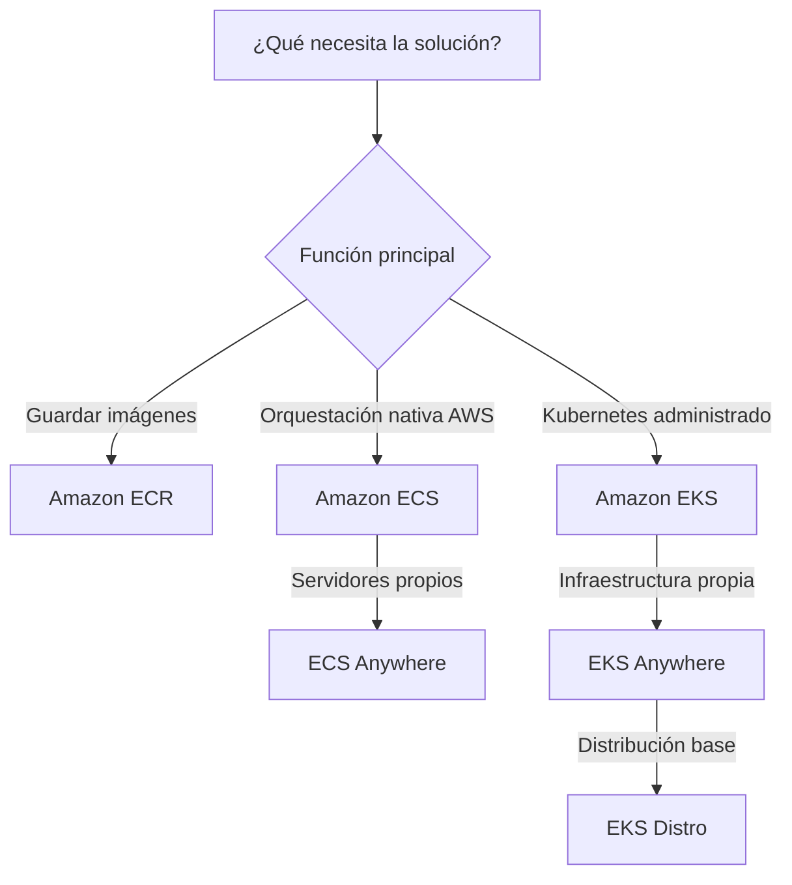
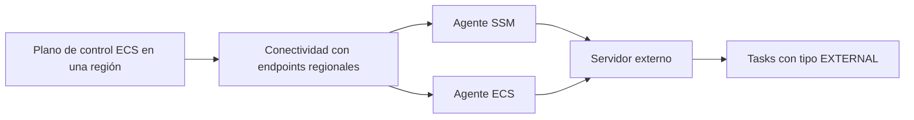
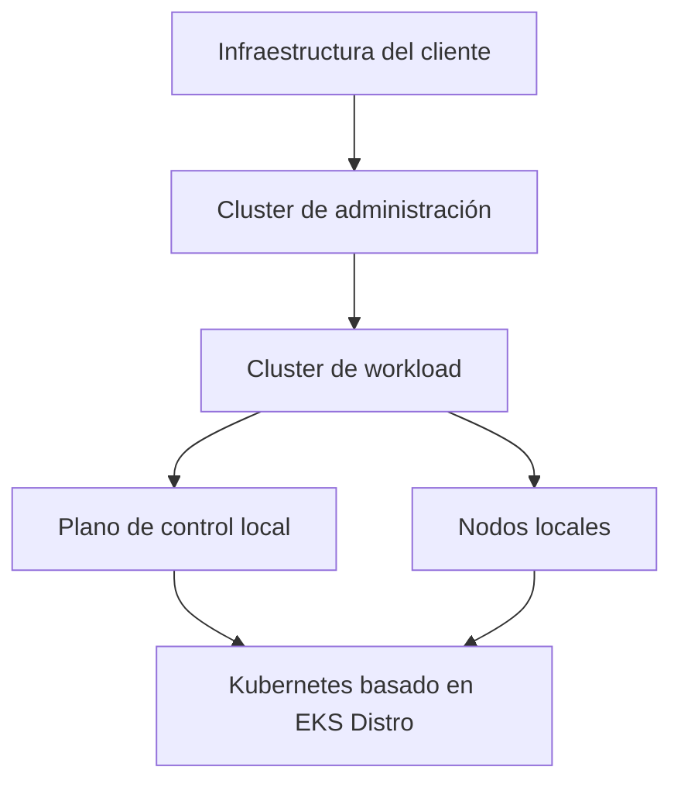

# Contenedores en AWS para el examen SAA-C03

## 1. Alcance necesario para el examen

La guía oficial vigente del SAA-C03 incluye los siguientes servicios en la categoría Containers:

- Amazon ECR
- Amazon ECS
- Amazon ECS Anywhere
- Amazon EKS
- Amazon EKS Anywhere
- Amazon EKS Distro

El examen evalúa principalmente la capacidad de:

- Diferenciar un registro de imágenes de un orquestador de contenedores.
- Elegir entre la orquestación nativa de AWS y Kubernetes.
- Identificar las responsabilidades del plano de control y del plano de datos.
- Diseñar cargas distribuidas, escalables y tolerantes a fallos.
- Aplicar permisos con el menor privilegio a repositorios, tareas, nodos y pods.
- Proteger, analizar, versionar y replicar imágenes.
- Diferenciar servicios administrados en AWS de opciones híbridas autogestionadas.
- Optimizar el costo de imágenes, clústeres y capacidad de cómputo.

---

## 2. Modelos fundamentales de contenedores

| Modelo | Responsabilidad principal | Servicio | Uso típico |
|---|---|---|---|
| Registro de imágenes | Almacenar, proteger y distribuir imágenes | Amazon ECR | Repositorios privados o públicos y canal de entrega de imágenes |
| Orquestación nativa de AWS | Definir tareas y servicios sin administrar el plano de control | Amazon ECS | Aplicaciones contenerizadas con integración directa con AWS |
| ECS híbrido | Operar tareas de ECS en servidores externos | Amazon ECS Anywhere | Procesamiento local, edge y adopción híbrida de ECS |
| Kubernetes administrado | AWS administra el plano de control de Kubernetes | Amazon EKS | Plataformas Kubernetes en AWS |
| Kubernetes en infraestructura propia | El cliente administra infraestructura y ciclo de vida del clúster | Amazon EKS Anywhere | Kubernetes local, edge, aislado o air-gapped |
| Distribución de Kubernetes | Instalar y operar componentes de Kubernetes validados por AWS | Amazon EKS Distro | Construir clústeres Kubernetes autogestionados |

### Regla mental inicial

> **Regla de examen:** ECR almacena imágenes; ECS y EKS ejecutan y orquestan contenedores. EKS Distro entrega software de Kubernetes, pero no administra el clúster.

---

## 3. Conceptos de arquitectura que se deben dominar

### Imagen frente a contenedor

| Imagen | Contenedor |
|---|---|
| Plantilla inmutable con aplicación y dependencias | Instancia en ejecución de una imagen |
| Se construye, etiqueta y almacena | Consume CPU, memoria, red y almacenamiento |
| Puede identificarse mediante tag o digest | Tiene un ciclo de vida de ejecución |
| Se distribuye mediante un registro | Se programa sobre capacidad de cómputo |

- Un **tag** como `produccion` puede cambiar para apuntar a otra imagen.
- Un **digest** identifica de forma única el contenido de una imagen.
- Para despliegues reproducibles se recomienda utilizar versiones inmutables o digests.
- Los datos que deben sobrevivir al reemplazo de un contenedor deben guardarse fuera de su capa escribible.

### Plano de control frente a plano de datos

| Plano de control | Plano de datos |
|---|---|
| Mantiene el estado deseado y programa cargas | Ejecuta los contenedores |
| Decide dónde iniciar o reemplazar una carga | Proporciona CPU, memoria y red |
| ECS lo administra como parte del servicio | El modelo de capacidad determina quién opera los hosts |
| En EKS corresponde a los componentes de control de Kubernetes | En EKS corresponde principalmente a nodos y pods |

> **Trampa de examen:** un plano de control administrado no significa necesariamente que AWS administre los nodos, el sistema operativo, las imágenes o la aplicación.

### Carga stateless frente a stateful

| Stateless | Stateful |
|---|---|
| Cualquier réplica puede atender la solicitud | La instancia mantiene estado o identidad |
| Fácil de reemplazar y escalar horizontalmente | Requiere almacenamiento y coordinación persistentes |
| Adecuada para servicios distribuidos | Adecuada para componentes que necesitan identidad estable |
| Las sesiones se almacenan externamente | El reemplazo debe proteger la continuidad de datos |

Para el examen, una aplicación web stateless distribuida en varias zonas suele ser más resiliente que una única réplica con estado local.

### Deseado frente a ejecutándose

- El orquestador mantiene un **estado deseado**.
- Si una tarea o pod falla, intenta reemplazarlo.
- El health check determina si la carga está lista o saludable.
- La cantidad deseada debe distribuirse entre dominios de fallo.
- Reiniciar una carga no recupera datos guardados únicamente dentro del contenedor.

### Escalado en dos niveles

1. **Escalado de la aplicación:** aumentar o reducir tareas o pods.
2. **Escalado de la infraestructura:** aumentar o reducir la capacidad donde se ejecutan.

Escalar solamente la aplicación no ayuda si no existe capacidad disponible. Escalar solamente los nodos no aumenta las réplicas si el estado deseado de la aplicación no cambia.

### Identidades diferentes

Se deben separar:

- La identidad del usuario o sistema que administra el clúster.
- La identidad utilizada para descargar imágenes e iniciar la carga.
- La identidad de la aplicación que se ejecuta dentro del contenedor.
- La identidad del host o nodo que se comunica con el plano de control.

> **Regla de seguridad:** no se deben entregar a todas las aplicaciones los permisos amplios del nodo.

### Disponibilidad

- Distribuir tareas, pods y nodos entre varias zonas de disponibilidad.
- Ejecutar más de una réplica para cargas críticas.
- Configurar health checks y reemplazo automático.
- Evitar guardar sesiones o datos importantes en el almacenamiento efímero del contenedor.
- Diseñar dependencias y almacenamiento con una disponibilidad compatible.

---

## 4. Amazon ECR

Amazon Elastic Container Registry es un registro administrado de imágenes y artefactos compatibles con Docker y Open Container Initiative —OCI—.

### Características

- Ofrece repositorios privados y públicos.
- Permite enviar, descargar, listar y eliminar imágenes.
- Se integra directamente con Amazon ECS y Amazon EKS.
- Escala sin administrar servidores de registro.
- Utiliza permisos de IAM y políticas basadas en recursos.
- Admite cifrado, escaneo, replicación y políticas de ciclo de vida.
- Puede almacenar artefactos compatibles con OCI además de imágenes.

### Conceptos principales

| Concepto | Función |
|---|---|
| Registry | Espacio regional que contiene repositorios |
| Repository | Colección lógica de imágenes relacionadas |
| Image | Paquete con aplicación, runtime y dependencias |
| Tag | Nombre legible que referencia una imagen |
| Digest | Hash inmutable del contenido |
| Repository policy | Control de acceso basado en recursos |
| Lifecycle policy | Reglas automáticas de conservación o eliminación |

### Repositorio privado frente a público

| Privado | Público |
|---|---|
| Acceso controlado con IAM y políticas | Diseñado para distribución pública |
| Adecuado para aplicaciones internas | Adecuado para imágenes compartidas con la comunidad |
| La autenticación forma parte del flujo habitual | Las imágenes pueden descubrirse públicamente |

Para cargas empresariales y despliegues internos, la respuesta habitual es un repositorio privado.

### Tags y digest

- Un tag permite nombres como `1.4.0`, `latest` o `produccion`.
- Un tag mutable puede reasignarse a una imagen diferente.
- La **tag immutability** evita sobrescribir tags existentes.
- Un digest cambia si cambia el contenido.
- Desplegar por digest elimina la ambigüedad sobre qué imagen se ejecuta.

> **Trampa de examen:** `latest` no garantiza que todas las ejecuciones utilicen permanentemente el mismo contenido.

### Escaneo de imágenes

El escaneo busca vulnerabilidades conocidas en los paquetes incluidos en una imagen.

| Modalidad | Punto clave |
|---|---|
| Escaneo básico | Escaneo de vulnerabilidades administrado por ECR |
| Escaneo mejorado | Escaneo continuo e integración más profunda con Amazon Inspector |

Consideraciones:

- Puede configurarse escaneo al enviar la imagen.
- Los hallazgos deben formar parte del proceso de seguridad.
- Escanear no corrige la imagen automáticamente.
- La corrección habitual consiste en actualizar dependencias, reconstruir y publicar una nueva imagen.
- Una imagen aprobada debe promoverse de manera controlada entre ambientes.

### Políticas de ciclo de vida

Permiten eliminar automáticamente imágenes que ya no se necesitan.

Ejemplos:

- Conservar las últimas 20 imágenes.
- Eliminar imágenes sin tag después de cierto tiempo.
- Conservar versiones con un prefijo específico.
- Retirar builds antiguos de desarrollo.

Las reglas pueden previsualizarse antes de aplicarse.

> **Regla de costos:** una política de ciclo de vida reduce almacenamiento desperdiciado, pero debe conservar las versiones necesarias para rollback.

### Replicación

- Puede replicar imágenes entre regiones.
- Puede replicar imágenes entre cuentas.
- Se configura a nivel del registry.
- Reduce la dependencia de transferencias remotas durante despliegues.
- Ayuda en estrategias multi-región y separación de cuentas.

La replicación de imágenes no replica por sí sola la aplicación, el clúster ni sus datos.

### Pull-through cache

Permite mantener en ECR una caché de imágenes obtenidas desde un registro upstream.

Ventajas:

- Centralizar el origen utilizado por las cargas.
- Reducir la dependencia directa del registro externo.
- Aplicar controles internos al repositorio creado.
- Mantener una copia local de imágenes utilizadas con frecuencia.

No debe confundirse con replicación:

| Pull-through cache | Replicación |
|---|---|
| Obtiene contenido desde un registro upstream | Copia imágenes desde un registry de ECR |
| Se activa al solicitar una imagen | Se activa mediante reglas de replicación |
| Útil para dependencias externas | Útil para multi-región o multi-cuenta |

### Seguridad

- Aplicar IAM con menor privilegio.
- Utilizar repository policies para acceso entre cuentas.
- Habilitar inmutabilidad cuando no deban sobrescribirse versiones.
- Escanear imágenes.
- Cifrar repositorios según los requisitos.
- Evitar incluir secretos dentro de la imagen.
- Firmar y verificar imágenes cuando se requiera integridad del suministro.

### Costos

Los factores principales incluyen:

- Cantidad de datos almacenados.
- Transferencia de datos al enviar o descargar imágenes.
- Replicación entre destinos.
- Acciones opcionales, como firma o análisis mejorado.
- Acumulación de tags, capas e imágenes obsoletas.

### Cuándo elegir Amazon ECR

- Se necesita un registro administrado integrado con AWS.
- Las imágenes deben mantenerse privadas.
- Se requiere acceso entre cuentas.
- Se necesitan escaneo, replicación o ciclo de vida.
- Se quiere almacenar artefactos OCI sin operar un registry.

### Trampas del examen

- ECR no ejecuta contenedores.
- Un tag no es necesariamente inmutable.
- El escaneo no remedia vulnerabilidades.
- Replicar imágenes no crea una solución completa de recuperación ante desastres.
- Eliminar imágenes sin una estrategia puede impedir rollback.

---

## 5. Amazon ECS

Amazon Elastic Container Service es un orquestador de contenedores completamente administrado y nativo de AWS. Permite desplegar, administrar y escalar aplicaciones sin operar el plano de control.

### Componentes

| Componente | Función |
|---|---|
| Cluster | Agrupación lógica de capacidad, tareas y servicios |
| Task definition | Plantilla versionada de uno o más contenedores |
| Task | Instancia en ejecución de una task definition |
| Service | Mantiene una cantidad deseada de tareas de larga duración |
| Capacity | Infraestructura donde se ejecutan las tareas |
| Scheduler | Selecciona dónde ejecutar o reemplazar tareas |

### Task definition

Define, entre otros elementos:

- Imagen del contenedor.
- CPU y memoria.
- Puertos.
- Variables de entorno.
- Comando de inicio.
- Volúmenes.
- Logging.
- Health check del contenedor.
- Task role.
- Task execution role.

Una task definition tiene revisiones. Publicar una nueva revisión no reemplaza automáticamente todas las tareas existentes; el servicio debe actualizarse para desplegarla.

### Task frente a service

| Task independiente | Service |
|---|---|
| Ejecuta una unidad de trabajo | Mantiene una cantidad deseada |
| Puede finalizar al completar | Está diseñado para cargas de larga duración |
| Apropiada para procesos puntuales | Apropiado para APIs, workers y aplicaciones web |
| No implica reemplazo permanente | Reemplaza tareas que dejan de estar saludables |

> **Regla de examen:** si deben mantenerse varias réplicas activas de una aplicación, se necesita un service; una task independiente no mantiene desired count.

### Capacidad

Las tareas necesitan capacidad de cómputo compatible con sus requisitos de CPU, memoria, arquitectura y red.

En un modelo con instancias:

- El cliente selecciona los tipos y cantidad de instancias.
- Las instancias deben registrarse en el cluster.
- El agente de ECS comunica el estado al plano de control.
- El cliente administra capacidad, parches y sistema operativo cuando corresponda.

Los **capacity providers** conectan el scheduler con una estrategia de capacidad y pueden ayudar a administrar el escalado del cluster.

### Colocación de tareas

| Estrategia | Objetivo |
|---|---|
| `spread` | Distribuir tareas entre valores como AZ o instancia |
| `binpack` | Concentrar tareas para aprovechar mejor la capacidad |
| `random` | Distribuir sin una prioridad específica |

También se pueden utilizar restricciones para ejecutar tareas únicamente en instancias que cumplan atributos determinados.

Para alta disponibilidad suele preferirse distribuir entre zonas. Para ahorrar capacidad, `binpack` puede reducir espacios sin utilizar.

### Redes

La configuración de red determina:

- Cómo recibe conectividad cada tarea.
- Qué puertos se exponen.
- Qué reglas de seguridad se aplican.
- Cómo se alcanza la aplicación.
- Cómo se distribuye el tráfico.

El modo `awsvpc` entrega a cada tarea su propia interfaz de red y permite aplicar security groups a nivel de tarea.

> **Trampa de examen:** el puerto del contenedor y el puerto utilizado en el host no son necesariamente el mismo concepto.

### Roles de IAM

| Rol | Quién lo utiliza | Uso |
|---|---|---|
| Task role | Código de la aplicación | Acceder a APIs de AWS |
| Task execution role | Agente y runtime de ECS | Descargar imágenes, entregar logs y obtener configuración necesaria al iniciar |
| Container instance role | Host registrado | Comunicarse con ECS y otros servicios requeridos por el agente |

> **Regla de seguridad:** los permisos de negocio de la aplicación pertenecen al task role, no al rol amplio del host.

### Service Auto Scaling

Modifica la cantidad deseada de tareas de un service.

Puede responder a:

- Utilización de CPU.
- Utilización de memoria.
- Métricas de tráfico.
- Métricas personalizadas.
- Horarios conocidos.

El escalado de tareas y el escalado del cluster son independientes:

| Service Auto Scaling | Cluster Auto Scaling |
|---|---|
| Modifica el desired count de tareas | Modifica la capacidad de instancias |
| Responde a demanda de la aplicación | Responde a capacidad necesaria para programar tareas |
| No crea capacidad por sí solo | No cambia por sí solo la cantidad deseada de tareas |

### Despliegues

- Un service reemplaza gradualmente tareas de la versión anterior.
- Los porcentajes mínimo saludable y máximo controlan la capacidad durante un rolling deployment.
- Los health checks evitan enviar tráfico a tareas no saludables.
- Un circuit breaker puede marcar como fallido un despliegue que no alcanza un estado estable.
- La aplicación debe manejar terminación y nuevas conexiones de forma segura.

### Alta disponibilidad

- Utilizar múltiples tareas.
- Distribuir capacidad y tareas entre varias AZ.
- Evitar una única instancia como punto de fallo.
- Mantener la aplicación stateless cuando sea posible.
- Usar health checks del contenedor y del destino de tráfico.
- Asegurar capacidad suficiente durante despliegues y fallos.

### Observabilidad

Se deben supervisar:

- Estado de tasks y services.
- Eventos del service.
- Uso de CPU y memoria.
- Fallos al descargar imágenes.
- Health checks.
- Capacidad pendiente.
- Logs de la aplicación.

Una tarea en estado `PENDING` puede indicar falta de capacidad, incompatibilidad de recursos, problemas de red o permisos.

### Casos de uso

- Microservicios.
- APIs.
- Aplicaciones web.
- Workers asíncronos.
- Procesamiento en contenedores.
- Modernización de aplicaciones.
- Equipos que no necesitan la API completa de Kubernetes.

### Cuándo elegir Amazon ECS

- Se busca orquestación administrada y nativa de AWS.
- Se quiere menor complejidad que operar Kubernetes.
- La aplicación utiliza tasks y services.
- Se necesita integración directa con IAM, red y ECR.
- El equipo no requiere portabilidad mediante APIs de Kubernetes.

### Trampas del examen

- ECS administra el plano de control, no necesariamente todos los hosts.
- Un cluster es una agrupación lógica; no es una única máquina.
- Una task definition es una plantilla, no una ejecución.
- Aumentar desired count no garantiza que exista capacidad para programar tareas.
- El task execution role no reemplaza al task role.
- Una task detenida pierde los datos guardados solamente en su capa efímera.

---

## 6. Amazon ECS Anywhere

Amazon ECS Anywhere extiende el plano de control de ECS para registrar servidores o máquinas virtuales externos y ejecutar tareas en infraestructura local o de borde.

### Arquitectura

### Características

- Registra una máquina física o virtual como external instance.
- Utiliza el launch type `EXTERNAL`.
- Mantiene la experiencia de task definitions, tasks y services de ECS.
- Permite una administración coherente entre AWS e infraestructura propia.
- Es apropiado para cargas que procesan datos localmente o generan tráfico saliente.
- Soporta atributos personalizados para restricciones de colocación.

### Requisitos conceptuales

- Instalar y mantener el agente de ECS.
- Instalar y mantener el agente de Systems Manager.
- Asignar el rol requerido a la instancia externa.
- Permitir conectividad y resolución DNS hacia los endpoints regionales necesarios.
- Proporcionar un runtime de contenedores y un sistema operativo compatible.
- Registrar la instancia en un único cluster a la vez.

### Responsabilidad

| AWS | Cliente |
|---|---|
| Opera el plano de control de ECS | Proporciona servidores o VMs |
| Programa y mantiene el estado deseado | Administra hardware y capacidad |
| Recibe estado de tasks e instancias | Administra sistema operativo, runtime y agentes |
| Expone APIs regionales | Administra conectividad local y seguridad física |

### Redes y limitaciones importantes

En external instances:

- No se admite el balanceo de carga de services de ECS.
- No se admite service discovery de ECS.
- No se admite el modo de red `awsvpc`.
- Las tareas utilizan los modos `bridge`, `host` o `none`.
- No se admiten capacity providers; se utiliza `EXTERNAL`.
- La carga debe diseñarse considerando la conectividad con la región.

> **Regla de examen:** ECS Anywhere es más adecuado para procesamiento local o tráfico saliente que para un servicio web entrante que requiera integración administrada con balanceadores.

### Casos de uso

- Procesar datos cerca de su origen.
- Mantener datos localmente por latencia o regulación.
- Ejecutar software contenerizado sobre hardware existente.
- Extender prácticas de ECS a sucursales o edge.
- Administrar cargas híbridas con una API coherente.

### Cuándo elegir ECS Anywhere

- Se requiere ECS sobre servidores propios.
- La organización quiere conservar infraestructura local.
- Existe conectividad confiable con endpoints regionales.
- La carga no depende de las integraciones no disponibles en external instances.
- Se prefiere el modelo de tasks y services de ECS sobre Kubernetes.

### Cuándo no elegirlo

- Se necesita un plano de control completamente local y desconectado.
- La carga requiere balanceo administrado de entrada de ECS.
- Se necesita el modo de red `awsvpc`.
- Se requieren APIs y ecosistema de Kubernetes.
- El cliente no puede administrar los hosts, agentes y capacidad.

### Trampas del examen

- ECS Anywhere no mueve el plano de control regional a las instalaciones.
- No convierte la infraestructura externa en hardware administrado por AWS.
- La conectividad con la región continúa siendo importante.
- Una external instance solo puede registrarse en un cluster a la vez.
- Capacity providers no se utilizan con el launch type `EXTERNAL`.

---

## 7. Amazon EKS

Amazon Elastic Kubernetes Service es un servicio administrado de Kubernetes. En EKS estándar, AWS administra el plano de control y el cliente ejecuta sus cargas sobre nodos compatibles.

### Componentes de Kubernetes

| Componente | Función |
|---|---|
| Cluster | Conjunto formado por plano de control y nodos |
| Node | Capacidad de cómputo que ejecuta pods |
| Pod | Unidad mínima programable de Kubernetes |
| Deployment | Mantiene réplicas y despliega versiones |
| Service | Proporciona acceso estable a un conjunto de pods |
| Namespace | Separación lógica de recursos |
| ConfigMap | Configuración no sensible |
| Secret | Datos sensibles administrados por Kubernetes |

### Plano de control administrado

AWS administra:

- Componentes del plano de control.
- Disponibilidad y reemplazo de infraestructura del plano de control.
- Integración del endpoint de la API.
- Mantenimiento de los componentes administrados.

El cliente continúa siendo responsable de:

- Configuración del cluster.
- Nodos y su estrategia de capacidad, según el modelo seleccionado.
- Despliegues, pods y aplicaciones.
- Versiones y configuración de add-ons cuando corresponda.
- Controles de acceso de Kubernetes.
- Seguridad, observabilidad y datos de las cargas.

### EKS estándar frente a EKS Auto Mode

| EKS estándar | EKS Auto Mode |
|---|---|
| AWS administra el plano de control | AWS amplía la administración a componentes del plano de datos |
| El cliente decide y opera la estrategia de nodos | Automatiza aprovisionamiento y mantenimiento de nodos |
| Mayor control operativo | Menor carga operativa |
| Adecuado para configuraciones personalizadas | Adecuado cuando se prioriza automatización |

Para el SAA-C03, la distinción fundamental continúa siendo reconocer qué elementos administra AWS y cuáles administra el cliente.

### Nodos administrados frente a autogestionados

| Managed node group | Nodos autogestionados |
|---|---|
| Automatiza aprovisionamiento y actualizaciones de nodos | El cliente controla directamente el ciclo de vida |
| Reduce trabajo operativo | Ofrece mayor personalización |
| Integrado con el ciclo de vida de EKS | El cliente coordina reemplazos y actualizaciones |
| Adecuado como opción general | Adecuado ante requisitos especiales |

Los nodos deben distribuirse entre varias AZ para evitar que una única zona concentre toda la aplicación.

### Pods, Deployments y Services

- Un **pod** contiene uno o más contenedores estrechamente relacionados.
- Un **Deployment** mantiene una cantidad de réplicas y realiza actualizaciones.
- Un **Service** ofrece un endpoint lógico estable aunque cambien los pods.
- Los pods son reemplazables; su dirección no debe tratarse como permanente.
- Los datos persistentes requieren almacenamiento diseñado para sobrevivir al reemplazo.

### Redes

- Los pods necesitan conectividad y direcciones compatibles con el diseño del cluster.
- El Container Network Interface —CNI— conecta el modelo de red de Kubernetes con la VPC.
- Los security groups, subredes y rutas continúan formando parte del diseño.
- El endpoint de la API puede configurarse con acceso público, privado o combinado.
- Las Network Policies pueden limitar tráfico entre pods cuando la implementación las aplica.

> **Trampa de examen:** un Service de Kubernetes proporciona una abstracción estable; no significa automáticamente exposición pública.

### Almacenamiento

Kubernetes utiliza:

- **PersistentVolume —PV—:** recurso de almacenamiento.
- **PersistentVolumeClaim —PVC—:** solicitud de almacenamiento realizada por la carga.
- **StorageClass:** forma de aprovisionamiento.
- **CSI driver:** integración entre Kubernetes y el almacenamiento.

La selección depende de si la carga necesita bloques, archivos compartidos o almacenamiento de objetos. El volumen debe ser compatible con la topología y las zonas donde se programan los pods.

### Acceso e identidad

EKS combina dos capas:

| Capa | Función |
|---|---|
| IAM | Autenticar identidades y otorgar acceso a recursos de AWS |
| Kubernetes RBAC | Autorizar acciones sobre recursos del cluster |

Para workloads:

- EKS Pod Identity permite asignar permisos de IAM a aplicaciones en pods.
- IAM Roles for Service Accounts —IRSA— asocia un rol con una service account de Kubernetes.
- Ambas opciones evitan entregar a cada pod los permisos amplios del rol del nodo.

> **Regla de seguridad:** autenticarse con IAM no concede automáticamente todas las acciones dentro de Kubernetes; RBAC también debe permitirlas.

### Escalado

| Nivel | Mecanismo conceptual | Resultado |
|---|---|---|
| Pod | Horizontal Pod Autoscaler | Cambia el número de réplicas |
| Recursos del pod | Vertical Pod Autoscaler | Recomienda o ajusta solicitudes de recursos |
| Nodo | Autoscaler de nodos | Agrega o elimina capacidad |

Las solicitudes y límites de CPU y memoria influyen en:

- Dónde puede programarse un pod.
- Cuántos pods caben en un nodo.
- Comportamiento ante presión de recursos.
- Eficiencia de costos.

### Actualizaciones

- Kubernetes tiene un ciclo de versiones.
- El plano de control y los nodos deben mantenerse compatibles.
- Los add-ons también tienen versiones compatibles.
- Las actualizaciones deben probarse antes de producción.
- Los nodos pueden reemplazarse gradualmente para reducir interrupciones.
- Los PodDisruptionBudgets ayudan a conservar disponibilidad durante interrupciones voluntarias.

### Alta disponibilidad

- Distribuir nodos entre varias AZ.
- Ejecutar múltiples réplicas.
- Usar topology spread constraints o reglas de afinidad cuando corresponda.
- Definir readiness y liveness probes.
- Proteger el número mínimo de réplicas durante mantenimiento.
- Diseñar almacenamiento y dependencias para fallos zonales.

### Casos de uso

- Plataformas estandarizadas en Kubernetes.
- Microservicios portables.
- Organizaciones con conocimientos y herramientas de Kubernetes.
- Aplicaciones que requieren APIs, operadores o extensiones de Kubernetes.
- Estrategias híbridas con un modelo Kubernetes coherente.

### Cuándo elegir Amazon EKS

- Kubernetes es un requisito.
- Se necesita compatibilidad con herramientas del ecosistema.
- AWS debe administrar el plano de control.
- La organización acepta la complejidad operativa adicional de Kubernetes.
- Se requieren primitives como pods, deployments, services y namespaces.

### Trampas del examen

- EKS no elimina la necesidad de conocer y operar Kubernetes.
- AWS administra el plano de control; la responsabilidad de nodos depende del modelo elegido.
- Un pod no equivale a una máquina virtual.
- Escalar pods no garantiza que existan nodos con capacidad.
- IAM y Kubernetes RBAC resuelven capas diferentes.
- Los pods no deben depender de datos guardados únicamente en almacenamiento efímero.

---

## 8. Amazon EKS Anywhere

Amazon EKS Anywhere es software de administración de contenedores creado por AWS para ejecutar y administrar clústeres Kubernetes en las instalaciones o en el edge.

### Características

- Está construido sobre Amazon EKS Distro.
- Automatiza preparación de infraestructura y operaciones del ciclo de vida.
- Puede ejecutarse sobre infraestructura administrada por el cliente.
- Permite entornos aislados o air-gapped.
- No tiene una dependencia estricta de servicios regionales de AWS.
- Mantiene una experiencia Kubernetes compatible con herramientas comunes.

### Arquitectura conceptual

### Cluster de administración y workload clusters

- El cluster de administración controla el ciclo de vida de otros clústeres.
- Los workload clusters ejecutan aplicaciones.
- La configuración declarativa describe el estado deseado.
- Las operaciones incluyen creación, escalado, actualización y eliminación.
- La estrategia debe proteger el cluster de administración porque participa en las operaciones de ciclo de vida.

### Responsabilidad

| AWS | Cliente |
|---|---|
| Desarrolla y mantiene el software de EKS Anywhere | Proporciona y opera la infraestructura |
| Entrega componentes y flujos de administración | Opera el plano de control local |
| Publica versiones y paquetes compatibles | Administra actualizaciones y mantenimiento |
| Ofrece opciones de soporte | Diseña disponibilidad, backup, red y seguridad |

> **Regla de examen:** EKS Anywhere es un producto user-managed sobre infraestructura user-managed. No ofrece el mismo plano de control administrado de Amazon EKS en una región.

### Entornos aislados

Para un ambiente air-gapped se debe considerar:

- Disponibilidad local de imágenes y artefactos.
- Repositorios o mirrors internos.
- Proceso controlado para introducir actualizaciones.
- Operación de certificados.
- Monitoreo y logs locales.
- Backups de configuración y estado del cluster.

### Casos de uso

- Residencia de datos en las instalaciones.
- Aplicaciones sensibles a latencia local.
- Plantas, fábricas, telecomunicaciones o edge.
- Infraestructura que debe operar sin dependencia estricta de una región.
- Estandarización de Kubernetes entre ubicaciones.

### Cuándo elegir EKS Anywhere

- Kubernetes debe ejecutarse en infraestructura propia.
- El plano de control también debe permanecer local.
- Se requiere soporte para un entorno aislado.
- El cliente puede administrar hardware, red y ciclo de vida del cluster.
- Se quiere utilizar la distribución y herramientas validadas por AWS.

### Cuándo no elegirlo

- Se quiere que AWS administre el plano de control.
- La carga puede ejecutarse completamente en una región.
- El equipo no tiene capacidad operativa de Kubernetes.
- Solo se necesita extender tasks de ECS a servidores externos.

### Trampas del examen

- EKS Anywhere no es un cluster de Amazon EKS trasladado a las instalaciones.
- El cliente es responsable de actualizar y mantener el cluster.
- EKS Anywhere utiliza EKS Distro, pero no son el mismo producto.
- La capacidad de operar air-gapped no elimina la necesidad de planificar imágenes, parches y certificados.

---

## 9. Amazon EKS Distro

Amazon EKS Distro —EKS-D— es una distribución de Kubernetes basada en la misma distribución utilizada por Amazon EKS.

### Características

- Es software de código abierto mantenido y validado por AWS.
- Incluye versiones de Kubernetes y sus dependencias.
- Sigue el ciclo de versiones de Kubernetes utilizado por Amazon EKS.
- Incluye actualizaciones upstream y parches de seguridad mantenidos por AWS.
- Puede instalarse en las instalaciones, en otras nubes o en sistemas propios.
- No tiene una dependencia obligatoria de servicios de AWS.

### Qué proporciona y qué no proporciona

| Proporciona | No proporciona |
|---|---|
| Binarios e imágenes de componentes Kubernetes | Plano de control administrado |
| Versiones y dependencias validadas | Infraestructura de cómputo |
| Una base coherente con EKS | Creación completa del entorno por sí sola |
| Artefactos para construir un cluster | Operación, monitoreo o backup automáticos |

### Relación entre EKS, EKS Anywhere y EKS Distro

| Opción | Qué es | Quién administra |
|---|---|---|
| Amazon EKS | Servicio administrado de Kubernetes en AWS | AWS administra el plano de control |
| Amazon EKS Anywhere | Software para crear y operar clústeres en infraestructura propia | El cliente administra infraestructura y cluster |
| Amazon EKS Distro | Distribución de componentes de Kubernetes | El cliente instala, integra y mantiene |

### Casos de uso

- Construir una plataforma Kubernetes propia.
- Utilizar versiones alineadas con Amazon EKS.
- Crear distribuciones o productos basados en Kubernetes.
- Ejecutar Kubernetes sin una dependencia obligatoria de AWS.
- Mantener consistencia de componentes entre diferentes entornos.

### Cuándo elegir EKS Distro

- Se necesita la distribución de Kubernetes, no un servicio administrado.
- El cliente dispone de herramientas propias para crear y operar clústeres.
- Se requiere máximo control sobre instalación y componentes.
- Se quiere una base validada por AWS que pueda ejecutarse en cualquier lugar.

### Cuándo no elegirlo

- Se necesita que AWS opere el plano de control.
- Se busca automatización del ciclo de vida sobre infraestructura propia.
- El equipo no quiere administrar actualizaciones y componentes.
- La necesidad real es únicamente almacenar imágenes.

### Trampas del examen

- EKS Distro no es un servicio administrado.
- EKS Distro no ejecuta un cluster por sí solo.
- EKS Anywhere añade automatización de ciclo de vida sobre EKS Distro.
- Compartir una distribución con EKS no transfiere al cliente las operaciones administradas de Amazon EKS.

---

## 10. Seguridad, disponibilidad y operaciones

### Cadena de suministro de imágenes

1. Construir una imagen mínima.
2. Analizar dependencias y vulnerabilidades.
3. Publicar una versión identificable en ECR.
4. Evitar sobrescribir versiones aprobadas.
5. Desplegar mediante una revisión declarativa.
6. Supervisar el comportamiento en ejecución.
7. Reconstruir ante parches en lugar de modificar contenedores manualmente.
8. Conservar versiones suficientes para rollback.

### Menor privilegio

- Limitar quién puede enviar y descargar imágenes.
- Separar permisos de despliegue de permisos de la aplicación.
- Entregar permisos específicos a tasks o service accounts.
- Restringir acceso administrativo al cluster.
- Evitar secretos dentro de imágenes y repositorios de código.
- Registrar cambios administrativos y accesos relevantes.

### Resiliencia

- Mantener varias réplicas.
- Distribuir cargas entre zonas o dominios de fallo.
- Utilizar readiness y health checks correctos.
- Probar reemplazo y despliegue.
- Desacoplar estado de la vida del contenedor.
- Conservar imágenes necesarias en la ubicación de recuperación.
- Diseñar el cluster, la red, los datos y las dependencias como una solución completa.

### Responsabilidad híbrida

| Amazon ECS Anywhere | Amazon EKS Anywhere | Amazon EKS Distro |
|---|---|---|
| Plano de control ECS regional administrado | Plano de control Kubernetes local autogestionado | Solo distribución de Kubernetes |
| Hosts externos administrados por el cliente | Infraestructura y cluster administrados por el cliente | Instalación y ciclo de vida totalmente integrados por el cliente |
| Requiere conectividad con endpoints regionales | Puede operar sin dependencia regional estricta | Puede utilizarse sin dependencias de AWS |

---

## 11. Matriz de decisión para preguntas del examen

| Requisito | Elección principal | Motivo |
|---|---|---|
| Registro privado de imágenes integrado con IAM | Amazon ECR | Registro administrado con políticas y autenticación |
| Limpiar imágenes antiguas automáticamente | Amazon ECR lifecycle policy | Aplica reglas de conservación o eliminación |
| Distribuir imágenes a otra región o cuenta | Amazon ECR replication | Copia imágenes a destinos configurados |
| Detectar vulnerabilidades en imágenes | Amazon ECR image scanning | Genera hallazgos sobre paquetes |
| Orquestación nativa de AWS sin operar el control plane | Amazon ECS | Tasks y services administrados por ECS |
| Mantener una cantidad deseada de contenedores | Amazon ECS service | Reemplaza tasks y conserva desired count |
| Ejecutar tasks de ECS en servidores locales | Amazon ECS Anywhere | Registra external instances |
| Kubernetes con plano de control administrado | Amazon EKS | AWS opera el control plane |
| APIs y ecosistema de Kubernetes | Amazon EKS | Servicio Kubernetes conformant |
| Kubernetes local con automatización de ciclo de vida | Amazon EKS Anywhere | Crea y mantiene clústeres sobre infraestructura propia |
| Kubernetes en un entorno air-gapped | Amazon EKS Anywhere | Puede operar sin dependencia estricta de servicios regionales |
| Componentes Kubernetes validados por AWS para integración propia | Amazon EKS Distro | Distribución autogestionada |
| Menor complejidad sin requisito de Kubernetes | Amazon ECS | Modelo nativo de tasks y services |
| Portabilidad basada en Kubernetes | Amazon EKS | Utiliza APIs y herramientas de Kubernetes |

---

## 12. Diferencias que suelen generar errores

### Amazon ECR frente a Amazon ECS

| Amazon ECR | Amazon ECS |
|---|---|
| Almacena imágenes | Ejecuta y orquesta contenedores |
| Gestiona repositorios | Gestiona tasks y services |
| Aplica lifecycle policies | Mantiene desired count |
| Escanea y replica imágenes | Programa cargas sobre capacidad |

### Amazon ECS frente a Amazon EKS

| Amazon ECS | Amazon EKS |
|---|---|
| Orquestador nativo de AWS | Kubernetes administrado |
| Task definition, task y service | Pod, Deployment y Service |
| Menor complejidad conceptual | Mayor ecosistema y portabilidad |
| No requiere operar Kubernetes | Requiere conocimientos de Kubernetes |

### Amazon ECS frente a Amazon ECS Anywhere

| Amazon ECS en AWS | Amazon ECS Anywhere |
|---|---|
| Capacidad en AWS | External instances del cliente |
| Integraciones de red completas según el modelo | Limitaciones en balanceo y modos de red |
| El host puede formar parte de capacidad administrada en AWS | El cliente administra el host externo |
| Conectividad dentro del entorno AWS | Conectividad con endpoints regionales desde las instalaciones |

### Amazon EKS frente a Amazon EKS Anywhere

| Amazon EKS | Amazon EKS Anywhere |
|---|---|
| Servicio regional administrado | Software ejecutado por el cliente |
| AWS administra el plano de control | El cliente administra el plano de control |
| Infraestructura en AWS | Infraestructura local o edge |
| Dependencia de servicios regionales | Puede funcionar en entornos aislados |

### Amazon EKS Anywhere frente a Amazon EKS Distro

| Amazon EKS Anywhere | Amazon EKS Distro |
|---|---|
| Automatiza ciclo de vida de clústeres | Entrega la distribución de Kubernetes |
| Incluye herramientas de creación y administración | Incluye componentes, versiones y dependencias |
| Se construye sobre EKS Distro | Es la base de EKS y EKS Anywhere |
| Producto user-managed | Software autogestionado |

### Task role frente a task execution role

| Task role | Task execution role |
|---|---|
| Lo usa el código dentro de la task | Lo usa ECS para iniciar y operar la task |
| Permisos de negocio de la aplicación | Descargar imagen, logs y configuración de arranque |
| Debe variar según la aplicación | Debe contener permisos de ejecución necesarios |

### Escalado de aplicación frente a escalado de capacidad

| Aplicación | Capacidad |
|---|---|
| Cambia tasks o pods | Cambia hosts o nodos |
| Responde a demanda del servicio | Responde a recursos requeridos |
| Puede dejar workloads pendientes si falta capacidad | Puede dejar recursos ociosos si no aumentan las réplicas |

---

## 13. Optimización de costos

### Amazon ECR

- Eliminar imágenes obsoletas con lifecycle policies.
- Evitar duplicar imágenes sin necesidad.
- Diseñar la replicación solamente para regiones y cuentas requeridas.
- Utilizar capas reutilizables sin conservar builds innecesarios.
- Revisar transferencia y acciones opcionales.

### Amazon ECS

- Ajustar correctamente CPU y memoria de las task definitions.
- Escalar tasks según demanda real.
- Escalar capacidad sin mantener hosts ociosos innecesarios.
- Aplicar `binpack` cuando la prioridad sea consolidar y la disponibilidad esté protegida.
- Separar capacidad base de capacidad flexible.
- Eliminar services, tasks y clusters no utilizados.

### Amazon EKS

- Incluir el costo del control plane por cluster.
- Evitar crear un cluster por aplicación sin justificación.
- Ajustar requests y limits para utilizar eficientemente los nodos.
- Escalar pods y nodos de forma coordinada.
- Consolidar cargas sin reducir resiliencia.
- Mantener versiones soportadas para evitar costo y riesgo de soporte extendido.

### Opciones Anywhere y EKS Distro

- Evaluar costo total de hardware, licencias, personal y conectividad.
- Dimensionar capacidad local para picos y fallos.
- Incluir actualizaciones, observabilidad, backups y seguridad.
- No asumir que software sin cargo equivale a una plataforma sin costo.
- Elegir operación local únicamente cuando latencia, regulación, aislamiento o hardware lo justifiquen.

---

## 14. Estrategia para resolver preguntas SAA-C03

1. Identificar si la pregunta necesita almacenar imágenes o ejecutar contenedores.
2. Determinar si Kubernetes es un requisito explícito.
3. Identificar dónde debe ejecutarse la carga: AWS, instalaciones o edge.
4. Determinar dónde debe residir el plano de control.
5. Separar escalado de workloads de escalado de capacidad.
6. Identificar la identidad exacta que necesita permisos.
7. Revisar persistencia, red y balanceo.
8. Diseñar múltiples réplicas y dominios de fallo.
9. Elegir la opción con menor operación que cumpla todos los requisitos.

### Palabras clave

- **Registro privado, imágenes OCI o Docker:** Amazon ECR.
- **Eliminar imágenes antiguas:** ECR lifecycle policy.
- **Imágenes en otra región o cuenta:** ECR replication.
- **Vulnerabilidades de imágenes:** ECR image scanning.
- **Orquestación nativa de AWS:** Amazon ECS.
- **Task definition, task o service:** Amazon ECS.
- **Desired count:** ECS service.
- **Servidor local registrado en ECS:** Amazon ECS Anywhere.
- **Launch type EXTERNAL:** Amazon ECS Anywhere.
- **Kubernetes administrado:** Amazon EKS.
- **Pod, Deployment, Service o namespace:** Amazon EKS.
- **Plano de control administrado:** Amazon EKS.
- **Kubernetes local o air-gapped:** Amazon EKS Anywhere.
- **Infraestructura y cluster administrados por el cliente:** Amazon EKS Anywhere.
- **Distribución de Kubernetes validada por AWS:** Amazon EKS Distro.
- **Binarios y dependencias, sin servicio administrado:** Amazon EKS Distro.

---

## 15. Lista de comprobación final

- [ ] Diferenciar imagen y contenedor.
- [ ] Diferenciar registry, repository, tag y digest.
- [ ] Comprender tag immutability.
- [ ] Comprender image scanning.
- [ ] Comprender lifecycle policies de ECR.
- [ ] Diferenciar replicación y pull-through cache.
- [ ] Reconocer cluster, task definition, task y service de ECS.
- [ ] Diferenciar task independiente y ECS service.
- [ ] Diferenciar task role, task execution role y container instance role.
- [ ] Diferenciar escalado del service y escalado del cluster.
- [ ] Comprender estrategias `spread`, `binpack` y `random`.
- [ ] Reconocer las responsabilidades del plano de control y del plano de datos.
- [ ] Comprender el launch type `EXTERNAL`.
- [ ] Recordar las limitaciones de red de ECS Anywhere.
- [ ] Reconocer pod, Deployment, Service, namespace, PV y PVC.
- [ ] Diferenciar IAM y Kubernetes RBAC.
- [ ] Comprender Pod Identity e IRSA.
- [ ] Diferenciar escalado de pods y de nodos.
- [ ] Diseñar cargas Multi-AZ con varias réplicas.
- [ ] Diferenciar Amazon EKS y Amazon EKS Anywhere.
- [ ] Comprender que EKS Anywhere es user-managed.
- [ ] Reconocer el uso de EKS Anywhere en entornos air-gapped.
- [ ] Diferenciar EKS Anywhere y EKS Distro.
- [ ] Comprender que EKS Distro no es un servicio administrado.
- [ ] Seleccionar el servicio correcto a partir de palabras clave.

---

## Referencias oficiales

- [Guía oficial del examen AWS Certified Solutions Architect – Associate SAA-C03](https://docs.aws.amazon.com/pdfs/aws-certification/latest/solutions-architect-associate-03/solutions-architect-associate-03.pdf)
- [Servicios incluidos en el alcance del SAA-C03](https://docs.aws.amazon.com/aws-certification/latest/solutions-architect-associate-03/saa-03-in-scope-services.html)
- [Introducción a Amazon ECR](https://docs.aws.amazon.com/AmazonECR/latest/userguide/what-is-ecr.html)
- [Políticas de ciclo de vida de Amazon ECR](https://docs.aws.amazon.com/AmazonECR/latest/userguide/LifecyclePolicies.html)
- [Escaneo de imágenes de Amazon ECR](https://docs.aws.amazon.com/AmazonECR/latest/userguide/image-scanning.html)
- [Replicación privada de Amazon ECR](https://docs.aws.amazon.com/AmazonECR/latest/userguide/replication.html)
- [Pull-through cache de Amazon ECR](https://docs.aws.amazon.com/AmazonECR/latest/userguide/pull-through-cache.html)
- [Introducción a Amazon ECS](https://docs.aws.amazon.com/AmazonECS/latest/developerguide/Welcome.html)
- [Task definitions de Amazon ECS](https://docs.aws.amazon.com/AmazonECS/latest/developerguide/task_definitions.html)
- [Roles de IAM para tasks de Amazon ECS](https://docs.aws.amazon.com/AmazonECS/latest/developerguide/task-iam-roles.html)
- [Task execution role de Amazon ECS](https://docs.aws.amazon.com/AmazonECS/latest/developerguide/task_execution_IAM_role.html)
- [Amazon ECS Anywhere](https://docs.aws.amazon.com/AmazonECS/latest/developerguide/ecs-anywhere.html)
- [Introducción a Amazon EKS](https://docs.aws.amazon.com/eks/latest/userguide/what-is-eks.html)
- [Managed node groups de Amazon EKS](https://docs.aws.amazon.com/eks/latest/userguide/managed-node-groups.html)
- [IAM Roles for Service Accounts](https://docs.aws.amazon.com/eks/latest/userguide/iam-roles-for-service-accounts.html)
- [EKS Pod Identities](https://docs.aws.amazon.com/eks/latest/userguide/pod-identities.html)
- [Documentación de Amazon EKS Anywhere](https://anywhere.eks.amazonaws.com/docs/)
- [Arquitectura de Amazon EKS Anywhere](https://anywhere.eks.amazonaws.com/docs/concepts/architecture/)
- [Documentación de Amazon EKS Distro](https://distro.eks.amazonaws.com/)
