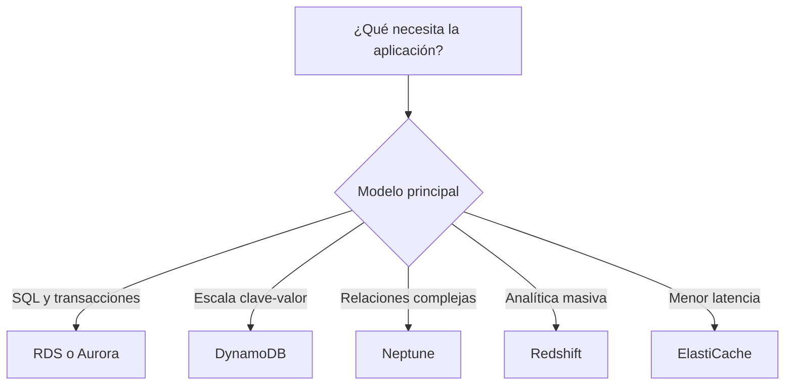

# Bases de datos en AWS para el examen SAA-C03

## 1. Alcance necesario para el examen

La guía oficial vigente del SAA-C03 incluye los siguientes servicios de bases de datos:

- Amazon Aurora
- Amazon Aurora Serverless
- Amazon DocumentDB
- Amazon DynamoDB
- Amazon ElastiCache
- Amazon Keyspaces
- Amazon Neptune
- Amazon RDS
- Amazon Redshift

También se debe relacionar este contenido con:

- AWS Database Migration Service — AWS DMS.
- AWS Backup.
- Amazon S3 como origen o destino de exportaciones, cargas y data lakes.
- AWS Secrets Manager, AWS KMS, IAM, Amazon VPC y security groups.

El examen evalúa principalmente la capacidad de:

- Elegir entre una base relacional, clave-valor, documental, grafo, columna ancha, caché o data warehouse.
- Diferenciar alta disponibilidad de escalado de lectura.
- Seleccionar capacidad provisionada, bajo demanda o serverless.
- Diseñar replicación, backups y recuperación ante desastres.
- Administrar conexiones y caché.
- Elegir una base según sus patrones de lectura y escritura.
- Diseñar migraciones homogéneas y heterogéneas.
- Optimizar costos sin incumplir rendimiento, RPO o RTO.

---

## 2. Tipos fundamentales de bases de datos

| Tipo | Modelo | Servicio AWS | Uso principal |
|---|---|---|---|
| Relacional OLTP | Tablas, relaciones, SQL y transacciones ACID | Amazon RDS, Amazon Aurora | Aplicaciones empresariales y transaccionales |
| Clave-valor/documento serverless | Items identificados por claves | Amazon DynamoDB | Aplicaciones web, móviles, gaming, IoT y microservicios a gran escala |
| Documental compatible con MongoDB | Documentos JSON/BSON y consultas de documentos | Amazon DocumentDB | Aplicaciones compatibles con API y herramientas de MongoDB |
| Columna ancha | Particiones y filas distribuidas, CQL | Amazon Keyspaces | Cargas Apache Cassandra |
| Grafo | Vértices, aristas y relaciones | Amazon Neptune | Fraude, recomendaciones, redes y grafos de conocimiento |
| En memoria | Clave-valor en memoria | Amazon ElastiCache | Caché, sesiones, rankings y reducción de latencia |
| Data warehouse OLAP | Almacenamiento columnar y procesamiento paralelo | Amazon Redshift | BI, reportes y análisis de grandes volúmenes |

### Regla mental inicial

---

## 3. Conceptos de arquitectura que se deben dominar

### OLTP frente a OLAP

| OLTP | OLAP |
|---|---|
| Muchas transacciones cortas | Consultas complejas sobre grandes volúmenes |
| Inserciones y actualizaciones frecuentes | Agregaciones, reportes y análisis |
| Normalmente trabaja con pocas filas por operación | Escanea muchas filas y pocas columnas |
| Almacenamiento orientado a filas | Almacenamiento columnar |
| RDS, Aurora, DynamoDB | Redshift |

> **Trampa de examen:** Redshift utiliza SQL y está basado en PostgreSQL, pero no es una base PostgreSQL OLTP. Está diseñado para data warehouse, BI y consultas analíticas.

### Alta disponibilidad frente a escalado

- **Alta disponibilidad:** mantener el servicio operativo ante fallas. Ejemplos: RDS Multi-AZ, Aurora Replicas en varias AZ y ElastiCache Multi-AZ.
- **Escalado de lectura:** aumentar la capacidad para consultas. Ejemplos: RDS Read Replicas, Aurora Replicas y réplicas de ElastiCache.
- **Recuperación ante desastres:** recuperar el servicio ante una falla regional. Ejemplos: copias de snapshots entre regiones, Aurora Global Database y DynamoDB Global Tables.
- Una misma réplica puede cumplir más de una función, pero se debe identificar el objetivo principal del escenario.

### Escalado vertical frente a horizontal

- **Vertical:** utilizar una instancia con más CPU, memoria o IOPS.
- **Horizontal de lectura:** agregar réplicas.
- **Horizontal por particiones:** distribuir datos en shards o particiones, como DynamoDB.
- **Serverless:** permitir que el servicio ajuste automáticamente la capacidad, como DynamoDB, Aurora Serverless o Redshift Serverless.

### RPO y RTO

- **RPO:** cantidad máxima de datos que se acepta perder.
- **RTO:** tiempo máximo para restaurar el servicio.
- Replicación síncrona reduce la pérdida de datos, pero normalmente tiene mayor impacto en latencia.
- Replicación asíncrona facilita escalado y replicación geográfica, pero puede presentar retraso.

---

## 4. Amazon RDS

Amazon Relational Database Service permite ejecutar motores relacionales administrados sin gestionar directamente el sistema operativo ni la infraestructura de la base.

### Motores disponibles

| Motor | Elegir cuando |
|---|---|
| **PostgreSQL** | Se necesita PostgreSQL, extensiones compatibles y funcionalidades SQL avanzadas |
| **MySQL** | La aplicación ya utiliza el ecosistema MySQL |
| **MariaDB** | Se necesita una alternativa abierta compatible con el ecosistema MySQL |
| **Oracle Database** | Se migra una aplicación dependiente de Oracle, sus características o licenciamiento |
| **Microsoft SQL Server** | Aplicaciones .NET o empresariales dependientes de SQL Server |
| **IBM Db2** | Cargas empresariales existentes que requieren compatibilidad con Db2 |

### Responsabilidad administrada por RDS

- Aprovisionamiento de infraestructura.
- Instalación y parcheo del motor.
- Backups automatizados.
- Detección de fallas y recuperación.
- Monitoreo y métricas.
- Reemplazo de infraestructura defectuosa.

El cliente continúa siendo responsable de:

- Diseño del esquema.
- Índices y optimización de consultas.
- Usuarios y permisos dentro de la base.
- Selección de instancia, almacenamiento y topología.
- Políticas de retención, cifrado y conectividad.

### Opciones de despliegue

| Opción | Replicación | Lecturas | Failover | Uso |
|---|---|---|---|---|
| **Single-AZ** | Sin standby administrado | Instancia primaria | No automático hacia otra AZ | Desarrollo o cargas tolerantes a interrupciones |
| **Multi-AZ DB instance** | Síncrona hacia un standby | El standby no atiende lecturas | Automático | Alta disponibilidad |
| **Multi-AZ DB cluster** | Semisíncrona | Dos instancias lectoras | Automático | Alta disponibilidad y mayor capacidad de lectura |
| **Read Replica** | Asíncrona | Sí | Promoción manual como base independiente | Escalado de lectura o DR |

### Multi-AZ DB instance

- Mantiene una instancia primaria y un standby en otra AZ.
- La replicación hacia el standby es síncrona.
- RDS cambia automáticamente el DNS al standby durante un failover.
- El standby **no** se utiliza para consultas de lectura.
- No es una solución para escalar lecturas.

### Multi-AZ DB cluster

- Contiene un writer y dos readers en tres AZ diferentes.
- Los readers pueden atender tráfico de lectura.
- Si falla el writer, RDS promueve un reader.
- Proporciona endpoints separados de escritura y lectura.

### Read Replicas

- Utilizan replicación asíncrona.
- Descargan consultas de lectura de la base primaria.
- Pueden presentar **replication lag**.
- Pueden crearse en otra AZ o región, según motor y configuración.
- Se pueden promover como una base independiente.
- La promoción no es el failover automático tradicional de Multi-AZ.

> **Regla de examen:** Multi-AZ DB instance = alta disponibilidad. Read Replica = escalado de lectura. Una arquitectura puede utilizar ambos.

### Almacenamiento y rendimiento

- **gp3:** opción general con buena relación costo/rendimiento.
- **io1/io2:** IOPS provisionadas para bases críticas y transaccionales.
- Storage autoscaling aumenta automáticamente la capacidad cuando se aproxima al límite.
- El almacenamiento puede crecer, pero no se reduce directamente.
- Elegir IOPS provisionadas cuando el escenario exige latencia e I/O consistentes.

### Backups de RDS

#### Automated backups

- Permiten Point-in-Time Recovery — PITR.
- La retención configurable para una DB instance es de 0 a 35 días.
- Configurar 0 deshabilita automated backups.
- Multi-AZ DB clusters requieren una retención entre 1 y 35 días.
- La restauración crea una nueva instancia o clúster.

#### Manual snapshots

- Se conservan hasta que se eliminan.
- Se pueden copiar a otras regiones.
- Se pueden compartir con otras cuentas bajo las condiciones de cifrado aplicables.
- Para cifrar una base existente no cifrada, se puede crear un snapshot, copiarlo habilitando cifrado y restaurar una nueva base.

### RDS Proxy

- Mantiene un pool de conexiones reutilizables.
- Reduce el número de conexiones abiertas directamente contra la base.
- Es especialmente útil con Lambda y aplicaciones con muchas conexiones breves.
- Ayuda a conservar conexiones durante determinados failovers.
- Puede utilizar Secrets Manager e IAM para autenticación compatible.

### Seguridad

- Implementar las instancias en subredes privadas.
- Restringir conectividad mediante security groups.
- Cifrar en reposo con AWS KMS.
- Utilizar TLS para datos en tránsito.
- Guardar credenciales en Secrets Manager y habilitar rotación cuando corresponda.
- Utilizar IAM Database Authentication en motores y versiones compatibles.

### Casos de examen

- Aplicación existente requiere Oracle o SQL Server → **RDS con el mismo motor**.
- Base PostgreSQL necesita alta disponibilidad → **RDS PostgreSQL Multi-AZ**.
- Aplicación tiene muchas consultas de lectura → **Read Replicas**.
- Miles de funciones Lambda abren conexiones → **RDS Proxy**.
- Requisito de restauración a una hora exacta → **Automated backups y PITR**.

---

## 5. Amazon Aurora

Amazon Aurora es una base relacional administrada compatible con MySQL y PostgreSQL, diseñada por AWS para mayor disponibilidad, rendimiento y escalabilidad.

### Arquitectura

- Separa el cómputo del almacenamiento.
- El volumen del clúster mantiene seis copias de los datos distribuidas entre tres AZ.
- Tiene una instancia writer y puede tener hasta 15 Aurora Replicas.
- Las réplicas comparten el volumen del clúster; no mantienen una copia completa independiente.
- Aurora puede promover automáticamente una réplica ante la falla del writer.
- El almacenamiento crece automáticamente.

### Endpoints de Aurora

| Endpoint | Función |
|---|---|
| **Cluster/Writer endpoint** | Conecta al writer y cambia automáticamente durante el failover |
| **Reader endpoint** | Distribuye conexiones de lectura entre Aurora Replicas |
| **Instance endpoint** | Conecta directamente a una instancia específica |
| **Custom endpoint** | Dirige cargas a un subconjunto definido de instancias |

### Aurora Replicas

- Escalan consultas de lectura.
- También pueden actuar como destino de failover.
- Conviene distribuirlas entre varias AZ.
- Aurora Auto Scaling puede ajustar la cantidad de réplicas según la carga.

### Aurora Global Database

- Tiene una región primaria de escritura.
- Replica hacia clústeres secundarios de solo lectura en otras regiones.
- Proporciona lecturas globales de baja latencia y recuperación ante una falla regional.
- La replicación entre regiones utiliza infraestructura dedicada.
- Un switchover planificado o failover promueve una región secundaria.

### Aurora Serverless

Para el examen se debe priorizar el funcionamiento de Aurora Serverless v2:

- Ajusta automáticamente CPU y memoria según la carga.
- La capacidad se mide en Aurora Capacity Units — ACU.
- Es apropiado para cargas variables, impredecibles o intermitentes.
- Puede combinar instancias provisionadas y serverless dentro de un clúster compatible.
- Versiones recientes compatibles pueden configurarse con mínimo de 0 ACU para pausa y reanudación automática.
- Sigue utilizando la arquitectura de almacenamiento Multi-AZ de Aurora.

### Aurora frente a RDS tradicional

| Aurora | RDS tradicional |
|---|---|
| Compatible con MySQL o PostgreSQL | Ofrece seis motores relacionales |
| Seis copias del almacenamiento en tres AZ | La arquitectura depende del modo Single-AZ/Multi-AZ |
| Hasta 15 Aurora Replicas | Cantidad y funciones dependen del motor |
| Almacenamiento compartido por el clúster | Read replicas mantienen su propia réplica |
| Aurora Serverless disponible | RDS utiliza instancias provisionadas para los motores tradicionales |
| Global Database para arquitectura multirregional | Read replicas y snapshots cross-Region según motor |

### Casos de examen

- MySQL/PostgreSQL requiere alta disponibilidad y mayor rendimiento administrado → **Aurora**.
- Base relacional con tráfico impredecible → **Aurora Serverless**.
- Lecturas de baja latencia en varias regiones → **Aurora Global Database**.
- Quince réplicas de lectura y failover rápido → **Aurora**.

---

## 6. Amazon DynamoDB

DynamoDB es una base NoSQL serverless de clave-valor y documentos, diseñada para latencia de milisegundos de un solo dígito a cualquier escala.

### Características

- No se administran servidores ni instancias.
- Escala horizontalmente mediante particiones.
- Cada item puede tener atributos diferentes.
- Tamaño máximo por item: **400 KB**, incluidos nombres y valores de atributos.
- Proporciona alta disponibilidad Multi-AZ de forma administrada.
- Cifra los datos en reposo.
- Se controla mediante IAM.
- Se puede acceder de forma privada mediante un VPC gateway endpoint.

### Clave primaria

| Tipo | Composición | Característica |
|---|---|---|
| **Simple** | Partition key | Cada valor de la partition key debe ser único |
| **Compuesta** | Partition key + sort key | Varios items pueden compartir la partition key si tienen distinta sort key |

- La partition key determina cómo se distribuyen los datos.
- La sort key mantiene ordenados los items que comparten una partition key.
- Una partition key con poca variedad o acceso muy concentrado puede producir una **hot partition** y throttling.

### Query frente a Scan

- **Query:** usa una partition key concreta y opcionalmente condiciones sobre la sort key. Es la operación preferida.
- **Scan:** revisa todos los items o todo un índice antes de aplicar filtros. Consume más capacidad y puede afectar el rendimiento.

> **Regla de examen:** en DynamoDB se diseña el modelo a partir de los patrones de acceso. Si la solución depende de scans frecuentes, probablemente el diseño de claves o índices es incorrecto.

### Modos de capacidad

| Modo | Facturación | Elegir cuando |
|---|---|---|
| **On-demand** | Por solicitud | Tráfico nuevo, impredecible, variable o con picos |
| **Provisioned** | RCU y WCU configuradas | Tráfico estable y predecible que permite optimizar costos |

- Auto Scaling puede ajustar la capacidad provisionada.
- On-demand elimina la planificación de RCU/WCU y puede escalar a cero costo de throughput cuando no hay tráfico.
- En provisioned se paga por la capacidad configurada, aunque no se utilice completamente.

### Consistencia de lectura

| Tipo | Característica |
|---|---|
| **Eventually consistent** | Predeterminada, menor costo y puede devolver por un periodo corto una versión anterior |
| **Strongly consistent** | Devuelve el último cambio confirmado y consume aproximadamente el doble de capacidad de lectura |
| **Transactional** | Proporciona operaciones ACID sobre varios items mediante APIs de transacciones |

- Las tablas y LSI admiten lecturas fuertes o eventuales.
- Los GSI admiten únicamente lecturas eventuales.
- En Global Tables la consistencia depende del modo multirregional seleccionado.

### Índices secundarios

| Característica | GSI | LSI |
|---|---|---|
| Partition key | Puede ser diferente | Debe ser la misma que la tabla |
| Sort key | Opcional y diferente | Diferente a la tabla |
| Creación | Al crear la tabla o posteriormente | Solo al crear la tabla |
| Capacidad provisionada | Separada de la tabla | Compartida con la tabla |
| Consistencia fuerte | No | Sí, opcional |
| Alcance | Todas las particiones | Una colección de items con la misma partition key |

### DynamoDB Accelerator — DAX

- Caché en memoria compatible con la API de DynamoDB.
- Reduce lecturas eventuales de milisegundos a microsegundos.
- Es útil para cargas intensivas de lectura con items consultados repetidamente.
- No es la elección correcta cuando la aplicación requiere lecturas fuertemente consistentes.
- Funciona como caché *write-through* para escrituras realizadas mediante DAX.

### DynamoDB Streams

- Captura cambios de items casi en tiempo real.
- Conserva registros durante 24 horas.
- Puede activar funciones Lambda.
- Se utiliza para auditoría, materialización de vistas, replicación de eventos e integraciones.
- Para retención de eventos más larga puede integrarse DynamoDB con Kinesis Data Streams.

### TTL

- Elimina automáticamente items expirados sin consumir capacidad de escritura en la región donde vence el item.
- La eliminación es asíncrona y puede tardar varios días.
- El valor se almacena como epoch Unix en segundos.
- TTL no garantiza eliminación exactamente a la hora de vencimiento.

### Backups

- **On-demand backup:** snapshot de larga duración hasta que se elimina.
- **PITR:** recuperación por segundo dentro de una ventana configurable de 1 a 35 días.
- La restauración crea una nueva tabla.
- Las operaciones de backup no afectan el rendimiento de la tabla.

### Global Tables

- Replican una tabla entre varias regiones.
- Permiten lecturas y escrituras locales en varias regiones.
- Se utilizan para aplicaciones globales y continuidad regional.
- **MREC:** consistencia eventual multirregional; es el modo predeterminado y replica asíncronamente.
- **MRSC:** consistencia fuerte multirregional en configuraciones y regiones compatibles, con restricciones adicionales.

### Clases de tabla

| Clase | Elegir cuando |
|---|---|
| **DynamoDB Standard** | El throughput de lectura/escritura domina el costo; opción predeterminada |
| **DynamoDB Standard-IA** | El almacenamiento domina el costo y los datos se consultan o modifican poco |

Standard-IA reduce el costo de almacenamiento, pero incrementa el costo de lectura y escritura. Mantiene el mismo rendimiento, durabilidad y disponibilidad.

### Casos de examen

- Aplicación serverless con millones de solicitudes y clave conocida → **DynamoDB**.
- Tráfico impredecible → **On-demand capacity**.
- Tráfico estable → **Provisioned capacity con Auto Scaling**.
- Latencia de lectura en microsegundos → **DAX**.
- Aplicación activa-activa multirregional → **Global Tables**.
- Reacción a cambios de items → **DynamoDB Streams + Lambda**.
- Items mayores de 400 KB → almacenar el objeto en **S3** y su referencia en DynamoDB.

---

## 7. Amazon ElastiCache

ElastiCache proporciona almacenamiento en memoria administrado para reducir la latencia y descargar trabajo de las bases principales.

### Motores

| Característica | Valkey/Redis OSS | Memcached |
|---|---|---|
| Estructuras de datos | Strings, listas, sets, sorted sets, hashes y otras | Modelo simple de objetos clave-valor |
| Replicación | Sí | No en clústeres basados en nodos |
| Multi-AZ y failover | Sí | No |
| Persistencia/backups | Sí, según motor y modo | Limitada; node-based no proporciona backup/restore |
| Pub/Sub | Sí | No |
| Ranking/sorted sets | Sí | No |
| Sharding | Cluster mode | Particionamiento entre nodos |
| Multithread | No como modelo tradicional del motor | Sí |

### Elegir Valkey o Redis OSS cuando

- Se necesitan estructuras de datos avanzadas.
- Se necesita replicación, Multi-AZ y failover automático.
- Se almacenan sesiones, rankings, contadores o datos geoespaciales.
- Se requiere Pub/Sub.
- Se necesita persistencia o backup compatible.
- Se necesita particionar datos mediante cluster mode.

### Elegir Memcached cuando

- Se requiere la caché más simple.
- Los objetos se pueden reconstruir.
- Se necesita escalar horizontalmente agregando nodos.
- Se desea aprovechar procesamiento multithread.
- No se necesita replicación, persistencia, Pub/Sub ni failover automático.

### ElastiCache Serverless

- Evita seleccionar nodos y diseñar manualmente el clúster.
- Ajusta memoria, cómputo y red según la carga.
- Proporciona un endpoint simplificado.
- Está disponible para Valkey, Redis OSS y Memcached compatibles.

### Patrones de caché

#### Lazy loading / Cache-aside

1. La aplicación consulta la caché.
2. Si existe el dato, lo devuelve.
3. Si no existe, consulta la base y guarda el resultado en caché.

Ventaja: solo almacena datos utilizados.  
Riesgo: el primer acceso tiene mayor latencia y pueden existir datos obsoletos.

#### Write-through

1. La aplicación escribe en la base.
2. Actualiza la caché inmediatamente.

Ventaja: datos más actualizados.  
Riesgo: se almacenan datos que quizá nunca se lean y la escritura es más compleja.

#### TTL

- Expira entradas para limitar datos obsoletos y uso de memoria.
- Se debe evitar que muchas claves expiren exactamente al mismo tiempo.

### Trampas de examen

- ElastiCache mejora rendimiento, pero normalmente no reemplaza la base de datos principal.
- Agregar caché no resuelve escrituras lentas ni un esquema defectuoso.
- Para una caché específica y transparente de DynamoDB, elegir **DAX**.
- Para cachear consultas de RDS/Aurora o manejar sesiones, elegir **ElastiCache**.

---

## 8. Amazon DocumentDB

Amazon DocumentDB es una base documental administrada con compatibilidad con MongoDB.

### Características

- Ejecuta aplicaciones mediante APIs, drivers y herramientas compatibles con MongoDB.
- Separa cómputo y almacenamiento.
- Mantiene seis copias de los datos distribuidas entre tres AZ.
- Tiene una instancia primaria y hasta 15 réplicas.
- Las réplicas escalan lecturas y pueden ser destinos de failover.
- Proporciona un reader endpoint.
- El almacenamiento crece automáticamente.
- Automated backups permiten PITR con retención configurable de hasta 35 días.
- Global Clusters replican desde una región primaria hacia regiones secundarias de lectura.

### Usos

- Catálogos.
- Perfiles de usuario.
- Sistemas de administración de contenido.
- Aplicaciones que almacenan documentos con estructura flexible.
- Migraciones de aplicaciones MongoDB compatibles.

> **Trampa de examen:** DocumentDB ofrece compatibilidad con MongoDB, pero no es el motor MongoDB original ni garantiza compatibilidad con cada función. Se deben revisar diferencias antes de migrar.

### DocumentDB frente a DynamoDB

| DocumentDB | DynamoDB |
|---|---|
| Compatibilidad con API MongoDB | API nativa DynamoDB |
| Consultas de documentos más flexibles | Acceso optimizado por partition/sort key |
| Clúster con instancias y réplicas | Serverless |
| Adecuado para migrar aplicaciones MongoDB | Adecuado para aplicaciones AWS diseñadas por patrones de acceso |

---

## 9. Amazon Keyspaces

Amazon Keyspaces es una base administrada, serverless y compatible con Apache Cassandra.

### Características

- Utiliza Cassandra Query Language — CQL.
- No requiere administrar nodos, parches ni software Cassandra.
- Escala automáticamente almacenamiento y throughput.
- Replica los datos entre tres AZ dentro de una región.
- Ofrece capacidad on-demand o provisioned.
- Las tablas multirregionales proporcionan replicación activa-activa y lecturas/escrituras locales.

### Elegir Keyspaces cuando

- La aplicación existente utiliza Cassandra y CQL.
- Se necesita un modelo de columna ancha.
- Se manejan grandes volúmenes distribuidos con alta disponibilidad.
- Se quiere migrar Cassandra sin operar clústeres.

### Keyspaces frente a DynamoDB

| Keyspaces | DynamoDB |
|---|---|
| Compatible con Apache Cassandra/CQL | Servicio NoSQL nativo de AWS |
| Modelo de columna ancha | Clave-valor y documentos |
| Ideal para migrar código Cassandra | Ideal para nuevas aplicaciones diseñadas para DynamoDB |

---

## 10. Amazon Neptune

Amazon Neptune es una base de grafos administrada para datasets con muchas relaciones.

### Modelos y lenguajes

- **Property Graph:** Gremlin y openCypher.
- **RDF:** SPARQL.

### Casos de uso

- Detección de fraude.
- Motores de recomendación.
- Grafos de conocimiento.
- Redes sociales.
- Seguridad y topología de redes.
- Relaciones de identidad y permisos.
- Investigación y descubrimiento de relaciones.

### Arquitectura

- Una instancia primaria acepta lecturas y escrituras.
- Puede tener hasta 15 Neptune Replicas de lectura.
- Las réplicas también sirven como destinos de failover.
- El volumen mantiene varias copias en tres AZ.
- Proporciona backups continuos y PITR.
- Neptune Global Database permite lecturas en regiones secundarias y DR.

> **Regla de examen:** si la pregunta necesita recorrer relaciones de varios niveles de forma eficiente, Neptune suele ser mejor que implementar muchos `JOIN` recursivos en una base relacional.

---

## 11. Amazon Redshift

Amazon Redshift es un data warehouse administrado para procesamiento analítico — OLAP — y business intelligence.

### Características

- Utiliza almacenamiento columnar.
- Ejecuta consultas mediante Massively Parallel Processing — MPP.
- Comprime datos por columna y reduce I/O para agregaciones.
- Se integra con herramientas SQL, ETL y BI.
- No es una base PostgreSQL OLTP aunque utilice SQL y compatibilidad de protocolos.
- Es apropiado para analizar terabytes o petabytes, no para transacciones individuales de baja latencia.

### Arquitectura provisionada

- **Leader node:** recibe consultas, crea el plan y coordina el trabajo.
- **Compute nodes:** ejecutan partes de la consulta en paralelo.
- **Slices:** subdivisiones de cómputo que procesan datos en paralelo.
- Los nodos **RA3** y generaciones compatibles con managed storage permiten escalar cómputo y almacenamiento por separado.
- Redshift Managed Storage utiliza SSD como caché y S3 para almacenamiento durable escalable.

### Redshift Serverless

- Aprovisiona y escala automáticamente capacidad analítica.
- La capacidad se mide en Redshift Processing Units — RPU.
- Se paga por el cómputo utilizado al ejecutar cargas, con almacenamiento separado.
- Es apropiado para cargas variables, intermitentes o equipos que no desean administrar clústeres.
- Los límites de uso y RPU ayudan a controlar costos.

### Redshift Spectrum

- Permite consultar directamente datos almacenados en S3.
- Evita cargar todo el dataset dentro del data warehouse.
- Es útil para extender análisis hacia un data lake.
- Formatos columnares como Parquet y ORC reducen datos escaneados y mejoran rendimiento.

### Carga y rendimiento

- El comando **COPY** carga datos en paralelo desde S3 y otros orígenes compatibles.
- Dividir datos en múltiples archivos permite aprovechar el procesamiento paralelo.
- Distribution styles/keys determinan cómo se distribuyen filas.
- Sort keys ayudan a reducir los bloques leídos.
- Compresión columnar reduce almacenamiento e I/O.
- Workload Management administra concurrencia y colas.

### Backups

- Snapshots automatizados y manuales.
- Restaurar un snapshot crea un nuevo clúster.
- Los snapshots pueden copiarse a otra región.
- Redshift Serverless utiliza snapshots y recovery points.

### Casos de examen

- Reportes complejos sobre grandes históricos → **Redshift**.
- Consultar un data lake S3 sin cargar todo → **Redshift Spectrum**.
- Data warehouse con carga impredecible → **Redshift Serverless**.
- Ingesta masiva desde S3 → **COPY con múltiples archivos**.

---

## 12. AWS Database Migration Service

AWS DMS migra bases relacionales, data warehouses y determinados almacenes NoSQL con una interrupción mínima.

### Tipos de migración

| Tipo | Ejemplo | Conversión de esquema |
|---|---|---|
| **Homogénea** | Oracle → RDS for Oracle | Normalmente no requiere conversión significativa |
| **Heterogénea** | Oracle → Aurora PostgreSQL | Requiere evaluar y convertir esquema/código |

### Modos de tarea

- **Full load:** migra los datos existentes.
- **CDC:** replica cambios continuos.
- **Full load + CDC:** carga datos existentes y continúa replicando cambios hasta el corte.

### Conversión de esquema

- **DMS Schema Conversion** evalúa y convierte esquemas y objetos de código compatibles.
- **AWS Schema Conversion Tool — SCT** continúa siendo útil para plataformas o funciones adicionales.
- DMS Schema Conversion transforma el esquema; AWS DMS migra los datos.
- Los objetos que no puedan convertirse automáticamente requieren trabajo manual.

### Flujo habitual de mínima interrupción

1. Evaluar compatibilidad.
2. Convertir y crear el esquema destino cuando el motor cambia.
3. Ejecutar full load.
4. Mantener CDC mientras la fuente continúa operativa.
5. Esperar que el retraso sea mínimo.
6. Detener escrituras temporalmente.
7. Aplicar los últimos cambios.
8. Cambiar la aplicación hacia el destino.

> **Trampa de examen:** DMS mueve datos. En una migración heterogénea también se necesita conversión de esquema mediante DMS Schema Conversion o SCT.

---

## 13. Seguridad, respaldo y recuperación

### Conectividad

- RDS, Aurora, DocumentDB, Neptune y ElastiCache se implementan dentro de una VPC.
- Las bases deben ubicarse normalmente en subredes privadas.
- Security groups deben permitir solo los orígenes y puertos necesarios.
- DynamoDB es un servicio regional accesible mediante API; un gateway endpoint permite acceso privado desde una VPC.
- Redshift provisionado y Redshift Serverless pueden integrarse con VPC y endpoints privados.

### Identidad y secretos

- IAM controla las APIs de administración.
- Los usuarios internos de una base relacional se administran dentro del motor.
- Secrets Manager almacena y rota credenciales compatibles.
- IAM Database Authentication está disponible para motores/configuraciones compatibles.
- DynamoDB utiliza IAM directamente para autorizar operaciones sobre tablas e índices.

### Cifrado

- AWS KMS protege datos en reposo en los servicios compatibles.
- TLS protege conexiones en tránsito.
- Snapshots, réplicas y backups deben mantener una estrategia de claves correcta.
- Una KMS key es regional; las copias cross-Region requieren una clave válida en la región destino.

### Estrategias de recuperación

| Necesidad | Solución |
|---|---|
| Recuperarse de un error lógico reciente | PITR |
| Retención de largo plazo | Snapshot manual o backup administrado |
| Falla de instancia/AZ | Multi-AZ o réplicas de failover |
| Falla regional | Copia cross-Region, Global Database o Global Tables |
| Aislamiento ante compromiso de cuenta | Backup o snapshot en otra cuenta |
| Política central de múltiples servicios | AWS Backup |

---

## 14. Matriz de decisión para preguntas del examen

| Requisito del escenario | Respuesta más probable |
|---|---|
| SQL, relaciones y transacciones ACID | RDS o Aurora |
| Motor Oracle, SQL Server, Db2 o MariaDB específico | RDS |
| MySQL/PostgreSQL compatible con mayor escalabilidad administrada | Aurora |
| Relacional con tráfico impredecible | Aurora Serverless |
| Alta disponibilidad para una DB instance RDS | Multi-AZ |
| Escalar lecturas de RDS | Read Replica |
| Muchas conexiones breves desde Lambda | RDS Proxy |
| Aplicación NoSQL serverless con clave conocida | DynamoDB |
| Tráfico DynamoDB impredecible | On-demand |
| Tráfico DynamoDB estable | Provisioned + Auto Scaling |
| DynamoDB con lecturas repetidas en microsegundos | DAX |
| DynamoDB activo-activo multirregional | Global Tables |
| Procesar cambios de items de DynamoDB | DynamoDB Streams |
| Caché general para RDS/Aurora | ElastiCache |
| Sesiones, rankings, Pub/Sub o failover de caché | ElastiCache for Valkey/Redis OSS |
| Caché de objetos simple y reconstruible | ElastiCache for Memcached |
| Aplicación compatible con MongoDB | DocumentDB |
| Aplicación existente Apache Cassandra/CQL | Keyspaces |
| Fraude, recomendaciones o relaciones complejas | Neptune |
| BI, OLAP y análisis de grandes históricos | Redshift |
| Analítica variable sin administrar clúster | Redshift Serverless |
| Consultar archivos del data lake S3 | Redshift Spectrum |
| Migrar datos con mínima interrupción | AWS DMS Full Load + CDC |
| Migración entre motores distintos | DMS + DMS Schema Conversion/SCT |

---

## 15. Diferencias que suelen generar errores

### Multi-AZ frente a Read Replica

| Multi-AZ DB instance | Read Replica |
|---|---|
| Alta disponibilidad | Escalado de lectura |
| Replicación síncrona | Replicación asíncrona |
| Standby no recibe consultas | Atiende consultas de lectura |
| Failover automático | Promoción manual |
| Misma región | Puede ser cross-Region según motor |

> Un RDS Multi-AZ DB cluster sí dispone de readers utilizables. La afirmación “el standby no atiende lecturas” corresponde al despliegue Multi-AZ DB instance tradicional.

### Aurora frente a DynamoDB

| Aurora | DynamoDB |
|---|---|
| Relacional y SQL | NoSQL clave-valor/documentos |
| Transacciones y joins relacionales | Acceso por claves e índices |
| MySQL/PostgreSQL compatible | API DynamoDB |
| Clúster de base relacional | Serverless y particionado |

### DynamoDB frente a DocumentDB

| DynamoDB | DocumentDB |
|---|---|
| Acceso predecible por claves | Consultas sobre documentos |
| Serverless | Instancias y clúster |
| Escala sin administrar servidores | Escala con réplicas/instancias o elastic clusters |
| API DynamoDB | Compatibilidad MongoDB |

### DAX frente a ElastiCache

| DAX | ElastiCache |
|---|---|
| Diseñado específicamente para DynamoDB | Caché general |
| Compatible con API DynamoDB | API Valkey, Redis OSS o Memcached |
| Microsegundos para lecturas eventuales | Caché para RDS, Aurora, sesiones y otros usos |

### RDS/Aurora frente a Redshift

| RDS/Aurora | Redshift |
|---|---|
| OLTP | OLAP |
| Filas y transacciones breves | Columnas y consultas analíticas |
| Aplicaciones operacionales | BI y data warehouse |
| Muchas operaciones pequeñas | Escaneos y agregaciones masivas |

### DocumentDB frente a Neptune

| DocumentDB | Neptune |
|---|---|
| Documentos | Grafos |
| Compatibilidad MongoDB | Gremlin, openCypher y SPARQL |
| Catálogos y perfiles | Relaciones, fraude y recomendaciones |

---

## 16. Optimización de costos

### RDS y Aurora

- Ajustar la clase de instancia según CPU, memoria, conexiones e IOPS.
- Utilizar Reserved DB Instances para cargas estables elegibles.
- Utilizar Aurora Serverless para cargas variables o intermitentes.
- Evitar réplicas que no tengan una función real de lectura o disponibilidad.
- Configurar retenciones de backup según requisitos, no de forma arbitraria.
- Utilizar gp3 para uso general e io2 únicamente cuando la carga lo justifique.

### DynamoDB

- Elegir on-demand para tráfico impredecible.
- Elegir provisioned con Auto Scaling para tráfico estable.
- Preferir Query sobre Scan.
- Evitar hot partitions.
- Proyectar únicamente atributos necesarios en índices.
- Utilizar TTL para datos temporales.
- Utilizar Standard-IA si el almacenamiento, no el throughput, domina el costo.

### ElastiCache

- Configurar TTL y políticas de eviction.
- Medir el cache hit ratio.
- Elegir Memcached si no se necesitan funciones avanzadas.
- Utilizar serverless para cargas variables y node-based cuando se requiere mayor control.

### Redshift

- Elegir Serverless para cargas variables o esporádicas.
- Utilizar clúster provisionado/reservado para carga sostenida y predecible.
- Usar formatos columnares y compresión.
- Cargar datos en paralelo.
- Consultar datos fríos directamente en S3 cuando sea más eficiente.

---

## 17. Estrategia para resolver preguntas SAA-C03

1. Identificar si la carga es OLTP, OLAP, caché o migración.
2. Determinar si el esquema exige SQL, MongoDB, Cassandra o grafos.
3. Identificar los patrones de acceso: clave conocida, consultas flexibles, relaciones o agregaciones.
4. Determinar si la prioridad es alta disponibilidad, escalado de lectura o DR.
5. Identificar si la replicación debe ser síncrona o puede ser asíncrona.
6. Evaluar el patrón de capacidad: estable, variable, impredecible o intermitente.
7. Revisar latencia, consistencia y volumen.
8. Verificar RPO, RTO, retención y región.
9. Evaluar conexiones, especialmente con Lambda.
10. Elegir el servicio purpose-built más simple que cumpla todos los requisitos.

### Palabras clave

- **SQL, ACID, joins:** RDS o Aurora.
- **Oracle, SQL Server, Db2:** RDS.
- **MySQL/PostgreSQL mejorado:** Aurora.
- **Relacional impredecible:** Aurora Serverless.
- **HA de RDS:** Multi-AZ.
- **Escalado de lectura:** Read Replica.
- **Muchas conexiones:** RDS Proxy.
- **Clave-valor, serverless, milisegundos:** DynamoDB.
- **Microsegundos para DynamoDB:** DAX.
- **MongoDB compatible:** DocumentDB.
- **Cassandra/CQL:** Keyspaces.
- **Relaciones, fraude, recomendaciones:** Neptune.
- **Caché y sesiones:** ElastiCache.
- **BI, MPP, columnar, OLAP:** Redshift.
- **Migración y CDC:** AWS DMS.

---

## 18. Lista de comprobación final

- [ ] Diferenciar OLTP y OLAP.
- [ ] Conocer los motores disponibles en RDS.
- [ ] Diferenciar Multi-AZ DB instance, Multi-AZ DB cluster y Read Replica.
- [ ] Comprender snapshots, automated backups y PITR.
- [ ] Saber cuándo utilizar RDS Proxy.
- [ ] Comprender la arquitectura de seis copias y tres AZ de Aurora.
- [ ] Diferenciar Aurora provisionado, Serverless y Global Database.
- [ ] Diseñar partition key y sort key de DynamoDB.
- [ ] Diferenciar on-demand y provisioned capacity.
- [ ] Diferenciar GSI y LSI.
- [ ] Diferenciar DAX y ElastiCache.
- [ ] Comprender Streams, TTL, PITR y Global Tables.
- [ ] Diferenciar Valkey/Redis OSS y Memcached.
- [ ] Reconocer los casos de DocumentDB, Keyspaces y Neptune.
- [ ] Diferenciar RDS/Aurora de Redshift.
- [ ] Comprender Full Load, CDC y Schema Conversion en AWS DMS.

---

## Referencias oficiales

- [Guía oficial del examen AWS Certified Solutions Architect – Associate SAA-C03](https://docs.aws.amazon.com/pdfs/aws-certification/latest/solutions-architect-associate-03/solutions-architect-associate-03.pdf)
- [Servicios incluidos en el alcance del SAA-C03](https://docs.aws.amazon.com/aws-certification/latest/solutions-architect-associate-03/saa-03-in-scope-services.html)
- [Introducción a Amazon RDS](https://docs.aws.amazon.com/AmazonRDS/latest/UserGuide/Welcome.html)
- [Multi-AZ DB instance deployments](https://docs.aws.amazon.com/AmazonRDS/latest/UserGuide/Concepts.MultiAZSingleStandby.html)
- [Multi-AZ DB cluster deployments](https://docs.aws.amazon.com/AmazonRDS/latest/UserGuide/multi-az-db-clusters-concepts.html)
- [Read Replicas de Amazon RDS](https://docs.aws.amazon.com/AmazonRDS/latest/UserGuide/USER_ReadRepl.html)
- [Amazon RDS Proxy](https://docs.aws.amazon.com/AmazonRDS/latest/UserGuide/rds-proxy.html)
- [Alta disponibilidad en Amazon Aurora](https://docs.aws.amazon.com/AmazonRDS/latest/AuroraUserGuide/Concepts.AuroraHighAvailability.html)
- [Aurora Serverless](https://docs.aws.amazon.com/AmazonRDS/latest/AuroraUserGuide/aurora-serverless-v2.html)
- [Aurora Global Database](https://docs.aws.amazon.com/AmazonRDS/latest/AuroraUserGuide/aurora-global-database.html)
- [Introducción a Amazon DynamoDB](https://docs.aws.amazon.com/amazondynamodb/latest/developerguide/Introduction.html)
- [Índices secundarios de DynamoDB](https://docs.aws.amazon.com/amazondynamodb/latest/developerguide/SecondaryIndexes.html)
- [DynamoDB Accelerator — DAX](https://docs.aws.amazon.com/amazondynamodb/latest/developerguide/DAX.html)
- [DynamoDB Global Tables](https://docs.aws.amazon.com/amazondynamodb/latest/developerguide/V2globaltables_HowItWorks.html)
- [Comparación de motores de Amazon ElastiCache](https://docs.aws.amazon.com/AmazonElastiCache/latest/dg/SelectEngine.html)
- [Introducción a Amazon DocumentDB](https://docs.aws.amazon.com/documentdb/latest/devguide/what-is.html)
- [Introducción a Amazon Keyspaces](https://docs.aws.amazon.com/keyspaces/latest/devguide/what-is-keyspaces.html)
- [Introducción a Amazon Neptune](https://docs.aws.amazon.com/neptune/latest/userguide/intro.html)
- [Arquitectura de Amazon Redshift](https://docs.aws.amazon.com/redshift/latest/dg/c_high_level_system_architecture.html)
- [Amazon Redshift Serverless](https://docs.aws.amazon.com/redshift/latest/mgmt/serverless-whatis.html)
- [Introducción a AWS Database Migration Service](https://docs.aws.amazon.com/dms/latest/userguide/Welcome.html)
