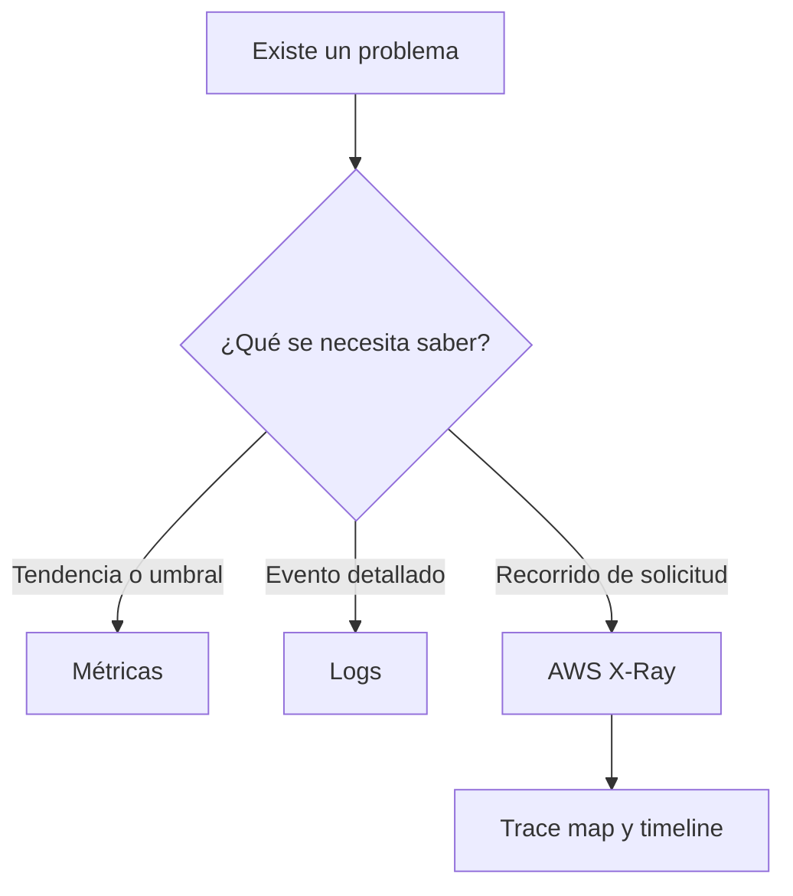
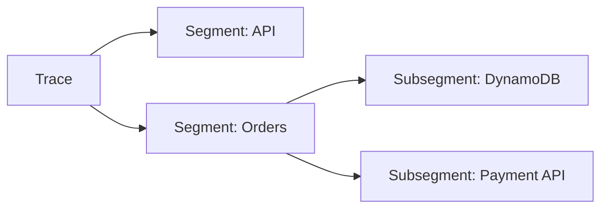
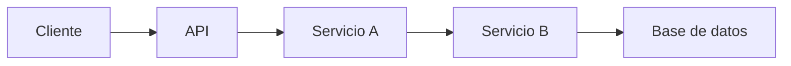
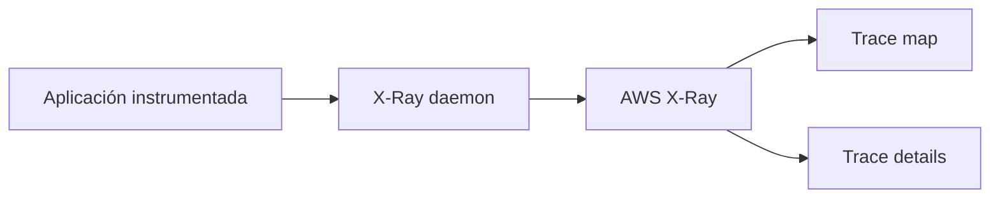
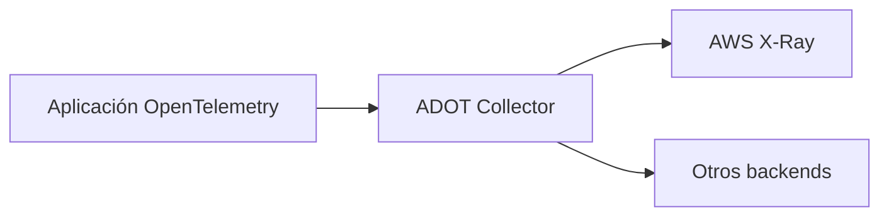
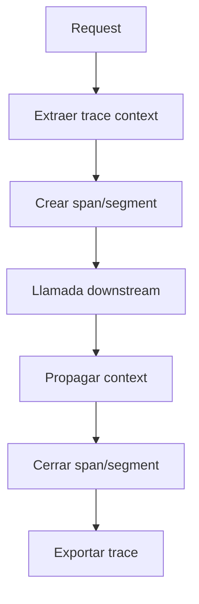
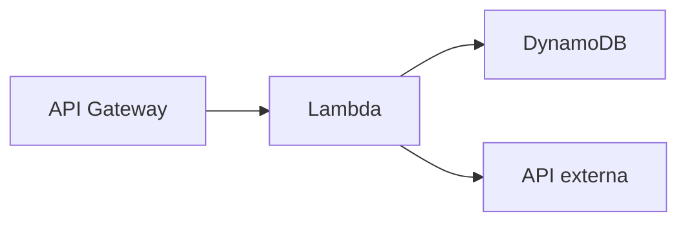
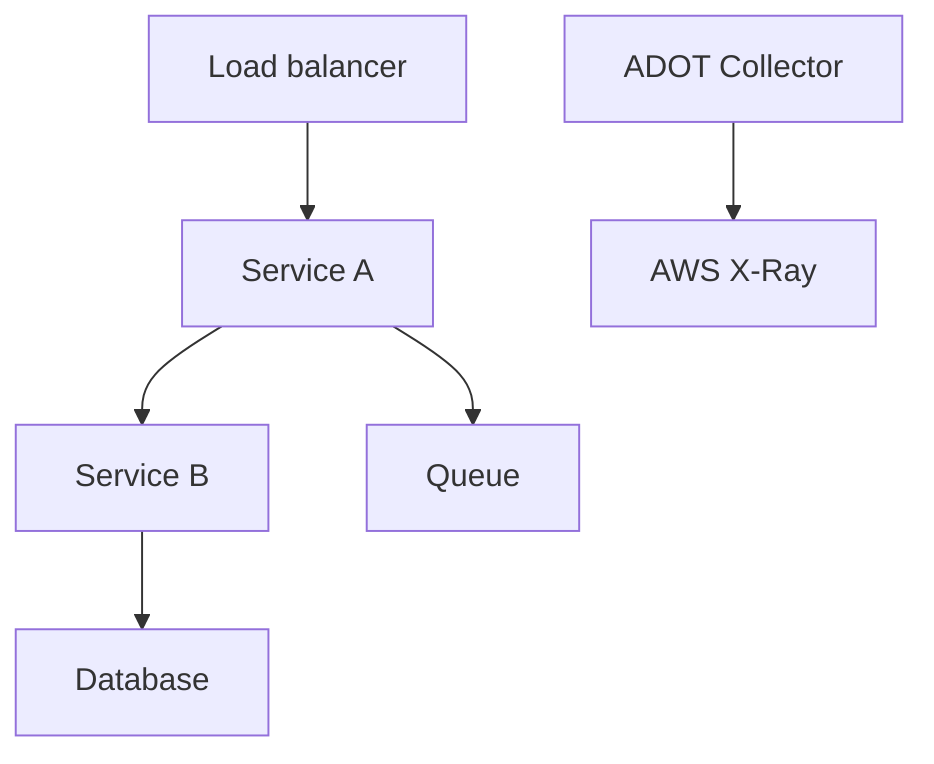
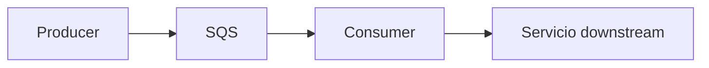
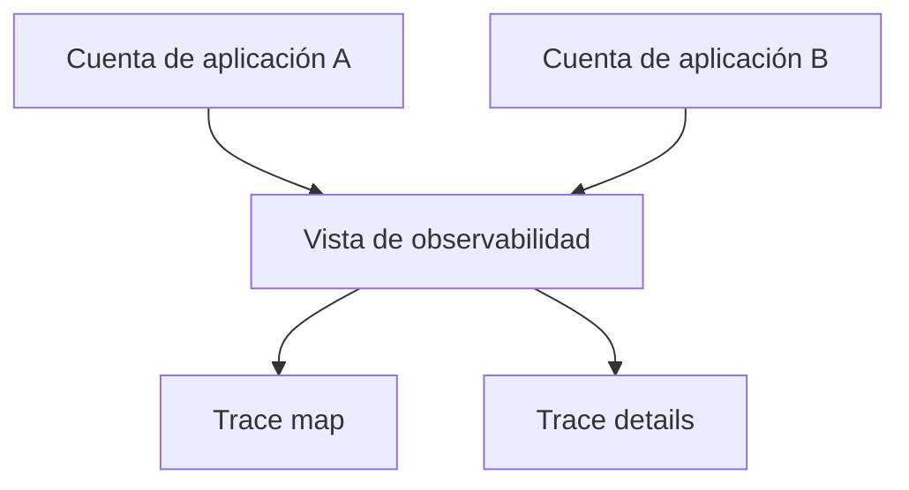

# Developer Tools en AWS para el examen SAA-C03

## 1. Alcance necesario para el examen

Esta guía desarrolla únicamente el siguiente servicio de **Developer Tools**:

- AWS X-Ray

El examen evalúa principalmente la capacidad de:

- Identificar cuándo se necesita distributed tracing.
- Seguir una solicitud a través de APIs, funciones, microservicios, bases de datos y servicios AWS.
- Diferenciar trace, segment, subsegment, span y service map.
- Propagar un trace context entre componentes.
- Analizar latencia, errores, faults y throttling.
- Configurar active tracing en servicios compatibles.
- Elegir una estrategia de sampling que controle costo y volumen.
- Diferenciar annotations y metadata.
- Buscar trazas mediante filter expressions.
- Crear groups para aislar aplicaciones o tipos de solicitud.
- Instrumentar workloads en Lambda, EC2, ECS y EKS.
- Distinguir X-Ray de logs y métricas de CloudWatch.
- Aplicar IAM, cifrado, red privada y protección de datos.
- Reconocer la transición de los X-Ray SDKs y el daemon hacia OpenTelemetry.

> **Alcance:** otros servicios pueden aparecer como fuentes, destinos o integraciones —por ejemplo, Amazon CloudWatch, AWS CloudTrail, AWS Lambda, Amazon API Gateway, Elastic Load Balancing, Amazon ECS, Amazon EKS, Amazon EC2, Amazon SQS, Amazon SNS, AWS Step Functions, AWS Distro for OpenTelemetry o AWS KMS—, pero no se desarrollan como servicios principales en este capítulo.

> **Actualización importante:** AWS X-Ray continúa disponible. Lo que está en transición son los **AWS X-Ray SDKs y el X-Ray daemon**: entraron en maintenance mode el **25 de febrero de 2026**. El timeline vigente no especifica una fecha de finalización y AWS recomienda OpenTelemetry para instrumentación nueva.

---

## 2. Modelos fundamentales de observabilidad

### Los tres pilares

| Señal | Pregunta que responde | Ejemplo |
|---|---|---|
| Métricas | ¿Cuánto o con qué frecuencia ocurre? | Latencia p95, errores por minuto |
| Logs | ¿Qué evento o mensaje produjo el componente? | Stack trace de una excepción |
| Trazas | ¿Por dónde pasó una solicitud y cuánto tardó cada dependencia? | API → Lambda → DynamoDB |

> **Regla de examen:** CloudWatch metrics indican que existe un problema; logs muestran eventos de componentes; X-Ray ayuda a localizar en qué parte del recorrido distribuido se produjo la latencia o el error.

### Monitoreo frente a observabilidad

| Monitoreo | Observabilidad |
|---|---|
| Revisa condiciones conocidas | Investiga estados no previstos |
| Usa dashboards y alarms | Correlaciona metrics, logs y traces |
| Detecta un síntoma | Ayuda a descubrir causa y dependencias |
| Ejemplo: CPU alta | Ejemplo: llamada lenta a un servicio downstream |

### Regla mental inicial



### Distributed tracing

En una aplicación distribuida, una sola solicitud puede atravesar:

1. Load balancer.
2. API.
3. Servicio de autenticación.
4. Microservicio.
5. Queue o topic.
6. Base de datos.
7. API externa.

Distributed tracing relaciona el trabajo realizado por esos componentes mediante un identificador común.

### Latencia end-to-end

La latencia total no es únicamente el tiempo de ejecución del primer servicio:

$$
\text{Latencia total} \approx \sum \text{tiempos de procesamiento} + \sum \text{esperas de red y dependencias}
$$

Las llamadas paralelas no se suman de la misma forma que las secuenciales. El timeline de una trace permite observar:

- Dependencias secuenciales.
- Llamadas paralelas.
- Retries.
- Cold starts.
- Tiempo de red.
- Servicio que domina la critical path.

### Synchronous frente a asynchronous tracing

| Flujo síncrono | Flujo asíncrono |
|---|---|
| El caller espera la respuesta | El producer continúa después de publicar |
| Parent-child directo | Puede existir un vínculo entre trazas |
| La latencia downstream afecta al caller | El tiempo en queue forma parte de la experiencia del evento |
| Ejemplo: HTTP | Ejemplo: SQS |

Un flujo asíncrono puede mostrarse como trazas relacionadas en lugar de un único stack síncrono. Se debe propagar el contexto mediante la integración compatible.

---

## 3. Conceptos de tracing que se deben dominar

### Trace

Una **trace** representa el recorrido completo de una solicitud.

- Comparte un trace ID.
- Contiene segments de los servicios participantes.
- Puede incluir subsegments de dependencias.
- Registra tiempos, estado y atributos.
- Se construye únicamente con los componentes que envían datos o propagan contexto.

### Segment

Un **segment** representa el trabajo que un servicio realiza para atender una solicitud:

| Dato | Ejemplo |
|---|---|
| Name | `orders-service` |
| Trace ID | Identificador de la trace |
| Segment ID | Identificador del trabajo del servicio |
| Start/end time | Duración |
| HTTP data | Método, URL y status |
| AWS data | Recurso o operación |
| Error flags | Error, fault o throttle |
| Annotations | Datos indexados |
| Metadata | Datos no indexados |

### Subsegment

Un **subsegment** representa trabajo interno o una llamada downstream:

- Consulta a una base.
- Llamada mediante AWS SDK.
- Request a una API externa.
- Operación interna importante.
- Lógica que se desea medir de forma separada.



### Segment frente a subsegment

| Segment | Subsegment |
|---|---|
| Trabajo de un servicio | Parte del trabajo de ese servicio |
| Puede crear un node en el map | Aporta detalle al segment |
| Atiende una request | Mide una dependencia u operación |
| Documento principal | Documento embebido o independiente asociado |

### Span en OpenTelemetry

OpenTelemetry utiliza el concepto de **span**:

- Representa una unidad de trabajo.
- Incluye inicio, fin, atributos y estado.
- Mantiene relaciones parent-child.
- Un conjunto de spans forma una trace.
- Al exportar hacia X-Ray, la telemetría se representa en su modelo compatible.

> **Trampa de examen:** span es la terminología habitual de OpenTelemetry; segment y subsegment son términos propios del modelo de X-Ray.

### Service graph, trace map y timeline

| Vista | Utilidad |
|---|---|
| Service graph/trace map | Visualiza nodes, edges, latencia y errores |
| Trace list | Encuentra solicitudes concretas |
| Trace details | Inspecciona una solicitud |
| Timeline | Muestra duración y orden de segments/subsegments |

El graph se construye a partir de las traces recibidas. Un componente no instrumentado puede producir:

- Hueco en el recorrido.
- Dependencia sin detalle.
- Node genérico.
- Trace parcial.

### Nodes y edges

- **Node:** servicio o recurso que participa.
- **Edge:** conexión entre dos nodes.
- Los colores o indicadores ayudan a reconocer estado y errores.
- El grosor y las estadísticas dependen de las solicitudes observadas.
- Un mapa representa únicamente el tráfico muestreado, no todas las solicitudes.

### Trace ID y tracing header

X-Ray propaga contexto mediante el header:

```text
X-Amzn-Trace-Id: Root=1-5759e988-bd862e3fe1be46a994272793;Parent=53995c3f42cd8ad8;Sampled=1
```

| Campo | Función |
|---|---|
| `Root` | Trace ID |
| `Parent` | Segment o span que realiza la llamada |
| `Sampled` | Decisión de registrar la solicitud |

El formato de trace ID de X-Ray incluye:

- Versión.
- Parte temporal en hexadecimal.
- Identificador único.

X-Ray también admite trace IDs originados por frameworks compatibles con W3C Trace Context cuando se convierten al formato requerido.

### Propagación de contexto



Para mantener una sola trace:

- El servicio receptor lee el contexto.
- Crea su segment o span.
- El caller añade el contexto a la llamada downstream.
- La decisión de sampling se conserva.
- Protocolos asíncronos utilizan mecanismos compatibles de propagación.

Si un servicio genera un trace ID nuevo en cada salto, se pierde la correlación end-to-end.

### Error, fault y throttle

| Categoría X-Ray | Significado habitual |
|---|---|
| Error | Respuesta 4xx |
| Fault | Respuesta 5xx |
| Throttle | Respuesta 429 o throttling |
| Exception | Excepción capturada con detalle disponible |

Un status 4xx no siempre es un defecto del servidor, pero ayuda a identificar patrones como autenticación fallida o rutas inexistentes.

---

## 4. AWS X-Ray

AWS X-Ray recopila datos de solicitudes atendidas por una aplicación y permite visualizar, filtrar y analizar el recorrido por servicios, recursos y dependencias.

### Qué permite resolver

- Localizar bottlenecks.
- Identificar dependencia lenta.
- Analizar errores distribuidos.
- Ver retries y throttling.
- Comparar latencia entre rutas.
- Investigar cold starts.
- Entender dependencias de una aplicación.
- Filtrar solicitudes de un tenant, operación o versión.
- Correlacionar una trace con logs y métricas.

### Arquitectura clásica



En el modelo histórico:

1. El X-Ray SDK instrumenta la aplicación.
2. Crea segment documents.
3. Envía los documentos al daemon local.
4. El daemon agrupa y transmite datos al servicio X-Ray.
5. X-Ray construye traces y service graph.

### Arquitectura actual con OpenTelemetry



Ventajas:

- Estándar abierto.
- Instrumentación portable.
- Auto-instrumentation disponible para escenarios compatibles.
- Un collector puede procesar y exportar telemetría.
- Correlación con otras señales y destinos.

> **Regla vigente:** para una aplicación nueva se prioriza OpenTelemetry/ADOT. Los conceptos de trace, sampling, propagation y service map siguen siendo necesarios para entender X-Ray y responder el examen.

### Estado de SDKs y daemon

| Componente | Estado en julio de 2026 |
|---|---|
| Servicio AWS X-Ray | Disponible |
| X-Ray console/capacidades dentro de CloudWatch | Disponible |
| X-Ray SDKs | Maintenance mode |
| X-Ray daemon | Maintenance mode |
| Final del maintenance mode | No especificado en el timeline vigente |
| Instrumentación recomendada | OpenTelemetry |

Maintenance mode significa que AWS limita releases principalmente a correcciones de seguridad críticas. No significa que el servicio X-Ray se haya cerrado.

### Instrumentación

La instrumentación puede incluir:

| Área | Qué captura |
|---|---|
| Incoming request | Método, path, status y duración |
| AWS SDK client | Servicio, operación y recurso |
| HTTP client | Host, URL y status downstream |
| Database | Operación y tiempo |
| Custom code | Subsegment definido por el equipo |
| Exception | Tipo, mensaje y stack disponible |

### Instrumentation patterns

| Patrón | Descripción |
|---|---|
| Manual | El código crea spans/subsegments explícitamente |
| Library/framework | Middleware intercepta requests y clients |
| Auto-instrumentation | Un agent instrumenta librerías compatibles |
| AWS service integration | El servicio crea o propaga tracing automáticamente |

No se debe instrumentar cada función pequeña. Se priorizan:

- Boundaries de servicios.
- Dependencias externas.
- Consultas relevantes.
- Operaciones de negocio importantes.
- Procesos que explican la critical path.

### Integración de servicios

X-Ray distingue niveles de integración:

| Integración | Comportamiento |
|---|---|
| Active instrumentation | Decide sampling e instrumenta requests |
| Passive instrumentation | Registra requests muestreadas upstream |
| Request tracing | Añade o propaga tracing header |

La capacidad exacta varía por servicio. Se debe comprobar si el servicio:

- Genera segments.
- Solo propaga el header.
- Ejecuta un collector o daemon.
- Necesita configuración explícita.

### Active tracing

Active tracing:

- Habilita la integración en el servicio.
- Permite iniciar traces según sampling.
- Añade datos del servicio al recorrido.
- No instrumenta automáticamente todo el código custom.
- Sigue necesitando permisos para enviar telemetría cuando corresponde.

### AWS Lambda

Al habilitar active tracing:

- Lambda recibe y propaga el trace context.
- Aparecen nodes relacionados con el servicio Lambda y la función.
- Se puede separar overhead de plataforma y ejecución.
- La función puede instrumentar llamadas downstream.
- El execution role necesita permisos compatibles para enviar traces.

X-Ray ayuda a identificar:

- Cold start.
- Tiempo de inicialización.
- Duración de handler.
- Llamada lenta downstream.
- Error de la función.

> **Trampa de examen:** habilitar active tracing en Lambda no garantiza detalle dentro de todas las librerías; la aplicación debe estar instrumentada para crear spans o subsegments de su código y dependencias.

### Amazon API Gateway

- API Gateway admite active tracing con X-Ray para REST APIs.
- Se habilita en el stage.
- Aplica a endpoint types compatibles, incluidos Regional, edge-optimized y private.
- Añade un trace header si la solicitud no tiene uno.
- Permite observar el recorrido desde API Gateway hacia el backend.

Se puede analizar:

- Tiempo en API Gateway.
- Integration latency.
- Status devuelto.
- Backend invocado.
- Errores de autorización o integración.

> **Trampa de examen:** la documentación de X-Ray especifica esta integración para **REST APIs**. No se debe asumir que active tracing funciona igual en todos los tipos de API Gateway.

### Application Load Balancer

Application Load Balancer añade o actualiza `X-Amzn-Trace-Id`:

- Ayuda a correlacionar la solicitud.
- Proporciona un trace ID al backend.
- No equivale por sí solo a instrumentar la aplicación.
- El backend debe capturar y propagar el contexto.

### Amazon EC2

Modelo histórico:

- SDK dentro de la aplicación.
- Daemon en la instancia.
- Instance profile para enviar datos.
- User data o servicio del sistema para iniciar el daemon.

Modelo actual:

- OpenTelemetry SDK o auto-instrumentation.
- ADOT Collector en host o entorno administrado.
- IAM role de la instancia.
- Endpoint de ingestión accesible.

### Amazon ECS

Patrones:

| Patrón | Descripción |
|---|---|
| Sidecar | Collector/daemon junto a la aplicación |
| Daemon service | Un collector por container instance compatible |
| Fargate sidecar | Collector dentro de la task |

Se debe configurar:

- Task role o execution role según quién llama a la API.
- Network mode y endpoint del collector.
- Variables de entorno.
- Resource limits del sidecar.
- Health checks.
- Logs y métricas del collector.

### Amazon EKS

Patrones:

- Collector como DaemonSet.
- Collector como sidecar.
- Gateway collector central.
- Auto-instrumentation mediante operator compatible.

Controles:

- IAM Roles for Service Accounts o EKS Pod Identity.
- Namespace y service account.
- Network policy.
- Resource requests/limits.
- Escalabilidad del collector.
- No incluir secretos en attributes.

### Amazon SQS

SQS puede propagar el X-Ray trace header:

- Producer envía el mensaje.
- Queue conserva el system attribute compatible.
- Consumer continúa el contexto.
- El map puede relacionar producer y consumer.
- La espera en la queue debe interpretarse como flujo asíncrono.

No se debe guardar el header como business payload si existe el mecanismo nativo compatible.

### Amazon SNS y AWS Step Functions

- SNS puede participar en recorridos distribuidos según integración.
- Step Functions puede habilitar tracing para visualizar state transitions y servicios invocados.
- La configuración se aplica al recurso.
- Las tareas downstream también deben propagar o registrar contexto.
- Una integración parcial produce un trace parcial.

### Sampling

Registrar el 100% de solicitudes puede ser costoso e innecesario. Sampling selecciona qué requests se trazan.

#### Sampling head-based

- La decisión se toma cerca del inicio de la solicitud.
- Se propaga downstream.
- Todos los componentes respetan el flag.
- Reduce volumen de forma temprana.
- Puede omitir una anomalía si la solicitud no fue seleccionada.

#### Elementos de una sampling rule

| Elemento | Función |
|---|---|
| Priority | Orden de evaluación |
| Service name/type | Servicio objetivo |
| Host | Hostname |
| HTTP method | Método |
| URL path | Ruta |
| Resource ARN | Recurso |
| Reservoir/fixed target | Mínimo objetivo antes del porcentaje |
| Fixed rate | Porcentaje de requests adicionales |

Las custom rules se evalúan por prioridad. La primera coincidencia determina la decisión; si ninguna coincide se utiliza la default rule.

#### Default rule histórica

La configuración predeterminada conocida de los SDKs de X-Ray registra:

- La primera solicitud por segundo.
- El 5 % de solicitudes adicionales.

La regla se puede modificar. No se debe asumir que un entorno mantiene el default.

#### Centralized frente a local sampling

| Centralized | Local |
|---|---|
| Cuota coordinada por X-Ray | Cada host aplica su propia regla |
| Controla mejor el volumen total | El fixed target se multiplica por instancias |
| Requiere acceso a sampling APIs | Funciona como fallback |
| Recomendado para flotas | Útil si no existe conectividad central |

#### Adaptive sampling

Adaptive sampling puede aumentar temporalmente el muestreo para capturar anomalías dentro de límites configurados:

- Mantiene costo controlado en operación normal.
- Eleva visibilidad durante incidentes.
- Se basa en sampling rules.
- Sigue siendo head-based.
- Requiere definir máximo y comportamiento de boost.

> **Trampa de examen:** sampling reduce el volumen de traces; no reduce el tráfico real de la aplicación ni corrige la latencia.

### Annotations

Annotations son pares key-value indexados:

- String.
- Number.
- Boolean.

Se utilizan para buscar y agrupar:

- `tenant_id`.
- `operation`.
- `order_type`.
- `deployment_version`.
- `region_role`.

X-Ray indexa hasta 50 annotations por trace. Se deben elegir campos con valor operacional.

### Metadata

Metadata:

- Acepta información más compleja.
- Puede incluir objetos y listas.
- No se indexa.
- Se visualiza al inspeccionar la trace.
- Sirve para contexto que no se necesita buscar.

### Annotations frente a metadata

| Annotations | Metadata |
|---|---|
| Indexadas | No indexada |
| Permiten filter expressions | Requiere abrir la trace |
| Valores escalares | Valores complejos |
| Límite de annotations indexadas | Mayor flexibilidad estructural |
| Aumentan costo de búsqueda/valor operacional | Aportan detalle |

> **Regla de examen:** si se necesita **buscar** una trace por un atributo, utilizar annotation. Si solo se necesita mostrar contexto al abrirla, utilizar metadata.

### Protección de datos

No incluir:

- Passwords.
- Access keys.
- Tokens.
- Números completos de tarjetas.
- Payloads con PII innecesaria.
- SQL con datos sensibles.
- Headers de autorización.

Tanto annotations como metadata forman parte de los datos de tracing y deben tratarse como información sensible.

### Filter expressions

Permiten encontrar traces por:

- Service.
- URL.
- Response time.
- Error, fault o throttle.
- HTTP status.
- User.
- Resource ARN.
- Annotation.

Ejemplo conceptual:

```text
service("orders-service") { fault = true OR responsetime >= 2 }
```

Las filter expressions consultan campos indexados. Metadata no puede usarse como filtro.

### Groups

Un group es una colección dinámica de traces definida por una filter expression:

- Crea una vista específica del service graph.
- Permite métricas de grupo.
- Aísla una aplicación o tenant.
- Facilita estudiar faults o requests lentas.
- Puede habilitar Insights.

Ejemplos:

| Group | Filter |
|---|---|
| Checkout lento | Response time superior al threshold |
| Fallos de pagos | Faults del payment service |
| Versión canary | Annotation `version=canary` |
| Cliente premium | Annotation `tier=premium` |

Actualizar la expresión afecta traces posteriores; no reclasifica de forma retroactiva todo lo ya registrado.

### X-Ray Insights

Insights analiza traces de un group para detectar anomalías:

- Aumento de fault rate.
- Servicios afectados.
- Dependencias relacionadas.
- Inicio y duración aproximados del incidente.
- Root cause probable dentro de lo observado.

Insights no sustituye:

- Alarmas.
- Runbooks.
- Logs.
- Métricas.
- Investigación humana.

### Trace analytics

Permite comparar conjuntos de traces:

- Successful frente a failed.
- Versión anterior frente a nueva.
- Rutas rápidas frente a lentas.
- Grupo de clientes frente a otro.

Una comparación útil requiere annotations consistentes y sampling representativo.

### Trace retention y disponibilidad

- X-Ray conserva traces durante un período administrado por el servicio.
- No debe usarse como archivo de auditoría permanente.
- Los datos se consultan en la región donde se enviaron.
- La observabilidad multirregional requiere consultar o centralizar vistas de manera explícita.
- La visibilidad cross-account se configura; no aparece automáticamente.

### Consola de X-Ray y CloudWatch

Las experiencias de tracing se integran cada vez más en CloudWatch:

- Trace map.
- Trace list.
- Trace details.
- Correlación con logs.
- Application observability.

Esto no convierte una trace en un log ni una métrica. Las señales conservan funciones diferentes.

---

## 5. Flujo de instrumentación

### Aplicación HTTP



### Pasos

1. Instrumentar incoming requests.
2. Excluir health checks si generan ruido.
3. Instrumentar AWS SDK y HTTP clients.
4. Añadir custom spans solo en operaciones importantes.
5. Propagar contexto.
6. Definir sampling.
7. Añadir annotations útiles.
8. Desplegar collector.
9. Conceder permisos.
10. Validar end-to-end en el trace map.

### Validación

No basta con comprobar que “aparece una trace”. Se debe validar:

- Trace ID consistente.
- Parent-child correcto.
- Servicios esperados.
- Duraciones realistas.
- Errores clasificados.
- Attributes sin secretos.
- Sampling aplicado.
- Collector estable.
- Consulta mediante annotation.
- Correlación con logs.

---

## 6. Seguridad, resiliencia y operación

### IAM

Separar permisos:

| Actor | Permisos conceptuales |
|---|---|
| Aplicación/collector | Enviar segments y telemetry |
| Operador | Leer traces y service maps |
| Administrador | Gestionar sampling, groups y encryption |
| Auditor | Consultar configuración y CloudTrail |

Acciones habituales de escritura:

- `xray:PutTraceSegments`
- `xray:PutTelemetryRecords`

Sampling centralizado puede requerir:

- `xray:GetSamplingRules`
- `xray:GetSamplingTargets`
- `xray:GetSamplingStatisticSummaries`

Se debe preferir un role del workload sobre access keys estáticas.

### Cifrado

X-Ray cifra trace data:

| Opción | Característica |
|---|---|
| Cifrado predeterminado | Administrado por el servicio |
| AWS managed KMS key | Key administrada por AWS |
| Customer managed KMS key | Mayor control de policy y lifecycle |

- X-Ray no admite asymmetric KMS keys para esta configuración.
- La key debe estar en estado utilizable.
- La key policy debe permitir el uso requerido.
- Cambiar o deshabilitar la key puede afectar acceso a traces.
- KMS genera costos adicionales.

### Red privada

- Se pueden utilizar VPC endpoints compatibles para acceder a APIs de X-Ray sin internet público.
- Security groups y DNS deben permitir la comunicación.
- Private endpoint no concede permisos IAM.
- El collector necesita acceso al endpoint de ingestión y a sampling APIs cuando las utiliza.
- Se debe considerar el endpoint regional correcto.

### Resiliencia del collector

- Definir memory limits.
- Usar batching.
- Configurar retry con backoff.
- Limitar queue interna.
- Monitorear dropped spans.
- Distribuir collectors.
- Evitar que una falla de observabilidad detenga la aplicación.

> **Principio:** la telemetría es importante, pero el pipeline de tracing no debe convertirse en una dependencia crítica de la request de negocio.

### Idempotencia y duplicados

La instrumentación debe evitar:

- Crear dos spans para el mismo middleware.
- Instrumentar dos veces el mismo HTTP client.
- Ejecutar X-Ray SDK y OpenTelemetry auto-instrumentation sobre la misma librería sin control.
- Exportar la misma trace por dos pipelines.

La doble instrumentación produce nodes duplicados, tiempos confusos y costos innecesarios.

### Multi-account

- Cada workload envía traces con su identidad y región.
- Se puede configurar observabilidad cross-account.
- Los roles de visualización deben limitar cuentas y recursos.
- Los atributos deben incluir contexto útil sin exponer datos.
- La centralización no reemplaza IAM en las cuentas fuente.

### CloudTrail y AWS Config

- CloudTrail registra operaciones API administrativas compatibles.
- AWS Config puede registrar cambios de configuración de encryption de X-Ray.
- X-Ray trace data no reemplaza un audit log.
- Para saber quién modificó una sampling rule se utiliza auditoría de control plane.

---

## 7. Troubleshooting con AWS X-Ray

### Método de investigación

1. Definir la ventana temporal.
2. Identificar endpoint u operación.
3. Filtrar errors, faults o alta latencia.
4. Abrir una trace representativa.
5. Revisar service map.
6. Analizar timeline.
7. Encontrar critical path.
8. Abrir logs correlacionados.
9. Comparar con una trace exitosa.
10. Validar cambio o dependencia reciente.

### Latencia alta

Buscar:

- Segment más largo.
- Subsegment downstream.
- Llamadas secuenciales evitables.
- Retry.
- Connection timeout.
- Cold start.
- Queue wait.
- Throttling.
- Consultas repetidas.

### Faults

Buscar:

- Node con mayor fault rate.
- Primera dependencia que falla.
- Status 5xx.
- Exception y stack.
- Error propagado frente a error originado.
- Correlación con deployment.

### Throttling

X-Ray puede mostrar throttle en:

- Aplicación.
- API.
- Servicio AWS downstream.
- Base o queue compatible.

La solución puede requerir:

- Backoff y jitter.
- Reducir concurrencia.
- Solicitar cuota.
- Aplicar caching.
- Aumentar capacidad.
- Corregir hot partition.

X-Ray ayuda a localizar el throttle, pero no aplica la corrección automáticamente.

### Trace incompleta

Posibles causas:

- Servicio no instrumentado.
- Header no propagado.
- Sampling inconsistente.
- Collector/daemon sin conectividad.
- Permisos IAM insuficientes.
- Proceso terminó antes de exportar.
- Queue perdió el system attribute.
- SDK o agent incompatible.
- Clock skew.

### No aparecen traces

Revisar:

1. Active tracing.
2. Instrumentación.
3. Sampling.
4. Role del workload.
5. Endpoint/región.
6. Collector health.
7. Security group/proxy.
8. Logs del collector.
9. Consulta y ventana temporal.
10. KMS key.

### Demasiados nodes

Posibles causas:

- Nombre de segment dinámico.
- URL con identificadores dentro del path.
- Hostnames variables.
- Instrumentación duplicada.
- Librería creando dependencias por request.

Buenas prácticas:

- Nombres estables.
- IDs como annotations, no como nombre del servicio.
- Groups para separar vistas.
- Normalizar rutas.

### Riesgo de alta cardinalidad

No utilizar como nombre o annotation indiscriminada:

- UUID de cada request.
- Token.
- Timestamp único.
- Payload completo.
- URL con ID sin normalizar.

Alta cardinalidad dificulta consultas, aumenta volumen y puede exponer información.

---

## 8. Arquitecturas habituales

### API serverless



Configuración:

- Active tracing en API Gateway REST stage.
- Active tracing en Lambda.
- OpenTelemetry o instrumentación compatible en la función.
- Context propagation en HTTP client.
- Annotation para business operation.

### Microservicios en contenedores



Cada servicio:

- Recibe el trace context.
- Crea spans.
- Propaga el contexto.
- Exporta al collector.
- Usa nombres estables.

### Flujo asíncrono



La trace permite relacionar:

- Tiempo del producer.
- Publicación.
- Espera en queue.
- Ejecución del consumer.
- Dependencia downstream.

### Observabilidad cross-account



Requiere configuración de linking y permisos; no ocurre solo por usar AWS Organizations.

---

## 9. Matriz de decisión

| Requisito del escenario | Respuesta probable | Razón |
|---|---|---|
| Seguir una request por microservicios | AWS X-Ray | Distributed tracing |
| Ver dependencia lenta | Trace timeline | Duración por segment/subsegment |
| Visualizar servicios y conexiones | Trace map/service graph | Nodes y edges |
| Buscar solicitudes de un tenant | Annotation | Campo indexado |
| Guardar contexto complejo sin buscarlo | Metadata | No indexada |
| Controlar volumen de traces | Sampling rules | Reservoir y fixed rate |
| Mantener mínimo y porcentaje adicional | Reservoir + rate | Regla de sampling |
| Separar mapa de checkout | X-Ray group | Filter expression |
| Detectar incremento anómalo de faults | X-Ray Insights | Análisis del group |
| Trazar API Gateway hacia Lambda | Active tracing | Integración administrada |
| Trazar REST API privada | API Gateway active tracing | Compatible con private endpoint type |
| Analizar cold start | Lambda trace | Nodes de servicio y función |
| Propagar desde producer a consumer | Trace header de SQS | Continuidad asíncrona |
| Instrumentar aplicación nueva | OpenTelemetry/ADOT | Ruta recomendada vigente |
| Aplicación antigua con X-Ray SDK | Planificar migración | Componente en maintenance mode |
| Saber quién cambió una sampling rule | CloudTrail | Auditoría de API |
| Alertar por latencia p95 | CloudWatch alarm | Métrica y threshold |
| Leer stack trace completo del proceso | Logs correlacionados | Detalle de eventos |
| Cifrar traces con control propio | Customer managed KMS key | Key policy y lifecycle |

---

## 10. Diferencias que suelen generar errores

### X-Ray frente a CloudWatch metrics

| AWS X-Ray | CloudWatch metrics |
|---|---|
| Solicitudes muestreadas | Series de tiempo agregadas |
| Recorrido end-to-end | Valor por período |
| Segments y subsegments | Dimensions |
| Root cause distribuido | Alarmas y tendencias |

### X-Ray frente a CloudWatch Logs

| AWS X-Ray | CloudWatch Logs |
|---|---|
| Estructura de trace | Eventos textuales o estructurados |
| Contexto entre servicios | Detalle de un componente |
| Muestreo | Ingestion definida por logging |
| Timeline | Log stream y timestamp |

Se complementan mediante trace ID en los logs.

### Segment frente a subsegment

- Segment representa un servicio.
- Subsegment representa trabajo interno o downstream.
- Crear muchos subsegments sin valor aumenta volumen.
- Un downstream instrumentado puede tener su propio segment además del subsegment del caller.

### Annotation frente a metadata

- Annotation se indexa.
- Metadata no se indexa.
- Annotation acepta valores simples.
- Metadata admite objetos.
- Ninguna debe contener secretos.

### Sampling frente a filtering

| Sampling | Filtering |
|---|---|
| Decide qué se registra | Decide qué se consulta |
| Ocurre durante la request | Ocurre después |
| Reduce costo y volumen | Reduce resultados mostrados |
| Puede omitir traces | No recupera una trace no muestreada |

### Active tracing frente a instrumentation

- Active tracing habilita integración del servicio.
- Instrumentation añade detalle de código y dependencias.
- Se pueden necesitar ambas.
- Activar X-Ray no crea automáticamente spans de cada función interna.

### Tracing header frente a trace data

- Header mantiene el contexto.
- Segment/span describe trabajo.
- ALB puede añadir header sin enviar un segment completo.
- Propagar header sin exportar datos produce continuidad limitada.

### Error frente a fault

- Error suele corresponder a 4xx.
- Fault suele corresponder a 5xx.
- Throttle identifica 429 o throttling.
- Un 4xx esperado puede seguir clasificándose como error técnico.

### SDK/daemon frente al servicio X-Ray

| X-Ray SDK/daemon | Servicio X-Ray |
|---|---|
| Componentes de instrumentación/export | Backend administrado |
| Maintenance mode desde 2026 | Disponible |
| Sin nuevas feature enhancements | Servicio X-Ray disponible |
| Migrar a OpenTelemetry | Recibe y visualiza traces |

> **Trampa de examen:** el maintenance mode de SDKs/daemon no significa el fin de AWS X-Ray.

### X-Ray SDK frente a OpenTelemetry

| X-Ray SDK | OpenTelemetry |
|---|---|
| Específico de X-Ray | Estándar abierto |
| Segment/subsegment | Span |
| Daemon histórico | Collector |
| En transición | Recomendado |
| Menor portabilidad | Múltiples exporters |

### Logs de auditoría frente a traces

- CloudTrail registra llamadas API y cambios.
- X-Ray rastrea solicitudes de aplicación.
- Una trace no demuestra quién modificó una configuración.
- Un management event no muestra la latencia interna de una request.

---

## 11. Optimización de costos

### Factores principales

Los costos se relacionan con:

- Traces registradas.
- Traces recuperadas.
- Traces escaneadas por consultas.
- Groups y análisis.
- KMS.
- Compute del collector.
- Logs y métricas correlacionados.

### Sampling

- No trazar 100 % sin justificación.
- Mantener un reservoir para tráfico bajo.
- Aplicar fixed rate a volumen adicional.
- Crear reglas específicas para operaciones críticas.
- Excluir health checks.
- Revisar adaptive sampling cuando se requiere capturar anomalías.
- Medir el efecto antes de aumentar la tasa.

### Instrumentación

- No crear subsegments para operaciones triviales.
- Evitar atributos duplicados.
- No incluir payloads completos.
- Limitar stack traces innecesarios.
- Eliminar doble instrumentación.
- Utilizar batch export.

### Consultas

- Acotar la ventana temporal.
- Usar filter expressions selectivas.
- Buscar por annotations.
- Evitar escanear grandes períodos repetidamente.
- Crear groups con propósito operacional.

### Collector

- Right-size CPU y memoria.
- Aplicar batching y queue limits.
- Compartir collector cuando el aislamiento lo permite.
- Escalar según spans por segundo.
- Monitorear dropped spans.

### KMS

- Utilizar customer managed key solo cuando el requisito de control lo necesita.
- Incluir requests KMS y almacenamiento de key en el costo.
- Evitar cambios frecuentes de configuración sin necesidad.

---

## 12. Estrategia para responder preguntas SAA-C03

### Método de decisión

1. **Identificar la señal necesaria:** metric, log o trace.
2. **Definir el inicio y final de la request.**
3. **Identificar servicios participantes.**
4. **Verificar propagación de context.**
5. **Habilitar active tracing donde corresponda.**
6. **Instrumentar código y clients.**
7. **Definir sampling.**
8. **Elegir annotations buscables.**
9. **Aplicar IAM, KMS y red.**
10. **Validar mapa, timeline y costos.**

### Palabras clave

| Pista en la pregunta | Respuesta probable |
|---|---|
| Distributed tracing | AWS X-Ray |
| Service map, nodes, edges | X-Ray trace map |
| End-to-end request | Trace |
| Service handling request | Segment |
| Downstream call | Subsegment |
| Searchable business attribute | Annotation |
| Complex non-searchable context | Metadata |
| Reservoir, fixed rate | Sampling rule |
| Filtered collection of traces | Group |
| Anomalous fault rate | Insights |
| `X-Amzn-Trace-Id` | Trace propagation |
| Root, Parent, Sampled | Tracing header |
| 4xx | Error |
| 5xx | Fault |
| 429 | Throttle |
| Lambda cold start | X-Ray trace details |
| New instrumentation | OpenTelemetry/ADOT |
| X-Ray daemon sidecar | Patrón histórico de exportación |
| Audit configuration change | CloudTrail |

### Trampas de redacción

- **“Monitorear CPU”** no requiere X-Ray.
- **“Buscar un mensaje de error”** apunta primero a logs.
- **“Recorrido entre servicios”** apunta a X-Ray.
- **“Filtrar por customer ID”** requiere annotation, no metadata.
- **“Sampling”** no filtra traces ya registradas.
- **“Active tracing”** no instrumenta todo el código.
- **“Trace header”** no es un segment.
- **“ALB agrega trace ID”** no significa que genera todo el service map.
- **“REST API”** no debe generalizarse a cualquier API Gateway API type.
- **“OpenTelemetry”** no elimina el backend X-Ray; puede exportar hacia él.
- **“Maintenance mode del SDK”** no significa que X-Ray esté retirado.
- **“100 % sampling”** no es automáticamente la mejor observabilidad.

---

## 13. Checklist final

Antes del examen, se debe poder explicar sin consultar documentación:

- [ ] Métricas, logs y traces.
- [ ] Distributed tracing.
- [ ] Trace, segment y subsegment.
- [ ] Span en OpenTelemetry.
- [ ] Service graph/trace map.
- [ ] Nodes y edges.
- [ ] Trace timeline.
- [ ] Trace ID.
- [ ] `X-Amzn-Trace-Id`.
- [ ] Root, Parent y Sampled.
- [ ] Context propagation.
- [ ] Synchronous frente a asynchronous tracing.
- [ ] Error, fault, throttle y exception.
- [ ] Arquitectura histórica con X-Ray SDK y daemon.
- [ ] Arquitectura actual con OpenTelemetry y ADOT Collector.
- [ ] Estado de soporte de SDKs y daemon.
- [ ] Active, passive y request tracing.
- [ ] Active tracing en Lambda.
- [ ] Nodes de Lambda y cold start.
- [ ] Active tracing de API Gateway REST APIs.
- [ ] Header añadido por Application Load Balancer.
- [ ] Instrumentación en EC2.
- [ ] Collector/daemon sidecar en ECS.
- [ ] Collector en EKS.
- [ ] Propagación mediante SQS.
- [ ] Sampling head-based.
- [ ] Priority, reservoir y fixed rate.
- [ ] Centralized frente a local sampling.
- [ ] Default sampling rule histórica.
- [ ] Adaptive sampling.
- [ ] Annotation frente a metadata.
- [ ] Filter expressions.
- [ ] Groups.
- [ ] Insights.
- [ ] Prohibición de secretos y PII innecesaria.
- [ ] IAM para enviar y leer traces.
- [ ] KMS encryption.
- [ ] VPC endpoints.
- [ ] Collector batching, retry y dropped spans.
- [ ] Trace incompleta.
- [ ] Diagnóstico de latencia.
- [ ] Diagnóstico de fault y throttle.
- [ ] Alta cardinalidad.
- [ ] X-Ray frente a CloudWatch metrics.
- [ ] X-Ray frente a CloudWatch Logs.
- [ ] X-Ray frente a CloudTrail.
- [ ] Sampling frente a filtering.
- [ ] Active tracing frente a instrumentation.
- [ ] Factores de costo de X-Ray.

---

## Referencias oficiales

### AWS X-Ray

- [¿Qué es AWS X-Ray?](https://docs.aws.amazon.com/xray/latest/devguide/aws-xray.html)
- [Conceptos de AWS X-Ray](https://docs.aws.amazon.com/xray/latest/devguide/xray-concepts.html)
- [Segment documents](https://docs.aws.amazon.com/xray/latest/devguide/xray-api-segmentdocuments.html)
- [Visualización de traces](https://docs.aws.amazon.com/xray/latest/devguide/xray-console-traces.html)
- [Filter expressions](https://docs.aws.amazon.com/xray/latest/devguide/xray-console-filters.html)
- [Configurar groups](https://docs.aws.amazon.com/xray/latest/devguide/xray-console-groups.html)
- [Configurar sampling rules](https://docs.aws.amazon.com/xray/latest/devguide/xray-console-sampling.html)
- [Sampling mediante API](https://docs.aws.amazon.com/xray/latest/devguide/xray-api-sampling.html)
- [Adaptive sampling](https://docs.aws.amazon.com/xray/latest/devguide/xray-adaptive-sampling.html)

### Instrumentación e integraciones

- [Instrumentar una aplicación](https://docs.aws.amazon.com/xray/latest/devguide/xray-instrumenting-your-app.html)
- [Integración con servicios AWS](https://docs.aws.amazon.com/xray/latest/devguide/xray-services.html)
- [AWS Lambda y X-Ray](https://docs.aws.amazon.com/xray/latest/devguide/xray-services-lambda.html)
- [Amazon API Gateway y X-Ray](https://docs.aws.amazon.com/xray/latest/devguide/xray-services-apigateway.html)
- [Elastic Load Balancing y X-Ray](https://docs.aws.amazon.com/xray/latest/devguide/xray-services-elb.html)
- [Amazon SQS y X-Ray](https://docs.aws.amazon.com/xray/latest/devguide/xray-services-sqs.html)
- [AWS Step Functions y X-Ray](https://docs.aws.amazon.com/xray/latest/devguide/xray-services-stepfunctions.html)
- [X-Ray daemon en Amazon EC2](https://docs.aws.amazon.com/xray/latest/devguide/xray-daemon-ec2.html)
- [X-Ray daemon en Amazon ECS](https://docs.aws.amazon.com/xray/latest/devguide/xray-daemon-ecs.html)

### OpenTelemetry y ciclo de soporte

- [Timeline de soporte de SDKs y daemon](https://docs.aws.amazon.com/xray/latest/devguide/xray-sdk-daemon-timeline.html)
- [Migrar de X-Ray instrumentation a OpenTelemetry](https://docs.aws.amazon.com/xray/latest/devguide/xray-sdk-migration.html)
- [AWS Distro for OpenTelemetry y X-Ray](https://docs.aws.amazon.com/xray/latest/devguide/xray-services-adot.html)

### Seguridad y operación

- [Seguridad en AWS X-Ray](https://docs.aws.amazon.com/xray/latest/devguide/security.html)
- [IAM para AWS X-Ray](https://docs.aws.amazon.com/xray/latest/devguide/security_iam_service-with-iam.html)
- [Data protection y KMS](https://docs.aws.amazon.com/xray/latest/devguide/xray-console-encryption.html)
- [Configuración mediante API](https://docs.aws.amazon.com/xray/latest/devguide/xray-api-configuration.html)
- [Logging y monitoring](https://docs.aws.amazon.com/xray/latest/devguide/security-logging-monitoring.html)
- [Troubleshooting](https://docs.aws.amazon.com/xray/latest/devguide/xray-troubleshooting.html)
