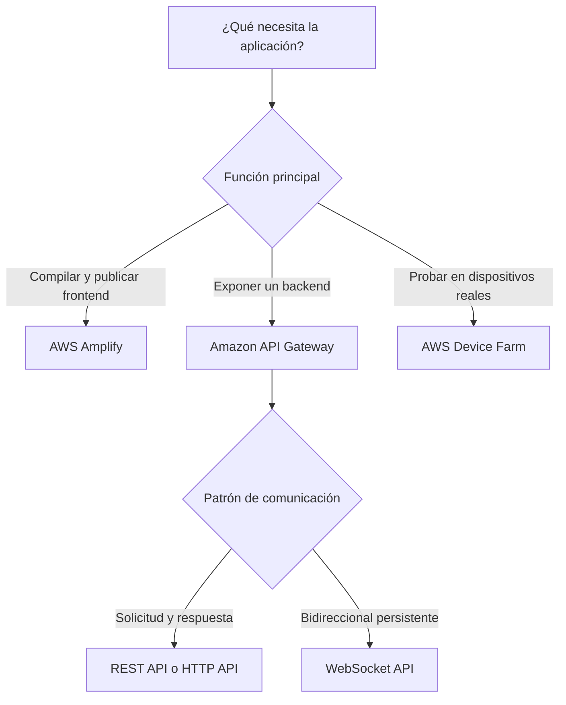
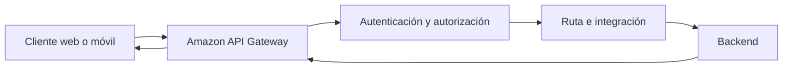
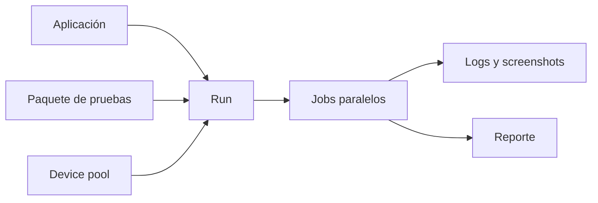
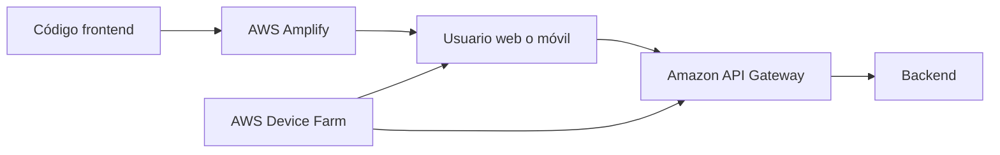

# Servicios Front-End Web y Mobile en AWS para el examen SAA-C03

## 1. Alcance necesario para el examen

La guía oficial vigente del SAA-C03 incluye los siguientes servicios en la categoría Front-End Web and Mobile:

- AWS Amplify
- Amazon API Gateway
- AWS Device Farm

El examen evalúa principalmente la capacidad de:

- Elegir una plataforma administrada para compilar y publicar aplicaciones web.
- Exponer backends mediante APIs REST, HTTP o WebSocket.
- Seleccionar el tipo de API y endpoint correcto.
- Proteger APIs mediante autenticación, autorización, políticas y control de tráfico.
- Integrar frontends con servicios y backends de AWS.
- Diseñar despliegues, dominios, caché, observabilidad y alta disponibilidad.
- Probar aplicaciones móviles y web sobre dispositivos físicos.
- Optimizar costos sin incumplir requisitos funcionales o de seguridad.

---

## 2. Modelos fundamentales

| Modelo | Servicio principal | Responsabilidad administrada | Uso típico |
|---|---|---|---|
| Desarrollo y hosting frontend | AWS Amplify | Build, despliegue y distribución del frontend | SPA, sitios estáticos, SSR y aplicaciones full-stack |
| Puerta de entrada para APIs | Amazon API Gateway | Publicación, seguridad, control de tráfico y observabilidad | REST, HTTP y comunicación WebSocket |
| Pruebas en dispositivos | AWS Device Farm | Dispositivos físicos y entorno de ejecución de pruebas | Pruebas manuales y automatizadas en Android, iOS y web |

### Regla mental inicial

> **Regla de examen:** Amplify publica la experiencia frontend, API Gateway expone y protege APIs, y Device Farm prueba aplicaciones en dispositivos físicos.

---

## 3. Conceptos de arquitectura que se deben dominar

### Frontend frente a backend

| Frontend | Backend |
|---|---|
| Interfaz que consume el usuario | Lógica, APIs y datos |
| Se ejecuta principalmente en navegador o dispositivo | Se ejecuta en servicios de cómputo |
| Incluye HTML, CSS, JavaScript y recursos estáticos | Procesa autenticación, reglas de negocio y persistencia |
| Puede publicarse globalmente mediante CDN | Puede ser regional, privado o multi-región |

- El código JavaScript enviado al navegador es visible para el usuario.
- Los secretos no deben incluirse en bundles, variables expuestas al cliente ni repositorios.
- El frontend debe consumir el backend mediante endpoints protegidos.
- La disponibilidad del frontend no garantiza la disponibilidad del backend.

### SPA, sitio estático y SSR

| Modelo | Procesamiento principal | Característica |
|---|---|---|
| Sitio estático | Durante el build | Archivos generados previamente |
| SPA | Navegador | La aplicación cambia vistas mediante JavaScript |
| SSR | Servidor durante la solicitud | El servidor genera HTML dinámicamente |

Consideraciones:

- Un sitio estático suele tener menor complejidad y costo.
- Una SPA normalmente necesita rewrites para enviar rutas al archivo principal.
- SSR requiere capacidad de ejecución además del almacenamiento de archivos.
- El modelo debe elegirse según SEO, personalización, rendimiento y operación.

### Solicitud y respuesta frente a conexión persistente

| HTTP o REST | WebSocket |
|---|---|
| El cliente inicia cada solicitud | Se mantiene una conexión bidireccional |
| Apropiado para operaciones CRUD | Apropiado para eventos en tiempo real |
| Comunicación stateless | Comunicación stateful a nivel de conexión |
| Métodos como GET, POST, PUT y DELETE | Mensajes en ambas direcciones |

### Autenticación frente a autorización

- **Autenticación:** comprueba quién es el consumidor.
- **Autorización:** determina qué puede hacer.
- **API key:** identifica y mide a un cliente; no sustituye un mecanismo de autenticación.
- **CORS:** controla solicitudes del navegador entre orígenes; no autentica ni autoriza.
- **Throttling:** limita la tasa de solicitudes; no sustituye el control de acceso.

> **Trampa de examen:** CORS y API keys no protegen por sí solos una API contra accesos no autorizados.

### Endpoint público frente a backend privado

Son decisiones independientes:

- El endpoint de la API determina desde dónde pueden invocarla los clientes.
- La integración determina cómo API Gateway alcanza el backend.
- Una API pública puede tener una integración privada con un backend dentro de una VPC.
- Una Private REST API solo se invoca desde una VPC mediante un interface VPC endpoint.

### Caché del frontend frente a caché de la API

| Caché del frontend | Caché de API Gateway |
|---|---|
| Distribuye archivos web cerca del usuario | Conserva respuestas del backend |
| Reduce descarga de recursos estáticos | Reduce invocaciones y latencia del backend |
| Amplify Hosting usa una CDN global | Disponible como característica de REST APIs |
| Se actualiza con despliegues del sitio | Se configura por stage y método |

### Disponibilidad

- Los archivos del frontend y el backend deben diseñarse por separado.
- API Gateway es administrado y escalable dentro de su alcance regional.
- Una arquitectura multi-región requiere implementar la API y el backend en más de una región.
- El dominio y el enrutamiento deben dirigir al endpoint saludable.
- El cliente móvil debe manejar timeouts, reintentos y errores transitorios.
- Las operaciones de escritura deben considerar idempotencia.

---

## 4. AWS Amplify

AWS Amplify proporciona herramientas para construir, conectar y publicar aplicaciones web y móviles. Amplify Hosting ofrece un flujo basado en Git con integración continua y despliegue sobre una red global de distribución de contenido.

### Componentes conceptuales

| Componente | Función |
|---|---|
| Amplify Hosting | Compilar, desplegar y distribuir aplicaciones web |
| Amplify build settings | Definir comandos, artefactos y configuración de build |
| Branch | Asociar una rama del repositorio con un ambiente |
| Preview | Crear una vista temporal para revisar cambios |
| Amplify libraries | Conectar el frontend con capacidades de backend |
| Amplify Gen 2 | Definir backends mediante un enfoque code-first con TypeScript |

### Flujo de despliegue

### Amplify Hosting

Características:

- Conecta un repositorio de código.
- Detecta cambios y ejecuta un pipeline de build.
- Publica aplicaciones estáticas, SPA y frameworks con SSR compatibles.
- Distribuye el contenido mediante una CDN global.
- Proporciona HTTPS administrado.
- Admite dominios personalizados.
- Permite redirects, rewrites y custom headers.
- Realiza despliegues atómicos.
- Cobra según el consumo.

Un despliegue atómico publica la nueva versión solo cuando todos sus artefactos están listos. Esto evita que el usuario reciba una mezcla de archivos de versiones diferentes.

### Feature branches

- Cada rama puede representar un ambiente.
- Un push puede iniciar build y despliegue automáticamente.
- Producción y pruebas pueden utilizar ramas separadas.
- La configuración puede variar por rama.
- Las ramas obsoletas deben eliminarse para evitar costo y exposición innecesarios.

Ejemplo:

| Rama | Ambiente | Uso |
|---|---|---|
| `main` | Producción | Versión estable |
| `staging` | Preproducción | Validación integrada |
| `feature/*` | Preview | Revisión temporal |

### Pull request previews

Permiten:

- Revisar cambios antes del merge.
- Validar rutas y diseño.
- Ejecutar pruebas end-to-end.
- Compartir un ambiente temporal.
- Detectar errores de build antes de producción.

Las previews deben proteger datos, secretos y backends. Un ambiente temporal no debe recibir automáticamente permisos de producción.

### Dominios personalizados

- Se puede asociar un dominio propio.
- Amplify administra el certificado HTTPS.
- Se pueden configurar subdominios por rama.
- La validación y los registros DNS deben completarse correctamente.
- Una aplicación puede usar redirección del dominio raíz hacia `www` o el patrón inverso.

### Redirects y rewrites

| Redirect | Rewrite |
|---|---|
| Cambia la URL visible del navegador | Mantiene la URL visible |
| Devuelve un código 3xx | Sirve contenido desde otro destino |
| Útil para dominios o rutas antiguas | Útil para SPA, proxy o reglas internas |

Para una SPA, las rutas como `/perfil` o `/ordenes/123` suelen reescribirse hacia `index.html` para que el router del cliente procese la navegación.

> **Trampa de examen:** si una SPA funciona desde la página inicial, pero una actualización directa sobre una ruta devuelve 404, se debe revisar la regla de rewrite.

### Build settings

Definen:

- Versión del runtime.
- Instalación de dependencias.
- Comando de build.
- Comando de pruebas.
- Directorio de artefactos.
- Archivos almacenados en caché entre builds.
- Variables utilizadas durante la compilación.

La caché del build reduce tiempo de compilación, pero no debe conservar artefactos inconsistentes ni información sensible.

### Variables y secretos

- Las variables del build pueden diferenciar ambientes.
- Una variable incorporada en el bundle del navegador deja de ser secreta.
- Tokens privados, passwords y claves no deben entregarse al frontend.
- El frontend debe obtener credenciales temporales o invocar un backend autorizado.
- Los ambientes temporales deben utilizar valores y permisos separados.

> **Regla de seguridad:** cualquier dato enviado al navegador debe considerarse accesible por el usuario.

### Aplicaciones full-stack

Amplify puede conectar el frontend con:

- Autenticación.
- APIs.
- Datos.
- Almacenamiento.
- Funciones de backend.

Amplify Gen 2 utiliza un enfoque code-first basado en TypeScript para definir recursos de backend. Para el examen, lo importante es reconocer Amplify como una experiencia administrada para desarrollar, integrar y publicar aplicaciones, no como un reemplazo universal de todos los servicios backend.

### SSR frente a hosting estático

| Hosting estático | SSR |
|---|---|
| Publica archivos generados | Ejecuta lógica para generar páginas |
| Menor operación | Mayor funcionalidad dinámica |
| Escala principalmente mediante CDN | Incluye solicitudes y capacidad de cómputo |
| Adecuado para SPA y sitios estáticos | Adecuado para contenido dinámico y SEO |

### Seguridad

- Proteger ramas no públicas.
- Separar configuración por ambiente.
- Aplicar headers de seguridad.
- No publicar archivos internos o mapas de código sensibles.
- Controlar el acceso al repositorio.
- Revisar dependencias del frontend.
- No incluir secretos en el bundle.
- Limitar permisos del proceso de build.

### Alta disponibilidad y recuperación

- La CDN distribuye los archivos del frontend.
- El repositorio conserva el código fuente.
- El proceso de build debe ser reproducible.
- La configuración de dominios y rewrites debe versionarse.
- Los backends conectados deben tener su propia estrategia de disponibilidad.
- Un rollback debe apuntar a una versión conocida y probada.

### Costos

Los factores principales incluyen:

- Minutos de build.
- Almacenamiento de artefactos.
- Datos servidos al usuario.
- Solicitudes y cómputo de aplicaciones SSR.
- Cantidad de ramas y previews activas.
- Servicios backend utilizados por la aplicación.

### Cuándo elegir AWS Amplify

- Se necesita publicar un frontend rápidamente.
- Se desea CI/CD basado en Git.
- La aplicación utiliza un framework web compatible.
- Se requieren previews por pull request.
- Se desea administrar dominios y HTTPS con menor esfuerzo.
- Un equipo frontend necesita integrar capacidades de AWS.

### Cuándo no elegirlo

- Solo se necesita exponer una API.
- Se requiere control completo y personalizado del pipeline y de la infraestructura.
- La carga no es una aplicación web o móvil.
- El requisito principal es probar sobre dispositivos físicos.

### Trampas del examen

- Amplify Hosting no reemplaza el diseño de disponibilidad del backend.
- Una variable de build expuesta al cliente no es un secreto.
- Una branch preview no debe compartir permisos amplios con producción.
- Un rewrite no es lo mismo que un redirect.
- SSR implica ejecución dinámica y costos diferentes al hosting estático.

---

## 5. Amazon API Gateway

Amazon API Gateway es un servicio administrado para crear, publicar, mantener, monitorear y proteger APIs REST, HTTP y WebSocket a escala.

### Funciones principales

- Recibir solicitudes de clientes.
- Seleccionar una ruta y método.
- Autenticar y autorizar.
- Validar o transformar solicitudes según el tipo de API.
- Invocar un backend.
- Transformar y devolver respuestas.
- Aplicar throttling y cuotas.
- Generar métricas y logs.
- Administrar stages, despliegues y dominios.

### Arquitectura conceptual

### Tipos de API

| Tipo | Modelo | Uso típico |
|---|---|---|
| REST API | API REST con funciones avanzadas de administración | API keys, usage plans, caché, validación y Private API |
| HTTP API | API RESTful simplificada y de menor costo | Proxy hacia backends con requisitos básicos |
| WebSocket API | Conexión bidireccional persistente | Chat, notificaciones y actualizaciones en tiempo real |

### REST API frente a HTTP API

| Característica | REST API | HTTP API |
|---|---:|---:|
| Endpoint Regional | Sí | Sí |
| Endpoint edge-optimized | Sí | No |
| Endpoint privado | Sí | No |
| API keys y usage plans | Sí | No |
| Throttling por cliente | Sí | No |
| Caché de API Gateway | Sí | No |
| Validación de solicitudes | Sí | No |
| Transformación del body | Sí | No |
| Canary deployments | Sí | No |
| Integración con AWS WAF | Sí | No |
| IAM | Sí | Sí |
| Lambda authorizer | Sí | Sí |
| JWT authorizer nativo | No | Sí |
| CORS | Sí | Sí |
| Menor costo y complejidad | No | Sí |

> **Regla de examen:** elegir HTTP API cuando sus funciones sean suficientes; elegir REST API cuando se necesiten capacidades avanzadas como API keys, caching, request validation, WAF o endpoint privado.

### WebSocket API

Una WebSocket API mantiene conexiones y utiliza rutas para procesar mensajes.

Rutas conceptuales:

| Ruta | Función |
|---|---|
| `$connect` | Autorizar y registrar una conexión |
| `$disconnect` | Limpiar el estado al terminar |
| `$default` | Procesar mensajes sin una ruta específica |
| Ruta personalizada | Procesar un tipo de mensaje |

Casos de uso:

- Chat.
- Paneles en tiempo real.
- Notificaciones.
- Juegos.
- Seguimiento de estado.
- Colaboración interactiva.

Se debe guardar externamente la relación entre usuario, connection ID y contexto cuando la aplicación necesite enviar mensajes posteriormente.

### Recursos, métodos y rutas

En una REST API:

- Un **resource** representa una ruta.
- Un **method** representa una operación HTTP.
- Una **integration** conecta el método con el backend.
- Un **deployment** captura una versión de la API.
- Un **stage** expone un deployment.

En una HTTP API:

- Una **route** combina método y ruta, por ejemplo `GET /orders/{id}`.
- Una **integration** define el backend.
- Un **stage** publica rutas.
- Puede utilizarse auto-deploy.

### Integraciones

API Gateway puede integrarse con:

- Funciones.
- Endpoints HTTP públicos.
- Servicios de AWS compatibles.
- Backends privados en una VPC.
- Respuestas mock sin backend.

| Integración | Uso |
|---|---|
| Proxy | Entrega la solicitud al backend con mínima transformación |
| No proxy | Permite mapear y transformar solicitud y respuesta |
| AWS service | Invoca directamente una acción compatible de AWS |
| Private integration | Alcanza recursos privados mediante VPC link |
| Mock | Responde sin invocar un backend |

> **Regla de arquitectura:** una integración directa con un servicio de AWS puede eliminar una función intermediaria cuando no se requiere lógica adicional.

### Proxy frente a no proxy

| Proxy | No proxy |
|---|---|
| El backend interpreta la solicitud | API Gateway transforma el mensaje |
| Configuración más simple | Mayor control sobre mappings |
| El backend genera status, headers y body | API Gateway puede mapear respuestas |
| Menor acoplamiento a plantillas | Útil para adaptar interfaces incompatibles |

### Tipos de endpoint para REST APIs

| Endpoint | Acceso | Uso típico |
|---|---|---|
| Edge-optimized | Público mediante una distribución administrada | Clientes geográficamente dispersos |
| Regional | Público en una región | Clientes cercanos o CDN administrada por el cliente |
| Private | Desde VPC mediante interface VPC endpoint | APIs internas |

### Edge-optimized

- Enruta inicialmente al punto de presencia más cercano.
- Utiliza una distribución administrada por API Gateway.
- Es apropiado para clientes globales.
- El custom domain de tipo edge tiene alcance acorde con ese modelo.
- Si se necesita controlar la distribución, puede preferirse un endpoint Regional con una CDN propia.

### Regional

- El endpoint reside en la región seleccionada.
- Es apropiado para clientes en la misma región o cercanos.
- Permite implementar la API en varias regiones.
- Puede combinarse con DNS para enrutamiento de latencia o failover.
- Puede colocarse detrás de una distribución administrada por el cliente.

### Private

- Solo está disponible para REST APIs.
- Se invoca mediante un interface VPC endpoint.
- Utiliza AWS PrivateLink.
- Puede limitarse mediante API resource policy.
- El endpoint policy del VPC endpoint agrega otra capa de control.
- No debe exponerse como una API pública.

> **Trampa de examen:** Private API describe cómo el cliente llega a API Gateway. Private integration describe cómo API Gateway llega al backend.

### Private integration y VPC link

Un VPC link permite que API Gateway alcance backends compatibles dentro de una VPC sin exponerlos públicamente.

Se utiliza cuando:

- El backend está detrás de un load balancer compatible.
- El backend no debe aceptar tráfico directo desde internet.
- Se quiere conservar API Gateway como puerta de entrada.
- La conectividad debe permanecer dentro de redes privadas.

El tipo de recurso compatible depende del tipo de API y de la generación de VPC link utilizada.

### Autenticación y autorización

| Mecanismo | Uso principal |
|---|---|
| IAM | Consumidores de AWS que firman solicitudes con Signature Version 4 |
| Cognito user pool authorizer | Usuarios autenticados mediante un user pool |
| Lambda authorizer | Lógica personalizada de autorización |
| JWT authorizer | Validar tokens OIDC u OAuth 2.0 en HTTP APIs |
| Resource policy | Permitir o denegar según cuenta, principal, IP o VPC endpoint |
| VPC endpoint policy | Limitar qué identidades o APIs atraviesan el endpoint |

### IAM

- El consumidor firma la solicitud con SigV4.
- Una política IAM debe permitir `execute-api:Invoke`.
- Es apropiado para comunicación entre workloads de AWS.
- La política puede limitar API, stage, método y recurso.
- Una denegación explícita prevalece sobre una autorización.

### Cognito

- El usuario obtiene un token del user pool.
- API Gateway valida el token.
- Los claims pueden utilizarse en la autorización.
- Es adecuado para aplicaciones web y móviles con usuarios.
- Cognito user pool authorizer se asocia directamente con REST APIs.
- HTTP APIs pueden utilizar JWT authorizers con un emisor de tokens compatible.

### Lambda authorizer

- Ejecuta lógica personalizada.
- Puede evaluar tokens, headers, parámetros y contexto.
- Devuelve una decisión o política.
- La respuesta puede almacenarse temporalmente en caché.
- Agrega latencia y costo frente a validación nativa.
- La clave de caché debe representar correctamente la identidad y el alcance.

Se utiliza cuando:

- La autorización requiere reglas personalizadas.
- El token no puede validarse con mecanismos nativos.
- Se integra un sistema de identidad existente.

### Resource policies

Permiten controlar quién puede invocar una REST API.

Pueden limitar por:

- Cuenta o principal.
- Dirección IP de origen.
- VPC.
- Interface VPC endpoint.
- Condiciones de IAM.

Son especialmente importantes para:

- Acceso entre cuentas.
- Private APIs.
- Restricción por red.
- Denegaciones explícitas.

### API keys y usage plans

Un usage plan puede asociar:

- Uno o más stages.
- Métodos.
- API keys.
- Throttling objetivo.
- Cuotas por periodo.

> **Regla de seguridad:** una API key no debe utilizarse como mecanismo principal de autenticación o autorización.

Las cuotas y límites de usage plans:

- Ayudan a medir y controlar consumidores.
- Se aplican por API key.
- Son best effort, no límites duros.
- No deben ser el único control para impedir costos inesperados.

### Throttling

API Gateway limita solicitudes para proteger el servicio y el backend.

Conceptos:

- **Rate:** tasa sostenida permitida.
- **Burst:** ráfaga temporal permitida.
- **HTTP 429:** respuesta habitual cuando se supera el límite.
- El cliente debe aplicar exponential backoff con jitter.
- El backend también debe protegerse y escalar correctamente.

### Cuotas frente a throttling

| Cuota | Throttling |
|---|---|
| Cantidad objetivo por periodo | Solicitudes por segundo y burst |
| Asociada con usage plan | Puede aplicarse en distintos niveles |
| Útil para planes de consumo | Útil para proteger capacidad |
| No es un límite absoluto de costos | Puede permitir picos dentro del burst |

### CORS

CORS aplica cuando un navegador llama a un origen distinto.

Se deben definir:

- Orígenes permitidos.
- Métodos permitidos.
- Headers permitidos.
- Exposición de headers.
- Uso de credenciales.
- Respuesta a solicitudes `OPTIONS`.

> **Trampa de examen:** un llamado con `curl` puede funcionar aunque el navegador lo bloquee por CORS, porque CORS es aplicado por el navegador.

No se debe combinar `Access-Control-Allow-Origin: *` con credenciales. Los errores de autorización y del backend también deben devolver headers CORS cuando el navegador necesite leer la respuesta.

### Validación de solicitudes

REST APIs pueden validar:

- Parámetros requeridos.
- Headers.
- Query strings.
- Body contra un modelo.

Ventajas:

- Rechazar tráfico inválido antes del backend.
- Reducir procesamiento innecesario.
- Mantener un contrato de entrada.

La validación de formato no reemplaza las validaciones de negocio.

### Transformación

REST APIs pueden utilizar mapping templates para:

- Cambiar estructura del body.
- Renombrar parámetros.
- Construir mensajes para una integración.
- Adaptar una API pública a un backend existente.
- Transformar respuestas y códigos.

Esto reduce cambios en el backend, pero aumenta complejidad de configuración.

### Caché

La caché administrada de API Gateway está disponible para REST APIs.

Beneficios:

- Reduce latencia.
- Reduce invocaciones del backend.
- Absorbe lecturas repetitivas.

Consideraciones:

- Se configura por stage.
- Puede personalizarse por método.
- La cache key debe incluir parámetros que cambien la respuesta.
- Los datos privados no deben compartirse entre usuarios por una clave incompleta.
- Las escrituras deben invalidar o evitar datos obsoletos según el caso.
- La caché agrega costo.

> **Trampa de examen:** una respuesta dependiente del usuario no debe almacenarse con una cache key compartida entre todos los usuarios.

### Stages y deployments

- Un deployment representa una versión publicable de la API.
- Un stage referencia un deployment.
- Nombres habituales: `dev`, `qa` y `prod`.
- Cada stage puede tener configuración, logs y throttling.
- Las stage variables pueden parametrizar integraciones en REST APIs.
- Crear o cambiar métodos no siempre los publica hasta crear un nuevo deployment.

> **Pista de diagnóstico:** si una modificación de REST API no aparece al invocarla, comprobar si se creó y asoció un nuevo deployment al stage.

### Canary deployments

REST APIs permiten dirigir un porcentaje del tráfico hacia una versión canary.

Se utiliza para:

- Validar una nueva versión con tráfico real.
- Reducir el impacto de un defecto.
- Comparar métricas y logs.
- Aumentar el porcentaje gradualmente.

El backend y los cambios de datos deben mantener compatibilidad durante la coexistencia de versiones.

### Custom domains y API mappings

- Reemplazan el hostname generado por un dominio propio.
- Requieren un certificado compatible con el tipo y región del endpoint.
- Los API mappings relacionan rutas base con APIs y stages.
- DNS dirige el dominio al target de API Gateway.
- Una estrategia multi-región puede utilizar el mismo nombre con enrutamiento DNS.

Ejemplo:

| Ruta base | Destino |
|---|---|
| `/customers` | API de clientes |
| `/orders` | API de órdenes |
| `/v2` | Nueva versión |

### Observabilidad

| Señal | Uso |
|---|---|
| Métricas | Latencia, errores, solicitudes y throttling |
| Access logs | Registrar solicitudes y contexto |
| Execution logs | Analizar procesamiento interno de REST APIs |
| Trazas | Seguir latencia a través de componentes compatibles |
| Alarmas | Detectar degradación y errores |

Métricas importantes:

- `4XXError`.
- `5XXError`.
- `Latency`.
- `IntegrationLatency`.
- `Count`.
- Errores de autorización.
- Respuestas 429.

Interpretación:

- **Latency alta e IntegrationLatency normal:** investigar procesamiento en API Gateway, autorización o red.
- **IntegrationLatency alta:** investigar el backend.
- **4XX:** revisar cliente, rutas, validación o autorización.
- **5XX:** revisar integración, permisos o backend.

### Seguridad

- Utilizar TLS y custom domains cuando corresponda.
- Exigir autenticación y autorización.
- Aplicar menor privilegio al rol de integración.
- Validar entradas.
- Limitar tamaño, tasa y origen de solicitudes.
- Proteger REST APIs públicas con AWS WAF cuando sea necesario.
- Evitar datos sensibles en URL y logs.
- Cifrar datos y secretos utilizados por el backend.
- Revisar resource policies y denegaciones explícitas.
- Separar stages y cuentas por ambiente.

### Alta disponibilidad y multi-región

API Gateway proporciona una capa administrada y altamente disponible dentro de una región. Para resiliencia regional:

1. Implementar la API en una segunda región.
2. Implementar también el backend y los datos.
3. Configurar dominios regionales.
4. Utilizar DNS para failover o enrutamiento apropiado.
5. Mantener configuración y deployments mediante IaC.
6. Probar la conmutación y recuperación.

> **Trampa de examen:** duplicar API Gateway sin duplicar el backend y los datos no crea una aplicación multi-región.

### Costos

Los factores principales incluyen:

- Cantidad de solicitudes o mensajes.
- Transferencia de datos.
- Minutos de conexión y mensajes en WebSocket.
- Caché provisionada de REST API.
- Ejecución de authorizers.
- Logs y trazas.
- Tipo de API elegido.
- Costos del backend.

HTTP APIs suelen tener menor precio que REST APIs, pero no deben seleccionarse si faltan funciones obligatorias.

### Cuándo elegir Amazon API Gateway

- Se necesita una puerta de entrada administrada para APIs.
- Se requieren autenticación, throttling, métricas y stages.
- Se necesita exponer un backend sin administrar servidores proxy.
- Se necesita una Private REST API.
- Se requiere comunicación WebSocket.
- Se deben publicar APIs para aplicaciones web, móviles o terceros.

### Cuándo no elegirlo

- Solo se necesita hosting de archivos frontend.
- La comunicación no utiliza APIs HTTP o WebSocket.
- El requisito principal es probar aplicaciones en dispositivos.
- Un balanceador simple satisface todos los requisitos sin funciones de administración de API.

### Trampas del examen

- API key no es autenticación.
- CORS no es autorización.
- HTTP API y REST API no ofrecen las mismas funciones.
- Private API y private integration son conceptos diferentes.
- Un endpoint edge-optimized no equivale a una API multi-región.
- Throttling y cuotas de usage plans son best effort.
- Publicar cambios de REST API puede requerir un nuevo deployment.
- La caché debe aislar correctamente respuestas por consumidor.
- API Gateway no corrige la falta de escalabilidad del backend.

---

## 6. AWS Device Farm

AWS Device Farm es un servicio de pruebas de aplicaciones que permite probar e interactuar con aplicaciones Android, iOS y web sobre teléfonos y tablets físicos alojados por AWS.

### Formas de uso

| Modalidad | Descripción | Uso |
|---|---|---|
| Remote access | Interacción en tiempo real desde el navegador o cliente local | Prueba manual, reproducción de defectos y depuración |
| Automated app testing | Ejecución paralela de pruebas en un entorno administrado | Compatibilidad, regresión y CI/CD |

> **Regla de examen:** Device Farm utiliza dispositivos físicos reales; no es únicamente un servicio de emuladores.

### Componentes

| Componente | Función |
|---|---|
| Project | Espacio lógico para organizar pruebas |
| Device pool | Conjunto de dispositivos con características seleccionadas |
| Run | Ejecución de una aplicación y paquete de pruebas sobre dispositivos |
| Job | Prueba de una aplicación en un dispositivo |
| Suite | Agrupación de tests |
| Test | Caso individual |
| Report | Resultados, logs, screenshots y artefactos |
| Session | Interacción remota en tiempo real con un dispositivo |

### Flujo de pruebas automatizadas

### Device pools

Permiten seleccionar dispositivos según:

- Plataforma.
- Fabricante.
- Modelo.
- Versión del sistema operativo.
- Características disponibles.
- Dispositivos específicos.

La selección debe representar a los usuarios reales. Probar únicamente el dispositivo más reciente puede ocultar incompatibilidades.

### Runs y jobs

Ejemplo:

- Una aplicación.
- Un paquete de pruebas.
- Cinco dispositivos.

El run agrupa la ejecución completa y puede generar un job por dispositivo. Los jobs pueden ejecutarse en paralelo, lo que reduce el tiempo total de validación.

### Pruebas automatizadas

Características:

- Se carga la aplicación y el paquete de pruebas.
- Device Farm aprovisiona los test hosts.
- Los dispositivos se preparan para la ejecución.
- Las pruebas se ejecutan en un entorno administrado.
- Se generan logs, screenshots, video y artefactos.
- Se pueden utilizar frameworks de prueba compatibles.
- Un archivo de especificación puede personalizar fases del test host.

### Remote access

Permite:

- Manipular un dispositivo desde el navegador.
- Instalar y probar una aplicación.
- Reproducir un defecto.
- Revisar la representación visual.
- Probar instalación y actualización.
- Depurar pruebas Appium desde un cliente local.
- Obtener logs y grabación de la sesión.

Remote access es apropiado para investigación interactiva. Las pruebas automatizadas son más adecuadas para regresión repetible y ejecución en múltiples dispositivos.

### Acceso a backends privados

Los test hosts y dispositivos pueden conectarse de forma segura a recursos dentro de una VPC.

Casos:

- Probar una API interna.
- Validar una aplicación antes de publicar el backend.
- Acceder a ambientes de QA privados.

Se debe limitar:

- Subredes alcanzables.
- Security groups.
- Puertos.
- Datos disponibles.
- Permisos del ambiente de pruebas.

### Región

A julio de 2026, AWS Device Farm está disponible en `us-west-2` —Oregon—.

Esto implica considerar:

- Ubicación de artefactos.
- Transferencia.
- Conectividad hacia backends.
- Requisitos de residencia.
- Latencia hacia ambientes privados.

### Resultados

Un reporte puede incluir:

- Estado de tests.
- Logs.
- Screenshots.
- Video.
- Información del dispositivo.
- Rendimiento.
- Artefactos personalizados.

Los resultados ayudan a distinguir:

- Defecto de la aplicación.
- Incompatibilidad con un modelo.
- Problema de versión del sistema operativo.
- Error del paquete de pruebas.
- Falla de conectividad con el backend.

### Integración con CI/CD

Flujo habitual:

1. Compilar la aplicación.
2. Generar el paquete de pruebas.
3. Iniciar un run.
4. Esperar los jobs.
5. Descargar resultados.
6. Marcar el pipeline como exitoso o fallido.
7. Publicar artefactos para análisis.

Las pruebas deben ser deterministas. Flakiness, datos compartidos y dependencias externas inestables reducen el valor del resultado.

### Seguridad

- Utilizar aplicaciones y datos de prueba.
- No incluir credenciales permanentes en el paquete.
- Limitar conectividad hacia la VPC.
- Eliminar artefactos que ya no se necesiten.
- Proteger logs, videos y screenshots con datos sensibles.
- Separar ambientes de prueba y producción.
- Aplicar permisos mínimos a quienes crean sesiones o descargan resultados.

### Costos

Los factores principales incluyen:

- Minutos de dispositivo.
- Modalidad metered o unmetered.
- Cantidad de dispositivos.
- Paralelismo.
- Duración de remote access.
- Frecuencia de pruebas.
- Transferencia y servicios conectados.

Optimización:

- Crear device pools representativos.
- Ejecutar pruebas rápidas antes de matrices amplias.
- Reservar pruebas extensas para builds candidatos.
- Terminar sesiones que ya no se utilicen.
- Evitar repetir pruebas fallidas sin corregir la causa.

### Cuándo elegir AWS Device Farm

- Se necesita probar sobre dispositivos físicos.
- Se deben validar múltiples modelos y versiones.
- Se requiere ejecución paralela.
- Se necesita remote access para reproducir un defecto.
- Se quiere integrar pruebas móviles con CI/CD.
- Se necesita que los dispositivos alcancen un backend privado.

### Cuándo no elegirlo

- Se necesita alojar la aplicación.
- Se necesita exponer una API.
- Una prueba unitaria local resuelve el requisito.
- El objetivo es monitorear usuarios reales en producción.

### Trampas del examen

- Device Farm prueba aplicaciones; no las publica.
- Un device pool agrupa dispositivos, no tests.
- Un run puede contener varios jobs.
- Remote access y automated app testing resuelven necesidades diferentes.
- Los dispositivos son físicos.
- La disponibilidad regional debe considerarse en el diseño.

---

## 7. Seguridad, disponibilidad y operaciones

### Flujo completo

### Separación de responsabilidades

| Capa | Servicio principal | Riesgo que se debe controlar |
|---|---|---|
| Build y hosting | AWS Amplify | Exposición de secretos y configuración incorrecta |
| Entrada a la aplicación | Amazon API Gateway | Acceso no autorizado, abuso y tráfico inválido |
| Backend | Integración seleccionada | Permisos, capacidad y datos |
| Pruebas | AWS Device Farm | Exposición de aplicaciones, logs y ambientes privados |

### Principios de seguridad

- No almacenar secretos en el frontend.
- Autenticar y autorizar cada API sensible.
- Utilizar API keys solo para medición y planes de consumo.
- Limitar orígenes CORS.
- Aplicar throttling y protección contra abuso.
- Validar solicitudes antes del backend cuando corresponda.
- Evitar datos sensibles en logs.
- Separar ambientes y cuentas.
- Entregar a pruebas únicamente acceso necesario.

### Principios de disponibilidad

- Desplegar artefactos frontend de forma reproducible.
- Diseñar el backend con múltiples dominios de fallo.
- Utilizar health checks y alarmas.
- Gestionar reintentos sin duplicar escrituras.
- Implementar APIs en más de una región cuando el RTO lo requiera.
- Mantener configuración como código.
- Probar rutas críticas desde clientes reales.

---

## 8. Matriz de decisión para preguntas del examen

| Requisito | Elección principal | Motivo |
|---|---|---|
| Hosting frontend con CI/CD desde Git | AWS Amplify | Build y despliegue administrados |
| Preview por pull request | AWS Amplify | Ambientes temporales integrados |
| SPA que devuelve 404 al actualizar una ruta | Amplify rewrite | Envía rutas al punto de entrada de la SPA |
| Dominio y HTTPS administrados para un frontend | AWS Amplify | Integración de hosting y certificado |
| Exponer un backend mediante API administrada | Amazon API Gateway | Front door para APIs |
| API simple y de menor costo | API Gateway HTTP API | Funciones esenciales con menor complejidad |
| API keys, usage plans o caché | API Gateway REST API | Funciones avanzadas de administración |
| API accesible solo desde una VPC | Private REST API | Acceso mediante interface VPC endpoint |
| Backend privado detrás de un load balancer | Private integration y VPC link | API Gateway alcanza la VPC sin backend público |
| Clientes globalmente dispersos con REST API | Edge-optimized endpoint | Entrada mediante puntos de presencia |
| Controlar la propia CDN o diseñar multi-región | Regional endpoint | Integración flexible con CDN y DNS |
| Comunicación bidireccional persistente | WebSocket API | Conexiones y mensajes en tiempo real |
| Consumidores AWS que firman solicitudes | IAM authorization | SigV4 y `execute-api:Invoke` |
| Autorización con lógica personalizada | Lambda authorizer | Evalúa tokens y contexto |
| Tokens OIDC u OAuth 2.0 en HTTP API | JWT authorizer | Validación nativa de JWT |
| Limitar consumo por cliente | REST API usage plan | API keys, throttling y cuotas |
| Reducir lecturas repetidas al backend | REST API caching | Guarda respuestas temporalmente |
| Probar app en teléfonos y tablets reales | AWS Device Farm | Dispositivos físicos administrados |
| Reproducir manualmente un defecto móvil | Device Farm remote access | Interacción en tiempo real |
| Ejecutar pruebas en varios modelos | Device Farm automated testing | Jobs paralelos por dispositivo |

---

## 9. Diferencias que suelen generar errores

### AWS Amplify frente a Amazon API Gateway

| AWS Amplify | Amazon API Gateway |
|---|---|
| Compila y publica frontends | Publica y protege APIs |
| Integra repositorio y hosting | Integra clientes y backends |
| Distribuye archivos mediante CDN | Procesa solicitudes y mensajes |
| Administra branches y previews | Administra rutas, stages y authorizers |

### Amazon API Gateway frente a AWS Device Farm

| Amazon API Gateway | AWS Device Farm |
|---|---|
| Recibe tráfico de aplicaciones | Ejecuta pruebas de aplicaciones |
| Expone backends | Proporciona dispositivos |
| Aplica autorización y throttling | Genera reportes, logs y screenshots |
| Opera en producción | Se utiliza principalmente en pruebas |

### REST API frente a HTTP API

| REST API | HTTP API |
|---|---|
| Más funciones | Menor costo y complejidad |
| API keys y usage plans | Sin API keys |
| Caché y request validation | Sin caché administrada |
| Edge, Regional o Private | Regional |
| WAF y canary deployments | Sin estas funciones |

### HTTP o REST frente a WebSocket

| HTTP o REST | WebSocket |
|---|---|
| Solicitud y respuesta | Conexión persistente |
| Operaciones stateless | Comunicación bidireccional |
| CRUD y consultas | Chat y eventos en tiempo real |
| El cliente inicia cada solicitud | Backend y cliente pueden enviar mensajes |

### Private API frente a private integration

| Private API | Private integration |
|---|---|
| Controla cómo el cliente llega a la API | Controla cómo la API llega al backend |
| Interface VPC endpoint | VPC link |
| Solo REST API | Disponible según el tipo de API y backend |
| API no pública | El frontend de la API puede ser público o privado |

### API key frente a authorizer

| API key | Authorizer |
|---|---|
| Identifica consumidor para medición | Autentica o autoriza |
| Se usa con usage plans | Evalúa identidad y permisos |
| No debe ser un secreto de autenticación | Puede validar tokens o contexto |
| No sustituye IAM, Cognito o authorizer | Controla la invocación |

### Redirect frente a rewrite

| Redirect | Rewrite |
|---|---|
| Cambia la URL | Mantiene la URL |
| Devuelve 3xx | Sirve otro destino internamente |
| Útil para migraciones | Útil para routing de SPA |

### Remote access frente a automated testing

| Remote access | Automated testing |
|---|---|
| Interacción manual o Appium desde cliente local | Ejecución administrada de paquetes de prueba |
| Un dispositivo durante una sesión | Varios dispositivos en paralelo |
| Depuración exploratoria | Regresión repetible |
| Feedback interactivo | Reportes consolidados |

---

## 10. Optimización de costos

### AWS Amplify

- Eliminar branches y previews obsoletas.
- Optimizar dependencias y tiempos de build.
- Reutilizar caché de build de forma segura.
- Publicar artefactos comprimidos y optimizados.
- Preferir contenido estático cuando cumpla el requisito.
- Supervisar transferencia y carga SSR.
- Separar ambientes permanentes de previews temporales.

### Amazon API Gateway

- Elegir HTTP API cuando no se necesiten funciones exclusivas de REST API.
- Habilitar caché solo cuando reduzca suficiente carga del backend.
- Ajustar logs sin registrar información innecesaria.
- Configurar throttling para proteger integraciones.
- Evitar authorizers personalizados si una validación nativa cumple el requisito.
- Utilizar integraciones directas cuando no se necesite lógica intermediaria.
- Supervisar solicitudes, transferencia, conexiones y mensajes.

### AWS Device Farm

- Elegir device pools representativos.
- Ejecutar smoke tests antes de una matriz completa.
- Paralelizar cuando el ahorro de tiempo justifique el costo.
- Finalizar remote sessions sin uso.
- Reservar suites extensas para versiones candidatas.
- Eliminar artefactos que no deban conservarse.

---

## 11. Estrategia para resolver preguntas SAA-C03

1. Identificar si el requisito es publicar un frontend, exponer una API o probar una aplicación.
2. Si es una API, determinar si el patrón es solicitud-respuesta o conexión persistente.
3. Comparar funciones obligatorias de REST API y HTTP API.
4. Determinar si el cliente necesita acceso público o privado.
5. Separar el endpoint de la API de la conectividad hacia el backend.
6. Elegir el mecanismo correcto de autenticación y autorización.
7. Revisar throttling, caché, CORS, logs y despliegue.
8. Diseñar la disponibilidad del backend y los datos.
9. Elegir la solución con menor costo y operación que cumpla todos los requisitos.

### Palabras clave

- **Hosting frontend basado en Git:** AWS Amplify.
- **Feature branch o pull request preview:** AWS Amplify.
- **SPA, SSR o sitio estático:** AWS Amplify Hosting.
- **Frontend con dominio y HTTPS administrados:** AWS Amplify.
- **Publicar y proteger una API:** Amazon API Gateway.
- **API sencilla y económica:** HTTP API.
- **API keys, usage plans, caching o request validation:** REST API.
- **Solo desde una VPC:** Private REST API.
- **Backend privado en VPC:** Private integration con VPC link.
- **Clientes REST globalmente distribuidos:** edge-optimized endpoint.
- **API multi-región o CDN propia:** Regional endpoint.
- **Chat o tiempo real bidireccional:** WebSocket API.
- **SigV4 o workloads AWS:** IAM authorization.
- **Lógica de autorización personalizada:** Lambda authorizer.
- **OIDC u OAuth 2.0 en HTTP API:** JWT authorizer.
- **Medir y limitar por consumidor:** API key y usage plan.
- **Error solo en navegador entre dominios:** CORS.
- **Probar en dispositivos físicos:** AWS Device Farm.
- **Depuración manual de un móvil:** Device Farm remote access.
- **Pruebas paralelas en varios modelos:** Device Farm automated testing.

---

## 12. Lista de comprobación final

- [ ] Diferenciar frontend y backend.
- [ ] Diferenciar sitio estático, SPA y SSR.
- [ ] Comprender el flujo Git-based de Amplify Hosting.
- [ ] Comprender feature branches y pull request previews.
- [ ] Diferenciar redirect y rewrite.
- [ ] Recordar que los secretos no deben incluirse en el bundle frontend.
- [ ] Diferenciar REST API, HTTP API y WebSocket API.
- [ ] Reconocer las funciones exclusivas de REST APIs.
- [ ] Diferenciar endpoint edge-optimized, Regional y Private.
- [ ] Diferenciar Private API y private integration.
- [ ] Comprender VPC link.
- [ ] Diferenciar integración proxy y no proxy.
- [ ] Comprender IAM, Cognito, Lambda authorizer y JWT authorizer.
- [ ] Recordar que una API key no es autenticación.
- [ ] Comprender usage plans, throttling y cuotas.
- [ ] Recordar que las cuotas son best effort.
- [ ] Comprender CORS y solicitudes preflight.
- [ ] Comprender request validation y mapping templates.
- [ ] Comprender caché y cache keys.
- [ ] Diferenciar deployment y stage.
- [ ] Comprender canary deployments.
- [ ] Comprender custom domains y API mappings.
- [ ] Interpretar métricas 4XX, 5XX, Latency e IntegrationLatency.
- [ ] Diseñar una API multi-región completa, incluido el backend.
- [ ] Diferenciar Device Farm remote access y automated testing.
- [ ] Reconocer project, device pool, run, job y report.
- [ ] Recordar que Device Farm utiliza dispositivos físicos.
- [ ] Recordar la disponibilidad regional de Device Farm.
- [ ] Seleccionar el servicio correcto a partir de palabras clave.

---

## Referencias oficiales

- [Guía oficial del examen AWS Certified Solutions Architect – Associate SAA-C03](https://docs.aws.amazon.com/pdfs/aws-certification/latest/solutions-architect-associate-03/solutions-architect-associate-03.pdf)
- [Servicios incluidos en el alcance del SAA-C03](https://docs.aws.amazon.com/aws-certification/latest/solutions-architect-associate-03/saa-03-in-scope-services.html)
- [Introducción a AWS Amplify Hosting](https://docs.aws.amazon.com/amplify/latest/userguide/welcome.html)
- [Feature branches de AWS Amplify](https://docs.aws.amazon.com/amplify/latest/userguide/multi-environments.html)
- [Pull request previews de AWS Amplify](https://docs.aws.amazon.com/amplify/latest/userguide/pr-previews.html)
- [Redirects y rewrites de AWS Amplify](https://docs.aws.amazon.com/amplify/latest/userguide/redirects.html)
- [Custom domains de AWS Amplify](https://docs.aws.amazon.com/amplify/latest/userguide/custom-domains.html)
- [Introducción a Amazon API Gateway](https://docs.aws.amazon.com/apigateway/latest/developerguide/welcome.html)
- [REST API frente a HTTP API](https://docs.aws.amazon.com/apigateway/latest/developerguide/http-api-vs-rest.html)
- [Tipos de endpoint de REST API](https://docs.aws.amazon.com/apigateway/latest/developerguide/api-gateway-api-endpoint-types.html)
- [Control de acceso a REST APIs](https://docs.aws.amazon.com/apigateway/latest/developerguide/apigateway-control-access-to-api.html)
- [Usage plans y API keys](https://docs.aws.amazon.com/apigateway/latest/developerguide/api-gateway-api-usage-plans.html)
- [Private REST APIs](https://docs.aws.amazon.com/apigateway/latest/developerguide/apigateway-private-apis.html)
- [Private integrations](https://docs.aws.amazon.com/apigateway/latest/developerguide/set-up-private-integration.html)
- [Caching de REST APIs](https://docs.aws.amazon.com/apigateway/latest/developerguide/api-gateway-caching.html)
- [WebSocket APIs](https://docs.aws.amazon.com/apigateway/latest/developerguide/apigateway-websocket-api.html)
- [Introducción a AWS Device Farm](https://docs.aws.amazon.com/devicefarm/latest/developerguide/welcome.html)
- [Automated app testing en AWS Device Farm](https://docs.aws.amazon.com/devicefarm/latest/developerguide/test-types.html)
- [Remote access en AWS Device Farm](https://docs.aws.amazon.com/devicefarm/latest/developerguide/remote-access.html)
