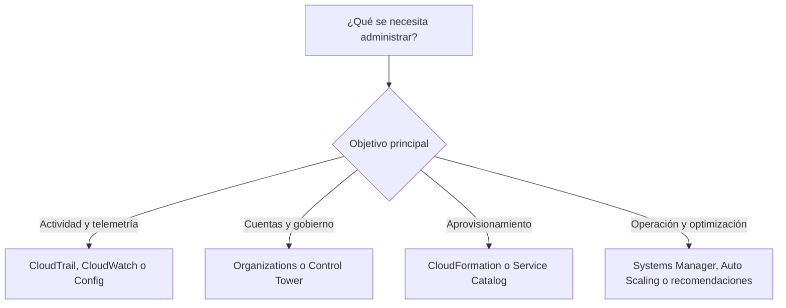
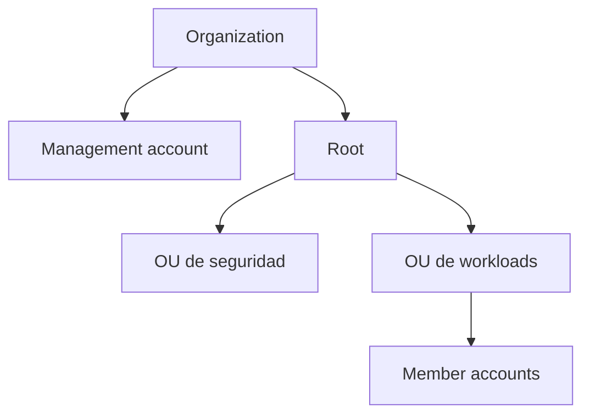
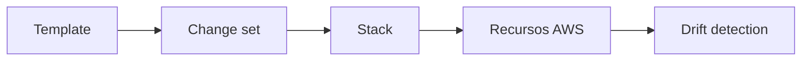
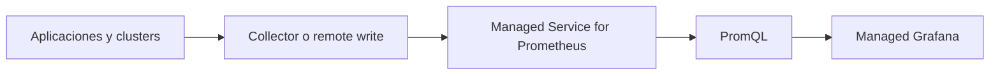
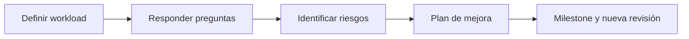
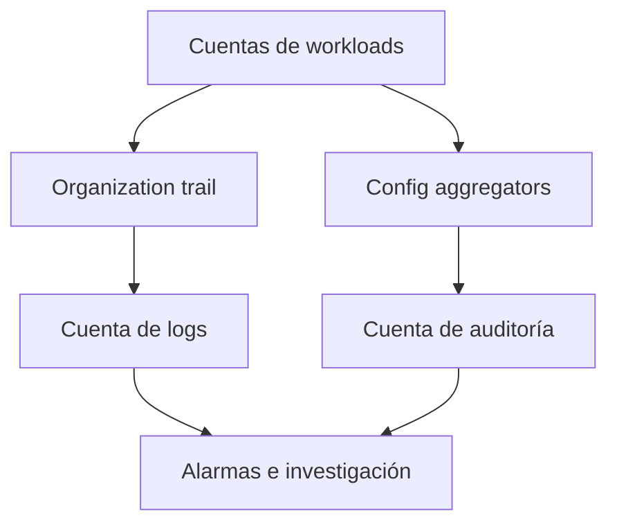

# Servicios de administración y gobierno en AWS para el examen SAA-C03


## 1. Alcance necesario para el examen

La guía oficial vigente del SAA-C03 incluye los siguientes servicios en la categoría Management and Governance:

- AWS Auto Scaling
- AWS CLI
- AWS CloudFormation
- AWS CloudTrail
- Amazon CloudWatch
- AWS Compute Optimizer
- AWS Config
- AWS Control Tower
- AWS Health Dashboard
- AWS License Manager
- Amazon Managed Grafana
- Amazon Managed Service for Prometheus
- AWS Management Console
- AWS Organizations
- AWS Service Catalog
- AWS Systems Manager
- AWS Trusted Advisor
- AWS Well-Architected Tool

El examen evalúa principalmente la capacidad de:

- Elegir entre interfaz web, comandos e infraestructura como código.
- Diferenciar métricas, logs, eventos de API e historial de configuración.
- Detectar, prevenir y corregir configuraciones no conformes.
- Diseñar gobierno multicuenta con Organizations y Control Tower.
- Aplicar límites organizacionales sin confundirlos con permisos IAM.
- Aprovisionar productos aprobados de forma autoservicio.
- Administrar flotas de servidores sin abrir acceso administrativo entrante.
- Escalar capacidad y optimizar recursos a partir de métricas.
- Distinguir recomendaciones, evaluaciones y mecanismos de aplicación.
- Centralizar observabilidad de cuentas, Regiones y entornos híbridos.
- Reaccionar a eventos de salud que afecten servicios o recursos.
- Revisar una arquitectura con los seis pilares de AWS Well-Architected.
- Seleccionar la solución con menor costo y operación que cumpla los requisitos.

> **Alcance de esta guía:** solo se desarrollan los 18 servicios anteriores. Otros servicios pueden aparecer para explicar integraciones, pero no se estudian como secciones independientes.

---

## 2. Modelos fundamentales de administración y gobierno

| Necesidad | Modelo | Servicio principal | Uso típico |
|---|---|---|---|
| Ajustar capacidad de varios recursos | Escalado | AWS Auto Scaling | Definir estrategias de escalado para recursos relacionados |
| Automatizar mediante comandos | Interfaz de línea de comandos | AWS CLI | Ejecutar API de AWS desde terminal o scripts |
| Aprovisionar de forma repetible | Infraestructura como código | AWS CloudFormation | Crear stacks a partir de templates |
| Saber quién hizo una llamada API | Auditoría | AWS CloudTrail | Investigar actividad de cuentas y recursos |
| Observar rendimiento y aplicaciones | Telemetría | Amazon CloudWatch | Métricas, logs, alarmas y dashboards |
| Obtener recomendaciones de dimensionamiento | Optimización | AWS Compute Optimizer | Rightsizing de recursos a partir de utilización |
| Registrar configuración y evaluar cumplimiento | Configuration governance | AWS Config | Historial, rules, conformance packs y remediation |
| Establecer una landing zone | Gobierno multicuenta administrado | AWS Control Tower | Crear y gobernar cuentas con controles |
| Conocer eventos que afectan a AWS o a la cuenta | Salud del servicio | AWS Health Dashboard | Incidentes, mantenimiento y cambios programados |
| Controlar licencias de software | Gestión de licencias | AWS License Manager | Descubrimiento y límites de licencias BYOL |
| Visualizar varias fuentes de telemetría | Dashboards administrados | Amazon Managed Grafana | Dashboards y consultas sobre métricas, logs y traces |
| Operar métricas compatibles con Prometheus | Métricas administradas | Amazon Managed Service for Prometheus | Ingerir, almacenar y consultar métricas con PromQL |
| Administrar desde el navegador | Interfaz web | AWS Management Console | Explorar y operar servicios de forma interactiva |
| Organizar y gobernar cuentas | Gobierno organizacional | AWS Organizations | OUs, políticas y facturación consolidada |
| Ofrecer productos aprobados | Catálogo autoservicio | AWS Service Catalog | Portfolios y productos con restricciones |
| Operar servidores y recursos a escala | Gestión de flota | AWS Systems Manager | Session Manager, Run Command, Automation y parches |
| Revisar oportunidades comunes | Recomendaciones | AWS Trusted Advisor | Costos, seguridad, rendimiento y resiliencia |
| Revisar decisiones de arquitectura | Evaluación arquitectónica | AWS Well-Architected Tool | Workloads, lenses, riesgos y planes de mejora |

### Regla mental inicial



> **Regla de examen:** CloudTrail registra actividad de API; CloudWatch observa rendimiento; Config conserva configuración y cumplimiento; Organizations organiza cuentas; Control Tower construye y gobierna una landing zone.

---

## 3. Conceptos de arquitectura que se deben dominar

### Plano de administración y plano de datos

- El **plano de administración** crea, modifica y elimina recursos.
- El **plano de datos** procesa el contenido o tráfico del servicio.
- CloudTrail registra de forma predeterminada muchos **management events**.
- Los **data events** de alto volumen, como acceso a objetos o invocaciones, suelen requerir configuración explícita.
- Una pregunta de auditoría puede exigir ambos tipos de eventos.

### Métrica, log, evento de API e historial de configuración

| Dato | Responde principalmente | Servicio |
|---|---|---|
| Métrica | “¿Cuánto, con qué frecuencia o qué valor?” | Amazon CloudWatch |
| Log | “¿Qué escribió la aplicación o el sistema?” | CloudWatch Logs |
| Llamada API | “¿Quién hizo qué, cuándo y desde dónde?” | AWS CloudTrail |
| Configuration item | “¿Cómo estaba configurado el recurso?” | AWS Config |
| Evento de salud | “¿AWS reportó un incidente o mantenimiento?” | AWS Health Dashboard |

Un mismo incidente puede requerir correlacionar los cinco datos. Ningún servicio sustituye a todos los demás.

### Controles preventivos, detectivos y proactivos

| Tipo | Momento | Resultado |
|---|---|---|
| Preventivo | Antes o durante una acción | Impide una operación no autorizada |
| Detectivo | Después de crear o cambiar un recurso | Identifica falta de cumplimiento |
| Proactivo | Antes del aprovisionamiento mediante CloudFormation | Rechaza recursos no conformes del template |
| Correctivo | Después de detectar una condición | Ejecuta remediación manual o automática |

- En Control Tower, un control preventivo puede apoyarse en SCP o RCP.
- Un control detectivo suele apoyarse en AWS Config.
- Un control proactivo puede usar hooks de CloudFormation.
- Una Config rule detecta; no evita por sí sola el cambio.

### Recomendación frente a aplicación

| Función | Ejemplo |
|---|---|
| Recomienda | Compute Optimizer, Trusted Advisor, Well-Architected Tool |
| Detecta cumplimiento | AWS Config |
| Limita acciones o acceso a recursos | SCP o RCP de Organizations |
| Aprovisiona | CloudFormation |
| Repara | Systems Manager Automation o remediation de Config |
| Cambia capacidad | AWS Auto Scaling |

> **Trampa de examen:** una recomendación no modifica automáticamente el recurso. Verificar siempre si la pregunta pide análisis, alerta, prevención o remediación.

### Interfaces de operación

| Interfaz | Ventaja | Límite |
|---|---|---|
| Management Console | Exploración visual y tareas puntuales | Difícil de repetir y revisar |
| AWS CLI | Automatización mediante comandos y scripts | El script debe manejar errores y estado |
| CloudFormation | Estado declarativo, repetibilidad y control de cambios | Requiere templates y ciclo de despliegue |

Las tres interfaces utilizan permisos IAM. Cambiar de interfaz no concede permisos adicionales.

### Gobierno multicuenta



- Una organization tiene una **management account**.
- Las demás son **member accounts**.
- Las OUs permiten agrupar cuentas y heredar políticas.
- Una cuenta pertenece directamente a una sola OU.
- Se recomienda mantener workloads fuera de la management account.
- Los recursos permanecen en las cuentas; Organizations no los combina.

### SCP, RCP e IAM

| Política | A quién limita | ¿Concede permisos? |
|---|---|---|
| IAM identity policy | Usuarios, grupos o roles | Sí, dentro de otros límites |
| Resource-based policy | Acceso al recurso | Sí, dentro de otros límites |
| Service control policy | Principals de member accounts | No; define el máximo disponible |
| Resource control policy | Recursos de la organización | No; define el máximo acceso disponible al recurso |

Una acción solo se permite cuando todas las capas aplicables lo permiten y ninguna denegación explícita la bloquea.

### Observabilidad

- **Métricas:** valores numéricos agregables.
- **Logs:** registros discretos con contexto.
- **Traces:** recorrido de una solicitud distribuida.
- **Dashboards:** visualización; no son necesariamente la fuente de los datos.
- **Alarmas:** evalúan métricas o expresiones.
- **Alertas:** notifican o disparan acciones.

Amazon Managed Grafana visualiza datos; Amazon Managed Service for Prometheus almacena y consulta métricas Prometheus; CloudWatch ofrece telemetría nativa de AWS.

### Servicios globales y regionales

- Organizations es un servicio de gobierno global.
- CloudFormation stacks, CloudWatch, Config, Systems Manager y la mayoría de recursos operan por Región.
- Un control organizacional puede tener alcance amplio, pero el recorder, stack, workspace o dashboard puede requerir despliegue regional.
- Antes de ejecutar un cambio en Console o CLI, confirmar cuenta y Región.

---

## 4. AWS Auto Scaling

AWS Auto Scaling proporciona **scaling plans** para identificar recursos escalables relacionados y definir una estrategia de escalado coherente.

### Conceptos principales

| Concepto | Función |
|---|---|
| Scaling plan | Conjunto de instrucciones de escalado para recursos relacionados |
| Scalable resource | Recurso cuya capacidad puede aumentar o disminuir |
| Target tracking | Ajusta capacidad para mantener una métrica objetivo |
| Predictive scaling | Pronostica demanda y prepara capacidad |
| Scheduled scaling | Cambia capacidad en momentos conocidos |
| Scaling strategy | Prioriza disponibilidad, costo o equilibrio |

Los recursos pueden descubrirse mediante:

- Un stack de CloudFormation.
- Tags.
- Selección compatible con el plan.

### Cuándo elegirlo

- Recursos relacionados necesitan una estrategia común.
- La carga varía y debe ajustar capacidad automáticamente.
- Existe historial suficiente para predicción.
- Se desea equilibrar disponibilidad y costo.

### Distinción actual importante

AWS mantiene los scaling plans en el alcance oficial del examen. Para diseños nuevos, la documentación vigente recomienda configurar políticas, incluido predictive scaling, directamente en Amazon EC2 Auto Scaling o Application Auto Scaling cuando sea posible.

### Cuándo no elegirlo

- Para recibir únicamente una recomendación de rightsizing: Compute Optimizer.
- Para escalar solo un Auto Scaling group de EC2 con políticas directas: Amazon EC2 Auto Scaling.
- Para optimizar arquitectura sin cambiar capacidad: Trusted Advisor o Well-Architected Tool.
- Para cargas que no pueden escalar horizontalmente.

### Trampas de examen

- **AWS Auto Scaling** no es sinónimo de **Amazon EC2 Auto Scaling**.
- Escalar capacidad no corrige una consulta lenta ni un diseño sin particionamiento.
- Predictive scaling prepara capacidad para patrones pronosticables; dynamic scaling reacciona a métricas.
- El cooldown o tiempo de calentamiento evita decisiones basadas en capacidad todavía no lista.
- El escalado debe considerar cuotas, dependencias y capacidad downstream.

---

## 5. AWS CLI

AWS Command Line Interface es una herramienta de código abierto que permite llamar a las API públicas de AWS desde una shell y automatizar tareas con scripts.

### Estructura de un comando

```text
aws <servicio> <operación> [parámetros]
```

Ejemplo conceptual:

```bash
aws cloudformation describe-stacks \
  --stack-name red-prod \
  --region us-east-1 \
  --profile produccion
```

### Configuración que se debe reconocer

| Elemento | Uso |
|---|---|
| `~/.aws/config` | Región, formato de salida, perfiles, SSO y otras opciones |
| `~/.aws/credentials` | Credenciales compartidas cuando se utiliza ese método |
| `--profile` | Selecciona un perfil |
| `--region` | Sobrescribe la Región |
| `--output` | Define JSON, YAML, text o table según compatibilidad |
| `--query` | Filtra en el cliente con JMESPath |
| Filtros del servicio | Filtran en el servidor antes de devolver resultados |

La precedencia relevante comienza con:

1. Opciones de la línea de comandos.
2. Variables de entorno.
3. Métodos de roles, identidad y archivos según la cadena de credenciales.

### Seguridad

- Preferir IAM Identity Center, roles y credenciales temporales.
- Evitar access keys de larga duración.
- No incluir secretos en scripts, repositorios o historial de shell.
- Aplicar least privilege al principal que ejecuta el comando.
- CloudTrail puede registrar las llamadas API efectuadas por CLI.
- Un comando firmado puede fallar si el reloj local está muy desincronizado.

### Cuándo elegirlo

- Automatización operativa y scripts.
- Consultas repetibles desde terminal.
- Tareas rápidas no cubiertas por una interfaz visual.
- Pipelines que llaman APIs de AWS.

### Cuándo no elegirlo

- Para administrar estado declarativo y dependencias complejas: CloudFormation.
- Para una experiencia visual interactiva: Management Console.
- Para ejecutar comandos dentro de una flota sin SSH: Systems Manager Run Command.

### Trampas de examen

- La CLI no evita permisos IAM.
- `--query` es filtrado del lado del cliente; un filtro de API reduce lo que devuelve el servicio.
- El perfil `default` se usa si no se indica otro.
- AWS CLI v2 es la versión principal vigente.
- Un script imperativo no ofrece automáticamente rollback, drift detection ni estado de stack.

---

## 6. AWS CloudFormation

AWS CloudFormation aprovisiona y administra recursos mediante templates declarativos tratados como infraestructura como código.

### Componentes

| Componente | Función |
|---|---|
| Template | Documento YAML o JSON que declara infraestructura |
| Stack | Instancia administrada de un template |
| Resource | Recurso que se crea o actualiza |
| Parameter | Entrada disponible al desplegar |
| Mapping | Tabla estática de valores |
| Condition | Controla creación o propiedades según condiciones |
| Output | Expone valores del stack |
| Intrinsic function | Construye o consulta valores dentro del template |
| Change set | Previsualiza cambios propuestos |
| StackSet | Despliega stacks en varias cuentas y Regiones |

### Flujo conceptual



### Actualizaciones y protección

- Un change set muestra adiciones, modificaciones y eliminaciones previstas.
- No garantiza que la actualización vaya a completarse.
- CloudFormation ordena recursos según dependencias.
- Ante un fallo, normalmente intenta rollback.
- La termination protection evita una eliminación accidental del stack.
- Una stack policy puede proteger recursos frente a determinadas actualizaciones.

### `DeletionPolicy`

| Valor | Al eliminar el stack |
|---|---|
| `Delete` | Elimina el recurso |
| `Retain` | Conserva el recurso |
| `Snapshot` | Crea snapshot para recursos compatibles antes de eliminar |

No confundir `DeletionPolicy` con una política de backup general.

### Drift

Drift ocurre cuando la configuración real difiere de la configuración esperada en CloudFormation.

- Drift detection identifica cambios fuera de banda.
- No corrige automáticamente la divergencia.
- No todas las propiedades o tipos de recursos ofrecen el mismo soporte.
- AWS Config puede registrar cambios, mientras CloudFormation compara contra el template.

### StackSets

- Despliegan stacks en múltiples cuentas y Regiones.
- Pueden integrarse con Organizations.
- Un cambio en el StackSet se propaga mediante operaciones sobre stack instances.
- Son apropiados para roles, reglas, configuración base y recursos repetidos.

### Cuándo elegirlo

- Infraestructura repetible y versionada.
- Despliegues coherentes entre ambientes.
- Dependencias y rollback administrados.
- Despliegues multicuenta o multirregión con StackSets.

### Cuándo no elegirlo

- Para ejecutar tareas operativas dentro del sistema operativo: Systems Manager.
- Para entregar productos aprobados a usuarios con una experiencia de catálogo: Service Catalog.
- Para investigar quién modificó un recurso: CloudTrail.

### Trampas de examen

- Un change set previsualiza; no valida todas las condiciones de ejecución.
- Eliminar un stack elimina por defecto los recursos administrados salvo políticas de retención.
- Nested stacks reutilizan componentes; StackSets distribuyen stacks.
- CloudFormation no registra toda la actividad de cuenta: CloudTrail lo hace.
- Cambios manuales pueden crear drift.

---

## 7. AWS CloudTrail

AWS CloudTrail registra actividad de cuentas y llamadas API para auditoría, seguridad, investigación y cumplimiento.

### Tipos de eventos

| Tipo | Ejemplo | Consideración |
|---|---|---|
| Management event | Crear una instancia o cambiar una policy | Actividad del plano de administración |
| Data event | Leer un objeto o invocar una función | Alto volumen; se configura explícitamente |
| Insights event | Tasa inusual de llamadas o errores | Detección de comportamiento anómalo |

### Event History

- Está disponible de forma predeterminada.
- Muestra los últimos 90 días.
- Incluye management events.
- Se consulta por Región.
- No sustituye una estrategia de retención y análisis a largo plazo.

### Trail y CloudTrail Lake

| Opción | Uso |
|---|---|
| Trail | Entrega eventos a un bucket S3 y opcionalmente a CloudWatch Logs |
| Organization trail | Registra actividad de cuentas de una organization |
| CloudTrail Lake | Almacén administrado para consultar eventos con SQL |

Los trails pueden integrarse con:

- Amazon S3 para retención.
- CloudWatch Logs para búsqueda, métricas y alarmas.
- EventBridge para reaccionar a eventos.
- KMS para cifrado cuando se requiere una clave administrada por el cliente.
- Validación de integridad de archivos de log.

### Cuándo elegirlo

- Identificar quién cambió un security group.
- Auditar una llamada API denegada.
- Investigar actividad de credenciales.
- Conservar evidencia de cambios.
- Consultar actividad multicuenta.

### Cuándo no elegirlo

- Para CPU, latencia o número de solicitudes: CloudWatch.
- Para saber cómo estaba configurado un recurso: AWS Config.
- Para un incidente anunciado por AWS: Health Dashboard.

### Trampas de examen

- Event History no conserva todos los datos indefinidamente.
- Los data events no deben asumirse activados por defecto.
- CloudTrail registra una acción de consola porque la consola llama APIs.
- Un trail multirregional es preferible para auditoría integral.
- CloudTrail no es un sistema de métricas de rendimiento.
- Los logs de auditoría deben protegerse contra acceso y borrado no autorizados.

---

## 8. Amazon CloudWatch

Amazon CloudWatch recopila, almacena, consulta y visualiza datos de observabilidad de recursos y aplicaciones.

### Capacidades principales

| Capacidad | Uso |
|---|---|
| Metrics | Series temporales numéricas |
| Logs | Ingesta, retención y consulta de logs |
| Alarms | Evaluación de métricas y ejecución de acciones |
| Dashboards | Visualización personalizada |
| Logs Insights | Consulta interactiva de logs |
| Metric filters | Conversión de patrones de logs en métricas |
| Composite alarms | Combinación de estados de alarmas |

### Métricas

Una métrica se identifica mediante:

- Namespace.
- Nombre de métrica.
- Dimensiones.
- Timestamp y valor.
- Unidad.

El **period** define la ventana; el **statistic** define cómo se agregan los puntos.

### Basic, detailed y custom monitoring

- Varios servicios publican métricas automáticamente.
- La frecuencia disponible depende del servicio y nivel de monitoring.
- Las custom metrics permiten publicar métricas de negocio o aplicación.
- El CloudWatch agent recopila métricas del sistema operativo y logs.
- Para EC2, memoria y uso del filesystem normalmente requieren el agent; no son métricas nativas del hipervisor.

### Estados de una alarma

| Estado | Significado |
|---|---|
| `OK` | La condición no se cumple |
| `ALARM` | La condición se cumple |
| `INSUFFICIENT_DATA` | No existe información suficiente |

Se debe configurar cómo tratar **missing data** según la naturaleza de la métrica.

### CloudWatch Logs

- Log group agrupa streams y define retención, cifrado y otras opciones.
- Log stream representa una secuencia de eventos.
- Logs Insights permite búsquedas ad hoc.
- Metric filters crean métricas a partir de patrones.
- Subscription filters envían eventos a destinos compatibles.
- Si no se configura retención, los logs pueden conservarse indefinidamente y generar costo.

### Observabilidad entre cuentas

- CloudWatch cross-account observability permite compartir telemetría entre cuentas mediante observability access manager.
- La vinculación se configura por Región.
- Los dashboards pueden presentar datos de varias cuentas y Regiones según la función utilizada.
- Centralizar la observabilidad no elimina los permisos ni costos de las cuentas origen.

### Cuándo elegirlo

- Alarmar por latencia, errores o saturación.
- Consultar logs de aplicaciones.
- Escalar con base en métricas.
- Construir dashboards operativos.
- Ejecutar acciones ante umbrales.

### Cuándo no elegirlo

- Para atribuir una llamada API a una identidad: CloudTrail.
- Para evaluar si un recurso cumple una regla: Config.
- Para métricas Prometheus con PromQL como requisito principal: Managed Service for Prometheus.

### Trampas de examen

- Dashboard no equivale a alarmas.
- Log no equivale a métrica; un metric filter puede conectarlos.
- Una alarma evalúa la métrica, no inspecciona por sí sola la causa.
- CPU baja no demuestra que una instancia esté correctamente dimensionada si faltan memoria, red o latencia.
- Ajustar retención y cardinalidad evita costos innecesarios.

---

## 9. AWS Compute Optimizer

AWS Compute Optimizer analiza configuración y métricas de utilización para producir recomendaciones de rightsizing y detectar recursos potencialmente ociosos.

### Recursos y señales

Las capacidades vigentes incluyen recomendaciones para varios recursos, entre ellos:

- Instancias EC2.
- Auto Scaling groups.
- Volúmenes EBS.
- Funciones Lambda.
- Servicios ECS sobre Fargate.
- Bases de datos compatibles.
- Licencias comerciales compatibles.
- Recursos inactivos compatibles.

La disponibilidad exacta depende de Región, tipo de cuenta y función.

### Cómo funciona

1. La cuenta se inscribe en Compute Optimizer.
2. El servicio analiza configuración y métricas de CloudWatch.
3. Clasifica hallazgos y genera alternativas.
4. Estima riesgo de rendimiento y ahorro.
5. El equipo valida e implementa la recomendación.

### Datos de memoria y lookback

- La memoria no siempre está disponible en métricas nativas.
- Puede requerir CloudWatch agent o métricas mejoradas.
- Más historial ayuda a capturar ciclos de carga.
- Enhanced infrastructure metrics y ciertas preferencias pueden tener costo.

### Cuándo elegirlo

- Rightsizing de EC2, ASG, EBS o recursos compatibles.
- Identificar sobreaprovisionamiento.
- Comparar tipos o tamaños alternativos.
- Estimar ahorro después de observar utilización.

### Cuándo no elegirlo

- Para cambiar capacidad en tiempo real: AWS Auto Scaling.
- Para revisar toda una arquitectura contra seis pilares: Well-Architected Tool.
- Para aplicar una política de cumplimiento: AWS Config.
- Para asumir que toda recomendación es segura sin probarla.

### Trampas de examen

- Compute Optimizer recomienda; no cambia el recurso automáticamente.
- Pocos datos pueden producir una visión incompleta.
- CPU no es la única señal.
- Una instancia con baja utilización puede ser necesaria para disponibilidad o picos.
- Validar dependencias, reservas, licencias y rendimiento antes de aplicar.

---

## 10. AWS Config

AWS Config registra configuraciones de recursos compatibles, sus relaciones y cambios, y evalúa cumplimiento mediante reglas.

### Componentes

| Componente | Función |
|---|---|
| Configuration recorder | Registra configuration items |
| Delivery channel | Entrega snapshots e historial según configuración |
| Configuration item | Representación de un recurso en un momento |
| Config rule | Evalúa cumplimiento |
| Remediation | Ejecuta una acción correctiva |
| Conformance pack | Agrupa rules y acciones de remediación |
| Aggregator | Centraliza resultados de varias cuentas y Regiones |

### Rules

| Tipo | Implementación |
|---|---|
| AWS managed rule | Regla mantenida por AWS |
| Custom rule | Lógica definida por el cliente |

La evaluación puede dispararse:

- Por cambios de configuración.
- De forma periódica.
- Según la regla.

### Conformance packs

- Agrupan Config rules y remediaciones.
- Se despliegan como una unidad.
- Facilitan estándares repetibles.
- Pueden utilizarse a escala organizacional.
- No convierten una regla detectiva en una barrera preventiva.

### Aggregators

- Agregan datos de cumplimiento y configuración.
- Admiten múltiples cuentas y Regiones.
- No sustituyen el recorder en las cuentas y Regiones origen.
- Permiten una vista central.

### Cuándo elegirlo

- Encontrar recursos sin cifrado o tags requeridos.
- Ver cómo cambió la configuración.
- Evaluar cumplimiento continuamente.
- Centralizar posture de varias cuentas.
- Ejecutar remediación mediante Systems Manager Automation.

### Cuándo no elegirlo

- Para impedir una acción antes de que ocurra: usar controles preventivos.
- Para saber qué identidad llamó a la API: CloudTrail.
- Para rendimiento y logs: CloudWatch.

### Trampas de examen

- Config detecta configuración; no registra el contenido de los datos.
- Una rule no bloquea el cambio.
- Un aggregator no activa grabación en las cuentas origen.
- La cobertura depende de tipos de recursos y Región.
- Registrar todo sin revisar volumen y frecuencia puede aumentar costo.

---

## 11. AWS Control Tower

AWS Control Tower configura y gobierna una **landing zone** multicuenta basada en AWS Organizations y otros servicios de seguridad y administración.

### Landing zone

Una landing zone establece:

- Estructura de cuentas y OUs.
- Identidad y acceso.
- Logging central.
- Cuenta de auditoría.
- Controles de gobierno.
- Account Factory.
- Regiones gobernadas.

Las cuentas compartidas principales incluyen:

- Management account.
- Log archive account.
- Audit account.

### Controles

| Comportamiento | Implementación típica | Resultado |
|---|---|---|
| Preventivo | SCP o RCP | Impide acciones |
| Detectivo | AWS Config rule | Detecta recursos no conformes |
| Proactivo | CloudFormation hook | Rechaza aprovisionamiento no conforme |

Las categorías de orientación son:

- Mandatory.
- Strongly recommended.
- Elective.

### Account Factory

- Estandariza el aprovisionamiento de cuentas.
- Aplica configuración base.
- Puede inscribir cuentas existentes compatibles.
- Reduce la configuración manual.
- No elimina la necesidad de diseñar OUs, redes, identidades y políticas.

### Drift

En Control Tower, drift significa que recursos administrados por la landing zone cambiaron respecto a su configuración esperada.

- Puede requerir reparación.
- No es lo mismo que drift de un stack cualquiera.
- Cambios manuales en recursos administrados pueden afectar el gobierno.

### Cuándo elegirlo

- Crear rápidamente una landing zone gobernada.
- Estandarizar nuevas cuentas.
- Habilitar logging y auditoría central.
- Aplicar controles a OUs.
- Obtener una experiencia integrada de gobierno.

### Cuándo no elegirlo

- Para una sola cuenta sin necesidad de landing zone.
- Para reemplazar Organizations: Control Tower lo utiliza.
- Para conceder permisos de workload: se sigue necesitando IAM.
- Para corregir automáticamente toda falta de cumplimiento.

### Trampas de examen

- Control Tower no reemplaza Organizations.
- Un control detectivo informa; no impide.
- Las Regiones gobernadas importan para el alcance.
- Mover o modificar cuentas fuera del proceso puede crear drift.
- Account Factory crea cuentas estandarizadas, no aplicaciones completas.

---

## 12. AWS Health Dashboard

AWS Health Dashboard presenta información sobre disponibilidad, cambios y eventos que pueden afectar servicios o recursos.

### Tipos de información

| Vista | Contenido |
|---|---|
| Public service events | Eventos generales de servicios y Regiones |
| Account-specific events | Eventos que afectan recursos o cuenta concretos |
| Scheduled changes | Mantenimiento o cambios planificados |
| Organizational view | Eventos agregados de cuentas de Organizations |

### Integración con EventBridge

Los eventos de AWS Health pueden:

- Enviar notificaciones.
- Crear tickets.
- Invocar automatización.
- Enriquecerse con información de cuenta.
- Centralizarse para equipos operativos.

### Cuándo elegirlo

- Determinar si un incidente de AWS afecta recursos propios.
- Prepararse para mantenimiento programado.
- Agregar eventos de salud de varias cuentas.
- Automatizar respuesta ante eventos específicos.

### Cuándo no elegirlo

- Para detectar que la aplicación está lenta sin un evento de AWS: CloudWatch.
- Para auditar cambios: CloudTrail.
- Para comprobar cumplimiento: Config.

### Trampas de examen

- El Service Health público no tiene el mismo contexto que un evento específico de la cuenta.
- Un dashboard no garantiza respuesta automática; integrar EventBridge si se requiere.
- CloudWatch muestra telemetría; Health informa eventos del proveedor y recursos afectados.
- Revisar el alcance de cuenta, Región y organización.

---

## 13. AWS License Manager

AWS License Manager ayuda a descubrir, seguir y controlar el uso de licencias de software en AWS y entornos híbridos.

### Conceptos

| Concepto | Función |
|---|---|
| Self-managed license | Reglas definidas para una licencia propia |
| License configuration | Modelo de conteo y límites |
| Resource discovery | Encuentra recursos que consumen licencias |
| Automated discovery | Utiliza inventario compatible para identificar software |
| License rule | Condición por cores, sockets, vCPU u otra métrica compatible |

### Integraciones

- AWS Organizations para visibilidad multicuenta.
- Systems Manager Inventory para descubrimiento de software.
- EC2 y servicios compatibles para aplicación y seguimiento.
- Entornos híbridos administrados cuando son compatibles.

### Cuándo elegirlo

- BYOL con límites contractuales.
- Seguimiento de licencias por vCPU, core o socket.
- Evitar sobreutilización.
- Centralizar inventario de licencias.
- Informar incumplimientos potenciales.

### Cuándo no elegirlo

- Para instalar o actualizar software: Systems Manager.
- Para comprar cualquier licencia del Marketplace.
- Para optimización general de recursos: Compute Optimizer.
- Para sustituir la interpretación legal del contrato del proveedor.

### Trampas de examen

- License Manager administra reglas e inventario; no parchea aplicaciones.
- El descubrimiento automático depende de agentes, inventario y permisos configurados.
- Un límite de licencia no es un límite de servicio AWS.
- Se debe definir correctamente el modelo de conteo del contrato.

---

## 14. Amazon Managed Grafana

Amazon Managed Grafana proporciona workspaces administrados de Grafana para consultar y visualizar métricas, logs y traces de diversas fuentes.

### Componentes

| Componente | Función |
|---|---|
| Workspace | Entorno Grafana administrado |
| Data source | Fuente consultada por Grafana |
| Dashboard | Colección de paneles |
| Panel | Visualización de una consulta |
| Alerting | Evaluación y notificación según configuración |
| Workspace role | Admin, Editor o Viewer |

### Fuentes comunes

- Amazon CloudWatch.
- Amazon OpenSearch Service.
- AWS X-Ray.
- Amazon Managed Service for Prometheus.
- Fuentes de observabilidad compatibles.

### Identidad y acceso

- Los usuarios del workspace pueden autenticarse mediante IAM Identity Center o SAML.
- Los roles de workspace controlan lo que hacen dentro de Grafana.
- Roles IAM permiten que el workspace consulte fuentes AWS.
- La autenticación del usuario y el acceso del workspace a datos son problemas distintos.

### Cuándo elegirlo

- Dashboards Grafana sin operar servidores Grafana.
- Visualizar varias fuentes en un mismo panel.
- Usar PromQL con Managed Service for Prometheus.
- Centralizar observabilidad para equipos.

### Cuándo no elegirlo

- Para ingerir o almacenar métricas Prometheus: Managed Service for Prometheus.
- Para conservar logs sin una fuente de logs.
- Para auditar llamadas API: CloudTrail.

### Trampas de examen

- Grafana visualiza y consulta; la telemetría permanece en la fuente.
- Crear un workspace no configura automáticamente todas las fuentes y permisos.
- El rol Viewer no debe confundirse con permisos IAM a los datos.
- Dashboards con consultas costosas o cardinalidad alta pueden elevar costos.

---

## 15. Amazon Managed Service for Prometheus

Amazon Managed Service for Prometheus es un servicio serverless compatible con Prometheus para ingerir, almacenar y consultar métricas.

### Componentes

| Componente | Función |
|---|---|
| Workspace | Espacio lógico para métricas |
| Remote write | Protocolo de ingesta Prometheus |
| Collector o scraper | Recopila métricas de targets compatibles |
| PromQL | Lenguaje de consulta |
| Rule groups | Recording y alerting rules |
| Alert manager | Enruta alertas según configuración |

### Flujo conceptual



### Características

- Escala ingesta, almacenamiento y consulta sin administrar servidores Prometheus.
- Es compatible con el modelo de métricas y PromQL de Prometheus.
- Replica datos entre varias Availability Zones dentro de la Región.
- Se integra frecuentemente con EKS y AWS Distro for OpenTelemetry.
- Admite reglas de grabación y alertas.

### Cardinalidad

Cada combinación única de labels crea una serie.

- Labels con IDs no acotados aumentan cardinalidad.
- Más series implican más ingesta, almacenamiento y costo.
- Recording rules pueden acelerar consultas repetitivas.
- Diseñar labels es una decisión operativa y económica.

### Cuándo elegirlo

- Métricas de contenedores con estándar Prometheus.
- PromQL como requisito.
- Evitar operar servidores Prometheus de alta disponibilidad.
- Visualización con Managed Grafana.

### Cuándo no elegirlo

- Para logs o traces.
- Para dashboards por sí solo: usar Grafana u otra interfaz.
- Para auditoría de API.
- Para métricas nativas sencillas ya cubiertas por CloudWatch sin requisito Prometheus.

### Trampas de examen

- Prometheus almacena métricas, no logs.
- Grafana no sustituye el workspace de métricas.
- El servicio administrado no elimina la necesidad de instrumentación y collectors.
- Una cardinalidad sin control afecta costo y rendimiento de consultas.

---

## 16. AWS Management Console

AWS Management Console es la aplicación web que centraliza el acceso a las consolas de los servicios AWS.

### Capacidades

- Navegación y búsqueda de servicios.
- Selección de cuenta, rol y Región.
- AWS Console Home y widgets.
- Notificaciones y AWS Health.
- Acceso a AWS CloudShell.
- Personalización de idioma y Región predeterminada.

### Seguridad

- Los permisos los determina IAM.
- Preferir federación, IAM Identity Center y MFA.
- Evitar usar el root user para tareas diarias.
- Verificar la cuenta, el rol y la Región antes de efectuar cambios.
- AWS Management Console Private Access puede restringir acceso desde redes definidas en escenarios compatibles.
- Las acciones de consola llaman APIs y pueden aparecer en CloudTrail.

### Cuándo elegirlo

- Exploración y aprendizaje.
- Tareas puntuales.
- Visualizar configuración.
- Investigar un recurso de forma interactiva.

### Cuándo no elegirlo

- Para despliegues repetibles: CloudFormation.
- Para automatización en shell: AWS CLI.
- Para demostrar por sí sola quién hizo un cambio: CloudTrail.
- Para ejecutar cambios idénticos manualmente en muchas cuentas.

### Trampas de examen

- La Región predeterminada no convierte todos los servicios en regionales.
- La consola no es una herramienta de infraestructura como código.
- CloudShell ofrece CLI, pero sigue usando credenciales y permisos de la sesión.
- Favoritos, historial visual y widgets no sustituyen auditoría.

---

## 17. AWS Organizations

AWS Organizations permite administrar cuentas de forma central, agruparlas en OUs, aplicar políticas y utilizar facturación consolidada.

### Jerarquía

| Elemento | Función |
|---|---|
| Organization | Contenedor de cuentas |
| Management account | Administra la organización |
| Root | Padre superior de OUs y cuentas |
| Organizational unit | Agrupa cuentas y OUs |
| Member account | Cuenta que pertenece a la organización |

### Modos y capacidades

- **Consolidated billing:** agrupa facturación.
- **All features:** habilita políticas y capacidades completas de gobierno.
- Las SCP requieren all features.
- La integración de un servicio puede utilizar trusted access.
- Un delegated administrator reduce el uso cotidiano de la management account.

### Service control policies

- Definen el máximo de permisos disponible.
- Se heredan desde root y OUs.
- No conceden permisos.
- No afectan a la management account.
- Una explicit deny prevalece.
- El principal todavía necesita un `Allow` en IAM o policy aplicable.

### Resource control policies

- Definen el máximo acceso disponible a recursos dentro de su alcance.
- Ayudan a limitar acceso desde principals externos.
- Se aplican a recursos y servicios compatibles.
- No conceden acceso.
- Complementan las SCP; no las reemplazan.

### Facturación consolidada

- La management account recibe la factura consolidada.
- El uso puede agregarse para beneficios de precios compatibles.
- Cada cuenta mantiene sus recursos y límites de acceso.
- Facturación consolidada no implica acceso administrativo automático a member accounts.

### Cuándo elegirlo

- Separar workloads por cuenta.
- Aplicar límites comunes.
- Centralizar facturación.
- Delegar administración de servicios.
- Compartir recursos y políticas compatibles.

### Cuándo no elegirlo

- Para crear una landing zone completa con controles preconfigurados: Control Tower.
- Para conceder permisos detallados a usuarios: IAM.
- Para desplegar recursos por sí solo: CloudFormation StackSets.

### Trampas de examen

- SCP no concede permisos.
- Una cuenta pertenece directamente a una sola OU.
- La management account no es restringida por SCP.
- No ejecutar workloads en la management account salvo necesidad excepcional.
- Trusted access debe habilitarse cuidadosamente.
- RCP y SCP son límites diferentes: recurso frente a principal.

---

## 18. AWS Service Catalog

AWS Service Catalog permite crear catálogos de productos aprobados para que los usuarios los aprovisionen de forma autoservicio con gobierno.

### Componentes

| Componente | Función |
|---|---|
| Product | Solución aprovisionable |
| Version | Versión de un producto |
| Portfolio | Colección de productos, acceso y restricciones |
| Constraint | Regla aplicada al lanzamiento o producto |
| Provisioned product | Instancia creada por un usuario |

Un producto puede basarse en una plantilla CloudFormation o en otras opciones compatibles vigentes.

### Constraints

- Launch constraint.
- Template constraint.
- Notification constraint.
- Otras restricciones compatibles.

Una **launch constraint** asigna un rol que Service Catalog utiliza para aprovisionar. El usuario puede lanzar un producto aprobado sin recibir permisos directos amplios sobre todos los recursos subyacentes.

### Portfolios

- Agrupan productos.
- Se asocian con acceso.
- Se comparten entre cuentas.
- Pueden integrarse con Organizations.
- Permiten estandarizar versiones y opciones.

### Cuándo elegirlo

- Autoservicio de infraestructura aprobada.
- Limitar configuraciones disponibles.
- Dar a equipos productos repetibles.
- Separar administración del catálogo y consumo.

### Cuándo no elegirlo

- Para escribir el template base: CloudFormation.
- Para gobernar toda la jerarquía de cuentas: Organizations.
- Para parchear el producto después del despliegue: Systems Manager u otra operación.

### Trampas de examen

- Service Catalog consume artefactos de aprovisionamiento; no reemplaza CloudFormation.
- Portfolio es la agrupación; product es lo aprovisionable.
- Provisioned product es la instancia creada, normalmente respaldada por recursos de despliegue.
- Launch role no concede al usuario acceso ilimitado a los recursos resultantes.

---

## 19. AWS Systems Manager

AWS Systems Manager administra nodos y automatiza operaciones sobre recursos AWS, on-premises, edge y otros entornos compatibles.

### Requisitos de un managed node

- SSM Agent compatible.
- Permisos mediante IAM role o credenciales de activación.
- Conectividad de salida HTTPS a endpoints de Systems Manager, directa o mediante VPC endpoints.
- Registro correcto en Systems Manager.

No se necesita abrir SSH o RDP entrante para usar Session Manager.

### Capacidades principales

| Capacidad | Uso |
|---|---|
| Session Manager | Acceso interactivo seguro sin bastion ni puertos entrantes |
| Run Command | Ejecuta comandos en una flota |
| Automation | Ejecuta runbooks de varios pasos |
| State Manager | Mantiene una configuración deseada mediante associations |
| Patch Manager | Automatiza evaluación e instalación de parches |
| Inventory | Recopila metadata de software y sistema |
| Parameter Store | Almacena configuración y secretos ligeros |
| Maintenance Windows | Programa tareas operativas |
| Fleet Manager | Administra nodos mediante interfaz |

### Session Manager, Run Command y Automation

| Necesidad | Opción |
|---|---|
| Sesión interactiva | Session Manager |
| Mismo comando en muchos nodos | Run Command |
| Workflow operativo con pasos y branching | Automation |
| Mantener una propiedad en el tiempo | State Manager |

### Parameter Store

| Tipo | Uso |
|---|---|
| `String` | Texto |
| `StringList` | Lista |
| `SecureString` | Valor cifrado con KMS |

- Los nombres jerárquicos organizan parámetros.
- Las policies pueden controlar caducidad o notificaciones en tiers compatibles.
- Standard y Advanced difieren en tamaño, cantidad y características.
- Para rotación administrada de secretos de bases de datos, evaluar un servicio de secretos dedicado.
- El acceso exige IAM y, para `SecureString`, permisos KMS aplicables.

### Hybrid and multicloud

- Una activation registra servidores fuera de EC2.
- Los nodos registrados reciben una identidad administrada.
- Se pueden aplicar comandos, inventario y automatización compatibles.
- La conectividad y el agente siguen siendo necesarios.

### Cuándo elegirlo

- Administrar EC2 sin bastion.
- Parchar una flota.
- Ejecutar runbooks de remediación.
- Mantener configuración.
- Operar servidores híbridos desde un plano común.
- Guardar parámetros de aplicación.

### Cuándo no elegirlo

- Para declarar toda la infraestructura: CloudFormation.
- Para autoscaling: AWS Auto Scaling.
- Para auditoría de API: CloudTrail.
- Para configuración inmutable donde reemplazar instancias es preferible.

### Trampas de examen

- Sin puertos entrantes no significa sin red: el nodo necesita salida a endpoints.
- Agent instalado no basta; se requieren permisos.
- Run Command es ejecución; State Manager es estado deseado.
- Patch Manager automatiza parches, pero se deben definir baseline, ventana y reboot behavior.
- Parameter Store no concede acceso automáticamente a la aplicación.
- Session Manager mejora acceso, pero logs y cifrado deben configurarse según el requisito.

---

## 20. AWS Trusted Advisor

AWS Trusted Advisor inspecciona el entorno y produce recomendaciones basadas en buenas prácticas de AWS.

### Categorías

- Cost optimization.
- Performance.
- Security.
- Fault tolerance.
- Service limits.
- Operational excellence.

### Funcionamiento

- Ejecuta checks compatibles.
- Clasifica hallazgos.
- Muestra acciones recomendadas.
- Puede agregar resultados en una organización para planes de soporte compatibles.
- Las capacidades disponibles dependen del plan de soporte vigente.

### Cuándo elegirlo

- Revisión amplia de oportunidades comunes.
- Detectar recursos ociosos y configuraciones conocidas.
- Revisar cuotas y resiliencia.
- Priorizar mejoras operativas.

### Cuándo no elegirlo

- Para rightsizing detallado basado en utilización: Compute Optimizer.
- Para evaluación continua de una regla personalizada: Config.
- Para cambiar recursos automáticamente.
- Para una revisión guiada de una arquitectura específica: Well-Architected Tool.

### Trampas de examen

- La cantidad de checks depende del plan de soporte.
- Trusted Advisor recomienda; no garantiza remediación.
- Un check verde no prueba que toda la arquitectura sea segura.
- Las recomendaciones deben validarse en el contexto del workload.
- Service limits o quotas requieren planificación y, cuando corresponda, solicitud de aumento.

---

## 21. AWS Well-Architected Tool

AWS Well-Architected Tool documenta y revisa workloads frente a buenas prácticas mediante lenses, preguntas, riesgos y planes de mejora.

### Los seis pilares

| Pilar | Enfoque |
|---|---|
| Operational Excellence | Operar, observar y mejorar procesos |
| Security | Proteger información, sistemas y activos |
| Reliability | Recuperarse de fallos y satisfacer demanda |
| Performance Efficiency | Utilizar recursos eficientemente |
| Cost Optimization | Evitar gastos innecesarios |
| Sustainability | Minimizar impacto ambiental |

### Componentes

| Componente | Función |
|---|---|
| Workload | Conjunto de recursos y código que entrega valor |
| Lens | Preguntas y prácticas para un dominio |
| Review | Evaluación de respuestas |
| Risk | Hallazgo de riesgo alto o medio |
| Improvement plan | Acciones priorizadas |
| Milestone | Snapshot inmutable de un momento de la revisión |

El AWS Well-Architected Framework Lens se aplica de forma predeterminada. Pueden agregarse lenses de AWS o personalizados.

### Flujo de revisión



### Cuándo elegirlo

- Revisión estructurada de una arquitectura.
- Priorizar riesgos.
- Documentar decisiones y mejoras.
- Comparar el estado del workload en el tiempo.

### Cuándo no elegirlo

- Para escanear y corregir automáticamente todos los recursos.
- Para cumplimiento continuo: AWS Config.
- Para métricas o logs: CloudWatch.
- Para recomendaciones exclusivas de tamaño: Compute Optimizer.

### Trampas de examen

- El Tool guía la revisión; no implementa automáticamente el plan.
- Un workload es una unidad de valor, no necesariamente una sola cuenta.
- Un milestone conserva el estado de la revisión; no es un backup de recursos.
- Las respuestas deben reflejar la realidad, no la arquitectura deseada.
- Los seis pilares se equilibran; optimizar uno puede afectar otro.

---

## 22. Seguridad, resiliencia y operación

### Patrón de auditoría central



Buenas prácticas:

- Separar log archive y audit.
- Cifrar y restringir buckets de auditoría.
- Evitar que equipos de workloads eliminen evidencia.
- Activar trails y recorders en Regiones necesarias.
- Utilizar cuentas delegadas cuando el servicio lo admita.
- Alertar por cambios críticos.
- Definir retención según regulación y necesidad investigativa.

### Remediación gobernada

1. AWS Config detecta un recurso no conforme.
2. EventBridge o remediation inicia una acción.
3. Systems Manager Automation ejecuta un runbook.
4. CloudTrail registra llamadas de remediación.
5. CloudWatch observa resultados y errores.

La remediación automática debe:

- Ser idempotente.
- Tener permisos mínimos.
- Evitar bucles.
- Registrar resultados.
- Contemplar excepciones aprobadas.
- Probarse antes de aplicarse ampliamente.

### Gobierno de acceso

- SCP limita el máximo de acciones para principals de member accounts.
- RCP limita el máximo acceso a recursos compatibles.
- IAM concede permisos dentro de esos límites.
- Resource policies controlan acceso al recurso.
- KMS key policies también pueden ser necesarias.
- Organizations no sustituye una estrategia de identidad.

### Alta disponibilidad de la administración

- Distribuir telemetría en varias cuentas reduce impacto de una cuenta comprometida.
- Usar servicios regionales en las Regiones del workload.
- Proteger pipelines de CloudFormation y repositorios de templates.
- Mantener accesos de emergencia auditados.
- Diseñar cuotas y capacidad para picos de logs y métricas.
- Probar automatización con un alcance limitado.

---

## 23. Matriz de selección rápida

| Requisito del escenario | Servicio más probable | Razón |
|---|---|---|
| Mantener utilización objetivo | AWS Auto Scaling | Cambia capacidad según política |
| Ejecutar API desde shell | AWS CLI | Interfaz programable de comandos |
| Desplegar infraestructura repetible | AWS CloudFormation | Templates y stacks |
| Saber quién borró un recurso | AWS CloudTrail | Historial de actividad API |
| Alarmar por alta latencia | Amazon CloudWatch | Métrica y alarma |
| Recomendar un tamaño de EC2 | AWS Compute Optimizer | Rightsizing |
| Detectar bucket sin cifrado | AWS Config | Rule de cumplimiento |
| Crear una landing zone | AWS Control Tower | Gobierno multicuenta integrado |
| Conocer mantenimiento que afecta una instancia | AWS Health Dashboard | Evento específico de la cuenta |
| Controlar uso BYOL | AWS License Manager | Reglas e inventario de licencias |
| Crear dashboards Grafana | Amazon Managed Grafana | Visualización administrada |
| Consultar métricas con PromQL | Amazon Managed Service for Prometheus | Almacenamiento Prometheus compatible |
| Administrar visualmente | AWS Management Console | Interfaz web |
| Aplicar SCP a una OU | AWS Organizations | Política organizacional |
| Ofrecer templates aprobados a equipos | AWS Service Catalog | Productos autoservicio |
| Entrar a EC2 sin abrir SSH | AWS Systems Manager | Session Manager |
| Revisar checks generales de la cuenta | AWS Trusted Advisor | Recomendaciones amplias |
| Revisar una arquitectura contra seis pilares | AWS Well-Architected Tool | Review por workload |

---

## 24. Diferencias que más aparecen en el examen

### CloudTrail frente a CloudWatch frente a Config

| AWS CloudTrail | Amazon CloudWatch | AWS Config |
|---|---|---|
| Actividad API | Rendimiento y telemetría | Configuración y cumplimiento |
| Quién, qué, cuándo, origen | Métricas, logs y alarmas | Estado, relaciones y cambios |
| Auditoría | Operación | Governance |
| Trails y Lake | Metrics, Logs, alarms | Recorder, rules, aggregators |
| No mide CPU | No atribuye toda llamada API | No impide cambios por sí solo |

### CloudWatch frente a AWS Health Dashboard

| Amazon CloudWatch | AWS Health Dashboard |
|---|---|
| Telemetría de recursos y aplicaciones | Eventos de AWS |
| Detecta síntomas | Informa incidentes y mantenimiento |
| Alarmas definidas por el cliente | Eventos públicos o específicos |
| CPU, latencia, logs | Recursos afectados y cambios programados |

### Organizations frente a Control Tower

| AWS Organizations | AWS Control Tower |
|---|---|
| Jerarquía de cuentas y políticas | Landing zone gobernada |
| OUs, SCP, RCP, billing | Controles, Account Factory, cuentas compartidas |
| Bloques de construcción | Orquestación basada en Organizations |
| Flexible y manual | Experiencia prescriptiva y administrada |

### CloudFormation frente a Service Catalog

| AWS CloudFormation | AWS Service Catalog |
|---|---|
| Define y despliega recursos | Publica productos aprobados |
| Template y stack | Product, portfolio y constraint |
| Usado por plataforma o pipeline | Consumido por usuarios internos |
| IaC | Autoservicio gobernado |

### AWS Auto Scaling frente a Compute Optimizer

| AWS Auto Scaling | AWS Compute Optimizer |
|---|---|
| Modifica capacidad | Recomienda configuración |
| Dinámico o predictivo | Analiza historial |
| Responde a demanda | Rightsizing |
| Acción operativa | Análisis |

### Compute Optimizer frente a Trusted Advisor frente a Well-Architected Tool

| Compute Optimizer | Trusted Advisor | Well-Architected Tool |
|---|---|---|
| Recomendaciones detalladas de recursos | Checks amplios de cuenta | Revisión de arquitectura |
| Utilización y rightsizing | Costo, seguridad, rendimiento y más | Seis pilares |
| Basado en telemetría | Basado en checks | Basado en preguntas y contexto |
| Recurso | Cuenta u organización | Workload |

### CloudWatch frente a Managed Prometheus frente a Managed Grafana

| Amazon CloudWatch | Managed Service for Prometheus | Managed Grafana |
|---|---|---|
| Fuente nativa de métricas y logs AWS | Fuente Prometheus de métricas | Visualización |
| Metrics Insights y Logs Insights | PromQL | Dashboards y paneles |
| Alarmas | Rule groups y alerting | Consulta múltiples fuentes |
| Almacena telemetría | Almacena métricas | No reemplaza las fuentes |

### CLI frente a Console frente a CloudFormation

| AWS CLI | Management Console | CloudFormation |
|---|---|---|
| Comando imperativo | Operación visual | Declaración de estado |
| Scriptable | Interactiva | Repetible y versionable |
| Adecuada para operaciones | Adecuada para exploración | Adecuada para infraestructura |
| No gestiona stack automáticamente | Difícil de repetir | Maneja dependencias y rollback |

### Systems Manager: Session, Command, State y Automation

| Capacidad | Patrón |
|---|---|
| Session Manager | “Necesito una terminal interactiva” |
| Run Command | “Ejecuta este comando ahora en estos nodos” |
| State Manager | “Mantén esta configuración” |
| Automation | “Ejecuta este runbook de varios pasos” |
| Patch Manager | “Evalúa e instala parches según baseline” |

### SCP frente a IAM

| SCP | IAM policy |
|---|---|
| Límite organizacional | Concede o deniega permisos |
| No concede | Puede conceder |
| Se aplica a member accounts | Se asocia con identidades o recursos |
| La management account no queda limitada | Se aplica según asociación |

---

## 25. Optimización de costos

### AWS Auto Scaling

- Ajustar el target a un equilibrio realista.
- Combinar escalado dinámico y predictivo cuando el patrón lo justifica.
- Evitar capacidad mínima excesiva.
- Considerar tiempo de inicialización.
- Validar que el escalado downstream acompaña la demanda.

### AWS CloudFormation y Service Catalog

- El servicio de orquestación puede no tener costo directo, pero los recursos creados sí.
- Revisar change sets para evitar reemplazos costosos.
- Aplicar `DeletionPolicy` conscientemente.
- Retirar versiones y productos sin uso.
- Establecer límites en productos autoservicio.

### CloudTrail, CloudWatch y Config

- Seleccionar data events necesarios.
- Definir retención de logs.
- Evitar custom metrics y dimensiones innecesarias.
- Controlar consultas y dashboards de alto volumen.
- Registrar tipos de recursos requeridos.
- Ajustar frecuencia de rules periódicas.
- Considerar costos de agregación, almacenamiento y análisis.

### Compute Optimizer, Trusted Advisor y Well-Architected

- Priorizar recomendaciones por ahorro, riesgo y esfuerzo.
- Validar antes de aplicar rightsizing.
- Eliminar recursos realmente ociosos.
- Considerar compromisos de compra después de estabilizar tamaño.
- Repetir revisiones después de cambios significativos.

### Managed Grafana y Managed Prometheus

- Eliminar workspaces de prueba.
- Reducir cardinalidad de labels.
- Filtrar métricas innecesarias antes de ingerir.
- Utilizar recording rules para consultas repetidas.
- Controlar frecuencia de refresh de dashboards.
- Revisar costos de transferencia entre fuentes y Regiones.

### Systems Manager

- Ajustar niveles de Parameter Store a los requisitos.
- Limitar logs y retención de sesiones.
- Programar parches en ventanas adecuadas.
- Retirar managed nodes obsoletos.
- Reutilizar runbooks y automatización.

---

## 26. Estrategia para resolver preguntas SAA-C03

1. Identificar si el requisito pide observación, auditoría, cumplimiento o gobierno.
2. Determinar si debe prevenir, detectar, notificar o corregir.
3. Identificar el alcance: recurso, workload, cuenta, OU, organización o Región.
4. Diferenciar cambio de capacidad y recomendación de capacidad.
5. Elegir Console, CLI o CloudFormation según repetibilidad.
6. Para multicuenta, decidir entre Organizations y una landing zone con Control Tower.
7. Para telemetría, identificar métricas, logs, Prometheus o visualización.
8. Para servidores, decidir entre sesión, comando, estado, parche o runbook.
9. Aplicar least privilege, separación de cuentas y logging central.
10. Revisar retención, cardinalidad y volumen para controlar costos.
11. Confirmar qué servicio registra y cuál ejecuta la acción.
12. Elegir la solución administrada con menor operación que cumpla todos los requisitos.

### Palabras clave

- **Scaling plan:** AWS Auto Scaling.
- **Target tracking y predictive scaling:** AWS Auto Scaling.
- **Comando desde terminal:** AWS CLI.
- **`--profile`, `--region`, `--query`:** AWS CLI.
- **Template, stack y change set:** AWS CloudFormation.
- **Drift de infraestructura:** AWS CloudFormation.
- **StackSets:** AWS CloudFormation multicuenta o multirregión.
- **Quién cambió el recurso:** AWS CloudTrail.
- **Management event o data event:** AWS CloudTrail.
- **90 días de management events:** CloudTrail Event History.
- **Consulta SQL de actividad:** CloudTrail Lake.
- **Métrica, log, alarma o dashboard:** Amazon CloudWatch.
- **Memoria de EC2:** CloudWatch agent.
- **Rightsizing:** AWS Compute Optimizer.
- **Configuration item:** AWS Config.
- **Rule, conformance pack o aggregator:** AWS Config.
- **Landing zone:** AWS Control Tower.
- **Guardrail o control:** AWS Control Tower.
- **Cuenta log archive o audit:** AWS Control Tower.
- **Evento de AWS que afecta la cuenta:** AWS Health Dashboard.
- **Mantenimiento programado:** AWS Health Dashboard.
- **BYOL y conteo por core o socket:** AWS License Manager.
- **Dashboard Grafana administrado:** Amazon Managed Grafana.
- **PromQL:** Amazon Managed Service for Prometheus.
- **Remote write:** Amazon Managed Service for Prometheus.
- **Interfaz web:** AWS Management Console.
- **OU, SCP, RCP o consolidated billing:** AWS Organizations.
- **Producto aprobado y portfolio:** AWS Service Catalog.
- **Launch constraint:** AWS Service Catalog.
- **Acceso sin bastion ni SSH:** Systems Manager Session Manager.
- **Ejecutar comandos en flota:** Systems Manager Run Command.
- **Estado deseado:** Systems Manager State Manager.
- **Runbook:** Systems Manager Automation.
- **Parches:** Systems Manager Patch Manager.
- **Configuración jerárquica y `SecureString`:** Parameter Store.
- **Checks de costo, seguridad, rendimiento y cuotas:** AWS Trusted Advisor.
- **Seis pilares:** AWS Well-Architected Tool.
- **Milestone e improvement plan:** AWS Well-Architected Tool.

---

## 27. Lista de comprobación final

- [ ] Diferenciar management plane y data plane.
- [ ] Diferenciar métrica, log, llamada API, configuración y evento de salud.
- [ ] Diferenciar control preventivo, detectivo, proactivo y correctivo.
- [ ] Diferenciar recomendación y remediación.
- [ ] Diferenciar Console, CLI y CloudFormation.
- [ ] Comprender scaling plans.
- [ ] Diferenciar AWS Auto Scaling y Amazon EC2 Auto Scaling.
- [ ] Diferenciar dynamic y predictive scaling.
- [ ] Reconocer perfiles, Regiones y precedencia básica de AWS CLI.
- [ ] Preferir credenciales temporales en CLI.
- [ ] Reconocer template, stack, parameter, output y función intrínseca.
- [ ] Comprender change sets, rollback y termination protection.
- [ ] Comprender `DeletionPolicy`.
- [ ] Diferenciar nested stacks y StackSets.
- [ ] Comprender drift detection.
- [ ] Diferenciar management, data e Insights events de CloudTrail.
- [ ] Recordar Event History de 90 días.
- [ ] Diferenciar trail y CloudTrail Lake.
- [ ] Proteger logs de auditoría.
- [ ] Reconocer namespaces, dimensions, periods y statistics de CloudWatch.
- [ ] Diferenciar metrics, logs, alarms y dashboards.
- [ ] Comprender metric filters y Logs Insights.
- [ ] Recordar los estados de alarmas.
- [ ] Reconocer cuándo se necesita CloudWatch agent.
- [ ] Comprender cross-account observability.
- [ ] Reconocer que Compute Optimizer recomienda, no modifica.
- [ ] Validar rightsizing con varias métricas.
- [ ] Reconocer recorder, rule, remediation y configuration item de Config.
- [ ] Diferenciar conformance pack y aggregator.
- [ ] Recordar que Config rules no previenen.
- [ ] Comprender landing zone y cuentas compartidas de Control Tower.
- [ ] Diferenciar controles preventivos, detectivos y proactivos.
- [ ] Comprender Account Factory y drift.
- [ ] Diferenciar AWS Health público y específico de cuenta.
- [ ] Integrar Health con EventBridge cuando se requiere automatización.
- [ ] Reconocer self-managed licenses y automated discovery.
- [ ] Diferenciar License Manager y Systems Manager.
- [ ] Reconocer workspace, data source, panel y dashboard de Grafana.
- [ ] Diferenciar autenticación al workspace y permisos a data sources.
- [ ] Reconocer workspace, remote write, PromQL y rule groups de Prometheus.
- [ ] Controlar cardinalidad de labels.
- [ ] Recordar que Grafana visualiza y Prometheus almacena métricas.
- [ ] Verificar cuenta, rol y Región en Management Console.
- [ ] Comprender root, OU, management account y member account.
- [ ] Diferenciar SCP, RCP e IAM.
- [ ] Recordar que una SCP no concede permisos.
- [ ] Recordar que SCP no limita la management account.
- [ ] Comprender consolidated billing, trusted access y delegated administrator.
- [ ] Reconocer product, portfolio, version y provisioned product.
- [ ] Comprender launch constraints.
- [ ] Reconocer requisitos de un Systems Manager managed node.
- [ ] Diferenciar Session Manager, Run Command, State Manager y Automation.
- [ ] Comprender Patch Manager, Inventory y Maintenance Windows.
- [ ] Diferenciar `String`, `StringList` y `SecureString`.
- [ ] Reconocer las categorías de Trusted Advisor.
- [ ] Recordar que el plan de soporte condiciona checks disponibles.
- [ ] Memorizar los seis pilares Well-Architected.
- [ ] Diferenciar workload, lens, risk, improvement plan y milestone.
- [ ] Seleccionar el servicio correcto a partir de palabras clave.

---

## Referencias oficiales

- [Guía oficial del examen AWS Certified Solutions Architect – Associate SAA-C03](https://docs.aws.amazon.com/pdfs/aws-certification/latest/solutions-architect-associate-03/solutions-architect-associate-03.pdf)
- [Servicios incluidos en el alcance del SAA-C03](https://docs.aws.amazon.com/aws-certification/latest/solutions-architect-associate-03/saa-03-in-scope-services.html)
- [Introducción a AWS Auto Scaling Plans](https://docs.aws.amazon.com/autoscaling/plans/userguide/what-is-a-scaling-plan.html)
- [Funcionamiento de scaling plans](https://docs.aws.amazon.com/autoscaling/plans/userguide/how-it-works.html)
- [Migración de un scaling plan](https://docs.aws.amazon.com/autoscaling/plans/userguide/migrate-scaling-plan.html)
- [Introducción a AWS CLI](https://docs.aws.amazon.com/cli/latest/userguide/cli-chap-welcome.html)
- [Configuración y credenciales de AWS CLI](https://docs.aws.amazon.com/cli/latest/userguide/cli-chap-configure.html)
- [Archivos de configuración de AWS CLI](https://docs.aws.amazon.com/cli/latest/userguide/cli-configure-files.html)
- [Filtrado de resultados de AWS CLI](https://docs.aws.amazon.com/cli/latest/userguide/cli-usage-filter.html)
- [Introducción a AWS CloudFormation](https://docs.aws.amazon.com/AWSCloudFormation/latest/UserGuide/Welcome.html)
- [Change sets de CloudFormation](https://docs.aws.amazon.com/AWSCloudFormation/latest/UserGuide/using-cfn-updating-stacks-changesets.html)
- [Drift detection de CloudFormation](https://docs.aws.amazon.com/AWSCloudFormation/latest/UserGuide/detect-drift-stack.html)
- [CloudFormation StackSets](https://docs.aws.amazon.com/AWSCloudFormation/latest/UserGuide/what-is-cfnstacksets.html)
- [`DeletionPolicy` de CloudFormation](https://docs.aws.amazon.com/AWSCloudFormation/latest/UserGuide/aws-attribute-deletionpolicy.html)
- [Introducción a AWS CloudTrail](https://docs.aws.amazon.com/awscloudtrail/latest/userguide/cloudtrail-user-guide.html)
- [CloudTrail Event History](https://docs.aws.amazon.com/awscloudtrail/latest/userguide/view-cloudtrail-events.html)
- [Conceptos de CloudTrail](https://docs.aws.amazon.com/awscloudtrail/latest/userguide/cloudtrail-concepts.html)
- [CloudTrail Lake](https://docs.aws.amazon.com/awscloudtrail/latest/userguide/cloudtrail-lake.html)
- [CloudTrail Insights](https://docs.aws.amazon.com/awscloudtrail/latest/userguide/logging-insights-events-with-cloudtrail.html)
- [Introducción a Amazon CloudWatch](https://docs.aws.amazon.com/AmazonCloudWatch/latest/monitoring/WhatIsCloudWatch.html)
- [Conceptos de CloudWatch](https://docs.aws.amazon.com/AmazonCloudWatch/latest/monitoring/cloudwatch_concepts.html)
- [Alarmas de CloudWatch](https://docs.aws.amazon.com/AmazonCloudWatch/latest/monitoring/CloudWatch_Alarms.html)
- [Dashboards de CloudWatch](https://docs.aws.amazon.com/AmazonCloudWatch/latest/monitoring/CloudWatch_Dashboards.html)
- [Cross-account observability de CloudWatch](https://docs.aws.amazon.com/AmazonCloudWatch/latest/monitoring/CloudWatch-Unified-Cross-Account.html)
- [Introducción a AWS Compute Optimizer](https://docs.aws.amazon.com/compute-optimizer/latest/ug/what-is-compute-optimizer.html)
- [Recursos compatibles con Compute Optimizer](https://docs.aws.amazon.com/compute-optimizer/latest/ug/supported-resources.html)
- [Recomendaciones de Compute Optimizer](https://docs.aws.amazon.com/compute-optimizer/latest/ug/viewing-recommendations.html)
- [Preferencias de rightsizing](https://docs.aws.amazon.com/compute-optimizer/latest/ug/rightsizing-preferences.html)
- [Introducción a AWS Config](https://docs.aws.amazon.com/config/latest/developerguide/WhatIsConfig.html)
- [Funcionamiento de AWS Config](https://docs.aws.amazon.com/config/latest/developerguide/how-does-config-work.html)
- [Evaluación con AWS Config Rules](https://docs.aws.amazon.com/config/latest/developerguide/evaluate-config.html)
- [Conformance packs](https://docs.aws.amazon.com/config/latest/developerguide/conformance-packs.html)
- [Agregación multicuenta y multirregión](https://docs.aws.amazon.com/config/latest/developerguide/aggregate-data.html)
- [Introducción a AWS Control Tower](https://docs.aws.amazon.com/controltower/latest/userguide/what-is-control-tower.html)
- [Funcionamiento de controles de Control Tower](https://docs.aws.amazon.com/controltower/latest/userguide/how-controls-work.html)
- [Terminología de Control Tower](https://docs.aws.amazon.com/controltower/latest/userguide/terminology.html)
- [Account Factory](https://docs.aws.amazon.com/controltower/latest/userguide/account-factory.html)
- [Conceptos de AWS Health](https://docs.aws.amazon.com/health/latest/ug/aws-health-concepts-and-terms.html)
- [Vistas de cuenta de AWS Health](https://docs.aws.amazon.com/health/latest/ug/aws-health-account-views.html)
- [Organizational view de AWS Health](https://docs.aws.amazon.com/health/latest/ug/aggregating-health-events.html)
- [Eventos de AWS Health con EventBridge](https://docs.aws.amazon.com/health/latest/ug/cloudwatch-events-health.html)
- [Introducción a AWS License Manager](https://docs.aws.amazon.com/license-manager/latest/userguide/license-manager.html)
- [Configuraciones de licencias](https://docs.aws.amazon.com/license-manager/latest/userguide/config-overview.html)
- [Automated discovery](https://docs.aws.amazon.com/license-manager/latest/userguide/automated-discovery.html)
- [Configuración multicuenta de License Manager](https://docs.aws.amazon.com/license-manager/latest/userguide/settings-managed-licenses.html)
- [Introducción a Amazon Managed Grafana](https://docs.aws.amazon.com/grafana/latest/userguide/what-is-Amazon-Managed-Service-Grafana.html)
- [Autenticación en Amazon Managed Grafana](https://docs.aws.amazon.com/grafana/latest/userguide/authentication-in-AMG.html)
- [Usuarios y grupos de un workspace](https://docs.aws.amazon.com/grafana/latest/userguide/AMG-manage-users-and-groups-AMG.html)
- [Creación de un workspace de Grafana](https://docs.aws.amazon.com/grafana/latest/userguide/AMG-create-workspace.html)
- [Introducción a Amazon Managed Service for Prometheus](https://docs.aws.amazon.com/prometheus/latest/userguide/what-is-Amazon-Managed-Service-Prometheus.html)
- [Ingesta de métricas en Managed Service for Prometheus](https://docs.aws.amazon.com/prometheus/latest/userguide/AMP-onboard-ingest-metrics.html)
- [Collector administrado de Managed Service for Prometheus](https://docs.aws.amazon.com/prometheus/latest/userguide/AMP-collector-how-to.html)
- [Rule manager de Managed Service for Prometheus](https://docs.aws.amazon.com/prometheus/latest/userguide/AMP-Ruler.html)
- [Introducción a AWS Management Console](https://docs.aws.amazon.com/awsconsolehelpdocs/latest/gsg/what-is.html)
- [Introducción a AWS Organizations](https://docs.aws.amazon.com/organizations/latest/userguide/orgs_introduction.html)
- [Conceptos de Organizations](https://docs.aws.amazon.com/organizations/latest/userguide/orgs_getting-started_concepts.html)
- [Service control policies](https://docs.aws.amazon.com/organizations/latest/userguide/orgs_manage_policies_scps.html)
- [Resource control policies](https://docs.aws.amazon.com/organizations/latest/userguide/orgs_manage_policies_rcps.html)
- [Buenas prácticas para la management account](https://docs.aws.amazon.com/organizations/latest/userguide/orgs_best-practices_mgmt-acct.html)
- [Introducción a AWS Service Catalog](https://docs.aws.amazon.com/servicecatalog/latest/adminguide/introduction.html)
- [Conceptos de Service Catalog](https://docs.aws.amazon.com/servicecatalog/latest/adminguide/what-is_concepts.html)
- [Constraints de Service Catalog](https://docs.aws.amazon.com/servicecatalog/latest/adminguide/constraints.html)
- [Portfolios de Service Catalog](https://docs.aws.amazon.com/servicecatalog/latest/adminguide/catalogs_portfolios.html)
- [Introducción a AWS Systems Manager](https://docs.aws.amazon.com/systems-manager/latest/userguide/what-is-systems-manager.html)
- [AWS Systems Manager Session Manager](https://docs.aws.amazon.com/systems-manager/latest/userguide/session-manager.html)
- [Systems Manager Parameter Store](https://docs.aws.amazon.com/systems-manager/latest/userguide/systems-manager-parameter-store.html)
- [Systems Manager Patch Manager](https://docs.aws.amazon.com/systems-manager/latest/userguide/patch-manager.html)
- [Systems Manager State Manager](https://docs.aws.amazon.com/systems-manager/latest/userguide/state-manager-about.html)
- [Systems Manager para entornos híbridos y multicloud](https://docs.aws.amazon.com/systems-manager/latest/userguide/systems-manager-hybrid-multicloud.html)
- [Introducción a AWS Trusted Advisor](https://docs.aws.amazon.com/awssupport/latest/user/trusted-advisor.html)
- [Referencia de checks de Trusted Advisor](https://docs.aws.amazon.com/awssupport/latest/user/trusted-advisor-check-reference.html)
- [Vista organizacional de Trusted Advisor](https://docs.aws.amazon.com/awssupport/latest/user/organizational-view.html)
- [Seguridad de Trusted Advisor](https://docs.aws.amazon.com/awssupport/latest/user/security-trusted-advisor.html)
- [Introducción a AWS Well-Architected Tool](https://docs.aws.amazon.com/wellarchitected/latest/userguide/intro.html)
- [Workloads de Well-Architected Tool](https://docs.aws.amazon.com/wellarchitected/latest/userguide/workloads.html)
- [Lenses de Well-Architected Tool](https://docs.aws.amazon.com/wellarchitected/latest/userguide/lenses.html)
- [Milestones de Well-Architected Tool](https://docs.aws.amazon.com/wellarchitected/latest/userguide/milestones.html)
- [Tutorial de Well-Architected Tool](https://docs.aws.amazon.com/wellarchitected/latest/userguide/tutorial.html)
