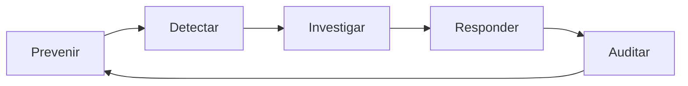
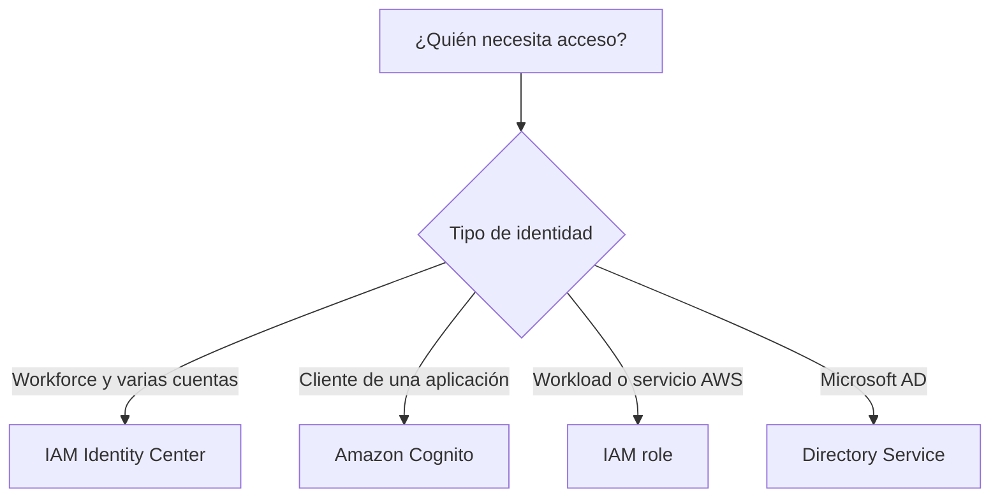
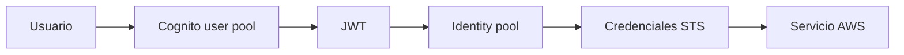
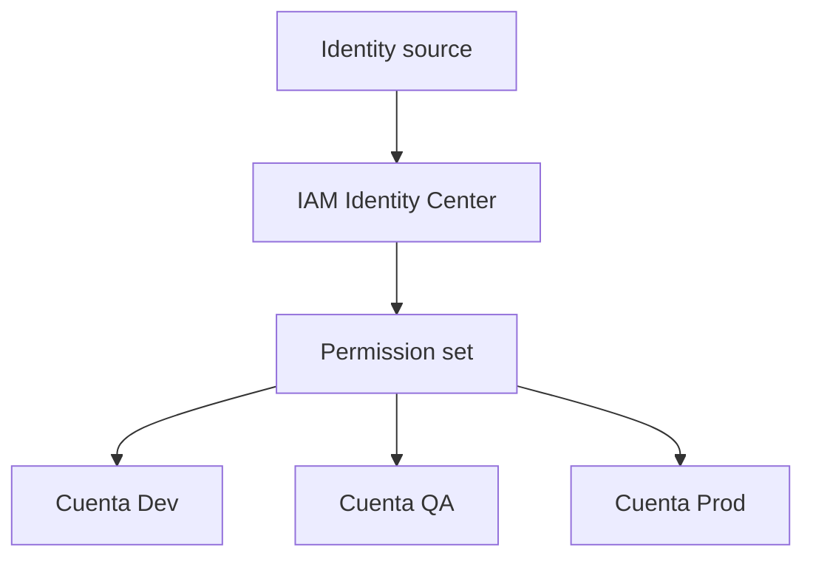
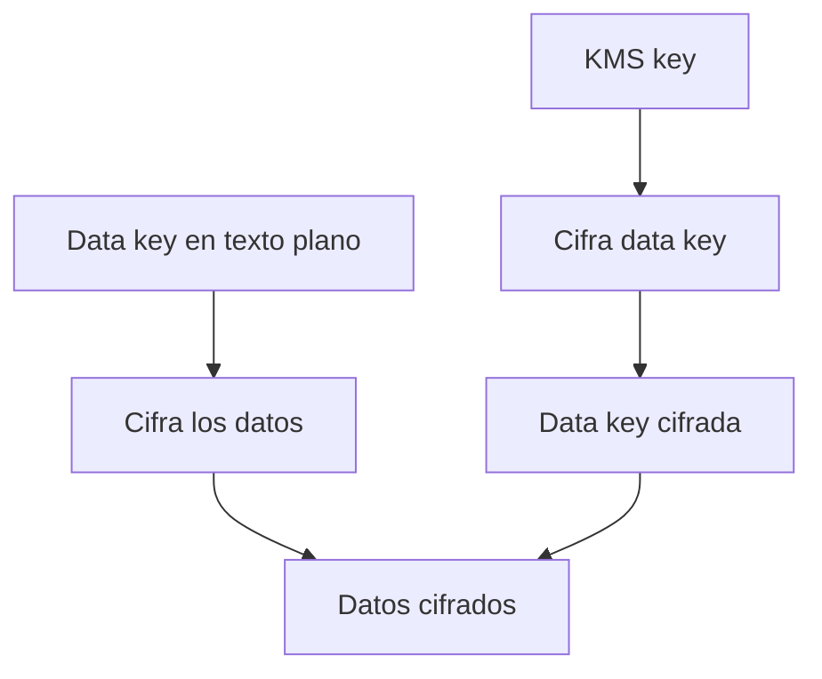
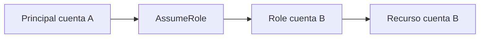
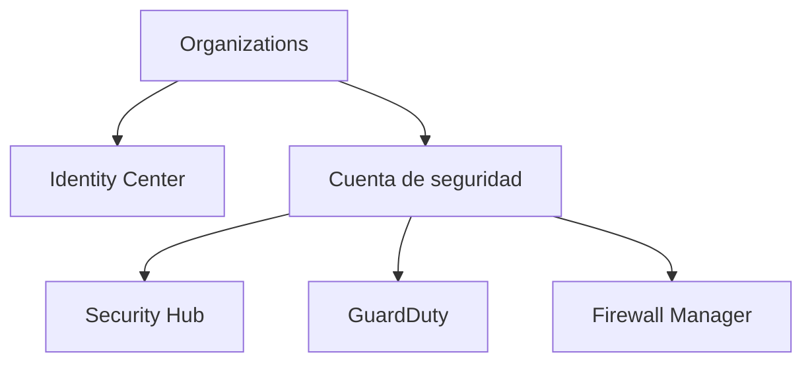

# Seguridad, identidad y cumplimiento en AWS para el examen SAA-C03

## 1. Alcance necesario para el examen

Esta guía desarrolla únicamente los siguientes servicios de **Security, Identity, and Compliance**:

- AWS Artifact
- AWS Audit Manager
- AWS Certificate Manager — ACM
- AWS CloudHSM
- Amazon Cognito
- Amazon Detective
- AWS Directory Service
- AWS Firewall Manager
- Amazon GuardDuty
- AWS IAM Identity Center
- Amazon Inspector
- AWS KMS
- Amazon Macie
- AWS Network Firewall
- AWS Resource Access Manager — AWS RAM
- AWS Secrets Manager
- AWS Security Hub
- AWS Shield
- AWS WAF
- AWS Identity and Access Management — IAM

El examen evalúa principalmente la capacidad de:

- Diseñar acceso seguro para personas, aplicaciones, servicios y varias cuentas.
- Aplicar mínimo privilegio, credenciales temporales, MFA y federación.
- Elegir entre IAM, IAM Identity Center, Cognito y Directory Service.
- Cifrar datos en reposo y en tránsito.
- Elegir entre KMS, CloudHSM, ACM y Secrets Manager.
- Detectar amenazas, vulnerabilidades, exposición y datos sensibles.
- Diferenciar GuardDuty, Inspector, Macie, Detective y Security Hub.
- Proteger aplicaciones web, redes VPC y recursos frente a DDoS.
- Diferenciar WAF, Shield, Network Firewall y Firewall Manager.
- Recopilar evidencia, obtener informes de AWS y administrar cumplimiento.
- Diseñar una estrategia de seguridad centralizada para AWS Organizations.
- Separar detección, investigación, agregación y remediación.

> **Alcance:** otros servicios pueden aparecer como componentes de una solución —por ejemplo, AWS Organizations, AWS Config, AWS CloudTrail, Amazon EventBridge, AWS Private CA o AWS Systems Manager—, pero no se desarrollan como servicios principales en este capítulo.

---

## 2. Modelos fundamentales de seguridad

### Servicios según el objetivo

| Objetivo | Servicio principal | Punto clave |
|---|---|---|
| Descargar informes de cumplimiento de AWS | AWS Artifact | Documentos y acuerdos bajo demanda |
| Automatizar recopilación de evidencia | AWS Audit Manager | Assessments basados en frameworks y controls |
| Administrar certificados TLS | AWS Certificate Manager | Emisión, almacenamiento y renovación |
| HSM dedicado de un solo tenant | AWS CloudHSM | Control criptográfico y compatibilidad PKCS #11/JCE/CNG |
| Identidad para clientes de aplicaciones | Amazon Cognito | User pools e identity pools |
| Investigar actividad y relaciones | Amazon Detective | Behavior graph y análisis de findings |
| Directorio Microsoft AD administrado o conectado | AWS Directory Service | Managed Microsoft AD, AD Connector y Simple AD |
| Aplicar políticas de firewall en varias cuentas | AWS Firewall Manager | Gobierno central mediante Organizations |
| Detectar amenazas activas | Amazon GuardDuty | Análisis continuo de fuentes de datos de AWS |
| Acceso de la fuerza laboral a varias cuentas | AWS IAM Identity Center | Portal, permission sets y federación |
| Detectar vulnerabilidades en workloads | Amazon Inspector | EC2, ECR y Lambda |
| Administrar claves criptográficas | AWS KMS | Keys administradas e integración con servicios |
| Descubrir datos sensibles en S3 | Amazon Macie | Clasificación y findings |
| Inspeccionar tráfico de VPC | AWS Network Firewall | Reglas stateless/stateful y Suricata |
| Compartir recursos entre cuentas | AWS RAM | Resource shares sin duplicar recursos |
| Guardar y rotar secretos | AWS Secrets Manager | Valores cifrados, versiones y rotación |
| Centralizar postura y findings | AWS Security Hub | Standards, controls y ASFF |
| Protección administrada contra DDoS | AWS Shield | Standard y Advanced |
| Filtrar solicitudes web de capa 7 | AWS WAF | Web ACL, managed rules y rate limiting |
| Autorización de recursos AWS | IAM | Users, groups, roles y policies |

### Ciclo de seguridad



| Etapa | Ejemplos |
|---|---|
| Prevenir | IAM, KMS, WAF, Shield, Network Firewall, Secrets Manager |
| Detectar | GuardDuty, Inspector, Macie, Security Hub controls |
| Investigar | Detective, Security Hub, logs y findings |
| Responder | EventBridge, automatización, aislamiento y rotación |
| Auditar | Audit Manager, Artifact, CloudTrail y Config |

> **Trampa de examen:** detectar no significa bloquear. GuardDuty, Inspector, Macie y Detective generan información para actuar; no sustituyen los controles preventivos.

### Regla mental de identidad



### Regla mental de cifrado

| Necesidad | Elegir |
|---|---|
| Cifrado integrado con servicios AWS | AWS KMS |
| HSM dedicado, API criptográfica o control directo de claves | AWS CloudHSM |
| Certificado X.509 para TLS | AWS Certificate Manager |
| Contraseña, token o API key que debe rotarse | AWS Secrets Manager |

---

## 3. Conceptos de arquitectura que se deben dominar

### Modelo de responsabilidad compartida

| AWS protege | Cliente protege |
|---|---|
| Infraestructura física, centros de datos, hardware y red global | Identidades, permisos, datos y configuración |
| Hipervisor e infraestructura administrada | Sistema operativo en EC2 y aplicaciones |
| Componentes administrados según el servicio | Clasificación, cifrado, retención y exposición |
| Disponibilidad de la plataforma contratada | Arquitectura Multi-AZ/Region y recuperación |

- En un servicio administrado, AWS asume más tareas operativas, pero el cliente continúa controlando acceso y datos.
- AWS no determina automáticamente qué usuario debe acceder a qué bucket.
- El cliente debe activar, configurar y revisar muchos servicios de seguridad.
- Cumplimiento de la nube por AWS no equivale a cumplimiento automático de la carga del cliente.

### Autenticación y autorización

- **Autenticación:** demuestra quién es el principal.
- **Autorización:** determina qué puede hacer.
- MFA fortalece la autenticación, pero no corrige políticas demasiado amplias.
- Una credencial válida no concede acceso si ninguna policy autoriza la acción.
- Una policy `Allow` no supera un `Explicit Deny`.

### Identidades humanas y de workloads

| Identidad | Práctica recomendada |
|---|---|
| Administrador o desarrollador | Federación mediante IAM Identity Center |
| Aplicación en EC2 | IAM role mediante instance profile |
| Tarea ECS | Task IAM role |
| Función Lambda | Execution role |
| Pod de EKS | EKS Pod Identity o IRSA, según el diseño |
| Acceso entre cuentas | AssumeRole con credenciales temporales |
| Cliente web o móvil | Cognito y autorización de la aplicación |

### Credenciales temporales frente a permanentes

- Las credenciales temporales tienen fecha de expiración y normalmente se obtienen mediante AWS STS.
- Los IAM roles no almacenan access keys permanentes.
- Las access keys de usuarios IAM se reservan para casos heredados o donde la federación y los roles no sean posibles.
- Nunca se deben insertar access keys en código, imágenes, repositorios o AMI.
- Rotar una credencial reduce la ventana de exposición, pero evitar la credencial permanente es preferible.

### Cifrado en reposo y en tránsito

- **En reposo:** protege datos almacenados mediante claves administradas.
- **En tránsito:** TLS protege conexiones de aplicación; IPsec protege túneles VPN.
- ACM administra certificados; no cifra directamente bases de datos u objetos.
- KMS administra claves y operaciones criptográficas; el servicio integrado cifra los datos.
- El cifrado no reemplaza controles de acceso, clasificación, backups ni logging.

### Protección, detección e investigación

| Tipo | Pregunta que responde |
|---|---|
| Preventivo | ¿Cómo impido la acción? |
| Detectivo | ¿Qué actividad sospechosa o configuración riesgosa existe? |
| Investigativo | ¿Cómo se relacionan los eventos y cuál es la causa? |
| Correctivo | ¿Cómo contengo y remedio? |

---

## 4. AWS Artifact

AWS Artifact proporciona acceso bajo demanda a documentos de seguridad y cumplimiento de AWS y permite administrar determinados acuerdos con AWS.

### Funciones principales

| Función | Uso |
|---|---|
| Reports | Descargar informes como SOC, ISO, PCI y otros documentos disponibles |
| Agreements | Revisar, aceptar y administrar acuerdos para una cuenta u organización |
| Third-party reports | Consultar documentos de determinados proveedores de AWS Marketplace |
| Assurance Assistant | Apoyar respuestas a consultas de cumplimiento y due diligence |

### Características que se deben recordar

- Los informes documentan controles y certificaciones de la infraestructura y servicios de AWS.
- Pueden entregarse de forma controlada a auditores o reguladores.
- Algunos documentos requieren aceptar términos antes de descargarlos.
- Los informes descargados pueden incluir una marca de agua única y deben compartirse de forma segura.
- Los permisos de IAM controlan quién puede consultar informes o aceptar acuerdos.
- Con AWS Organizations se pueden administrar acuerdos para varias cuentas cuando la integración está habilitada.

### Cuándo elegirlo

- Un auditor solicita el informe SOC de AWS.
- Se necesita evidencia de certificaciones ISO o PCI de la plataforma AWS.
- La empresa debe revisar o aceptar un Business Associate Addendum —BAA— disponible.
- Se requieren documentos de due diligence de un proveedor participante.

### Cuándo no elegirlo

- Para evaluar continuamente la configuración propia → Audit Manager, Security Hub o Config.
- Para registrar llamadas API → CloudTrail.
- Para corregir recursos no conformes → automatización o servicio de configuración.

> **Regla de examen:** Artifact entrega documentos y acuerdos de **AWS**. No escanea ni certifica automáticamente la arquitectura del cliente.

---

## 5. AWS Audit Manager

AWS Audit Manager ayuda a evaluar continuamente el uso de AWS y automatiza la recopilación de evidencia para auditorías y marcos de cumplimiento.

### Componentes

| Componente | Función |
|---|---|
| Framework | Agrupa controls según un estándar o requerimiento |
| Control | Define un objetivo y cómo se obtiene evidencia |
| Assessment | Evaluación activa con alcance de cuentas y servicios |
| Evidence | Registro automático o manual relacionado con un control |
| Assessment report | Selección de evidencia preparada para revisión |
| Delegation | Asigna revisión de control sets a responsables |

### Frameworks

- Audit Manager incluye frameworks preconstruidos para diferentes estándares.
- Se pueden personalizar controls y frameworks para requerimientos internos.
- Un framework estructura la evaluación; no garantiza que la empresa sea compliant.
- Los controles pueden utilizar fuentes como AWS Config, Security Hub CSPM, CloudTrail y llamadas API.

### Evidencia

- La recopilación comienza cuando se crea un assessment.
- La frecuencia depende de la fuente de evidencia.
- La evidencia automática reduce trabajo manual y mejora trazabilidad.
- También se puede agregar evidencia manual mediante archivos, texto o importación desde S3.
- Un revisor selecciona la evidencia relevante para el assessment report.

### Casos de examen

- Reducir trabajo manual de una auditoría → Audit Manager.
- Recopilar evidencia continua de varias cuentas → assessment con alcance organizacional.
- Adaptar un marco corporativo → custom framework.
- Entregar solo evidencia seleccionada al auditor → assessment report.

> **Trampa de examen:** Audit Manager ayuda a recopilar y organizar evidencia. No realiza la auditoría, no certifica a la empresa y no corrige recursos automáticamente.

---

## 6. AWS Certificate Manager — ACM

AWS Certificate Manager aprovisiona, almacena y renueva certificados SSL/TLS X.509 para proteger aplicaciones y conexiones.

### Tipos de certificados

| Tipo | Origen | Renovación |
|---|---|---|
| Público no exportable | Emitido por ACM para servicios AWS integrados | Administrada si continúa en uso y validado |
| Público exportable | Emitido por ACM con exportación habilitada | ACM renueva; el cliente vuelve a desplegar la versión exportada |
| Privado | Emitido mediante AWS Private CA | Administrada en integraciones compatibles |
| Importado | Autoridad certificadora externa | El cliente renueva y vuelve a importar |

### Actualización importante

- Desde 2025 ACM admite **certificados públicos exportables**.
- Los certificados públicos creados antes del 17 de junio de 2025 no pueden exportarse.
- Para exportar uno nuevo, la opción de exportación debe habilitarse al solicitarlo.
- Los certificados públicos ACM emitidos después del cambio de 2026 tienen una vigencia de 198 días.
- ACM intenta renovar los certificados públicos administrados aproximadamente 45 días antes de su expiración.
- En un certificado exportado, ACM renueva el certificado, pero el cliente debe desplegarlo nuevamente fuera de la integración administrada.

> **Trampa histórica:** ya no es correcto afirmar que ningún certificado público ACM puede exportarse. Se debe distinguir entre certificados no exportables, exportables e importados.

### Validación de dominio

| Método | Característica |
|---|---|
| DNS validation | Registro CNAME; favorece renovación automática mientras permanezca válido |
| Email validation | Requiere responder correos de aprobación y puede necesitar intervención en renovaciones |

DNS validation suele ser la opción preferida porque es automatizable y estable.

### Alcance regional

- Un certificado para ALB, API Gateway regional u otro recurso regional debe existir en la misma región del recurso.
- Para Amazon CloudFront, el certificado debe encontrarse en `us-east-1`.
- ACM no replica automáticamente un certificado regional hacia todas las regiones.
- Un diseño multirregión puede requerir certificados equivalentes en cada región.

### Integraciones comunes

- Elastic Load Balancing.
- Amazon CloudFront.
- Amazon API Gateway.
- AWS AppSync.
- Amazon Cognito.
- Otros servicios compatibles.

### Casos de examen

- HTTPS en un ALB con renovación administrada → ACM.
- Dominio personalizado de CloudFront → certificado ACM en `us-east-1`.
- Certificado de una CA externa ya existente → importar en ACM.
- PKI privada para identidades internas → ACM + AWS Private CA.
- Certificado que debe instalarse fuera de una integración AWS → certificado exportable o de CA externa.

### Costos

- Los certificados públicos no exportables usados con servicios integrados normalmente no tienen un cargo adicional por el certificado.
- Los certificados públicos exportables y las autoridades privadas tienen su propio modelo de precios.
- ELB, CloudFront, API Gateway y otros recursos continúan generando sus cargos.

> **Regla de examen:** ACM administra certificados TLS. KMS administra claves de cifrado de datos y CloudHSM proporciona HSM dedicados.

---

## 7. AWS CloudHSM

AWS CloudHSM proporciona hardware security modules dedicados y de un solo tenant para generar, almacenar y usar material criptográfico bajo control del cliente.

### Características

- HSM de un solo tenant dentro de una VPC.
- Clusters en modo FIPS o non-FIPS según el tipo y requisito.
- HSM compatibles con validaciones FIPS 140-2 Level 3 o FIPS 140-3 Level 3 según el hardware.
- Integración mediante interfaces como PKCS #11, JCE y Microsoft CNG.
- El cliente administra usuarios criptográficos, claves y operaciones dentro del HSM.
- AWS administra hardware, monitoreo físico y reemplazo de appliances defectuosos.

### Cluster y alta disponibilidad

- Un cluster puede contener varios HSM en diferentes AZ.
- Las claves se sincronizan entre los HSM del mismo cluster.
- Para producción se recomiendan al menos dos HSM en AZ diferentes.
- Un único HSM es un punto único de falla.
- La aplicación cliente balancea las operaciones entre HSM disponibles.
- Los backups del cluster permiten recuperación, pero se deben probar procedimientos y permisos.

### CloudHSM frente a KMS

| AWS CloudHSM | AWS KMS |
|---|---|
| HSM dedicado de un solo tenant | Servicio multitenant administrado con aislamiento criptográfico |
| Cliente controla usuarios y claves | AWS simplifica ciclo de vida e integración |
| APIs criptográficas estándar | API KMS e integración nativa con servicios |
| Mayor operación y costo | Menor operación |
| Algoritmos y casos especializados | Cifrado de servicios AWS y envelope encryption |
| Pago por HSM/hora | Pago por key y solicitudes según tipo |

### Custom key store de KMS

- KMS puede utilizar un custom key store respaldado por CloudHSM.
- Las aplicaciones continúan llamando a KMS, mientras el material se mantiene en el cluster CloudHSM.
- La disponibilidad y operación del cluster pasan a ser parte de la disponibilidad de la key.
- Se utiliza solo cuando el requisito justifica la complejidad.

### Casos de examen

- Requisito contractual de HSM dedicado → CloudHSM.
- Migración de una aplicación que usa PKCS #11 → CloudHSM.
- Control directo de usuarios y material criptográfico → CloudHSM.
- Cifrado normal de S3, EBS, RDS o Secrets Manager → KMS.

> **Trampa de examen:** CloudHSM no es completamente serverless desde la perspectiva operativa. El cliente debe dimensionar el cluster, mantener varios HSM y administrar identidades y claves.

---

## 8. Amazon Cognito

Amazon Cognito proporciona identidad, autenticación y autorización para usuarios finales de aplicaciones web y móviles.

### User pools e identity pools

| Característica | User pool | Identity pool |
|---|---|---|
| Función | Directorio y autenticación de usuarios | Intercambio de identidades por credenciales AWS temporales |
| Resultado | Tokens JWT | Credenciales temporales mediante roles IAM |
| Usuarios locales | Sí | No es su función principal |
| Federación | Social, SAML y OIDC | Proveedores autenticados y acceso guest opcional |
| Uso | Login, registro, recuperación, MFA | Acceso directo limitado a S3, DynamoDB u otros recursos |

### User pools

- Administran registro, inicio de sesión y perfiles.
- Emiten ID token, access token y refresh token.
- El **ID token** contiene claims sobre la identidad.
- El **access token** autoriza operaciones y scopes.
- El **refresh token** permite obtener tokens nuevos sin volver a autenticar.
- Admiten MFA, políticas de contraseña, grupos, triggers Lambda y federación.
- Managed login proporciona una interfaz administrada para autenticación.
- Pueden actuar como proveedor OIDC para APIs y aplicaciones.

### Identity pools

- Intercambian una identidad autenticada por credenciales temporales de AWS.
- También pueden admitir identidades no autenticadas —guest— si se habilita.
- Mapean usuarios a IAM roles y policies.
- Evitan insertar access keys en una aplicación cliente.
- Deben usar roles de mínimo privilegio y condiciones que limiten cada identidad.

### Flujo combinado



No todas las aplicaciones necesitan ambos:

- API propia que valida JWT → user pool.
- Cliente que accede directamente a recursos AWS → identity pool.
- Login y acceso directo a recursos → user pool + identity pool.

### Cognito frente a IAM Identity Center

| Amazon Cognito | IAM Identity Center |
|---|---|
| Clientes de una aplicación | Empleados y fuerza laboral |
| Alta escala de usuarios externos | Acceso corporativo a cuentas y aplicaciones |
| Registro y recuperación de contraseña | Portal central y permission sets |
| Tokens de aplicación | Sesiones federadas para AWS accounts |

### Casos de examen

- Login para aplicación móvil → Cognito user pool.
- Usuarios sociales o empresariales acceden a una app → federación en user pool.
- Aplicación móvil carga archivos en S3 con permisos temporales → identity pool.
- Empleados administran múltiples cuentas AWS → IAM Identity Center, no Cognito.

> **Trampa de examen:** una API key no autentica usuarios. Para clientes de aplicación se utilizan tokens y autorización como Cognito.

---

## 9. Amazon Detective

Amazon Detective ayuda a investigar incidentes mediante análisis, visualizaciones y relaciones entre entidades en un behavior graph.

### Cómo funciona

- Ingiere y analiza fuentes de datos y findings de seguridad compatibles.
- Construye un behavior graph con cuentas, roles, usuarios, instancias, direcciones IP y actividad.
- Presenta perfiles con comportamiento observado y contexto histórico.
- Agrupa findings relacionados para investigar una posible causa común.
- Permite pivotar desde findings de GuardDuty y Security Hub CSPM.

### Detective y GuardDuty

| GuardDuty | Detective |
|---|---|
| Detecta actividad sospechosa | Investiga el contexto y las relaciones |
| Genera findings | Analiza entidades y findings |
| Usa threat intelligence y ML | Usa graph analytics y baselines |
| Responde “¿qué parece mal?” | Responde “¿cómo ocurrió y qué está relacionado?” |

### Consideraciones

- Los behavior graphs son regionales.
- El análisis es más útil después de acumular información suficiente.
- Las primeras semanas incluyen un período de entrenamiento para algunos baselines.
- GuardDuty findings forman parte de la fuente principal; otros findings de Security Hub pueden habilitarse como fuente.
- Detective no bloquea tráfico, no aísla instancias y no corrige permisos.

### Casos de examen

- Investigar las llamadas API asociadas con un role comprometido → Detective.
- Visualizar relaciones entre varias findings de GuardDuty → Detective.
- Encontrar actividad anómala inicial → GuardDuty.
- Centralizar findings de muchos productos → Security Hub.

> **Regla de examen:** GuardDuty detecta; Detective investiga; Security Hub centraliza y prioriza.

---

## 10. AWS Directory Service

AWS Directory Service permite ejecutar Microsoft Active Directory administrado o conectar servicios AWS con un directorio existente.

### Opciones principales

| Opción | Directorio | Elegir cuando |
|---|---|---|
| AWS Managed Microsoft AD | Microsoft AD administrado en AWS | Se necesitan trusts, Group Policy, Kerberos, LDAP y compatibilidad Microsoft completa |
| AD Connector | Proxy hacia AD existente | Los usuarios y datos deben permanecer en on-premises |
| Simple AD | Directorio Samba 4 compatible | Directorio básico, pequeño y de menor costo |

### AWS Managed Microsoft AD

- Crea un dominio Microsoft Active Directory administrado por AWS.
- Implementa controladores de dominio en subnets de AZ distintas.
- Incluye DNS integrado.
- Admite relaciones de confianza con directorios compatibles.
- Permite unir instancias Windows al dominio y utilizar servicios AWS compatibles.
- AWS gestiona infraestructura y recuperación del servicio; el cliente administra usuarios, grupos, OU y políticas dentro de su alcance.

### AD Connector

- Reenvía solicitudes hacia un Microsoft AD existente.
- No replica ni almacena en caché el directorio on-premises.
- Requiere conectividad de red y DNS confiables entre AWS y los domain controllers.
- Si falla el enlace híbrido o el AD local, la autenticación puede fallar.
- Es adecuado cuando la organización no quiere crear otro directorio.

### Simple AD

- Implementación basada en Samba 4.
- Ofrece compatibilidad básica con AD, Kerberos y LDAP.
- Está orientado a entornos pequeños y simples.
- No proporciona todas las funciones de Microsoft AD.
- No se debe seleccionar si se requieren trusts o funciones empresariales avanzadas.

### Integraciones

- IAM Identity Center puede utilizar Active Directory como identity source.
- EC2 Windows puede realizar domain join.
- Servicios como WorkSpaces y otros compatibles pueden usar Directory Service.
- Una arquitectura híbrida requiere VPN o Direct Connect, rutas, DNS y puertos correctos.

### Casos de examen

- Se necesita un Microsoft AD real administrado en AWS → AWS Managed Microsoft AD.
- Se deben usar usuarios del AD local sin replicarlos → AD Connector.
- Se necesita un directorio básico y económico para pocos usuarios → Simple AD.

> **Trampa de examen:** AD Connector no es un directorio nuevo y no copia usuarios. Depende del AD y de la conectividad existentes.

---

## 11. AWS Firewall Manager

AWS Firewall Manager administra de forma centralizada políticas de protección en múltiples cuentas y recursos de AWS Organizations.

### Protecciones administrables

Firewall Manager puede aplicar políticas para:

- AWS WAF.
- AWS Shield Advanced.
- VPC security groups.
- VPC network ACL.
- AWS Network Firewall.
- Route 53 Resolver DNS Firewall.
- Otras soluciones de firewall compatibles.

### Modelo operativo

1. La organización habilita la integración requerida.
2. Se designa una cuenta administradora de Firewall Manager.
3. Se crea una policy con alcance de cuentas, OU, regiones, tags o recursos.
4. Firewall Manager aplica y supervisa la protección.
5. Los recursos nuevos dentro del alcance reciben la política automáticamente.

### Características

- Centraliza una política sin configurar manualmente cada cuenta.
- Puede aplicar una baseline común y detectar recursos no conformes.
- El alcance puede incluir toda la organización o un subconjunto.
- Algunas policy types permiten remediación automática.
- AWS Config se requiere para determinados tipos de políticas y evaluación de recursos.
- Las políticas regionales se administran en cada región correspondiente; los recursos globales de CloudFront se gestionan con el alcance global en `us-east-1`.

### Firewall Manager frente a los firewalls

| Servicio | Función |
|---|---|
| Firewall Manager | Gobierno y despliegue central de políticas |
| AWS WAF | Filtra solicitudes web de capa 7 |
| AWS Network Firewall | Inspecciona tráfico de VPC |
| AWS Shield Advanced | Protección DDoS avanzada |
| Security group/NACL | Control de red en VPC |

### Casos de examen

- Aplicar las mismas managed rules de WAF a todas las cuentas → Firewall Manager.
- Detectar security groups demasiado permisivos en una organización → security group policy.
- Activar Network Firewall en múltiples VPC según OU → Firewall Manager.
- Administrar Shield Advanced de forma central → Firewall Manager.

> **Trampa de examen:** Firewall Manager no inspecciona el tráfico por sí mismo. Orquesta y administra los controles que sí lo hacen.

---

## 12. Amazon GuardDuty

Amazon GuardDuty es un servicio administrado de detección de amenazas que analiza continuamente actividad de AWS mediante threat intelligence, machine learning y detecciones administradas.

### Fuentes fundamentales

GuardDuty procesa de forma independiente:

- AWS CloudTrail management events.
- VPC Flow Logs.
- Route 53 Resolver DNS query logs.

No es necesario crear manualmente los Flow Logs o conservar copias de esas fuentes para que GuardDuty analice sus streams administrados.

### Protection plans

Según la carga, se pueden habilitar capacidades adicionales para:

- Amazon S3.
- Amazon EKS.
- Runtime Monitoring en workloads compatibles.
- Malware Protection.
- Bases de datos RDS compatibles.
- Funciones Lambda.

Estas protecciones tienen fuentes, cobertura y costos adicionales. Habilitar GuardDuty base no activa necesariamente todos los protection plans.

### Findings

- Una finding describe actividad sospechosa o potencialmente maliciosa.
- Incluye tipo, severidad, recurso, principal, dirección IP y evidencia relevante.
- Ejemplos: credenciales usadas desde una ubicación inusual, comunicación con malware, crypto mining o exfiltración.
- Las findings pueden enviarse a Security Hub.
- EventBridge permite iniciar notificaciones o remediaciones.

### Administración multicuenta

- Se designa una cuenta administradora.
- Se integran cuentas miembro mediante AWS Organizations.
- Se pueden habilitar automáticamente capacidades para cuentas nuevas.
- El servicio sigue siendo regional; debe configurarse en las regiones necesarias.

### Lo que GuardDuty no hace

- No bloquea automáticamente una IP.
- No aplica parches.
- No corrige una bucket policy.
- No sustituye WAF, Network Firewall o Inspector.
- La respuesta se diseña con EventBridge, automatización y controles preventivos.

### Casos de examen

- Detectar access keys posiblemente comprometidas → GuardDuty.
- Detectar comunicación EC2 con una IP maliciosa → GuardDuty.
- Detectar comportamiento de crypto mining → GuardDuty.
- Analizar vulnerabilidades de paquetes → Inspector.
- Investigar relaciones después de una finding → Detective.

> **Regla de examen:** GuardDuty detecta amenazas por comportamiento y fuentes de actividad; Inspector encuentra vulnerabilidades en software y exposición de workloads.

---

## 13. AWS IAM Identity Center

AWS IAM Identity Center centraliza el acceso de la fuerza laboral a múltiples cuentas AWS y aplicaciones.

### Funciones

- Portal de acceso para usuarios.
- Asignación central de usuarios y grupos a cuentas.
- Permission sets reutilizables.
- Credenciales temporales para consola y CLI.
- Integración con aplicaciones compatibles.
- Attribute-based access control —ABAC— mediante atributos de usuario.

### Identity sources

| Fuente | Uso |
|---|---|
| Identity Center directory | Usuarios y grupos administrados directamente |
| Active Directory | Directorio administrado o conectado |
| External identity provider | IdP SAML 2.0 como Microsoft Entra ID u Okta |

- SAML realiza autenticación federada.
- SCIM 2.0 aprovisiona y sincroniza usuarios y grupos desde un IdP externo.
- Configurar SAML sin aprovisionar usuarios no crea automáticamente todas las identidades necesarias.

### Permission sets

- Definen las permissions que un usuario o grupo tendrá en una cuenta.
- Pueden incluir AWS managed policies, customer managed policies, inline policy y permissions boundary compatibles.
- Al asignarlos, Identity Center crea y administra IAM roles en las cuentas destino.
- El usuario asume temporalmente esos roles desde el portal o la CLI.
- Un mismo permission set puede aprovisionarse en múltiples cuentas.

### Diseño multicuenta



- Una organization instance es la opción normal para administrar acceso a cuentas de AWS Organizations.
- Se asignan grupos en lugar de usuarios individuales cuando sea posible.
- Se separan permission sets por función, como ReadOnly, Developer y Administrator.
- Los SCP de Organizations continúan limitando los permisos máximos.
- Un permission set no puede superar un explicit deny de SCP.

### Identity Center frente a IAM

| IAM Identity Center | IAM |
|---|---|
| Workforce y acceso central | Autorización dentro de cada cuenta |
| Permission sets | Policies, roles, users y groups |
| Portal y federación | API de permisos para recursos |
| Crea roles administrados en cuentas | Define permisos efectivos de esos roles |

### Casos de examen

- Empleados necesitan una sola identidad en 50 cuentas → IAM Identity Center.
- Acceso CLI temporal sin access keys permanentes → Identity Center.
- Usar el IdP corporativo para cuentas AWS → SAML + SCIM con Identity Center.
- Aplicación móvil para clientes → Cognito.
- Workload Lambda accede a S3 → IAM execution role.

> **Regla de examen:** IAM Identity Center administra acceso de personas a cuentas y aplicaciones. IAM sigue aplicando los permisos en cada cuenta.

---

## 14. Amazon Inspector

Amazon Inspector es un servicio de administración de vulnerabilidades que descubre workloads y los escanea continuamente.

### Recursos compatibles principales

| Recurso | Evaluación |
|---|---|
| Amazon EC2 | Vulnerabilidades de paquetes y exposición de red |
| Amazon ECR | Vulnerabilidades de imágenes de contenedor |
| AWS Lambda | Dependencias y, opcionalmente, código compatible |

### EC2

- Detecta CVE en sistema operativo y paquetes de lenguajes compatibles.
- Evalúa network reachability y exposición no intencionada.
- Puede utilizar SSM Agent o escaneo mediante snapshots EBS en escenarios compatibles.
- Actualiza findings cuando aparecen nuevas vulnerabilidades o cambia el recurso.
- Cobertura depende de sistema operativo, configuración y método de escaneo.

### ECR

- Enhanced scanning de ECR se integra con Inspector.
- Escanea paquetes del sistema operativo y lenguajes compatibles.
- Mantiene monitoreo dentro de la duración de re-scan configurada.
- Actualiza findings cuando se publica una CVE nueva.
- La imagen no se corrige en el registry; se debe reconstruir y publicar una imagen parcheada.

### Lambda

- Standard scanning revisa dependencias y layers.
- Code scanning puede analizar código propio para vulnerabilidades compatibles.
- Una función debe usar runtime y configuración admitidos.
- Inspector vuelve a evaluar funciones cuando cambian o aparecen CVE relevantes.

### Priorización

- Las findings incluyen CVE, severidad y recurso afectado.
- Se complementan con información de explotabilidad y contexto.
- Pueden agregarse en Security Hub y enviarse mediante EventBridge.
- La remediación consiste en parchear, actualizar dependencias, reconstruir imágenes o reducir exposición.

### Inspector frente a GuardDuty

| Amazon Inspector | Amazon GuardDuty |
|---|---|
| Vulnerabilidades y exposición | Actividad sospechosa y amenazas |
| Paquetes, imágenes y funciones | Eventos, red, DNS y protección runtime |
| Riesgo potencial | Comportamiento observado |
| Ayuda a parchear antes de explotación | Alerta sobre posible ataque o compromiso |

> **Trampa de examen:** Inspector no es un antivirus de respuesta en tiempo real ni aplica parches automáticamente.

---

## 15. AWS KMS

AWS Key Management Service crea y controla keys utilizadas para cifrar, descifrar, firmar y generar códigos de autenticación.

### Tipos según propiedad

| Tipo | Control del cliente | Visibilidad | Costo directo de key |
|---|---|---|---|
| AWS owned key | Mínimo | No se administra ni visualiza | Incluido en el servicio |
| AWS managed key | El servicio administra ciclo de vida | Visible con alias `aws/service` | Sin tarifa mensual de key |
| Customer managed key | Policies, aliases, habilitación, rotación y eliminación | Completa | Key y solicitudes según uso |

### Tipos criptográficos

| Tipo | Uso |
|---|---|
| Symmetric encryption | Cifrar/descifrar; opción predeterminada para servicios AWS |
| Asymmetric | Cifrado/descifrado o firma/verificación con par pública/privada |
| HMAC | Generar y verificar códigos de autenticación |

- Las symmetric encryption KMS keys se usan con envelope encryption.
- Las asymmetric keys permiten descargar la public key, pero la private key permanece protegida por KMS.
- Las propiedades fundamentales de una key no se pueden cambiar después de crearla.

### Envelope encryption



Flujo:

1. KMS genera una data key en texto plano y cifrada.
2. La aplicación usa la data key en texto plano para cifrar datos localmente.
3. Elimina de memoria la copia en texto plano.
4. Guarda la data key cifrada junto con los datos.
5. Para descifrar, KMS recupera la data key y la aplicación descifra los datos.

> **Regla de examen:** KMS no se utiliza para enviar grandes archivos a la operación `Encrypt`. Los servicios y SDK utilizan envelope encryption con data keys.

### Autorización de una KMS key

| Control | Función |
|---|---|
| Key policy | Resource policy obligatoria de la key |
| IAM policy | Autoriza al principal cuando la key policy habilita ese mecanismo |
| Grant | Permiso delegable, usado frecuentemente por servicios AWS |
| VPC endpoint policy | Limita solicitudes que atraviesan el endpoint |

- Cada KMS key tiene una key policy.
- Un `Allow` en IAM puede ser ineficaz si la key policy no permite usar IAM policies.
- Para acceso cross-account normalmente se requiere permiso en la key policy de la cuenta propietaria y una IAM policy en la cuenta del principal.
- Un explicit deny continúa teniendo prioridad.
- Las grants permiten autorización temporal o delegada sin reescribir toda la key policy.

### Encryption context

- Conjunto opcional de pares clave-valor no secretos.
- Se usa como additional authenticated data.
- Debe proporcionarse con los mismos valores al descifrar.
- Puede aparecer en CloudTrail, por lo que no debe contener secretos.
- Permite condiciones de autorización y mayor trazabilidad.

### Rotación

- Las customer managed keys compatibles admiten rotación automática y on-demand.
- AWS managed keys se rotan según el ciclo administrado por AWS.
- Al rotar se crea material criptográfico nuevo para futuras operaciones.
- El material anterior se conserva para descifrar ciphertext existente.
- La rotación no vuelve a cifrar automáticamente todos los datos.
- Deshabilitar o programar eliminación de una key puede hacer inaccesibles los datos dependientes.
- La eliminación de una customer managed key exige un período de espera de 7 a 30 días.

### Multi-Region keys

- Una primary key se replica en regiones seleccionadas con el mismo key ID y material relacionado.
- Cada réplica es un recurso regional con ARN, policy, alias y estado propios.
- Las policies y aliases no se sincronizan automáticamente.
- Permiten descifrar o verificar datos en otra región sin volver a cifrarlos.
- Se usan para DR, datos que se mueven entre regiones y firmas compatibles.
- No se deben seleccionar si una key regional normal cumple el requisito.

### Integración y auditoría

- S3, EBS, RDS, DynamoDB, Secrets Manager y muchos servicios se integran con KMS.
- CloudTrail registra llamadas de administración y uso compatibles.
- Se deben controlar `kms:Decrypt`, `kms:CreateGrant` y administración de policies.
- Un VPC interface endpoint permite acceder a KMS sin ruta pública.

### Casos de examen

- Cifrar un volumen EBS con control de policy → customer managed KMS key.
- Separar administrador de key y usuario de key → key policy con roles distintos.
- Compartir snapshot cifrado entre cuentas → permisos de snapshot y de customer managed key.
- Cifrado multirregión que debe usar material interoperable → multi-Region key.
- Requisito de HSM dedicado y API PKCS #11 → CloudHSM.

> **Trampa de examen:** tener permiso sobre un objeto, snapshot o secreto no implica permiso para `kms:Decrypt`. Se deben autorizar ambos recursos.

---

## 16. Amazon Macie

Amazon Macie utiliza machine learning, pattern matching e identificadores administrados para descubrir, clasificar y proteger datos sensibles almacenados en Amazon S3.

### Funciones

- Mantiene un inventario de buckets S3 y sus características de seguridad.
- Detecta datos como información personal, financiera, credenciales y tipos personalizados.
- Proporciona automated sensitive data discovery.
- Permite crear sensitive data discovery jobs con alcance y frecuencia definidos.
- Genera findings de datos sensibles y de políticas.
- Se administra de forma centralizada para varias cuentas.

### Automated discovery frente a discovery jobs

| Modalidad | Característica | Uso |
|---|---|---|
| Automated sensitive data discovery | Evalúa continuamente el data estate mediante selección y muestreo | Visibilidad amplia y continua |
| Sensitive data discovery job | Alcance, buckets, objetos y calendario definidos | Investigación dirigida o requisito específico |

### Findings

| Tipo | Ejemplo |
|---|---|
| Sensitive data finding | Un objeto contiene números de cuenta, PII o credenciales |
| Policy finding | Un bucket se volvió público o tiene una configuración riesgosa |

- Una finding informa tipo, severidad, bucket, objeto y número de ocurrencias.
- La finding no incluye el valor sensible encontrado.
- Los discovery results contienen detalles del análisis y deben almacenarse de forma protegida.
- Las findings pueden enviarse a Security Hub y EventBridge.

### Identificadores

- **Managed data identifiers:** patrones mantenidos por AWS para tipos de datos comunes.
- **Custom data identifiers:** expresiones regulares y términos definidos por el cliente.
- Las allow lists reducen falsos positivos para valores conocidos.
- La clasificación debe ajustar alcance y frecuencia para controlar costo.

### Lo que Macie no hace

- No analiza bases de datos RDS, volúmenes EBS ni DynamoDB como data stores generales.
- No bloquea acceso a un bucket.
- No cifra automáticamente objetos.
- No modifica bucket policies.
- La remediación utiliza S3, IAM, KMS, EventBridge u otros controles.

### Casos de examen

- Localizar PII en miles de buckets S3 → Macie.
- Detectar un bucket con datos sensibles que se volvió público → Macie.
- Buscar CVE en una instancia → Inspector.
- Detectar uso sospechoso de credenciales → GuardDuty.

> **Regla de examen:** Macie se especializa en **datos sensibles de S3**.

---

## 17. AWS Network Firewall

AWS Network Firewall es un firewall administrado para inspeccionar y filtrar tráfico de Amazon VPC.

### Componentes

| Componente | Función |
|---|---|
| Firewall | Recurso asociado a una VPC y subnets de firewall |
| Firewall endpoint | Endpoint zonal por donde se enruta el tráfico |
| Firewall policy | Comportamiento y rule groups aplicados |
| Stateless rule group | Inspección de paquetes individuales |
| Stateful rule group | Inspección del flujo y estado de conexión |
| TLS inspection configuration | Descifrado e inspección de tráfico TLS compatible |

### Stateless y stateful

| Stateless | Stateful |
|---|---|
| Evalúa cada paquete sin contexto de conexión | Mantiene contexto del flujo |
| Reglas por IP, puerto y protocolo | Reglas de dominio, protocolo y patrones |
| Acciones pass, drop o forward | Allow, alert, drop, reject según regla |
| Alta velocidad para filtros simples | Inspección profunda mediante motor compatible con Suricata |

- El motor stateless puede enviar tráfico al motor stateful.
- Las reglas stateful admiten sintaxis compatible con Suricata.
- La policy define el orden y acciones predeterminadas.
- Managed rule groups pueden reducir la administración de firmas.

### Enrutamiento

Network Firewall no se inserta automáticamente en el camino:

1. Se crea un firewall endpoint en cada AZ necesaria.
2. Las route tables envían el tráfico hacia el endpoint.
3. El endpoint inspecciona y reenvía según la policy.
4. La ruta posterior lleva el tráfico al internet gateway, NAT, Transit Gateway o destino.
5. El retorno debe atravesar el mismo camino cuando la inspección es stateful.

### Alta disponibilidad

- Se despliega un endpoint en cada AZ utilizada.
- El tráfico de una AZ debe usar preferentemente el endpoint de esa AZ.
- El routing asimétrico puede romper inspección stateful.
- En una arquitectura centralizada se debe conservar simetría mediante Transit Gateway y appliance mode cuando corresponda.
- Logs de flow y alert permiten investigar decisiones.

### Network Firewall frente a controles VPC

| Control | Capa y función |
|---|---|
| Security group | Stateful, allow only, asociado a ENI |
| Network ACL | Stateless, allow/deny, asociado a subnet |
| Network Firewall | Inspección administrada, reglas stateless/stateful y firmas |
| AWS WAF | Capa 7 HTTP/HTTPS en recursos web compatibles |

### Casos de examen

- Filtrar tráfico este-oeste entre segmentos VPC → Network Firewall.
- Inspeccionar egress hacia dominios o patrones no permitidos → Network Firewall.
- Usar reglas IDS/IPS compatibles con Suricata → Network Firewall.
- Bloquear SQL injection en un ALB → AWS WAF.
- Administrar firewalls en todas las cuentas → Firewall Manager.

> **Trampa de examen:** crear el firewall sin modificar route tables no protege el flujo.

---

## 18. AWS Resource Access Manager — AWS RAM

AWS RAM permite compartir recursos AWS compatibles entre cuentas, dentro de una organización, con OU y, para determinados tipos, con roles o usuarios IAM.

### Modelo

| Elemento | Función |
|---|---|
| Resource owner | Cuenta que crea y administra el recurso |
| Resource share | Agrupa recursos, principals y permissions |
| Principal | Cuenta, organización, OU o identidad compatible |
| Managed permission | Acciones que el consumidor puede realizar sobre el recurso compartido |

### Características

- El recurso no se copia ni cambia de propietario.
- El propietario administra el ciclo de vida del recurso.
- El consumidor lo utiliza según los permisos de RAM, IAM y del servicio.
- Solo se comparten resource types compatibles.
- Los costos se asignan según las reglas del servicio compartido.
- La mayoría de los resource shares son regionales.
- Los recursos globales compartibles se administran desde `us-east-1`.

### AWS Organizations e invitaciones

| Escenario | Invitación |
|---|---|
| Sharing habilitado dentro de la organización | No; acceso automático según el share |
| Cuenta externa a la organización | Sí, si el resource type admite compartir externamente |
| Cuenta interna sin integración habilitada | Puede requerir invitación |

- Una invitación debe aceptarse antes de utilizar el recurso.
- Compartir con una OU incluye las cuentas que estén dentro de su alcance.
- Al mover cuentas entre OU se puede cambiar el acceso derivado.

### Recursos compartidos comunes para el examen

- Subnets de VPC.
- Transit Gateway.
- Route 53 Resolver rules.
- AWS License Manager configurations.
- Capacity Reservations.
- Recursos de otros servicios incluidos en la lista de compatibilidad.

### VPC sharing

- La cuenta propietaria crea VPC, subnets, route tables y gateways.
- Las cuentas participantes crean recursos compatibles dentro de subnets compartidas.
- Los participantes no se convierten en propietarios de la VPC.
- Facilita redes centralizadas sin usar VPC peering para cada workload.
- Las responsabilidades de seguridad y costos deben quedar claramente definidas.

### RAM frente a otras opciones

| Necesidad | Elegir |
|---|---|
| Usar el mismo recurso compatible desde otra cuenta | AWS RAM |
| Copiar datos o recurso a otra cuenta | Replicación o copia del servicio |
| Dar permiso sobre S3 mediante bucket policy | Resource policy de S3 |
| Conectar redes completas | Peering o Transit Gateway |
| Exponer un servicio privado | PrivateLink |

> **Trampa de examen:** RAM comparte el recurso; no crea conectividad de red universal ni concede acceso fuera de los permisos efectivos.

---

## 19. AWS Secrets Manager

AWS Secrets Manager almacena, recupera y rota secretos como credenciales de base de datos, API keys, tokens y contraseñas.

### Características

- Cifra cada secret value mediante AWS KMS.
- Transmite solicitudes mediante TLS.
- Controla acceso con IAM y resource policies.
- Mantiene versiones identificadas mediante staging labels.
- Admite rotación automática.
- Se integra con servicios de bases de datos y aplicaciones.
- Puede replicar secretos hacia otras regiones.
- Registra llamadas API en CloudTrail.

### Estructura de un secret

- Secret value como texto o binario.
- Para múltiples campos se recomienda JSON, por ejemplo usuario, contraseña, host y puerto.
- Metadata como ARN, descripción, tags y configuración de rotación.
- KMS key utilizada para cifrar.
- Versions y staging labels.

### Staging labels

| Label | Significado |
|---|---|
| `AWSCURRENT` | Versión utilizada actualmente |
| `AWSPENDING` | Versión que está siendo validada durante rotación |
| `AWSPREVIOUS` | Versión que dejó de ser la actual |

Los labels son punteros movibles; una versión no se reemplaza internamente.

### Rotación

| Modalidad | Característica |
|---|---|
| Managed rotation | El servicio integrado administra el proceso sin una función Lambda propia |
| Lambda rotation | Una función ejecuta pasos para el sistema o tipo de secret |

El proceso debe:

1. Crear credenciales nuevas.
2. Aplicarlas al sistema de destino.
3. Probar que funcionan.
4. Mover `AWSCURRENT` a la nueva versión.

Rotar únicamente el valor almacenado sin actualizar la base de datos deja credenciales inconsistentes.

### Acceso desde aplicaciones

- La aplicación obtiene el secreto en runtime mediante un IAM role.
- Se recomienda client-side caching para reducir latencia, solicitudes y costo.
- El secreto no se guarda en variables de CI visibles, código ni imágenes.
- El role recibe únicamente `secretsmanager:GetSecretValue` para el ARN necesario.
- Si se usa una customer managed KMS key, también requiere `kms:Decrypt`.

### Cross-account y multirregión

- El acceso cross-account requiere resource policy del secret e IAM policy del principal.
- Se utiliza una customer managed KMS key que autorice a la otra cuenta; la AWS managed key predeterminada no cubre ese diseño.
- Replicar un secret crea una réplica regional cifrada con la key elegida para esa región.
- La replicación reduce dependencia regional, pero la aplicación debe usar el ARN o endpoint regional correspondiente.

### Secrets Manager frente a KMS

| Secrets Manager | KMS |
|---|---|
| Guarda valores secretos | Protege y usa material criptográfico |
| Versiones y rotación de credenciales | Rotación de key material |
| Devuelve el secret autorizado | La KMS key no sale sin cifrar |
| API de secretos | API criptográfica |

### Casos de examen

- Rotar contraseña de RDS sin redeploy → Secrets Manager.
- Guardar una API key externa → Secrets Manager.
- Cifrar un volumen EBS → KMS.
- Compartir un secret entre cuentas → resource policy + IAM + customer managed KMS key.

> **Regla de examen:** la aplicación obtiene secretos mediante su role. Nunca se insertan credenciales estáticas en código.

---

## 20. AWS Security Hub

AWS Security Hub centraliza la postura de seguridad, evalúa controles y normaliza findings de servicios AWS y productos integrados.

> La documentación vigente denomina **AWS Security Hub CSPM** a las capacidades de cloud security posture management que históricamente se estudiaron como AWS Security Hub.

### Funciones

- Habilita security standards y controls.
- Ejecuta comprobaciones de postura sobre recursos.
- Agrega findings de GuardDuty, Inspector, Macie, Firewall Manager y otras integraciones.
- Normaliza findings mediante AWS Security Finding Format —ASFF.
- Calcula security scores y estado de controles.
- Permite insights, filtros y automation rules.
- Envía eventos para respuesta automatizada.

### Standards, controls y findings

| Elemento | Función |
|---|---|
| Standard | Colección de controles alineados con un marco |
| Control | Comprobación de una práctica de seguridad |
| Control finding | Resultado para un recurso evaluado |
| Product finding | Finding importada desde un producto integrado |
| ASFF | Esquema común para normalizar datos |
| Insight | Agrupación o consulta de findings |

### Multicuenta y multirregión

- Se designa un delegated administrator.
- Se administran member accounts mediante Organizations.
- El servicio se habilita en las regiones necesarias.
- Cross-Region aggregation lleva findings, scores y estado hacia una home Region.
- Agregar información no convierte un servicio regional en global.
- Se debe proteger también la home Region y definir acceso de mínimo privilegio.

### Automatización

- Automation rules actualizan campos como severidad, workflow y estado.
- EventBridge puede iniciar una función o runbook de remediación.
- Suprimir una finding indica que no se requiere acción, pero no elimina la condición.
- Security Hub no corrige automáticamente todos los findings por el solo hecho de habilitarlo.

### Security Hub frente a otros servicios

| Servicio | Función principal |
|---|---|
| GuardDuty | Detección de amenazas |
| Inspector | Vulnerabilidades de workloads |
| Macie | Datos sensibles en S3 |
| Detective | Investigación |
| Security Hub | Agregación, postura, priorización y workflow |
| Audit Manager | Evidencia para auditoría |

### Casos de examen

- Una vista central de findings de muchas cuentas → Security Hub.
- Evaluar recursos contra security standards → Security Hub CSPM.
- Normalizar findings de varios productos → ASFF.
- Investigar un role posiblemente comprometido → Detective.

> **Trampa de examen:** Security Hub no sustituye los servicios que producen findings. Los integra y agrega.

---

## 21. AWS Shield

AWS Shield protege recursos AWS frente a ataques Distributed Denial of Service —DDoS.

### Shield Standard y Shield Advanced

| Característica | Shield Standard | Shield Advanced |
|---|---|---|
| Activación | Incluido automáticamente | Suscripción |
| Costo adicional | No | Sí |
| Protección base | Ataques comunes de red y transporte | Detección y mitigación avanzadas |
| Visibilidad | Básica | Métricas y detalles avanzados |
| Shield Response Team —SRT | No | Sí, con plan de soporte compatible |
| DDoS cost protection | No | Sí, bajo condiciones |
| Protección L7 automática | No | Integración con WAF para recursos compatibles |

### Shield Standard

- Protege automáticamente frente a ataques DDoS comunes de capas 3 y 4.
- Está incluido para clientes AWS.
- Se beneficia de la escala de la red de AWS.
- No reemplaza WAF para ataques de aplicación.

### Shield Advanced

- Se habilita para recursos compatibles que el cliente protege explícitamente.
- Proporciona mayor detección, métricas, diagnóstico y mitigación.
- Permite trabajar con Shield Response Team durante eventos, con Business o Enterprise Support compatible.
- DDoS cost protection puede otorgar créditos por costos de escalado elegibles causados por un ataque validado.
- Se integra con WAF para mitigación automática de capa 7.
- Firewall Manager puede aplicar protecciones Advanced en una organización.

### Diseño DDoS

- CloudFront y Global Accelerator absorben tráfico en el edge.
- Route 53 proporciona DNS resistente.
- Auto Scaling y ELB distribuyen capacidad.
- WAF bloquea patrones, bots y tasas de solicitudes.
- Shield protege frente a DDoS y coordina mitigación.
- La arquitectura debe eliminar orígenes que puedan ser atacados directamente.

### Shield frente a WAF

| Shield | WAF |
|---|---|
| DDoS volumétrico y de protocolo | Solicitudes HTTP/HTTPS |
| Protección administrada | Reglas configuradas por el cliente o administradas |
| Capa 3/4 y capacidades L7 Advanced | Capa 7 |
| No reemplaza validación de requests | SQL injection, XSS, IP, geo y rate limiting |

> **Regla de examen:** Shield Standard ya está incluido. Shield Advanced se elige cuando se exige respuesta avanzada, protección de costos y soporte especializado.

---

## 22. AWS WAF

AWS WAF es un web application firewall que inspecciona solicitudes HTTP/HTTPS dirigidas a recursos compatibles.

### Recursos comunes

- Amazon CloudFront.
- Application Load Balancer.
- Amazon API Gateway REST API.
- AWS AppSync.
- Amazon Cognito user pool.
- Otros recursos regionales compatibles.

### Componentes

| Componente | Función |
|---|---|
| Web ACL o protection pack | Conjunto de reglas asociado con un recurso |
| Rule | Condición y acción |
| Rule group | Reglas reutilizables |
| Managed rule group | Reglas mantenidas por AWS o Marketplace |
| IP set | Conjunto de direcciones o CIDR |
| Regex pattern set | Patrones reutilizables |
| Label | Marca interna para encadenar lógica |

### Condiciones de reglas

WAF puede evaluar:

- Dirección IP.
- País o región geográfica.
- URI path y query string.
- Headers y cookies.
- Tamaño del request.
- Patrones regex.
- SQL injection.
- Cross-site scripting —XSS.
- Tasa de solicitudes.
- Señales administradas de bots, fraude o amenazas según rule group.

### Acciones

| Acción | Resultado |
|---|---|
| Allow | Permite la solicitud |
| Block | Rechaza la solicitud |
| Count | Registra coincidencia sin bloquear |
| CAPTCHA | Solicita resolver un desafío |
| Challenge | Ejecuta un desafío silencioso compatible |

- Las reglas se evalúan por prioridad.
- Una acción terminante detiene la evaluación.
- `Count` es útil para probar una regla antes de bloquear.
- La default action se aplica cuando ninguna regla termina la evaluación.

### Rate-based rules

- Agrupan y cuentan solicitudes según criterios como IP o headers.
- Aplican rate limiting al superar un umbral durante la ventana configurada.
- Un scope-down statement limita qué solicitudes se cuentan.
- Ayudan contra abuso y determinados ataques, pero no reemplazan cuotas de negocio o autenticación.

### Managed rules y WCU

- AWS Managed Rules ofrece protecciones para amenazas comunes.
- Cada regla o group consume web ACL capacity units —WCU.
- Se debe supervisar actualización, falsos positivos y versión.
- Una estrategia segura puede iniciar con `Count`, revisar logs y después activar `Block`.
- Managed no significa sin operación; se debe validar impacto en la aplicación.

### Alcance regional y CloudFront

- Una web ACL regional debe estar en la misma región que ALB, API Gateway u otro recurso.
- Para CloudFront, WAF se administra en el scope global desde `us-east-1`.
- IP sets y rule groups deben tener el mismo scope que la web ACL.
- Una web ACL de CloudFront protege en las ubicaciones de borde antes de llegar al origen.

### Logging y observabilidad

- WAF genera métricas de CloudWatch.
- Puede registrar requests en destinos compatibles.
- Sampled requests ayudan a validar reglas.
- Los logs pueden contener información sensible y requieren filtrado, cifrado y retención.
- Una regla que bloquea tráfico legítimo debe ajustarse, no deshabilitar toda la protección sin análisis.

### Casos de examen

- Bloquear SQL injection y XSS → WAF.
- Limitar requests por IP → rate-based rule.
- Bloquear países específicos → geo match.
- Probar una managed rule sin afectar tráfico → `Count`.
- Proteger TCP no HTTP → Network Firewall, NLB controls o security groups, no WAF.

> **Trampa de examen:** WAF solo protege recursos compatibles y tráfico web. No se instala directamente en una instancia ni filtra UDP.

---

## 23. AWS Identity and Access Management — IAM

AWS IAM controla autenticación y autorización para recursos AWS mediante identidades, roles y policies.

### Alcance

- IAM es un servicio global.
- Users, groups, roles y customer managed policies no se crean por región.
- Los recursos autorizados pueden ser regionales y utilizar ARN regional.
- IAM no cobra por crear users, groups, roles o policies.

### Root user

- Tiene control completo inicial sobre la cuenta.
- Algunas tareas solo pueden ejecutarse con root.
- No se utiliza para operación diaria.
- Se debe habilitar MFA.
- No se deben crear access keys de root; si existen, se eliminan.
- Credenciales y mecanismos de recuperación se protegen de forma separada.

### Principales componentes

| Componente | Característica | Uso |
|---|---|---|
| IAM user | Identidad permanente dentro de una cuenta | Casos heredados o excepcionales |
| IAM group | Colección de users | Asignar policies comunes |
| IAM role | Identidad asumible con credenciales temporales | Workloads, federación y cross-account |
| Policy | Documento JSON de autorización | Define acciones, recursos y condiciones |
| Instance profile | Contenedor de role para EC2 | Entrega credenciales a la instancia |
| Service-linked role | Role predefinido para un servicio AWS | Permite que el servicio actúe en la cuenta |

### Users y groups

- Un user puede pertenecer a varios groups.
- Los groups no se pueden anidar.
- Un group no es un principal que pueda asumir un role.
- Las policies de los groups se combinan con las policies directas del user.
- Para personas se prefiere federación mediante Identity Center.

### IAM roles

Un role tiene dos lados:

| Policy | Pregunta |
|---|---|
| Trust policy | ¿Quién puede asumir el role? |
| Permissions policies | ¿Qué puede hacer después de asumirlo? |

- AWS STS emite access key, secret key y session token temporales.
- La sesión expira.
- El principal necesita permiso para `sts:AssumeRole`, y la trust policy debe confiar en ese principal.
- Condiciones como external ID, MFA, source identity o tags fortalecen determinados diseños.
- Para servicios AWS, la trust policy usa el service principal correspondiente.

### Acceso cross-account



Se requiere:

1. IAM policy en la cuenta A que permita asumir el role.
2. Trust policy del role en la cuenta B que confíe en el principal.
3. Permissions policy del role que autorice la acción sobre el recurso.
4. Ausencia de explicit deny en SCP, boundary, session policy o resource policy aplicable.

### Estructura de una policy

```json
{
  "Version": "2012-10-17",
  "Statement": [
    {
      "Sid": "ReadSpecificBucket",
      "Effect": "Allow",
      "Action": [
        "s3:GetObject"
      ],
      "Resource": "arn:aws:s3:::example-bucket/*",
      "Condition": {
        "Bool": {
          "aws:SecureTransport": "true"
        }
      }
    }
  ]
}
```

| Elemento | Función |
|---|---|
| `Effect` | `Allow` o `Deny` |
| `Action` | Operaciones de servicio |
| `Resource` | ARN sobre el que se actúa |
| `Principal` | Quién recibe el permiso en policies que lo admiten |
| `Condition` | Restricciones contextuales |
| `Sid` | Identificador opcional |

### Tipos de policies

| Policy | Función |
|---|---|
| Identity-based | Se adjunta a user, group o role |
| Resource-based | Se adjunta al recurso y define principals |
| Permissions boundary | Máximo que una identity policy puede conceder |
| Service control policy —SCP | Máximo disponible para cuentas de Organizations |
| Resource control policy —RCP | Máximo aplicable a recursos compatibles en Organizations |
| Session policy | Reduce permisos de una sesión temporal |
| Access control list —ACL | Control heredado en determinados servicios |

### AWS managed, customer managed e inline

| Tipo | Característica |
|---|---|
| AWS managed policy | AWS mantiene y puede actualizar; reutilizable |
| Customer managed policy | Cliente controla versiones y reutilización |
| Inline policy | Integrada en una sola identidad |

- Customer managed policies ofrecen más control y reutilización.
- Inline puede ser útil cuando el permiso debe desaparecer junto con la identidad.
- AWS managed policies suelen ser amplias y deben evaluarse antes de producción.

### Lógica de evaluación

Regla simplificada:

1. Todo está denegado de forma implícita.
2. Un `Allow` aplicable concede acceso.
3. Cualquier `Explicit Deny` aplicable gana.
4. Boundaries, SCP, RCP y session policies limitan el máximo.

| Combinación | Resultado conceptual |
|---|---|
| Identity policy + resource policy en misma cuenta | Unión de allows, con matices según principal |
| Identity policy + permissions boundary | Intersección |
| Identity policy + SCP/RCP | Intersección |
| Role permissions + session policy | Intersección |
| Acceso cross-account | Ambas cuentas deben permitir |
| Cualquier explicit deny | Denegado |

> **Trampa de examen:** una permissions boundary no concede permisos. Solo limita lo que las identity policies pueden conceder.

### Resource-based policies

Servicios comunes con resource policies:

- Amazon S3 bucket policy.
- KMS key policy.
- Secrets Manager resource policy.
- SQS queue policy.
- SNS topic policy.
- Lambda resource policy.

Una resource policy es útil para:

- Acceso cross-account.
- Permitir que un servicio invoque un recurso.
- Aplicar restricciones como TLS, VPC endpoint, organización o source ARN.

### `Principal`, `Resource` y ARN

- `Principal` se usa principalmente en trust policies y resource policies.
- Una identity policy ya está vinculada a una identidad y normalmente no incluye `Principal`.
- Los ARN deben distinguir el recurso padre y sus objetos.
- En S3, `arn:aws:s3:::bucket` representa el bucket y `arn:aws:s3:::bucket/*` sus objetos.
- Un group IAM no se especifica como principal en una resource policy.

### Conditions importantes

| Condition key | Uso |
|---|---|
| `aws:SecureTransport` | Exigir TLS |
| `aws:SourceArn` | Restringir el recurso que origina una llamada de servicio |
| `aws:SourceAccount` | Reducir confused deputy |
| `aws:PrincipalOrgID` | Limitar principals a una organización |
| `aws:MultiFactorAuthPresent` | Exigir MFA en escenarios compatibles |
| `aws:RequestedRegion` | Restringir regiones |
| `aws:ResourceTag` / `aws:PrincipalTag` | ABAC |
| `aws:SourceVpce` | Limitar acceso a un VPC endpoint |

### RBAC y ABAC

| RBAC | ABAC |
|---|---|
| Acceso según función o role | Acceso según tags/atributos |
| Policies por puesto | Policies reutilizables |
| Simple para pocos roles | Escala para muchos recursos y equipos |
| Ejemplo: DBA, Developer | Ejemplo: `Project=Wallet` coincide |

IAM Identity Center puede pasar atributos como session tags para implementar ABAC.

### Mínimo privilegio

- Comenzar con acciones y recursos específicos.
- Usar conditions para reducir el contexto permitido.
- Separar administración de permissions del uso del recurso.
- Revisar actividad con CloudTrail y last accessed information.
- IAM Access Analyzer ayuda a detectar acceso externo y generar policies basadas en actividad.
- Probar policies con IAM Policy Simulator, reconociendo que el entorno real puede incluir controles adicionales.
- Eliminar credenciales, roles y policies no utilizados.

### Roles para servicios

| Workload | Role correcto |
|---|---|
| EC2 | Role en instance profile |
| Lambda | Execution role |
| ECS | Task role para la aplicación; execution role para operaciones de ECS |
| EKS | Pod Identity o IRSA para el pod |
| CloudFormation | Service role cuando se define |

> **Trampa de examen:** el ECS task execution role permite que ECS obtenga imágenes o logs; el task role concede permisos al código de la aplicación.

### Confused deputy

- Ocurre cuando un servicio con permisos es engañado para actuar sobre recursos de otro cliente.
- Se reduce usando `aws:SourceArn`, `aws:SourceAccount` o external ID según el escenario.
- Un external ID es especialmente común al permitir que un tercero asuma un role.
- No se utiliza como contraseña secreta ni reemplaza la trust policy.

### Prácticas de examen

- Personas → Identity Center y MFA.
- Aplicaciones AWS → IAM roles.
- Acceso entre cuentas → AssumeRole.
- Clientes de apps → Cognito.
- Evitar `Action: "*"` y `Resource: "*"` salvo requisitos administrativos justificados.
- Nunca compartir users o access keys entre personas.
- No dar permisos directos a root para uso cotidiano.

---

## 24. Matrices comparativas y de decisión

### Identidad

| Requisito | Servicio |
|---|---|
| Empleados acceden a muchas cuentas | IAM Identity Center |
| Aplicación web registra clientes | Cognito user pool |
| Cliente obtiene credenciales temporales para S3 | Cognito identity pool |
| Workload accede a otro servicio AWS | IAM role |
| Acceso temporal cross-account | IAM role + STS |
| Microsoft AD administrado en AWS | AWS Managed Microsoft AD |
| Usar AD on-premises sin replicarlo | AD Connector |
| Directorio básico y pequeño | Simple AD |

### Cifrado y secretos

| Requisito | Servicio |
|---|---|
| Clave integrada para S3/EBS/RDS | KMS |
| Control de key policy y auditoría | Customer managed KMS key |
| HSM dedicado de un solo tenant | CloudHSM |
| Certificado TLS para ALB | ACM en la región del ALB |
| Certificado TLS para CloudFront | ACM en `us-east-1` |
| Contraseña de base con rotación | Secrets Manager |
| Clave interoperable entre regiones | KMS multi-Region key |

### Detección, investigación y cumplimiento

| Pista | Servicio |
|---|---|
| Threat intelligence, anomalía o credencial comprometida | GuardDuty |
| CVE, paquete vulnerable o imagen ECR | Inspector |
| PII o información financiera en S3 | Macie |
| Behavior graph y causa de una finding | Detective |
| Vista central y standards | Security Hub |
| Evidencia automática para auditoría | Audit Manager |
| Informe SOC/ISO de AWS | Artifact |

### Protección de red y aplicación

| Requisito | Servicio |
|---|---|
| SQL injection, XSS o rate limiting HTTP | WAF |
| DDoS común sin suscripción | Shield Standard |
| SRT, cost protection y DDoS avanzado | Shield Advanced |
| Inspección stateful de tráfico VPC | Network Firewall |
| Aplicar WAF/Shield/Network Firewall en muchas cuentas | Firewall Manager |

### Compartir

| Requisito | Servicio o mecanismo |
|---|---|
| Compartir subnet o Transit Gateway | AWS RAM |
| Permitir acceso cross-account a un bucket | S3 bucket policy |
| Compartir secret | Secrets Manager resource policy + KMS + IAM |
| Delegar administración temporal | IAM role |
| Compartir un servicio privado, no la red | PrivateLink |

---

## 25. Diferencias y trampas frecuentes

### GuardDuty, Inspector, Macie, Detective y Security Hub

| Servicio | Verbo mental |
|---|---|
| GuardDuty | Detectar amenazas |
| Inspector | Encontrar vulnerabilidades |
| Macie | Clasificar datos sensibles |
| Detective | Investigar relaciones |
| Security Hub | Agregar y priorizar |

### Artifact y Audit Manager

| Artifact | Audit Manager |
|---|---|
| Informes y acuerdos de AWS | Evidencia de la configuración y actividad del cliente |
| Documento bajo demanda | Assessment continuo |
| No evalúa recursos | Usa controls y evidence |
| “Necesito SOC de AWS” | “Necesito preparar mi auditoría” |

### IAM, Identity Center, Cognito y Directory Service

- IAM define permissions sobre recursos AWS.
- Identity Center centraliza acceso de la fuerza laboral.
- Cognito administra usuarios de una aplicación.
- Directory Service ofrece o conecta un directorio Microsoft AD.
- No se reemplazan entre sí; suelen integrarse.

### KMS, CloudHSM, ACM y Secrets Manager

- KMS = keys y operaciones criptográficas administradas.
- CloudHSM = hardware dedicado y control directo.
- ACM = certificados TLS.
- Secrets Manager = valores secretos y rotación.
- Un certificado no reemplaza una encryption key de datos.
- Un secret cifrado con KMS requiere permisos sobre el secret y la key.

### WAF, Shield, Network Firewall y Firewall Manager

- WAF filtra HTTP/HTTPS de capa 7.
- Shield mitiga DDoS.
- Network Firewall inspecciona flujos de VPC.
- Firewall Manager despliega políticas centralizadas.
- WAF no filtra tráfico TCP arbitrario.
- Shield Standard no incluye las funciones operativas de Shield Advanced.

### IAM policy evaluation

- `Deny` implícito = falta un allow.
- `Explicit Deny` = una policy rechaza expresamente y gana.
- SCP y permissions boundary no conceden acceso.
- Cross-account requiere autorización en ambos lados.
- Una role trust policy permite asumir; la permissions policy define qué hacer.

### Cifrado

- Rotar una KMS key no vuelve a cifrar datos existentes.
- Eliminar una KMS key puede producir pérdida criptográfica irreversible.
- ACM imported certificate no recibe renovación administrada.
- Direct Connect privado no implica cifrado; se necesita TLS, MACsec o IPsec según el diseño.

---

## 26. Seguridad multicuenta

### Patrón recomendado



### Controles por nivel

| Nivel | Control |
|---|---|
| Organización | SCP, RCP, cuentas y OU |
| Workforce | IAM Identity Center |
| Cuenta | IAM roles y resource policies |
| Postura | Security Hub y Config |
| Amenazas | GuardDuty |
| Vulnerabilidades | Inspector |
| Datos S3 | Macie |
| Red | Firewall Manager y Network Firewall |
| Auditoría | Audit Manager, Artifact y CloudTrail |

### Prácticas

- Separar management account de workloads.
- Usar delegated administrator para servicios de seguridad compatibles.
- Centralizar findings y logs en cuentas controladas.
- Habilitar servicios en todas las regiones relevantes.
- Aplicar auto-enrollment para cuentas nuevas.
- Proteger el acceso a cuentas de seguridad mediante Identity Center y MFA.
- Restringir quién puede deshabilitar logging, detección o controles.
- Probar remediaciones antes de activarlas de forma automática.

---

## 27. Optimización de costos

### Detección y postura

- Habilitar protección según riesgo, cobertura y regiones realmente utilizadas.
- Centralizar administración no significa procesar datos innecesarios.
- Ajustar retención y exportación de findings y logs.
- En Inspector, configurar ventanas de re-scan de ECR según el ciclo de imágenes.
- En Macie, ajustar buckets, sampling, jobs y frecuencia.
- En GuardDuty, evaluar cada protection plan y su volumen.

### Cifrado y secretos

- AWS owned o AWS managed keys pueden ser suficientes si no se requiere policy propia.
- Customer managed keys se justifican por control, separación, cross-account o auditoría.
- Evitar una key diferente por cada objeto o recurso si una key compartida cumple el aislamiento.
- Usar cache de Secrets Manager en aplicaciones para reducir llamadas.
- Eliminar secrets, replicas y keys no utilizados mediante procedimientos seguros.
- No programar eliminación de keys sin inventario de dependencias.

### Red y aplicaciones

- WAF cobra web ACL, rules, requests y capacidades adicionales.
- Managed rule groups avanzados pueden tener cargos propios.
- Shield Advanced tiene una suscripción significativa y se elige por riesgo de negocio.
- Network Firewall cobra endpoints y datos procesados.
- Diseñar rutas que eviten inspección duplicada y transferencia inter-AZ innecesaria.
- Firewall Manager agrega gobierno, pero los servicios desplegados mantienen sus cargos.

### Cumplimiento

- Artifact permite obtener documentos sin desplegar escáneres.
- Audit Manager reduce trabajo manual, pero assessments y evidencia tienen costo.
- Automatizar solo controles necesarios reduce ruido y esfuerzo de revisión.
- Mantener findings sin propietario aumenta costo operativo aunque el servicio sea económico.

---

## 28. Estrategia para responder preguntas SAA-C03

### Método de decisión

1. **Identificar el activo:** identidad, dato, aplicación, red o evidencia.
2. **Identificar la amenaza:** acceso no autorizado, vulnerabilidad, DDoS, fuga o incumplimiento.
3. **Separar prevención de detección.**
4. **Determinar el principal:** workforce, cliente, workload o cuenta externa.
5. **Elegir credenciales temporales siempre que sea posible.**
6. **Definir alcance:** recurso, cuenta, organización, región o global.
7. **Aplicar mínimo privilegio y explicit deny donde sea necesario.**
8. **Determinar quién administra keys, secrets y certificados.**
9. **Diseñar observabilidad y respuesta.**
10. **Comparar operación, costo y cumplimiento.**

### Palabras clave

| Pista en la pregunta | Respuesta probable |
|---|---|
| SOC, ISO, PCI report de AWS | Artifact |
| Evidence, assessment, framework | Audit Manager |
| TLS certificate, managed renewal | ACM |
| Dedicated HSM, PKCS #11 | CloudHSM |
| Mobile users, sign-up, JWT | Cognito user pool |
| Temporary credentials for app users | Cognito identity pool |
| Behavior graph, investigation | Detective |
| Microsoft AD, trust, domain join | Directory Service |
| Central firewall policy across accounts | Firewall Manager |
| Threat intelligence, anomalous API calls | GuardDuty |
| Workforce, portal, permission sets | IAM Identity Center |
| CVE, ECR image, Lambda dependencies | Inspector |
| Envelope encryption, key policy | KMS |
| PII in S3 | Macie |
| Suricata, stateful VPC inspection | Network Firewall |
| Share subnet or Transit Gateway | RAM |
| Rotate database password | Secrets Manager |
| ASFF, standards, central findings | Security Hub |
| DDoS, SRT, cost protection | Shield |
| SQL injection, XSS, rate-based rule | WAF |
| Role, policy, explicit deny, AssumeRole | IAM |

### Frases que cambian la respuesta

- **“Clientes de la app”** → Cognito; **“empleados”** → Identity Center.
- **“Amenaza observada”** → GuardDuty; **“software vulnerable”** → Inspector.
- **“Encontrar PII”** → Macie; **“investigar relaciones”** → Detective.
- **“Centralizar findings”** → Security Hub; **“evidencia de auditoría”** → Audit Manager.
- **“Informe de AWS”** → Artifact.
- **“Certificado TLS”** → ACM; **“clave de cifrado”** → KMS.
- **“Hardware dedicado”** → CloudHSM; **“contraseña rotada”** → Secrets Manager.
- **“HTTP request”** → WAF; **“flujo VPC”** → Network Firewall.
- **“Administrar en toda la organización”** → Firewall Manager.

---

## 29. Checklist final

Antes del examen, se debe poder explicar sin consultar documentación:

- [ ] Modelo de responsabilidad compartida.
- [ ] Diferencia entre autenticación y autorización.
- [ ] Por qué se prefieren credenciales temporales.
- [ ] Root user, MFA y eliminación de access keys.
- [ ] IAM user, group, role y service-linked role.
- [ ] Trust policy frente a permissions policy.
- [ ] Flujo de `AssumeRole` cross-account.
- [ ] Identity policy frente a resource policy.
- [ ] Permissions boundary y SCP como límites, no grants.
- [ ] Prioridad de explicit deny.
- [ ] RBAC frente a ABAC.
- [ ] IAM Identity Center para workforce multicuenta.
- [ ] Permission sets y roles creados en cuentas destino.
- [ ] User pools frente a identity pools de Cognito.
- [ ] Cognito frente a IAM Identity Center.
- [ ] AWS Managed Microsoft AD, AD Connector y Simple AD.
- [ ] KMS key policy, IAM policy y grants.
- [ ] AWS owned, AWS managed y customer managed keys.
- [ ] Envelope encryption y data keys.
- [ ] Efecto real de rotar una KMS key.
- [ ] Multi-Region KMS key frente a key regional.
- [ ] CloudHSM frente a KMS.
- [ ] ACM público, exportable, privado e importado.
- [ ] Certificado ACM de CloudFront en `us-east-1`.
- [ ] Secrets Manager, staging labels y rotación.
- [ ] Requisitos cross-account de un secret cifrado.
- [ ] GuardDuty frente a Inspector.
- [ ] Macie para datos sensibles en S3.
- [ ] Detective para investigar behavior graphs.
- [ ] Security Hub para standards y findings centralizadas.
- [ ] Artifact frente a Audit Manager.
- [ ] WAF frente a Shield.
- [ ] Shield Standard frente a Shield Advanced.
- [ ] Network Firewall frente a security group y NACL.
- [ ] Importancia del routing simétrico por firewall endpoints.
- [ ] Firewall Manager para varias cuentas.
- [ ] RAM para compartir recursos sin copiarlos.
- [ ] Invitaciones de RAM dentro y fuera de Organizations.
- [ ] Costos de KMS, Secrets Manager, Macie, GuardDuty, WAF, Shield Advanced y Network Firewall.

---

## Referencias oficiales

### AWS Artifact

- [¿Qué es AWS Artifact?](https://docs.aws.amazon.com/artifact/latest/ug/what-is-aws-artifact.html)
- [Descargar informes](https://docs.aws.amazon.com/artifact/latest/ug/downloading-documents.html)
- [Administrar acuerdos](https://docs.aws.amazon.com/artifact/latest/ug/managing-agreements.html)

### AWS Audit Manager

- [¿Qué es AWS Audit Manager?](https://docs.aws.amazon.com/audit-manager/latest/userguide/what-is.html)
- [Cómo se recopila evidencia](https://docs.aws.amazon.com/audit-manager/latest/userguide/how-evidence-is-collected.html)
- [Administrar assessments](https://docs.aws.amazon.com/audit-manager/latest/userguide/assessments.html)

### AWS Certificate Manager

- [¿Qué es AWS Certificate Manager?](https://docs.aws.amazon.com/acm/latest/userguide/acm-overview.html)
- [Certificados públicos de ACM](https://docs.aws.amazon.com/acm/latest/userguide/acm-public-certificates.html)
- [Certificados públicos exportables](https://docs.aws.amazon.com/acm/latest/userguide/acm-exportable-certificates.html)
- [Renovación administrada](https://docs.aws.amazon.com/acm/latest/userguide/managed-renewal.html)

### AWS CloudHSM

- [¿Qué es AWS CloudHSM?](https://docs.aws.amazon.com/cloudhsm/latest/userguide/introduction.html)
- [Clusters de AWS CloudHSM](https://docs.aws.amazon.com/cloudhsm/latest/userguide/clusters.html)
- [Alta disponibilidad y load balancing](https://docs.aws.amazon.com/cloudhsm/latest/userguide/cluster-high-availability-load-balancing.html)

### Amazon Cognito

- [¿Qué es Amazon Cognito?](https://docs.aws.amazon.com/cognito/latest/developerguide/what-is-amazon-cognito.html)
- [Cognito identity pools](https://docs.aws.amazon.com/cognito/latest/developerguide/cognito-identity.html)
- [Integrar user pools con identity pools](https://docs.aws.amazon.com/cognito/latest/developerguide/amazon-cognito-integrating-user-pools-with-identity-pools.html)

### Amazon Detective

- [¿Qué es Amazon Detective?](https://docs.aws.amazon.com/detective/latest/userguide/what-is-detective.html)
- [Analizar findings](https://docs.aws.amazon.com/detective/latest/userguide/analyzing-findings.html)
- [Finding groups](https://docs.aws.amazon.com/detective/latest/userguide/groups-about.html)

### AWS Directory Service

- [¿Qué es AWS Directory Service?](https://docs.aws.amazon.com/directoryservice/latest/admin-guide/what_is.html)
- [AWS Managed Microsoft AD](https://docs.aws.amazon.com/directoryservice/latest/admin-guide/directory_microsoft_ad.html)
- [AD Connector](https://docs.aws.amazon.com/directoryservice/latest/admin-guide/directory_ad_connector.html)
- [Simple AD](https://docs.aws.amazon.com/directoryservice/latest/admin-guide/directory_simple_ad.html)

### AWS Firewall Manager

- [¿Qué es AWS Firewall Manager?](https://docs.aws.amazon.com/waf/latest/developerguide/fms-chapter.html)
- [Políticas de Firewall Manager](https://docs.aws.amazon.com/waf/latest/developerguide/working-with-policies.html)
- [Policy scope](https://docs.aws.amazon.com/waf/latest/developerguide/policy-scope.html)

### Amazon GuardDuty

- [¿Qué es Amazon GuardDuty?](https://docs.aws.amazon.com/guardduty/latest/ug/what-is-guardduty.html)
- [Fuentes fundamentales](https://docs.aws.amazon.com/guardduty/latest/ug/guardduty_data-sources.html)
- [Protection plans](https://docs.aws.amazon.com/guardduty/latest/ug/protection-plans.html)

### AWS IAM Identity Center

- [¿Qué es IAM Identity Center?](https://docs.aws.amazon.com/singlesignon/latest/userguide/what-is.html)
- [Permission sets](https://docs.aws.amazon.com/singlesignon/latest/userguide/permissionsetsconcept.html)
- [External identity providers](https://docs.aws.amazon.com/singlesignon/latest/userguide/manage-your-identity-source-idp.html)
- [Automatic provisioning con SCIM](https://docs.aws.amazon.com/singlesignon/latest/userguide/provision-automatically.html)

### Amazon Inspector

- [¿Qué es Amazon Inspector?](https://docs.aws.amazon.com/inspector/latest/user/what-is-inspector.html)
- [Tipos de escaneo](https://docs.aws.amazon.com/inspector/latest/user/scanning-resources.html)
- [ECR scanning](https://docs.aws.amazon.com/inspector/latest/user/scanning-ecr.html)
- [Lambda scanning](https://docs.aws.amazon.com/inspector/latest/user/scanning-lambda.html)

### AWS KMS

- [AWS Key Management Service](https://docs.aws.amazon.com/kms/latest/developerguide/overview.html)
- [Conceptos de KMS keys](https://docs.aws.amazon.com/kms/latest/developerguide/concepts.html)
- [Envelope encryption](https://docs.aws.amazon.com/kms/latest/developerguide/kms-cryptography.html)
- [Key policies](https://docs.aws.amazon.com/kms/latest/developerguide/key-policies.html)
- [Rotación de KMS keys](https://docs.aws.amazon.com/kms/latest/developerguide/rotate-keys.html)
- [Multi-Region keys](https://docs.aws.amazon.com/kms/latest/developerguide/multi-region-keys-overview.html)

### Amazon Macie

- [Descubrir datos sensibles con Macie](https://docs.aws.amazon.com/macie/latest/user/data-classification.html)
- [Tipos de findings](https://docs.aws.amazon.com/macie/latest/user/findings-types.html)
- [Sensitive data discovery jobs](https://docs.aws.amazon.com/macie/latest/user/discovery-jobs.html)

### AWS Network Firewall

- [¿Qué es AWS Network Firewall?](https://docs.aws.amazon.com/network-firewall/latest/developerguide/what-is-aws-network-firewall.html)
- [Motores stateless y stateful](https://docs.aws.amazon.com/network-firewall/latest/developerguide/firewall-rules-engines.html)
- [Stateful rule groups](https://docs.aws.amazon.com/network-firewall/latest/developerguide/stateful-rule-groups-ips.html)
- [Configuraciones de route tables](https://docs.aws.amazon.com/network-firewall/latest/developerguide/route-tables.html)

### AWS Resource Access Manager

- [¿Qué es AWS RAM?](https://docs.aws.amazon.com/ram/latest/userguide/what-is.html)
- [Compartir recursos](https://docs.aws.amazon.com/ram/latest/userguide/getting-started-sharing.html)
- [Recursos compartibles](https://docs.aws.amazon.com/ram/latest/userguide/shareable.html)

### AWS Secrets Manager

- [¿Qué es AWS Secrets Manager?](https://docs.aws.amazon.com/secretsmanager/latest/userguide/intro.html)
- [Contenido de un secret](https://docs.aws.amazon.com/secretsmanager/latest/userguide/whats-in-a-secret.html)
- [Rotar secrets](https://docs.aws.amazon.com/secretsmanager/latest/userguide/rotating-secrets.html)
- [Cifrado de secrets](https://docs.aws.amazon.com/secretsmanager/latest/userguide/security-encryption.html)

### AWS Security Hub

- [Introducción a AWS Security Hub CSPM](https://docs.aws.amazon.com/securityhub/latest/userguide/what-is-securityhub.html)
- [Cross-Region aggregation](https://docs.aws.amazon.com/securityhub/latest/userguide/finding-aggregation.html)
- [Automation rules](https://docs.aws.amazon.com/securityhub/latest/userguide/automation-rules.html)

### AWS Shield

- [Cómo funcionan Shield y Shield Advanced](https://docs.aws.amazon.com/waf/latest/developerguide/ddos-overview.html)
- [Shield Standard](https://docs.aws.amazon.com/waf/latest/developerguide/ddos-standard-summary.html)
- [Shield Advanced](https://docs.aws.amazon.com/waf/latest/developerguide/ddos-advanced-summary.html)
- [Shield Response Team](https://docs.aws.amazon.com/waf/latest/developerguide/ddos-srt-support.html)

### AWS WAF

- [¿Qué es AWS WAF?](https://docs.aws.amazon.com/waf/latest/developerguide/what-is-aws-waf.html)
- [Recursos protegidos](https://docs.aws.amazon.com/waf/latest/developerguide/how-aws-waf-works-resources.html)
- [Crear una web ACL](https://docs.aws.amazon.com/waf/latest/developerguide/web-acl-creating.html)
- [Rate-based rules](https://docs.aws.amazon.com/waf/latest/developerguide/waf-rule-statement-type-rate-based.html)

### AWS Identity and Access Management

- [Cómo funciona IAM](https://docs.aws.amazon.com/IAM/latest/UserGuide/intro-structure.html)
- [Policies y permissions](https://docs.aws.amazon.com/IAM/latest/UserGuide/access_policies.html)
- [Lógica de evaluación](https://docs.aws.amazon.com/IAM/latest/UserGuide/reference_policies_evaluation-logic.html)
- [Permissions boundaries](https://docs.aws.amazon.com/IAM/latest/UserGuide/access_policies_boundaries.html)
- [Cross-account policy evaluation](https://docs.aws.amazon.com/IAM/latest/UserGuide/reference_policies_evaluation-logic-cross-account.html)
